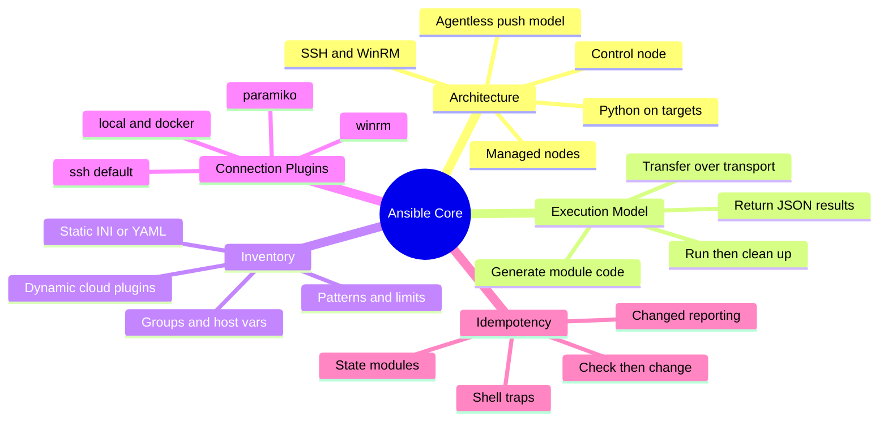
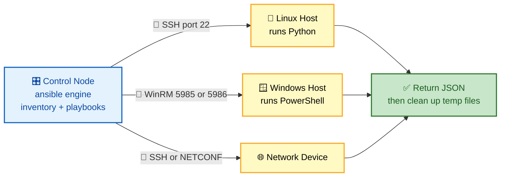
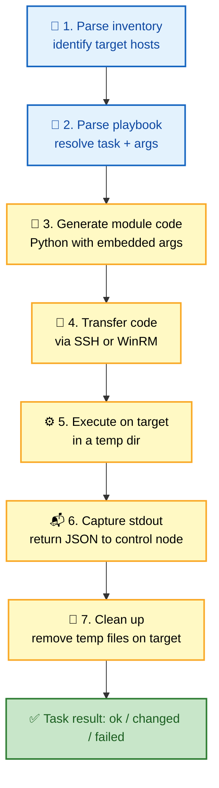
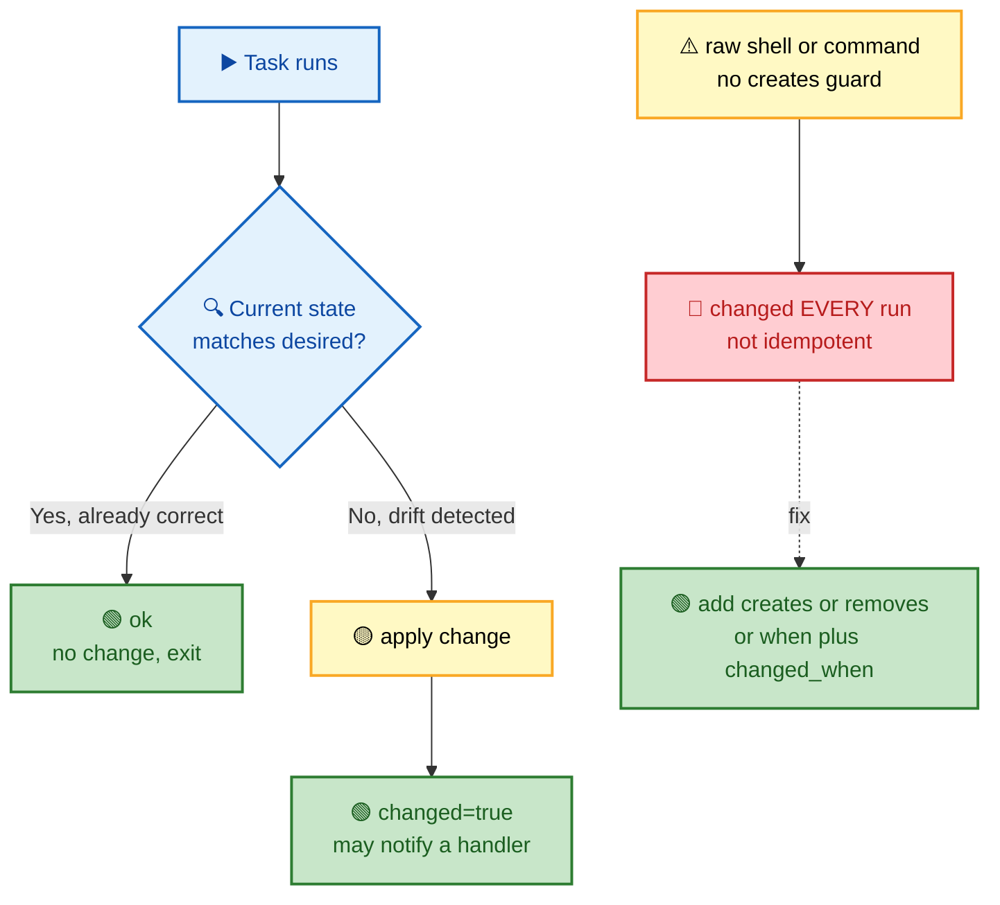

# SECTION 1: CORE CONCEPTS

> **Scope:** Section 1 of 6 | Beginner → Expert progression | FAANG-level depth
> **Coverage:** Agentless push architecture, control node vs managed nodes, connection plugins (SSH/WinRM), the module transfer/execution model, inventory (static + dynamic), and idempotency as a first-class design property.

This section builds the mental model everything else depends on: *where code runs, how it gets there, and why running a playbook twice is safe.* If you can trace a single task from the control node to a managed node and back, most other Ansible questions become consequences of that flow.

---

## 🗺️ Visual Overview

**In one line:** Ansible is an agentless, push-based engine — the control node ships generated Python (or PowerShell) over SSH/WinRM, runs it, captures JSON, and cleans up, so nothing persistent lives on your targets.

**Mind map — the whole section at a glance** (skim first, revisit last):



**Push architecture — the control node reaches out to managed nodes** (the single most tested idea):



**Task dispatch over SSH — the 7 steps a module takes to a managed node and back** (trace this end to end):



**Idempotency decision — what a well-behaved module does on every run** (green = safe, red = the shell trap):



> 🧠 **Memory hooks (mnemonics):**
> - **Agentless push:** *"Ansible reaches OUT, agents phone HOME."* Ansible pushes over SSH from the control node — nothing runs on the targets between runs.
> - **Execution loop — "Generate, Ship, Run, Reap":** generate module code → ship it over the transport → run it in a temp dir → reap the temp files and read the JSON.
> - **Idempotency:** *"Check, then change."* A good module inspects current state first and only acts if reality differs from the declared state — run it 100 times, same result.
> - **Inventory split:** *"Static is a list, dynamic is a query."* Static inventory is a file you maintain; dynamic inventory is a plugin that asks the cloud "who exists right now?"

---

## 1. Agentless, Push-Based Architecture

> 🎯 **Interview weight: Very High** — almost every Ansible interview opens here.

**In one line:** The control node generates code, pushes it to targets over an existing transport (SSH/WinRM), executes it, and disconnects — there is no long-running agent to install, patch, or secure.

Ansible splits the world into two roles:

| Role | What it is | What runs on it |
|---|---|---|
| **Control node** | The machine you run `ansible`/`ansible-playbook` from | The Ansible engine, inventory, playbooks, roles, plugins. Must be Linux/macOS (no Windows control node). |
| **Managed node** | Any host you automate | Nothing persistent. A Python interpreter (Linux) or PowerShell + WinRM (Windows) must exist to run the transferred module. |

**Why agentless wins — and its trade-offs:**

| ✅ Benefit | ⚠️ Trade-off |
|---|---|
| No agent to install, upgrade, or CVE-patch | Requires reachable SSH/WinRM + credentials |
| Zero agent resource footprint on targets | Push model = no continuous drift monitoring (unlike Puppet/Chef agents) |
| Reuses existing SSH infrastructure and bastions | Linux targets still need Python; the control node needs network reach |
| Fast to onboard a new host (just add SSH access) | Large fleets need tuning (forks, pipelining) to scale the push |

> ⚠️ **Gotcha:** "Agentless" does **not** mean "no dependencies." Linux managed nodes still need a Python interpreter, and the control node needs SSH/WinRM reachability. It's a *push* model, so there's no continuous monitoring like a Puppet/Chef agent gives you — drift is only detected the next time you run the play.

> 💡 **Interview tip:** The answer interviewers want in one breath: *"Agentless, push-based. The control node ships generated Python over SSH, runs it, collects JSON, and cleans up. Nothing persistent runs on targets."*

---

## 2. The Execution Model — How a Module Actually Runs

> 🎯 **Interview weight: High** — separates people who *use* Ansible from people who *understand* it.

**In one line:** For each task, Ansible builds a self-contained module payload, copies it to a temp directory on the target, executes it with the given arguments, reads the JSON it prints, then deletes the temp files.

The seven-step flow (see the dispatch diagram above):

1. **Parse inventory** → resolve the host pattern to a concrete host list.
2. **Parse playbook** → determine the task, module, and arguments.
3. **Generate module code** → Ansible assembles the module + its arguments into an executable payload (`AnsiballZ` wraps the module and its library deps into a single file).
4. **Transfer** → the payload is copied to a temp dir on the target over the connection plugin.
5. **Execute** → the target runs the payload with its local interpreter.
6. **Return** → the module prints a JSON result to stdout; the control node parses `changed`, `failed`, and any registered data.
7. **Clean up** → temp files are removed (unless you keep them for debugging with `ANSIBLE_KEEP_REMOTE_FILES=1`).

**Key internals that come up as follow-ups:**

- **`AnsiballZ`**: modern Ansible zips the module + dependencies into a single self-extracting Python file, so only one transfer is needed per task.
- **Pipelining**: with `pipelining = True`, Ansible sends the module over the SSH session's stdin instead of writing a temp file first — fewer SSH round-trips, big speedup. Requires `requiretty` to be disabled in sudoers.
- **Interpreter discovery**: Ansible auto-detects the Python interpreter on the target (`ansible_python_interpreter`). Mismatches cause "module failed" errors on minimal images.

> 🔍 **Deep dive:** Because every task is a *fresh* connection + payload by default, chatty playbooks are dominated by SSH round-trips. That's why fact caching, pipelining, and higher `forks` matter — they attack the transport overhead, not the module logic. (Covered in depth in [04-ADVANCED.md](04-ADVANCED.md).)

---

## 3. Connection Plugins — How Ansible Talks to a Target

> 🎯 **Interview weight: Medium** — expect it as a follow-up to the architecture question.

**In one line:** The connection plugin abstracts *transport* — swap `ssh` for `winrm`, `local`, or `docker` without changing your tasks.

| Plugin | Transport | Typical use |
|---|---|---|
| `ssh` (default) | OpenSSH binary | Linux/Unix targets; fastest, supports ControlPersist multiplexing |
| `paramiko` | Pure-Python SSH | Fallback where OpenSSH features are unavailable |
| `winrm` | WinRM (HTTP/S) | Windows targets running PowerShell modules |
| `local` | No network | Runs tasks on the control node itself (`connection: local`) |
| `docker` / `community.docker.docker` | `docker exec` | Configure running containers without SSH |
| `network_cli` / `netconf` | SSH to network OS | Cisco/Juniper/Arista device automation |

> 💡 **Interview tip:** `ssh` uses **ControlPersist** (connection multiplexing) to reuse one TCP/SSH session across many tasks — that's a major reason the default `ssh` plugin beats `paramiko` on large plays.

---

## 4. Inventory — Static and Dynamic

> 🎯 **Interview weight: High** — "how do you manage 2,000 ephemeral cloud hosts?" is a standard prompt.

**In one line:** Inventory answers "which hosts, in which groups?" — static inventory is a file you maintain; dynamic inventory is a plugin that queries the source of truth (AWS, Azure, GCP) at runtime.

**Static inventory** (INI or YAML):

```ini
[web]
web1.example.com
web2.example.com

[db]
db1.example.com ansible_host=10.0.0.5

[prod:children]
web
db

[web:vars]
http_port=80
```

**Dynamic inventory** — a plugin resolves hosts live so you never hand-edit a list of ephemeral instances:

```yaml
# inventory_aws_ec2.yml
plugin: amazon.aws.aws_ec2
regions:
  - us-east-1
keyed_groups:
  - key: tags.Role       # builds groups like tag_Role_web
    prefix: tag_Role
filters:
  instance-state-name: running
```

```bash
ansible-inventory -i inventory_aws_ec2.yml --graph   # verify what the plugin resolved
```

**Inventory concepts that surface as follow-ups:**

| Concept | Meaning |
|---|---|
| **Groups** | Named sets of hosts (`web`, `db`); `:children` nests groups |
| **`group_vars/` and `host_vars/`** | Directories auto-loaded to assign variables by group or host |
| **Patterns** | Target selection: `web:&prod` (intersection), `all:!db` (exclusion) |
| **`--limit` / `-l`** | Restrict a run to a subset without editing inventory |
| **`all` and `ungrouped`** | Implicit groups every inventory has |

> ⚠️ **Gotcha:** Two hosts that resolve to the **same** `inventory_hostname` collide — later definitions silently win. Use `ansible_host` to separate the connection address from the inventory name (e.g., inventory name `db-primary`, `ansible_host=10.0.0.5`).

> 💡 **Interview tip:** For cloud fleets, always reach for **dynamic inventory** — maintaining a static list of autoscaled instances is an anti-pattern. Pair it with `keyed_groups` so tags become groups automatically.

---

## 5. Idempotency — The Property That Makes Ansible Safe

> 🎯 **Interview weight: Very High** — a core design principle interviewers probe hard.

**In one line:** An idempotent task produces the same end state no matter how many times you run it — the module checks current state first and only changes what's drifted.

Idempotency is *designed into modules*, not automatic. State-aware modules (`file`, `package`, `service`, `template`, `copy`, `lineinfile`) inspect reality and report:

- **`ok`** — already in the desired state, nothing done.
- **`changed`** — reality differed; the module converged it (and may notify a handler).
- **`failed`** — the module could not converge.

**Idempotent by design:**

```yaml
- name: Ensure nginx is installed          # installs only if absent
  ansible.builtin.package:
    name: nginx
    state: present

- name: Ensure nginx is running + on boot  # converges runtime state
  ansible.builtin.service:
    name: nginx
    state: started
    enabled: true

- name: Deploy config, reload only on change
  ansible.builtin.template:
    src: nginx.conf.j2
    dest: /etc/nginx/nginx.conf
    validate: nginx -t -c %s               # refuse to ship a broken config
  notify: Reload nginx                      # handler fires ONLY if content changed
```

**The shell trap and how to fix it:**

```yaml
# ❌ Runs every time, always reports changed — NOT idempotent
- name: Initialize database
  ansible.builtin.command: /usr/bin/db_init

# ✅ Fix 1 — creates guard (skips if marker exists)
- name: Initialize database
  ansible.builtin.command: /usr/bin/db_init
  args:
    creates: /var/lib/db/.initialized

# ✅ Fix 2 — stat + when
- name: Check init marker
  ansible.builtin.stat:
    path: /var/lib/db/.initialized
  register: db_init
- name: Initialize database
  ansible.builtin.command: /usr/bin/db_init
  when: not db_init.stat.exists

# ✅ Fix 3 — custom changed_when
- name: Apply setting only if missing
  ansible.builtin.shell: |
    grep -q "setting=value" /etc/config || echo "setting=value" >> /etc/config
  register: r
  changed_when: "'setting=value' not in lookup('file', '/etc/config')"
```

> ⚠️ **Gotcha:** `command` and `shell` are the classic idempotency traps — they run *every* time and always report `changed`. Guard them with `creates:`/`removes:`, a `when:` + `stat` check, or a custom `changed_when:` so they only act (and report change) when something truly changed.

> 💡 **Interview tip:** Tie idempotency to *safety and CI*: because a converged play reports zero `changed`, you can run it on every deploy and even gate PRs on "no unexpected changes" using `--check --diff` (dry run).

---

## Interview Questions & Answers

### Q1: Explain Ansible's architecture and why it is agentless. What are the trade-offs?

**Answer:** Ansible is push-based and agentless. A control node holds the engine, inventory, and playbooks; it connects to managed nodes over SSH (Linux) or WinRM (Windows), pushes generated module code, executes it, returns JSON, and cleans up. Nothing persistent runs on targets.

**Internals:** For each task Ansible builds an `AnsiballZ` payload (module + args + deps), copies it to a temp dir, runs it with the target's interpreter, parses the JSON (`changed`/`failed`), then deletes the temp files. The default `ssh` plugin uses ControlPersist multiplexing to reuse connections.

**Trade-offs:** No agent to patch or secure and instant onboarding, but you must have SSH/WinRM reachability and (for Linux) Python on the target, and the push model gives no continuous drift detection between runs.

**Follow-up — "Why can't the control node be Windows?"** The engine relies on POSIX/Python behaviors for connection handling and module execution; Windows is a first-class *managed* node (via WinRM) but not a supported control node. Use WSL if you must drive from Windows.

---

### Q2: Walk me through exactly what happens when a single task runs against a remote host.

**Answer:** Ansible resolves the host pattern from inventory, determines the module and arguments, generates a self-contained payload, transfers it over the connection plugin to a temp directory, executes it with the remote interpreter, reads the JSON result, and removes the temp files.

**Internals:** With `pipelining = True`, the payload is streamed over the SSH session's stdin instead of being written to a temp file first, cutting SSH round-trips. Interpreter discovery picks the target's Python (`ansible_python_interpreter`); a wrong interpreter is a common "module failed" cause on slim images.

**Follow-up — "Why are chatty playbooks slow even when each module is fast?"** Because per-task SSH round-trips dominate. Fix with pipelining, fact caching, higher `forks`, and (optionally) the Mitogen strategy — all attack transport overhead, not module logic.

---

### Q3: How do you manage inventory for thousands of ephemeral autoscaled instances?

**Answer:** Use **dynamic inventory** plugins (e.g., `amazon.aws.aws_ec2`) that query the cloud API at runtime, so you never maintain a hand-edited host list. Use `keyed_groups` to turn tags into groups and `filters` to include only `running` instances.

**Internals:** The plugin runs on every invocation and returns a fresh host graph; `ansible-inventory --graph` lets you verify grouping. Combine with `group_vars/` keyed on the generated group names so configuration follows tags automatically.

**Follow-up — "Static vs dynamic, when static?"** Static is fine for small, stable fleets (a few pets, lab hosts) where a file is simpler than a plugin. Anything autoscaled or cloud-native should be dynamic.

---

### Q4: What is idempotency, and how do you make a `shell` task idempotent?

**Answer:** Idempotency means repeated runs converge to the same state with no side effects after the first. State modules achieve it by checking current state and only changing drift. `shell`/`command` are *not* idempotent by default — they run every time.

**Internals:** Guard them three ways: `creates:`/`removes:` (skip if a marker path exists/absent), a `stat` + `when:` precondition, or a custom `changed_when:`/`failed_when:` so Ansible reports `changed` only when reality actually changed.

**Follow-up — "How does this help CI?"** A converged play reports zero `changed`; running `ansible-playbook --check --diff` in CI turns "unexpected change" into a failing gate, catching drift and accidental mutations before deploy.

---

## 🔧 Troubleshooting

| Symptom | Likely cause | Fix |
|---|---|---|
| `SSH Error: Permission denied` | Wrong `ansible_user`, key perms, or missing key | Test `ssh -vvv user@host`; ensure key is `chmod 600`; set `ansible_user`/`ansible_ssh_private_key_file` |
| `/usr/bin/python: not found` | Interpreter discovery failed on slim image | Set `ansible_python_interpreter=/usr/bin/python3` in inventory |
| Task reports `changed` every run | Unguarded `shell`/`command` | Add `creates:`/`removes:`, `when:` + `stat`, or `changed_when:` |
| Host appears in wrong/no group | Dynamic inventory grouping or pattern error | `ansible-inventory --graph`; check `keyed_groups`/`filters` |
| Two hosts collide | Duplicate `inventory_hostname` | Separate name from address via `ansible_host=` |

---

## ✅ Best Practices

- **Pin the Python interpreter** per group to avoid discovery surprises (`ansible_python_interpreter`).
- **Prefer state modules** (`package`, `service`, `file`, `template`) over `shell`/`command`; reach for raw commands only when no module exists, and always guard them.
- **Use dynamic inventory** for any cloud/autoscaled fleet; drive grouping from tags via `keyed_groups`.
- **Enable pipelining** (`pipelining = True`) and raise `forks` once you have more than a handful of hosts.
- **Validate before applying** with `validate:` on config modules and `--check --diff` in CI.

---

## 📚 Documentation Links

- [How Ansible Works](https://docs.ansible.com/ansible/latest/getting_started/index.html)
- [Connection plugins](https://docs.ansible.com/ansible/latest/plugins/connection.html)
- [Intro to inventory](https://docs.ansible.com/ansible/latest/inventory_guide/intro_inventory.html)
- [Dynamic inventory](https://docs.ansible.com/ansible/latest/inventory_guide/intro_dynamic_inventory.html)

---

**[← Back to Ansible Index](README.md)** | **[Next: Playbooks →](02-PLAYBOOKS.md)**
