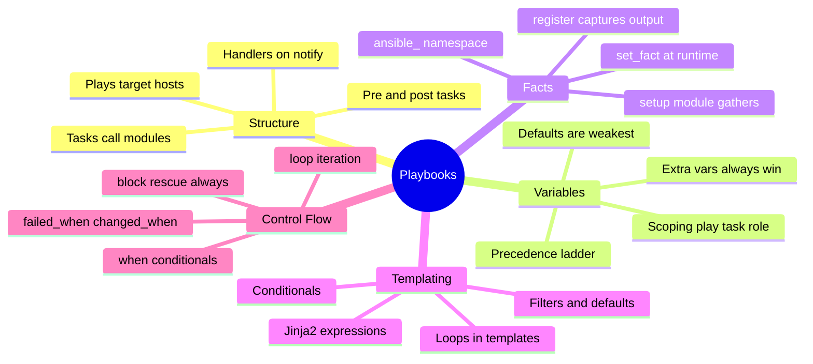
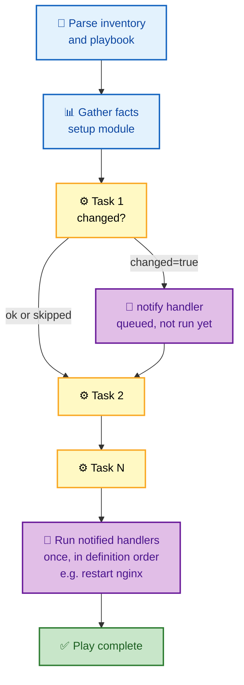
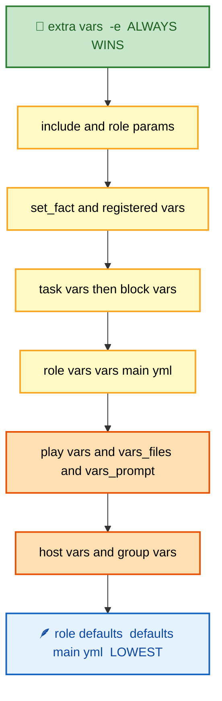
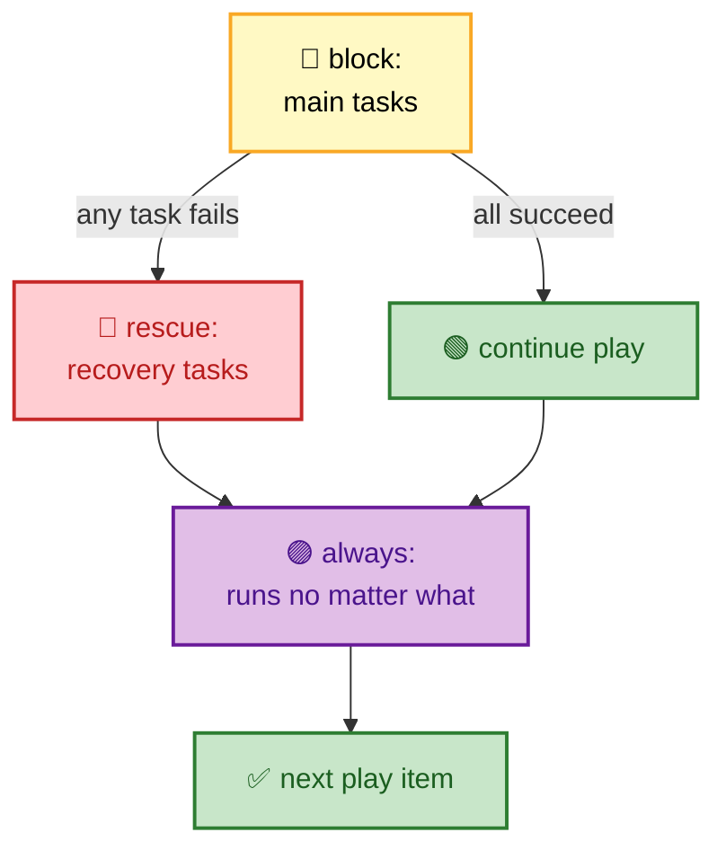

# SECTION 2: PLAYBOOKS

> **Scope:** Section 2 of 6 | Beginner → Expert progression | FAANG-level depth
> **Coverage:** Plays, tasks, and handlers; the playbook execution order; variables and the full precedence ladder; facts (`setup`, `register`, `set_fact`); Jinja2 templating and filters; conditionals and loops; and error handling (`block`/`rescue`/`always`, `failed_when`, `ignore_errors`).

A playbook is the declarative program Ansible runs. This section is about *control flow*: what runs, in what order, with which variables, and what happens when something fails. Handlers and variable precedence are the two areas interviewers probe hardest.

---

## 🗺️ Visual Overview

**In one line:** A playbook is a top-to-bottom list of tasks with deferred handlers and a strict variable-precedence ladder — master the order of evaluation and error handling and playbooks stop surprising you.

**Mind map — the whole section at a glance** (skim first, revisit last):



**Playbook execution — tasks run top to bottom, handlers fire once at the end**:



**Variable precedence — who wins?** (highest at top, lowest at bottom):



**Error handling — block, rescue, always** (green = success path, red = failure path, purple = guaranteed cleanup):



> 🧠 **Memory hooks (mnemonics):**
> - **Handlers rule — "Notify now, run later":** handlers fire once, at the *end* of the play, and only if a task reported `changed`.
> - **Precedence anchors — "Defaults lose, extra vars rule":** `defaults/main.yml` is the weakest source; `-e` on the CLI beats everything.
> - **Error trio — "Block tries, rescue saves, always cleans":** `block` = the try, `rescue` = the catch, `always` = the finally.
> - **Fact sources — "Setup gathers, register captures, set_fact declares":** three distinct ways variables appear at runtime.

---

## 1. Plays, Tasks, and Handlers

> 🎯 **Interview weight: High** — handler timing is a favorite gotcha.

**In one line:** A play binds a host pattern to an ordered list of tasks; handlers are special tasks that run once at the end of the play, and only when notified by a `changed` task.

```yaml
- name: Configure web tier          # a PLAY
  hosts: web
  become: true
  tasks:
    - name: Install nginx           # a TASK
      ansible.builtin.package:
        name: nginx
        state: present

    - name: Deploy config
      ansible.builtin.template:
        src: nginx.conf.j2
        dest: /etc/nginx/nginx.conf
      notify: Reload nginx          # queues the handler IF this changed

  handlers:
    - name: Reload nginx            # a HANDLER — runs once, at play end
      ansible.builtin.service:
        name: nginx
        state: reloaded
```

**Handler semantics that trip people up:**

| Behavior | Detail |
|---|---|
| **Deferred** | Handlers run after *all* tasks in the play, not immediately on `notify`. |
| **De-duplicated** | Notified many times → runs **once**. |
| **Conditional** | Only run if the notifying task reported `changed`. |
| **Order** | Run in the order they are *defined* in `handlers:`, not the order notified. |
| **Failure skips them** | If the play aborts before the handler flush, the handler never runs — use `--force-handlers` or `meta: flush_handlers` to force it. |

> ⚠️ **Gotcha:** If a later task fails, *previously notified handlers may never run* because the flush happens at the end. Insert `- meta: flush_handlers` to force queued handlers to run at a specific point (e.g., restart a service before a health-check task).

> 💡 **Interview tip:** The crisp handler summary: *"Notify only fires on change, handlers run once at the end in definition order, and a mid-play failure can skip them unless you flush."*

---

## 2. Variables and the Precedence Ladder

> 🎯 **Interview weight: Very High** — "which value wins?" is asked constantly.

**In one line:** When the same variable is defined in multiple places, Ansible resolves it by a fixed precedence ladder — `defaults/` is the weakest and CLI `-e` extra vars beat everything.

Full precedence, lowest → highest (the pieces interviewers actually ask about are bolded):

1. **role defaults** (`defaults/main.yml`) ← weakest
2. inventory file / script group vars
3. inventory `group_vars/all`
4. playbook `group_vars/all`
5. inventory `group_vars/*`
6. playbook `group_vars/*`
7. inventory host vars
8. inventory `host_vars/*`
9. playbook `host_vars/*`
10. host facts / cached `set_fact`
11. play vars
12. play `vars_prompt`
13. play `vars_files`
14. **role vars** (`vars/main.yml`)
15. block vars
16. task vars
17. `include_vars`
18. `set_fact` / registered vars
19. role params
20. include params
21. **extra vars (`-e`)** ← always wins

**The two anchors you must remember:**

| Source | Precedence | Use it for |
|---|---|---|
| `defaults/main.yml` | Weakest | Sensible defaults *meant to be overridden* by consumers |
| `vars/main.yml` | Strong | Values that should *not* be casually overridden |
| `-e "key=val"` | Highest | One-off overrides, CI parameters, emergency changes |

> ⚠️ **Gotcha:** Because `-e` beats everything, a stray `-e` in a CI job can silently override even role `vars/`. Audit extra vars carefully; they are a common "why is prod using the wrong value?" root cause.

> 💡 **Interview tip:** If you only memorize two rules: **`defaults/` is the floor, `-e` is the ceiling.** Put "safe to override" in `defaults/`, "must hold" in `vars/`.

---

## 3. Facts and Runtime Variables

> 🎯 **Interview weight: High** — `register`, `set_fact`, and fact gathering come up together.

**In one line:** Facts are variables discovered at runtime — `setup` gathers system facts, `register` captures a task's result, and `set_fact` declares your own runtime variable.

| Mechanism | Source | Example |
|---|---|---|
| **Gathered facts** | `setup` module (auto-runs unless `gather_facts: false`) | `ansible_os_family`, `ansible_default_ipv4.address`, `ansible_memtotal_mb` |
| **`register`** | Captures a task's return dict | `register: result` → `result.stdout`, `result.rc`, `result.changed` |
| **`set_fact`** | Declares a variable during the run | `set_fact: app_port=8080` (persists for the host across the play) |

```yaml
- name: Gather only network facts (faster)
  ansible.builtin.setup:
    gather_subset: network

- name: Run a command and capture output
  ansible.builtin.command: id -un
  register: whoami_out

- name: Derive a fact from the result
  ansible.builtin.set_fact:
    running_user: "{{ whoami_out.stdout }}"

- name: Use gathered fact in a condition
  ansible.builtin.debug:
    msg: "Family is {{ ansible_os_family }}"
```

> 💡 **Interview tip:** Fact gathering is expensive at scale. Disable it (`gather_facts: false`) when tasks don't need facts, use `gather_subset` to limit collection, and enable **fact caching** to reuse facts across runs (see [04-ADVANCED.md](04-ADVANCED.md)).

> 🔍 **Deep dive:** `set_fact` values are **host-scoped and persist** for the rest of the play, unlike `vars` which are evaluated lazily. `cacheable: true` on `set_fact` also writes to the fact cache.

---

## 4. Jinja2 Templating

> 🎯 **Interview weight: Medium-High** — expect a filter or `default` question.

**In one line:** Ansible uses Jinja2 (`{{ }}` expressions, `` statements, `|` filters) to render variables, config files, and conditionals.

Common filters that show up in interviews:

| Filter | Purpose | Example |
|---|---|---|
| `default` | Fallback for undefined vars | `{{ port | default(8080) }}` |
| `mandatory` | Fail loudly if undefined | `{{ token | mandatory }}` |
| `to_json` / `to_nice_yaml` | Serialize data | `{{ data | to_nice_yaml }}` |
| `map` / `select` / `selectattr` | Transform/filter lists | `{{ hosts | map(attribute='name') | list }}` |
| `combine` | Merge dicts | `{{ base | combine(overrides) }}` |
| `regex_replace` | Rewrite strings | `{{ name | regex_replace('^web', 'app') }}` |
| `b64encode` / `b64decode` | Base64 | `{{ secret | b64encode }}` |

```jinja
# nginx.conf.j2
upstream app {

    server {{ hostvars[host].ansible_default_ipv4.address }}:8080;

}
listen {{ http_port | default(80) }};
```

> ⚠️ **Gotcha:** An **undefined variable** raises an error at render time. Guard optional values with `| default(...)`, and use `| mandatory` to make a *required* value fail early and clearly instead of producing a broken config.

---

## 5. Conditionals and Loops

> 🎯 **Interview weight: Medium** — `when` + `loop` interactions are the interesting part.

**In one line:** `when:` skips a task based on a condition; `loop:` (with `loop_control`) iterates a task over a list.

```yaml
- name: Install on Debian family only
  ansible.builtin.apt:
    name: nginx
    state: present
  when: ansible_os_family == "Debian"

- name: Create several users
  ansible.builtin.user:
    name: "{{ item.name }}"
    groups: "{{ item.groups }}"
  loop:
    - { name: alice, groups: wheel }
    - { name: bob, groups: docker }
  loop_control:
    label: "{{ item.name }}"      # cleaner output than dumping the whole dict

- name: Retry a flaky check until healthy
  ansible.builtin.uri:
    url: http://localhost:8080/health
  register: health
  until: health.status == 200
  retries: 5
  delay: 3
```

| Construct | Meaning |
|---|---|
| `when:` | Skip task unless condition is truthy (Jinja, no `{{ }}` needed) |
| `loop:` | Iterate over a list (`item` is the loop var) |
| `loop_control.label` | Control per-iteration output |
| `until` + `retries` + `delay` | Poll until a condition holds (great for readiness) |
| `with_*` (legacy) | Older loop keywords; prefer `loop` + filters |

> ⚠️ **Gotcha:** `when:` on a task with a `loop:` is evaluated **per item**, not once for the whole loop. If you want to skip the entire loop, guard it at a `block` level instead.

---

## 6. Error Handling

> 🎯 **Interview weight: High** — resilient playbooks are a senior-level signal.

**In one line:** `block`/`rescue`/`always` is try/catch/finally for tasks; `failed_when`/`changed_when`/`ignore_errors` let you redefine what "failure" and "change" mean.

```yaml
- name: Resilient deploy
  block:
    - name: Apply migration
      ansible.builtin.command: /opt/app/migrate.sh
  rescue:
    - name: Roll back on failure
      ansible.builtin.command: /opt/app/rollback.sh
    - name: Alert
      ansible.builtin.debug:
        msg: "Migration failed, rolled back"
  always:
    - name: Always record run
      ansible.builtin.command: /opt/app/record_run.sh

- name: Treat rc 2 as success, not failure
  ansible.builtin.command: /usr/bin/check
  register: r
  failed_when: r.rc not in [0, 2]

- name: Never fail the play for this optional step
  ansible.builtin.command: /usr/bin/optional
  ignore_errors: true
```

| Keyword | Effect |
|---|---|
| `block` / `rescue` / `always` | try / catch / finally for a group of tasks |
| `failed_when` | Redefine the failure condition |
| `changed_when` | Redefine when a task reports `changed` (key for idempotency) |
| `ignore_errors: true` | Continue even if the task fails (use sparingly) |
| `any_errors_fatal: true` | Abort the *whole play* if any host fails a task |
| `max_fail_percentage` | With `serial`, halt a rollout if too many hosts fail |

> 💡 **Interview tip:** Pair `serial:` with `max_fail_percentage:` for safe rolling deploys: *"roll out in batches, and if more than X% of a batch fails, stop before touching the rest of the fleet."*

---

## Interview Questions & Answers

### Q1: When exactly do handlers run, and how can a handler get skipped?

**Answer:** Handlers run **once, at the end of the play**, in the order they're *defined*, and only if a notifying task reported `changed`. They're de-duplicated across multiple notifies.

**Internals:** Notifications queue the handler; the flush happens after the task list. If a later task fails and aborts the play before the flush, queued handlers are skipped. Force them with `- meta: flush_handlers` at a chosen point, or `--force-handlers`.

**Follow-up — "You need nginx restarted before a smoke-test task mid-play. How?"** Insert `- meta: flush_handlers` right before the smoke test so the restart handler runs immediately instead of waiting for play end.

---

### Q2: Two files define `app_port` differently — one in `defaults/main.yml`, one passed as `-e`. Which wins and why?

**Answer:** The `-e` extra var wins. `defaults/main.yml` is the *lowest* precedence source (meant to be overridden); `-e` is the *highest* and beats every other source.

**Internals:** Ansible merges variables along a fixed ladder of ~21 levels. `defaults` sits at the bottom, role `vars/` near the top, and CLI extra vars at the very top. This is why "safe to override" values live in `defaults/` and "must not be overridden" values live in `vars/`.

**Follow-up — "A CI job's value keeps overriding role `vars/`. Why?"** Because `-e` in the CI command outranks even role `vars/`. Audit the pipeline's extra vars — a stray `-e` is a classic prod-config incident.

---

### Q3: How do `register`, `set_fact`, and gathered facts differ?

**Answer:** Gathered facts come from the `setup` module (system properties like `ansible_os_family`). `register` captures the return dict of a single task. `set_fact` declares your own variable at runtime, host-scoped, persisting for the rest of the play.

**Internals:** Registered vars are per-task and hold `stdout`/`rc`/`changed`. `set_fact` with `cacheable: true` also writes to the fact cache. Gathering can be limited with `gather_subset` or skipped with `gather_facts: false` for speed.

**Follow-up — "Playbook is slow across 1,000 hosts. First thing you check?"** Fact gathering. Disable it where unneeded, subset it, and enable fact caching so facts are reused across runs.

---

### Q4: How do you make a playbook resilient to a failing step without aborting everything?

**Answer:** Wrap risky tasks in a `block` with a `rescue` (recovery/rollback) and `always` (cleanup). For expected non-zero exits, use `failed_when`; for optional steps, `ignore_errors`. For fleet-wide safety, combine `serial` with `max_fail_percentage`.

**Internals:** `rescue` runs only if a task in the `block` fails; `always` runs regardless. `failed_when`/`changed_when` let you redefine outcome semantics so a "checker" command that returns 2 isn't treated as a failure.

**Follow-up — "Difference between `ignore_errors` and `failed_when: false`?"** `ignore_errors: true` still marks the task failed (red) but continues; `failed_when: false` *reclassifies* it as not-failed. The latter is cleaner when you genuinely expect non-zero and don't want noise.

---

## 🔧 Troubleshooting

| Symptom | Likely cause | Fix |
|---|---|---|
| Handler didn't run | Task reported `ok` (no change) or play aborted before flush | Check the notifying task's status; add `meta: flush_handlers` |
| "undefined variable" at render | Missing var in a template/condition | Add `| default(...)`, or `| mandatory` to fail clearly |
| Wrong value used in prod | Higher-precedence source overrides | Trace precedence; audit `-e` and `vars/` vs `defaults/` |
| `when` skips every host | Condition references undefined/wrong fact | `-vvv` or `debug: var=ansible_os_family` to inspect facts |
| Loop task fails on one item | Per-item `when`/error | Use `loop_control.label` + `ignore_errors` or `block`-level guard |

---

## ✅ Best Practices

- Put overridable values in `defaults/`, hard constraints in `vars/`; keep `-e` for genuine one-offs.
- Use handlers + `notify` for service restarts so they fire only on real change.
- Guard optional template values with `default()`; make required ones `mandatory`.
- Disable/subset fact gathering when not needed; enable fact caching at scale.
- Wrap risky operations in `block/rescue/always`; use `serial` + `max_fail_percentage` for rolling safety.

---

## 📚 Documentation Links

- [Intro to playbooks](https://docs.ansible.com/ansible/latest/playbook_guide/playbooks_intro.html)
- [Variable precedence](https://docs.ansible.com/ansible/latest/playbook_guide/playbooks_variables.html#variable-precedence-where-should-i-put-a-variable)
- [Handlers](https://docs.ansible.com/ansible/latest/playbook_guide/playbooks_handlers.html)
- [Error handling (blocks)](https://docs.ansible.com/ansible/latest/playbook_guide/playbooks_blocks.html)
- [Jinja2 filters](https://docs.ansible.com/ansible/latest/playbook_guide/playbooks_filters.html)

---

**[← Previous: Core Concepts](01-CORE-CONCEPTS.md)** | **[Ansible Index](README.md)** | **[Next: Roles & Collections →](03-ROLES-COLLECTIONS.md)**
