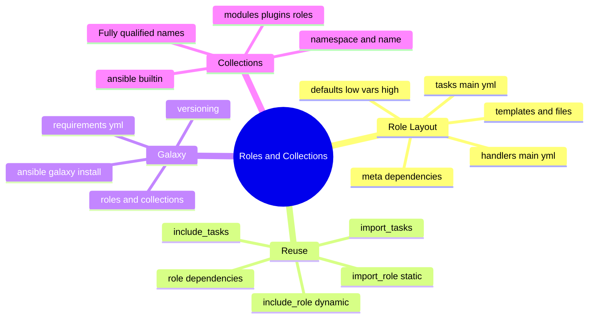
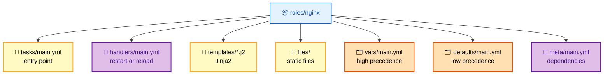
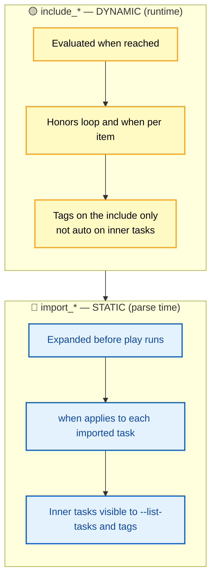

# SECTION 3: ROLES & COLLECTIONS

> **Scope:** Section 3 of 6 | Beginner → Expert progression | FAANG-level depth
> **Coverage:** Role directory structure and auto-loading, `defaults/` vs `vars/`, role dependencies (`meta/main.yml`), `include_role` vs `import_role` (and `include_tasks` vs `import_tasks`), Ansible Galaxy, collections and FQCN, and patterns for building reusable, composable automation.

Roles are how you turn a pile of tasks into a reusable, shareable unit. Collections are how you package and distribute roles, modules, and plugins. This section is about *reuse and composition* — the static-vs-dynamic import distinction is the highest-value interview topic here.

---

## 🗺️ Visual Overview

**In one line:** A role is a convention-based directory Ansible auto-loads; a collection is the distributable bundle (roles + modules + plugins) you install from Galaxy and reference by fully-qualified name.

**Mind map — the whole section at a glance** (skim first, revisit last):



**Role directory structure — the standard layout Ansible auto-loads**:



**include vs import — dynamic (runtime) vs static (parse-time)** (yellow = evaluated while running, blue = expanded before the play starts):



> 🧠 **Memory hooks (mnemonics):**
> - **Role layout — "The Handy Table Forgets Very Detailed Metadata":** **T**asks, **H**andlers, **T**emplates, **F**iles, **V**ars, **D**efaults, **M**eta.
> - **defaults vs vars — "Defaults are polite, vars are firm":** `defaults/` is the lowest precedence (meant to be overridden); `vars/` is high precedence (hold your ground).
> - **include vs import — "incluDe = Dynamic, imPort = Parse-time":** `include_*` is decided at runtime (loops/conditionals per item); `import_*` is expanded statically before the play runs.
> - **FQCN — "namespace.collection.thing":** `ansible.builtin.file`, `community.docker.docker_container` — three dotted parts, always.

---

## 1. Role Structure and Auto-Loading

> 🎯 **Interview weight: High** — know which directories auto-load `main.yml`.

**In one line:** A role is a directory with well-known subfolders; when you include the role, Ansible automatically loads `main.yml` from each (`tasks/`, `handlers/`, `defaults/`, `vars/`, `meta/`) and finds `templates/` and `files/` by convention.

```
roles/
└── nginx/
    ├── tasks/main.yml        # entry point (auto-loaded)
    ├── handlers/main.yml     # restart/reload handlers (auto-loaded)
    ├── templates/nginx.conf.j2   # Jinja2, found by the template module
    ├── files/ssl-cert.pem   # static files, found by copy/file modules
    ├── vars/main.yml         # high-precedence variables (auto-loaded)
    ├── defaults/main.yml     # low-precedence defaults (auto-loaded)
    ├── meta/main.yml         # dependencies + Galaxy metadata
    └── README.md             # documentation
```

| Directory | Auto-loads `main.yml`? | Purpose |
|---|---|---|
| `tasks/` | ✅ | Role's task list — the entry point |
| `handlers/` | ✅ | Handlers notified by tasks |
| `defaults/` | ✅ | Lowest-precedence variables (override-friendly) |
| `vars/` | ✅ | High-precedence variables |
| `meta/` | ✅ | Dependencies + Galaxy metadata |
| `templates/` | ❌ (path convention) | Jinja2 templates resolved by `template:` |
| `files/` | ❌ (path convention) | Static files resolved by `copy:`/`file:` |

```yaml
# roles/nginx/tasks/main.yml
- name: Load OS-specific vars
  ansible.builtin.include_vars: "{{ ansible_os_family }}.yml"

- name: Install nginx
  ansible.builtin.package:
    name: "{{ nginx_package }}"
    state: present

- name: Deploy config (validated), reload on change
  ansible.builtin.template:
    src: nginx.conf.j2
    dest: "{{ nginx_conf_path }}"
    validate: nginx -t -c %s
  notify: Reload nginx
```

> 💡 **Interview tip:** The mnemonic **T-H-T-F-V-D-M** nails the layout. Add the precedence nuance: `defaults/main.yml` is the *weakest* source and `vars/main.yml` is *strong* — put tunables in defaults, invariants in vars.

---

## 2. defaults/ vs vars/ — Where a Variable Belongs

> 🎯 **Interview weight: Medium-High** — ties directly to the precedence ladder from Section 2.

**In one line:** `defaults/` holds values a consumer is *expected* to override; `vars/` holds values that should *not* be casually overridden.

| Aspect | `defaults/main.yml` | `vars/main.yml` |
|---|---|---|
| Precedence | Lowest of all sources | High (only play/task/extra vars beat it) |
| Intent | Sane defaults, tunable knobs | Internal constants, derived values |
| Override by group/host vars? | Yes (easily) | No (they outrank inventory vars) |
| Example | `nginx_worker_processes: 2` | `nginx_service_name: nginx` |

> ⚠️ **Gotcha:** Putting a value in `vars/` that users need to customize is a common design bug — inventory `group_vars`/`host_vars` *can't* override `vars/`, so consumers get stuck. If it's meant to be tuned, it belongs in `defaults/`.

---

## 3. include vs import — The Key Distinction

> 🎯 **Interview weight: Very High** — the most-asked roles question.

**In one line:** `import_*` is **static** (expanded when the playbook is parsed); `include_*` is **dynamic** (evaluated when execution reaches it) — the difference governs how loops, conditionals, and tags behave.

| Dimension | `import_role` / `import_tasks` (static) | `include_role` / `include_tasks` (dynamic) |
|---|---|---|
| When resolved | Parse time (before play runs) | Runtime (when the line executes) |
| Works with `loop:`? | ❌ No (can't loop an import) | ✅ Yes (loop the include) |
| `when:` behavior | Applied to *each* imported task | Applied *once* to the include as a whole |
| Visible to `--list-tasks`/tags | ✅ Inner tasks visible | ❌ Only the include statement |
| Tag inheritance | Inner tasks inherit tags | Must tag the include itself |
| Best for | Predictable, always-run composition | Conditional/looped inclusion decided at runtime |

```yaml
# STATIC — expanded up front, inner tasks tag-visible
- import_role:
    name: common

# DYNAMIC — chosen at runtime, can loop
- include_role:
    name: "{{ item }}"
  loop:
    - nginx
    - app
  when: environment == "prod"
```

> ⚠️ **Gotcha:** You **cannot** `loop:` an `import_*` — imports are resolved before any loop variable exists. If you need to include something conditionally or in a loop, you *must* use `include_*`.

> 💡 **Interview tip:** One-liner: *"Import is static and happens at parse time so it's visible to tags and `--list-tasks` but can't loop; include is dynamic and happens at runtime so it supports loops and per-item conditionals but hides its inner tasks from tag selection."*

---

## 4. Role Dependencies

> 🎯 **Interview weight: Medium** — know the ordering and the de-dup rule.

**In one line:** `meta/main.yml` can declare `dependencies:` that Ansible runs **before** the role's own tasks, in listed order.

```yaml
# roles/nginx/meta/main.yml
dependencies:
  - role: common
  - role: firewall
    vars:
      firewall_allowed_ports: [80, 443]

galaxy_info:
  author: Platform Team
  description: Install and configure nginx
  license: MIT
  min_ansible_version: "2.12"
  platforms:
    - name: Ubuntu
      versions: [focal, jammy]
```

**Dependency behavior:**

| Rule | Detail |
|---|---|
| **Order** | Dependencies run before the role's `tasks/main.yml`, top to bottom. |
| **De-duplication** | By default a role runs **once** even if depended on multiple times, *unless* `allow_duplicates: true` or it's called with different params. |
| **Alternative** | Many teams avoid `meta` dependencies in favor of explicit `import_role`/`include_role` for clearer ordering. |

> ⚠️ **Gotcha:** Role de-duplication means a shared dependency (e.g., `common`) runs only once — if you *intend* it to run per-parent, set `allow_duplicates: true`. Conversely, surprising "why didn't my dependency run again?" bugs trace back to this default.

---

## 5. Ansible Galaxy, Collections, and FQCN

> 🎯 **Interview weight: Medium-High** — collections + FQCN are modern-Ansible table stakes.

**In one line:** Galaxy is the public hub for sharing roles and collections; a **collection** bundles roles + modules + plugins under a `namespace.name`, and you reference its content by **FQCN** (fully-qualified collection name).

```yaml
# requirements.yml — pin everything for reproducible runs
roles:
  - name: geerlingguy.nginx
    version: "3.1.4"
collections:
  - name: community.docker
    version: "3.4.0"
  - name: amazon.aws
    version: "6.0.0"
```

```bash
ansible-galaxy install -r requirements.yml          # roles
ansible-galaxy collection install -r requirements.yml   # collections
ansible-galaxy collection list                      # what's installed
```

**FQCN — why it matters:**

| Form | Example | Notes |
|---|---|---|
| FQCN (preferred) | `ansible.builtin.file`, `community.docker.docker_container` | Unambiguous; required for collection content |
| Short name (legacy) | `file`, `copy` | Works for `ansible.builtin` but discouraged; ambiguous across collections |

> ⚠️ **Gotcha:** Since Ansible 2.10, most modules moved *out* of the core package into collections. Relying on short names can break when two collections provide a same-named module — always use FQCN in production playbooks and pin collection versions in `requirements.yml`.

> 💡 **Interview tip:** Explain the 2.10 split cleanly: *"`ansible-core` ships the engine + `ansible.builtin`; everything else lives in versioned collections installed from Galaxy/Automation Hub and referenced by FQCN."*

---

## Interview Questions & Answers

### Q1: What's the difference between `import_role` and `include_role`? When must you use each?

**Answer:** `import_role` is **static** — expanded at playbook parse time. `include_role` is **dynamic** — evaluated at runtime. You *must* use `include_role` when the inclusion depends on a loop or a runtime condition, because imports are resolved before loop variables exist.

**Internals:** Static imports make inner tasks visible to `--list-tasks` and tag selection, and `when:` applies to each imported task individually. Dynamic includes hide inner tasks from tag selection, and `when:`/`loop:` apply to the include as a unit.

**Follow-up — "Why can't I `loop` an `import_role`?"** Because the import is expanded before the play runs, when no `item` exists yet. Loops are a runtime construct, so they only work with dynamic `include_role`.

---

### Q2: Should a customizable value go in `defaults/main.yml` or `vars/main.yml`?

**Answer:** `defaults/main.yml`. It's the lowest-precedence source, so consumers can override it via `group_vars`/`host_vars`/`-e`. `vars/main.yml` is high precedence and can't be overridden by inventory vars, so it's for internal constants you *don't* want tweaked.

**Internals:** On the precedence ladder, `defaults` is the floor and `vars` sits near the top (only play vars, block/task vars, and extra vars beat it). Mis-placing a tunable in `vars/` leaves consumers unable to override it from inventory.

**Follow-up — "A user says they can't override `nginx_port` from `group_vars`. Why?"** It was defined in `vars/` (which outranks inventory group vars). Move it to `defaults/`.

---

### Q3: How do role dependencies execute, and what is the de-duplication rule?

**Answer:** Dependencies declared in `meta/main.yml` run **before** the role's own tasks, in listed order. By default a role runs only **once** even if multiple roles depend on it, unless `allow_duplicates: true` or it's invoked with different parameters.

**Internals:** This de-dup prevents a shared `common` role from re-running for each parent. Many teams prefer explicit `import_role`/`include_role` over `meta` dependencies for clearer, more debuggable ordering.

**Follow-up — "You need a `common` role to actually run twice. How?"** Set `allow_duplicates: true` in `common`'s `meta/main.yml`, or call it explicitly with differing parameters.

---

### Q4: What changed with collections in Ansible 2.10, and why use FQCN?

**Answer:** In 2.10 the monolithic Ansible split into `ansible-core` (engine + `ansible.builtin`) plus versioned **collections** for everything else, installed from Galaxy/Automation Hub. FQCN (`namespace.collection.module`) references content unambiguously.

**Internals:** Short names still work for `ansible.builtin`, but two collections can ship a same-named module, so short names are ambiguous and fragile. Pinning collections in `requirements.yml` makes runs reproducible.

**Follow-up — "How do you guarantee the same module versions across dev and CI?"** Commit a `requirements.yml` with pinned role and collection versions and install it in every environment (`ansible-galaxy collection install -r requirements.yml`).

---

## 🔧 Troubleshooting

| Symptom | Likely cause | Fix |
|---|---|---|
| Can't override a role variable from inventory | Value is in `vars/`, not `defaults/` | Move tunable to `defaults/main.yml` |
| `import_role` with `loop` errors | Imports can't loop | Switch to `include_role` |
| Tags don't select tasks inside a role | Role was dynamically `include`d | Use `import_role`, or tag the include itself |
| Dependency didn't re-run | Role de-duplication | Set `allow_duplicates: true` or call with different params |
| `couldn't resolve module` | Missing/unpinned collection or short name clash | Install the collection; use FQCN; pin in `requirements.yml` |

---

## ✅ Best Practices

- Follow the standard role layout; keep `tasks/main.yml` thin and split logic into `install.yml`/`configure.yml` included from it.
- Put tunables in `defaults/`, invariants in `vars/`.
- Prefer explicit `import_role`/`include_role` over `meta` dependencies for readable ordering.
- Always use **FQCN** and pin role/collection versions in `requirements.yml`.
- Ship a role `README.md` documenting every `defaults/` variable so consumers know the knobs.

---

## 📚 Documentation Links

- [Roles](https://docs.ansible.com/ansible/latest/playbook_guide/playbooks_reuse_roles.html)
- [Re-using Ansible (include vs import)](https://docs.ansible.com/ansible/latest/playbook_guide/playbooks_reuse.html)
- [Ansible Galaxy](https://galaxy.ansible.com/)
- [Collections overview](https://docs.ansible.com/ansible/latest/collections_guide/index.html)

---

**[← Previous: Playbooks](02-PLAYBOOKS.md)** | **[Ansible Index](README.md)** | **[Next: Advanced →](04-ADVANCED.md)**
