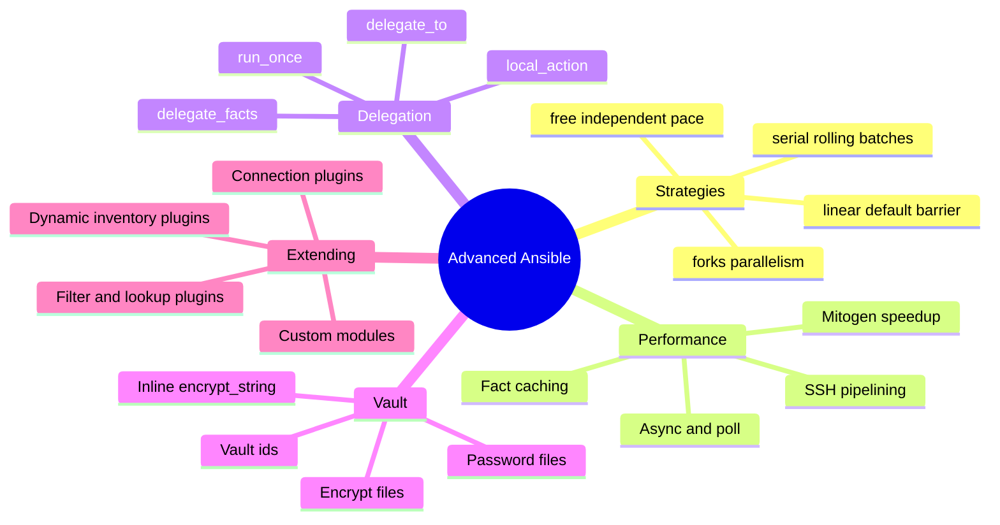
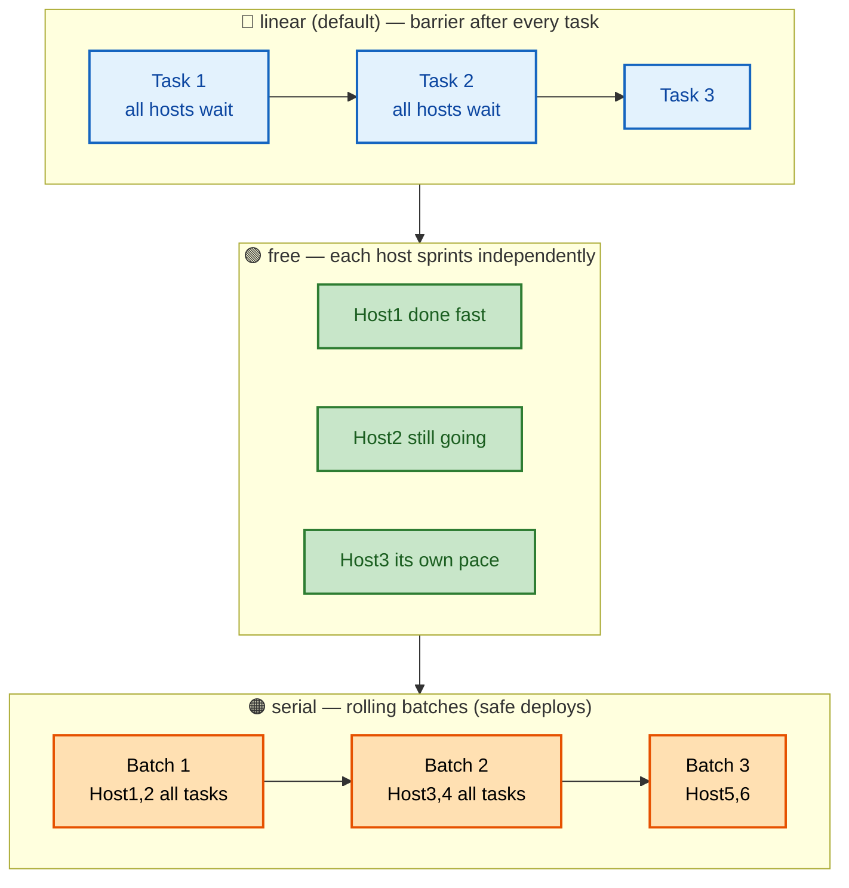
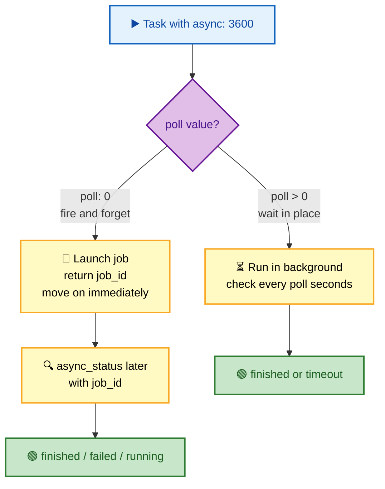
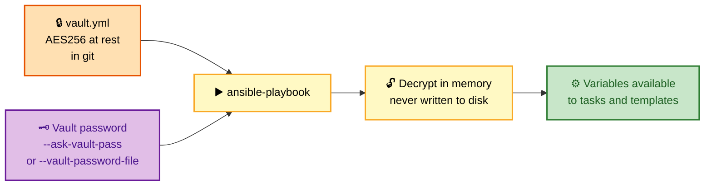

# SECTION 4: ADVANCED

> **Scope:** Section 4 of 6 | Intermediate → Expert progression | FAANG-level depth
> **Coverage:** Execution strategies (`linear`/`free`/`serial`) and forks, performance tuning (pipelining, fact caching, Mitogen, async/poll), delegation and `run_once`/`local_action`, Ansible Vault (files, vault-ids, inline strings), dynamic inventory internals, and extending Ansible with custom modules and plugins.

This section is about *scale and extension*: making plays fast across large fleets, controlling where and when tasks run, protecting secrets, and writing your own modules/plugins when the built-ins fall short. Strategies + performance and Vault are the two heaviest interview areas here.

---

## 🗺️ Visual Overview

**In one line:** At scale, Ansible performance is a transport problem — strategies, forks, pipelining, fact caching, and async all attack SSH round-trip overhead, while Vault, delegation, and custom plugins extend *what* and *where* you can safely automate.

**Mind map — the whole section at a glance** (skim first, revisit last):



**Execution strategies — how tasks flow across hosts** (blue = lockstep, green = independent, orange = batched):



**Async task lifecycle — fire-and-forget vs poll** (purple = control decision, green = done):



**Vault flow — how encrypted content is decrypted at runtime** (orange = at-rest secret, purple = the key):



> 🧠 **Memory hooks (mnemonics):**
> - **Strategies — "Linear locks, Free flies, Serial staggers":** linear = barrier per task, free = every host at its own pace, serial = rolling batches.
> - **Perf levers — "Pipeline, Cache, Fork, Async":** the four dials that cut transport overhead.
> - **Async — "poll 0 = go, poll N = wait":** `poll: 0` fires and forgets (check later with `async_status`); `poll > 0` blocks in place.
> - **Delegation — "delegate WHERE, run_once WHO":** `delegate_to` changes the target host; `run_once` runs the task on a single host only.
> - **Vault — "Encrypt at rest, decrypt in RAM":** the file stays AES256 in git; the key unlocks it into memory only.

---

## 1. Execution Strategies and Forks

> 🎯 **Interview weight: Very High** — "how do you do a rolling deploy?" lives here.

**In one line:** The strategy plugin controls task/host ordering — `linear` (default) waits for every host after each task, `free` lets each host run ahead, and `serial` splits the fleet into rolling batches.

| Strategy | Behavior | Use when |
|---|---|---|
| `linear` (default) | Barrier after every task — all hosts complete task N before task N+1 | Predictable ordering; dependencies across hosts |
| `free` | Each host runs tasks as fast as it can, independently | Max throughput, no cross-host ordering needed |
| `serial: N / "30%" / [1,5,10]` | Rolling batches — each batch completes the whole play before the next starts | Safe rolling/canary deploys |

`forks` controls **parallelism** — how many hosts Ansible touches at once (default **5**). It's orthogonal to strategy:

```ini
# ansible.cfg
[defaults]
forks = 50          # touch 50 hosts in parallel instead of 5
```

```yaml
- name: Rolling deploy, 2 hosts at a time, abort if >25% fail
  hosts: web
  serial: 2
  max_fail_percentage: 25
  tasks: [...]
```

> 💡 **Interview tip:** `serial` is the answer to *"how do you do a rolling / canary deploy?"* — pair it with `max_fail_percentage` so the rollout halts if a batch breaks. `free` maximizes throughput but gives up ordering guarantees. `forks` just widens parallelism and doesn't change ordering semantics.

> ⚠️ **Gotcha:** Raising `forks` too high can exhaust the control node (CPU/file descriptors) or overwhelm a shared dependency (package mirror, API). Tune it against control-node capacity, not just fleet size.

---

## 2. Performance Tuning

> 🎯 **Interview weight: High** — "your play is slow across 1,000 hosts, what do you do?"

**In one line:** Slow plays are almost always dominated by SSH round-trips and fact gathering, not module logic — attack them with pipelining, fact caching, `forks`, async, and (optionally) Mitogen.

| Lever | What it does | Config |
|---|---|---|
| **SSH pipelining** | Sends the module over the SSH session's stdin instead of writing a temp file first — fewer round-trips | `[ssh_connection] pipelining = True` (needs `requiretty` off) |
| **Fact caching** | Reuse gathered facts across runs instead of re-running `setup` | `gathering = smart` + `fact_caching = jsonfile`/`redis` |
| **Higher forks** | More hosts in parallel | `forks = 50` |
| **Async tasks** | Run long jobs in the background, don't block the play | `async: N` + `poll:` |
| **Disable/subset gathering** | Skip or limit `setup` | `gather_facts: false` or `gather_subset:` |
| **Mitogen strategy** | Third-party strategy that reuses interpreters over a persistent connection — 2–7× speedups | `strategy = mitogen_linear` |
| **ControlPersist** | SSH connection multiplexing (default on) | `ssh_args = -o ControlMaster=auto -o ControlPersist=60s` |

```ini
# ansible.cfg — a solid baseline for scale
[defaults]
forks = 50
gathering = smart
fact_caching = jsonfile
fact_caching_connection = /tmp/ansible_facts
fact_caching_timeout = 86400

[ssh_connection]
pipelining = True
ssh_args = -o ControlMaster=auto -o ControlPersist=60s
```

**Async for long-running tasks:**

```yaml
- name: Fire-and-forget a long job
  ansible.builtin.command: /usr/bin/long_task
  async: 3600     # max runtime seconds
  poll: 0         # don't wait
  register: job

- name: Do other work, then check on it
  ansible.builtin.async_status:
    jid: "{{ job.ansible_job_id }}"
  register: result
  until: result.finished
  retries: 30
  delay: 10
```

> 🔍 **Deep dive:** Fact caching pays off most on chatty plays that reference facts but change little — the first run populates the cache, subsequent runs skip the expensive `setup` gather. `gathering = smart` gathers only if facts aren't already cached and fresh.

> 💡 **Interview tip:** Sequence the answer as *"first measure where time goes (usually SSH + facts), then: enable pipelining, cache facts, raise forks, async the slow tasks, and if still short, try Mitogen."*

---

## 3. Delegation, run_once, and local_action

> 🎯 **Interview weight: Medium-High** — load-balancer drain patterns show up here.

**In one line:** `delegate_to` runs a task *on a different host* while keeping the current host's context; `run_once` runs a task on just one host; `local_action` runs on the control node.

| Construct | Effect | Classic use |
|---|---|---|
| `delegate_to: lb01` | Execute this task on `lb01` but for the current inventory host's context | Remove/add a host from a load balancer during rolling deploy |
| `run_once: true` | Run the task exactly once (on the first host in the batch) | DB migration, creating a shared resource |
| `local_action:` / `delegate_to: localhost` | Run on the control node | Call an API, render a report, talk to cloud |
| `delegate_facts: true` | Facts gathered go to the delegated host, not the current one | Collecting facts about a third party |

```yaml
- name: Take host out of the LB before upgrading it
  community.general.haproxy:
    state: disabled
    host: "{{ inventory_hostname }}"
  delegate_to: lb01              # runs ON the load balancer

- name: Run the schema migration exactly once
  ansible.builtin.command: /opt/app/migrate.sh
  run_once: true
  delegate_to: "{{ groups['app'][0] }}"
```

> ⚠️ **Gotcha:** `run_once` runs once *per batch* when combined with `serial`, not once per play. And `delegate_to` keeps the *variables* of the original host — so `inventory_hostname` still refers to the host you're iterating over, which is exactly what LB-drain patterns rely on.

---

## 4. Ansible Vault

> 🎯 **Interview weight: High** — secret management is always probed.

**In one line:** Vault encrypts sensitive data at rest (AES256) so secrets can live safely in git; the vault password decrypts it into memory at runtime and it's never written to disk in plaintext.

**Core commands:**

```bash
ansible-vault create secrets.yml          # new encrypted file
ansible-vault encrypt vars/secrets.yml    # encrypt existing file
ansible-vault edit secrets.yml            # edit in place
ansible-vault view secrets.yml            # read-only
ansible-vault rekey secrets.yml           # change the password
ansible-vault encrypt_string 'P@ss' --name 'db_pass'   # inline single value
```

**Multiple vault IDs** (separate keys per environment):

```bash
ansible-vault encrypt --vault-id prod@~/.vault_prod prod_secrets.yml
ansible-playbook site.yml \
  --vault-id dev@prompt \
  --vault-id prod@~/.vault_prod
# stored header records the id: $ANSIBLE_VAULT;1.2;AES256;prod
```

**The recommended layout — split plain and secret vars:**

```
group_vars/
└── production/
    ├── vars.yml     # db_password: "{{ vault_db_password }}"  (plain, references vault)
    └── vault.yml    # vault_db_password: <encrypted>          (encrypted)
```

| Practice | Why |
|---|---|
| Prefix encrypted vars (`vault_*`) and reference them from a plain `vars.yml` | Lets you `grep`/see which values are secret without decrypting |
| Use `--vault-password-file` in CI (mounted secret) | No interactive prompt in pipelines |
| Never commit the password file (`.gitignore` it) | The file *is* the key |
| Use separate vault-ids per environment | Blast-radius isolation; dev can't decrypt prod |

> ⚠️ **Gotcha:** Vault protects data **at rest**, not from someone with the password or `-vvv` output — an encrypted var printed via `debug` shows plaintext. Set `no_log: true` on tasks handling secrets to keep them out of logs.

> 💡 **Interview tip:** Contrast Vault with external secret managers: *"Vault is great for secrets versioned with code, but for dynamic/rotated secrets teams often integrate HashiCorp Vault or cloud secret managers via lookups instead."*

---

## 5. Extending Ansible — Custom Modules and Plugins

> 🎯 **Interview weight: Medium** — expected from senior/platform candidates.

**In one line:** When no built-in fits, write a **custom module** (runs on the target, returns JSON) or a **plugin** (runs on the control node — filters, lookups, inventory, connection, callback).

| Extension | Runs where | Purpose |
|---|---|---|
| **Module** | Managed node | An action/task (like `file`, `service`); returns JSON with `changed`/`failed` |
| **Filter plugin** | Control node | Custom Jinja2 filter (`{{ x | my_filter }}`) |
| **Lookup plugin** | Control node | Pull data at templating time (`lookup('file', ...)`, secrets managers) |
| **Inventory plugin** | Control node | Build inventory from a source (cloud, CMDB) |
| **Connection plugin** | Control node | New transport (SSH, WinRM, docker) |
| **Callback plugin** | Control node | Hook into events (custom logging, Slack notifications) |

Minimal custom module skeleton:

```python
#!/usr/bin/python
from ansible.module_utils.basic import AnsibleModule

def main():
    module = AnsibleModule(
        argument_spec=dict(
            name=dict(type='str', required=True),
            state=dict(type='str', default='present', choices=['present', 'absent']),
        ),
        supports_check_mode=True,     # enables --check
    )
    name = module.params['name']
    # ... inspect current state, decide if a change is needed ...
    changed = False
    if module.check_mode:
        module.exit_json(changed=changed)
    module.exit_json(changed=changed, name=name)

if __name__ == '__main__':
    main()
```

> 💡 **Interview tip:** The two signals of a *good* custom module: it **supports check mode** (`supports_check_mode=True`) and it's **idempotent** (inspects current state, only reports `changed` when it actually changes something) — the same properties the built-ins have.

> 🔍 **Deep dive:** Drop custom code into `library/` (modules), `filter_plugins/`, `lookup_plugins/`, etc., next to your playbook for local use — or package them into a **collection** under `plugins/modules/`, `plugins/filter/`, etc., for distribution via Galaxy.

---

## Interview Questions & Answers

### Q1: A playbook takes 40 minutes across 1,000 hosts. Walk me through speeding it up.

**Answer:** First profile where time goes — it's almost always SSH round-trips and fact gathering, not module logic. Then apply levers in order: enable **pipelining**, enable **fact caching** (`gathering = smart`), raise **forks** (e.g., 50), move long tasks to **async**, disable/subset fact gathering where unneeded, and if still short, try the **Mitogen** strategy for a 2–7× boost.

**Internals:** Each task is a fresh payload + connection by default; pipelining cuts the per-task SSH operations, ControlPersist reuses the TCP/SSH session, and fact caching skips repeated `setup` runs. `forks` widens parallelism but is bounded by control-node CPU/FDs.

**Follow-up — "Trade-off of cranking forks to 500?"** You can exhaust the control node (file descriptors, CPU) and hammer shared dependencies (package mirrors, APIs). Tune to control-node capacity and add rate limits, not just fleet size.

---

### Q2: How do you do a safe rolling deployment with automatic abort?

**Answer:** Use `serial:` to roll out in batches (a count, percentage, or ramp like `[1, 5, 25%]`) and `max_fail_percentage:` to halt if too many hosts in a batch fail. Combine with load-balancer drain via `delegate_to` the LB before/after upgrading each host.

**Internals:** With `serial`, each batch completes the *entire* play before the next begins, so a failing canary batch stops the rollout before it touches the rest. `run_once` inside a serial play runs once per batch, not once total.

**Follow-up — "How do you drain a host from the LB mid-play?"** A task with `delegate_to: lb01` that disables the current `inventory_hostname` on the balancer, upgrade, health-check, then re-enable — `delegate_to` keeps the iterating host's context so the right host is drained.

---

### Q3: Explain Ansible Vault and its security boundary.

**Answer:** Vault encrypts data at rest with AES256 so secrets can be versioned in git. At runtime the vault password (from `--ask-vault-pass` or `--vault-password-file`) decrypts content **into memory** — it's never written to disk in plaintext. Vault-ids let you use separate keys per environment.

**Internals:** The encrypted file carries a header (`$ANSIBLE_VAULT;1.2;AES256;prod`) identifying the id. Best practice is `vault_*`-prefixed encrypted vars in `vault.yml` referenced from a plain `vars.yml`, so you can see which values are secret without decrypting.

**Follow-up — "A secret leaked into `-vvv` output. Why, and how to prevent it?"** Vault only protects *at rest*; once decrypted, a `debug` or verbose module can print it. Set `no_log: true` on tasks handling secrets to suppress them from output and logs.

---

### Q4: When would you write a custom module vs a plugin, and what makes a module "good"?

**Answer:** Write a **module** when you need a new task/action that runs on the target and returns JSON (e.g., manage a bespoke appliance). Write a **plugin** for control-node concerns: a **filter** (transform data in Jinja), a **lookup** (pull data at template time), an **inventory** plugin (build hosts from a source), or a **callback** (custom event handling/logging).

**Internals:** A good module **supports check mode** and is **idempotent** — it inspects current state and reports `changed` only on real change, exactly like built-ins. Place code in `library/`/`*_plugins/` for local use or a collection's `plugins/` tree for distribution.

**Follow-up — "How do you make a custom module honor `--check`?"** Set `supports_check_mode=True` and, when `module.check_mode` is true, compute whether a change *would* happen and `exit_json(changed=...)` without mutating anything.

---

## 🔧 Troubleshooting

| Symptom | Likely cause | Fix |
|---|---|---|
| Play slow despite fast modules | SSH round-trips + fact gathering | Pipelining, fact caching, higher forks, async |
| `pipelining` breaks with sudo | `requiretty` in sudoers | Disable `requiretty` for the ansible user |
| Async task "never finishes" | No `async_status` poll, or `async` too low | Poll with `async_status`; raise `async` timeout |
| `run_once` ran multiple times | Combined with `serial` (once per batch) | Expected; gate with a fact or `when` if truly once |
| Secret appears in logs | Decrypted var printed by a task | Add `no_log: true` |
| Custom module always `changed` | No state check | Inspect current state; only report change on drift |

---

## ✅ Best Practices

- Baseline `ansible.cfg` for scale: `forks`, `pipelining`, fact caching, ControlPersist.
- Use `serial` + `max_fail_percentage` + LB drain via `delegate_to` for zero-downtime rollouts.
- Keep secrets in `vault.yml` with `vault_*` prefixes; use per-environment vault-ids and `no_log: true`.
- Async long jobs and poll with `async_status`; never block a play on a multi-minute command.
- Make custom modules idempotent and check-mode aware; package reusable plugins into a collection.

---

## 📚 Documentation Links

- [Strategies](https://docs.ansible.com/ansible/latest/playbook_guide/playbooks_strategies.html)
- [Async actions and polling](https://docs.ansible.com/ansible/latest/playbook_guide/playbooks_async.html)
- [Controlling where tasks run (delegation)](https://docs.ansible.com/ansible/latest/playbook_guide/playbooks_delegation.html)
- [Ansible Vault](https://docs.ansible.com/ansible/latest/vault_guide/index.html)
- [Developing modules](https://docs.ansible.com/ansible/latest/dev_guide/developing_modules_general.html)

---

**[← Previous: Roles & Collections](03-ROLES-COLLECTIONS.md)** | **[Ansible Index](README.md)** | **[Next: Production →](05-PRODUCTION.md)**
