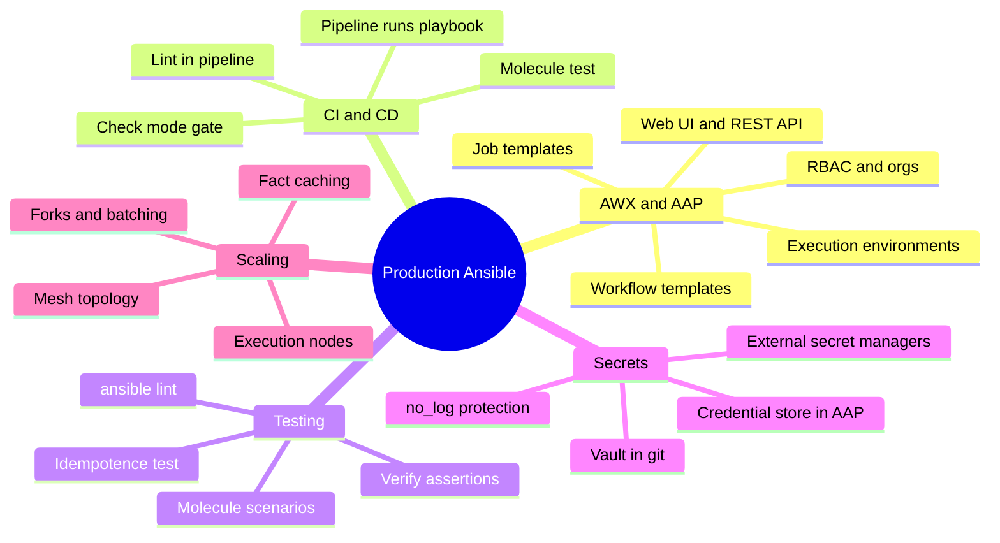
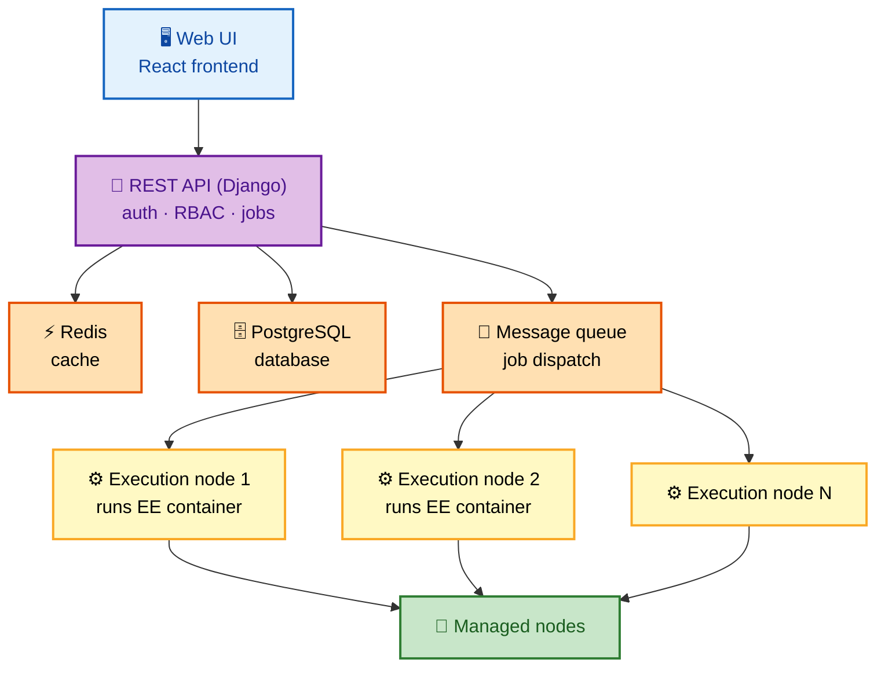
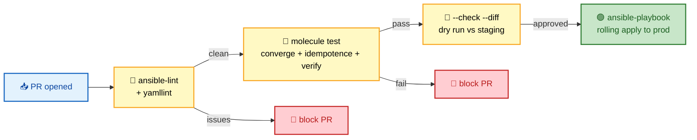

# SECTION 5: PRODUCTION

> **Scope:** Section 5 of 6 | Intermediate → Expert progression | FAANG-level depth
> **Coverage:** AWX / Ansible Automation Platform (controller architecture, RBAC, job/workflow templates, execution environments), running Ansible in CI/CD, testing with `ansible-lint` and Molecule, production secret management, scaling patterns, and designing idempotent, safe-by-default automation.

This section is about operating Ansible as a *product*, not a laptop tool: who can run what, how runs are audited and scheduled, how you test roles before they hit prod, and how you scale the control plane. AWX/AAP architecture and Molecule testing are the headline interview topics.

---

## 🗺️ Visual Overview

**In one line:** Production Ansible means a governed control plane (AWX/AAP for RBAC, scheduling, audit, and execution environments), automated testing (lint + Molecule), pipeline integration, and secrets that never touch git in plaintext.

**Mind map — the whole section at a glance** (skim first, revisit last):



**AWX/AAP request flow — UI to workers, backed by data services** (blue = entry, purple = brains, orange = data, yellow = workers):



**CI/CD pipeline for Ansible — lint → test → gated apply** (red = fail-fast gates, green = deploy):



> 🧠 **Memory hooks (mnemonics):**
> - **AAP building blocks — "Org → Project → Template → Job":** orgs isolate tenants, projects pull playbooks from git, job templates bundle playbook+inventory+credentials, jobs are the runs.
> - **Molecule loop — "Create, Converge, Idempotence, Verify, Destroy":** the five phases of a Molecule scenario.
> - **Idempotence test — "Second run = zero changed":** the gold standard — run twice, the second run must report no changes.
> - **Secrets ladder — "Vault for static, manager for dynamic":** Vault for code-versioned secrets; external managers (HashiCorp/cloud) for rotated/dynamic ones.

---

## 1. AWX / Ansible Automation Platform

> 🎯 **Interview weight: High** — "what does AWX add over CLI Ansible?" is standard.

**In one line:** AWX (open source) and Ansible Automation Platform (the supported product) wrap Ansible with a web UI, REST API, RBAC, credential storage, scheduling, audit logging, and distributed execution — the things a *team* needs that the raw CLI lacks.

**Core object model:**

| Object | Meaning |
|---|---|
| **Organization** | Top-level tenant boundary |
| **Project** | A git repo of playbooks/roles, synced automatically |
| **Inventory** | Hosts (static, dynamic, or "smart"/filtered) |
| **Credential** | Securely stored secrets (SSH, cloud, vault, SCM) — encrypted, never exposed |
| **Job Template** | Playbook + inventory + credentials + options, runnable and schedulable |
| **Workflow Template** | Chains job templates with success/failure branches and approvals |
| **Execution Environment (EE)** | A container image bundling `ansible-core`, collections, and Python deps for reproducible runs |

**What AWX/AAP adds over `ansible-playbook`:**

| Capability | Why it matters in prod |
|---|---|
| **RBAC** | Least-privilege: who can run which template against which inventory |
| **Credential store** | Secrets are injected at runtime, never printed or stored in playbooks |
| **Scheduling** | Cron-like recurring jobs (patching windows, compliance sweeps) |
| **Audit & logging** | Every job's who/what/when/output is recorded |
| **Surveys** | Parameterized forms that turn a template into a self-service tool |
| **Workflows** | Multi-playbook orchestration with branching and approval gates |
| **Execution mesh** | Distributed execution nodes reach segmented networks |

> 💡 **Interview tip:** The crisp differentiator: *"CLI Ansible is fine for one operator; AWX/AAP adds RBAC, a credential vault, scheduling, audit trails, surveys, workflows, and execution environments so a whole org can run automation safely and reproducibly."*

> 🔍 **Deep dive:** **Execution Environments** replaced the old "install collections on the controller" model. An EE is a container image (built with `ansible-builder`) pinning `ansible-core` + collections + Python libs — so a job runs identically in dev, CI, and the controller, killing "works on my machine" drift.

---

## 2. Testing — ansible-lint and Molecule

> 🎯 **Interview weight: High** — automated role testing signals maturity.

**In one line:** `ansible-lint` catches style/correctness issues statically; **Molecule** spins up real/ephemeral instances to converge a role, assert idempotence, and verify results — the closest thing to unit/integration tests for Ansible.

**The Molecule scenario lifecycle:**

| Phase | What it does |
|---|---|
| **create** | Provision a test instance (Docker/Podman container, cloud VM) |
| **converge** | Apply the role to the instance |
| **idempotence** | Run `converge` again — **must report zero `changed`** |
| **verify** | Run assertions (testinfra/Ansible `verify.yml`) against the result |
| **destroy** | Tear down the instance |

```yaml
# molecule/default/molecule.yml
driver:
  name: docker
platforms:
  - name: instance
    image: geerlingguy/docker-ubuntu2204-ansible
provisioner:
  name: ansible
verifier:
  name: ansible
```

```bash
molecule test        # full cycle: create→converge→idempotence→verify→destroy
molecule converge    # iterate locally without destroying
ansible-lint         # static analysis across roles/playbooks
```

> ⚠️ **Gotcha:** The **idempotence phase is the real test** — a role that converges but reports `changed` on the *second* run has an idempotency bug (usually an unguarded `shell`/`command` or a `changed_when` mistake). This is precisely what Molecule automates and what interviewers love to reference.

> 💡 **Interview tip:** Tie testing to the design principle: *"Molecule's idempotence check is the automated enforcement of Ansible's core promise — run twice, second run is a no-op."*

---

## 3. CI/CD Integration

> 🎯 **Interview weight: Medium-High** — "how do you ship playbook changes safely?"

**In one line:** Treat playbooks like code — PRs run lint + Molecule, a dry-run (`--check --diff`) validates against staging, and only reviewed changes get a gated, rolling apply to prod.

```yaml
# GitHub Actions example (conceptual)
jobs:
  test:
    steps:
      - run: pip install ansible ansible-lint molecule molecule-plugins[docker]
      - run: ansible-lint
      - run: molecule test
  deploy:
    needs: test
    steps:
      - run: ansible-playbook -i inventory/prod site.yml --check --diff   # dry run
      - run: ansible-playbook -i inventory/prod site.yml                  # gated apply
```

| Stage | Tooling | Gate |
|---|---|---|
| Static checks | `ansible-lint`, `yamllint` | Fail PR on violations |
| Role tests | `molecule test` | Fail PR on converge/idempotence/verify failure |
| Pre-deploy validation | `ansible-playbook --check --diff` | Surface changes before applying |
| Deploy | `ansible-playbook` (with `serial`) | Approval + rolling apply |

> 💡 **Interview tip:** `--check --diff` in CI turns "surprise change in prod" into a reviewable artifact — the diff shows *exactly* what would change, so reviewers approve a concrete plan, not a hope.

---

## 4. Production Secret Management

> 🎯 **Interview weight: Medium-High** — always asked alongside Vault.

**In one line:** Use Ansible Vault for secrets that version alongside code, AAP's credential store for controller-driven runs, and external secret managers (HashiCorp Vault, AWS Secrets Manager, Azure Key Vault) for dynamic/rotated secrets pulled at runtime via lookups.

| Approach | Best for | Mechanism |
|---|---|---|
| **Ansible Vault** | Static secrets versioned with the repo | AES256 file, password at runtime |
| **AAP Credentials** | Controller-run jobs | Encrypted store, injected as env/vars, never printed |
| **External managers** | Dynamic/rotated secrets, central governance | `lookup('hashi_vault', ...)`, `amazon.aws.secretsmanager` at runtime |

```yaml
- name: Pull a rotated DB password at runtime (no secret in git)
  ansible.builtin.set_fact:
    db_password: "{{ lookup('community.hashi_vault.hashi_vault', 'secret=secret/data/db:password') }}"
  no_log: true        # keep it out of logs
```

> ⚠️ **Gotcha:** Whatever the source, set `no_log: true` on any task that *handles* a secret — otherwise verbose mode or a module echo can leak it to logs. Vault/credential stores protect storage, not runtime output.

---

## 5. Scaling and Idempotent Design

> 🎯 **Interview weight: Medium** — ties the whole guide together.

**In one line:** Scale by distributing execution (AAP execution mesh/nodes), tuning the transport (forks, pipelining, fact caching), and — most importantly — designing every play to be *safely re-runnable*.

**Scaling levers:**

| Lever | Effect |
|---|---|
| **Execution nodes / mesh** (AAP) | Spread job load and reach segmented networks |
| **Fact caching** | Avoid re-gathering across scheduled runs |
| **Forks + pipelining** | More parallelism, fewer round-trips (see [04-ADVANCED.md](04-ADVANCED.md)) |
| **`serial` batching** | Bound blast radius and control-plane load per wave |

**Idempotent-design checklist (the safety net that makes re-runs cheap):**

- ✅ Prefer state modules over `shell`/`command`; guard raw commands with `creates`/`when`/`changed_when`.
- ✅ Make config changes `notify` handlers so services restart only on real change.
- ✅ Validate configs (`validate:`) before writing them.
- ✅ Keep tunables in `defaults/`; never hardcode environment-specific values in tasks.
- ✅ Prove idempotence in CI via Molecule's idempotence phase.

> 💡 **Interview tip:** The closing thought interviewers remember: *"Idempotency isn't a nice-to-have — it's what lets you run the same automation on every deploy, in CI, and during incidents without fear. Everything else (testing, rolling deploys, drift detection) is built on that guarantee."*

---

## Interview Questions & Answers

### Q1: What does AWX/Ansible Automation Platform give you that the `ansible-playbook` CLI doesn't?

**Answer:** A governed control plane: **RBAC** (who can run what, where), a **credential store** (secrets injected at runtime, never printed), **scheduling**, **audit logging**, **surveys** (self-service forms), **workflows** (multi-playbook orchestration with approvals), and **execution environments** for reproducible runs.

**Internals:** AAP is a Django REST API backed by PostgreSQL + Redis + a message queue dispatching jobs to execution nodes that run EE containers. The object model is Org → Project (git) → Inventory + Credential → Job/Workflow Template.

**Follow-up — "What problem do Execution Environments solve?"** Version drift. An EE is a container pinning `ansible-core` + collections + Python deps (built with `ansible-builder`), so a job runs identically everywhere instead of depending on whatever is installed on the controller.

---

### Q2: How do you test an Ansible role before it reaches production?

**Answer:** Static analysis with `ansible-lint`/`yamllint`, then **Molecule** for functional testing: it creates an ephemeral instance, converges the role, runs the **idempotence** check (second run must be zero `changed`), verifies with assertions, and destroys the instance.

**Internals:** Molecule's phases are create → converge → idempotence → verify → destroy, typically on Docker/Podman for speed. The idempotence phase is the key gate — it catches unguarded `shell`/`command` tasks that report `changed` on every run.

**Follow-up — "A role passes converge but fails idempotence. Where do you look?"** Unguarded `command`/`shell` tasks, a wrong `changed_when`, or a template rendering differently each run (e.g., timestamps). Add `creates:`/`when:`/`changed_when:` guards.

---

### Q3: How do you manage secrets across a fleet in production?

**Answer:** Layer it. **Ansible Vault** for secrets versioned with the repo; **AAP credential store** for controller-run jobs (injected, never printed); **external managers** (HashiCorp Vault, AWS Secrets Manager) pulled at runtime via lookups for dynamic/rotated secrets. Always `no_log: true` on secret-handling tasks.

**Internals:** Vault encrypts at rest and decrypts into memory at runtime; external managers return secrets at template/lookup time so nothing is stored in git. The AAP store injects credentials as protected variables.

**Follow-up — "Vault vs HashiCorp Vault — when each?"** Ansible Vault for static secrets that naturally version with code; HashiCorp/cloud managers when you need rotation, dynamic credentials, central audit, or shared governance beyond one repo.

---

### Q4: How would you build a CI/CD pipeline for infrastructure playbooks?

**Answer:** Treat playbooks as code. On PR: run `ansible-lint` + `molecule test`. Before deploy: run `ansible-playbook --check --diff` against staging to produce a reviewable change plan. On approval: apply with `serial` batching and `max_fail_percentage` for a safe rolling rollout.

**Internals:** `--check --diff` renders the exact would-be changes without applying; `serial` bounds blast radius; AAP can gate the apply behind a workflow approval node. Lint + Molecule fail the PR before bad code merges.

**Follow-up — "How do you prevent a bad change from taking down the whole fleet?"** Rolling `serial` batches + `max_fail_percentage` halt the rollout after a failing canary batch, and LB drain via `delegate_to` keeps traffic off hosts mid-upgrade.

---

## 🔧 Troubleshooting

| Symptom | Likely cause | Fix |
|---|---|---|
| Job works on laptop, fails in AAP | Controller missing a collection/Python dep | Build/pin an Execution Environment with `ansible-builder` |
| Molecule idempotence fails | Unguarded `shell`/`command` or bad `changed_when` | Add `creates:`/`when:`/`changed_when:` guards |
| Secret leaked to job output | Missing `no_log` | Set `no_log: true` on secret-handling tasks |
| Scheduled job re-gathers facts every run | Fact caching off | Enable `gathering = smart` + `fact_caching` |
| Deploy nukes too many hosts on failure | No batching/threshold | Use `serial` + `max_fail_percentage` |

---

## ✅ Best Practices

- Run automation through AWX/AAP for RBAC, credential storage, audit, and scheduling — not shared SSH keys on a jump box.
- Pin an Execution Environment so runs are reproducible across dev/CI/controller.
- Gate every change on `ansible-lint` + Molecule (including the idempotence phase) in CI.
- Validate with `--check --diff` before applying; roll out with `serial` + `max_fail_percentage`.
- Keep secrets out of git (Vault/credential store/external manager) and `no_log: true` anything that touches them.

---

## 📚 Documentation Links

- [AWX Project](https://github.com/ansible/awx)
- [Ansible Automation Platform](https://docs.ansible.com/automation-controller/latest/html/userguide/index.html)
- [Execution Environments & ansible-builder](https://ansible.readthedocs.io/projects/builder/en/latest/)
- [Molecule](https://ansible.readthedocs.io/projects/molecule/)
- [ansible-lint](https://ansible.readthedocs.io/projects/lint/)

---

**[← Previous: Advanced](04-ADVANCED.md)** | **[Ansible Index](README.md)** | **[Next: Troubleshooting →](06-TROUBLESHOOTING.md)**
