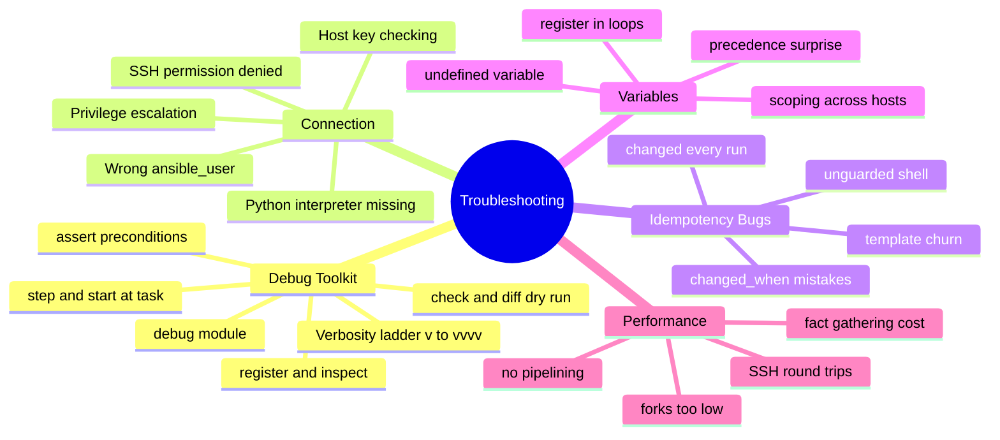
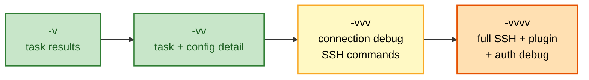
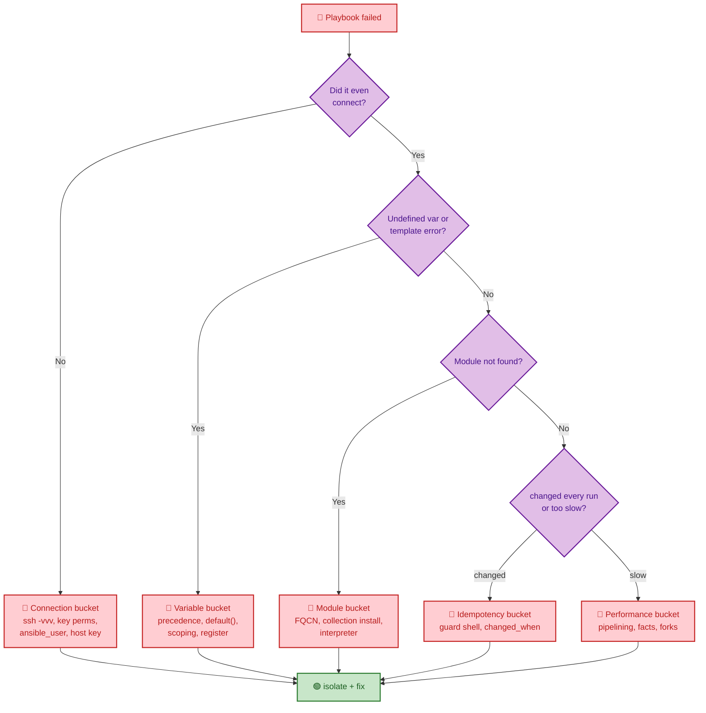
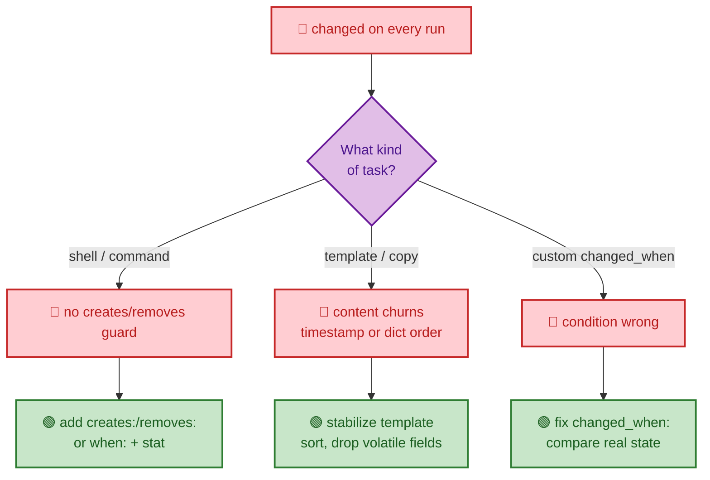

# SECTION 6: TROUBLESHOOTING

> **Scope:** Section 6 of 6 | Intermediate → Expert progression | FAANG-level depth
> **Coverage:** The debugging toolkit (`-v`/`-vvv`, `debug`, `register`, `assert`, `--check --diff`, `--step`, `--start-at-task`, the interactive debugger), connection/SSH failures, idempotency bugs, variable scoping and precedence surprises, undefined-variable and templating errors, module/collection resolution, and performance diagnosis. This is the section to review last before an interview — it ties every other topic together through real failure modes.

**In one line:** Most Ansible failures fall into five buckets — connection, idempotency, variable scoping, module resolution, and performance — and each has a fast, specific diagnostic path.

---

## 🗺️ Visual Overview

**Mind map — the whole section at a glance** (skim first, revisit last):



**Verbosity ladder — more v's, more visibility** (green = light, orange = SSH-level detail):



**Failure triage — narrow any failure in four questions** (red = failure classes, purple = decision, green = resolved):



**Idempotency bug hunt — why does this task report changed every run?** (red = the bug, green = the fix):



> 🧠 **Memory hooks (mnemonics):**
> - **Verbosity — "more v's, more verbose":** `-v` results → `-vv` detail → `-vvv` connection/SSH → `-vvvv` full SSH + auth.
> - **Five buckets — "Can it Connect, does the Variable exist, is the Module there, is it Idempotent, is it Fast":** connection, variable, module, idempotency, performance.
> - **Dry run — "check shows intent, diff shows delta":** `--check` previews without applying; `--diff` prints the exact change.
> - **Iterate fast — "start where it broke":** `--start-at-task` and `--step` avoid re-running the whole play.

---

## 1. The Debugging Toolkit

> 🎯 **Interview weight: High** — "how do you debug a failing playbook?" is near-universal.

**In one line:** Escalate verbosity, print state with `debug`/`register`, assert preconditions, and use `--check --diff`/`--step`/`--start-at-task` to iterate without re-running everything.

| Tool | What it reveals / does |
|---|---|
| `-v` → `-vvvv` | Increasing detail; `-vvv` shows the actual SSH commands, `-vvvv` adds auth/plugin debug |
| `debug: var=` / `msg=` | Print a variable or message (gate noisy ones with `verbosity: 2`) |
| `register:` + `debug: var=result` | Capture and inspect a task's full return dict (`stdout`, `rc`, `changed`) |
| `assert: that: [...]` | Fail fast on a precondition with a clear message |
| `--check --diff` | Dry run + show exactly what would change |
| `--step` | Confirm before each task interactively |
| `--start-at-task="Name"` | Resume from a specific task instead of the top |
| `--list-tasks` / `--list-hosts` | See what *would* run without running it |
| `ANSIBLE_STRATEGY=debug` | Interactive debugger on failure: `p task`, `p result`, `c` continue, `r` redo |

```yaml
- name: Inspect a result
  ansible.builtin.command: id -un
  register: r
- ansible.builtin.debug:
    var: r

- name: Guard a precondition
  ansible.builtin.assert:
    that:
      - app_port is defined
      - app_port | int > 1024
    fail_msg: "app_port must be defined and > 1024"
```

```bash
ansible-playbook site.yml -vvv                    # connection-level debug
ansible-playbook site.yml --check --diff          # dry run + delta
ansible-playbook site.yml --start-at-task="Deploy config"
ANSIBLE_STRATEGY=debug ansible-playbook site.yml  # interactive debugger
```

> 💡 **Interview tip:** Name the verbosity ladder *and* the fast-iteration flags: *"`-vvv` to see the SSH layer, `--check --diff` to preview, `--start-at-task` and `--step` to iterate without re-running the whole play, and `ANSIBLE_STRATEGY=debug` to drop into an interactive debugger on failure."*

---

## 2. Connection & SSH Failures

> 🎯 **Interview weight: High** — the most common real-world failure.

**In one line:** Connection failures are almost always credentials, key permissions, host-key checking, the wrong `ansible_user`, a missing Python interpreter, or privilege escalation — isolate by reproducing with plain `ssh -vvv`.

| Symptom | Cause | Fix |
|---|---|---|
| `Permission denied (publickey)` | Wrong user, key not loaded, key perms | `ssh -vvv user@host`; `chmod 600` key; set `ansible_user`, `ansible_ssh_private_key_file` |
| `Host key verification failed` | Unknown host key | Add to `known_hosts`, or set `host_key_checking = False` (dev only) |
| `/usr/bin/python: not found` | Interpreter discovery failed on slim image | Set `ansible_python_interpreter=/usr/bin/python3` |
| `Missing sudo password` / `Timeout waiting for privilege escalation` | `become` needs a password or `requiretty` blocks it | `--ask-become-pass`; disable `requiretty` in sudoers |
| `SSH Error: data could not be sent` | `pipelining` + `requiretty` conflict | Disable `requiretty`, or turn off pipelining |
| Intermittent timeouts | Slow target / low `timeout` | Raise `timeout` in `ansible.cfg`; use `async` for long tasks |

```bash
# Isolate: does raw SSH even work with the same identity?
ssh -vvv -i ~/.ssh/deploy_key deploy@web1.example.com

# Ad-hoc reachability check across a group
ansible web -m ping -i inventory
```

> ⚠️ **Gotcha:** `host_key_checking = False` is a *dev-only* shortcut — disabling it defeats MITM protection. In production, pre-populate `known_hosts` (e.g., via `ssh-keyscan` in provisioning) instead of turning the check off.

> 🔍 **Deep dive:** The `ping` module is **not** ICMP — it's a connectivity + Python-usability probe. A passing `ansible -m ping` proves SSH auth *and* a working interpreter, which separates "can't connect" from "module fails once connected."

---

## 3. Idempotency Bugs

> 🎯 **Interview weight: Very High** — "why does this show `changed` every run?" is a signature question.

**In one line:** A task that reports `changed` on every run has an idempotency bug — usually an unguarded `shell`/`command`, a churning template, or a wrong `changed_when`.

| Cause | Diagnosis | Fix |
|---|---|---|
| Unguarded `shell`/`command` | Runs unconditionally, always `changed` | `creates:`/`removes:`, or `when:` + `stat`, or `changed_when:` |
| Template/copy churn | Rendered content differs each run (timestamps, unordered dicts) | Remove volatile fields; sort collections before rendering |
| Wrong `changed_when` | Condition never matches "no change" | Compare against real current state |
| `lineinfile` duplicates | Regex doesn't match existing line | Tighten `regexp:` so it matches and replaces |

```yaml
# ❌ changed every run
- ansible.builtin.command: /opt/app/seed.sh

# ✅ guarded — runs once, reports change only the first time
- ansible.builtin.command: /opt/app/seed.sh
  args:
    creates: /var/lib/app/.seeded
```

**How to hunt it:** run the play **twice**; any task `changed` on the *second* run is the culprit. This is exactly what Molecule's idempotence phase automates (see [05-PRODUCTION.md](05-PRODUCTION.md)).

> 💡 **Interview tip:** State the test crisply: *"Run it twice — the second run must be all `ok`, zero `changed`. Any task still `changed` is non-idempotent, and it's nearly always a raw `shell`/`command` without a `creates`/`changed_when` guard."*

---

## 4. Variable Scoping & Precedence Surprises

> 🎯 **Interview weight: High** — "wrong value in prod" traces here.

**In one line:** Variable bugs are either *undefined* (missing/typo'd, template blows up) or *precedence surprises* (a higher-precedence source silently overrode what you set).

| Symptom | Cause | Fix |
|---|---|---|
| `'x' is undefined` | Missing var, typo, or not in scope for this host | `debug: var=x`; add `| default(...)`; check `group_vars`/`host_vars` |
| Wrong value used | Higher-precedence source overrides | Trace the ladder; audit `-e`, `vars/` vs `defaults/` |
| Value "disappears" on another host | `set_fact`/`register` are **host-scoped** | Reference via `hostvars['other'].var` |
| `register` var empty in a loop | With `loop:`, results are under `results[]` | Iterate `result.results` |
| Fact missing | Gathering disabled or subset excluded it | Enable gathering or widen `gather_subset` |

```yaml
- name: See what a host actually resolved
  ansible.builtin.debug:
    msg: "port={{ app_port | default('UNSET') }} family={{ ansible_os_family | default('no facts') }}"

- name: Read a fact set on a different host
  ansible.builtin.debug:
    msg: "{{ hostvars['db1'].db_ready | default(false) }}"
```

> ⚠️ **Gotcha:** `register` and `set_fact` results live **on the host that produced them**. To use a value computed on `db1` from a task running on `web1`, go through `hostvars['db1'].<var>` — a very common "why is my variable empty?" trap in multi-tier plays.

> 🔍 **Deep dive:** When you `register` a task that has a `loop:`, the variable is **not** a single result — it's `{ "results": [ {...}, {...} ] }`, one entry per iteration. Iterate `myvar.results` and read each item's `stdout`/`changed`, not `myvar.stdout`.

---

## 5. Module Resolution & Performance

> 🎯 **Interview weight: Medium-High** — 2.10 collection split + scale diagnosis.

**In one line:** "Module not found" is usually a missing collection or a short-name clash (use FQCN + install the collection); slow plays are transport-bound (fix with pipelining, fact caching, forks).

**Module resolution:**

| Symptom | Cause | Fix |
|---|---|---|
| `couldn't resolve module/action` | Collection not installed | `ansible-galaxy collection install <ns.name>`; pin in `requirements.yml` |
| Wrong module runs | Short-name clash across collections | Use FQCN (`community.docker.docker_container`) |
| Module fails only on some hosts | Interpreter mismatch | Set `ansible_python_interpreter` per group |

**Performance diagnosis (recap from [04-ADVANCED.md](04-ADVANCED.md)):**

| Symptom | Cause | Fix |
|---|---|---|
| Slow despite fast modules | SSH round-trips per task | `pipelining = True`, ControlPersist |
| Long startup every run | Fact gathering | `gathering = smart` + fact caching; `gather_facts: false` where unneeded |
| Only a few hosts at a time | Default `forks = 5` | Raise `forks` (mind control-node limits) |
| One long task blocks the play | Synchronous command | `async:` + `poll: 0`, check with `async_status` |

```bash
ANSIBLE_CALLBACKS_ENABLED=profile_tasks ansible-playbook site.yml   # per-task timing
```

> 💡 **Interview tip:** Diagnose before tuning: enable the `profile_tasks` callback to see *which* tasks eat time. Usually it's fact gathering and a couple of chatty tasks — target those with caching/pipelining rather than blindly cranking `forks`.

---

## Interview Questions & Answers

### Q1: A playbook fails with "Permission denied" on some hosts but not others. How do you diagnose it?

**Answer:** Reproduce with plain `ssh -vvv` using the same identity Ansible uses, then check the usual suspects: wrong `ansible_user`, key file permissions (`chmod 600`), key not present on those hosts, host-key mismatch, or a `become`/sudo password requirement. Run `ansible <group> -m ping` to isolate connectivity from module execution.

**Internals:** `-vvv` shows the exact SSH command Ansible builds. A passing `ping` module proves both SSH auth and a working Python interpreter; if `ping` passes but a task fails, the problem is downstream (privilege escalation, interpreter, module), not connection.

**Follow-up — "Only the new AMI hosts fail. Why?"** Likely a missing/different Python interpreter or an un-trusted host key on the fresh image — set `ansible_python_interpreter` and pre-seed `known_hosts` during provisioning.

---

### Q2: A task reports `changed` on every run even though nothing is actually changing. What's wrong and how do you fix it?

**Answer:** It's non-idempotent — almost always a raw `shell`/`command` with no guard, a template whose rendered content churns (timestamps, unordered dicts), or a wrong `changed_when`. Fix by adding `creates:`/`removes:`, a `when:` + `stat` precondition, or a correct `changed_when:`; stabilize churning templates.

**Internals:** State modules report `changed` only on real drift; `shell`/`command` have no state model, so they always report `changed`. The definitive test is running the play twice — the second run must be zero `changed`.

**Follow-up — "How do you catch this automatically?"** Molecule's idempotence phase runs converge twice and fails if the second run reports any change — wire it into CI.

---

### Q3: Someone set `app_port` in `group_vars`, but the run uses a different value. Where do you look?

**Answer:** Variable precedence. A higher-precedence source is overriding `group_vars` — most commonly a role `vars/main.yml` (which outranks inventory group vars) or a CLI `-e` extra var (which beats everything). Trace the ladder and `debug: var=app_port` on the affected host.

**Internals:** `group_vars` sits low on the precedence ladder; `vars/` is high and `-e` is highest. If a tunable lives in `vars/`, inventory can't override it — it belongs in `defaults/`.

**Follow-up — "Fix so operators *can* override it from inventory?"** Move the value from role `vars/` to role `defaults/`, and remove any stray `-e` in the pipeline that's pinning it.

---

### Q4: How do you diagnose a playbook that's suddenly taking far longer than before?

**Answer:** Profile first with the `profile_tasks` callback to find the slow tasks — it's usually fact gathering plus a couple of chatty tasks. Then apply targeted fixes: enable pipelining and fact caching, raise `forks`, async the long tasks, and skip gathering where it's not needed.

**Internals:** Ansible does a fresh payload + connection per task by default, so round-trips dominate at scale. Fact caching skips repeated `setup`; pipelining and ControlPersist cut SSH operations; `forks` widens parallelism up to control-node limits.

**Follow-up — "Forks from 5 to 500 — safe?"** No — it can exhaust control-node file descriptors/CPU and overload shared services (package mirrors, APIs). Increase gradually and watch control-node resources.

---

## 🔧 Troubleshooting Quick Reference

| Bucket | First command | Most common fix |
|---|---|---|
| Connection | `ssh -vvv user@host`; `ansible <g> -m ping` | Key perms, `ansible_user`, `known_hosts` |
| Idempotency | Run play twice; watch 2nd-run `changed` | Guard `shell`/`command`; fix `changed_when` |
| Variables | `debug: var=x`; `--list-tasks` | `default()`; fix precedence; `hostvars[...]` |
| Modules | `ansible-galaxy collection list` | Install collection; use FQCN |
| Performance | `profile_tasks` callback | Pipelining, fact caching, forks, async |

---

## ✅ Best Practices

- Reach for `-vvv`, `--check --diff`, `--start-at-task`, and `profile_tasks` **before** editing playbooks blindly.
- Prove idempotence by running twice (and in CI via Molecule) — any second-run `changed` is a bug.
- Pre-seed `known_hosts` in provisioning instead of disabling host-key checking in prod.
- Guard every `shell`/`command` and pin `ansible_python_interpreter` per group.
- Keep tunables in `defaults/`, audit `-e` usage, and read cross-host values via `hostvars`.

---

## 📚 Documentation Links

- [Debugging modules & playbooks](https://docs.ansible.com/ansible/latest/playbook_guide/playbooks_debugger.html)
- [Testing strategies](https://docs.ansible.com/ansible/latest/reference_appendices/test_strategies.html)
- [Connection troubleshooting](https://docs.ansible.com/ansible/latest/inventory_guide/connection_details.html)
- [Interpreter discovery](https://docs.ansible.com/ansible/latest/reference_appendices/interpreter_discovery.html)

---

**[← Previous: Production](05-PRODUCTION.md)** | **[Ansible Index](README.md)**
