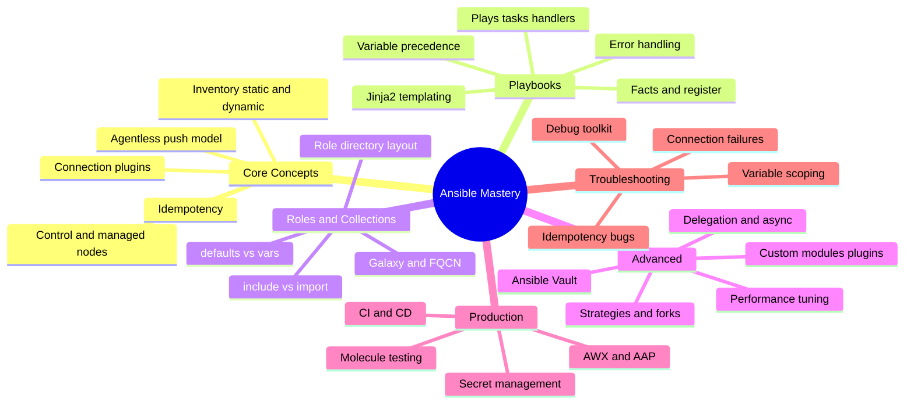

# Ansible — Interview Preparation Guide

> **Target audience:** Senior DevOps Engineers, SREs, and Platform Engineers preparing for FAANG-level interviews.
>
> **Scope:** Ansible taught from first principles — the agentless push architecture, playbook control flow, roles and collections, scale/extension internals (strategies, Vault, custom plugins), production operation (AWX/AAP, testing, CI/CD), and troubleshooting. Every section is **interview-focused**: deep internals, trade-offs, failure modes, and probing Q&A — no filler.

---

## 🗺️ Visual Overview

**In one line:** Ansible is an agentless, push-based engine — the control node ships generated Python over SSH, runs it idempotently, and cleans up. Master that loop plus variable precedence and handler timing, and every other question becomes a consequence.

---

## 📚 Master Table of Contents

| # | Section | File | Est. study time |
|---|---------|------|-----------------|
| 1 | **Core Concepts** — agentless push architecture, control/managed nodes, connection plugins, inventory (static + dynamic), the execution model, idempotency | [01-CORE-CONCEPTS.md](01-CORE-CONCEPTS.md) | 2 h |
| 2 | **Playbooks** — plays/tasks/handlers, variable precedence, facts (`register`/`set_fact`), Jinja2, conditionals/loops, error handling | [02-PLAYBOOKS.md](02-PLAYBOOKS.md) | 2.5 h |
| 3 | **Roles & Collections** — role layout, `defaults` vs `vars`, dependencies, `include` vs `import`, Galaxy, collections & FQCN | [03-ROLES-COLLECTIONS.md](03-ROLES-COLLECTIONS.md) | 1.5 h |
| 4 | **Advanced** — strategies/forks, performance tuning, delegation, async, Ansible Vault, custom modules & plugins | [04-ADVANCED.md](04-ADVANCED.md) | 2.5 h |
| 5 | **Production** — AWX/AAP, execution environments, Molecule testing, CI/CD, secret management, scaling | [05-PRODUCTION.md](05-PRODUCTION.md) | 2 h |
| 6 | **Troubleshooting** — debug toolkit, connection/SSH failures, idempotency bugs, variable scoping, performance diagnosis | [06-TROUBLESHOOTING.md](06-TROUBLESHOOTING.md) | 2 h |

---

## 🧭 Suggested Study Order

1. **Start with [Core Concepts](01-CORE-CONCEPTS.md)** — you can't reason about anything else until you can trace a single task from the control node to a managed node and back, and explain why idempotency makes re-runs safe.
2. **Then [Playbooks](02-PLAYBOOKS.md)** — the highest-leverage control-flow section; variable precedence and handler timing are the two most-probed topics in any Ansible interview.
3. **Then [Roles & Collections](03-ROLES-COLLECTIONS.md)** — how reuse works; the `include` vs `import` (dynamic vs static) distinction is a classic question.
4. **Then [Advanced](04-ADVANCED.md)** — scale and extension: strategies, performance tuning, Vault, and writing your own modules/plugins.
5. **Then [Production](05-PRODUCTION.md)** — operating Ansible as a governed product: AWX/AAP, testing with Molecule, CI/CD, and secrets.
6. **Finish with [Troubleshooting](06-TROUBLESHOOTING.md)** — ties everything together through real failure modes; best reviewed last and revisited right before interviews.

> 💡 **How to use each section:** Every file opens with a **Visual Overview** (mind map + colorful diagrams + memory hooks) — skim it first and revisit it last. Topics carry an **Interview weight** marker and an **In one line** summary. Each closes with **Interview Questions & Answers** (crisp answer → internals → follow-up), **Troubleshooting**, **Best Practices**, and **Docs**.

---

## 🎯 What Makes This Interview-Focused

- **Internals over trivia** — you'll be able to trace the `AnsiballZ` payload to a target, explain the variable-precedence ladder, and know exactly when a handler runs, not just recite definitions.
- **Trade-offs & failure modes** — every topic covers when *not* to use something and how it breaks in production.
- **Colorful Mermaid diagrams** for the hardest flows (task dispatch over SSH, variable precedence, role dependency chains, execution strategies, Vault decryption, failure triage).
- **Memory hooks** (mnemonics) so the details actually stick under interview pressure.

---

**[← Back to Main README](../README.md)** | **[Start: Core Concepts →](01-CORE-CONCEPTS.md)**
