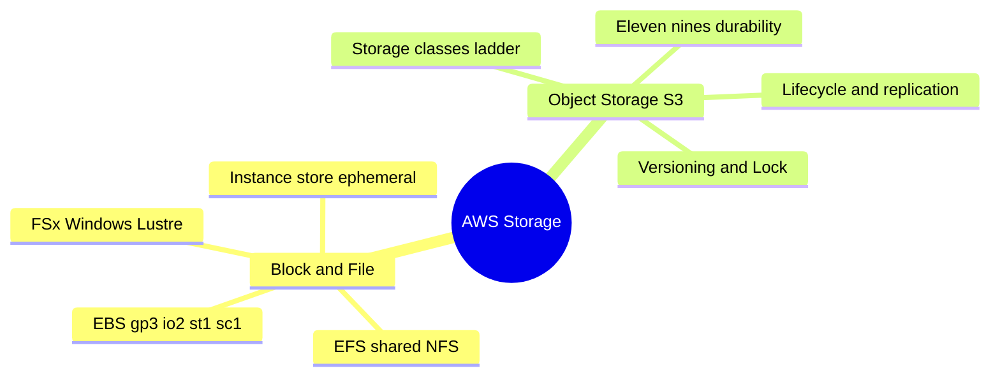
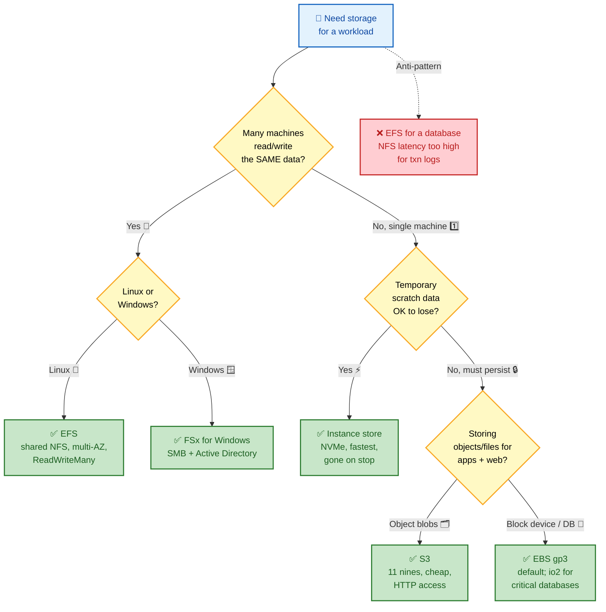
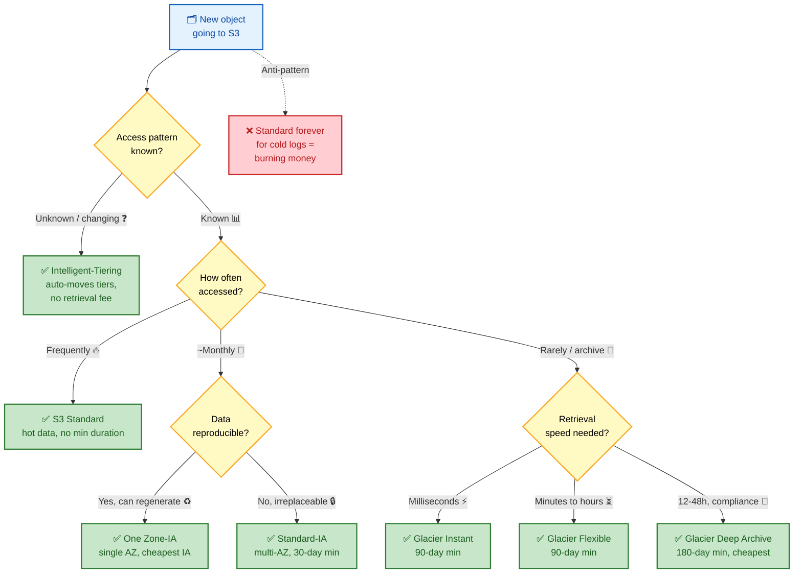
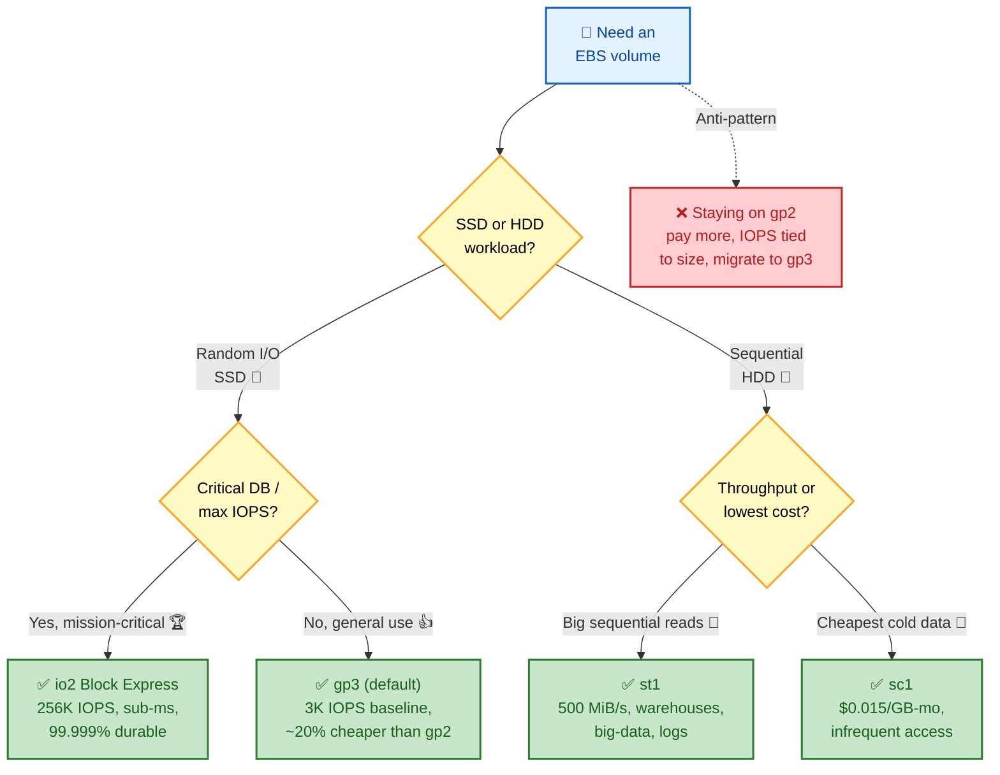

# AWS STORAGE — Deep Dive Interview Preparation

> **Scope:** Section 5 of 20 | Beginner → Expert progression | FAANG-level depth  
> **Coverage:** S3 (classes, durability, versioning, lifecycle, replication), EBS, Instance Store, EFS, FSx, Storage Gateway

---

## Table of Contents

**Section 5: Storage**
10. [Amazon S3 Deep Dive](#10-amazon-s3-deep-dive)
11. [Amazon EBS Deep Dive](#11-amazon-ebs-deep-dive)
12. [Amazon EFS](#12-amazon-efs)
13. [Amazon FSx](#13-amazon-fsx)
14. [Storage Gateway](#14-storage-gateway)

**Common**
15. [Interview Questions & Answers](#15-interview-questions--answers)
16. [Troubleshooting Scenarios](#16-troubleshooting-scenarios)
17. [Production Best Practices](#17-production-best-practices)
18. [Documentation Links](#18-documentation-links)

---

## 🗺️ Visual Overview

**In one line:** Storage is about where bytes live — block, file, or object — and almost every interview question is really "pick the right service for this access pattern and defend the cost."

**Mind map — the storage half at a glance** (skim this first, revisit it last):



**Decision tree 1 — pick the right storage** (green = the usual right answer, red = costly mistake):



**Decision tree 2 — pick the right S3 storage class by access pattern** (the classic cost-optimization question):



> 🧠 **Memory hooks (mnemonics):**
> - **S3 class ladder (hot → cold):** *"Standard, I Ate Glacier's Frozen Dinner"* → **Standard** → **IA** → **Glacier Instant** → **Glacier Flexible** → **Deep Archive**. Colder = cheaper storage but slower + longer minimum retention.
> - **EBS types:** **gp3** = **g**eneral **p**urpose default; **io2** = **i**ntense **o**perations (databases); **st1** = **s**treaming **t**hroughput (sequential HDD); **sc1** = **s**uper **c**heap cold HDD.
> - **Durability vs Availability:** **D**urability = data still **E**xists (11 nines); **A**vailability = you can **A**ccess it now (99.99%). "D = it's not lost, A = you can reach it."

---

## 10. Amazon S3 Deep Dive

### Beginner Foundation

**S3** = object storage. Flat key-value store: each object has a key (string path), value (bytes), and metadata. Not a filesystem — no hierarchy, no file locking, no random writes. Objects are read/written atomically.

> **In one line:** S3 is a globally-durable key-value blob store (not a filesystem) — you get 11 nines of durability and a ladder of storage classes, and the interview game is matching each object's access pattern to the cheapest class that fits. (See [decision tree 2](#-visual-overview).)

**Key properties:**
- **Durability:** 99.999999999% (11 nines)
- **Availability:** 99.99% (Standard)
- **Object size:** 0 B to 5 TB; > 5 GB requires multipart upload; > 100 MB should use it
- **Bucket namespace:** Global (bucket names unique across all AWS accounts and regions)

### 10.1 Durability — 11 Nines Explained

**How achieved:**
1. Objects stored redundantly across ≥ 3 physically separate AZ facilities
2. Erasure coding (redundancy without 3× storage overhead)
3. Continuous integrity checksumming (CRC32C) — bit rot detected and repaired automatically
4. Independent failure domains (AZ isolation: separate power, networking)
5. Versioning protects against accidental deletion

**Availability vs. Durability (commonly confused):**
- **Durability** = probability data EXISTS = 11 nines = effectively zero data loss
- **Availability** = probability you can ACCESS data right now = 99.99% = ~52 min/year potential unavailability

During an S3 availability event, data is NOT lost — temporarily inaccessible.

> 💡 **Interview tip:** Nail this one-liner: **Durability = your data isn't lost; Availability = you can reach it right now.** An S3 outage almost always hits *availability*, not durability — the bytes are safe, you just can't `GET` them for a while.

**What 11 nines does NOT protect against:** Accidental deletion, ransomware, account compromise. Protect with: versioning, Object Lock, cross-account backup, Block Public Access.

### 10.2 S3 Storage Classes

| Class | Use case | Min duration | Availability |
|---|---|---|---|
| **Standard** | Frequently accessed | None | 99.99% |
| **Standard-IA** | Monthly access | 30 days | 99.9% |
| **One Zone-IA** | Reproducible data | 30 days | 99.5% |
| **Glacier Instant** | Archives, ms retrieval | 90 days | 99.9% |
| **Glacier Flexible** | Archives, 1-12 hr retrieval | 90 days | 99.99% |
| **Glacier Deep Archive** | Compliance, 12-48 hr | 180 days | 99.99% |
| **Intelligent-Tiering** | Unknown/changing access | None | 99.9%+ |

**Lifecycle policy:**
```json
{
  "Rules": [{
    "ID": "cost-optimization",
    "Status": "Enabled",
    "Filter": {"Prefix": "logs/"},
    "Transitions": [
      {"Days": 30, "StorageClass": "STANDARD_IA"},
      {"Days": 90, "StorageClass": "GLACIER_INSTANT_RETRIEVAL"},
      {"Days": 365, "StorageClass": "DEEP_ARCHIVE"}
    ],
    "Expiration": {"Days": 2555},
    "AbortIncompleteMultipartUpload": {"DaysAfterInitiation": 7}
  }]
}
```

### 10.3 S3 Consistency Model

**Strong read-after-write consistency for ALL operations since December 2020:**
- PUT then immediate GET → returns new version
- DELETE then immediate LIST → deleted object absent
- No caching, no eventual consistency window

This is a breaking change from the pre-2020 behavior where overwrite PUTs and DELETEs were eventually consistent and required workarounds.

### 10.4 S3 Encryption

| Type | Key management | KMS API overhead | Audit |
|---|---|---|---|
| SSE-S3 | AWS-managed | None | None |
| SSE-KMS | AWS KMS CMK | Per-request KMS call | CloudTrail logs every key use |
| SSE-C | Customer-provided | None | No KMS audit |
| DSSE-KMS | Dual-layer KMS | Higher | Full audit |

**Enforce SSE-KMS via bucket policy:**
```json
{
  "Statement": [{
    "Effect": "Deny",
    "Principal": "*",
    "Action": "s3:PutObject",
    "Resource": "arn:aws:s3:::my-bucket/*",
    "Condition": {
      "StringNotEquals": {
        "s3:x-amz-server-side-encryption": "aws:kms"
      }
    }
  }]
}
```

**S3 Bucket Keys:** Without it, each object PUT makes a separate `GenerateDataKey` KMS call. For 1M objects/day: 1M KMS calls/day (cost + throughput limits). Bucket Key creates a short-lived AES key at bucket level shared across multiple objects → 99% reduction in KMS API calls. Enable for all high-volume encrypted buckets.

### 10.5 Multipart Upload

Objects > 5 GB must use multipart. Objects > 100 MB should use it.

**Parts:** 1–10,000 parts; each ≥ 5 MB (except last). Parallel upload → maximum throughput. Failed parts retry independently.

**Always add AbortIncompleteMultipartUpload lifecycle rule** — incomplete multiparts are billed at Standard rate indefinitely without cleanup.

> ⚠️ **Gotcha:** Abandoned multipart uploads are **invisible in the console object list but still billed** at Standard rate forever. Every bucket should carry an `AbortIncompleteMultipartUpload` lifecycle rule (e.g. 7 days) — a classic silent cost leak.

### 10.6 S3 Versioning & Object Lock

**Versioning:** Every write creates a new version ID. Delete adds a "delete marker" (doesn't remove bytes). Restore by specifying a version ID.

**Object Lock (WORM):**
- **Compliance mode:** No one (including root user) can delete/overwrite until retention expires. For SEC Rule 17a-4, HIPAA.
- **Governance mode:** Overrideable by users with `s3:BypassGovernanceRetention`. For operational flexibility.
- **Legal Hold:** Indefinite hold without expiry. Must be explicitly removed.

### 10.7 S3 Replication

**CRR (Cross-Region Replication):** DR, latency optimization, data residency compliance.
**SRR (Same-Region Replication):** Cross-account sharing, log aggregation, prod→test copy.

**Requirements:** Versioning on both buckets. IAM role with `s3:ReplicateObject` on destination. Existing objects NOT retroactively replicated (use S3 Batch Operations).

**RTC (Replication Time Control):** SLA: 99.99% of objects replicated in ≤ 15 min. Includes CloudWatch metrics for replication lag.

```hcl
resource "aws_s3_bucket_replication_configuration" "crr" {
  role   = aws_iam_role.replication.arn
  bucket = aws_s3_bucket.source.id

  rule {
    id = "replicate-all"
    status = "Enabled"
    destination {
      bucket        = aws_s3_bucket.destination.arn
      storage_class = "STANDARD_IA"
    }
  }
}
```

---

## 11. Amazon EBS Deep Dive

### Beginner Foundation

**EBS** = network-attached block storage. Appears as a block device to the OS (formatttable with any filesystem). Key properties:
- **AZ-specific:** Attach only to instances in the same AZ
- **Persistent:** Data survives instance stop (not instance termination if DeleteOnTermination=true)
- **Network-attached:** Low-latency via Nitro EBS card (NVMe-over-Nitro)
- **Elastic:** Resize, change type, increase IOPS on live volumes

> **In one line:** EBS is a durable network disk that attaches to one instance in one AZ — pick `gp3` by default, `io2` for critical databases, and remember it's AZ-locked (snapshots to S3 are how you cross AZ/Region).

### EBS Volume Types



**gp3 (General Purpose SSD — use this by default):**
- 3,000 IOPS baseline; up to 16,000 IOPS (independent of size)
- 125 MiB/s baseline; up to 1,000 MiB/s
- 20% cheaper than gp2 with more flexibility
- IOPS and throughput configurable independently

**io2 Block Express (highest performance):**
- Up to 256,000 IOPS, 4,000 MiB/s, sub-ms latency
- 99.999% durability (higher than gp3)
- Use for critical databases (Oracle, SQL Server, SAP HANA)

**st1 (Throughput-Optimized HDD):**
- Optimized for large sequential reads (500 MiB/s max)
- Cannot boot; use for data warehouses, big data, log files

**sc1 (Cold HDD):**
- Lowest cost ($0.015/GB-month)
- 250 MiB/s max; for infrequently accessed data

**gp2 vs. gp3 — the key difference:**
- gp2: IOPS = 3 × size GB (performance tied to size; 100 GiB gp2 = 300 IOPS baseline)
- gp3: IOPS independently configurable (100 GiB gp3 = 3,000 IOPS baseline at lower price)
- Migration: Always move gp2 to gp3 for cost savings with no downtime

```bash
# Live migration: gp2 → gp3 with increased IOPS
aws ec2 modify-volume \
  --volume-id vol-0abc123 \
  --volume-type gp3 \
  --iops 5000 \
  --throughput 500

# Monitor status
aws ec2 describe-volumes-modifications --volume-id vol-0abc123 \
  --query 'VolumesModifications[0].ModificationState'
# modifying → optimizing → completed

# Extend filesystem after size increase (no restart needed)
sudo resize2fs /dev/xvda1  # ext4
sudo xfs_growfs /           # xfs
```

**EBS snapshots:**
- Incremental: only changed blocks since last snapshot stored in S3.
- Cross-region, cross-account copy supported.
- Basis for AMIs and EBS Multi-Volume Crash-Consistent Snapshots.

```bash
# Create snapshot with resource tags
aws ec2 create-snapshot \
  --volume-id vol-0abc123 \
  --description "Pre-upgrade snapshot" \
  --tag-specifications 'ResourceType=snapshot,Tags=[{Key=Env,Value=Prod}]'
```

---

## 12. Amazon EFS

**EFS** = managed NFS for Linux. Thousands of instances can mount the same EFS simultaneously in the same Region (multi-AZ).

> **In one line:** EFS is the *shared* storage answer — elastic multi-AZ NFS that many Linux boxes (or EKS pods) mount at once (ReadWriteMany), trading EBS's low latency for scale and simultaneous access.

**Key differentiators from EBS:**
- Multi-mount (ReadWriteMany): EBS single-attach (except io2 Multi-Attach)
- Multi-AZ (redundant across 3+ AZs): EBS is AZ-local
- Elastic: No pre-provisioning; auto grows/shrinks
- NFS protocol: Linux only (Windows → FSx for Windows)

**Performance modes:**
- General Purpose: < 1 ms latency, for web serving, CMS, home directories
- Max I/O: Higher throughput, higher latency (> 1 ms), for big data analytics

**Throughput modes:**
- Elastic (recommended): Automatically scales; no pre-provisioning
- Provisioned: Pre-provision throughput independent of storage size
- Bursting: Scales with storage size + burst credits

**EFS for EKS (ReadWriteMany PV):**
```yaml
apiVersion: v1
kind: PersistentVolumeClaim
metadata:
  name: efs-claim
spec:
  accessModes:
    - ReadWriteMany   # Key: multiple pods can mount simultaneously
  storageClassName: efs-sc
  resources:
    requests:
      storage: 5Gi
```

---

## 13. Amazon FSx

> **In one line:** FSx is AWS's family of *managed third-party filesystems* — pick by ecosystem: **Windows** (SMB/AD), **Lustre** (HPC/ML speed), **NetApp ONTAP** (enterprise multi-protocol), or **OpenZFS** (snapshots/clones).

**FSx for Windows File Server:**
- Full SMB protocol, Active Directory integration
- Multi-AZ HA option
- For Windows apps requiring native file shares (SQL Server FCI, user home dirs, `\\server\share`)

**FSx for Lustre:**
- High-performance parallel filesystem: up to 1 TB/s aggregate throughput
- Sub-millisecond latency; uses EC2 EFA (Enhanced Fabric Adapter) for HPC
- Native S3 integration: link to S3 bucket, data lazily loaded on first access
- Used for ML training datasets, HPC, video processing

**FSx for NetApp ONTAP:**
- Full NetApp feature set (NFS, SMB, iSCSI, SnapMirror, dedup, compression, FlexClone)
- Multi-protocol, multi-AZ
- Migration path from on-premises NetApp

**FSx for OpenZFS:**
- ZFS features: snapshots, copy-on-write, compression, instant clones
- NFS protocol, Linux/macOS
- Clone entire environments instantly for dev/test

---

## 14. Storage Gateway

Bridges on-premises environments to AWS storage. Runs as a VM appliance in your data center.

| Gateway Type | Protocol | Backend | Use Case |
|---|---|---|---|
| S3 File Gateway | NFS/SMB | Amazon S3 | Replace on-prem file servers |
| FSx File Gateway | SMB | FSx for Windows | Locally cached Windows shares |
| Tape Gateway | iSCSI VTL | S3 → Glacier | Replace physical tape libraries |
| Volume Gateway (stored) | iSCSI | S3 (async backup) | Full local storage + cloud backup |
| Volume Gateway (cached) | iSCSI | S3 (primary) | S3 primary with local cache |

---

## 15. Interview Questions & Answers

---

### Question 2: Explain S3 durability. A customer asks: "If I store 10 million files in S3, how many files can I expect to lose per year?" Answer with the calculation.

**What the interviewer is testing:** Understanding of probabilistic durability, real-world application.

**Strong answer:**

S3 Standard durability = 99.999999999% = 1 - 10^(-11) probability of losing a given object in a given year.

**Calculation:**
- P(lose one object in a year) = 1 - 0.99999999999 = 0.00000000001 = 10^(-11)
- Expected objects lost per year = total objects × P(lose) = 10,000,000 × 10^(-11) = 10^7 × 10^(-11) = **0.0001 objects per year**

So for 10 million objects, you'd expect to lose 0.0001 objects per year — effectively zero, or statistically: one lost object every 10,000 years for a set of 10 million objects.

**How AWS achieves this:**
1. Objects stored across ≥ 3 AZ facilities with erasure coding.
2. Continuous integrity scanning (CRC32C checksums on every block, background repair of detected corruption).
3. Independent failure domains (separate power, network, physical hardware per AZ).

**What this does NOT protect against:**

Customer-initiated data loss scenarios:
- Accidental deletion → versioning + Object Lock (compliance or governance mode)
- Overwriting objects → versioning (keeps all versions)
- Ransomware deleting all objects → S3 Block Public Access + cross-account immutable backup + Object Lock
- Account compromise → AWS Organizations SCP preventing `s3:DeleteBucket`, cross-account backup

**Likely follow-ups:**
1. *When would you choose S3 One Zone-IA?* — For reproducible/regeneratable data only (thumbnails from originals, computed reports from a database). Durability drops significantly (single AZ — AZ failure = data loss). Never for irreplaceable data.
2. *How does S3 Replication complement durability?* — Replication adds regional durability. Single Region durability is 11 nines, but the entire Region could be inaccessible during a major event. CRR ensures a complete copy exists in another Region for DR and compliance.

---

### Question 4: When would you choose EFS over EBS, and what are the trade-offs?

**What the interviewer is testing:** Storage selection judgment, distributed systems understanding.

**Strong answer:**

**Choose EFS when:**
1. **Multiple instances need simultaneous read/write access to the same data** — EBS allows only one instance (except io2 Multi-Attach). EFS mounts on thousands of instances simultaneously.
2. **Kubernetes workloads needing ReadWriteMany PVC** — EKS pods across multiple AZs share an EFS volume. EBS supports ReadWriteOnce (single pod) only.
3. **No pre-provisioning needed** — EFS grows and shrinks automatically. EBS requires size pre-commitment.
4. **Multi-AZ redundancy** — EFS data is replicated across ≥ 3 AZs. An AZ failure doesn't lose or interrupt EFS access. An EBS volume failure in one AZ is unrecoverable without a snapshot.
5. **Home directories for thousands of users** — Each user gets a directory in a shared EFS filesystem. Scaling to 1,000 users doesn't require 1,000 EBS volumes.

**Choose EBS when:**
1. **Single-instance, high-performance I/O** — EBS (io2) provides < 1 ms latency, 256,000 IOPS. EFS latency is 1–10 ms (General Purpose) or higher.
2. **Databases** — Relational databases (PostgreSQL, MySQL, Oracle) on EC2 use EBS. The single-writer model, IOPS consistency, and low latency suit databases. EFS NFS latency is too high for database transaction logs.
3. **Windows workloads** — EFS is NFS (Linux only). Windows requires EBS (NTFS) or FSx for Windows.
4. **Boot volumes** — EC2 boot volumes must be EBS (EFS cannot be a boot device).
5. **Cost sensitivity at high IOPS** — EBS gp3 at 3,000 IOPS is $0.08/GB-month. EFS Standard is $0.30/GB-month. For high-I/O single-instance workloads, EBS is significantly cheaper.

**Performance comparison:**

| Metric | EBS gp3 | EBS io2 | EFS |
|---|---|---|---|
| Latency | < 1 ms | < 0.5 ms | 1–10 ms |
| IOPS | up to 16,000 | up to 256,000 | Scales with throughput mode |
| Throughput | up to 1,000 MiB/s | up to 4,000 MiB/s | Up to 10 GB/s (Elastic) |
| Multi-attach | io2 only (up to 16) | Yes (up to 16) | Yes (thousands) |
| AZ scope | Single AZ | Single AZ | Regional (multi-AZ) |

**Production example:** A content management system with 50 web servers serving shared media files. EFS mounts the same filesystem on all 50 servers — content editors upload once and all servers immediately see the new file. With EBS, you'd need a different architecture (S3 + CloudFront, or a manual sync mechanism).

**Likely follow-ups:**
1. *Can you use EFS with EKS Fargate?* — Yes. EFS is the only supported persistent volume type for EKS Fargate (EBS is not supported on Fargate). Use the EFS CSI driver with a static or dynamic PVC.
2. *What is EFS Intelligent-Tiering?* — Automatically moves files between Standard and IA tiers based on access frequency. Files not accessed for N days (configurable, default 30) move to IA (91% cheaper). On next access, they move back to Standard. No code changes needed — transparent to applications.

---

## 16. Troubleshooting Scenarios

### Scenario 2: "EC2 instance becomes unreachable after gp2 → gp3 EBS volume migration."

**Symptom:** After volume modification, SSH connections to the instance time out. The AWS console shows the instance is running.

**Investigation:**

```bash
# Step 1: Check modification status
aws ec2 describe-volumes-modifications \
  --volume-id vol-0abc123

# Step 2: Check instance system logs (doesn't require SSH)
aws ec2 get-console-output --instance-id i-0abc123 --latest

# Step 3: Check instance status checks
aws ec2 describe-instance-status --instance-id i-0abc123

# Step 4: Try SSM Session Manager (doesn't use SSH)
aws ssm start-session --target i-0abc123
```

**Most likely cause:** Volume modification from gp2 to gp3 does NOT require restart, but if the volume type changes involve the root volume and the OS has an open filesystem journal, a brief I/O pause during the transition can cause the OS to detect filesystem corruption on resume. The OS may have mounted the filesystem read-only or triggered fsck.

**Resolution without SSH (via SSM):**
```bash
# Check filesystem status
dmesg | tail -50 | grep -E "EXT4-fs|XFS|error|I/O error"

# If filesystem mounted read-only
sudo mount -o remount,rw /

# If fsck needed (for ext4)
sudo fsck -y /dev/xvda1  # only when unmounted or in recovery mode
```

**Better approach for root volume modifications:** For root volume type changes, snapshot first, then schedule a maintenance window where you stop the instance, modify the volume type, and restart. This avoids any risk of I/O interruption affecting the OS.

---

## 17. Production Best Practices

**S3:**
- Enable versioning + Object Lock for production data buckets.
- Enable Block Public Access at account level (prevents any bucket from being public).
- Use S3 Bucket Keys for all KMS-encrypted buckets receiving > 10K requests/day.
- Add `AbortIncompleteMultipartUpload` lifecycle rule to all buckets.
- Configure S3 access logging or S3 Server Access Logs for security forensics.

**EBS:**
- Migrate all gp2 volumes to gp3 (cheaper, more flexible, no downtime required).
- Enable EBS encryption by default at account level: `aws ec2 enable-ebs-encryption-by-default`.
- Automate EBS snapshots via AWS Backup with retention tiers (daily/weekly/monthly).
- Monitor `BurstBalance` for gp2 volumes (migrate to gp3 to eliminate burst concerns).

---

## 18. Documentation Links

| Topic | Official Link |
|---|---|
| Amazon S3 | https://docs.aws.amazon.com/AmazonS3/latest/userguide/Welcome.html |
| S3 Storage Classes | https://docs.aws.amazon.com/AmazonS3/latest/userguide/storage-class-intro.html |
| S3 Object Lock | https://docs.aws.amazon.com/AmazonS3/latest/userguide/object-lock.html |
| EBS Volume Types | https://docs.aws.amazon.com/AWSEC2/latest/UserGuide/ebs-volume-types.html |
| EBS Encryption | https://docs.aws.amazon.com/AWSEC2/latest/UserGuide/EBSEncryption.html |
| Amazon EFS | https://docs.aws.amazon.com/efs/latest/ug/whatisefs.html |
| Amazon FSx | https://docs.aws.amazon.com/fsx/ |
| Storage Gateway | https://docs.aws.amazon.com/storagegateway/latest/userguide/WhatIsStorageGateway.html |
| AWS Backup | https://docs.aws.amazon.com/aws-backup/latest/devguide/whatisbackup.html |

---

*Continue to [06-EKS-DEEP-DIVE.md](./06-EKS-DEEP-DIVE.md) for Section 6.*
