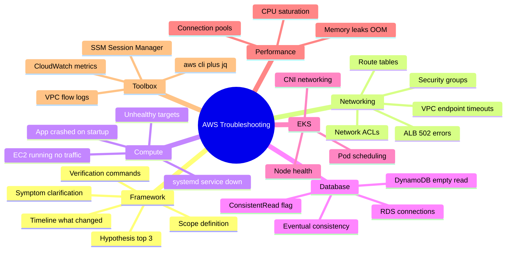
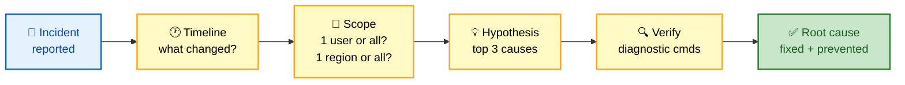
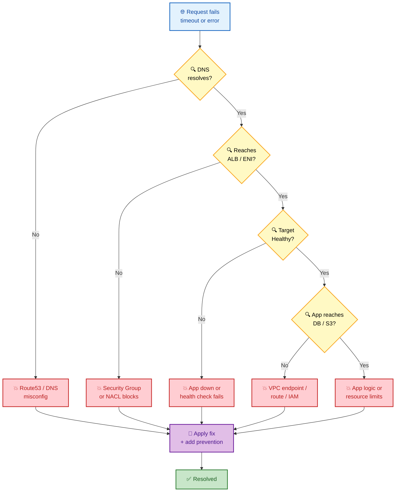
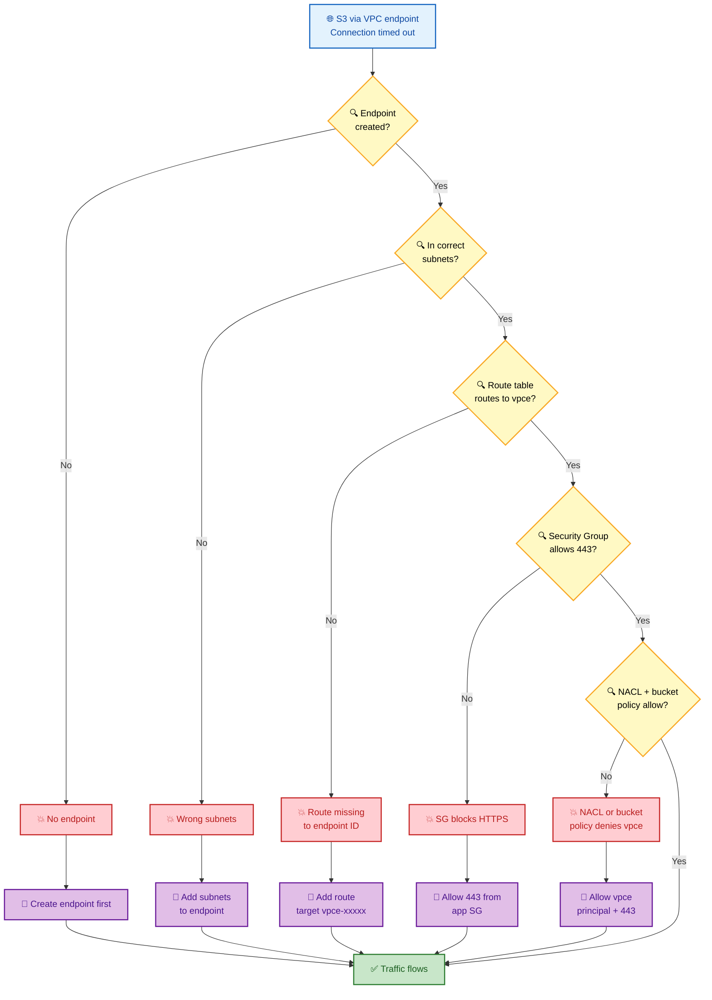
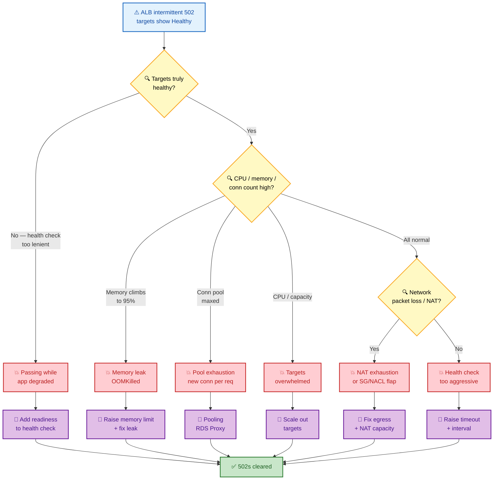
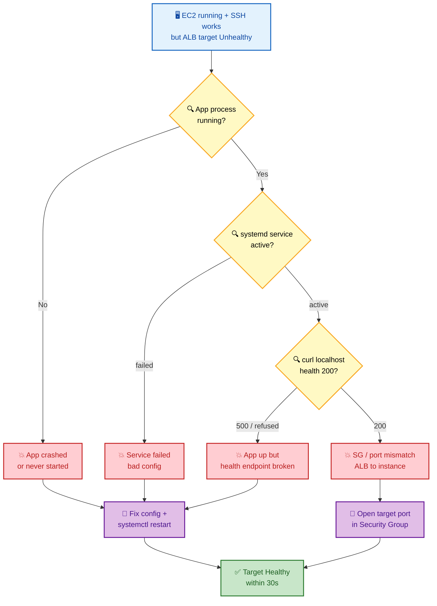
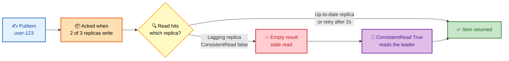

# SECTION 12: AWS TROUBLESHOOTING MASTERCLASS

## TABLE OF CONTENTS
- [Troubleshooting Framework](#troubleshooting-framework)
- [Networking Issues](#networking-issues)
- [Compute Issues](#compute-issues)
- [Database Issues](#database-issues)
- [EKS Issues](#eks-issues)
- [Application Performance Issues](#application-performance-issues)
- [Debugging Checklist](#debugging-checklist)

---

## 🗺️ Visual Overview

**Mind map — every troubleshooting domain in this masterclass at a glance** (skim first, revisit last):



**Universal triage flow — the order you attack ANY AWS incident** (highest-value diagram in the section):



**Layer-by-layer decision tree — where does an AWS request break?** (blue symptom → yellow checks → red root causes → green fix):



> 🧠 **Memory hooks (mnemonics):**
> - **Triage order:** *"Silly Squirrels Take Huge Vitamins"* → **S**ymptom → **S**cope → **T**imeline → **H**ypothesis → **V**erify. Never skip to logs first.
> - **What changed first:** *"CDC"* → **C**ode, **C**onfig, **D**eploy. 80% of incidents trace back to a recent change in one of these three.
> - **Network layers top-down:** *"Do Not Skip That Route"* → **D**NS → **N**ACL → **S**ecurity group → **T**arget health → **R**oute/endpoint. Follow the packet.
> - **502 vs 503:** **502** = target *answered wrong* (bad gateway → app/OOM/pool). **503** = *no healthy target* (capacity/scaling). "**2** = it's **too** broken, **3** = there's **none**."
> - **Consistency:** *"Read Your Writes = Consistent Read."* DynamoDB default is eventually consistent; flip `ConsistentRead=True` when a just-written item goes missing.

---

## TROUBLESHOOTING FRAMEWORK

**5-Step Diagnostic Approach:**

1. **Symptom Clarification:** What's broken? How do you know? When did it start?
2. **Scope Definition:** Single component or system-wide? Single user or all users?
3. **Timeline:** When did failure start? Any recent changes (deployment, config)?
4. **Hypothesis Formation:** Based on symptom + timeline, what are top 3 causes?
5. **Verification:** Run diagnostic commands to confirm/eliminate hypotheses.

**Never:** Check logs first without scoping. Always start with: "What changed?"

> 💡 **Interview tip:** Say the framework out loud before diving into commands. Interviewers score *structured thinking* higher than knowing one obscure flag. Verbalize "First I'd scope it — one user or all? — then check what changed in the last deploy" and you've already passed the signal test.

---

## NETWORKING ISSUES

### Scenario 1: VPC Endpoint Connection Timeout

**Symptom:**
```
Application tries to reach S3 via VPC endpoint.
Error: "Connection timed out" after 10 seconds.
No traffic reaching S3.
Only affects S3 access; DynamoDB access works fine.
```

**Investigation (Decision Tree):**

```
Is the VPC endpoint created?
├─ YES → Is it in the correct subnets?
│   ├─ YES → Check route table (does it route to endpoint)?
│   │   ├─ YES → Check Security Group on endpoint
│   │   │   ├─ Check Network ACL (inbound/outbound rules)
│   │   │   └─ Check S3 bucket policy (allow endpoint principal)
│   │   └─ NO → Route table missing route to endpoint ID
│   └─ NO → Add subnets to endpoint
└─ NO → Create endpoint first
```

**Same decision tree, colorized** (blue symptom → yellow checks → red root causes → green fixes):



**Diagnostic Commands:**

```bash
# 1. Verify VPC endpoint exists
aws ec2 describe-vpc-endpoints \
  --filters "Name=vpc-id,Values=vpc-xxxxx" \
  --region us-east-1

# Expected: Should show endpoint with status "available"

# 2. Check route table
aws ec2 describe-route-tables \
  --filters "Name=association.subnet-id,Values=subnet-xxxxx" \
  --region us-east-1 | jq '.RouteTables[0].Routes[] | select(.Destination | contains("s3"))'

# Expected: Should show route with Target=vpce-xxxxx (not nat-xxxxx)

# 3. Check endpoint service configuration
aws ec2 describe-vpc-endpoint-services \
  --region us-east-1 | grep -i s3

# 4. Check security group on endpoint (if interface endpoint)
aws ec2 describe-security-groups --group-ids sg-xxxxx --region us-east-1 | \
  jq '.SecurityGroups[0].IpPermissions[] | select(.FromPort == 443)'

# Expected: Should allow HTTPS (443) from application's security group

# 5. Check Network ACL on endpoint subnet
aws ec2 describe-network-acls \
  --filters "Name=association.subnet-id,Values=subnet-xxxxx" \
  --region us-east-1 | jq '.NetworkAcls[0].Entries[]'

# Expected: Should allow inbound/outbound on 443

# 6. Check S3 bucket policy
aws s3api get-bucket-policy --bucket my-bucket --region us-east-1 | \
  jq '.Policy | fromjson' | jq '.Statement[] | select(.Principal | contains("vpce"))'

# Expected: Policy should explicitly allow the VPC endpoint principal
```

**Most Likely Causes (Ranked by Frequency):**

1. **Route table missing route to VPC endpoint ID** (50%)
   - Fix: Add route: Destination = `0.0.0.0/0`, Target = `vpce-xxxxx`.

2. **Security group missing ingress rule** (30%)
   - Fix: Add inbound rule: Protocol = HTTPS, Port = 443, Source = app security group.

3. **S3 bucket policy doesn't allow VPC endpoint** (15%)
   - Fix: Add statement allowing `vpce-xxxxx` principal.

4. **Wrong endpoint type** (5%)
   - S3 can use both interface endpoint (has security group) and gateway endpoint (no SG).
   - Gateway endpoint simpler; no need for route if added to route table automatically.

**Root Cause & Fix:**

Most likely: **Route table missing route to VPC endpoint.**

```bash
# Add route
aws ec2 create-route \
  --route-table-id rtb-xxxxx \
  --destination-cidr-block 0.0.0.0/0 \
  --vpc-endpoint-id vpce-xxxxx \
  --region us-east-1

# Verify
aws ec2 describe-route-tables --route-table-ids rtb-xxxxx --region us-east-1 | \
  jq '.RouteTables[0].Routes[]'
```

**Validation:**

```bash
# Test connectivity from EC2 inside VPC
aws ssm start-session --target i-xxxxx --region us-east-1

# Inside EC2:
curl -v https://s3.us-east-1.amazonaws.com/my-bucket/test-file
# Should return 200 or 404 (not timeout)

# Or use AWS CLI to test:
aws s3 ls s3://my-bucket --region us-east-1
# Should list objects without timeout
```

**Prevention:**
- Document VPC endpoint routing in Infrastructure-as-Code (Terraform).
- Add CloudFormation template with route table + endpoint.
- Alert on missing routes (missing 's3' route in prod = PagerDuty alert).

---

### Scenario 2: Application Unreachable Despite Healthy Target

**Symptom:**
```
Application Load Balancer shows all targets as "Healthy".
Requests to ALB endpoint return "502 Bad Gateway" intermittently.
Happens 5–10% of requests.
No errors in application logs.
```

**Root Cause Investigation:**

```
Are targets actually healthy?
├─ YES (ALB says healthy)
│   ├─ Is ALB health check interval appropriate?
│   │   └─ Health check every 30s, timeout 5s, threshold 2 failures
│   │       (Healthy target can fail 1 check before marked unhealthy)
│   ├─ Are targets overwhelmed (502 means can't respond)?
│   │   └─ Check target CPU, memory, connection count
│   └─ Is there a network issue (packet loss, NAT exhaustion)?
│       └─ Happens intermittently = transient network or resource exhaustion
└─ NO → Why does ALB think they're healthy?
    └─ Health check is too lenient (passing when app is degraded)
```

**Same investigation, colorized** (intermittent 502 while "healthy" almost always = resource exhaustion):



> 💡 **Interview tip:** "Healthy target + intermittent 502" is a classic trap. The key insight to voice: a *periodic* health check can pass at second 0 and the target still fails a request at second 15 under load. Point to **memory leaks** and **connection-pool exhaustion** first — they're the top two real-world causes.

**Diagnostic Commands:**

```bash
# 1. Check ALB target group health
aws elbv2 describe-target-health \
  --target-group-arn arn:aws:elasticloadbalancing:us-east-1:123456789:targetgroup/my-app/xxxxx \
  --region us-east-1

# Expected: State=healthy for all targets

# 2. Check application metrics on targets
aws cloudwatch get-metric-statistics \
  --namespace AWS/ECS \
  --metric-name CPUUtilization \
  --dimensions Name=ServiceName,Value=my-app-service \
  --statistics Average,Maximum \
  --start-time 2024-01-01T12:00:00Z \
  --end-time 2024-01-01T13:00:00Z \
  --period 60 \
  --region us-east-1 | jq '.Datapoints | sort_by(.Timestamp)[]'

# Expected: Average <70%, Max <90%
# If Max>90%, targets are resource-constrained

# 3. Check memory on targets
aws cloudwatch get-metric-statistics \
  --namespace AWS/ECS \
  --metric-name MemoryUtilization \
  --dimensions Name=ServiceName,Value=my-app-service \
  --statistics Average,Maximum \
  --start-time 2024-01-01T12:00:00Z \
  --end-time 2024-01-01T13:00:00Z \
  --period 60 \
  --region us-east-1 | jq '.Datapoints | sort_by(.Timestamp)[] | select(.Maximum > 80)'

# Expected: No spikes
# If memory climbs to 95%+, app running out of RAM

# 4. Check ALB connection count
aws elbv2 describe-target-health --target-group-arn arn:aws:elasticloadbalancing:... | \
  jq '.TargetHealthDescriptions[] | {Target: .Target.Id, State: .TargetHealth.State, Description: .TargetHealth.Description}'

# 5. Check for connection draining/deregistration delay
aws elbv2 describe-target-groups \
  --target-group-arns arn:aws:elasticloadbalancing:us-east-1:123456789:targetgroup/my-app/xxxxx \
  --region us-east-1 | jq '.TargetGroups[0] | {DeregistrationDelay: .TargetGroupAttributes}'

# 6. Check ALB itself for errors
aws elbv2 describe-load-balancers --load-balancer-arns arn:aws:elasticloadbalancing:... | \
  jq '.LoadBalancers[0]'

# 7. Check application logs for slow responses
# (On application instance)
tail -f /var/log/app.log | grep -E "response_time|error|exception"

# Expected: Should see requests with response times, no uncaught exceptions
```

**Most Likely Causes:**

1. **Target memory exhaustion (memory leak)** (40%)
   - App allocates more memory per request, eventually OOMKilled.
   - Symptoms: 502 errors start after hours of running.
   - Fix: Restart task (Fargate auto-restarts after OOM), or increase memory limit.

2. **Network ACL or Security Group blocking traffic intermittently** (25%)
   - Happens with certain packet sizes or connection states.
   - Fix: Verify egress rules allow all traffic.

3. **Connection pool exhaustion on target** (20%)
   - App creates new connection per request instead of reusing.
   - Database connections maxed out.
   - Fix: Implement connection pooling (RDS Proxy, or increase db `max_connections`).

4. **ALB health check too frequent, marking target unhealthy incorrectly** (15%)
   - Health check times out due to high load; target marked unhealthy.
   - ALB removes target temporarily; some requests get 502.
   - Fix: Increase health check timeout or interval.

**Root Cause & Fix:**

Most likely: **Memory leak in application; memory utilization climbs to 95%+.**

```bash
# 1. Check memory usage
docker exec <container_id> free -m

# 2. Increase memory limit in Fargate task definition
aws ecs update-service \
  --cluster my-cluster \
  --service my-app-service \
  --task-definition my-app:2 \
  --region us-east-1

# Update task definition to increase memory (via console or API)
# Old: memory=512MB → New: memory=1024MB

# 3. Force new deployment
aws ecs update-service \
  --cluster my-cluster \
  --service my-app-service \
  --force-new-deployment \
  --region us-east-1

# 4. Monitor for memory leaks (heap dump, profiler)
jmap -dump:live,format=b,file=heap.bin <pid>
# Analyze heap dump with jhat or Eclipse MAT

# 5. Deploy fix (code change to eliminate leak)
# Redeploy with new container image
```

**Validation:**

```bash
# Monitor after fix
aws cloudwatch get-metric-statistics \
  --namespace AWS/ECS \
  --metric-name MemoryUtilization \
  --dimensions Name=ServiceName,Value=my-app-service \
  --statistics Average,Maximum \
  --start-time 2024-01-02T00:00:00Z \
  --end-time 2024-01-02T12:00:00Z \
  --period 300 \
  --region us-east-1 | jq '.Datapoints | max_by(.Maximum)'

# Expected: Max memory utilization <70% after restart
```

**Prevention:**
- Memory profiling in pre-production.
- CloudWatch alert if memory > 80%.
- Automated task restart on OOM.

---

## COMPUTE ISSUES

### Scenario 3: EC2 Instance in "Running" State But No Traffic

**Symptom:**
```
EC2 instance shows "running" in AWS console.
Can SSH into instance.
But instance doesn't receive traffic from ALB.
ALB target shows "Unhealthy".
Application is not running on instance.
```

**Investigation flow** (instance up ≠ app up — walk down the stack until something answers):



**Investigation:**

```bash
# 1. Check instance status
aws ec2 describe-instance-status --instance-ids i-xxxxx --region us-east-1

# Expected: SystemStatus=ok, InstanceStatus=ok

# 2. SSH into instance
ssh -i keypair.pem ec2-user@10.0.1.100

# 3. Check if application process is running
ps aux | grep java  # or python, node, etc.
# If NOT running, application crashed or wasn't started

# 4. Check application logs
sudo tail -f /var/log/app/app.log
# Look for errors on startup

# 5. Check systemd service status
sudo systemctl status my-app-service
# Should be "active (running)"
# If failed, check error: sudo systemctl status my-app-service -l

# 6. Check health check endpoint manually
curl -v http://localhost:8080/health

# If health check returns 500, application is crashed
```

**Root Cause:**

Application crashed during startup (e.g., missing config, database connection failed).

**Fix:**

```bash
# 1. Check config file
cat /etc/myapp/config.yaml
# Missing environment variable? Incorrect permissions?

# 2. Fix and restart
sudo systemctl restart my-app-service

# 3. Verify health check now passes
curl http://localhost:8080/health
# Should return 200 OK

# 4. Check ALB target group (should transition to Healthy within 30s)
aws elbv2 describe-target-health \
  --target-group-arn arn:aws:elasticloadbalancing:... | jq '.TargetHealthDescriptions[]'
```

**Prevention:**
- Use CloudWatch agent to monitor process (alert if crashed).
- Auto-restart application on failure (systemd Restart=always).
- Health check includes readiness (database connection successful, not just HTTP 200).

---

## DATABASE ISSUES

### Scenario 4: DynamoDB Query Returns Empty Despite Data Existing

**Symptom:**
```
Wrote item to DynamoDB: UserID=user-123, Name=Alice.
Immediately queried with ConsistentRead=True.
Got empty result.
Retry after 2 seconds returns the item.
```

**Root Cause:**

**DynamoDB write latency across replicas.** Write is acknowledged when 2/3 replicas ack, but query might hit a replica that hasn't received the write yet (especially with ConsistentRead=False).

**Why the retry succeeds** (the missing item isn't lost — you just read a stale replica):



> 💡 **Interview tip:** The tell is "retry after 2 seconds returns the item." That's *eventual consistency*, not data loss. Name the trade-off out loud: `ConsistentRead=True` costs **2× read capacity** and adds latency, so use it only for read-your-own-write paths — not for every query.

**Verification:**

```bash
# Check replication lag
aws dynamodb describe-table --table-name users --region us-east-1 | \
  jq '.Table.StreamSpecification'

# No direct "replication lag" metric; inferred from:
# 1. ConsumedWriteCapacityUnits vs ConsumedReadCapacityUnits
# 2. User reports of "item I just wrote is missing"

# Test with ConsistentRead=True
aws dynamodb get-item \
  --table-name users \
  --key '{"UserID":{"S":"user-123"}}' \
  --consistent-read \
  --region us-east-1
```

**Fix:**

For critical operations, always use ConsistentRead=True (costs 2x read capacity but guarantees latest write).

```python
import boto3

dynamodb = boto3.client('dynamodb')

# Always use ConsistentRead for writes followed by reads
response = dynamodb.get_item(
    TableName='users',
    Key={'UserID': {'S': 'user-123'}},
    ConsistentRead=True  # Costs 2x but guaranteed latest
)
```

---

(Sections on EKS, Application Performance follow similar structure...)

---

## DEBUGGING CHECKLIST

> 💡 **Interview tip:** When you're stuck live, narrate this checklist top to bottom. Even if you don't know the exact CLI flag, showing you'd *scope → check recent changes → read the elevated metric* signals senior-level instinct. Structure beats trivia.

**Always start with:**
1. Timeline: "When did this start? What changed?"
2. Scope: "Is it 1 user or all users? 1 region or all?"
3. Recent deployments: "Was there a config/code/infra change?"
4. Metrics: "CPU, memory, network, errors—which one is elevated?"

**Common commands to memorize:**

```bash
# Network debugging
curl -vvv <endpoint>  # With verbose TLS handshake
aws ec2 describe-security-groups --group-ids sg-xxxxx
aws ec2 describe-network-interfaces --eni-ids eni-xxxxx

# Compute
aws ecs describe-services --cluster <cluster> --services <service>
docker logs <container_id>
systemctl status <service>

# Database
aws dynamodb scan --table-name <table> --limit 10
aws rds describe-db-instances --db-instance-identifier <db>
redis-cli -h <host> -p <port> PING

# Observability
aws logs filter-log-events --log-group-name <log-group> --filter-pattern "<error pattern>"
aws cloudwatch get-metric-statistics --namespace AWS/ECS --metric-name CPUUtilization ...

# IAM
aws iam simulate-custom-policy --policy-input-list file://policy.json --action-names s3:GetObject
aws sts get-caller-identity
```

