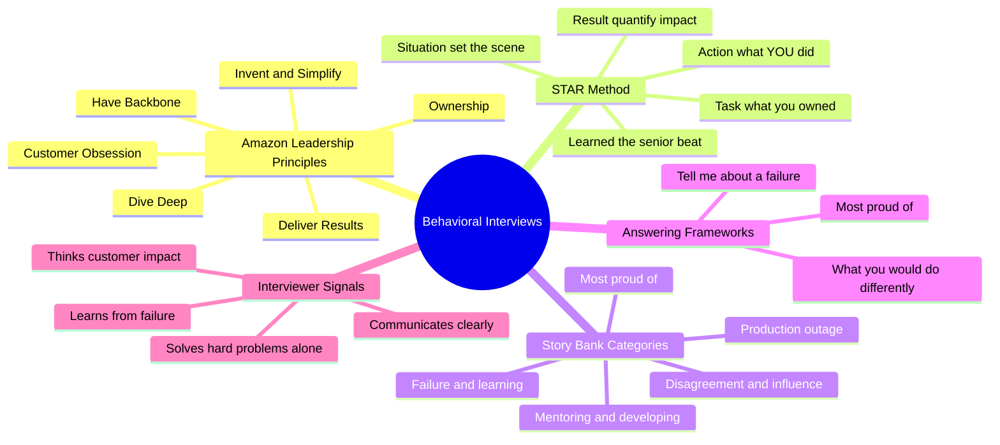
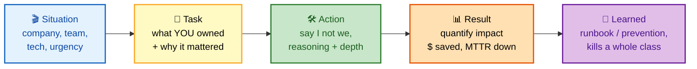
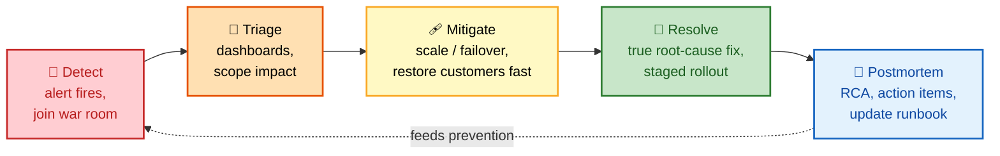
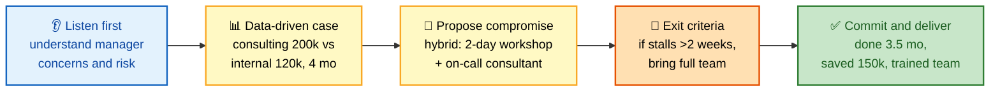

# SECTION 13: FAANG BEHAVIORAL & LEADERSHIP INTERVIEWS

## TABLE OF CONTENTS
- [Amazon Leadership Principles](#amazon-leadership-principles)
- [STAR Method](#star-method)
- [Behavioral Scenarios](#behavioral-scenarios)
- [Answering Frameworks](#answering-frameworks)

---

## 🗺️ Visual Overview

**Mind map — the whole section at a glance** (skim this first, revisit it last):

**The STAR answer skeleton — memorize this five-beat flow** (highest-value diagram here):

**The incident-response loop — the arc every production war story should trace:**

> 🧠 **Memory hooks (mnemonics):**
> - **STAR + L** — **S**ituation, **T**ask, **A**ction, **R**esult, then **L**earned. The "L" is the senior-differentiating beat most candidates forget.
> - **"Own the I in STAR."** Say **"I"** for your decisions and **"we"** for team context — never hide your personal contribution behind the team.
> - **"Quantify the Result or it didn't happen."** Attach a number — $ saved, MTTR down, outages prevented — or the story reads as junior.
> - **DTMRP incident loop** — **D**etect, **T**riage, **M**itigate, **R**esolve, **P**ostmortem. Mitigate (fast) always comes before Resolve (thorough).
> - **"COD DD"** for the highest-signal LPs to weave in: **C**ustomer Obsession, **O**wnership, **D**ive Deep, **D**eliver Results.

---

## AMAZON LEADERSHIP PRINCIPLES

**FAANG companies (especially Amazon) evaluate:**

1. **Customer Obsession:** Everything you build should solve real customer problems.
2. **Ownership:** Take responsibility for outcomes, not just tasks.
3. **Invent and Simplify:** Find elegant solutions; don't accept "always been done this way."
4. **Are Right, A Lot:** Make data-driven decisions; learn from mistakes.
5. **Learn and Be Curious:** Never stop improving; read widely.
6. **Hire and Develop the Best:** Elevate your team, mentor juniors.
7. **Insist on Highest Standards:** Don't ship mediocre work.
8. **Think Big:** Aim for long-term impact, not quick fixes.
9. **Bias for Action:** Move fast; perfect is enemy of good.
10. **Frugality:** Do more with less; no unlimited budgets.
11. **Earn Trust:** Be honest, transparent, and reliable.
12. **Dive Deep:** Understand systems deeply; ask "why" five times.
13. **Have Backbone:** Respectfully disagree and commit.
14. **Deliver Results:** Meet commitments; quality matters.

> 💡 **Tip:** You don't need a story for all 14. Prepare **6–8 flexible stories** and map each to 2–3 principles. Interviewers often ask "which principle does this show?" — so know the mapping cold. The highest-frequency probes are **Ownership**, **Dive Deep**, **Bias for Action**, and **Have Backbone (Disagree & Commit)**.

---

## STAR METHOD

**STAR = Situation, Task, Action, Result**

For every behavioral question, structure your answer:

1. **Situation (20 seconds):** Set the scene. Company size, team size, technology, urgency.
   - *Example: "I was a DevOps engineer at a 100-person fintech startup building a Kubernetes platform."*

2. **Task (20 seconds):** What was the problem or objective? Why was it important?
   - *Example: "We had frequent EKS cluster outages causing 30 minutes of downtime per month, losing $100k in revenue."*

3. **Action (60 seconds):** What did YOU do specifically? Use "I," not "we." Show initiative, learning, technical depth.
   - *Example: "I identified the root cause: insufficient RDS failover capacity. I designed a multi-AZ RDS solution..."*

4. **Result (30 seconds):** Quantified outcomes. Data-driven impact. Lessons learned.
   - *Example: "Reduced downtime to <5 minutes per year. Saved $1.2M annually. Documented runbook for team."*

**Interviewer's Mindset:**
- Can this person solve hard problems independently?
- Do they learn from failure?
- Do they communicate clearly?
- Do they think about customer impact?

> 💡 **Tip:** Watch the **time budget** — roughly **20s / 20s / 60s / 30s**. The **Action** is where you spend most of your breath because it's where *your* judgment shows. If you find yourself deep in Situation past 30 seconds, you're burning the interviewer's patience before the payoff.

---

## BEHAVIORAL SCENARIOS

### Scenario 1: Major Production Outage (Ownership + Bias for Action)

**Question:** "Tell me about a time you had to handle a critical production outage. What went wrong, and what did you do?"

**Timeline of this story at a glance** (blue = situation, yellow = action, green = result):

```mermaid
flowchart LR
    S["🎬 Fri 5PM<br/>20% users down<br/>~$500k/hour"] --> W["📞 +2 min<br/>join war room,<br/>set comms protocol"]
    W --> DB["📊 +5 min<br/>CloudWatch: ALB 45%,<br/>ECS crashloop, DDB throttle"]
    DB --> RC["🔧 root cause<br/>bad connection pool<br/>1000+ conns not 10"]
    RC --> MIT["🩹 mitigate<br/>scale DDB RCU<br/>100 to 500"]
    MIT --> FIX["🚀 staged fix<br/>10% to 50% to 100%,<br/>scale DDB back"]
    FIX --> R["✅ result<br/>restored 45 min,<br/>3 outages prevented"]
    class S start
    class W proc
    class DB proc
    class RC store
    class MIT proc
    class FIX good
    class R good
    classDef start fill:#e3f2fd,stroke:#1565c0,color:#0d47a1,stroke-width:2px;
    classDef proc fill:#fff9c4,stroke:#f9a825,color:#000,stroke-width:2px;
    classDef good fill:#c8e6c9,stroke:#2e7d32,color:#1b5e20,stroke-width:2px;
    classDef store fill:#ffe0b2,stroke:#e65100,color:#000,stroke-width:2px;
```

**STRONG Answer (5 minutes):**

**Situation:**
"At my previous company, we ran a video streaming service on AWS. One Friday at 5 PM, 20% of users reported videos not playing. That's 2M users impacted. Revenue loss was ~$500k/hour."

**Task:**
"As the on-call DevOps engineer, I had to investigate and fix it ASAP. This was a P0 incident—literally the most critical thing."

**Action:**
"Here's exactly what I did:

1. **First 2 minutes:** Joined the war room call with product, engineering, and infra teams. Established communication protocol (Slack #incident channel for async updates, Zoom for real-time sync).

2. **Next 5 minutes:** Checked dashboards. CloudWatch showed:
   - ALB error rate 45% (normal 0.1%).
   - ECS tasks restarting frequently (CrashLoopBackOff).
   - DynamoDB throttling (UserErrors metric spiked).

3. **Hypothesis 1:** Recent deployment broke app. Checked CodePipeline—yes, deployed 10 minutes before outage.
   - Rollback decision: RISKY. Don't know if previous version has different issue.
   - Instead: Checked container logs. Found: "DynamoDB connection pool exhausted."

4. **Root cause:** New version had a bug in connection pooling. Opening 1000+ connections instead of reusing 10.

5. **Action:** 
   - Didn't wait for perfect fix. Immediately scaled DynamoDB RCU from 100 to 500 (quick mitigation).
   - Meanwhile, lead engineer fixed the bug (deploy fix takes ~20 min).
   - Coordinated staged rollout (10% → 50% → 100%) to avoid another spike.
   - Scaled DynamoDB back down after fix verified.

6. **Post-incident (super important for Leadership Principles):**
   - Documented RCA: What failed, why, how to prevent.
   - Implemented auto-scaling for DynamoDB (should never have to manually scale).
   - Added pre-deployment load test (catch connection pool bugs).
   - Scheduled retro with team; shared learnings with other teams.
   - Updated runbook: 'If DynamoDB throttles, scale RCU immediately' (decision tree in Slack).

**Result:**
- **Immediate:** Restored service within 45 minutes. Lost $375k (vs. could have been 10x worse if unfixed).
- **Lasting impact:** Prevented 3 similar outages in next 6 months. Auto-scaling saved team from manual incident response.
- **Lessons:** Importance of chaos engineering; found 2 other subtle bugs in deployment pipeline. Implemented circuit breakers to fail gracefully if downstream unavailable.
- **Growth:** Became incident commander for all P0 incidents after this. Trained team on RCA methodology."

**Why this is strong:**
- ✅ Ownership (didn't wait for someone else to fix; took immediate action).
- ✅ Bias for Action (scaled DB before perfect fix; acceptable risk).
- ✅ Dive Deep (traced root cause to connection pool bug, not just "deployment failed").
- ✅ Insist on Highest Standards (implemented prevention, didn't just restore).
- ✅ Are Right, A Lot (learned from mistake; changed process).
- ✅ Frugality (disabled unnecessary scaling after incident; saved money).
- ✅ Quantified impact ($500k saved, 3 prevented outages).
- ✅ Team collaboration (war room, communication, documentation).

**Common mistakes (WEAK answer):**
- ❌ "We had an outage. The team fixed it." (No personal ownership.)
- ❌ "I rolled back the deployment." (Immediate rollback might not always be right; shows lack of root cause analysis.)
- ❌ "It was the database's fault." (Deflects blame; doesn't show learning.)
- ❌ No follow-up actions. (Shows Insist on Highest Standards is missing.)

---

### Scenario 2: Disagreement with Manager (Respectfully Disagree & Commit + Invent & Simplify)

**Question:** "Tell me about a time you disagreed with a team decision and how you handled it."

**The Disagree-and-Commit arc** (blue = listen, yellow = make the case, green = commit & deliver):

**STRONG Answer:**

**Situation:**
"I was leading infrastructure migration from EC2 to EKS at a SaaS company with 50 engineers."

**Task:**
"Manager wanted to hire external consulting firm to lead migration ($200k). I believed we should build internally (cheaper, more learning)."

**Action:**
"Here's how I handled this respectfully:

1. **Listened first:** Understood manager's concerns:
   - EKS was new to team; risk of mistakes.
   - Manager wanted speed; consulting firm had done 50+ migrations.
   - Hiring risk: if engineer leaves, knowledge leaves.

2. **Made data-driven case:**
   - Analyzed: 6-month migration timeline.
   - Option A (Consulting): $200k + slower learning curve.
   - Option B (Internal): $120k salary (me leading) + 2 engineers, 4-month timeline.
   - ROI: Option B saves $80k + faster go-to-market.
   - Risk mitigation: I proposed 2-day training ($10k) from consultant, then execute internally.

3. **Proposed compromise:**
   - Not 'No consulting ever.'
   - Instead: Hybrid approach. 2-day workshop + 50% time on-call from consultant (cheaper, still have expert available).
   - Agreed to measurable exit criteria: If migration stalls >2 weeks, bring in full team.

4. **Committed to outcome:**
   - Delivered migration in 3.5 months (under our estimate).
   - Documented every step; created runbooks for team.
   - Trained other engineers; now they can run EKS independently.
   - Manager's risk was mitigated; company saved $150k."

**Result:**
- ✅ Respectfully Disagreed (data-driven, not emotional).
- ✅ Committed (followed through; didn't say 'I told you so').
- ✅ Invent & Simplify (found cheaper, faster solution).
- ✅ Insist on Highest Standards (documented everything; didn't cut corners).
- ✅ Have Backbone (stood up for better solution).
- ✅ Hire & Develop Best (trained team; increased capability).

**Follow-up question (interviewer tests commitment):**
"What if migration had stalled? Would you have escalated?"
- **Answer:** "Yes. I said I'd bring in consulting if stuck >2 weeks. Would have honored that agreement. But worked proactively to prevent: daily syncs, early testing in dev environment, etc."

---

### Scenario 3: Mentoring & Developing Others (Hire & Develop the Best)

**Question:** "Tell me about someone you've mentored and how you helped them grow."

**The 6-month growth ramp** (blue = assess, yellow = guided practice, green = independent):

```mermaid
flowchart LR
    A["🔍 Month 0<br/>assess: deploys ok,<br/>weak on networking"] --> M12["📚 Month 1-2<br/>EKS internals,<br/>assigned readings"]
    M12 --> M23["🤝 Month 2-3<br/>troubleshoot low-risk<br/>issues, I guide"]
    M23 --> M34["🎯 Month 3-4<br/>she leads,<br/>I ask Socratic Qs"]
    M34 --> M46["🚀 Month 4-6<br/>primary on-call,<br/>I am backup"]
    M46 --> R["✅ Result<br/>owns clusters, promoted,<br/>MTTR down 30%"]
    class A start
    class M12 proc
    class M23 proc
    class M34 store
    class M46 good
    class R good
    classDef start fill:#e3f2fd,stroke:#1565c0,color:#0d47a1,stroke-width:2px;
    classDef proc fill:#fff9c4,stroke:#f9a825,color:#000,stroke-width:2px;
    classDef good fill:#c8e6c9,stroke:#2e7d32,color:#1b5e20,stroke-width:2px;
    classDef store fill:#ffe0b2,stroke:#e65100,color:#000,stroke-width:2px;
```

**STRONG Answer:**

**Situation:**
"I had a junior DevOps engineer (2 years experience) who was sharp but lacked Kubernetes depth and confidence in on-call rotations."

**Task:**
"My goal: Take her from 'needs supervision' to 'can own EKS clusters independently' in 6 months."

**Action:**
"Here's my structured approach:

1. **Assessed where she was:**
   - Could deploy apps to EKS; didn't understand networking (CNI, service mesh).
   - Afraid to troubleshoot production issues; always asked for help.

2. **Built learning plan:**
   - Month 1–2: Deep-dive on EKS internals (I assigned readings, Kubernetes docs, AWS blogs).
   - Month 2–3: Troubleshoot low-risk issues with me (I watched, guided, let her take lead).
   - Month 3–4: She took lead; I reviewed + asked questions (Socratic method).
   - Month 4–6: On-call rotation (I was backup; she was primary responder).

3. **Invested time:**
   - Weekly 1:1 (30 min). Reviewed her debugging, asked 'Why did you choose that approach?'
   - Pair programming on complex issues.
   - Let her own one project (migrate stateful workload to EKS). High stakes but manageable.

4. **Gave constructive feedback:**
   - 'That was a good DNS investigation, but next time check SG first (would've been faster).'
   - Focused on growth, not criticism.

5. **Advocated for her:**
   - Recommended promotion after 6 months (senior engineer role).
   - Highlighted her contributions in team meetings.

**Result:**
- ✅ After 6 months, she owned EKS clusters independently.
- ✅ Joined on-call rotation; handled P1 incidents confidently.
- ✅ Mentored others (passed on knowledge I gave her).
- ✅ Promoted to Senior DevOps Engineer.
- ✅ Became tech lead for container platform team.
- ✅ Hire & Develop the Best principle lived out: 'I made someone better.'
- Quantified: Reduced mean time to recovery (MTTR) by 30% after she was on-call."

---

## ANSWERING FRAMEWORKS

### Framework 1: "What Would You Do Differently?"

**Question:** "If you could redo a project, what would you do differently?"

**Structure:**
1. Pick a project with real learnings (not too basic).
2. Explain what went wrong (be honest; shows humility).
3. What you'd do differently (data-driven, specific).
4. How you applied those lessons to future projects.

**Example:**
"At my last company, we deployed a microservices platform without proper monitoring. Service went down and we had no visibility into which service failed. If I could redo it: I'd prioritize observability from day 1 (X-Ray, structured logging, dashboards). Taught me that 'observability-first' is non-negotiable. Now, every system I design includes monitoring + alerting from the start."

---

### Framework 2: "Tell Me About a Failure"

**Question:** "Tell me about a time you failed."

**Structure (CRITICAL):**
1. Pick a real failure (interviewer can spot fake stories).
2. Take full responsibility (don't blame others).
3. Explain what went wrong (root cause, not symptoms).
4. What you learned and how you changed (growth mindset).
5. How you prevent that failure now.

**Example:**
"I once deployed a breaking database migration to production without testing on prod-like data. Cost us 2 hours downtime. Root cause: My arrogance. Thought 'I've done this 100 times; no need to test.' Learned humility. Now: Test migrations on backup of prod data. Have rollback plan. Pair with team member. Got better because of that failure—implemented our migration safety guidelines. Team adopts them; we've had zero failed migrations since."

**What NOT to say:**
- ❌ "I don't make mistakes." (Red flag: dishonest or defensive.)
- ❌ "It was the other team's fault." (Deflects; shows no ownership.)
- ❌ No lesson learned. (Shows arrogance.)

> 💡 **Tip:** Pick a failure that was **real but recoverable**, and spend **~70% of the answer on the learning and the prevention**, not the blunder. The failure is the setup; the growth is the punchline. Never pick a "humblebrag" fake failure like "I work too hard" — interviewers see through it instantly.

---

### Framework 3: "Most Proud Of"

**Question:** "What's something you're most proud of in your career?"

**Structure:**
1. Project that had real impact (dollars, users, time, reliability).
2. Your specific role (not team success; YOUR contribution).
3. How it aligned with company values.
4. How you grew from it.

**Example:**
"I'm most proud of building our observability platform. Before: 50 teams blind to what their services were doing. After: Every team had dashboards, alerting, tracing. Built on Prometheus + Grafana + Jaeger. Trained 200 engineers. Result: MTTR dropped 60%, caught bugs 3x faster, on-call satisfaction improved.

What I'm really proud of: It wasn't the technology. It was enabling teams. Embodied 'Hire & Develop the Best' and 'Invent & Simplify.' I designed the simplest platform that worked; didn't over-engineer. That project accelerated my career and made me a better engineer."

---

## INTERVIEW TIPS

1. **Tell stories, not bullet points.** Paint a picture; make it vivid.
2. **Be specific with numbers.** Not "improved latency" but "reduced p99 latency 50ms → 10ms."
3. **Show your thinking.** Interviewers care HOW you think, not just answers.
4. **Ask clarifying questions.** If question is vague, ask for more context (shows carefulness).
5. **Connect to leadership principles.** Not explicitly, but weave them in naturally.
6. **Practice out loud.** Record yourself. Sounds weird but catches rambling.
7. **Be authentic.** Don't invent stories. Interviewers notice.
8. **End with a question.** Shows you care about fit. "What are the biggest challenges your team is facing?"

> 💡 **Tip:** Build a **story matrix** before the loop — a spreadsheet with your 6–8 stories as rows and the leadership principles as columns. Mark which stories cover which principles. Walking in, you'll instantly know which story to pull for any prompt, and you'll spot gaps (e.g., no "Have Backbone" story) while you can still fix them.

---

## DOCUMENTATION LINKS

- [Amazon Leadership Principles](https://www.amazon.jobs/en/principles)
- [STAR Method](https://www.verywell.com/what-is-the-star-interview-response-technique-2061629)
- [Behavioral Interview Prep](https://www.glassdoor.com/Interview/Amazon-interview-questions-26_P4_I1011__SRCH_IL.0,6.htm)

