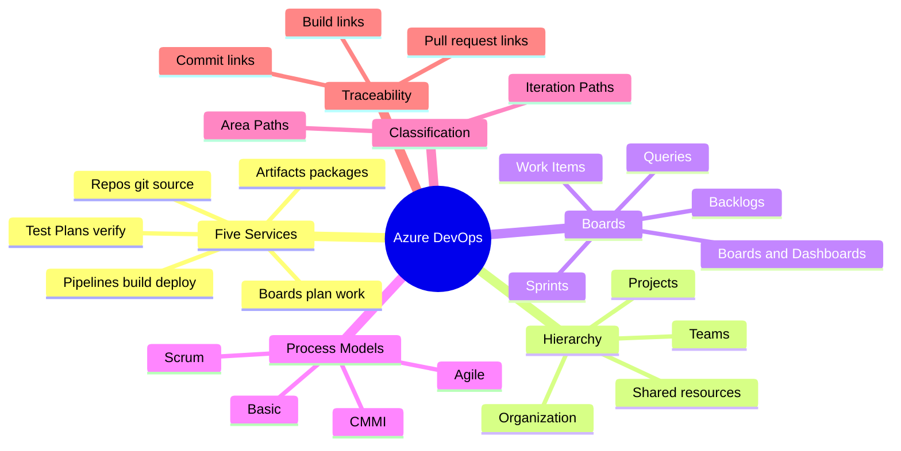
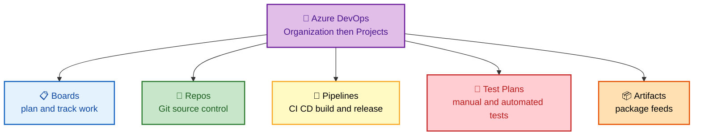
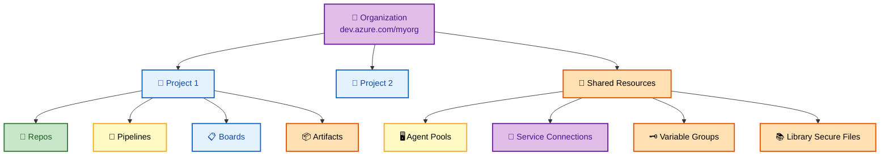
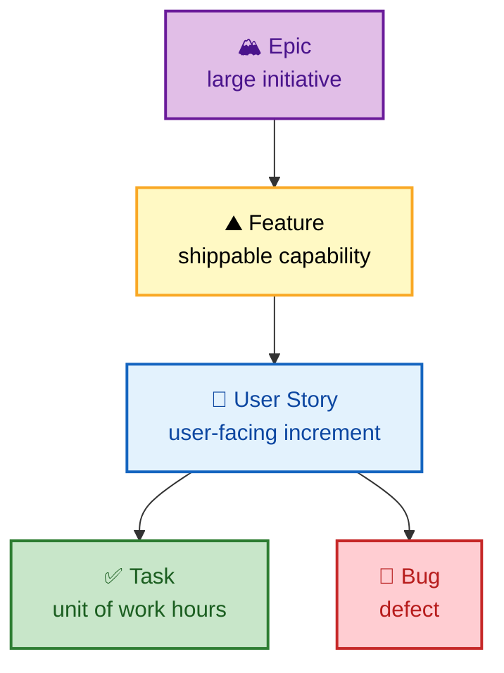

# SECTION 1: Azure DevOps Overview & Boards

> **Scope:** Section 1 of 6 | Beginner → Expert progression | FAANG-level depth
> **Coverage:** The five Azure DevOps services, organization/project hierarchy, Azure Boards (work items, backlogs, sprints), process models (Basic/Agile/Scrum/CMMI), area & iteration paths, queries, and the Boards↔Repos↔Pipelines traceability chain.

---

## Subtopic Index
- [The Five Services](#the-five-services)
- [Organization and Project Hierarchy](#organization-and-project-hierarchy)
- [Azure Boards and Work Items](#azure-boards-and-work-items)
- [Process Models](#process-models)
- [Area Paths and Iteration Paths](#area-paths-and-iteration-paths)
- [Queries and WIQL](#queries-and-wiql)
- [Traceability Across Services](#traceability-across-services)
- [Interview Questions and Answers](#interview-questions-and-answers)
- [Troubleshooting](#troubleshooting)
- [Best Practices](#best-practices)
- [Documentation Links](#documentation-links)

---

## 🗺️ Visual Overview

**In one line:** Azure DevOps is one org made of projects, and each project bundles five services — Boards to plan, Repos to store code, Pipelines to build and deploy, Test Plans to verify, and Artifacts to share packages — all wired together by a shared identity and traceability model.

**Mind map — the whole section at a glance** (skim first, revisit last):



**The 5 services — what each one owns** (highest-value orientation diagram):



**Organization hierarchy and shared resources** (governance boundaries):



**The traceability chain — why Boards matters to auditors** (work item to deployed change):

```mermaid
flowchart LR
    WI["📋 Work Item<br/>User Story 1234"] --> BR["🌿 Branch<br/>linked from work item"]
    BR --> CM["💾 Commit<br/>mentions AB#1234"]
    CM --> PR["🔀 Pull Request<br/>auto-links work item"]
    PR --> BLD["🏗️ Build<br/>records linked items"]
    BLD --> REL["🚀 Release<br/>deployed with item"]
    REL --> AUD["📊 Audit trail<br/>who shipped what"]
    class WI start
    class BR good
    class CM proc
    class PR ctrl
    class BLD proc
    class REL good
    class AUD store
    classDef start fill:#e3f2fd,stroke:#1565c0,color:#0d47a1,stroke-width:2px;
    classDef proc  fill:#fff9c4,stroke:#f9a825,color:#000,stroke-width:2px;
    classDef good  fill:#c8e6c9,stroke:#2e7d32,color:#1b5e20,stroke-width:2px;
    classDef bad   fill:#ffcdd2,stroke:#c62828,color:#b71c1c,stroke-width:2px;
    classDef ctrl  fill:#e1bee7,stroke:#6a1b9a,color:#4a148c,stroke-width:2px;
    classDef store fill:#ffe0b2,stroke:#e65100,color:#000,stroke-width:2px;
```



> 🧠 **Memory hooks (mnemonics):**
> - **The 5 services:** *"Boards Really Power Awesome Teams"* → **B**oards, **R**epos, **P**ipelines, **A**rtifacts, **T**est Plans. (Short form: **B-R-P-A-T**.)
> - **Hierarchy:** *"Only ProjectsTicket Work"* → **O**rganization → **P**roject → **T**eam → **W**ork items.
> - **Process models by ceremony weight:** *"Basically Agile Scrum CMMI"* — **Basic** (lightest) → **Agile** → **Scrum** → **CMMI** (heaviest/most formal).
> - **Classification pair:** **Area = *where*** (which team/component), **Iteration = *when*** (which sprint). "Area is a place, Iteration is a time."

---

## The Five Services

> 🎯 **Interview weight: HIGH.** The opening "what is Azure DevOps" question filters candidates instantly — name all five services *and* say what each owns.

**In one line:** Azure DevOps is a suite of five independently-licensable services glued together by a single identity, project boundary, and cross-linking model.

| Service | Owns | Interview one-liner |
|---|---|---|
| **Boards** | Work items, backlogs, sprints, dashboards | Agile planning and traceability |
| **Repos** | Git (and legacy TFVC) repositories, branch policies, PRs | Source control with governance |
| **Pipelines** | CI/CD builds and releases (YAML + Classic) | Automated build, test, deploy |
| **Test Plans** | Manual, exploratory, and automated test management | Verification and quality gates |
| **Artifacts** | NuGet/npm/Maven/Python/Universal feeds | Package publishing and caching |

💡 **Why they are separate:** each service has its own object model and permissions, so an org can adopt only Repos + Pipelines (very common) while using Jira for planning. You license each service independently — a user consuming only Pipelines does not need a Boards license.

⚠️ **Common wrong answer:** calling "Azure DevOps" a single CI/CD tool. It is a *platform*; Pipelines is only one of the five services. Interviewers note whether you conflate the platform with one service.

---

## Organization and Project Hierarchy

> 🎯 **Interview weight: HIGH.** Governance questions ("how would you structure 200 engineers across 20 teams?") live here.

**In one line:** The hierarchy is **Organization → Project → Team**, with shared plumbing (agent pools, service connections, variable groups, secure files) sitting at the org/project boundary so security owners control it independently of app teams.

```
Organization (dev.azure.com/myorg)
├── Project A
│   ├── Repos / Pipelines / Boards / Artifacts
│   └── Teams (each with its own backlog, board, area path)
├── Project B
└── Shared / org-level
    ├── Agent Pools
    ├── Service Connections
    ├── Variable Groups & Secure Files (Library)
    └── Org-level security groups & policies
```

**One project or many projects?** This is the classic design trade-off:

| Model | Pros | Cons | When |
|---|---|---|---|
| **One big project, many teams** | Easy cross-team linking, shared boards/queries, single backlog hierarchy | Coarse permission boundaries, noisy | Most orgs — Microsoft's own recommendation |
| **Project per team/product** | Hard isolation, independent process templates | Cross-project links are clumsy, duplicated shared resources | Strong compliance/isolation needs, distinct billing |

🧠 **Deep point — why "fewer projects" is the guidance:** boundaries between projects are *hard* (you cannot easily move work items or share a backlog across projects), whereas boundaries between **teams** inside one project are *soft and flexible* (area paths, team-scoped backlogs). Teams give you 90% of the isolation with none of the cross-linking pain.

---

## Azure Boards and Work Items

> 🎯 **Interview weight: MEDIUM.** Deeper for scrum-master-leaning platform roles; lighter for pure infra roles. Know the work-item hierarchy cold.

**In one line:** Work items are typed, hierarchical records (Epic → Feature → Story/PBI → Task/Bug) that carry state, assignment, and links, and they are the anchor for all traceability in Azure DevOps.

**Work item hierarchy (Agile process):**



**Core building blocks:**

- **Backlog:** ordered list of work at a level (e.g., the Stories backlog). Backlog *order* drives priority; drag to reprioritize.
- **Sprint / Iteration:** a time-box; assigning a work item an iteration path puts it in that sprint. Sprint board + taskboard + burndown come free.
- **Board (Kanban):** columns map to states; swimlanes and WIP limits are configurable. The board is a *view* over work items, not a separate store.
- **Dashboard:** widget canvas (query tiles, charts, build/release status) for at-a-glance reporting.

💡 **State vs column:** a Kanban **column** is a board-local concept that maps to one or more underlying work-item **states**. You can have "Active" state split into "Dev" and "Code Review" columns without changing the process model — the state stays `Active`.

---

## Process Models

> 🎯 **Interview weight: MEDIUM.** Expect "what's the difference between Agile and Scrum process templates?" Know the *work item types and states*, not just the names.

**In one line:** The process model defines the work item *types, states, and fields*; Azure DevOps ships four (Basic, Agile, Scrum, CMMI) and you can create an inherited custom process.

| Process | Core WITs | State model flavor | Best for |
|---|---|---|---|
| **Basic** | Epic → Issue → Task | To Do / Doing / Done | New/simple teams, minimal ceremony |
| **Agile** | Epic → Feature → User Story → Task/Bug | New / Active / Resolved / Closed | Teams using Agile terminology |
| **Scrum** | Epic → Feature → PBI → Task/Bug | New / Approved / Committed / Done | Strict Scrum, "PBI" language |
| **CMMI** | Epic → Feature → Requirement → Task/Bug + Change/Risk/Review | Proposed / Active / Resolved / Closed | Formal, audit-heavy orgs |

⚠️ **Gotcha:** you **cannot change the base process of an existing project** in place. You can create an **inherited process** (customize fields/states/rules on top of a system process) and switch a project to a *custom inherited* process, but switching Agile→Scrum wholesale requires migration. Pick deliberately at project creation.

🔍 **Inherited process internals:** custom processes inherit from a system process; changes (new fields, custom states, rules) propagate to all projects using that inherited process. This is how large orgs enforce a standard field set (e.g., a mandatory "Cost Center") across every team.

---

## Area Paths and Iteration Paths

> 🎯 **Interview weight: MEDIUM.** The "how do multiple teams share one project" answer hinges on area paths.

**In one line:** **Area paths** classify work by *component/team* (the *where*); **iteration paths** classify by *sprint/time* (the *when*) — together they let many teams coexist in one project without stepping on each other.

- **Area path** → hierarchical (e.g., `Project\Payments\Checkout`). A **team** is configured to own one or more area paths; its backlog auto-filters to those areas.
- **Iteration path** → hierarchical time-boxes (e.g., `Project\2026\Sprint 12`). Teams subscribe to iterations to populate their sprint view.

💡 **Team ↔ area path is the multiplexer:** create `Team Alpha` owning area `Project\Alpha`, `Team Bravo` owning `Project\Bravo`. Each team sees only its work, has its own board and capacity, yet everything lives in one project so Epics can span teams and roll up.

---

## Queries and WIQL

> 🎯 **Interview weight: LOW–MEDIUM.** Nice to mention; rarely a deep-dive.

**In one line:** Work items are queryable with WIQL (Work Item Query Language), a SQL-like syntax that powers saved queries, dashboard tiles, and automation.

```sql
SELECT [System.Id], [System.Title], [System.State]
FROM WorkItems
WHERE [System.TeamProject] = @project
  AND [System.WorkItemType] = 'Bug'
  AND [System.State] <> 'Closed'
  AND [System.AssignedTo] = @me
ORDER BY [System.ChangedDate] DESC
```

- **Flat queries** return a list; **tree queries** return parent/child; **direct-links** return relationship graphs.
- Queries feed **chart widgets** and **@mention automations**, and are the backbone of **Delivery Plans** (cross-team timeline views).

---

## Traceability Across Services

> 🎯 **Interview weight: HIGH.** "How do you prove which work item shipped in which deployment?" is a favorite governance question.

**In one line:** Azure DevOps auto-links work items to branches, commits, PRs, builds, and releases, giving an end-to-end audit trail from planning to production.

**How the links form:**

1. From a work item, **create a branch** — the branch is linked to the item.
2. In a commit message, write `AB#1234` (or `#1234`) — the commit links to work item 1234.
3. Open a **PR** — linked work items attach automatically and appear in the PR.
4. The **build** records all work items associated with the commits it built.
5. The **release/deployment** carries those items forward, so "Deployment 45 shipped stories 1234, 1240, 1255."

🧠 **Why this matters in interviews:** for regulated environments (SOX, ISO, FedRAMP) you must answer "who approved this change and what requirement did it satisfy?" Azure DevOps answers it natively via this link graph plus environment approvals (see [Section 4](./04-ARTIFACTS-RELEASE.md)) — no external ticketing glue required.

---

## Interview Questions and Answers

### Q1. Name the five Azure DevOps services and what each owns.

**Answer.** **Boards** (work items, backlogs, sprints, dashboards — planning & traceability), **Repos** (Git/TFVC repos, branch policies, PRs — source control), **Pipelines** (YAML/Classic CI/CD — build & release), **Test Plans** (manual/exploratory/automated test management), **Artifacts** (NuGet/npm/Maven/Python/Universal package feeds).

**Internals.** Each is a distinct service with its own object model and permission set, sharing one identity (Entra ID/AAD-backed) and the project boundary. They are licensed independently, which is why an org can adopt only Repos + Pipelines and pay nothing for Boards.

**Follow-up — "Which would you drop if the team already uses GitHub and Jira?"** Boards (Jira replaces it) and Repos (GitHub replaces it); you might still use Azure **Pipelines** and **Artifacts**, or move entirely to GitHub Actions + GitHub Packages.

---

### Q2. Organization, project, team — how do you decide the boundaries?

**Answer.** Prefer **one project with many teams** over many projects. Project boundaries are *hard* (no easy cross-project work-item moves or shared backlogs); team boundaries inside a project are *soft* (area paths, team-scoped backlogs, independent capacity) and give near-total isolation with easy cross-team roll-up.

**Internals.** A **team** is fundamentally a security group plus a default area path plus iteration subscriptions plus a set of board/backlog settings. Creating a team is cheap; creating a project duplicates shared resources (agent pools, service connections) and fragments reporting.

**Follow-up — "When *would* you use separate projects?"** Hard compliance isolation, distinct process templates that cannot coexist, separate billing/ownership, or acquisitions you want kept fully partitioned.

---

### Q3. Difference between the Agile and Scrum process templates?

**Answer.** They differ in **work item type names and state models**. Agile uses **User Story** with states New/Active/Resolved/Closed and a separate Bug. Scrum uses **Product Backlog Item (PBI)** with states New/Approved/Committed/Done. Scrum's language and states map directly to Scrum ceremonies; Agile is more generic.

**Internals.** The process defines WITs, states, transitions, and fields. You cannot swap a project's base process in place — you create an **inherited** process to customize, or migrate for a full swap. Both support the same boards, sprints, and backlogs UI.

**Follow-up — "Where does CMMI fit?"** CMMI adds formal types (Requirement, Change Request, Risk, Review) for audit-heavy, process-mature organizations; it is the heaviest template.

---

### Q4. How do area paths let multiple teams work in one project?

**Answer.** Each **team** is configured to own one or more **area paths**. A team's backlog and board auto-filter to its areas, so Team Alpha (area `\Alpha`) and Team Bravo (area `\Bravo`) each see only their work while sharing one project — enabling cross-team Epics and unified reporting.

**Internals.** Area path is the *where* (component/ownership), iteration path is the *when* (sprint). The team-to-area mapping is the multiplexer; default area path auto-assigns new items created from that team's board.

**Follow-up — "Can one work item belong to two teams?"** It has exactly one area path, so it belongs to one owning team, but other teams can still see and link it via queries and Epics that span areas.

---

### Q5. How would you prove, for an auditor, exactly what shipped in a given production deployment?

**Answer.** Use the built-in traceability chain: the **release/deployment record** lists the work items associated with the commits it deployed, each work item links back through its **PR → commits → branch**, and the **environment approval** on the deploy records who approved it and when. Together that answers "what requirement, which code, who approved, when deployed."

**Internals.** Links are materialized as the pipeline runs: builds capture work items from commit messages (`AB#1234`) and PR associations; deployments carry them forward. Approvals/checks are recorded on the Environment object, independent of the pipeline YAML, so the app team cannot forge them.

**Follow-up — "What if commits didn't reference work items?"** The chain breaks; enforce it with a **branch policy** requiring linked work items on PRs (see [Section 2](./02-REPOS.md)) so every merge is traceable.

---

## Troubleshooting

| Symptom | Likely cause | Fix |
|---|---|---|
| Work item not showing on a team's board | Item's area path not owned by that team, or state maps to no column | Set area path to a team-owned area; check board column-to-state mapping |
| "Cannot change process" error | Trying to swap base process of existing project | Create an inherited process and customize, or migrate work items to a new project |
| Burndown looks wrong | Tasks missing Remaining Work, or wrong iteration path | Ensure tasks have Remaining Work hours and correct sprint iteration |
| PR not linking to work item | Commit/PR never referenced `AB#id` and no manual link | Add `AB#1234` in commit or link in the PR; enforce via branch policy |
| Query returns nothing for `@me` | Assigned-to uses a different identity than the running user | Verify identity; use display name or UPN explicitly |

---

## Best Practices

- **Fewer projects, more teams.** Model teams with area paths; reserve separate projects for hard isolation only.
- **Standardize with an inherited process** to enforce mandatory fields (cost center, compliance tags) org-wide.
- **Enforce traceability** with a branch policy requiring linked work items, so every merge maps to a requirement.
- **Keep boards honest:** map columns to real states, set WIP limits, and use the Definition of Done on each column.
- **Use Delivery Plans** for cross-team timeline visibility instead of exporting to spreadsheets.

---

## Documentation Links

- [Azure DevOps documentation](https://learn.microsoft.com/en-us/azure/devops/)
- [About processes and process templates](https://learn.microsoft.com/en-us/azure/devops/boards/work-items/guidance/choose-process)
- [About area and iteration paths](https://learn.microsoft.com/en-us/azure/devops/organizations/settings/about-areas-iterations)
- [Work item query language (WIQL)](https://learn.microsoft.com/en-us/azure/devops/boards/queries/wiql-syntax)
- [Link work items to objects](https://learn.microsoft.com/en-us/azure/devops/boards/backlogs/add-link)

---

**[← Back to Index](./README.md)** | **[Next: Azure Repos →](./02-REPOS.md)**
