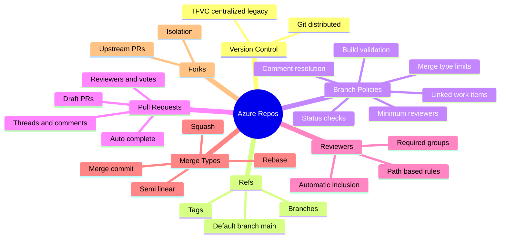
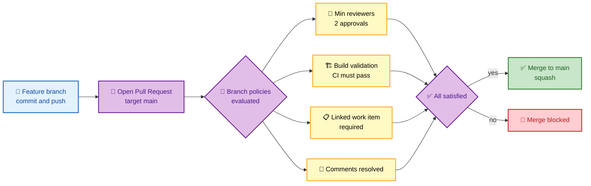
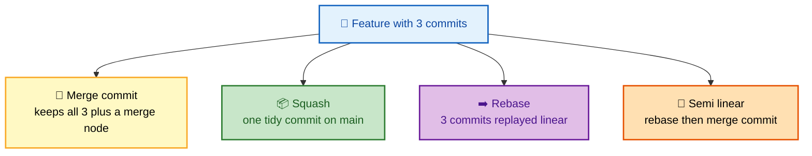

# SECTION 2: Azure Repos

> **Scope:** Section 2 of 6 | Beginner → Expert progression | FAANG-level depth
> **Coverage:** Azure Repos (Git and TFVC), the branch-policy engine, pull-request workflow internals, build validation, required reviewers and CODEOWNERS-style auto-reviewers, merge strategies, forks, and repo-level security.

---

## Subtopic Index
- [Git vs TFVC](#git-vs-tfvc)
- [Repository Structure and Refs](#repository-structure-and-refs)
- [Branch Policies](#branch-policies)
- [Pull Request Workflow](#pull-request-workflow)
- [Build Validation and Status Checks](#build-validation-and-status-checks)
- [Required Reviewers and Auto-Reviewers](#required-reviewers-and-auto-reviewers)
- [Merge Strategies](#merge-strategies)
- [Forks and Cross-Repo Collaboration](#forks-and-cross-repo-collaboration)
- [Interview Questions and Answers](#interview-questions-and-answers)
- [Troubleshooting](#troubleshooting)
- [Best Practices](#best-practices)
- [Documentation Links](#documentation-links)

---

## 🗺️ Visual Overview

**In one line:** Azure Repos is managed Git with a rich **branch-policy engine** bolted on — the policies (required reviewers, build validation, linked work items, comment resolution, merge-type limits) are what turn a plain Git remote into a governed, auditable source-control system.

**Mind map — the whole section at a glance** (skim first, revisit last):

**The protected-main PR flow — memorize this gate chain** (highest-value diagram):

**Merge strategies compared — what history you end up with:**

> 🧠 **Memory hooks (mnemonics):**
> - **Branch-policy checklist:** *"Really Bad Wolves Chew Metal"* → **R**eviewers, **B**uild validation, **W**ork items linked, **C**omment resolution, **M**erge-type limit.
> - **Merge strategy history shape:** **Squash = one clean brick**, **Rebase = straight line**, **Merge commit = diamond**, **Semi-linear = line with a small bump**.
> - **Git vs TFVC:** **G**it = **G**oes everywhere (distributed, offline); **TFVC** = **T**ethered (centralized, server-bound).
> - **Auto-complete:** "set it and forget it" — the PR merges itself the instant the last policy turns green.

---

## Git vs TFVC

> 🎯 **Interview weight: LOW.** One clean sentence is enough; TFVC is legacy. Do not over-invest.

**In one line:** Azure Repos supports **Git** (distributed, the default, what everyone uses) and **TFVC** (Team Foundation Version Control — centralized, server-based, legacy).

| Dimension | Git | TFVC |
|---|---|---|
| Model | Distributed (full history local) | Centralized (server is source of truth) |
| Offline work | Full commit/branch offline | Limited (server checkout) |
| Branching | Cheap, ubiquitous | Heavier, path-based |
| Status in 2026 | Default, recommended | Legacy, maintenance only |

💡 **Interview move:** if asked about TFVC, acknowledge it exists for legacy migration but state you would standardize on Git. Don't recite TFVC mechanics unless the role is explicitly maintaining a TFVC estate.

---

## Repository Structure and Refs

**In one line:** An Azure Repo is a standard Git repository; the platform adds a **default branch** setting, **branch security**, and **policies** on top of ordinary refs.

- **Default branch** (`main`) is what PRs target by default and what new clones check out.
- **Branch security** (distinct from policies) controls *who can push, create, delete, or bypass policies* on a ref.
- **Tags** are supported with their own permissions (who can create/delete tags) — important for release tagging.

🔍 **Policy vs security — a frequent confusion:** *security* answers "are you allowed to push to this branch at all?"; *policy* answers "what conditions must a change satisfy before it merges?" You need both: lock direct push via security, funnel changes through PRs governed by policy.

---

## Branch Policies

> 🎯 **Interview weight: HIGH.** This is the heart of Azure Repos. Know every policy type and what it defends against.

**In one line:** Branch policies are server-enforced rules on a protected branch (usually `main`) that a PR must satisfy before it can complete — they are non-bypassable except by explicitly permitted identities.

| Policy | What it enforces | Defends against |
|---|---|---|
| **Minimum reviewers** | N approvals; optionally reset on new push | Unreviewed code, rubber-stamping |
| **Check for linked work items** | PR must link a work item | Untraceable changes |
| **Check for comment resolution** | All PR threads resolved | Ignored review feedback |
| **Limit merge types** | Only allow e.g. squash | Messy/inconsistent history |
| **Build validation** | A pipeline must succeed on the merge | Broken builds reaching main |
| **Status checks** | External/service status must be green | Failing scans, policy gates |
| **Automatically included reviewers** | Add required reviewers by path | Missing domain-owner review |

**Key toggles that trip people up:**

- **"Reset approvals when new changes are pushed"** — forces re-review after edits. Essential for high-assurance repos; annoying for fast-moving ones.
- **"Allow requestors to approve their own changes"** — off by default for a reason; leaving it on defeats review.
- **"Allow completion even if some reviewers vote to Wait or Reject"** — normally off; a Reject should block.

⚠️ **Gotcha:** policies are set **per branch** (or via branch naming patterns like `releases/*`). Protecting `main` does *not* protect `releases/1.0`. Use **branch pattern policies** or **default-branch-of-fork** settings to cover release branches too.

---

## Pull Request Workflow

> 🎯 **Interview weight: HIGH.** Expect deep-dive on votes, auto-complete, and draft PRs.

**In one line:** A PR is a proposed merge with reviewers, threaded comments, votes, linked work items, and a policy evaluation that gates completion.

**Vote states** (this exact vocabulary matters):

| Vote | Meaning | Blocks merge? |
|---|---|---|
| **Approve** | Good to go | No |
| **Approve with suggestions** | Approve, minor nits | No |
| **Wait for author** | Reviewing, not done | Yes (soft) |
| **Reject** | Do not merge | Yes (hard) |
| **No vote** | Reset/neutral | Depends on min-reviewers |

**Draft PRs:** a draft signals "work in progress" — it does **not** run required reviewers or send completion, and (configurably) skips build validation, saving CI minutes until the author "publishes."

**Auto-complete:** the author sets auto-complete; the PR merges automatically the moment *all* policies are satisfied. This is the standard way to avoid babysitting a PR waiting on a slow CI run.

💡 **Iterations & "update" internals:** each push to the PR source branch creates a new **iteration**; reviewers can diff iteration-to-iteration (what changed since I last looked) rather than re-reviewing the whole PR. This is why "reset approvals on push" is a meaningful, separate toggle.

---

## Build Validation and Status Checks

> 🎯 **Interview weight: MEDIUM–HIGH.** The "how do you stop broken code reaching main" answer lives here.

**In one line:** Build validation runs a pipeline against the **merge result** (source merged into target) and must pass before completion, so you test what main *will* become, not just the feature branch in isolation.

- Validation builds run on the **prospective merge commit**, catching conflicts and integration breaks a branch-only build would miss.
- You can require **multiple** validation builds (unit CI, security scan, lint) — each is its own policy.
- **Status checks** let external systems (SonarCloud, a custom gate, GitHub Advanced Security) post a pass/fail that the PR honors.

🔍 **Why "merge result" matters:** two PRs that each pass alone can break main when combined. Building the merge commit (and optionally requiring the branch be up to date) closes this gap — the same reason GitHub's "require branches to be up to date" exists.

---

## Required Reviewers and Auto-Reviewers

**In one line:** The **Automatically included reviewers** policy adds specific people or groups as required reviewers when a PR touches configured **paths** — Azure Repos' equivalent of CODEOWNERS.

- Scope by **folder/path glob** (e.g., `/infra/*` → the platform team must approve).
- Mark them **required** (blocks merge) or **optional** (informational).
- Combine with minimum-reviewers so "2 approvals *including* a security-team member" is enforceable.

💡 **Interview contrast:** GitHub uses a `CODEOWNERS` file in the repo; Azure Repos uses a **policy** configured in project settings. Same intent (path-based mandatory review), different location — mention this if asked to compare platforms.

---

## Merge Strategies

> 🎯 **Interview weight: MEDIUM.** Know the four and the history each produces.

**In one line:** Azure Repos offers merge commit, squash, rebase-fast-forward, and semi-linear merge — pick based on the history shape you want on `main`.

| Strategy | Result on main | Trade-off |
|---|---|---|
| **Merge commit (no-ff)** | Diamond; preserves every feature commit + a merge node | Full history, but noisy graph |
| **Squash** | One combined commit per PR | Clean linear history; loses per-commit granularity |
| **Rebase + fast-forward** | Feature commits replayed linearly, no merge node | Linear, but rewrites commit hashes |
| **Semi-linear (rebase + merge commit)** | Rebased commits + a merge node | Linear-ish with a clear PR boundary |

⚠️ **Gotcha — squash + long-lived branches:** squashing a shared feature branch rewrites so that main has a commit whose hashes don't exist on the branch. If the team keeps working on that branch afterward, they get conflicts/duplicate changes. Squash suits short-lived branches; delete the branch after merge.

🧠 **Enforcement:** the **Limit merge types** policy restricts which strategies are allowed, so you can mandate squash-only for a tidy trunk. This is a policy, not a suggestion.

---

## Forks and Cross-Repo Collaboration

**In one line:** Forks give contributors an isolated copy to push to without write access to the main repo; they open PRs back upstream — the model for OSS-style or least-privilege contribution.

- Forked-repo PRs can be treated more strictly (secrets are withheld from fork-triggered pipeline runs by default — see [Section 5](./05-SECURITY.md)).
- Useful when you want the crowd to contribute but keep write access to the canonical repo tightly held.

⚠️ **Security note:** never expose secrets to pipelines triggered by PRs *from forks* — a malicious fork could exfiltrate them. Azure Pipelines withholds protected resources from fork PRs unless you explicitly opt in.

---

## Interview Questions and Answers

### Q1. What are branch policies and why do they matter more than branch security?

**Answer.** Branch **security** controls *who can push/create/delete* a ref; branch **policies** control *what conditions a change must satisfy to merge* (reviewers, build validation, linked work items, comment resolution, merge-type limits). Together they lock direct pushes and funnel every change through a governed PR. Policies are what make `main` trustworthy.

**Internals.** Policies are server-side and evaluated on the PR against the **merge result**; they are non-bypassable except by identities granted "bypass policies when completing PRs." Each policy is independent and reports its own status on the PR.

**Follow-up — "How do you protect release branches too?"** Use branch-pattern policies (e.g., `releases/*`) — protecting `main` alone doesn't cover them.

---

### Q2. Why does build validation build the merge commit instead of the feature branch?

**Answer.** Because you want to test what `main` *will become*, not the branch in isolation. Two PRs that each pass alone can break `main` when combined; building the prospective merge commit catches integration breaks and conflicts before completion.

**Internals.** Azure Repos creates a temporary merge of source into target and runs the validation pipeline against it. Optionally requiring the source to be up to date with target further tightens this, at the cost of more frequent rebases.

**Follow-up — "What if the branch is stale?"** Require it be up to date (or re-queue validation on target changes) so the merge result reflects current `main`.

---

### Q3. Compare squash, rebase, and merge-commit strategies.

**Answer.** **Merge commit** keeps every feature commit plus a merge node (full history, noisy graph). **Squash** collapses the PR into one clean commit (tidy trunk, loses per-commit detail). **Rebase + fast-forward** replays commits linearly with no merge node (linear history, rewritten hashes). Choose squash for a clean trunk on short-lived branches, merge-commit when you must preserve granular history.

**Internals.** Squash rewrites history, so shared long-lived branches get conflicts if reused after merge — always delete the branch post-squash. The **Limit merge types** policy enforces the chosen strategy repo-wide.

**Follow-up — "Which do you default to?"** Squash with mandatory branch deletion for app repos; merge-commit for repos needing forensic per-commit history.

---

### Q4. How do you enforce that the security team reviews every infrastructure change?

**Answer.** Use the **Automatically included reviewers** policy scoped to the infra path (e.g., `/infra/*` or `/terraform/*`), marking the security/platform group as a **required** reviewer. Combine with minimum-reviewers so a merge needs, say, two approvals including one from that group.

**Internals.** It is Azure Repos' CODEOWNERS equivalent — path-glob → required group — but configured as a branch policy in project settings rather than a file in the repo.

**Follow-up — "GitHub does this differently, right?"** Yes — GitHub uses a `CODEOWNERS` file committed to the repo; Azure Repos uses a policy. Same outcome, different location.

---

### Q5. A PR is approved but won't complete. What do you check?

**Answer.** Walk the policy list: (1) are **all required policies green** — build validation passed, work item linked, comments resolved, min reviewers met? (2) Does anyone have a **Reject/Wait** vote still active? (3) Is the branch **out of date** if "up to date" is required? (4) Does the completer lack **bypass/complete permission**? (5) Is the target branch itself **locked**? Each policy shows its own red/green status on the PR — read them top to bottom.

**Internals.** Completion requires *every* policy satisfied simultaneously; a single unresolved thread or an active Reject blocks it even with enough approvals.

**Follow-up — "It's urgent, how do you force it?"** An identity with "bypass policies when completing" can override, but that's audited — prefer fixing the failing policy.

---

## Troubleshooting

| Symptom | Likely cause | Fix |
|---|---|---|
| Can't push to `main` | Branch security blocks direct push (by design) | Open a PR; direct push is intentionally disabled |
| PR won't complete despite approvals | Unresolved comments, failed build validation, active Reject, or stale branch | Resolve threads, re-run/fix CI, clear Reject, update branch |
| Build validation never starts | No pipeline set as validation build, or path filters exclude changes | Add the pipeline to the branch policy; check trigger path filters |
| Release branch not protected | Policy set only on `main` | Add a branch-pattern policy for `releases/*` |
| Fork PR fails needing secrets | Secrets withheld from fork PRs (security) | Don't require secrets in PR validation, or use a gated non-secret path |
| Squash caused conflicts later | Reused a long-lived branch after squash-merge | Delete branch after merge; re-branch from updated main |

---

## Best Practices

- **Lock `main`:** disable direct push via security, require PRs, and set policies (min 2 reviewers, build validation, linked work items, comment resolution).
- **Protect release branches** with branch-pattern policies, not just `main`.
- **Squash + delete branch** for a clean, linear trunk on short-lived feature branches.
- **Path-based required reviewers** for sensitive areas (infra, security, payments).
- **Use draft PRs** to avoid burning CI and pestering reviewers on work-in-progress.
- **Enable auto-complete** so PRs merge the instant policies pass, not when someone remembers.
- **Never expose secrets to fork-triggered PR validation.**

---

## Documentation Links

- [Azure Repos documentation](https://learn.microsoft.com/en-us/azure/devops/repos/)
- [Branch policies and settings](https://learn.microsoft.com/en-us/azure/devops/repos/git/branch-policies)
- [About pull requests](https://learn.microsoft.com/en-us/azure/devops/repos/git/pull-requests)
- [Automatically include reviewers](https://learn.microsoft.com/en-us/azure/devops/repos/git/branch-policies#automatically-include-code-reviewers)
- [Merge strategies](https://learn.microsoft.com/en-us/azure/devops/repos/git/merging-with-squash)

---

**[← Previous: Overview & Boards](./01-OVERVIEW-BOARDS.md)** | **[Next: Azure Pipelines →](./03-PIPELINES.md)**
