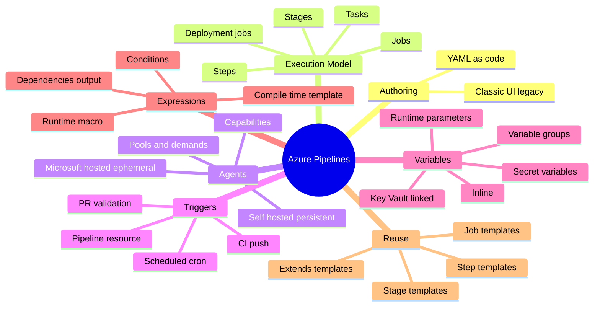
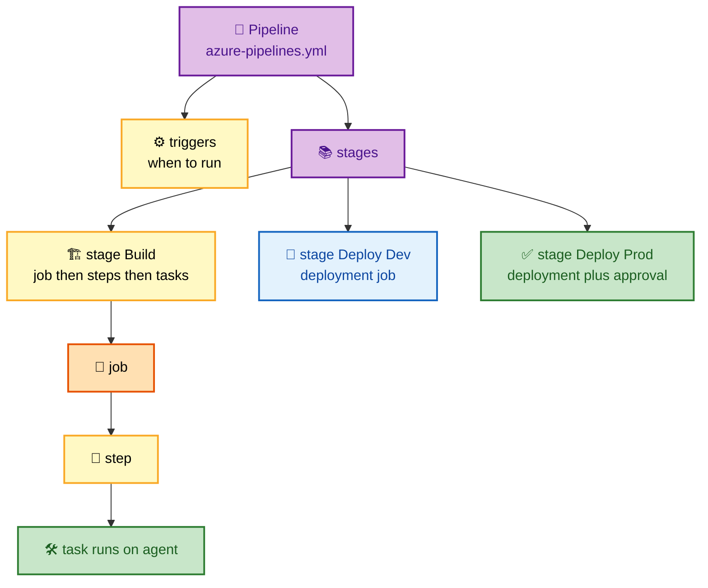
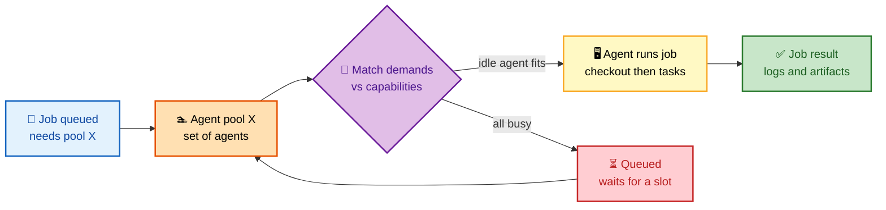
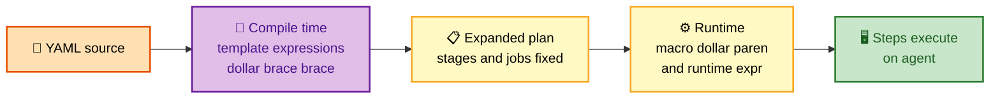
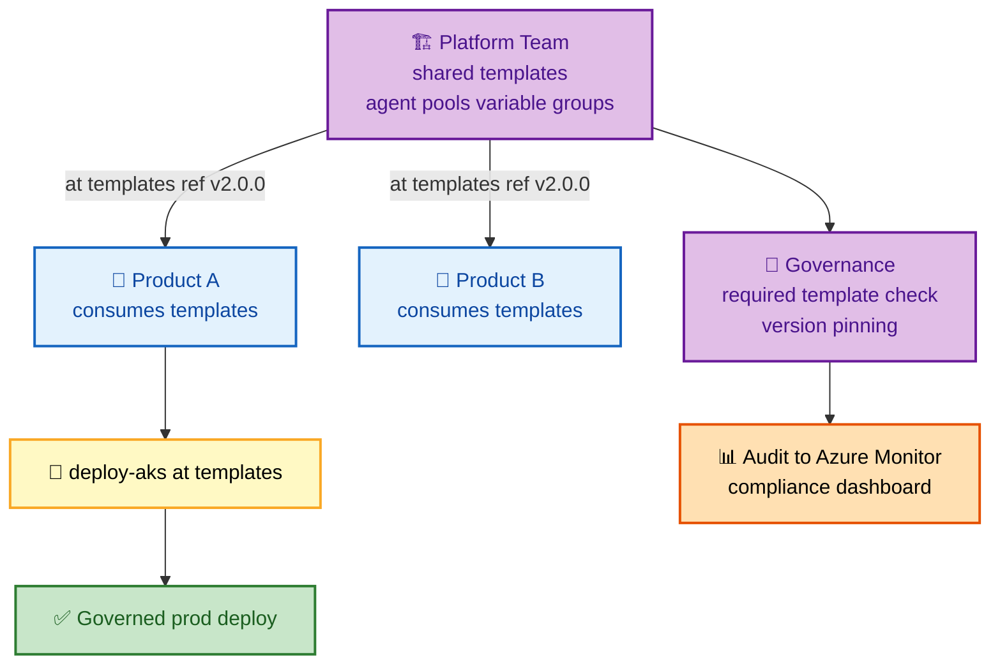

# SECTION 3: Azure Pipelines

> **Scope:** Section 3 of 6 | Beginner → Expert progression | FAANG-level depth
> **Coverage:** Classic vs YAML, the Pipeline→Stage→Job→Step→Task execution model, agents and pools (Microsoft-hosted vs self-hosted), triggers, variables and variable groups, expressions and conditions, templates and reuse, and the multi-team/enterprise templating pattern.

---

## Subtopic Index
- [Classic vs YAML Pipelines](#classic-vs-yaml-pipelines)
- [The Execution Model](#the-execution-model)
- [Agents and Pools](#agents-and-pools)
- [Triggers](#triggers)
- [Variables and Variable Groups](#variables-and-variable-groups)
- [Expressions and Conditions](#expressions-and-conditions)
- [Templates and Reuse](#templates-and-reuse)
- [Enterprise Templating Pattern](#enterprise-templating-pattern)
- [Interview Questions and Answers](#interview-questions-and-answers)
- [Troubleshooting](#troubleshooting)
- [Best Practices](#best-practices)
- [Documentation Links](#documentation-links)

---

## 🗺️ Visual Overview

**In one line:** An Azure Pipeline is YAML that describes **stages → jobs → steps → tasks**; each job is dispatched to an **agent** from a **pool**, and the whole run is driven by triggers, gated by conditions, and parameterized by variables and templates.

**Mind map — the whole section at a glance** (skim first, revisit last):



**The execution hierarchy — memorize this nesting** (highest-value diagram):



**Job dispatch — how a job reaches an agent in a pool** (the scheduling core):



**Compile-time vs runtime — when each expression is resolved** (the mental model that fixes 80% of YAML bugs):



> 🧠 **Memory hooks (mnemonics):**
> - **Hierarchy:** *"Stages Just Sequence Tasks"* → **Stages** contain **Jobs** contain **Steps** which run **Tasks**.
> - **Agent match:** **demands** (what the job needs) must be satisfied by **capabilities** (what the agent has). "Demand meets Capability."
> - **Three expression syntaxes:** `${{ }}` = **template/compile-time** (baked before run), `$( )` = **macro/runtime** (agent substitutes), `$[ ]` = **runtime expression** (evaluated at run start). *"Curly compiles, paren at play, square at start."*
> - **YAML wins over Classic:** **V**ersioned, **R**eviewable, **T**emplated, **P**ortable — "Very Real Team Power."

---

## Classic vs YAML Pipelines

> 🎯 **Interview weight: MEDIUM.** One or two sentences of substance; don't linger — YAML is the answer.

**In one line:** Classic pipelines are UI-defined and stored in Azure DevOps; YAML pipelines are code, versioned *with* the source, reviewed via PR, and templatable — which is why YAML is the standard.

| | Classic | YAML |
|---|---|---|
| Definition | Visual designer | Code (`azure-pipelines.yml`) |
| Versioned with code | ❌ | ✅ |
| PR review of changes | ❌ | ✅ |
| Templates / reuse | Limited | ✅ First-class |
| Multi-stage | Release UI only | ✅ Native |
| Best for | Quick prototypes, non-technical owners | Everything real |

💡 **Interview tip:** the killer argument for YAML is **auditability** — every pipeline change goes through the same PR + branch-policy review as code, so you can answer "who changed the deploy step and when." Classic can't.

---

## The Execution Model

> 🎯 **Interview weight: HIGH.** The nesting and what each level controls is core knowledge.

**In one line:** `Pipeline → Stages → Jobs → Steps → Tasks` — **stages** are boundaries for approvals/dependencies, **jobs** are the unit of agent allocation and parallelism, **steps/tasks** are the actual work.

| Level | Unit of… | Key facts |
|---|---|---|
| **Stage** | Major phase (Build, Deploy Dev, Deploy Prod) | Gets approvals/checks via environments; `dependsOn` controls order; runs sequentially by default |
| **Job** | Agent allocation | Each job runs on **one agent**; jobs in a stage run in **parallel** by default; unit of matrix/parallelism |
| **Step** | Ordered action in a job | Runs sequentially on the job's agent; shares the workspace |
| **Task** | Packaged step | A reusable, versioned action (e.g., `Docker@2`, `AzureCLI@2`) |
| **Deployment job** | Deploy to an environment | Special job type; targets an `environment`, supports strategies (runOnce/rolling/canary) and records deployment history |

🔍 **Why jobs are the parallelism unit:** each job gets a fresh agent and workspace, so state does **not** carry between jobs automatically — you must publish/download artifacts or use output variables to pass data. Steps *within* a job share the filesystem; jobs do not.

⚠️ **Gotcha:** `dependsOn` defaults make jobs in a stage parallel but stages sequential. If job B needs job A's output, set `dependsOn: A` and pass data via output variables — otherwise B may start before A finishes.

```yaml
stages:
  - stage: Build
    jobs:
      - job: Build
        pool: { vmImage: 'ubuntu-latest' }
        steps:
          - task: Docker@2
            inputs: { command: build, repository: myapp, tags: '$(Build.BuildId)' }
          - publish: $(Build.SourcesDirectory)/k8s
            artifact: manifests
```

---

## Agents and Pools

> 🎯 **Interview weight: HIGH.** Microsoft-hosted vs self-hosted trade-offs come up constantly.

**In one line:** A **job runs on an agent**; agents live in **pools**; you choose **Microsoft-hosted** (ephemeral, clean, Microsoft-managed) or **self-hosted** (persistent, you-managed, for private networks/special tooling).

| | Microsoft-hosted | Self-hosted |
|---|---|---|
| Lifecycle | Fresh VM per job, destroyed after | Persistent, you patch/scale |
| Clean state | ✅ Guaranteed clean | ❌ State can leak between runs |
| Speed | Cold each time (no cache) | Warm caches, faster incremental |
| Network access | Public internet | ✅ Can reach private VNets/on-prem |
| Custom tooling | Preinstalled image only | ✅ Anything you install |
| Cost | Parallelism slots | Your VM cost + management |

**Demands vs capabilities:** each agent advertises **capabilities** (OS, installed tools, env vars); a job declares **demands**; the scheduler routes the job to a pool agent whose capabilities satisfy the demands.

🧠 **Deep point — self-hosted security & hygiene:** because self-hosted agents persist, one job can leave artifacts, caches, or secrets that a later job (or a malicious PR) reads. Mitigate with clean workspaces, non-root users, dedicated VNets, and — ideally — **ephemeral self-hosted agents** (scale-set agents that are torn down after each job), getting cloud isolation with private-network reach. (More in [Section 5](./05-SECURITY.md).)

💡 **When to pick self-hosted:** deployments into a private network, licensed/large toolchains you don't want to install every run, or heavy caches (big monorepos). Otherwise default to Microsoft-hosted for clean, zero-maintenance runs.

---

## Triggers

> 🎯 **Interview weight: MEDIUM.** Know CI vs PR vs scheduled vs pipeline-resource triggers and path/branch filters.

**In one line:** Triggers decide *when* a pipeline runs — on push (CI), on PR (validation), on a schedule (cron), or when another pipeline completes (pipeline resource).

```yaml
trigger:                    # CI trigger on push
  branches:
    include: [ main, releases/* ]
  paths:
    exclude: [ docs/*, README.md ]

pr:                         # PR validation trigger
  branches:
    include: [ main ]

schedules:                  # cron trigger
  - cron: "0 3 * * *"
    displayName: Nightly
    branches: { include: [ main ] }
    always: true
```

- **Path filters** avoid wasteful runs (don't rebuild on a docs-only change).
- **`pr` trigger** in YAML is **ignored for Azure Repos** — PR validation there is driven by **branch policy build validation** (see [Section 2](./02-REPOS.md)); the `pr:` block applies to GitHub repos. This catches people constantly.
- **Pipeline resource trigger** chains pipelines (e.g., run deploy after build pipeline completes).

⚠️ **Gotcha:** for Azure Repos, remove the assumption that `pr:` gates merges — it does not. Configure **build validation** as a branch policy instead.

---

## Variables and Variable Groups

> 🎯 **Interview weight: HIGH.** Secrets handling and variable-group/Key Vault linkage are heavily probed.

**In one line:** Variables come from inline YAML, **variable groups** (shared, optionally **Key Vault-linked**), and **runtime parameters**; secret variables are masked and never printed.

```yaml
variables:
  - group: global-variables          # shared variable group
  - group: prod-secrets              # linked to Azure Key Vault
  - name: dockerRegistry
    value: 'myregistry.azurecr.io'

parameters:                          # runtime, chosen at queue time
  - name: deployEnv
    type: string
    default: dev
    values: [ dev, staging, prod ]
```

| Source | Scope | Secret-capable | Notes |
|---|---|---|---|
| Inline `variables` | Pipeline/stage/job | Via `isSecret` | Simple, version-controlled |
| **Variable group** | Shared across pipelines (Library) | ✅ | Central place to manage shared config |
| **Key Vault-linked group** | Pulls secrets at runtime | ✅ | Secrets stay in Key Vault, fetched per run |
| **Runtime parameters** | Chosen at queue time | ❌ | Typed, drive template logic at compile time |

🔍 **Secret handling internals:** secret variables are **not** decrypted into the environment automatically for script tasks — you must map them explicitly (`env: { MYSECRET: $(mySecret) }`) which is a deliberate guardrail against accidental logging. Azure Pipelines also masks known secret values in logs, but masking is best-effort, not a substitute for not printing them.

⚠️ **Gotcha:** secret variables are **not available in `${{ }}` compile-time expressions** — they only exist at runtime. Trying to branch template logic on a secret fails silently.

---

## Expressions and Conditions

> 🎯 **Interview weight: HIGH (senior).** The compile-time vs runtime distinction is a classic "separate the seniors" question.

**In one line:** There are three expression syntaxes — `${{ }}` template (compile-time), `$( )` macro (runtime substitution), `$[ ]` runtime expression — and knowing *when each resolves* is the key to debugging pipelines.

| Syntax | Name | Resolved | Use for |
|---|---|---|---|
| `${{ expr }}` | Template expression | **Compile time** (before run) | Template logic, conditional stage/job inclusion, parameter-driven shapes |
| `$( var )` | Macro | **Runtime**, by the agent | Injecting variable values into task inputs/scripts |
| `$[ expr ]` | Runtime expression | **Run start** | `condition:`, values that depend on earlier runtime state |

```yaml
- ${{ if eq(parameters.deployEnv, 'prod') }}:      # compile-time branch
  - script: echo "prod path baked in"

jobs:
  - job: A
    steps:
      - bash: echo "##vso[task.setvariable variable=flag;isOutput=true]yes"
        name: setFlag
  - job: B
    dependsOn: A
    condition: eq(dependencies.A.outputs['setFlag.flag'], 'yes')   # runtime
    steps: [ { script: echo "ran because A said yes" } ]
```

🧠 **Deep point — why the distinction bites:** `${{ }}` is evaluated **once, before any agent runs**, so it cannot see runtime values (a step's output, a secret, a variable set mid-run). `$[ ]` and `$( )` see runtime state. A huge class of "my condition never triggers" bugs is using `${{ }}` where you needed `$[ ]`.

**Passing data between jobs:** use **output variables** (`isOutput=true`) and reference via `dependencies.<job>.outputs[...]`. State does not otherwise cross the job/agent boundary.

---

## Templates and Reuse

> 🎯 **Interview weight: HIGH.** Templating is the enterprise story; know the four template types and `extends`.

**In one line:** Templates let you factor pipelines into reusable **step/job/stage** fragments (included with `- template:`) or enforce a whole-pipeline shape with **`extends`** templates that product teams cannot bypass.

| Template type | Reuses | Typical owner |
|---|---|---|
| **Step template** | A sequence of steps | Any team |
| **Job template** | A whole job | Platform/team |
| **Stage template** | A whole stage | Platform |
| **`extends` template** | The entire pipeline skeleton | Platform (governance) |

- **Parameters** make templates flexible and are typed (validated at compile time).
- **`extends`** is the governance lever: the org defines the outer pipeline (mandatory security scan, approved tasks) and product teams fill designated parameter slots — they **cannot** remove the required steps.

💡 **Versioning templates:** reference the template repo by a **pinned tag** (`ref: refs/tags/v2.0.0`), not a moving branch, so a template change can't silently alter every downstream pipeline. Bump the tag deliberately.

---

## Enterprise Templating Pattern

> 🎯 **Interview weight: HIGH (staff/platform).** "Design CI/CD for 20 teams" answers converge here.

**In one line:** A central **platform team publishes versioned pipeline templates**; product teams **reference them by pinned tag** and fill parameters — giving reuse + governance without blocking teams.

```yaml
# Product team's azure-pipelines.yml
resources:
  repositories:
    - repository: templates
      type: git
      name: Platform/pipeline-templates
      ref: refs/tags/v2.0.0        # pin the version

stages:
  - template: stages/build.yml@templates
    parameters: { buildConfiguration: Release, runTests: true }
  - template: stages/deploy-aks.yml@templates
    parameters: { environment: production, aksCluster: prod-aks }
```



🧠 **Enforce it with a Required Template check** on the production **environment**: a deploy to prod is rejected unless it extends the approved template. This makes governance non-optional without a human gatekeeper reading every pipeline. (Environments/checks are covered in [Section 4](./04-ARTIFACTS-RELEASE.md).)

---

## Interview Questions and Answers

### Q1. Walk through the pipeline execution hierarchy and what each level is the unit of.

**Answer.** `Pipeline → Stages → Jobs → Steps → Tasks`. **Stages** are major phases and the boundary for approvals/dependencies (run sequentially by default). **Jobs** are the unit of agent allocation and parallelism — each runs on one agent, and jobs in a stage run in parallel. **Steps** run sequentially within a job, sharing its workspace. **Tasks** are packaged, versioned reusable actions.

**Internals.** Because each job gets a fresh agent/workspace, state doesn't cross jobs — you pass data via published artifacts or output variables. Deployment jobs are a special job type that targets an environment and records deployment history.

**Follow-up — "How do you pass a value from job A to job B?"** Set an output variable (`isOutput=true`) in A, `dependsOn: A` in B, reference `dependencies.A.outputs[...]`.

---

### Q2. Microsoft-hosted vs self-hosted agents — when do you choose each?

**Answer.** **Microsoft-hosted**: fresh VM per job, guaranteed clean, zero maintenance, but no persistent cache and only public network access. **Self-hosted**: persistent (warm caches, faster), can reach private VNets/on-prem, run custom/licensed tooling — but you patch/scale them and state can leak between runs. Default to Microsoft-hosted; go self-hosted for private-network deploys, heavy caches, or special tooling.

**Internals.** Jobs match to agents via **demands vs capabilities**. Self-hosted persistence is a security liability — one run can leave secrets/artifacts for the next — so prefer **ephemeral scale-set agents** to get isolation plus private reach.

**Follow-up — "How do you make self-hosted safe?"** Ephemeral agents, clean workspaces, non-root, dedicated VNet, scoped pool permissions.

---

### Q3. Explain the three expression syntaxes and why the distinction matters.

**Answer.** `${{ }}` is a **template/compile-time** expression evaluated before any agent runs — used for template logic and conditionally including stages/jobs. `$( )` is a **macro** substituted at runtime by the agent — used to inject variable values. `$[ ]` is a **runtime expression** evaluated at run start — used in `condition:` and for values depending on runtime state. It matters because `${{ }}` cannot see runtime values (step outputs, secrets), so using it where you need `$[ ]` produces conditions that never fire.

**Internals.** Compile-time expansion happens once and produces a fixed plan of stages/jobs; runtime evaluation happens as the run proceeds. Secrets exist only at runtime, so they're invisible to `${{ }}`.

**Follow-up — "Where would `${{ }}` be the *only* correct choice?"** Conditionally including a whole stage/job based on a runtime **parameter** chosen at queue time — that shapes the plan before execution.

---

### Q4. How do you manage secrets in a pipeline?

**Answer.** Use a **Key Vault-linked variable group** so secrets live in Key Vault and are fetched per run, reference them as secret variables, and **map them explicitly** into script `env:` blocks rather than relying on ambient exposure. Never echo them; Azure masks known secret values in logs as a backstop. Prefer **Workload Identity Federation** on the service connection so there's no stored credential at all (see [Section 5](./05-SECURITY.md)).

**Internals.** Secret variables aren't auto-injected into script environments (a guardrail) and aren't available to `${{ }}` compile-time expressions — only at runtime.

**Follow-up — "Why map explicitly instead of auto-expose?"** To prevent a task from accidentally printing or leaking every secret; you opt in per secret per step.

---

### Q5. Design CI/CD for 20 product teams that must all pass a security scan before prod.

**Answer.** A central **platform team publishes versioned pipeline templates** (build, deploy, mandatory security-scan stage) in a template repo. Product teams **`extends`** the approved template and reference it by **pinned tag**, filling only designated parameter slots — they can't remove the required scan. Enforce with a **Required Template check** on the production **environment**, so a non-compliant pipeline is rejected at deploy time. Stream audit logs to Azure Monitor for compliance.

**Internals.** `extends` templates own the outer skeleton; parameters are the only extensibility points. Pinned tags stop a template edit from silently changing 20 pipelines. The environment check is server-side and independent of pipeline authors.

**Follow-up — "How do you roll out a template change safely?"** Publish a new tag (`v2.1.0`), pilot with one team, then bump others — never mutate an in-use tag.

---

## Troubleshooting

| Symptom | Likely cause | Fix |
|---|---|---|
| PR to Azure Repos doesn't trigger validation | `pr:` YAML trigger is ignored for Azure Repos | Add the pipeline as **build validation** branch policy |
| Job B starts before A's data is ready | Missing `dependsOn`; jobs parallel by default | Add `dependsOn: A` and pass via output variables |
| `${{ }}` condition never fires on runtime value | Compile-time expr can't see runtime state | Use `$[ ]` runtime expression / `condition:` |
| Secret is empty in a script | Secret vars aren't auto-injected | Map explicitly via `env: { X: $(secret) }` |
| Every commit rebuilds even docs | No path filters | Add `paths.exclude` to the trigger |
| Template change broke all pipelines | Referenced a moving branch, not a tag | Pin `ref: refs/tags/vX.Y.Z`; bump deliberately |
| Self-hosted job picks up stale files | Persistent workspace not cleaned | Enable clean workspace; prefer ephemeral agents |

---

## Best Practices

- **YAML over Classic** — versioned, reviewable, templatable.
- **Pin template refs to tags**, never branches.
- **Default to Microsoft-hosted agents**; use ephemeral self-hosted only when you need private reach or heavy caches.
- **Add path filters** to skip pointless runs.
- **Key Vault-linked variable groups** for secrets; map secrets explicitly into steps.
- **Know your expression syntax** — `${{ }}` compile-time, `$( )`/`$[ ]` runtime — before writing conditions.
- **Govern with `extends` + Required Template checks** for multi-team estates.

---

## Documentation Links

- [Azure Pipelines documentation](https://learn.microsoft.com/en-us/azure/devops/pipelines/)
- [YAML schema reference](https://learn.microsoft.com/en-us/azure/devops/pipelines/yaml-schema)
- [Jobs and agents](https://learn.microsoft.com/en-us/azure/devops/pipelines/process/phases)
- [Expressions](https://learn.microsoft.com/en-us/azure/devops/pipelines/process/expressions)
- [Templates](https://learn.microsoft.com/en-us/azure/devops/pipelines/process/templates)
- [Define variables](https://learn.microsoft.com/en-us/azure/devops/pipelines/process/variables)

---

**[← Previous: Azure Repos](./02-REPOS.md)** | **[Next: Artifacts & Release →](./04-ARTIFACTS-RELEASE.md)**
