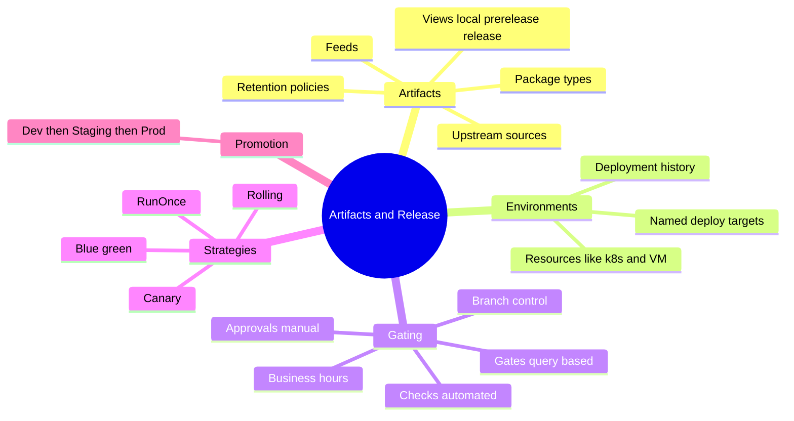
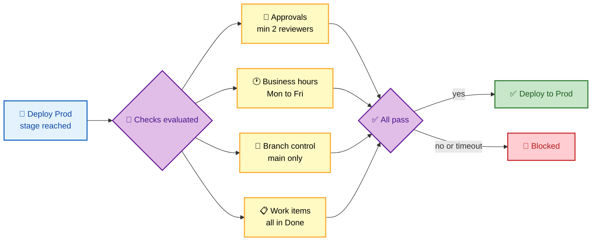
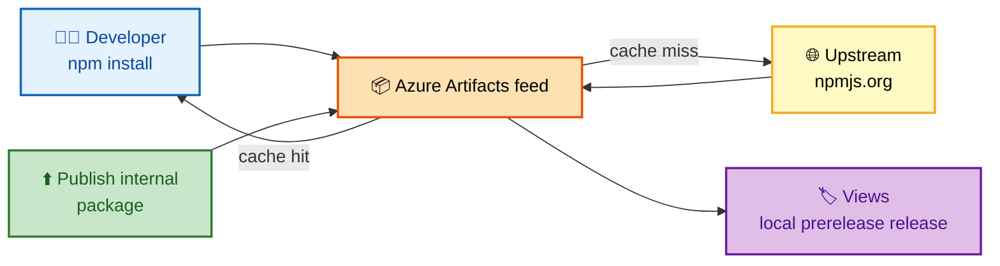

# SECTION 4: Azure Artifacts & Release

> **Scope:** Section 4 of 6 | Beginner → Expert progression | FAANG-level depth
> **Coverage:** Azure Artifacts (feeds, upstream sources, views, retention), the release side of Pipelines — environments, deployment jobs, approvals and checks, gates, and deployment strategies (runOnce, rolling, canary, blue-green).

---

## Subtopic Index
- [Azure Artifacts and Feeds](#azure-artifacts-and-feeds)
- [Upstream Sources and Caching](#upstream-sources-and-caching)
- [Feed Views and Retention](#feed-views-and-retention)
- [Environments and Deployment Jobs](#environments-and-deployment-jobs)
- [Approvals and Checks](#approvals-and-checks)
- [Gates](#gates)
- [Deployment Strategies](#deployment-strategies)
- [Multi-Stage Release Example](#multi-stage-release-example)
- [Interview Questions and Answers](#interview-questions-and-answers)
- [Troubleshooting](#troubleshooting)
- [Best Practices](#best-practices)
- [Documentation Links](#documentation-links)

---

## 🗺️ Visual Overview

**In one line:** Artifacts is the package side (feeds that publish and *cache* NuGet/npm/Maven/Python/Universal packages via upstream sources); Release is the promotion side (environments gated by approvals, checks, and gates, deploying via strategies like canary and blue-green).

**Mind map — the whole section at a glance** (skim first, revisit last):



**The promotion chain with gated environments** (highest-value diagram):

```mermaid
flowchart LR
    SRC["📥 main commit"] --> BUILD["🏗️ Build plus test<br/>push image"]
    BUILD --> ART["📦 Artifact<br/>manifests to feed"]
    ART --> DEV["🚀 Deploy Dev<br/>auto"]
    DEV --> G1{"🚦 Approval gate"}
    G1 -->|"approved"| STG["🚀 Deploy Staging<br/>smoke tests"]
    STG --> G2{"🚦 Prod approval<br/>2 reviewers"}
    G2 -->|"approved"| PROD["✅ Deploy Prod<br/>canary 10 then 50 then 100"]
    G2 -->|"rejected"| STOP["🛑 Blocked"]
    class SRC start
    class BUILD proc
    class ART store
    class DEV ctrl
    class STG ctrl
    class PROD good
    class STOP bad
    class G1 ctrl
    class G2 ctrl
    classDef start fill:#e3f2fd,stroke:#1565c0,color:#0d47a1,stroke-width:2px;
    classDef proc  fill:#fff9c4,stroke:#f9a825,color:#000,stroke-width:2px;
    classDef good  fill:#c8e6c9,stroke:#2e7d32,color:#1b5e20,stroke-width:2px;
    classDef bad   fill:#ffcdd2,stroke:#c62828,color:#b71c1c,stroke-width:2px;
    classDef ctrl  fill:#e1bee7,stroke:#6a1b9a,color:#4a148c,stroke-width:2px;
    classDef store fill:#ffe0b2,stroke:#e65100,color:#000,stroke-width:2px;
```



**Approval and check evaluation before a prod deploy** (what the environment enforces):



**Feed with upstream source — cache-and-promote model:**



> 🧠 **Memory hooks (mnemonics):**
> - **Package types:** *"Never Name Messy Python Usernames"* → **N**uGet, **N**pm, **M**aven, **P**ython, **U**niversal.
> - **Gating trio:** **Approvals** = a *human* says yes; **Checks** = a *machine* says yes; **Gates** = a *query* says yes. "Human, Machine, Query."
> - **Strategies by blast radius:** **RunOnce** (all at once, biggest blast) → **Rolling** (batch by batch) → **Canary** (tiny slice first) → **Blue-green** (flip traffic, instant rollback).
> - **Approvals live on the Environment, not the YAML** — "the gate belongs to the door, not the visitor."

---

## Azure Artifacts and Feeds

> 🎯 **Interview weight: MEDIUM.** Know feeds, the package types, and *why* upstream sources matter.

**In one line:** A **feed** is a container for packages (NuGet, npm, Maven, Python, Universal) that your builds publish to and restore from, scoped to a project or the whole organization.

- **Feed scope:** project-scoped (isolated to one project) or org-scoped (shared). Choose based on who should consume the packages.
- **Publish + consume:** CI publishes internal libraries to the feed; other pipelines/devs restore them like any public package, using feed-specific registry URLs and auth tokens.
- **Universal Packages:** arbitrary files/blobs (not a language package format) versioned in a feed — handy for large build outputs, ML models, or tooling bundles.

💡 **Why a private feed at all:** to share internal libraries across teams *and* to gain a single, governed, cached front door to public registries (next section).

---

## Upstream Sources and Caching

> 🎯 **Interview weight: MEDIUM–HIGH.** The "how do you protect builds from a public-registry outage or a left-pad incident" answer.

**In one line:** An **upstream source** makes your feed a caching proxy for a public registry (npmjs, NuGet.org, Maven Central, PyPI) — the first request fetches and **saves** the package, so later builds are fast, reproducible, and immune to the upstream being down or a version being yanked.

**What this buys you:**

- **Resilience:** a deleted/yanked public package you already cached keeps working.
- **Reproducibility:** once cached, the exact bytes are pinned in your feed.
- **Single source + auditability:** all dependencies flow through one governed feed you can scan and control.
- **Performance:** cache hits are served from Azure, close to your agents.

⚠️ **Gotcha — dependency confusion / substitution attacks:** if your feed proxies a public registry *and* hosts internal packages, a package resolver can be tricked into pulling a malicious *public* package that shadows an internal name. Mitigate by controlling resolution order (internal feed first), reserving/scoping names, and locking down who can save upstream packages.

---

## Feed Views and Retention

**In one line:** **Views** (`@local`, `@prerelease`, `@release`) let you promote a package through quality gates within a feed, and **retention policies** automatically delete old versions to control storage.

- **`@local`** — everything published/saved. **`@prerelease`** / **`@release`** — curated promotion stages consumers can pin to, so downstream only sees vetted versions.
- **Retention** keeps the latest N versions and/or packages downloaded recently; packages referenced by a pinned **release** are protected from cleanup.

💡 **Promotion model:** publish to `@local`, run tests, then **promote** the exact version to `@release`. Consumers point at `@release` and never accidentally pull an untested build.

---

## Environments and Deployment Jobs

> 🎯 **Interview weight: HIGH.** Environments are where approvals/checks live — a favorite governance topic.

**In one line:** An **environment** is a named deployment target (dev, staging, production) that a **deployment job** targets; it records deployment history and — crucially — **owns the approvals and checks** that gate deploys to it.

```yaml
- stage: Deploy_Production
  jobs:
    - deployment: DeployProd
      environment: 'production'      # approvals/checks configured ON this environment
      strategy:
        runOnce:
          deploy:
            steps:
              - download: current
                artifact: manifests
              - task: KubernetesManifest@0
                inputs: { action: deploy, namespace: myapp, manifests: '$(Pipeline.Workspace)/manifests/*.yaml' }
```

- A **deployment job** (vs a regular job) targets an environment, supports deployment **strategies**, and shows up in the environment's history ("who deployed what, when").
- Environments can track **resources** (Kubernetes namespaces, VMs) for richer status and targeting.

🔍 **Key separation of duties:** the **YAML only references** `environment: 'production'`. The approvals, business-hours windows, branch control, and required-template checks are configured **on the environment** in project settings — so a **security owner** controls the gate independently of whoever writes the pipeline. The app team literally cannot remove the prod approval from code.

---

## Approvals and Checks

> 🎯 **Interview weight: HIGH.** Know the difference: approvals are human, checks are automated.

**In one line:** **Approvals** pause a deploy until a designated human (or group) clicks approve; **checks** are automated conditions (business hours, branch control, required template, linked-work-items, invoke function/REST) that must pass — both are configured on the environment.

| Mechanism | Who satisfies it | Examples |
|---|---|---|
| **Approval** | A person/group | "Release manager + one SRE approve prod" |
| **Check** | Automation | Business hours only, deploy only from `main`, required template used, all work items Done, invoke Azure Function/REST returns OK |

**Approval options that matter:** minimum number of approvers, forbid self-approval, timeout (e.g., 72h then auto-reject), and instructions shown to approvers.

⚠️ **Gotcha:** approvals and checks are **not** in the YAML — putting "approval" logic in the pipeline is a common wrong answer. They live on the **Environment** precisely so pipeline authors can't bypass them.

---

## Gates

> 🎯 **Interview weight: MEDIUM.** Often conflated with checks; clarify the intent.

**In one line:** **Gates** are automated, *often query-based* pre/post-deployment conditions that poll external signals (no open Sev-1 incidents, monitoring healthy, no active change-freeze) and only let the deploy proceed when they're satisfied.

- **Pre-deployment gate:** e.g., "no active high-severity alerts in Azure Monitor" before deploying.
- **Post-deployment gate:** e.g., "error rate stayed below threshold for 10 minutes" before promoting further.
- Gates **re-evaluate on an interval** and can time out — they're for conditions that change over time, unlike a one-shot approval.

💡 **Interview framing:** approvals/checks = "is it allowed?"; gates = "is the system healthy enough *right now*?" Post-deployment gates are how you automate "bake time" before promoting a canary.

---

## Deployment Strategies

> 🎯 **Interview weight: HIGH.** Know all four and their rollback behavior.

**In one line:** Deployment jobs support **runOnce** (all at once), **rolling** (batches), **canary** (a small slice first, then widen), and **blue-green** (deploy alongside, flip traffic) — chosen by how much blast radius and how fast a rollback you need.

| Strategy | How | Rollback | Best for |
|---|---|---|---|
| **runOnce** | Deploy everything once | Redeploy previous | Simple apps, low risk |
| **Rolling** | Update in batches | Stop + roll back remaining batches | Stateless fleets |
| **Canary** | Tiny % first, observe, then widen (10→50→100) | Abort before full rollout | Risk-averse prod, validates on real traffic |
| **Blue-green** | Deploy to idle env, switch traffic | Flip back instantly | Fast, clean rollback; needs double capacity |

```yaml
strategy:
  canary:
    increments: [10, 50]          # 10%, then 50%, then 100%
    deploy:
      steps:
        - task: KubernetesManifest@0
          inputs: { action: deploy, strategy: canary, percentage: $(strategy.increment) }
    postRouteTraffic:
      steps:
        - script: curl -f https://myapp.prod/health   # bake-time smoke test
    on:
      failure:
        steps:
          - task: KubernetesManifest@0
            inputs: { action: reject }                # auto-rollback
```

🧠 **Deep point — canary's `postRouteTraffic` + `on.failure` is the safety loop:** deploy a slice, route some traffic, run smoke tests during **bake time**, and if they fail, the `on: failure` hook **rejects** (rolls back) automatically before the blast radius grows. Pair it with a **post-deployment gate** watching error rates for full automation.

---

## Multi-Stage Release Example

**In one line:** The canonical pattern is Build → Deploy Dev (auto) → Deploy Staging (smoke tests) → Deploy Prod (approval + canary), each stage `dependsOn` the previous and each deploy targeting a gated environment.

```yaml
stages:
  - stage: Build
    jobs:
      - job: Build
        pool: { vmImage: ubuntu-latest }
        steps:
          - task: Docker@2
            inputs: { command: buildAndPush, repository: myapp, tags: '$(Build.BuildId)' }
          - publish: $(Build.SourcesDirectory)/k8s
            artifact: manifests

  - stage: Deploy_Dev
    dependsOn: Build
    jobs:
      - deployment: DeployDev
        environment: 'dev'
        strategy: { runOnce: { deploy: { steps: [ { download: current, artifact: manifests }, { task: KubernetesManifest@0, inputs: { action: deploy, namespace: myapp } } ] } } }

  - stage: Deploy_Staging
    dependsOn: Deploy_Dev
    jobs:
      - deployment: DeployStaging
        environment: 'staging'          # smoke-test check configured here
        strategy: { runOnce: { deploy: { steps: [ { download: current, artifact: manifests } ] } } }

  - stage: Deploy_Production
    dependsOn: Deploy_Staging
    jobs:
      - deployment: DeployProd
        environment: 'production'        # approval + canary
        strategy: { canary: { increments: [10, 50] } }
```

---

## Interview Questions and Answers

### Q1. What is an upstream source and what problem does it solve?

**Answer.** An upstream source turns an Azure Artifacts feed into a **caching proxy** for a public registry (npmjs, NuGet.org, Maven Central, PyPI). The first request fetches and **saves** the package into your feed; later builds hit the cache. This gives resilience (a yanked/deleted public package you cached still works), reproducibility (exact bytes pinned), performance (served from Azure), and a single governed, auditable dependency front door.

**Internals.** Saved packages persist in the feed independent of the upstream. A pinned version won't disappear even if removed upstream — this is how you survive a "left-pad" style incident.

**Follow-up — "What's the security risk?"** Dependency confusion: a public package can shadow an internal name. Control resolution order, scope/reserve names, and restrict who can save upstream packages.

---

### Q2. Where are deployment approvals configured, and why there?

**Answer.** On the **Environment** (Pipelines → Environments → *production*), **not** in the YAML. The YAML only references `environment: 'production'`. This separation means a security/release owner controls the gate independently of whoever authors the pipeline — the app team can't remove the prod approval by editing code.

**Internals.** The deployment job targets the environment; the environment object holds approvals and checks and records deployment history. Evaluation is server-side before the stage's steps run.

**Follow-up — "How do you enforce 'two approvers, no self-approval, main branch only'?"** Set minimum approvers = 2, disable self-approval, and add a **branch control** check restricting to `main` — all on the environment.

---

### Q3. Approvals vs checks vs gates — distinguish them.

**Answer.** **Approvals** are satisfied by a *human* clicking approve. **Checks** are *automated* conditions evaluated once (business hours, branch control, required template, work items Done, invoke function). **Gates** are *automated, often query-based* conditions that **re-evaluate over time** (no open Sev-1, monitoring healthy) — used for pre/post-deployment "is the system healthy right now?" and bake-time automation. Approvals/checks answer "is it allowed?"; gates answer "is it healthy?"

**Follow-up — "Give a post-deployment gate example."** Watch error rate/latency in Azure Monitor for 10 minutes after a canary; only promote to 100% if it stays green.

---

### Q4. Compare canary and blue-green deployments.

**Answer.** **Canary** routes a small % of real traffic to the new version, observes during bake time, then widens (10→50→100); rollback means aborting before full rollout. **Blue-green** deploys the new version to an idle environment and **flips all traffic at once**, giving instant rollback by flipping back — but needing double capacity. Canary validates on real traffic incrementally; blue-green optimizes for instant, clean rollback.

**Internals.** In Azure Pipelines, canary uses the deployment strategy's `increments` plus `postRouteTraffic` smoke tests and an `on: failure` auto-reject hook. Blue-green is typically modeled with two environments/slots and a traffic switch step.

**Follow-up — "Which for a stateful DB migration?"** Neither cleanly handles schema state — use expand/contract migrations and feature flags; deployment strategy alone doesn't solve data compatibility.

---

### Q5. How do you automate "don't deploy during an active incident"?

**Answer.** Use a **pre-deployment gate** that queries your monitoring/incident source (Azure Monitor alert query, ServiceNow/PagerDuty via Invoke REST) and blocks the deploy while a high-severity incident or change-freeze is active. The gate re-evaluates on an interval and times out, so the deploy proceeds automatically once the system is healthy — no human babysitting.

**Follow-up — "Why a gate and not a check?"** Because the condition changes over time; gates poll and re-evaluate, whereas a check is a one-shot evaluation.

---

## Troubleshooting

| Symptom | Likely cause | Fix |
|---|---|---|
| Prod deploy runs with no approval | Approval configured on wrong environment or not at all | Configure approval on the `production` environment object |
| Build can't restore internal package | Feed auth/registry URL missing, or wrong feed scope | Add feed auth token; verify project vs org feed scope |
| Public package version vanished, build broke | Not cached before it was yanked upstream | Rely on upstream caching; pre-warm/pin critical versions |
| Canary didn't roll back on failure | No `on: failure` hook / smoke test not failing the job | Add `on.failure` reject; ensure smoke test returns non-zero |
| Deploy happened during a freeze | No pre-deployment gate | Add a gate querying incident/change-freeze status |
| Storage costs growing in feed | No retention policy | Configure retention; protect release-pinned versions |
| Malicious package pulled | Dependency confusion via upstream | Internal-first resolution, name scoping, restrict upstream save |

---

## Best Practices

- **Put approvals/checks on environments**, never fake them in YAML.
- **Enable upstream sources** on feeds for resilient, reproducible, cached dependencies — and guard against dependency confusion.
- **Promote packages through views** (`@local` → `@release`); consumers pin to `@release`.
- **Use canary with bake-time smoke tests and auto-reject** for risk-averse prod; blue-green when you need instant rollback and can afford double capacity.
- **Add pre/post-deployment gates** for incident-aware, health-aware promotion.
- **Set feed retention** to control storage while protecting release-pinned versions.

---

## Documentation Links

- [Azure Artifacts documentation](https://learn.microsoft.com/en-us/azure/devops/artifacts/)
- [Upstream sources](https://learn.microsoft.com/en-us/azure/devops/artifacts/concepts/upstream-sources)
- [Environments](https://learn.microsoft.com/en-us/azure/devops/pipelines/process/environments)
- [Approvals and checks](https://learn.microsoft.com/en-us/azure/devops/pipelines/process/approvals)
- [Release gates](https://learn.microsoft.com/en-us/azure/devops/pipelines/release/deploy-using-approvals)
- [Deployment jobs and strategies](https://learn.microsoft.com/en-us/azure/devops/pipelines/process/deployment-jobs)

---

**[← Previous: Azure Pipelines](./03-PIPELINES.md)** | **[Next: Security →](./05-SECURITY.md)**
