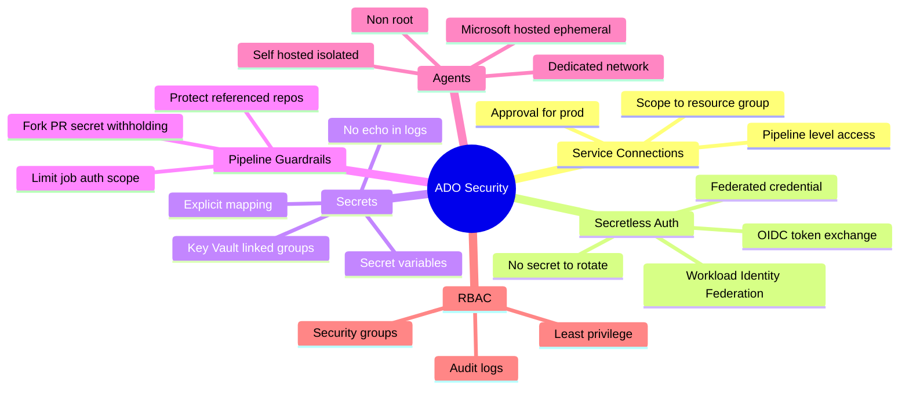
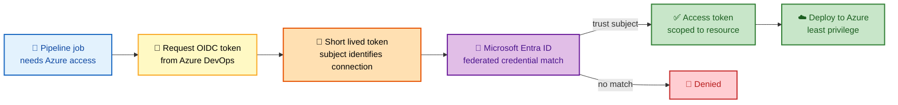
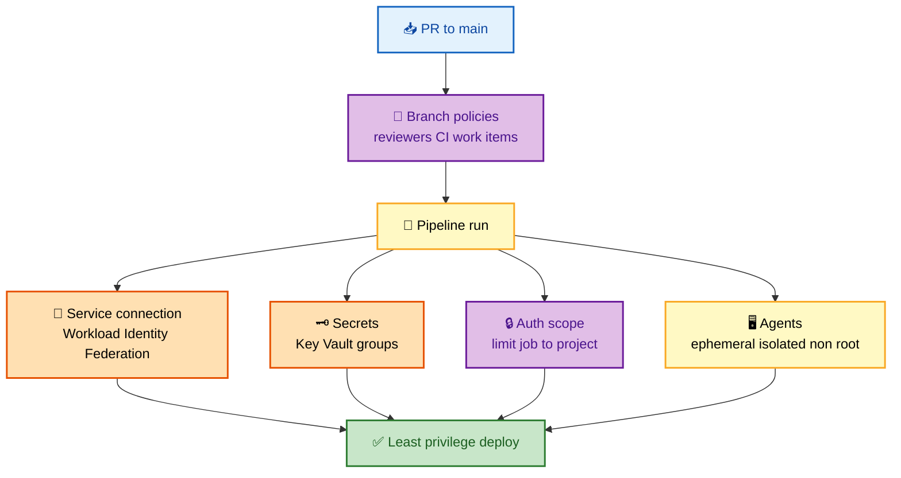

# SECTION 5: Azure DevOps Security

> **Scope:** Section 5 of 6 | Beginner → Expert progression | FAANG-level depth
> **Coverage:** Service connections, Workload Identity Federation (OIDC) vs stored secrets, secrets management with Key Vault, branch policies as a security control, pipeline authorization scope, agent security, and RBAC / security groups.

---

## Subtopic Index
- [Service Connections](#service-connections)
- [Workload Identity Federation and OIDC](#workload-identity-federation-and-oidc)
- [Secrets Management](#secrets-management)
- [Pipeline Authorization Scope](#pipeline-authorization-scope)
- [Agent Security](#agent-security)
- [RBAC and Security Groups](#rbac-and-security-groups)
- [Defense in Depth Summary](#defense-in-depth-summary)
- [Interview Questions and Answers](#interview-questions-and-answers)
- [Troubleshooting](#troubleshooting)
- [Best Practices](#best-practices)
- [Documentation Links](#documentation-links)

---

## 🗺️ Visual Overview

**In one line:** Azure DevOps security is defense in depth — lock the door with **branch policies**, authenticate to Azure **without stored secrets** via Workload Identity Federation, keep real secrets in **Key Vault**, constrain what a pipeline can touch with **authorization scope**, and run jobs on **isolated agents**.

**Mind map — the whole section at a glance** (skim first, revisit last):



**OIDC service connection — secretless auth to Azure** (highest-value diagram):



**Five layers of pipeline security — defense in depth:**



**Secret retrieval from Key Vault at runtime:**

```mermaid
flowchart LR
    RUN["🔧 Job starts"] --> VG["🗝️ Key Vault linked<br/>variable group"]
    VG --> KV["🔐 Azure Key Vault<br/>via service connection"]
    KV --> SECRET["📄 Secret value<br/>masked in logs"]
    SECRET --> MAP["🔀 Explicit env mapping<br/>into the step"]
    MAP --> USE["✅ Used by task"]
    class RUN start
    class VG store
    class KV ctrl
    class SECRET proc
    class MAP proc
    class USE good
    classDef start fill:#e3f2fd,stroke:#1565c0,color:#0d47a1,stroke-width:2px;
    classDef proc  fill:#fff9c4,stroke:#f9a825,color:#000,stroke-width:2px;
    classDef good  fill:#c8e6c9,stroke:#2e7d32,color:#1b5e20,stroke-width:2px;
    classDef bad   fill:#ffcdd2,stroke:#c62828,color:#b71c1c,stroke-width:2px;
    classDef ctrl  fill:#e1bee7,stroke:#6a1b9a,color:#4a148c,stroke-width:2px;
    classDef store fill:#ffe0b2,stroke:#e65100,color:#000,stroke-width:2px;
```



> 🧠 **Memory hooks (mnemonics):**
> - **Secretless wins:** Workload Identity Federation = *"nothing to leak, nothing to rotate."*
> - **Five layers:** *"Big Projects Seldom Share Agents"* → **B**ranch policies, **P**ipeline auth scope, **S**ervice connections (WIF), **S**ecrets (Key Vault), **A**gents.
> - **Fork rule:** *"Forks get no secrets"* — protected resources are withheld from fork-triggered PR runs.
> - **Least privilege verb:** **scope** everything — connection to a resource group, job to a project, pool to a team.

---

## Service Connections

> 🎯 **Interview weight: HIGH.** The bridge from pipeline to Azure; scoping and auth type are the hot questions.

**In one line:** A **service connection** is the credential/identity a pipeline uses to reach an external system (Azure, ACR, Kubernetes, Docker registry); its **auth type** and **scope** define the blast radius if it's abused.

- **Scope narrowly:** an Azure Resource Manager connection should target a **specific resource group**, not the whole subscription.
- **Pipeline-level authorization:** don't grant a connection to *all* pipelines in a project; authorize only the pipelines that need it.
- **Approval on sensitive connections:** require a check before a pipeline can use a production connection, so a random pipeline can't quietly deploy to prod.

⚠️ **Gotcha:** granting "grant access permission to all pipelines" on a subscription-scoped connection is the single most common over-privilege mistake — any pipeline (or a malicious PR that edits YAML) can then hit your whole subscription.

---

## Workload Identity Federation and OIDC

> 🎯 **Interview weight: HIGH (senior).** The modern, secretless answer — lead with this.

**In one line:** **Workload Identity Federation (WIF)** lets a pipeline authenticate to Azure using a **short-lived OIDC token** exchanged for an Azure access token — **no client secret or certificate is stored** on the service connection, so there's nothing to leak and nothing to rotate.

**How the exchange works:**

1. You register an **Entra ID (Azure AD) app/managed identity** and add a **federated credential** whose **subject** identifies the exact service connection (`sc://org/project/connection-name`).
2. At run time, Azure DevOps mints a **short-lived OIDC token** for the job.
3. Entra ID validates the token's issuer and **subject** against the federated credential; if it matches, it returns a scoped **access token**.
4. The pipeline uses that access token — which expires in minutes — to deploy.

**Why it beats stored secrets:**

| | Stored secret/cert | Workload Identity Federation |
|---|---|---|
| Credential at rest | Yes (leak/rotate risk) | **None** |
| Rotation | Manual/scheduled, error-prone | **Not needed** |
| Token lifetime | Long-lived | **Minutes** |
| Blast radius if pipeline compromised | Secret exfiltrated, reusable | Token useless after minutes, bound to subject |

🔍 **Internals — why the subject binding matters:** the federated credential trusts a *specific subject* (that one service connection). A different pipeline or connection produces a different subject that won't match, so you can't reuse one connection's trust from elsewhere. This is the same OIDC pattern GitHub Actions uses to federate into Azure/AWS — mention the parallel to show breadth.

💡 **Interview lead:** "For service connections I default to **Workload Identity Federation** — it removes the biggest credential-leak surface entirely. There's no secret at rest and no rotation burden; the job gets a minutes-long OIDC token scoped to one subject."

---

## Secrets Management

> 🎯 **Interview weight: HIGH.** Key Vault linkage + explicit mapping + no-echo are the expected depth.

**In one line:** Keep real secrets in **Azure Key Vault**, surface them via a **Key Vault-linked variable group** (fetched per run), reference them as **secret variables**, and **map them explicitly** into steps — never echo them.

```yaml
variables:
  - group: prod-secrets            # Key Vault-linked variable group

steps:
  - script: ./deploy.sh
    env:
      DB_PASSWORD: $(dbPassword)    # explicit mapping, not ambient
```

- **Key Vault-linked group:** secrets stay in Key Vault; the pipeline fetches them at runtime via a service connection — so rotation happens in Key Vault, not in pipeline config.
- **Secret variables** are masked in logs (best-effort) and **not auto-injected** into script environments — you opt in per secret, a deliberate guardrail.
- **Not available at compile time:** secrets don't exist in `${{ }}` template expressions, only at runtime.

⚠️ **Gotcha:** log masking is best-effort pattern matching — if you transform a secret (base64, substring) the masker may miss it. The real control is **never printing it**, plus explicit per-step mapping so only the step that needs it sees it.

---

## Pipeline Authorization Scope

> 🎯 **Interview weight: MEDIUM–HIGH.** The guardrails that contain a compromised pipeline.

**In one line:** Constrain what a pipeline run is *allowed* to touch — limit **job authorization scope** to the current project, **protect access to referenced repos**, and withhold **secrets from fork PRs** — so a malicious or buggy pipeline can't reach beyond its lane.

| Setting | Effect |
|---|---|
| **Limit job authorization scope to current project** | The run's identity can't access other projects' resources |
| **Limit to referenced repos** | Pipeline can only check out repos it explicitly declares |
| **Protect access to repositories in YAML** | Requires explicit grant to fetch other repos |
| **Fork PR protections** | Secrets/protected resources withheld from PRs originating in forks |

🧠 **Deep point — the malicious-PR threat:** a contributor opens a PR that edits `azure-pipelines.yml` to `echo $(secret)` or deploy somewhere. If secrets flowed to fork PRs and the job could reach any resource, that's game over. The defenses — withholding secrets from fork runs and limiting auth scope — are exactly why these settings exist. Always enable them.

---

## Agent Security

> 🎯 **Interview weight: MEDIUM.** Self-hosted hygiene is the crux.

**In one line:** Prefer **Microsoft-hosted (ephemeral)** agents for guaranteed clean state; when you must self-host, **isolate** (dedicated VNet), run **non-root**, **patch** regularly, and prefer **ephemeral scale-set agents** that are destroyed after each job.

- **Microsoft-hosted:** fresh VM per job, destroyed after — no state leakage by construction.
- **Self-hosted risk:** persistence means one job can leave secrets/artifacts/caches for the next job (or a malicious PR) to read.
- **Mitigations:** clean workspaces, non-root user, dedicated network segment, scoped pool permissions, and — best — **ephemeral** agents (VM scale set) that tear down per job, combining cloud isolation with private-network reach.

---

## RBAC and Security Groups

**In one line:** Azure DevOps authorization is group-based — assign people to **security groups** (Readers/Contributors/Project Administrators and custom groups) and grant least-privilege at the object (repo, pipeline, environment, feed) level, backed by **audit logs**.

- **Least privilege:** Readers view, Contributors queue/edit within scope, Administrators manage. Don't hand out Administrator broadly.
- **Object-level permissions:** a repo, a pipeline, an environment, and a feed each have their own ACLs — grant precisely.
- **Audit logs** (org-level) stream who changed what; forward to Azure Monitor/SIEM for retention and alerting.

---

## Defense in Depth Summary

| Layer | Control | Defends against |
|---|---|---|
| Source | Branch policies (reviewers, build validation, linked items) | Unreviewed/untraceable code |
| Auth | Workload Identity Federation (OIDC) | Stored-credential leak & rotation risk |
| Secrets | Key Vault-linked groups, explicit mapping | Secret sprawl and log leakage |
| Pipeline | Limit auth scope, protect repos, fork protections | Lateral movement, malicious PRs |
| Compute | Ephemeral/isolated agents | State leakage between runs |
| Governance | Environment approvals/checks, required templates | Ungoverned prod deploys |
| Audit | Security groups + audit logs → SIEM | Undetected privilege abuse |

---

## Interview Questions and Answers

### Q1. How do you secure the connection from a pipeline to Azure?

**Answer.** Use a **service connection with Workload Identity Federation (OIDC)** so there's **no stored secret** — the job gets a short-lived OIDC token exchanged at Entra ID for a scoped access token. **Scope the connection** to a specific resource group (not the whole subscription), authorize it only to the **pipelines that need it**, and require an **approval check** for production connections.

**Internals.** The federated credential trusts a specific **subject** (`sc://org/project/connection`), so the trust can't be reused by another connection/pipeline. Tokens expire in minutes, shrinking the blast radius if a run is compromised.

**Follow-up — "Why is WIF better than a service principal secret?"** Nothing at rest to leak, no rotation burden, and tokens are short-lived and subject-bound.

---

### Q2. Walk through the OIDC token exchange in Workload Identity Federation.

**Answer.** (1) You register an Entra ID app/managed identity with a **federated credential** whose subject names the service connection. (2) At run time Azure DevOps mints a **short-lived OIDC token** for the job. (3) Entra ID validates the token's issuer and subject against the federated credential. (4) On match it returns a scoped, minutes-long **access token** the pipeline uses to deploy. No client secret is ever stored or transmitted.

**Internals.** Same federation pattern GitHub Actions uses into Azure/AWS. The subject binding is the security anchor — a different pipeline yields a different subject that won't match.

**Follow-up — "What if the subject is misconfigured?"** Entra ID returns no token and the deploy fails closed — a safe failure mode.

---

### Q3. How do you handle secrets, and why map them explicitly?

**Answer.** Store secrets in **Azure Key Vault**, expose via a **Key Vault-linked variable group** so they're fetched per run and rotated in Key Vault (not in pipeline config), and **map each secret explicitly** into the step's `env:` that needs it. Secret variables are masked in logs and **not auto-injected** — explicit mapping means only the step that needs a secret can see it, limiting accidental exposure.

**Internals.** Secrets exist only at runtime (invisible to `${{ }}`), and log masking is best-effort pattern matching — transforming a secret can defeat it, so the real control is never printing it.

**Follow-up — "Better than Key Vault?"** For *auth* to Azure, skip secrets entirely with Workload Identity Federation; reserve Key Vault for genuine app secrets (DB passwords, API keys).

---

### Q4. A contributor's fork PR edits the pipeline to print a secret. What stops them?

**Answer.** Two controls: (1) Azure Pipelines **withholds secrets and protected resources from fork-triggered PR runs** by default, so `echo $(secret)` prints nothing. (2) **Limiting job authorization scope** stops the run reaching other projects/resources. Combined with branch policies requiring review before merge, the malicious edit can't exfiltrate anything or move laterally.

**Internals.** This is the core malicious-PR threat model; the fork-secret withholding and auth-scope limits exist specifically for it — keep them enabled.

**Follow-up — "When would you allow fork PRs to use secrets?"** Rarely — only for trusted contributors via an explicit opt-in, ideally behind a manual approval.

---

### Q5. How do you make self-hosted agents safe?

**Answer.** Prefer **ephemeral scale-set agents** destroyed after each job (clean state + private-network reach). If persistent, run **non-root**, enforce **clean workspaces**, place them in a **dedicated VNet/segment**, **patch** regularly, and scope **pool permissions** so only intended pipelines use them. The danger is state leakage — one job leaving secrets/caches for the next.

**Follow-up — "Why not just use Microsoft-hosted?"** You self-host for private-network deploys, licensed/large toolchains, or heavy caches; otherwise Microsoft-hosted is the safer default.

---

## Troubleshooting

| Symptom | Likely cause | Fix |
|---|---|---|
| Deploy fails with auth error on WIF connection | Federated credential subject mismatch | Align the subject to `sc://org/project/connection`; recreate credential |
| Any pipeline can deploy to prod | Connection granted to all pipelines / subscription-scoped | Scope to resource group; authorize specific pipelines; add approval |
| Secret is blank in script | Secret not mapped into the step env | Add explicit `env: { X: $(secret) }` mapping |
| Secret appeared in logs | Transformed value defeated masking | Never print secrets; mask isn't a guarantee |
| Fork PR build fails needing secret | Secrets withheld from fork runs (by design) | Don't require secrets in PR validation; use non-secret path |
| Pipeline reached another project's resources | Job auth scope not limited | Enable "limit job authorization scope to current project" |
| Stale secret still works after rotation | Long-lived stored secret, not Key Vault-fetched | Move to Key Vault-linked group or WIF |

---

## Best Practices

- **Default to Workload Identity Federation** for service connections — no stored secret, no rotation.
- **Scope connections** to a resource group and authorize only the pipelines that need them; require approval for prod.
- **Key Vault-linked variable groups** for real secrets; map each secret explicitly into the step.
- **Enable pipeline guardrails:** limit job authorization scope, protect referenced repos, keep fork-PR secret withholding on.
- **Use ephemeral/isolated agents**; never run self-hosted agents as root on a shared host.
- **Least-privilege security groups** + **audit logs to SIEM**.
- **Treat branch policies as a security control**, not just a quality one.

---

## Documentation Links

- [Service connections](https://learn.microsoft.com/en-us/azure/devops/pipelines/library/service-endpoints)
- [Workload identity federation](https://learn.microsoft.com/en-us/azure/devops/pipelines/release/configure-workload-identity)
- [Manage secrets with Key Vault](https://learn.microsoft.com/en-us/azure/devops/pipelines/release/azure-key-vault)
- [Pipeline security and job authorization scope](https://learn.microsoft.com/en-us/azure/devops/pipelines/security/overview)
- [Secure pipelines against forks](https://learn.microsoft.com/en-us/azure/devops/pipelines/security/repos-protection)

---

**[← Previous: Artifacts & Release](./04-ARTIFACTS-RELEASE.md)** | **[Next: Troubleshooting →](./06-TROUBLESHOOTING.md)**
