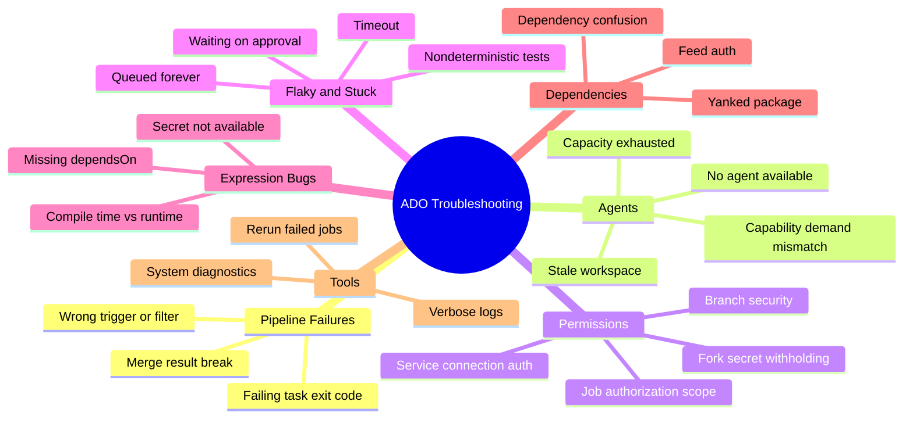
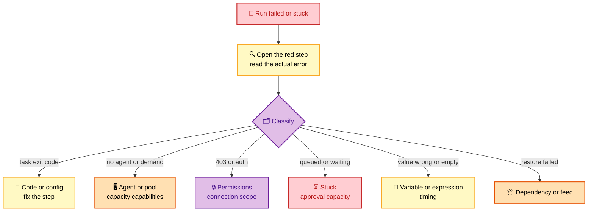
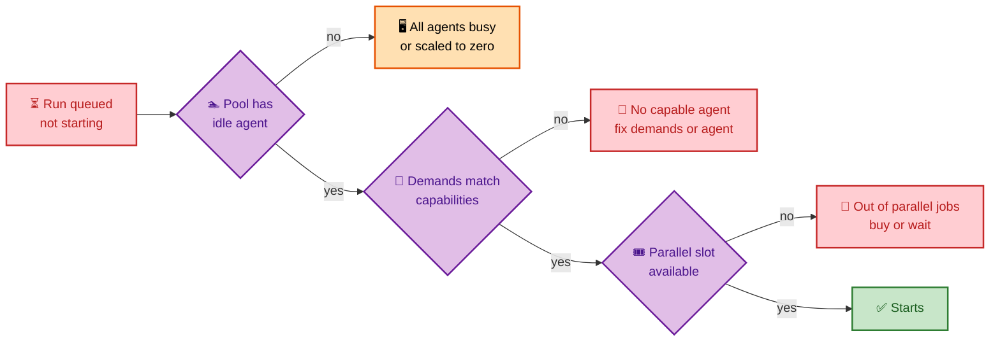

# SECTION 6: Azure DevOps Troubleshooting

> **Scope:** Section 6 of 6 | Beginner → Expert progression | FAANG-level depth
> **Coverage:** A systematic method for diagnosing pipeline failures, agent/pool problems, permission and authorization errors, flaky and stuck runs, variable/expression bugs, and artifact/dependency failures — plus the debugging tools that expose root cause.

---

## Subtopic Index
- [The Diagnostic Method](#the-diagnostic-method)
- [Pipeline Failures](#pipeline-failures)
- [Agent and Pool Problems](#agent-and-pool-problems)
- [Permission and Authorization Errors](#permission-and-authorization-errors)
- [Flaky and Stuck Runs](#flaky-and-stuck-runs)
- [Variable and Expression Bugs](#variable-and-expression-bugs)
- [Artifact and Dependency Failures](#artifact-and-dependency-failures)
- [Debugging Tools](#debugging-tools)
- [Interview Questions and Answers](#interview-questions-and-answers)
- [Best Practices](#best-practices)
- [Documentation Links](#documentation-links)

---

## 🗺️ Visual Overview

**In one line:** Most Azure DevOps failures fall into six buckets — bad code/config, agent capacity, permissions, flakiness, expression timing, and dependencies — and a disciplined "read the failing step, classify the bucket, check the layer that owns it" method resolves them fast.

**Mind map — the whole section at a glance** (skim first, revisit last):

**The triage flow — classify then drill** (highest-value diagram):

**Why a run is stuck in "queued"** (the most common "nothing is happening" ticket):

> 🧠 **Memory hooks (mnemonics):**
> - **Six buckets:** *"Cats Always Play Fetch Excitedly Daily"* → **C**ode/config, **A**gent, **P**ermissions, **F**laky/stuck, **E**xpression, **D**ependency.
> - **First move, always:** *"Open the red step"* — read the real error before theorizing.
> - **Stuck-in-queue triad:** **capacity** (idle agent?), **capability** (demands match?), **concurrency** (parallel slot?). "3 C's of the queue."
> - **Expression bug tell:** value empty or condition never fires → suspect **compile-time vs runtime** timing.

---

## The Diagnostic Method

> 🎯 **Interview weight: HIGH.** Interviewers grade *method* over trivia. Lead with a systematic approach.

**In one line:** Open the **failing (red) step**, read the **actual error**, **classify** it into one of six buckets, then check the **layer that owns** that bucket — never guess before reading the log.

1. **Reproduce scope:** one pipeline or all? One agent/pool or all? One branch or all? This isolates local-vs-systemic instantly.
2. **Read the red step:** the first genuinely failing step (not downstream cascades) carries the root cause.
3. **Classify:** code/config, agent, permissions, flaky/stuck, expression, dependency.
4. **Check the owning layer:** e.g., permissions → service connection scope + job auth scope; stuck → pool capacity + demands.
5. **Confirm with verbose logs** (`system.debug=true`) before changing anything.

💡 **Interview signal:** saying "I'd enable `system.debug`, read the first failing task, and check whether it's local to one agent" immediately reads as senior — it shows method, not flailing.

---

## Pipeline Failures

**In one line:** A red run usually means a **task returned a non-zero exit code**, a **trigger/filter** did something unexpected, or the **merge result** broke even though the branch built fine.

| Symptom | Likely cause | Fix |
|---|---|---|
| Task fails with non-zero exit | Real build/test/tool error | Read the task log; fix code/config/tool version |
| Pipeline didn't run on PR to Azure Repos | `pr:` YAML trigger is ignored for Azure Repos | Add pipeline as **build validation** branch policy |
| Runs on every trivial change | No path filters | Add `paths.exclude` |
| Branch builds green, merge breaks main | Validation built branch, not merge result | Build the merge result; require branch up to date |
| Wrong branch built | Trigger `branches.include` too broad | Tighten branch filters |

⚠️ **Gotcha:** a downstream step often fails *because* an earlier step half-succeeded (e.g., produced no artifact). Always find the **first** failing step; later red steps are symptoms.

---

## Agent and Pool Problems

**In one line:** Agent issues are "**no agent is available**," "**no agent matches the demands**," or "**the agent's state is dirty**" — check pool capacity, capability/demand alignment, and workspace cleanliness.

| Symptom | Likely cause | Fix |
|---|---|---|
| "No agent found matching demands" | Job demands a capability no agent advertises | Fix the demand or install the capability on an agent |
| Job queued forever | Pool has no idle agent / scaled to zero / out of parallel slots | Add agents/parallelism; check scale-set min count |
| Works on one agent, fails on another | Inconsistent self-hosted agent tooling | Standardize agent images; prefer Microsoft-hosted |
| Picks up stale files/secrets | Persistent self-hosted workspace not cleaned | Enable clean workspace; use ephemeral agents |
| Sudden slowdowns | Self-hosted disk/cache full, noisy neighbor | Monitor agent host; scale out |

🔍 **Capability vs demand internals:** the scheduler only dispatches a job to an agent whose **capabilities** (auto-detected + user-defined) satisfy every **demand**. A typo'd demand or a missing tool leaves the job unschedulable — it sits in queue rather than erroring loudly, which confuses people.

---

## Permission and Authorization Errors

**In one line:** 403/"not authorized" errors trace to **service connection scope/authorization**, **job authorization scope**, **fork secret withholding**, or **branch security** — identify which boundary the run hit.

| Symptom | Likely cause | Fix |
|---|---|---|
| Deploy fails "not authorized" on connection | Pipeline not authorized to use the connection, or connection over/under-scoped | Authorize the pipeline; scope connection to the right resource group |
| Can't access another project's resource | Job authorization scope limited to project (by design) | Bring the resource into scope or adjust setting deliberately |
| Fork PR fails needing secret | Secrets withheld from fork runs (security) | Don't require secrets in PR validation |
| Can't push to `main` | Branch security disallows direct push | Use a PR (intentional) |
| WIF connection auth fails | Federated credential subject mismatch | Align subject to `sc://org/project/connection` |

💡 **Fail-closed is good:** these controls fail *closed* (deny) on misconfiguration — safer than silently granting access. Treat a 403 as "which boundary am I crossing?" not "grant everything."

---

## Flaky and Stuck Runs

**In one line:** "Nothing's happening" is usually **stuck in queue** (capacity/capability/concurrency) or **waiting on an approval/gate**; "sometimes fails" is usually **nondeterministic tests**, **timeouts**, or **shared-state** contention.

**Stuck (not progressing):**
- **Queued forever** → the 3 C's: **capacity** (idle agent?), **capability** (demands match?), **concurrency** (parallel slot free?).
- **Waiting** → an **approval** or **gate** on the environment is pending or its query never turns green; check the environment's checks tab.

**Flaky (intermittent):**
- **Nondeterministic tests** (timing, ordering, external calls) → quarantine and fix; don't blanket-retry.
- **Timeouts** → raise `timeoutInMinutes` only after confirming it's genuinely slow, not hung.
- **Shared state on self-hosted agents** → two runs collide on the same workspace/port; isolate or use ephemeral agents.

⚠️ **Gotcha:** reflexively adding `retry` masks flakiness and burns minutes. Retries are for genuinely transient infra (network blips), not for broken tests — fix the determinism.

---

## Variable and Expression Bugs

> 🎯 **Interview weight: MEDIUM–HIGH.** The compile-time/runtime trap is a senior discriminator.

**In one line:** A variable that's **empty** or a condition that **never fires** almost always means a **compile-time vs runtime** timing mistake, a **secret used where it can't be seen**, or a **missing `dependsOn`** for cross-job data.

| Symptom | Likely cause | Fix |
|---|---|---|
| `${{ }}` condition never triggers | Compile-time expr can't see runtime state | Use `$[ ]` runtime expression / `condition:` |
| Secret variable is empty | Not mapped into step env, or used in `${{ }}` | Map via `env: { X: $(secret) }`; secrets are runtime-only |
| Cross-job value missing | No `dependsOn` / not an output variable | Set `isOutput=true`, add `dependsOn`, ref `dependencies.*.outputs` |
| Variable group value not found | Group not linked, or wrong scope | Link the group at the right pipeline/stage scope |
| Value looks literal (`$(x)` printed) | Macro not substituted (wrong context) | Ensure it's a place macros expand; check for typos |

🧠 **Deep point:** `${{ }}` resolves **once before the run** and produces a fixed plan; it cannot see a step's output, a secret, or a mid-run variable. `$[ ]`/`$( )` see runtime state. Reach for `system.debug` to print the resolved values and confirm which phase you're actually in.

---

## Artifact and Dependency Failures

**In one line:** Restore/publish failures are **feed authentication**, a **yanked/missing upstream package**, or a **dependency-confusion** resolution — check the feed URL, auth token, and resolution order.

| Symptom | Likely cause | Fix |
|---|---|---|
| Can't restore internal package | Missing feed auth / wrong registry URL / feed scope | Add auth token; verify project vs org feed and URL |
| Public package version missing | Yanked upstream and never cached | Rely on **upstream caching**; pre-warm critical versions |
| Wrong (malicious) package pulled | Dependency confusion via upstream | Internal-first resolution; scope/reserve names; restrict upstream save |
| Publish fails "already exists" | Immutable version collision | Bump version; feeds don't allow overwriting a published version |
| Slow restores | No upstream cache / far region | Enable upstream sources; co-locate agents |

---

## Debugging Tools

**In one line:** Turn on **verbose diagnostics** (`system.debug=true`), read **system/agent diagnostic logs**, **re-run failed jobs** in isolation, and download the **run logs** for offline analysis.

- **`system.debug=true`** (pipeline variable) → verbose logs showing resolved variables, task inputs, and agent decisions. First tool to reach for.
- **Re-run failed jobs** → isolates a flake vs a real failure without re-running the whole pipeline.
- **Download logs** (full run log zip) → grep offline for the first error and correlate timestamps.
- **Agent diagnostics** (`_diag` folder on self-hosted) → agent-side logs for capability/connectivity issues.
- **Preview/validate** → validate YAML expansion (especially template/`extends` shapes) before running.

💡 **Interview tip:** name `system.debug=true` explicitly. It's the single most useful, least-known lever, and mentioning it signals real hands-on experience.

---

## Interview Questions and Answers

### Q1. A pipeline that "always worked" suddenly fails. Walk me through your triage.

**Answer.** First scope it: one pipeline or many, one agent/pool or all, one branch or all — that separates local from systemic. Open the **first red step** and read the actual error (not downstream cascades). **Classify** into code/config, agent, permissions, flaky/stuck, expression, or dependency. Then check the layer that owns that bucket — e.g., a 403 → service-connection scope and job authorization scope; stuck-in-queue → agent capacity, demand/capability match, parallel slots. Enable **`system.debug=true`** to confirm resolved values before changing anything.

**Internals.** The first failing step carries root cause; later reds are symptoms of a half-succeeded earlier step. Fail-closed permission controls mean 403 = "which boundary?" not "grant all."

**Follow-up — "What changed if nothing in the YAML changed?"** A moving template tag, an agent image update, an expired secret/cert, an upstream package yank, or a capacity change in the pool.

---

### Q2. A run sits in "queued" and never starts. Why?

**Answer.** The **3 C's**: **capacity** — does the pool have an idle agent, or is it scaled to zero / all busy? **capability** — do the job's **demands** match some agent's **capabilities** (a typo'd or unmet demand leaves it unschedulable)? **concurrency** — is a **parallel job slot** available, or are you out of purchased parallelism? Check the pool's agent list and the job's demands; add agents/parallelism or fix the demand.

**Internals.** The scheduler only dispatches when capacity + capability + concurrency all align; a mismatch queues silently rather than erroring.

**Follow-up — "Self-hosted scale set shows zero agents."** Min count is zero and scale-up is lagging or blocked — check the scale-set health and networking.

---

### Q3. A deployment fails with "not authorized" but the YAML is unchanged. What do you check?

**Answer.** Check (1) whether the **pipeline is authorized to use the service connection** (authorization can be revoked/reset), (2) the **connection's scope** (resource group/subscription) still grants the target, (3) **job authorization scope** isn't blocking a cross-project resource, (4) for WIF, the **federated credential subject** still matches, and (5) whether this run came from a **fork PR** (secrets/resources withheld). These controls fail closed, so a 403 means a boundary was crossed.

**Follow-up — "It's a WIF connection."** Verify the federated credential subject `sc://org/project/connection` and that the Entra app's role assignment on the target still exists.

---

### Q4. Tests pass locally and sometimes on CI. How do you handle the flakiness?

**Answer.** Don't blanket-retry — that masks the defect and burns minutes. Identify the nondeterminism: timing/sleep-based assertions, test **ordering** dependencies, shared state (DB, ports, files) especially on **persistent self-hosted agents**, or external calls without stubs. **Quarantine** the flaky test, fix the root cause (deterministic waits, isolated fixtures, ephemeral agents), then return it to the suite. Reserve `retry` for genuinely transient infrastructure blips.

**Follow-up — "How do you prove it's the agent, not the test?"** Run the same commit on a Microsoft-hosted (clean) agent; if it's stable there, the self-hosted shared state is the culprit.

---

### Q5. A condition using `${{ }}` never evaluates true at runtime. Why?

**Answer.** Because `${{ }}` is a **compile-time** template expression resolved **once before any agent runs**, so it can't see runtime state — a step's output, a secret, or a variable set mid-run. For anything depending on runtime values, use a **runtime expression `$[ ]`** or the step/stage **`condition:`** with `dependencies.*.outputs`. Confirm with `system.debug=true`, which prints resolved values and reveals which phase you're in.

**Follow-up — "When is `${{ }}` correct for conditions?"** When branching the *plan* on a queue-time **parameter** — that's known at compile time and can include/exclude whole stages/jobs.

---

## Best Practices

- **Method first:** scope it, read the first red step, classify, check the owning layer, confirm with `system.debug`.
- **Fix flakiness, don't retry it** — reserve retries for transient infra only.
- **Prefer ephemeral/Microsoft-hosted agents** to eliminate state-leak and shared-workspace flakiness.
- **Treat 403s as boundary questions**, not "grant everything" — the controls fail closed for a reason.
- **Know the compile-time vs runtime model** cold; it prevents a whole class of variable/expression bugs.
- **Enable upstream caching** so a yanked public package never breaks a build.
- **Standardize agent images** and pin template tags so "nothing changed" really means nothing changed.

---

## Documentation Links

- [Review pipeline logs / debug](https://learn.microsoft.com/en-us/azure/devops/pipelines/troubleshooting/review-logs)
- [Troubleshoot pipeline runs](https://learn.microsoft.com/en-us/azure/devops/pipelines/troubleshooting/troubleshooting)
- [Agents and pools](https://learn.microsoft.com/en-us/azure/devops/pipelines/agents/pools-queues)
- [Expressions (compile vs runtime)](https://learn.microsoft.com/en-us/azure/devops/pipelines/process/expressions)
- [Pipeline security](https://learn.microsoft.com/en-us/azure/devops/pipelines/security/overview)

---

**[← Previous: Security](./05-SECURITY.md)** | **[Back to Index →](./README.md)**
