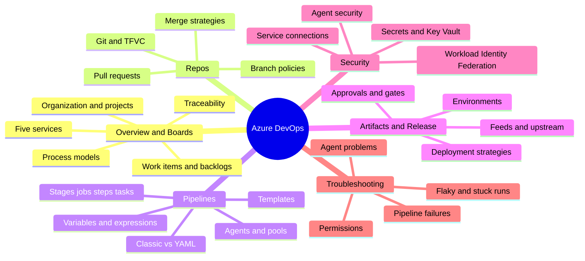
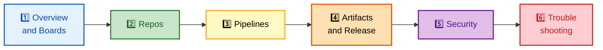

# Azure DevOps — Interview Preparation Guide

> **300+ Azure DevOps interview questions and deep-dive internals for Senior DevOps Engineer, SRE, and Platform Engineer roles at FAANG-level companies.**
>
> **Scope:** Six section-wise files covering the full Azure DevOps platform — Boards, Repos, Pipelines, Artifacts & Release, Security, and Troubleshooting — each with interview-worthy Q&A, execution-model internals, colorful Mermaid diagrams, and memory hooks.

---

## 🗺️ Repo-Wide Mind Map

**Skim this first, revisit it last — the whole guide at a glance:**

---

## 📚 Master Table of Contents

| # | Section | File | Key Topics |
|---|---------|------|------------|
| 1 | **Overview & Boards** | [01-OVERVIEW-BOARDS.md](./01-OVERVIEW-BOARDS.md) | The five services, organization/project/team hierarchy, work items, backlogs & sprints, process models (Basic/Agile/Scrum/CMMI), area & iteration paths, WIQL, end-to-end traceability |
| 2 | **Azure Repos** | [02-REPOS.md](./02-REPOS.md) | Git vs TFVC, branch policies, pull-request workflow & votes, build validation on the merge result, required/auto reviewers, merge strategies, forks |
| 3 | **Azure Pipelines** | [03-PIPELINES.md](./03-PIPELINES.md) | Classic vs YAML, Stage→Job→Step→Task model, agents & pools, triggers, variables & variable groups, compile-time vs runtime expressions, templates & `extends`, enterprise templating |
| 4 | **Artifacts & Release** | [04-ARTIFACTS-RELEASE.md](./04-ARTIFACTS-RELEASE.md) | Feeds, upstream sources & caching, views & retention, environments, approvals/checks/gates, deployment strategies (runOnce/rolling/canary/blue-green) |
| 5 | **Security** | [05-SECURITY.md](./05-SECURITY.md) | Service connections, Workload Identity Federation (OIDC), Key Vault secrets, pipeline authorization scope, fork protections, agent security, RBAC |
| 6 | **Troubleshooting** | [06-TROUBLESHOOTING.md](./06-TROUBLESHOOTING.md) | The diagnostic method, pipeline failures, agent/pool problems, permission errors, flaky/stuck runs, expression-timing bugs, dependency failures, debugging tools |

---

## 🎯 How to Use This Guide

Each section file follows a consistent, interview-focused structure:

- **`## 🗺️ Visual Overview`** — a Mermaid `mindmap` of the section plus 2–3 colorful flow diagrams of the hard-to-visualize mechanics (pipeline execution, OIDC token exchange, approval gating), with **memory hooks** (mnemonics).
- **Depth topics** — each tagged with an **`🎯 Interview weight`**, an **`In one line`** summary, then tables, bold terms, and `🧠 / 💡 / ⚠️ / 🔍` callouts that separate internals from filler.
- **`## Interview Questions and Answers`** — interview-worthy questions only, each answered as **answer → internals → follow-up**.
- **Troubleshooting / Best Practices / Documentation Links** — practical close-out and official references.
- **Navigation footer** — move linearly through the six sections.

---

## 🧭 Recommended Study Order

The files are ordered as a natural learning path — read them 1 → 6:

| If you have… | Focus on |
|---|---|
| **1 evening** | Sections 3 (Pipelines) + 5 (Security) — the highest-yield interview topics |
| **A weekend** | Sections 2–5 (Repos → Pipelines → Artifacts/Release → Security) |
| **A week** | All six, in order, doing every Q&A before reading the answer |
| **Panel tomorrow** | The `🗺️ Visual Overview` + memory hooks of every section, then re-read `🎯 Interview weight: HIGH` topics |

> 🧠 **One-line platform summary:** Azure DevOps is one **organization** of **projects**, each bundling five services — **B**oards, **R**epos, **P**ipelines, **A**rtifacts, **T**est Plans — wired together by shared identity and an end-to-end traceability chain from work item to production deployment.

---

**[← Back to Main README](../README.md)** | **[Start: Overview & Boards →](./01-OVERVIEW-BOARDS.md)**
