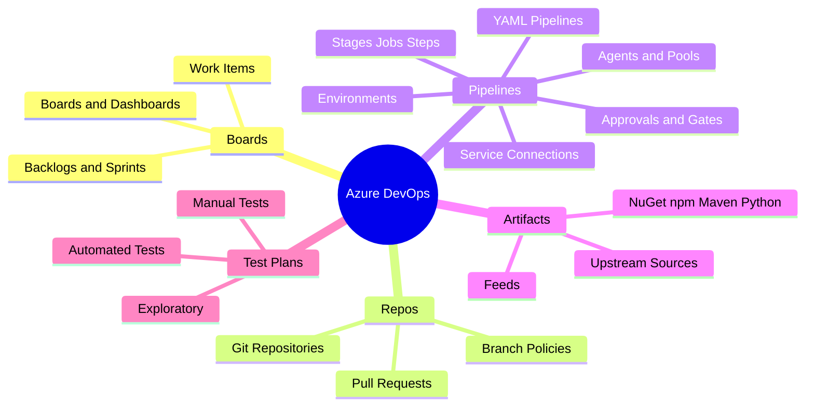
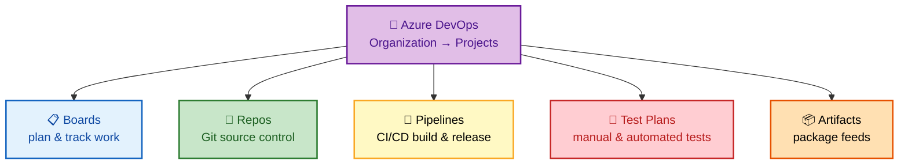
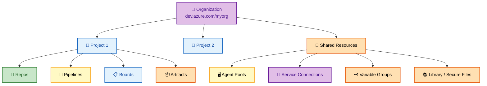
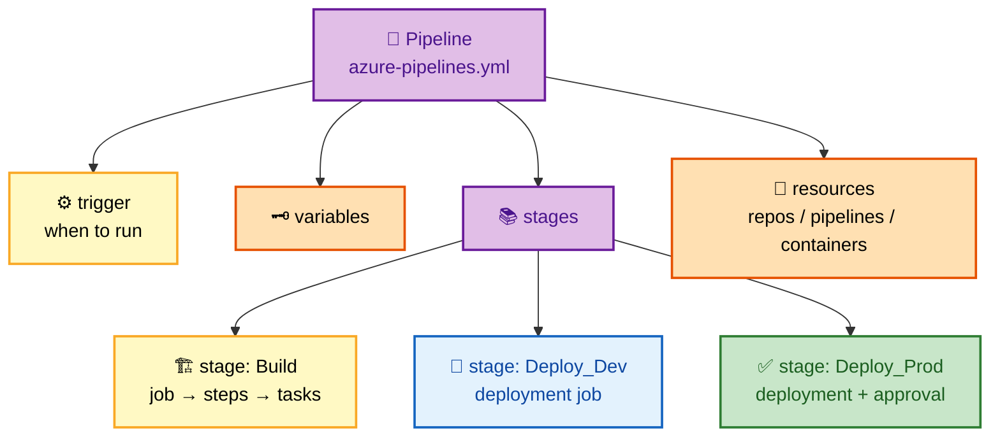
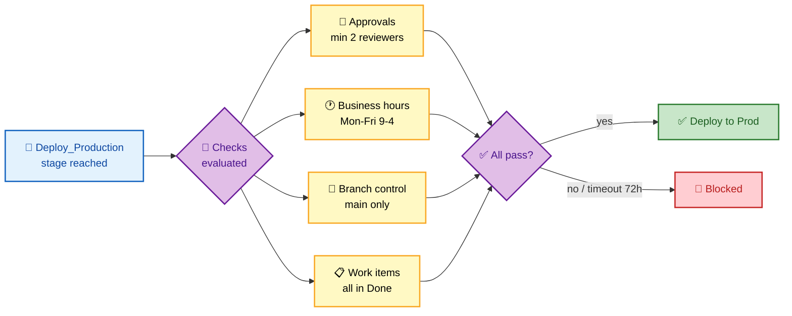
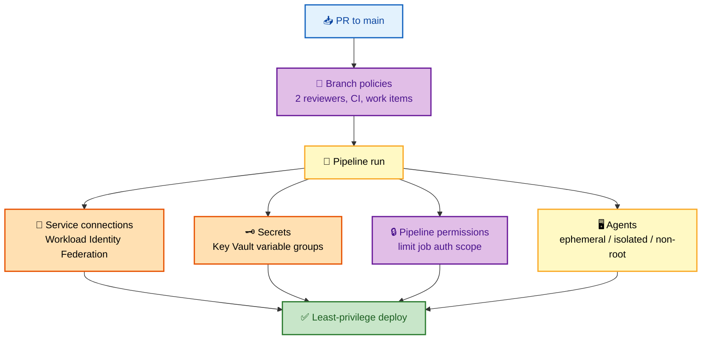
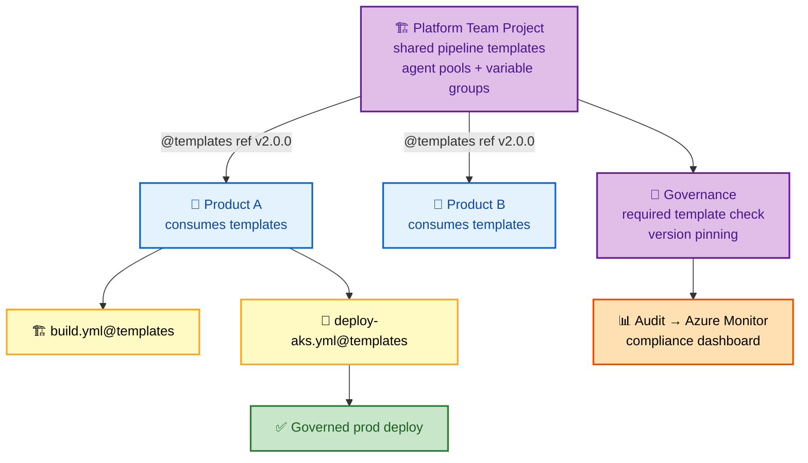

# Azure DevOps Interview Questions - Complete Guide

> **300+ Azure DevOps Interview Questions for Senior DevOps Engineer, SRE, and Platform Engineer roles at FAANG companies**

---

## 📋 Table of Contents

- [Azure DevOps Overview](#azure-devops-overview)
- [Azure Pipelines](#azure-pipelines)
- [YAML Pipelines](#yaml-pipelines)
- [Azure Repos](#azure-repos)
- [Azure Artifacts](#azure-artifacts)
- [Azure Boards](#azure-boards)
- [Security & Compliance](#security--compliance)
- [Enterprise Patterns](#enterprise-patterns)

---

## 🗺️ Visual Overview

**Mind map — the whole topic at a glance** (skim this first, revisit it last):



**The pipeline flow — memorize this source-to-deploy chain** (highest-value diagram):

```mermaid
flowchart LR
    A["📥 Source<br/>Azure Repos<br/>commit / PR"] --> B["⚙️ Trigger<br/>CI on push<br/>or PR"]
    B --> C["🏗️ Build stage<br/>compile + unit test"]
    C --> D["📦 Artifact<br/>image / package<br/>published to feed"]
    D --> E["🚀 Release stages<br/>Dev → Staging → Prod"]
    E --> F["✅ Deployed<br/>running in<br/>environment"]
    class A start
    class B ctrl
    class C proc
    class D store
    class E ctrl
    class F good
    classDef start fill:#e3f2fd,stroke:#1565c0,color:#0d47a1,stroke-width:2px;
    classDef proc fill:#fff9c4,stroke:#f9a825,color:#000,stroke-width:2px;
    classDef good fill:#c8e6c9,stroke:#2e7d32,color:#1b5e20,stroke-width:2px;
    classDef bad fill:#ffcdd2,stroke:#c62828,color:#b71c1c,stroke-width:2px;
    classDef ctrl fill:#e1bee7,stroke:#6a1b9a,color:#4a148c,stroke-width:2px;
    classDef store fill:#ffe0b2,stroke:#e65100,color:#000,stroke-width:2px;
```



**Multi-stage pipeline with environments & approvals** (how promotions are gated):

```mermaid
flowchart LR
    SRC["📥 main branch<br/>commit"] --> BUILD["🏗️ Build<br/>+ Test<br/>+ Push image"]
    BUILD --> ART["📦 Artifact<br/>manifests"]
    ART --> DEV["🚀 Deploy Dev<br/>auto"]
    DEV --> GATE1{"🚦 Approval<br/>gate?"}
    GATE1 -->|"approved"| STG["🚀 Deploy Staging<br/>smoke tests"]
    STG --> GATE2{"🚦 Prod approval<br/>2 reviewers"}
    GATE2 -->|"approved"| PROD["✅ Deploy Prod<br/>canary 10 → 50 → 100"]
    GATE2 -->|"rejected"| STOP["🛑 Blocked"]
    class SRC start
    class BUILD proc
    class ART store
    class DEV ctrl
    class STG ctrl
    class PROD good
    class STOP bad
    class GATE1 ctrl
    class GATE2 ctrl
    classDef start fill:#e3f2fd,stroke:#1565c0,color:#0d47a1,stroke-width:2px;
    classDef proc fill:#fff9c4,stroke:#f9a825,color:#000,stroke-width:2px;
    classDef good fill:#c8e6c9,stroke:#2e7d32,color:#1b5e20,stroke-width:2px;
    classDef bad fill:#ffcdd2,stroke:#c62828,color:#b71c1c,stroke-width:2px;
    classDef ctrl fill:#e1bee7,stroke:#6a1b9a,color:#4a148c,stroke-width:2px;
    classDef store fill:#ffe0b2,stroke:#e65100,color:#000,stroke-width:2px;
```



**The 5 Azure DevOps services** (what each one owns):



> 🧠 **Memory hooks (mnemonics):**
> - **The 5 services:** *"Boards Really Power Awesome Teams"* → **B**oards, **R**epos, **P**ipelines, **A**rtifacts, **T**est Plans. (Or just remember **B-R-P-A-T**.)
> - **Pipeline hierarchy:** *"Stages Just Sequence Tasks"* → **Stages** contain **Jobs**, jobs contain **Steps**, steps run **Tasks**.
> - **Promotion path:** *"Dev Speaks Plainly"* → **Dev → Staging → Prod**, each an **Environment** with its own approvals.
> - **YAML wins over Classic:** YAML is **V**ersioned, **R**eviewable, **T**emplated, **P**ortable — "Very Real Team Power."
> - **Secretless auth:** prefer **Workload Identity Federation** (WIF) over stored secrets on service connections — "no secret to leak, none to rotate."

---

## Azure DevOps Overview

### 🟢 Basic Questions

#### Q1: Explain Azure DevOps services and their purposes.

**Basic Answer:**
Azure DevOps provides five main services: Azure Boards (work tracking), Azure Repos (Git repos), Azure Pipelines (CI/CD), Azure Test Plans (testing), and Azure Artifacts (package management).

**Advanced Answer:**

```
┌─────────────────────────────────────────────────────────────────┐
│                    AZURE DEVOPS SERVICES                         │
├─────────────────────────────────────────────────────────────────┤
│                                                                  │
│  ┌─────────────────────────────────────────────────────────┐    │
│  │                                                          │    │
│  │  ┌──────────────┐  ┌──────────────┐  ┌──────────────┐   │    │
│  │  │    BOARDS    │  │    REPOS     │  │  PIPELINES   │   │    │
│  │  │              │  │              │  │              │   │    │
│  │  │ • Work Items │  │ • Git Repos  │  │ • Build      │   │    │
│  │  │ • Sprints    │  │ • PR Review  │  │ • Release    │   │    │
│  │  │ • Backlogs   │  │ • Branching  │  │ • YAML/UI    │   │    │
│  │  │ • Dashboards │  │ • Policies   │  │ • Agents     │   │    │
│  │  └──────────────┘  └──────────────┘  └──────────────┘   │    │
│  │                                                          │    │
│  │  ┌──────────────┐  ┌──────────────┐                     │    │
│  │  │  TEST PLANS  │  │  ARTIFACTS   │                     │    │
│  │  │              │  │              │                     │    │
│  │  │ • Manual     │  │ • NuGet      │                     │    │
│  │  │ • Automated  │  │ • npm        │                     │    │
│  │  │ • Exploratory│  │ • Maven      │                     │    │
│  │  │ • Load       │  │ • Python     │                     │    │
│  │  └──────────────┘  └──────────────┘                     │    │
│  │                                                          │    │
│  └─────────────────────────────────────────────────────────┘    │
│                                                                  │
│  ORGANIZATION HIERARCHY:                                        │
│  ┌─────────────────────────────────────────────────────────┐    │
│  │                                                          │    │
│  │  Organization (dev.azure.com/myorg)                      │    │
│  │  │                                                       │    │
│  │  ├── Project 1                                           │    │
│  │  │   ├── Repos                                           │    │
│  │  │   ├── Pipelines                                       │    │
│  │  │   ├── Boards                                          │    │
│  │  │   └── Artifacts                                       │    │
│  │  │                                                       │    │
│  │  ├── Project 2                                           │    │
│  │  │   └── ...                                             │    │
│  │  │                                                       │    │
│  │  └── Shared Resources                                    │    │
│  │      ├── Agent Pools                                     │    │
│  │      ├── Service Connections                             │    │
│  │      ├── Variable Groups                                 │    │
│  │      └── Library (Secure Files)                          │    │
│  │                                                          │    │
│  └─────────────────────────────────────────────────────────┘    │
│                                                                  │
└─────────────────────────────────────────────────────────────────┘
```

**🎨 Colorful view — organization hierarchy & shared resources:**



> 💡 **Interview tip:** The hierarchy is **Organization → Project → (Repos, Pipelines, Boards, Artifacts)**. Shared plumbing (agent pools, service connections, variable groups, secure files) lives at the org/project boundary — name it explicitly to show you understand governance boundaries.

---

## Azure Pipelines

### 🟡 Intermediate Questions

#### Q2: Explain the difference between Classic and YAML pipelines.

**Basic Answer:**
Classic pipelines use a UI-based editor and store configuration in Azure DevOps. YAML pipelines are code-defined, version-controlled with the source code, and support better review processes.

**Advanced Answer:**

```
┌─────────────────────────────────────────────────────────────────┐
│                    CLASSIC vs YAML PIPELINES                     │
├─────────────────────────────────────────────────────────────────┤
│                                                                  │
│  CLASSIC PIPELINES                 YAML PIPELINES               │
│  ─────────────────────            ─────────────────────         │
│  ✓ Visual designer                ✓ Code as configuration       │
│  ✓ Quick setup                    ✓ Version controlled          │
│  ✓ No code knowledge needed       ✓ PR review for changes       │
│  ✗ Not version controlled         ✓ Templates & reuse           │
│  ✗ Hard to review changes         ✓ Multi-stage pipelines       │
│  ✗ Limited reusability            ✓ Environment approvals       │
│                                                                  │
│  YAML PIPELINE STRUCTURE:                                       │
│  ┌─────────────────────────────────────────────────────────┐    │
│  │                                                          │    │
│  │  Pipeline                                                │    │
│  │  │                                                       │    │
│  │  ├── trigger              # When to run                  │    │
│  │  │                                                       │    │
│  │  ├── variables            # Pipeline variables           │    │
│  │  │                                                       │    │
│  │  ├── stages               # Deployment stages            │    │
│  │  │   │                                                   │    │
│  │  │   ├── stage: Build                                    │    │
│  │  │   │   └── jobs                                        │    │
│  │  │   │       └── job: BuildJob                           │    │
│  │  │   │           └── steps                               │    │
│  │  │   │               ├── task: Build                     │    │
│  │  │   │               └── task: Test                      │    │
│  │  │   │                                                   │    │
│  │  │   ├── stage: Deploy_Dev                               │    │
│  │  │   │   └── deployment job                              │    │
│  │  │   │                                                   │    │
│  │  │   └── stage: Deploy_Prod                              │    │
│  │  │       └── deployment job (with approval)              │    │
│  │  │                                                       │    │
│  │  └── resources            # External resources           │    │
│  │      ├── repositories                                    │    │
│  │      ├── pipelines                                       │    │
│  │      └── containers                                      │    │
│  │                                                          │    │
│  └─────────────────────────────────────────────────────────┘    │
│                                                                  │
└─────────────────────────────────────────────────────────────────┘
```

**🎨 Colorful view — YAML pipeline structure (Pipeline → Stages → Jobs → Steps → Tasks):**



> 💡 **Interview tip:** YAML pipelines win because they are **version-controlled with the code** — every pipeline change goes through PR review, is auditable, and can be templated/reused across teams. Classic pipelines only make sense for quick prototypes or non-technical owners.

---

## YAML Pipelines

### 🔴 Advanced Questions

#### Q3: Design a multi-stage YAML pipeline with environments and approvals.

**Basic Answer:**
Use stages for different environments, deployment jobs with environment references, and configure approvals in environment settings.

**Advanced Answer:**

```yaml
# azure-pipelines.yml
trigger:
  branches:
    include:
      - main
  paths:
    exclude:
      - docs/*
      - README.md

pr:
  branches:
    include:
      - main

variables:
  - group: global-variables
  - name: dockerRegistry
    value: 'myregistry.azurecr.io'

stages:
  # ==================== BUILD STAGE ====================
  - stage: Build
    displayName: 'Build & Test'
    jobs:
      - job: Build
        pool:
          vmImage: 'ubuntu-latest'
        steps:
          - task: Docker@2
            displayName: 'Build Docker Image'
            inputs:
              containerRegistry: 'acr-connection'
              repository: 'myapp'
              command: 'build'
              Dockerfile: '**/Dockerfile'
              tags: |
                $(Build.BuildId)
                latest

          - task: Docker@2
            displayName: 'Push Docker Image'
            inputs:
              containerRegistry: 'acr-connection'
              repository: 'myapp'
              command: 'push'
              tags: |
                $(Build.BuildId)
                latest

          - task: PublishPipelineArtifact@1
            inputs:
              targetPath: '$(Build.SourcesDirectory)/k8s'
              artifact: 'manifests'

  # ==================== DEV STAGE ====================
  - stage: Deploy_Dev
    displayName: 'Deploy to Dev'
    dependsOn: Build
    condition: succeeded()
    jobs:
      - deployment: DeployDev
        displayName: 'Deploy to Dev Environment'
        pool:
          vmImage: 'ubuntu-latest'
        environment: 'dev'
        strategy:
          runOnce:
            deploy:
              steps:
                - download: current
                  artifact: manifests

                - task: KubernetesManifest@0
                  displayName: 'Deploy to AKS'
                  inputs:
                    action: 'deploy'
                    kubernetesServiceConnection: 'aks-dev'
                    namespace: 'myapp'
                    manifests: |
                      $(Pipeline.Workspace)/manifests/*.yaml
                    containers: |
                      $(dockerRegistry)/myapp:$(Build.BuildId)

  # ==================== STAGING STAGE ====================
  - stage: Deploy_Staging
    displayName: 'Deploy to Staging'
    dependsOn: Deploy_Dev
    condition: succeeded()
    jobs:
      - deployment: DeployStaging
        displayName: 'Deploy to Staging Environment'
        pool:
          vmImage: 'ubuntu-latest'
        environment: 'staging'
        strategy:
          runOnce:
            deploy:
              steps:
                - download: current
                  artifact: manifests
                  
                - task: KubernetesManifest@0
                  inputs:
                    action: 'deploy'
                    kubernetesServiceConnection: 'aks-staging'
                    namespace: 'myapp'
                    manifests: |
                      $(Pipeline.Workspace)/manifests/*.yaml

  # ==================== PRODUCTION STAGE ====================
  - stage: Deploy_Production
    displayName: 'Deploy to Production'
    dependsOn: Deploy_Staging
    condition: succeeded()
    jobs:
      - deployment: DeployProd
        displayName: 'Deploy to Production'
        pool:
          vmImage: 'ubuntu-latest'
        environment: 'production'  # Has approval gate configured
        strategy:
          canary:
            increments: [10, 50]
            deploy:
              steps:
                - download: current
                  artifact: manifests
                  
                - task: KubernetesManifest@0
                  inputs:
                    action: 'deploy'
                    kubernetesServiceConnection: 'aks-prod'
                    namespace: 'myapp'
                    manifests: |
                      $(Pipeline.Workspace)/manifests/*.yaml
                    strategy: canary
                    percentage: $(strategy.increment)
            
            postRouteTraffic:
              steps:
                - task: AzureCLI@2
                  displayName: 'Run smoke tests'
                  inputs:
                    azureSubscription: 'production-subscription'
                    scriptType: 'bash'
                    scriptLocation: 'inlineScript'
                    inlineScript: |
                      # Run smoke tests
                      curl -f https://myapp.prod.example.com/health
            
            on:
              failure:
                steps:
                  - task: KubernetesManifest@0
                    displayName: 'Rollback'
                    inputs:
                      action: 'reject'
                      kubernetesServiceConnection: 'aks-prod'
                      namespace: 'myapp'
```

```
┌─────────────────────────────────────────────────────────────────┐
│                    ENVIRONMENT APPROVALS                         │
├─────────────────────────────────────────────────────────────────┤
│                                                                  │
│  Configure in: Pipelines > Environments > production > ...      │
│                                                                  │
│  APPROVAL SETTINGS:                                             │
│  ┌─────────────────────────────────────────────────────────┐    │
│  │                                                          │    │
│  │  Approvers:                                              │    │
│  │  • User: release-manager@company.com                     │    │
│  │  • Group: Production Approvers                           │    │
│  │                                                          │    │
│  │  Options:                                                │    │
│  │  □ Allow approvers to approve their own runs             │    │
│  │  ☑ Require a minimum number of approvers: 2              │    │
│  │                                                          │    │
│  │  Timeout: 72 hours                                       │    │
│  │                                                          │    │
│  │  Instructions: "Review deployment changes and verify     │    │
│  │  staging tests passed before approving production."      │    │
│  │                                                          │    │
│  └─────────────────────────────────────────────────────────┘    │
│                                                                  │
│  ADDITIONAL CHECKS:                                             │
│  ┌─────────────────────────────────────────────────────────┐    │
│  │                                                          │    │
│  │  • Business Hours: Only deploy Mon-Fri 9am-4pm           │    │
│  │  • Branch Control: Only from main branch                 │    │
│  │  • Required Template: Must use approved template         │    │
│  │  • Invoke Azure Function: Custom validation              │    │
│  │  • Query Work Items: All linked items in Done state      │    │
│  │                                                          │    │
│  └─────────────────────────────────────────────────────────┘    │
│                                                                  │
└─────────────────────────────────────────────────────────────────┘
```

**🎨 Colorful view — approval & check flow before a production deployment:**



> ⚠️ **Gotcha:** Approvals and checks are configured on the **Environment** (Pipelines → Environments → *production*), **not** in the YAML. The YAML only *references* `environment: 'production'`; the gate lives with the environment so security owners control it independently of pipeline authors.

---

## Security & Compliance

### 🔴 Advanced Questions

#### Q4: How do you secure Azure DevOps pipelines?

**Basic Answer:**
Use service connections with least privilege, variable groups with secrets, branch policies, environment approvals, and audit logging.

**Advanced Answer:**

```
┌─────────────────────────────────────────────────────────────────┐
│                    PIPELINE SECURITY                             │
├─────────────────────────────────────────────────────────────────┤
│                                                                  │
│  1. SERVICE CONNECTIONS:                                        │
│  ┌─────────────────────────────────────────────────────────┐    │
│  │                                                          │    │
│  │  • Use Workload Identity Federation (no secrets!)        │    │
│  │  • Scope to specific resource groups                     │    │
│  │  • Grant pipeline-level, not project-level               │    │
│  │  • Require approval for production connections           │    │
│  │                                                          │    │
│  │  # Workload Identity setup:                              │    │
│  │  Azure AD App Registration                               │    │
│  │    └── Federated Credential                              │    │
│  │        Subject: sc://org/project/connection-name         │    │
│  │                                                          │    │
│  └─────────────────────────────────────────────────────────┘    │
│                                                                  │
│  2. SECRETS MANAGEMENT:                                         │
│  ┌─────────────────────────────────────────────────────────┐    │
│  │                                                          │    │
│  │  Variable Groups (linked to Key Vault):                  │    │
│  │  - name: prod-secrets                                    │    │
│  │    type: AzureKeyVault                                   │    │
│  │    azureSubscription: 'keyvault-connection'              │    │
│  │    keyVaultName: 'my-keyvault'                           │    │
│  │                                                          │    │
│  │  # In pipeline:                                          │    │
│  │  variables:                                              │    │
│  │    - group: prod-secrets  # Auto-fetches from Key Vault  │    │
│  │                                                          │    │
│  │  Best Practices:                                         │    │
│  │  • Never echo secrets in logs                            │    │
│  │  • Use secret variables (isSecret: true)                 │    │
│  │  • Rotate secrets regularly                              │    │
│  │                                                          │    │
│  └─────────────────────────────────────────────────────────┘    │
│                                                                  │
│  3. BRANCH POLICIES:                                            │
│  ┌─────────────────────────────────────────────────────────┐    │
│  │                                                          │    │
│  │  Protect main branch:                                    │    │
│  │  ☑ Require minimum number of reviewers: 2                │    │
│  │  ☑ Check for linked work items                           │    │
│  │  ☑ Check for comment resolution                          │    │
│  │  ☑ Build validation (run CI on PR)                       │    │
│  │  ☑ Require merge strategy: Squash                        │    │
│  │  ☑ Automatically include reviewers (CODEOWNERS)          │    │
│  │                                                          │    │
│  └─────────────────────────────────────────────────────────┘    │
│                                                                  │
│  4. PIPELINE PERMISSIONS:                                       │
│  ┌─────────────────────────────────────────────────────────┐    │
│  │                                                          │    │
│  │  # Restrict who can edit pipelines                       │    │
│  │  Pipeline Settings:                                      │    │
│  │  ☑ Limit job authorization scope to current project      │    │
│  │  ☑ Limit job authorization scope to referenced repos     │    │
│  │  ☑ Protect access to repositories in YAML pipelines      │    │
│  │                                                          │    │
│  │  # Pipeline-level permissions                            │    │
│  │  Readers: View pipeline                                  │    │
│  │  Contributors: Queue builds                              │    │
│  │  Administrators: Edit pipeline                           │    │
│  │                                                          │    │
│  └─────────────────────────────────────────────────────────┘    │
│                                                                  │
│  5. AGENT SECURITY:                                             │
│  ┌─────────────────────────────────────────────────────────┐    │
│  │                                                          │    │
│  │  • Use Microsoft-hosted agents (ephemeral)               │    │
│  │  • Self-hosted: Isolate in dedicated VNet                │    │
│  │  • Self-hosted: Run as non-root user                     │    │
│  │  • Self-hosted: Regular patching                         │    │
│  │  • Use agent pools with specific permissions             │    │
│  │                                                          │    │
│  └─────────────────────────────────────────────────────────┘    │
│                                                                  │
└─────────────────────────────────────────────────────────────────┘
```

**🎨 Colorful view — five layers of pipeline security (defense in depth):**



> 💡 **Interview tip:** Lead with **Workload Identity Federation** (no stored secrets) for service connections — it removes the biggest credential-leak surface. Then layer branch policies, Key Vault-backed variable groups, scoped pipeline permissions, and ephemeral agents. Say "defense in depth," not "one silver bullet."

---

## Enterprise Patterns

### ⚫ Expert Questions

#### Q5: Design a multi-team Azure DevOps structure with shared components.

**Advanced Answer:**

```
┌─────────────────────────────────────────────────────────────────┐
│              ENTERPRISE AZURE DEVOPS ARCHITECTURE                │
├─────────────────────────────────────────────────────────────────┤
│                                                                  │
│  ORGANIZATION STRUCTURE:                                        │
│  ┌─────────────────────────────────────────────────────────┐    │
│  │                                                          │    │
│  │  Organization: company.visualstudio.com                  │    │
│  │  │                                                       │    │
│  │  ├── Platform Team Project                               │    │
│  │  │   ├── Shared Pipeline Templates                       │    │
│  │  │   ├── Shared Variable Groups                          │    │
│  │  │   ├── Centralized Agent Pools                         │    │
│  │  │   └── Common Build Tasks                              │    │
│  │  │                                                       │    │
│  │  ├── Product A Project                                   │    │
│  │  │   ├── Uses: @templates from Platform                  │    │
│  │  │   └── Team-specific pipelines                         │    │
│  │  │                                                       │    │
│  │  ├── Product B Project                                   │    │
│  │  │   └── ...                                             │    │
│  │  │                                                       │    │
│  │  └── Shared Services Project                             │    │
│  │      ├── Common libraries                                │    │
│  │      └── Internal packages                               │    │
│  │                                                          │    │
│  └─────────────────────────────────────────────────────────┘    │
│                                                                  │
│  TEMPLATE REPOSITORY PATTERN:                                   │
│  ┌─────────────────────────────────────────────────────────┐    │
│  │                                                          │    │
│  │  # Platform team's template repo                         │    │
│  │  templates/                                              │    │
│  │  ├── stages/                                             │    │
│  │  │   ├── build.yml                                       │    │
│  │  │   ├── deploy-aks.yml                                  │    │
│  │  │   └── security-scan.yml                               │    │
│  │  ├── jobs/                                               │    │
│  │  │   ├── docker-build.yml                                │    │
│  │  │   └── terraform-deploy.yml                            │    │
│  │  └── steps/                                              │    │
│  │      ├── npm-install.yml                                 │    │
│  │      └── sonar-scan.yml                                  │    │
│  │                                                          │    │
│  └─────────────────────────────────────────────────────────┘    │
│                                                                  │
│  CONSUMING TEMPLATES:                                           │
│  ┌─────────────────────────────────────────────────────────┐    │
│  │                                                          │    │
│  │  # Product team's azure-pipelines.yml                    │    │
│  │  resources:                                              │    │
│  │    repositories:                                         │    │
│  │      - repository: templates                             │    │
│  │        type: git                                         │    │
│  │        name: Platform/pipeline-templates                 │    │
│  │        ref: refs/tags/v2.0.0  # Pin to version!          │    │
│  │                                                          │    │
│  │  stages:                                                 │    │
│  │    - template: stages/build.yml@templates                │    │
│  │      parameters:                                         │    │
│  │        buildConfiguration: Release                       │    │
│  │        runTests: true                                    │    │
│  │                                                          │    │
│  │    - template: stages/deploy-aks.yml@templates           │    │
│  │      parameters:                                         │    │
│  │        environment: production                           │    │
│  │        aksCluster: prod-aks                              │    │
│  │                                                          │    │
│  └─────────────────────────────────────────────────────────┘    │
│                                                                  │
│  GOVERNANCE:                                                    │
│  ┌─────────────────────────────────────────────────────────┐    │
│  │                                                          │    │
│  │  Required Template Check:                                │    │
│  │  • Enforce specific templates for production             │    │
│  │  • Version pinning required                              │    │
│  │                                                          │    │
│  │  Audit & Compliance:                                     │    │
│  │  • Stream audit logs to Azure Monitor                    │    │
│  │  • Track all pipeline changes                            │    │
│  │  • Compliance dashboard                                  │    │
│  │                                                          │    │
│  └─────────────────────────────────────────────────────────┘    │
│                                                                  │
└─────────────────────────────────────────────────────────────────┘
```

**🎨 Colorful view — platform team owns shared templates, product teams consume them:**



> 💡 **Interview tip:** The winning pattern is a **central platform team publishing versioned pipeline templates** that product teams reference via `@templates` with a pinned tag (`ref: refs/tags/v2.0.0`). This gives reuse + governance without blocking teams — enforce it with a **Required Template check** on production environments.

---

## 📚 Documentation Links

- [Azure DevOps Documentation](https://docs.microsoft.com/en-us/azure/devops/)
- [YAML Schema Reference](https://docs.microsoft.com/en-us/azure/devops/pipelines/yaml-schema)
- [Pipeline Templates](https://docs.microsoft.com/en-us/azure/devops/pipelines/process/templates)

---

**[← Back to Main README](../README.md)** | **[Next: Jenkins →](../jenkins/README.md)**
