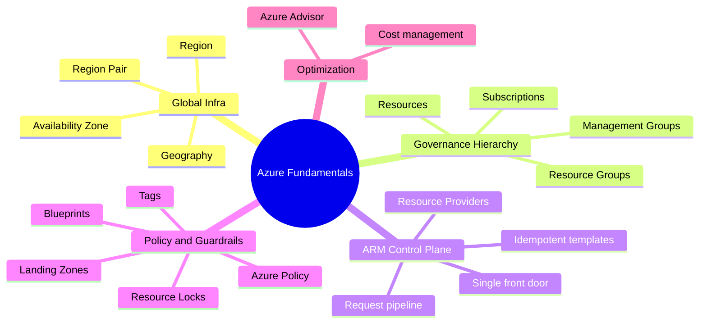
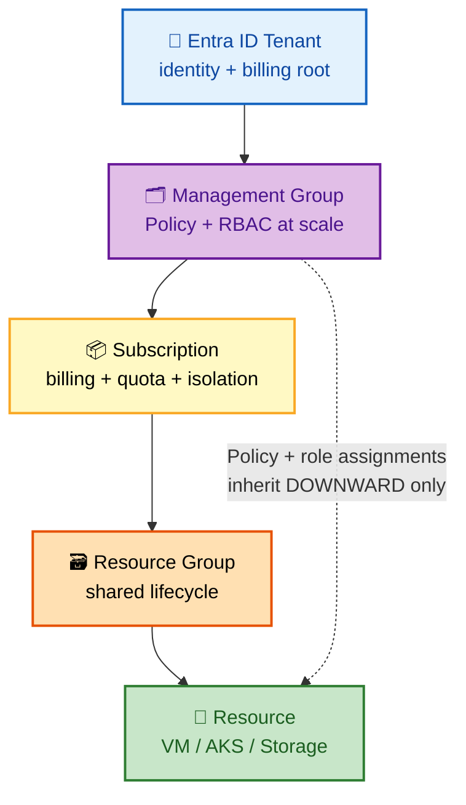
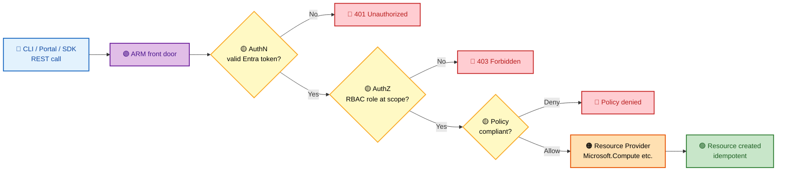
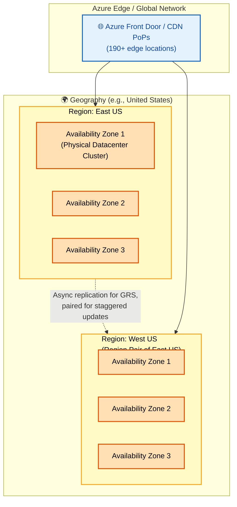
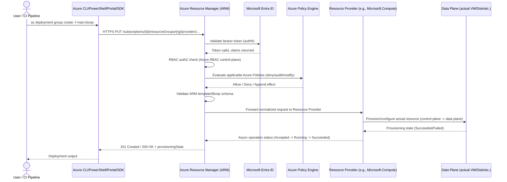
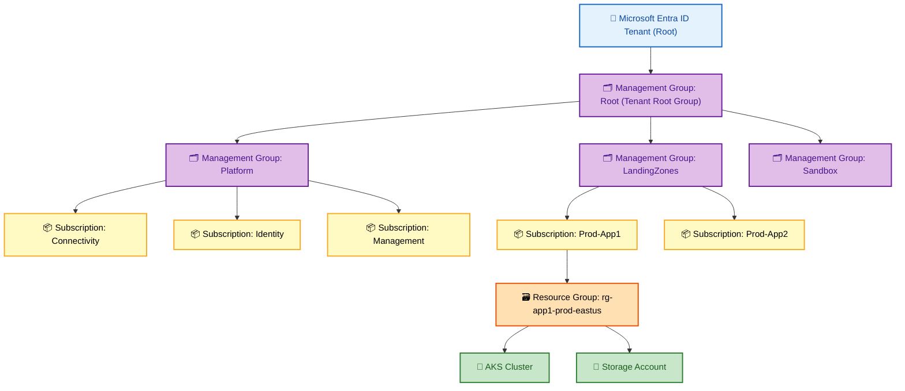

# SECTION 1: AZURE FUNDAMENTALS

## 1.1 Concept Overview

**In one line:** Every Azure action — from creating a VM to assigning a role — is a REST call to one control-plane service (ARM), which authenticates, authorizes, policy-checks, then delegates to a per-service Resource Provider; internalize "ARM as the front door" and you can reason about failure modes instead of memorizing service names.

Azure Fundamentals is the bedrock layer every other topic (networking, AKS, identity, security) is built on top of. At a FAANG-level interview, you are almost never asked "what is a resource group" in isolation — instead, you're expected to reason about **how Azure Resource Manager (ARM) actually processes a deployment**, **why management groups and policy inheritance matter at 500+ subscription scale**, and **how global Azure's control plane maintains consistency across 60+ regions**. This section builds that foundational mental model.

The core abstraction to internalize: **Azure is a distributed system where every operation (create a VM, attach a disk, assign a role) is itself an API call against a single control-plane service — ARM — which fans out to individual Resource Providers (RPs).** Understanding this "ARM as the front door" model is what separates candidates who memorize service names from candidates who can reason about failure modes, idempotency, and consistency guarantees.

## 🗺️ Visual Overview

**Mind map — the whole section at a glance** (skim first, revisit last):



**Diagram 1 — The governance hierarchy (scope ladder that Policy + RBAC inherit downward):**



**Diagram 2 — The ARM request pipeline (same four gates, every single call):**



> 🧠 **Memory hooks (mnemonics):**
> - **Resource hierarchy ladder** (top → bottom): *"My SuperRich Relatives"* → **M**anagement group → **S**ubscription → **R**esource group → **R**esource. Anything set higher rolls **downhill**.
> - **ARM request order:** *"Authenticate, Authorize, Police, Provision"* → Entra authN → RBAC authZ → Azure Policy → Resource Provider. Same order every time.
> - **Region Pair rule:** paired regions are **300+ miles apart** and **never** updated simultaneously — your built-in blast-radius insurance.
> - **AZ vs Region:** *Zone = building, Region = city, Geography = country.* Zone-redundant needs **3** AZs.
> - **Locks beat Policy for deletion:** a `CanNotDelete`/`ReadOnly` **Resource Lock** stops even an Owner; Policy governs *what you can create*, Locks govern *what you can destroy*.

## 1.2 Architecture

### Global Azure Architecture



- **Region:** A set of datacenters deployed within a latency-defined perimeter, connected via a dedicated low-latency regional network. Azure has 60+ regions — more than any other cloud provider.
- **Availability Zone (AZ):** Physically separate datacenters within a region, each with independent power, cooling, and networking. A region is "zone-redundant" if it has 3+ AZs. Not all regions have AZs (check via `az account list-locations` + zone mapping).
- **Region Pair:** Two regions in the same geography (usually 300+ miles apart) explicitly paired by Microsoft for sequential platform updates (never both paired regions updated simultaneously) and prioritized recovery order during a broad outage. Example: East US ↔ West US, North Europe ↔ West Europe.
- **Geography:** A discrete market (e.g., "United States," "Germany") containing multiple regions, often mapped to data-residency/compliance boundaries.

### ARM Request Flow (Internal Working)



**Key internal facts to articulate in an interview:**
1. ARM is **stateless and multi-tenant** — it doesn't "own" your resources; it's a uniform REST front-end (control plane) that delegates to Resource Providers.
2. Every ARM operation is **idempotent** by design (PUT semantics) — re-submitting the same template is safe, which is why declarative IaC (Terraform/Bicep) works reliably against it.
3. ARM enforces **authentication (Entra ID) → authorization (Azure RBAC) → Azure Policy → resource-provider-specific validation**, in that order — this ordering is a very common interview probe (see FAANG-level questions below).
4. Long-running operations (LROs) are handled via **Azure-AsyncOperation** headers — ARM returns `202 Accepted` immediately and the client polls a status URL, because provisioning a VM or AKS cluster can take minutes.
5. ARM applies **throttling** per subscription/tenant (read/write operation limits, e.g., 1200 write requests per hour per subscription per resource type) — a common root cause of "ResourceGroupNotFound" or `429 Too Many Requests` errors in large automated pipelines.

### Resource Provider Registration Process

Every Azure service (Compute, Network, Storage, ContainerService/AKS, KeyVault, etc.) is implemented by a **Resource Provider (RP)**, identified by a namespace like `Microsoft.Compute` or `Microsoft.ContainerService`. A subscription must **register** an RP before it can create resources of that type.

```bash
# List all resource providers and their registration state
az provider list --query "[].{Namespace:namespace, State:registrationState}" -o table

# Register a specific RP (common first-time AKS setup step)
az provider register --namespace Microsoft.ContainerService --wait

# Check registration state
az provider show --namespace Microsoft.ContainerService --query registrationState
```

**Why this matters operationally:** New subscriptions (or subscriptions created via automation/Landing Zone factories) sometimes have RPs unregistered by default (especially preview RPs like `Microsoft.ContainerService/managedClusters` features). This is one of the **top 5 "it works in one subscription but not another"** production issues — always check RP registration state first when a deployment fails with `MissingSubscriptionRegistration`.

## 1.3 Core Components (Deep Dive)

### Resource Groups
Logical containers for resources sharing the same lifecycle (deploy/delete together). **Resource groups have a single Azure region for their metadata** (not the resources inside them — resources can live in a different region than their RG's metadata region). Deleting a resource group cascades to delete everything inside it — the #1 cause of accidental production incidents; always pair with **Resource Locks** (see below) on critical RGs.

> ⚠️ **Gotcha:** The RG's region only stores its *metadata*. If that one region has a control-plane outage, you may be unable to manage (create/delete) resources in the RG even though the resources themselves live in a healthy region and keep running.


### Azure Resource Manager (ARM) — Deployment Models
- **ARM Templates (JSON):** original declarative IaC format.
- **Bicep:** DSL that transpiles to ARM JSON; Microsoft's recommended authoring layer today (cleaner syntax, native module support, no state file needed since ARM itself tracks state).
- **Terraform (`azurerm` provider):** calls the same ARM REST APIs underneath — this is why Terraform, Bicep, Portal, and CLI are all just different clients of the same control plane, and why **drift** happens when multiple tools manage the same resource.

### Subscription Management & Management Groups



- **Management Groups** form a hierarchy above subscriptions (up to 6 levels deep) — used to apply **Azure Policy** and **Azure RBAC** at scale, inherited downward to every subscription/resource-group/resource beneath them.
- **Subscriptions** are the billing + quota + hard-isolation boundary. Some limits (e.g., number of VNets, ARM template parameters) are per-subscription, making subscription design (one per environment? one per team? one per region?) a genuine architecture decision covered in **Azure Landing Zones**.
- This hierarchy is EXACTLY how enterprises implement **"Landing Zones"** — a set of pre-provisioned, policy-governed subscriptions following the **Cloud Adoption Framework (CAF)** reference architecture (Platform landing zones for connectivity/identity/management + Application landing zones for workloads).

### Azure Policy
Declarative rules evaluated by the **Policy Engine** during the ARM request pipeline (see sequence diagram above) and periodically via **compliance scans** (every 24 hours, or on-demand). Effects include:
- `Deny` — blocks non-compliant resource creation at admission time.
- `Audit` — allows creation but flags non-compliance in reports.
- `Modify`/`Append` — auto-injects/corrects properties (e.g., force a specific tag or a required NSG rule) before the request reaches the Resource Provider.
- `DeployIfNotExists (DINE)` — remediation-triggering effect; deploys a companion resource (e.g., auto-enable diagnostic settings) if missing.

```bash
# Example: Assign a built-in policy to enforce a required tag at a Management Group scope
az policy assignment create \
  --name "require-costcenter-tag" \
  --display-name "Require CostCenter tag on all resources" \
  --policy "/providers/Microsoft.Authorization/policyDefinitions/1e30110a-5ceb-460c-a204-c1c3969c6d62" \
  --scope "/providers/Microsoft.Management/managementGroups/mg-landingzones" \
  --params '{"tagName":{"value":"CostCenter"}}'
```

### Azure Blueprints (Deprecated → Template Specs + Landing Zone Accelerator)
Blueprints (RGs + policies + RBAC + ARM templates bundled and versioned together) are **retired** (deprecation completed 2026) in favor of a combination of **Template Specs**, **Deployment Stacks**, and the **Azure Landing Zone (ALZ) Bicep/Terraform accelerators**. A FAANG interviewer may specifically probe whether you know Blueprints are deprecated — mentioning this demonstrates you stay current.

### Azure Landing Zones (ALZ)
The reference architecture (part of the Cloud Adoption Framework) for enterprise-scale Azure environments: a **Platform** set of subscriptions (Connectivity hub VNet, Identity, Management/Logging) plus **Landing Zone** subscriptions for application workloads, all governed centrally via Management Group-scoped Policy + RBAC. Design goals: **scalability, governance-by-default, separation of duties, and subscription democratization** (teams get their own subscription but inherit guardrails automatically).

### Tags
Key-value metadata (up to 50 tags per resource) used for **cost allocation, automation targeting, and governance** (`Modify`/`Append` policies frequently enforce mandatory tags like `Environment`, `CostCenter`, `Owner`). Tags do NOT automatically inherit from Resource Group to child resources (a very common gotcha) — you need an explicit Policy with a `Modify` effect (built-in: "Inherit a tag from the resource group") to propagate them.

> ⚠️ **Gotcha:** Unlike Policy and RBAC, **tags do not inherit** down the hierarchy. A resource has only the tags explicitly set on it (or applied by a `Modify` policy). Assuming inheritance breaks cost-allocation reports.

### Azure Advisor
A free, continuous recommendation engine analyzing your deployed resources across 5 pillars: **Cost, Security, Reliability, Operational Excellence, Performance** — essentially Azure's automated Well-Architected Framework reviewer. Interviewers sometimes ask "how do you continuously ensure cost hygiene" — Advisor + Cost Management + budgets/alerts is the expected answer.

### Resource Locks
`CanNotDelete` (allows read/modify, blocks delete) or `ReadOnly` (blocks modify AND delete) locks applied at subscription/RG/resource scope, inherited downward, and enforced **even for Owner-role principals** (locks aren't an RBAC bypass — they sit at a layer RBAC can't override without first removing the lock). This is why "our Terraform destroy failed with `ScopeLocked`" is a top production incident (see Troubleshooting below).

## 1.4 Real-World Use Cases

1. **Enterprise Landing Zone rollout:** A Fortune 500 company onboarding 200 application teams uses Management Groups + Policy + a subscription vending machine (Terraform module) so every new team subscription automatically inherits NSG baselines, mandatory tagging, and Defender for Cloud enrollment — zero manual security review needed per subscription.
2. **Multi-region DR using Region Pairs:** A fintech platform deploys primary workloads in East US and standby in West US specifically because they're a region pair — guaranteeing Microsoft never patches/updates both simultaneously, reducing correlated-failure risk.
3. **Cost governance via tags + Azure Policy:** A media company enforces a `Modify` policy that auto-appends `CostCenter` tags inherited from the resource group, feeding Cost Management exports into a Snowflake/PowerBI chargeback dashboard per business unit.
4. **Resource Provider registration automation:** A platform team's subscription-vending pipeline pre-registers `Microsoft.ContainerService`, `Microsoft.KeyVault`, and `Microsoft.Insights` RPs as part of subscription creation, preventing "works in some subscriptions, not others" AKS onboarding failures.
5. **Emergency lockdown:** During a security incident, the platform team applies `ReadOnly` locks at the Management Group scope in minutes to freeze the entire environment while investigating, without needing to touch individual RBAC assignments.

## 1.5 Important Azure Services

`Azure Resource Manager` · `Microsoft Entra ID` · `Azure Policy` · `Azure Blueprints (deprecated)` · `Template Specs` · `Deployment Stacks` · `Azure Cost Management + Billing` · `Azure Advisor` · `Management Groups` · `Azure Resource Graph` (KQL-based cross-subscription resource querying at scale) · `Azure Landing Zone Accelerator`

## 1.6 Common Interview Questions

1. **Q: What is the difference between a Region, an Availability Zone, and a Region Pair?**
   **A:** A Region is a geographic area with one or more datacenters on a low-latency network. An Availability Zone is a physically isolated datacenter *within* a region providing independent power/cooling/network for intra-region HA. A Region Pair is two specific regions in the same geography that Microsoft explicitly pairs for staggered platform updates and prioritized recovery — used for *inter-region* DR, not just HA.

2. **Q: What happens if you delete a Resource Group?**
   **A:** ARM cascades the delete to every resource contained within it, asynchronously, and this operation is generally irreversible (barring soft-delete features on specific services like Key Vault or Storage). This is why production RGs should always have a `CanNotDelete` lock.

3. **Q: How does Azure Policy differ from Azure RBAC?**
   **A:** RBAC controls *who* can perform *which actions* (authorization). Azure Policy controls *what* those actions are allowed to create/configure regardless of who the identity is (governance/compliance) — e.g., RBAC might let you create any VM SKU, but Policy can still deny that request if it violates an approved-SKU-list rule.

4. **Q: What's the difference between a Management Group and a Subscription?**
   **A:** Subscriptions are billing + hard quota isolation boundaries containing actual resources. Management Groups are a purely organizational/governance layer *above* subscriptions used to apply Policy/RBAC at scale via inheritance — they don't contain resources directly.

5. **Q: Why would a Terraform `apply` succeed in one subscription but fail with `MissingSubscriptionRegistration` in another?**
   **A:** The target subscription hasn't registered the required Resource Provider namespace (e.g., `Microsoft.ContainerService`). Fix: `az provider register --namespace <ns>` (or ensure your Landing Zone vending pipeline pre-registers required RPs).

6. **Q: What are the five pillars Azure Advisor evaluates?**
   **A:** Cost, Security, Reliability, Operational Excellence, and Performance — directly mirroring the Well-Architected Framework pillars.

7. **Q: Can an Owner-role user delete a resource protected with a `CanNotDelete` lock?**
   **A:** No. Locks are enforced independently of RBAC role assignments; the lock itself must be removed first (and removing a lock is its own permission, `Microsoft.Authorization/locks/delete`), which can itself be restricted.

8. **Q: How do tags help with cost allocation, and what's a common pitfall?**
   **A:** Tags let Cost Management group spend by CostCenter/Environment/Owner for chargeback dashboards. Pitfall: tags on a Resource Group do NOT automatically propagate to child resources — you need an explicit "Modify" Azure Policy (e.g., "Inherit a tag from the resource group") to enforce that.

9. **Q: What replaced Azure Blueprints?**
   **A:** Blueprints are deprecated (retired in 2026). Microsoft recommends Template Specs + Deployment Stacks combined with the Azure Landing Zone Bicep/Terraform accelerators for the same "bundle governance + IaC + versioning" use case.

10. **Q: What is a Deployment Stack and how does it differ from a plain ARM/Bicep deployment?**
    **A:** A Deployment Stack is a newer ARM construct that tracks a set of resources as a single managed unit with lifecycle actions (like `denySettings` to prevent out-of-band changes, and automatic cleanup of resources removed from the template on subsequent deployments) — closer to how Terraform manages state, but natively inside ARM.

## 1.7 Advanced Interview Questions

11. **Q: Walk me through exactly what happens, internally, between running `az deployment group create` and a VM appearing as "Running."**
    **A:** (See ARM Request Flow sequence diagram above) — CLI sends an HTTPS PUT to ARM → ARM authenticates via Entra ID → Azure RBAC authorization check → Azure Policy evaluation (deny/append/modify effects applied) → template/schema validation → ARM forwards a normalized request to the `Microsoft.Compute` Resource Provider → RP performs the actual data-plane provisioning (allocating the underlying hypervisor host, attaching virtual disks, configuring the NIC) → RP reports back asynchronous operation status via polling (`Azure-AsyncOperation` header) → ARM surfaces final `provisioningState: Succeeded` back to the client.

12. **Q: How does ARM guarantee idempotency, and why does that matter for Infrastructure-as-Code tools?**
    **A:** ARM deployments use PUT semantics against a fully-qualified resource ID — resubmitting an identical template is a no-op (ARM diffs desired vs. current state before acting). This is precisely why declarative tools (Terraform, Bicep) can safely re-run `apply`/`deploy` repeatedly without creating duplicate resources, and why "drift detection" (re-running plan to see differences) is a meaningful operation.

13. **Q: What throttling limits exist at the ARM layer, and how have you mitigated them in a large automation pipeline?**
    **A:** ARM enforces subscription-level and tenant-level read/write throttling per Resource Provider (documented per-RP, often around 1200 writes/hour for many RPs, lower for others). In large CI/CD fleets deploying hundreds of environments in parallel, this manifests as `429` responses. Mitigation: batch deployments, use Deployment Stacks/complete-mode deployments to reduce individual PUT calls, add retry-with-exponential-backoff in pipeline tooling, and where possible request provider-specific limit increases via support tickets.

14. **Q: Explain the difference between "complete" and "incremental" ARM deployment modes and the operational risk of each.**
    **A:** Incremental mode (default) only adds/updates resources defined in the template, leaving out-of-template resources in the RG untouched. Complete mode deletes any resource in the target RG NOT defined in the current template — a powerful but dangerous mode that has caused real production incidents when a template accidentally omitted a resource that was manually created out-of-band.

15. **Q: How would you design a subscription topology for an organization with 300 application teams, balancing governance and developer autonomy?**
    **A:** Adopt the Azure Landing Zone pattern: Platform Management Group (Connectivity/Identity/Management subscriptions centrally managed by a platform team) + a "Landing Zones" Management Group where each team (or team-cluster) gets its own subscription via an automated "subscription vending" pipeline. Policies (mandatory tagging, approved regions, Defender enrollment, network topology via Azure Policy `DeployIfNotExists` for NSGs/hub-spoke peering) are inherited automatically from the Management Group hierarchy so teams get autonomy within guardrails without manual per-subscription review.

## 1.8 FAANG-Level Deep Dive Questions

16. **Q: ARM is described as "eventually consistent" for compliance evaluation but "strongly consistent" for admission control. Explain this distinction and why both models coexist.**
    **A:** Admission-time Policy evaluation (Deny/Modify effects) happens synchronously in the request path shown in the sequence diagram — a non-compliant resource is rejected *before* creation, giving strong consistency for prevention. However, compliance *reporting* (the dashboard showing "X% compliant resources") is computed via periodic scans (every 24 hours by default, or triggered manually) rather than a live push — meaning a resource created via a path that bypasses evaluation (e.g., certain RP-level default-created child resources, or a policy assigned *after* the resource already existed) can show as non-compliant only after the next scan cycle. This dual model exists because synchronous evaluation of *every* existing resource against *every* assigned policy on *every* read would be prohibitively expensive at Azure's scale — so Microsoft trades off freshness for reporting in exchange for real-time enforcement at write-time, which is the higher-value guarantee.

17. **Q: Design a system to detect and automatically remediate configuration drift across 10,000 Azure subscriptions using only ARM-native primitives.**
    **A:** Strong answer references: Azure Policy `DeployIfNotExists`/`Modify` effects with the **remediation task** feature (policy engine automatically re-applies desired configuration to non-compliant existing resources on a schedule), combined with **Azure Resource Graph** (a KQL-queryable, near-real-time replicated index of all resources across all subscriptions in a tenant) to run drift-detection queries at scale without hitting per-subscription ARM throttling limits (Resource Graph is a separate, read-optimized service specifically built to avoid this). At 10,000-subscription scale, you'd also discuss Management Group-scoped policy *initiatives* (bundles of related policies) rather than assigning policies individually per subscription, and event-driven remediation via Azure Event Grid system topics on Policy compliance state-change events for near-real-time (rather than 24-hour-cycle) response for the highest-severity policies.

18. **Q: A customer reports that identical Bicep templates produce different results in two subscriptions within the same tenant. Both have the same Azure RBAC assignments. What are ALL the possible root causes you'd investigate, in order?**
    **A:** Strong candidates walk through a structured elimination: (1) Resource Provider registration state differing between subscriptions (`az provider show`), (2) different API versions being resolved implicitly if the template doesn't pin `apiVersion` explicitly and the two subscriptions are in different Azure "flighting" rings for a preview feature, (3) different Azure Policy assignments at a Management Group scope one subscription is under but the other isn't (Modify/Append effects silently changing the effective template), (4) subscription-level quota/limits differing (e.g., regional vCPU quota), (5) different default subscription-level feature flags (`az feature list`) for preview capabilities, (6) region availability differences for the specific resource/SKU. This question specifically tests whether a candidate defaults to guessing vs. methodically eliminating causes layer-by-layer — the ordering itself (checking cheap, fast checks first) is part of what's being evaluated.

19. **Q: Why did Microsoft retire Azure Blueprints in favor of Deployment Stacks + Template Specs + the Landing Zone Accelerator instead of iterating on Blueprints directly?**
    **A:** This tests whether a candidate follows platform evolution, not just static knowledge. Blueprints stored their "assignment" state in a Microsoft-managed, opaque backing store separate from the ARM resources they created, which caused drift-tracking and lifecycle-management difficulty (you couldn't easily reason about a Blueprint assignment using the same ARM primitives as everything else). Deployment Stacks solve this by making the tracked-resource-set a first-class ARM resource type itself (`Microsoft.Resources/deploymentStacks`) with native `denySettings` and deletion-management, meaning the same RBAC/Policy/ARM tooling that governs everything else also governs the stack itself — architectural consistency was the driver, not just feature parity.

20. **Q: How would you explain, to a skeptical engineering leadership team, why "one big subscription with tags for isolation" is an anti-pattern compared to a proper Landing Zone / multi-subscription design?**
    **A:** Strong answer covers: (1) subscriptions are the actual **quota and hard-isolation boundary** in Azure — many limits (VNets per subscription, ExpressRoute circuits, certain RP-specific throttling) are per-subscription, so a single subscription eventually hits a wall tags cannot solve; (2) subscriptions are the natural **blast-radius boundary** for RBAC — a single subscription with tag-based "isolation" still means any Owner/Contributor at the subscription scope can see/touch every team's resources, violating least-privilege; (3) **cost management and chargeback** is dramatically cleaner via native subscription-level billing than tag-based cost-splitting which is fragile to tagging discipline; (4) **blast radius for accidental deletion or misconfigured automation** — a bad `terraform destroy` or a compromised CI credential scoped to "the subscription" is catastrophic in a single-subscription model vs. contained in a multi-subscription model.

## 1.9 Troubleshooting Scenarios

**Scenario 1 — `MissingSubscriptionRegistration` on AKS creation**
- *Symptom:* `az aks create` fails with `The subscription is not registered to use namespace 'Microsoft.ContainerService'`.
- *Investigation:* `az provider show --namespace Microsoft.ContainerService --query registrationState`
- *Root Cause:* New/reset subscription never had the RP registered (common with fresh sandbox subscriptions or subscriptions created outside the standard vending pipeline).
- *Fix:* `az provider register --namespace Microsoft.ContainerService --wait`
- *Prevention:* Bake RP pre-registration into your subscription-vending Terraform/Bicep module as a mandatory step.

**Scenario 2 — `ScopeLocked` error during `terraform destroy`**
- *Symptom:* Pipeline fails with `Cannot delete resource while locked. (Code: ScopeLocked)`.
- *Investigation:* `az lock list --resource-group <rg> -o table`
- *Root Cause:* A `CanNotDelete` or `ReadOnly` lock exists on the resource group or a parent scope, added manually or via governance automation.
- *Fix:* Remove the lock (`az lock delete`) with proper change-approval, then re-run destroy.
- *Prevention:* Document locks in your IaC repo (even if applied out-of-band) so pipeline failures are self-explanatory; consider managing locks themselves via Terraform (`azurerm_management_lock`) so they're visible in state and plan output.

**Scenario 3 — Deployment succeeds in the Portal but fails identically via Terraform**
- *Symptom:* Same resource, Portal succeeds, Terraform apply fails with a schema/validation error.
- *Investigation:* Compare `apiVersion` used by Terraform's `azurerm` provider (check provider changelog) vs. the Portal's currently-used API version; check `az provider show --namespace <ns> --query "resourceTypes[?resourceType=='<type>'].apiVersions"`.
- *Root Cause:* Terraform provider version pinned to an older API version missing a newly-required property, or vice-versa a newer preview API version with additional mandatory fields.
- *Fix:* Upgrade/pin the `azurerm` provider version explicitly; as a last resort use `azapi` provider to target a specific API version directly.
- *Prevention:* Pin provider versions explicitly in `required_providers` blocks; monitor provider release notes for breaking API version bumps.

**Scenario 4 — Tags not appearing on resources despite RG-level tags being set**
- *Symptom:* Cost reports show untagged resources despite the parent RG having correct tags.
- *Investigation:* `az resource show --ids <resource-id> --query tags`
- *Root Cause:* Tags do not auto-inherit from RG to resources; no "Modify"-effect policy exists to enforce inheritance.
- *Fix:* Assign the built-in policy "Inherit a tag from the resource group if missing" at the appropriate Management Group scope and trigger a remediation task for existing resources.
- *Prevention:* Bake mandatory-tag Modify policies into the Landing Zone baseline from day one.

**Scenario 5 — `429 Too Many Requests` during a mass environment rollout**
- *Symptom:* A pipeline deploying 50 environments in parallel starts failing intermittently with `429`.
- *Investigation:* Check `x-ms-ratelimit-remaining-subscription-writes` response header trend in pipeline logs.
- *Root Cause:* ARM per-subscription write throttling exceeded due to high parallelism.
- *Fix:* Add exponential backoff/retry logic; reduce deployment parallelism; consolidate multiple resource deployments into fewer, larger Bicep/Terraform applies (fewer individual PUT calls).
- *Prevention:* Load-test pipeline concurrency against ARM limits before scaling automation broadly; consider per-subscription-per-environment sharding to spread load.

## 1.10 Production Best Practices

- Always apply `CanNotDelete` locks on production Resource Groups and Management Group-level critical scopes (Connectivity, Identity subscriptions).
- Pin IaC provider/API versions explicitly; never float on `latest`.
- Adopt Management Groups + Policy initiatives from day one — retrofitting governance onto an existing sprawl of subscriptions is dramatically more expensive than starting with a Landing Zone.
- Use Azure Resource Graph for any cross-subscription reporting/auditing instead of iterating subscriptions one-by-one via ARM (avoids throttling, dramatically faster).
- Treat Deployment Stacks / Terraform state as the source of truth — ban manual Portal changes on production scopes via `ReadOnly` locks or Policy `deny` effects on `write` operations outside of a recognized service principal.
- Enforce mandatory tagging via Policy `Modify`/`Append`, not developer discipline.

## 1.11 Security Considerations

- Management Group and subscription-level RBAC assignments are a common privilege-escalation vector — audit `Owner` role assignments at high scopes regularly (`az role assignment list --scope <mg-id> --query "[?roleDefinitionName=='Owner']"`).
- Azure Policy `deny` effects are a critical *preventive* security control (e.g., deny public IP creation, deny non-approved regions for data residency) — treat Policy as a first-class part of your security architecture, not just cost/governance tooling.
- Resource Locks are not a substitute for RBAC — a principal with `Microsoft.Authorization/locks/delete` permission can remove a lock and then delete the resource; audit who holds that permission at each scope.
- Enable Microsoft Defender for Cloud at the Management Group scope so new subscriptions are automatically enrolled — a common gap is teams provisioning subscriptions outside the standard vending process and missing security baseline enrollment.

## 1.12 Cost Optimization Strategies

- Use tag-based cost allocation (enforced via Policy) feeding Cost Management scheduled exports into a data warehouse for chargeback.
- Azure Advisor's Cost recommendations (right-sizing, unused resources, reserved instance opportunities) should be reviewed on a recurring cadence (e.g., monthly platform team review).
- Set Budgets + Action Groups at subscription and Management Group scope to trigger automated alerts (and optionally Automation Runbooks to stop non-prod resources) when spend thresholds are exceeded.
- Consider Management Group-scoped Policy to enforce approved VM SKUs / storage redundancy tiers, preventing cost sprawl from unapproved premium SKU usage.

## 1.13 Sample Answers (Full-Length, Interview-Ready)

**Question: "Explain how Azure's control plane ensures a Terraform apply is safe to re-run."**

> *Sample strong answer:* "Terraform's `azurerm` provider ultimately issues REST calls against Azure Resource Manager, which is the single control-plane API for every Azure service. ARM operations follow PUT semantics keyed by a fully-qualified resource ID, and ARM itself diffs the desired request against current state before acting — so submitting an identical request twice is a no-op rather than creating a duplicate. This idempotency is what makes declarative re-application safe. On top of that, Terraform maintains its own state file as an additional layer of desired-state tracking, which is why drift between Terraform state and actual ARM state — for example from a manual Portal change — can cause a subsequent plan to show unexpected diffs. In production, I mitigate that by using Resource Locks and Azure Policy `deny` effects to prevent out-of-band changes to Terraform-managed resource groups, and I run a scheduled `terraform plan` in CI purely for drift detection, alerting the platform team if any diff appears outside of an approved change window."

## 1.14 Follow-up Questions Interviewers Ask

- "You mentioned Resource Locks — what's the difference in behavior between `CanNotDelete` and `ReadOnly`, specifically for a Storage Account's data plane operations (e.g., blob uploads)?" *(Tests whether candidate knows locks apply to control-plane/ARM operations, not data-plane operations — you CAN still upload/download blobs under a `ReadOnly` ARM lock, but cannot change the storage account's ARM-level configuration.)*
- "If Azure Policy evaluation happens synchronously during admission, why do compliance dashboards still show a 24-hour lag?" *(Tests the admission-vs-reporting distinction from Q16 above.)*
- "What would you do differently if you were designing this for a startup with 3 subscriptions vs. an enterprise with 3,000?" *(Tests whether the candidate over-engineers for scale that doesn't exist yet — startups often don't need full Landing Zone complexity on day one.)*

## 1.15 Microsoft Documentation Links

- [Azure Regions and Availability Zones](https://learn.microsoft.com/en-us/azure/reliability/availability-zones-overview)
- [Azure Resource Manager Overview](https://learn.microsoft.com/en-us/azure/azure-resource-manager/management/overview)
- [Resource Providers and Types](https://learn.microsoft.com/en-us/azure/azure-resource-manager/management/resource-providers-and-types)
- [Organize your resources with management groups](https://learn.microsoft.com/en-us/azure/governance/management-groups/overview)
- [Azure Policy Overview](https://learn.microsoft.com/en-us/azure/governance/policy/overview)
- [Azure Blueprints deprecation guidance](https://learn.microsoft.com/en-us/azure/governance/blueprints/overview)
- [What is Azure Landing Zone](https://learn.microsoft.com/en-us/azure/cloud-adoption-framework/ready/landing-zone/)
- [Deployment Stacks](https://learn.microsoft.com/en-us/azure/azure-resource-manager/bicep/deployment-stacks)
- [Lock resources to prevent unexpected changes](https://learn.microsoft.com/en-us/azure/azure-resource-manager/management/lock-resources)
- [Azure Advisor Overview](https://learn.microsoft.com/en-us/azure/advisor/advisor-overview)
- [Azure Resource Graph Overview](https://learn.microsoft.com/en-us/azure/governance/resource-graph/overview)
- [Cloud Adoption Framework](https://learn.microsoft.com/en-us/azure/cloud-adoption-framework/)
- [Azure Well-Architected Framework](https://learn.microsoft.com/en-us/azure/well-architected/)

## 1.16 Hands-On Labs

**Beginner:**
1. Create a Management Group hierarchy (Root → Platform → LandingZones) via CLI and assign a built-in "audit" policy at the Platform level; verify inheritance to a test subscription.
2. Create a Resource Group, apply a `CanNotDelete` lock, then attempt (and observe the failure of) a delete via CLI.

**Intermediate:**
3. Write a Bicep module that provisions a Resource Group + Storage Account with a `Modify` policy enforcing a `CostCenter` tag inheritance; trigger a remediation task on a pre-existing non-compliant resource.
4. Build a Terraform module simulating a "subscription vending" pipeline: given a subscription ID, automatically register 5 common Resource Providers and apply baseline tag policies.

**Advanced:**
5. Use Azure Resource Graph (KQL) to write a cross-subscription query identifying all resources missing a mandatory tag, across a simulated multi-subscription tenant.
6. Design and implement a Deployment Stack with `denySettings` configured to block out-of-band deletes, then attempt a manual Portal delete to observe the block.

**Expert:**
7. Build a full mini Landing Zone: Management Group hierarchy, Policy initiative bundling 5+ policies, a hub VNet in a "Connectivity" subscription, and a spoke VNet in a simulated "Landing Zone" subscription peered to the hub — all via Terraform, parameterized as a reusable module for onboarding new teams.

## 1.17 Comparison with AWS and GCP

| Concept | Azure | AWS | GCP |
|---|---|---|---|
| Control plane API | Azure Resource Manager (ARM) | AWS CloudFormation/Control Plane (per-service APIs) | Google Cloud Resource Manager |
| Organizational hierarchy | Management Groups → Subscriptions → Resource Groups | Organizations → OUs → Accounts | Organization → Folders → Projects |
| Governance-as-code | Azure Policy | AWS Organizations SCPs + AWS Config Rules | Organization Policy Service |
| Billing/hard-isolation boundary | Subscription | AWS Account | GCP Project |
| Region pairing concept | Explicit Region Pairs (Microsoft-defined) | No formal equivalent; DR design is customer-driven | No formal equivalent; multi-region customer-driven |
| Resource bundling/versioning (post-Blueprints) | Deployment Stacks / Template Specs | CloudFormation StackSets | Deployment Manager / Config Connector |
| Free continuous advisor | Azure Advisor | AWS Trusted Advisor | Active Assist recommendations |

**Key architectural distinction to articulate in interviews:** AWS's Account is a much "harder" isolation boundary by default (fully separate resource namespace, IAM root) than Azure's Subscription-under-shared-tenant model — Azure's Entra ID tenant sits *above* all subscriptions, meaning identity is more naturally unified across subscriptions in Azure than across AWS accounts (which historically required more deliberate cross-account IAM federation, though AWS Organizations + IAM Identity Center has closed this gap significantly). GCP's Project is closer in isolation semantics to an AWS Account, with Folders serving the Management-Group-like grouping role.


---

*End of Section 1. Continue to [02-IDENTITY-ACCESS-MANAGEMENT.md](./02-IDENTITY-ACCESS-MANAGEMENT.md) for Section 2 (Azure Identity & Access Management).*
