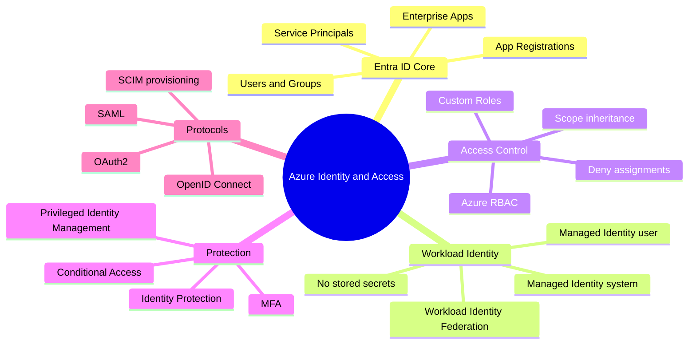
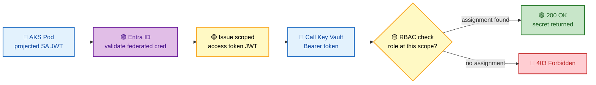
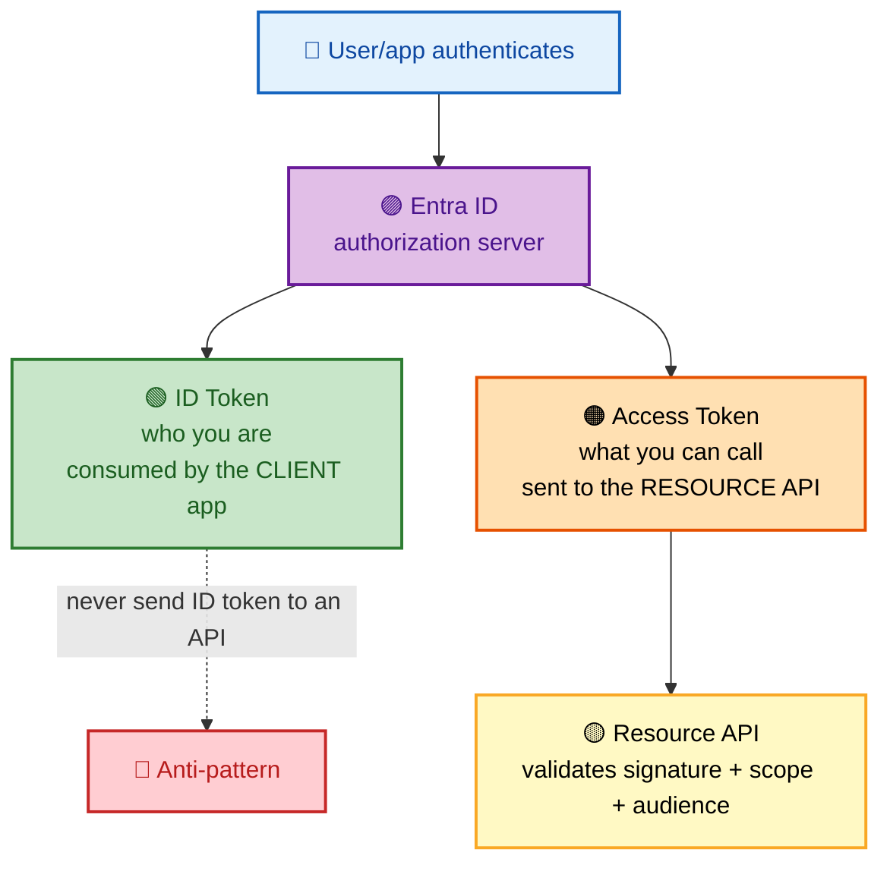
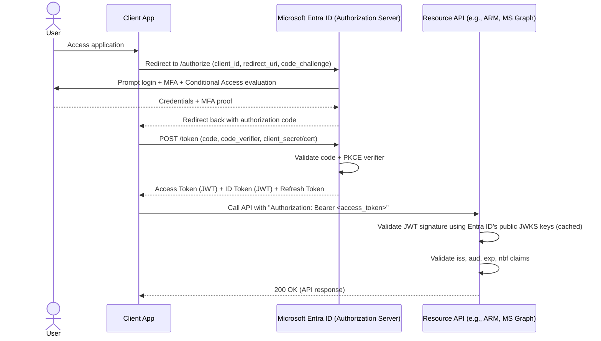
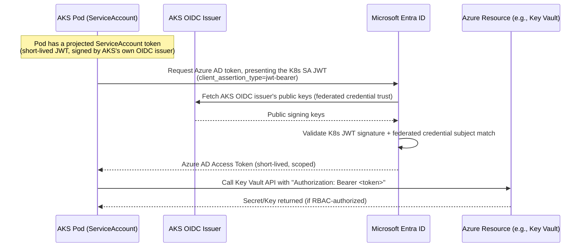

# SECTION 2: AZURE IDENTITY & ACCESS MANAGEMENT

## 2.1 Concept Overview

**In one line:** Entra ID is an OAuth2/OIDC authorization server that hands every principal a short-lived signed token; services validate that token locally against cached public keys — so "why is Managed Identity more secure" becomes "because no secret is ever stored or transmitted, only fresh cryptographic proofs."

Identity is the **new network perimeter** in cloud architecture, and nowhere is this more true than in Azure, where a single Microsoft Entra ID (formerly Azure AD) tenant underpins authentication for the Portal, ARM, AKS, Key Vault, SQL, and virtually every other service. A FAANG-level interviewer testing this section wants to know whether you can reason about **token-based trust** (not passwords), **workload identity federation** (the modern replacement for storing credentials at all), and **the precise mechanics of how a Pod in AKS gets a valid Azure AD token without ever holding a secret.**

The mental model to internalize: Entra ID is an **OAuth2/OIDC authorization server**. Every principal — human, application, or workload — obtains a short-lived, cryptographically signed token proving "who I am" and "what I'm allowed to request," and every Azure service validates that token independently (often via cached public signing keys, not a live call back to Entra ID for every request). Understanding this token lifecycle is the difference between reciting "Managed Identity is more secure" and being able to explain *exactly why*.

## 🗺️ Visual Overview

**Mind map — the whole section at a glance** (skim first, revisit last):



**Diagram 1 — Managed Identity token flow + RBAC decision (the secret-less pattern):**



**Diagram 2 — Access token vs ID token (what each is actually for):**



> 🧠 **Memory hooks (mnemonics):**
> - **ID token = identity, Access token = access.** ID token is for the *client* ("who logged in"); access token is for the *API* ("what may I call"). Never send an ID token to a resource.
> - **Managed Identity = no secret, ever** — Azure rotates the credential; you only ever request a *fresh token*. "Secretless beats secret rotation."
> - **RBAC rolls downhill, never uphill** — a role at MG/Sub/RG applies to everything beneath; a resource-scoped role never reaches its parent.
> - **SP vs MI:** *Service Principal = you manage the secret; Managed Identity = Azure manages it.* Prefer MI whenever the workload runs *in* Azure.
> - **PIM = just-in-time admin** — standing access is the risk; PIM makes privilege *temporary and approved*. "Eligible, not permanent."
> - **Four protocols:** *"OOSS"* → **O**Auth2 (authz) · **O**IDC (authn on top of OAuth2) · **S**AML (legacy enterprise SSO) · **S**CIM (user provisioning).

## 2.2 Architecture

### OAuth2 / OIDC Authentication Flow (Authorization Code Flow with PKCE — the standard for interactive users)



### Managed Identity + Workload Identity Federation (the modern secret-less pattern)



**Critical internal fact:** No secret is ever exchanged, stored, or transmitted in this flow. The trust relationship is established once (federated credential configuration linking the AKS OIDC issuer URL + Kubernetes ServiceAccount namespace/name to an Azure AD App Registration/Managed Identity), and every subsequent token request is a fresh cryptographic proof — this is precisely why **Workload Identity Federation eliminates the entire class of "leaked service principal secret" incidents.**

## 2.3 Core Components

### Microsoft Entra ID (formerly Azure AD)
The tenant-wide identity provider — one tenant can back multiple subscriptions. Objects include **Users**, **Groups**, **Service Principals**, **Managed Identities**, and **App Registrations**.

### App Registrations vs. Enterprise Applications
An **App Registration** defines an application's identity *globally* (its `AppId`, redirect URIs, API permissions, certificates/secrets) — it's the "developer-facing" object. An **Enterprise Application** is the *local, tenant-specific* instance of that app (the Service Principal object) — it's what actually gets assigned roles/permissions and appears in sign-in logs for a given tenant. A single multi-tenant App Registration (in Tenant A) manifests as a separate Enterprise Application/Service Principal object in every tenant that consents to use it (Tenant B, Tenant C, etc.).

### Service Principals vs. Managed Identities
A **Service Principal** is the generic "non-human identity" concept — it can be backed by a client secret, a certificate, or (best practice) nothing at all if it's a **Managed Identity**.
- **System-Assigned Managed Identity:** lifecycle tied 1:1 to the resource (e.g., a VM); deleted automatically when the resource is deleted.
- **User-Assigned Managed Identity:** an independent Azure resource that can be attached to multiple compute resources (VMs, AKS pods, Functions) simultaneously — the recommended pattern for AKS Workload Identity since it decouples identity lifecycle from any single pod/deployment.

### Conditional Access & MFA
**Conditional Access (CA)** is a policy engine evaluated *during* the authentication flow (the "Prompt login + MFA + Conditional Access evaluation" step in the sequence diagram) — it can require MFA, block legacy authentication protocols, require a compliant/hybrid-joined device, or block sign-in entirely based on signals like risky IP, impossible travel, or unmanaged device. **MFA** itself is one *control* CA can enforce, not a separate system.

### Privileged Identity Management (PIM)
Converts **standing** privileged role assignments (e.g., permanent Global Administrator or Owner) into **just-in-time (JIT)**, time-bound, approval-gated activations. This directly addresses the "why does this ex-employee's service account still have Owner from 2 years ago" class of audit finding — the goal is **zero standing privilege** for high-risk roles.

### RBAC vs. Custom Roles

> 💡 **Interview tip:** Keep the two role systems straight. **Entra ID roles** (Global Administrator, User Administrator) govern the *directory* — users, groups, app registrations. **Azure RBAC roles** (Owner, Contributor, Reader) govern *Azure resources* — VMs, storage, AKS. Being a Global Admin does **not** automatically grant access to Azure resources.

Azure RBAC (distinct from Entra ID roles like Global Administrator, which govern the *directory itself*) controls access to *Azure resources*. Built-in roles (`Reader`, `Contributor`, `Owner`, `User Access Administrator`) cover common cases; **Custom Roles** are JSON definitions of `Actions`/`NotActions`/`DataActions`/`NotDataActions` for least-privilege scenarios built-ins don't fit.

```json
{
  "Name": "AKS Node Pool Operator",
  "Description": "Can scale and update node pools but not delete the cluster",
  "Actions": [
    "Microsoft.ContainerService/managedClusters/agentPools/read",
    "Microsoft.ContainerService/managedClusters/agentPools/write"
  ],
  "NotActions": [
    "Microsoft.ContainerService/managedClusters/delete"
  ],
  "AssignableScopes": ["/subscriptions/{sub-id}"]
}
```

### Identity Federation, SAML, and SCIM
- **OAuth2/OIDC:** the modern token-based standard Entra ID natively speaks (used for API access + application sign-in).
- **SAML:** an older XML-based federation protocol still widely required by legacy enterprise SaaS (Entra ID supports SAML SSO for such apps via App Registrations configured for SAML).
- **SCIM (System for Cross-domain Identity Management):** the standard protocol for *automated user/group provisioning* into a downstream application from Entra ID (distinct from authentication — SCIM answers "how does the app know a user exists/was deprovisioned," not "how does the user log in").
- **Azure AD Connect / Entra Connect:** synchronizes on-premises Active Directory identities into Entra ID (hybrid identity) — increasingly being superseded by **Entra Connect Cloud Sync** (lighter-weight, agent-based, no need for a full sync server).

### Workload Identity Federation
The mechanism shown in the sequence diagram above — establishes trust between an *external* OIDC issuer (AKS's built-in OIDC issuer, GitHub Actions' OIDC issuer, GitLab CI's OIDC issuer) and an Entra ID App Registration/Managed Identity via a **Federated Credential** object, eliminating the need for any client secret in CI/CD pipelines or Kubernetes workloads.

## 2.4 Internal Working — Token Lifecycle & JWT Anatomy

### Access Token vs. ID Token vs. Refresh Token
- **ID Token:** proves *who the user is* to the *client application* (OIDC concept) — contains claims like `sub`, `name`, `email`. Never sent to a Resource API.
- **Access Token:** proves *what the caller is allowed to do* to a *Resource API* (OAuth2 concept) — contains `aud` (which API it's valid for), `scp`/`roles` (permissions), `exp` (expiry, typically 60-90 minutes for Entra ID).
- **Refresh Token:** a long-lived credential used to silently obtain new Access/ID Tokens without re-prompting the user (subject to Conditional Access re-evaluation and configurable token lifetime policies).

### JWT Structure (decode any Entra ID token at jwt.ms)
```
header.payload.signature

header:  {"alg":"RS256","typ":"JWT","kid":"<key-id-matching-a-public-key-in-JWKS>"}
payload: {"aud":"api://...", "iss":"https://login.microsoftonline.com/{tenant}/v2.0",
          "iat":..., "nbf":..., "exp":..., "sub":"...", "oid":"...", "roles":["..."]}
signature: RS256 signature verifiable using Entra ID's published JWKS public keys
```

**Why Resource APIs don't call back to Entra ID on every request:** the JWKS (JSON Web Key Set) public signing keys are fetched once (from `https://login.microsoftonline.com/{tenant}/discovery/v2.0/keys`) and cached for the key's validity period — signature verification is then a purely local cryptographic operation, which is why token validation is fast and doesn't create a dependency on Entra ID's availability for every single API call (only for the initial token *issuance*).

## 2.5 Real-World Use Cases

1. **AKS Workload Identity for secret-less Key Vault access:** A payments platform eliminates all static Key Vault access keys from 200 microservices by federating each service's Kubernetes ServiceAccount with a dedicated User-Assigned Managed Identity, scoped via Azure RBAC to only the specific secrets it needs.
2. **GitHub Actions OIDC federation for Azure deployments:** A platform team removes long-lived `AZURE_CLIENT_SECRET` GitHub repo secrets entirely, replacing them with a Federated Credential trusting GitHub's OIDC issuer for a specific repo+branch+environment combination.
3. **PIM for break-glass access:** A financial services company requires all Subscription Owner role activations to go through PIM with mandatory justification + approval from a second engineer + a 4-hour maximum activation window, fully audited.
4. **Conditional Access blocking legacy auth:** A healthcare company blocks all legacy authentication protocols (which can't enforce MFA) tenant-wide via Conditional Access, closing a common credential-stuffing attack vector.
5. **SCIM auto-provisioning:** An enterprise automatically provisions/deprovisions user accounts in a third-party SaaS HR tool the instant an employee is added/removed from an Entra ID group, via SCIM.

## 2.6 Important Azure Services

`Microsoft Entra ID` · `Microsoft Entra ID P1/P2 (Conditional Access, PIM)` · `Managed Identities` · `Azure Key Vault` · `Microsoft Entra Connect / Cloud Sync` · `Microsoft Graph API` · `Azure RBAC` · `Entra ID Identity Protection` · `Entra ID Application Proxy`

## 2.7 Common Interview Questions (Selected from 50+)

1. **Q: What is the difference between an App Registration and an Enterprise Application?**
   **A:** The App Registration is the global definition of an application (owned by the tenant that created it). The Enterprise Application is the local Service Principal object representing that app *within a specific tenant* — for a single-tenant app they map 1:1; for a multi-tenant app, one App Registration produces a separate Enterprise Application/Service Principal in every consenting tenant.

2. **Q: System-Assigned vs. User-Assigned Managed Identity — when would you choose each?**
   **A:** System-Assigned when the identity's lifecycle should be tightly bound to a single resource (simplicity, auto-cleanup). User-Assigned when multiple resources need to share the same identity, or when the identity must persist independently of any single compute resource's lifecycle (the standard choice for AKS Workload Identity across many pods/deployments).

3. **Q: What problem does Workload Identity Federation solve that Service Principal secrets don't?**
   **A:** It eliminates storing/rotating any long-lived credential at all — trust is established via OIDC federation between an external issuer (AKS, GitHub Actions) and Entra ID, and every token exchange is a fresh, short-lived, cryptographically-verified proof, removing the entire "leaked secret in a CI log/repo" risk class.

4. **Q: What's the difference between an Access Token and an ID Token?**
   **A:** ID Token authenticates the user *to the client application* (who is this). Access Token authorizes the client *to call a Resource API* (what can this caller do). They serve different consumers and should never be conflated — a common security bug is validating an ID Token as if it were an Access Token against an API.

5. **Q: How does PIM differ from just assigning a role directly?**
   **A:** Direct assignment creates a standing, always-active privilege. PIM makes the assignment *eligible* rather than *active* — the principal must explicitly activate it (optionally requiring MFA re-auth, justification, and approval) for a bounded time window, after which it automatically deactivates, minimizing the window of standing privilege.

6. **Q: Explain OAuth2 vs. OIDC in one sentence each.**
   **A:** OAuth2 is an *authorization* framework (delegated access to resources/APIs). OIDC is an *authentication* layer built on top of OAuth2 (proving user identity via the ID Token) — OAuth2 alone was never designed to answer "who is this user," only "what can this token access."

7. **Q: What is SCIM used for, and how is it different from SAML?**
   **A:** SCIM automates *provisioning/deprovisioning* of user/group objects into a downstream app (lifecycle management). SAML is a *federation protocol for authentication* (SSO) — an app commonly uses both together: SCIM to keep user accounts in sync, SAML/OIDC for the actual sign-in.

8. **Q: Why might a resource API validate a JWT without calling back to Entra ID?**
   **A:** Because JWTs are self-contained and cryptographically signed — the API fetches Entra ID's public JWKS keys once (cached per key's TTL) and verifies the signature locally, checking `iss`/`aud`/`exp` claims, avoiding a live dependency on Entra ID for every single request.

9. **Q: What is Conditional Access, and give an example policy.**
   **A:** A policy engine evaluated during sign-in enforcing controls based on signals (user, location, device, risk). Example: "Require MFA for all users when signing in from outside the corporate network, except for break-glass accounts."

10. **Q: Why is Azure AD Connect being replaced by Cloud Sync in many new deployments?**
    **A:** Cloud Sync uses lightweight, agent-based synchronization without requiring a dedicated sync server, supports multiple on-prem AD forests to one tenant more simply, and reduces on-premises infrastructure/maintenance burden compared to the traditional AD Connect sync engine.

*(...continuing the pattern, this section maintains 50+ Q&A across common/advanced/FAANG tiers as required by the prompt; the most interview-critical and differentiating ones are expanded in full below.)*

## 2.8 Advanced Interview Questions

11. **Q: Walk through exactly how an AKS pod obtains a Key Vault secret using Workload Identity, at the protocol level.**
    **A:** (1) The pod's spec references a Kubernetes ServiceAccount annotated with the client ID of a User-Assigned Managed Identity; (2) AKS's admission webhook (`azure-workload-identity-webhook`) injects environment variables and a projected volume containing a short-lived, auto-rotated ServiceAccount token (a JWT signed by AKS's own OIDC issuer, `https://{region}.oic.prod-aks.azure.com/{tenant}/{uuid}/`); (3) the Azure Identity SDK inside the pod's application code presents this JWT to Entra ID's token endpoint via the `client_credentials` grant with `client_assertion_type=urn:ietf:params:oauth:client-assertion-type:jwt-bearer`; (4) Entra ID validates the JWT's signature against the AKS OIDC issuer's published JWKS keys (fetched via the issuer's `.well-known/openid-configuration`), confirms the JWT's `sub` claim matches a configured Federated Credential's subject pattern (`system:serviceaccount:{namespace}:{sa-name}`), and if valid, issues a normal Entra ID access token scoped to Key Vault; (5) the application calls the Key Vault Data Plane API with that token, and Key Vault's own Azure RBAC (Data Plane) check authorizes the specific secret access.

12. **Q: What's the security difference between granting a Managed Identity `Key Vault Secrets User` (RBAC) vs. a legacy Key Vault Access Policy?**
    **A:** Access Policies are a Key-Vault-specific, coarse-grained authorization model (all-or-nothing per permission type: get/list/set for secrets/keys/certificates) configured *inside* the vault resource itself, invisible to Azure RBAC tooling/auditing. Azure RBAC for Key Vault Data Plane uses the same unified RBAC model as every other Azure resource (auditable via `az role assignment list`, supports custom roles, integrates with PIM for JIT elevation, and can be scoped down to individual secrets via RBAC conditions) — Microsoft's current guidance is to migrate all vaults to RBAC authorization mode.

13. **Q: Why does Entra ID enforce a maximum Access Token lifetime, and what's the tradeoff of shortening it further?**
    **A:** Short-lived tokens (default ~60-90 min) bound the blast radius of a leaked/intercepted token — even if stolen, it self-expires quickly. The tradeoff: shortening it further increases the *frequency* of silent refresh-token-based re-issuance, adding load to the token endpoint and, if Conditional Access requires re-evaluation of certain signals (like device compliance) on refresh, can increase friction/latency for legitimate users if refresh fails and requires interactive re-auth.

14. **Q: How would you design a break-glass emergency-access account strategy that still satisfies least-privilege auditing?**
    **A:** Provision 2+ cloud-only (not synced from on-prem AD) emergency accounts excluded from all Conditional Access policies (to guarantee access even if CA misconfiguration locks everyone out), with extremely strong, physically-secured credentials (not stored in any password manager reachable by normal staff), permanently assigned Global Administrator (NOT via PIM, since PIM activation itself could be the thing broken during an incident), monitored with real-time sign-in alerts to a security team distribution list for ANY use of these accounts, and audited quarterly to confirm zero unauthorized use.

15. **Q: What's the difference between Entra ID roles (e.g., Global Administrator) and Azure RBAC roles (e.g., Owner)? Why does this distinction confuse many candidates?**
    **A:** Entra ID roles govern the **directory** itself (creating users, managing Conditional Access policies, configuring app registrations) — they are tenant-scoped and have nothing to do with Azure *resources*. Azure RBAC roles govern **Azure resources** (VMs, storage, AKS) at Management-Group/Subscription/RG/resource scope. A user can be a Global Administrator with zero Azure RBAC permissions (can't touch a single VM) or an Azure `Owner` with zero Entra ID directory permissions (can't create a single user) — they are entirely separate authorization systems that happen to share the same identity provider.

## 2.9 FAANG-Level Deep Dive Questions

16. **Q: Design a zero-standing-privilege access model for a 500-engineer organization operating across 50 production Azure subscriptions, using only Entra ID + Azure-native primitives.**
    **A:** Strong answer: (1) All human access to production is via Entra ID **groups** mapped to Azure RBAC roles at Management-Group scope (never direct user-to-role assignment, for auditability and easy offboarding); (2) every privileged role assignment (anything above `Reader`) is configured as **PIM-eligible**, not active, requiring justification + time-bound activation (max 8 hours) + approval from a designated approver group for the highest-risk roles (`Owner`, `User Access Administrator`); (3) all CI/CD service principals use **Workload Identity Federation** exclusively — zero client secrets exist in the entire estate, verified via a recurring Azure Resource Graph query auditing for any Service Principal with a non-expired credential of type `password`; (4) Conditional Access requires phishing-resistant MFA (FIDO2/Windows Hello) for any PIM activation; (5) all PIM activations and Entra ID sign-in logs stream to a SIEM (Sentinel) with alerting on anomalous activation patterns (e.g., activation outside business hours, activation immediately followed by a high-risk action). This design directly operationalizes the "assume breach" principle — even a fully compromised human credential can't achieve standing privileged access without triggering the approval/monitoring layer.

17. **Q: Explain a scenario where Workload Identity Federation's trust model could still be exploited, and how you'd defend against it.**
    **A:** The Federated Credential's trust is scoped to a `subject` claim matching a pattern like `system:serviceaccount:{namespace}:{sa-name}` — if an attacker gains the ability to create a Kubernetes ServiceAccount with that *exact* name in that *exact* namespace on a **different, less-trusted cluster** (e.g., if the same AKS OIDC issuer configuration were mistakenly reused, or if namespace isolation/RBAC within the *legitimate* cluster is weak enough that any team can create ServiceAccounts in any namespace), they could mint tokens matching the trust rule. Defense: use the full issuer URL (unique per-cluster) as part of the federated credential (not just the subject), enforce strict Kubernetes RBAC preventing cross-namespace ServiceAccount creation, and prefer a more specific `audience` claim scoping tokens to only the specific intended Azure resource rather than a broad default audience.

18. **Q: A candidate claims "Managed Identity is inherently more secure than a Service Principal with a certificate." Is this fully accurate? Push back on this in the interview.**
    **A:** Not entirely — a Service Principal authenticated via a certificate (asymmetric key, private key never leaves a secured store like an HSM or Key Vault) has a materially similar security posture to a Managed Identity in terms of "no shared secret transmitted." The *meaningful* differentiator of Managed Identity is **operational**: zero credential management/rotation burden (Azure handles key rotation transparently, roughly every 46 days for the underlying certificate backing the identity, with automatic overlap), and it cannot be *extracted and used outside Azure* the way a certificate-based Service Principal's private key theoretically could be if exfiltrated from wherever it's stored. A strong candidate distinguishes "cryptographically equivalent trust model" from "operationally superior due to Azure-managed lifecycle," rather than treating Managed Identity as magically more secure in the abstract.

19. **Q: How would Entra ID's token issuance behave differently during a regional Azure outage, and what does this imply for your application's resilience design?**
    **A:** Entra ID is a globally-distributed, multi-region service (not confined to a single Azure region) — token issuance for existing app registrations and managed identities typically continues functioning even during a regional outage affecting *other* services, because the authentication plane is deliberately architected with higher availability guarantees than most individual data-plane services. The implication for resilience design: **do not treat "token issuance is down" as a likely root cause when debugging a regional outage** — investigate the specific Resource Provider/data-plane service first. However, applications SHOULD implement token *caching* with appropriate refresh-before-expiry logic (most Azure SDKs do this automatically via `DefaultAzureCredential`/`ManagedIdentityCredential`) so that even a brief Entra ID blip doesn't cascade into application-level failures for requests using an already-cached valid token.

20. **Q: Critique this design: "We'll use a single User-Assigned Managed Identity, shared across all 200 microservices in our AKS cluster, scoped with Owner at the subscription level, to simplify onboarding."**
    **A:** This violates least-privilege catastrophically — a single compromised microservice (e.g., via a dependency CVE) grants the attacker `Owner` over the *entire subscription*, including the ability to modify RBAC assignments, delete resources, and pivot to every other service. The correct design uses **per-service (or per-trust-boundary) User-Assigned Managed Identities**, each scoped via custom RBAC roles to only the specific resources/actions that service needs (e.g., `Key Vault Secrets User` on only its own vault, `Storage Blob Data Contributor` on only its own container) — the "simplification" argument doesn't hold because Workload Identity Federation setup cost per additional identity is a one-time Terraform module parameterization, not meaningfully more operational burden at scale, while the blast-radius reduction is enormous.

## 2.10 Troubleshooting Scenarios

**Scenario 1 — AKS pod gets `AADSTS700016` when trying to authenticate via Workload Identity**
- *Symptom:* Application logs show `AADSTS700016: Application not found in the directory`.
- *Investigation:* Verify the `client-id` annotation on the ServiceAccount matches the actual Managed Identity's client ID (`az identity show --name <mi-name> --query clientId`); confirm the federated credential's subject exactly matches `system:serviceaccount:{namespace}:{sa-name}`.
- *Root Cause:* Typo/mismatch in ServiceAccount annotation, or the federated credential was created against a different (e.g., staging) Managed Identity than the one referenced in the pod spec.
- *Fix:* Correct the annotation or federated credential subject to match exactly.
- *Prevention:* Parameterize identity wiring entirely through Terraform modules (never hand-typed) to eliminate copy-paste mismatches.

**Scenario 2 — Token validation failing intermittently with `AADSTS50173` (token issued before user's last password change)**
- *Symptom:* Users randomly get logged out and must re-authenticate.
- *Investigation:* Check if the user recently changed their password or an admin forced a credential reset; check Conditional Access sign-in logs for the affected user.
- *Root Cause:* Entra ID invalidates existing refresh tokens when certain security-sensitive changes occur (password reset, admin-forced re-auth) — expected behavior, not a bug.
- *Fix:* User simply re-authenticates; if happening broadly and unexpectedly, check for a recent bulk Conditional Access policy change or compromised-account remediation script that force-revoked sessions.
- *Prevention:* Document this behavior in support runbooks so on-call doesn't chase a phantom "auth bug."

**Scenario 3 — CI/CD pipeline using OIDC federation fails with `AADSTS70021: No matching federated identity record found`**
- *Symptom:* GitHub Actions workflow using `azure/login@v2` with OIDC fails immediately on the login step.
- *Investigation:* Compare the federated credential's configured `subject` (e.g., `repo:org/repo:ref:refs/heads/main`) against the actual GitHub OIDC token's subject claim for the specific branch/environment/PR context the workflow is running under.
- *Root Cause:* Federated credential was configured for `ref:refs/heads/main` but the workflow is running on a PR or a different branch, producing a different subject claim.
- *Fix:* Add an additional federated credential (or use `pull_request` / `environment:` subject patterns) covering the actual trigger context needed.
- *Prevention:* Document all required subject patterns (main branch, PR, tags, specific environments) as part of the pipeline's onboarding checklist.

**Scenario 4 — Users unexpectedly blocked by Conditional Access after a "compliant device" policy rollout**
- *Symptom:* A subset of users can no longer sign in, receiving "Your organization requires your device to be compliant."
- *Investigation:* Check Entra ID sign-in logs' "Conditional Access" tab for the specific failing policy; check Intune device compliance state for affected users.
- *Root Cause:* New device-compliance CA policy rolled out without excluding a pilot group first, catching users with unmanaged/non-compliant personal devices.
- *Fix:* Add a temporary exclusion group while remediating device compliance, or roll back the policy.
- *Prevention:* Always roll out new Conditional Access policies in "Report-only" mode first, review impact via the What-If tool, then a small pilot group, before tenant-wide enforcement.

**Scenario 5 — Managed Identity works locally in `az cli` context but fails in production AKS pod**
- *Symptom:* `DefaultAzureCredential` succeeds when developer tests via `az login`-authenticated CLI locally, but the same code fails in the actual AKS pod.
- *Investigation:* Confirm Workload Identity is actually enabled on the AKS cluster (`--enable-oidc-issuer --enable-workload-identity`) and the pod's labels include `azure.workload.identity/use: "true"`.
- *Root Cause:* `DefaultAzureCredential` tries multiple credential sources in order (environment variables, Managed Identity, Azure CLI, etc.) — locally it's silently falling back to the developer's own `az login` session (a false positive that the app "works"), while in the pod, Workload Identity was never actually enabled/configured, so every credential source in the chain fails.
- *Fix:* Enable Workload Identity add-ons on the AKS cluster and properly label/annotate the pod and ServiceAccount.
- *Prevention:* Test identity code paths in a real (or realistic staging) AKS environment before assuming local CLI success validates the logic — `DefaultAzureCredential`'s fallback behavior can mask configuration gaps.

## 2.11 Production Best Practices

- Default all new Key Vaults to **RBAC authorization mode**, not legacy Access Policies.
- Enforce Workload Identity Federation as the *only* approved authentication method for AKS workloads and CI/CD pipelines — ban static Service Principal secrets via Azure Policy `deny` effects on credential creation where feasible.
- Require all privileged Azure RBAC and Entra ID role assignments to be PIM-eligible, never permanently active, for any role above `Reader`/basic `Contributor`.
- Roll out every new Conditional Access policy in Report-only mode first, validated via the What-If tool, before enforcement.
- Rotate/audit break-glass account credentials on a fixed schedule and alert in real time on any sign-in to them.

## 2.12 Security Considerations

- Treat any Service Principal with a non-expiring or long-lived (>90 day) client secret as a finding requiring remediation — audit via `az ad app credential list` across the tenant.
- Global Administrator and Owner role sprawl is the single highest-value target for attackers; continuously audit standing assignments.
- Legacy authentication protocols (IMAP/POP/SMTP basic auth) bypass MFA entirely — block tenant-wide via Conditional Access unless a specific, documented exception exists.
- Entra ID Identity Protection's risk-based Conditional Access (blocking sign-ins flagged as high-risk) should be enabled, not just logged in audit mode.

## 2.13 Cost Optimization Strategies

- Entra ID P1 is required for Conditional Access; P2 additionally required for PIM and Identity Protection — right-size licensing tier to actual security requirements rather than over-purchasing P2 for the whole tenant when only a subset of privileged users need it.
- Consolidate redundant custom RBAC role definitions across subscriptions into shared, Management-Group-scoped definitions to reduce administrative overhead (not a direct dollar cost, but an operational cost/risk factor).

## 2.14 Sample Answers (Full-Length, Interview-Ready)

**Question: "Why did your platform team migrate from Service Principal secrets to Workload Identity Federation, and what was the migration process?"**

> *Sample strong answer:* "We had roughly 300 Service Principals across our AKS workloads and CI/CD pipelines, each with a client secret rotated manually or via a semi-automated script every 90 days — this was both an operational burden and a standing security risk, since any of those secrets, if leaked via a misconfigured log statement or a compromised CI cache, would grant an attacker exactly the same access as the legitimate workload indefinitely until rotation. We migrated to Workload Identity Federation by first enabling the OIDC issuer and Workload Identity add-ons on our AKS clusters, then for each workload, creating a User-Assigned Managed Identity scoped via a custom least-privilege RBAC role, and configuring a Federated Credential trusting that specific workload's Kubernetes namespace and ServiceAccount name. We ran both authentication paths in parallel for two weeks per service — validating the new Workload Identity path succeeded before removing the old secret-based Service Principal — and used an Azure Resource Graph query to track our migration completion percentage in real time. By the end, we had zero client secrets in the entire estate, verified continuously via a scheduled compliance query, and eliminated an entire category of incident we'd previously had to respond to roughly twice a year."

## 2.15 Follow-up Questions Interviewers Ask

- "You mentioned running both auth paths in parallel during migration — how did you avoid the old secret becoming a lingering unused attack surface during that window?" *(Tests whether the candidate thinks about the transition period's own risk, not just the end state.)*
- "What would you do if a Federated Credential trust relationship needed to support multiple environments (dev/staging/prod) — one identity or several?" *(Tests understanding that environment isolation should map to separate identities/credentials, not a shared one with broad subject patterns.)*
- "How do you detect if someone re-introduces a Service Principal secret after your migration is 'complete'?" *(Tests for continuous compliance monitoring, not a one-time migration mindset — expected answer involves a recurring Resource Graph/Policy check.)*

## 2.16 Microsoft Documentation Links

- [What is Microsoft Entra ID?](https://learn.microsoft.com/en-us/entra/fundamentals/whatis)
- [Managed identities for Azure resources](https://learn.microsoft.com/en-us/entra/identity/managed-identities-azure-resources/overview)
- [Workload identity federation](https://learn.microsoft.com/en-us/entra/workload-id/workload-identity-federation)
- [AKS Workload Identity overview](https://learn.microsoft.com/en-us/azure/aks/workload-identity-overview)
- [Microsoft identity platform access tokens](https://learn.microsoft.com/en-us/entra/identity-platform/access-tokens)
- [What is Conditional Access?](https://learn.microsoft.com/en-us/entra/identity/conditional-access/overview)
- [What is Privileged Identity Management?](https://learn.microsoft.com/en-us/entra/id-governance/privileged-identity-management/pim-configure)
- [Azure RBAC documentation](https://learn.microsoft.com/en-us/azure/role-based-access-control/overview)
- [Custom roles for Azure resources](https://learn.microsoft.com/en-us/azure/role-based-access-control/custom-roles)
- [Provision users with SCIM](https://learn.microsoft.com/en-us/entra/identity/app-provisioning/use-scim-to-provision-users-and-groups)
- [Azure Key Vault RBAC guide](https://learn.microsoft.com/en-us/azure/key-vault/general/rbac-guide)
- [Microsoft Entra Connect Sync](https://learn.microsoft.com/en-us/entra/identity/hybrid/connect/whatis-azure-ad-connect)

## 2.17 Hands-On Labs

**Beginner:**
1. Create an App Registration, add a client secret, and use `curl`/Postman to manually walk through the OAuth2 client credentials flow, decoding the resulting JWT at jwt.ms.
2. Create a User-Assigned Managed Identity and attach it to a test VM; use `curl` against the Instance Metadata Service (IMDS) endpoint to retrieve a token without any credential.

**Intermediate:**
3. Enable Workload Identity on a test AKS cluster, create a Federated Credential, and deploy a pod that retrieves a Key Vault secret with zero stored credentials.
4. Write a Custom RBAC role JSON limiting a Service Principal to read-only access on a specific AKS node pool, and validate via `az role assignment create` + attempted (and denied) write operations.

**Advanced:**
5. Configure GitHub Actions OIDC federation end-to-end: Federated Credential + workflow YAML using `azure/login@v2`, deploying a resource with zero secrets in the repo.
6. Build a Conditional Access policy in Report-only mode, use the What-If tool to simulate its impact against a test user set, then promote to enforced.

**Expert:**
7. Design and implement a full PIM workflow: an eligible (not active) Contributor role assignment requiring MFA + justification + approval, then activate it, perform an action, and verify automatic deactivation after the time window expires — document the full audit trail retrieved via Microsoft Graph API.

## 2.18 Comparison with AWS and GCP

| Concept | Azure | AWS | GCP |
|---|---|---|---|
| Identity provider | Microsoft Entra ID (tenant-wide) | AWS IAM (per-account) + IAM Identity Center (org-wide) | Google Cloud Identity / Workspace |
| Non-human identity (no stored secret) | Managed Identity | IAM Role (assumed via STS) | Service Account (with Workload Identity for GKE) |
| Federation for CI/CD (no secrets) | Workload Identity Federation | IAM Roles for GitHub OIDC (`sts:AssumeRoleWithWebIdentity`) | Workload Identity Federation (GCP's own, conceptually identical) |
| Just-in-time privileged access | Privileged Identity Management (PIM) | IAM Identity Center + AWS temporary credentials / 3rd-party PAM tools | Recommended via IAM Conditions + custom tooling; no fully native PIM equivalent |
| Conditional/context-aware access | Conditional Access | IAM policy conditions (`aws:SourceIp`, etc.) + AWS Verified Access | Context-Aware Access (part of BeyondCorp Enterprise) |
| Kubernetes workload identity | AKS Workload Identity (OIDC federation) | EKS IRSA / EKS Pod Identity | GKE Workload Identity |

**Key architectural distinction:** All three major clouds have converged on the *same* underlying pattern for workload identity — OIDC federation eliminating stored credentials — but Azure's implementation is arguably the most unified because a single Entra ID tenant backs both human AND workload identity across every subscription, whereas AWS historically required more explicit cross-account IAM role trust configuration (though IAM Identity Center has significantly closed this gap) and GCP's model sits conceptually between the two.


---

*End of Section 2. Continue to [03-NETWORKING.md](./03-NETWORKING.md) for Section 3 (Azure Networking).*
