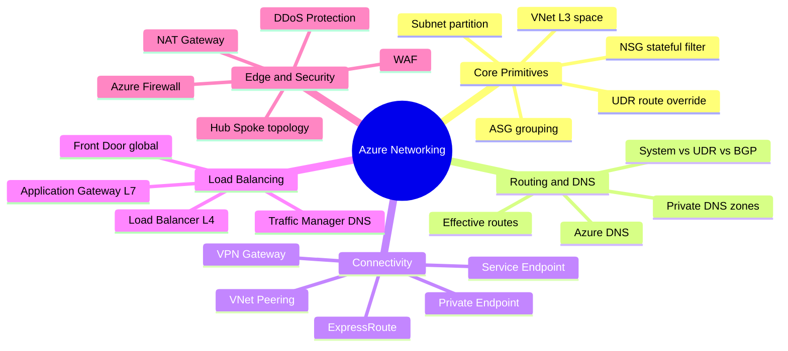
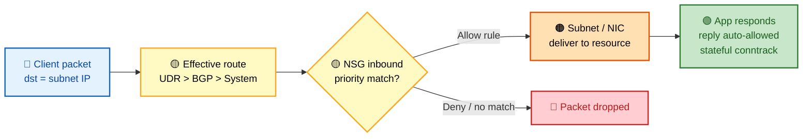
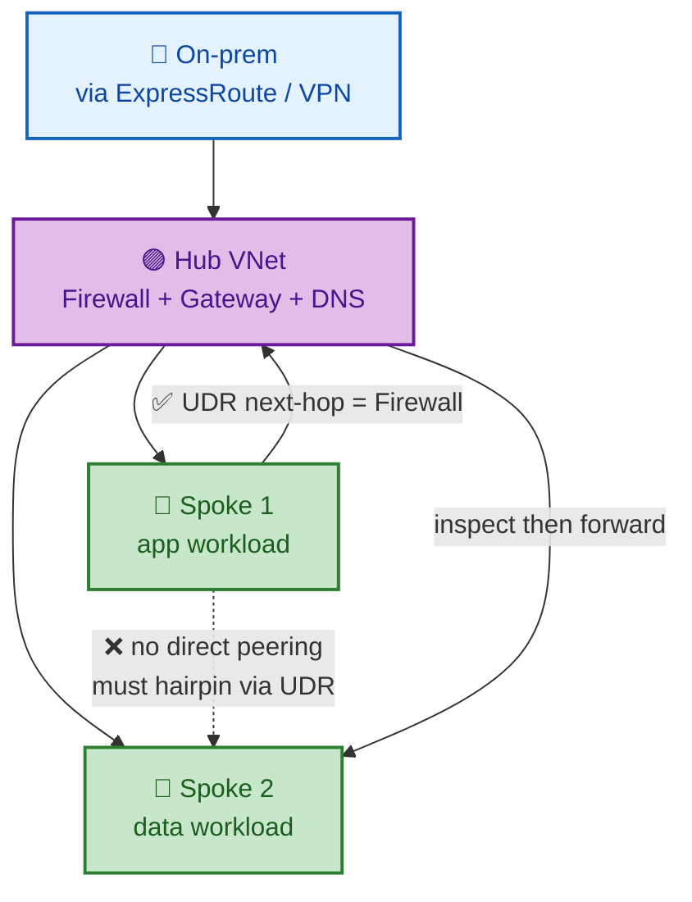
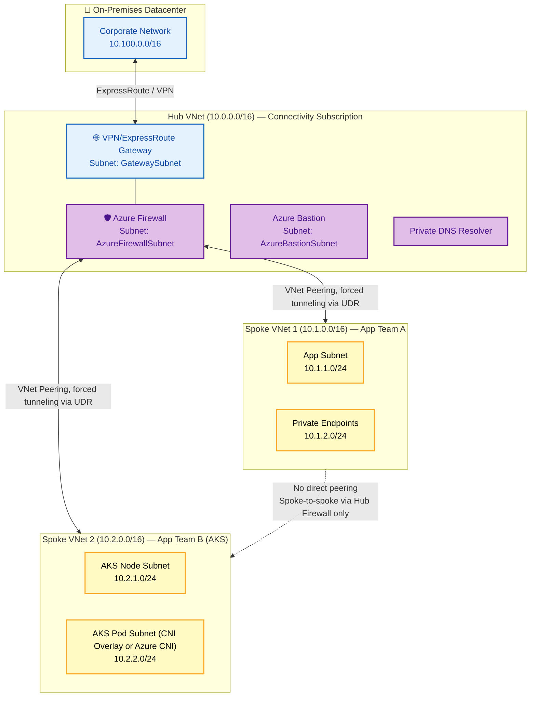
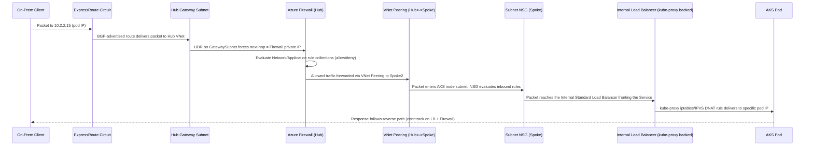

# SECTION 3: AZURE NETWORKING

## 3.1 Concept Overview

**In one line:** Azure networking is a handful of primitives — VNet (isolated L3 space), Subnet (partition), NSG (stateful L3/L4 filter), UDR (route override), Private Endpoint (a PaaS NIC in your subnet) — that compose into every topology; master the primitives and you derive any architecture from first principles.

Networking is the single highest-leverage topic in a FAANG-level Azure interview because it's where **theory meets physics** — you cannot hand-wave your way through "explain exactly how a packet gets from an on-prem client through ExpressRoute, through a hub firewall, to a private AKS pod" the way you sometimes can with higher-level PaaS questions. Interviewers use networking specifically to separate candidates who've configured resources in the Portal from candidates who understand **routing precedence, DNS resolution order, and the exact layer (L3/L4/L7) at which each service operates.**

The mental model to internalize: Azure networking is built from a small number of **primitives** (VNet = isolated L3 address space; Subnet = a partition within it; NSG = stateful L3/L4 packet filter; UDR = a routing table override; Private Endpoint = a NIC that projects a PaaS service's data plane into your VNet) that **compose** into every higher-level pattern (Hub-Spoke, Zero Trust, multi-region). If you understand the primitives precisely, you can reason about *any* topology from first principles rather than memorizing architectures.

## 🗺️ Visual Overview

**Mind map — the whole section at a glance** (skim first, revisit last):



**Diagram 1 — VNet packet flow with NSG evaluation (stateful filter + routing precedence):**



**Diagram 2 — Hub-Spoke topology (why peering is NOT transitive):**



> 🧠 **Memory hooks (mnemonics):**
> - **Routing precedence:** *"User Beats Border Beats System"* → **UDR** > **BGP** (ExpressRoute/VPN) > **System** routes. More specific prefix wins ties.
> - **NSG = Stateful** — allow the inbound packet and the reply is **automatically** allowed. You never write the return rule.
> - **Peering is NOT transitive** — *spokes talk through the hub.* Spoke-to-spoke needs a **UDR hairpin** through the hub firewall.
> - **Layer cheat sheet:** *Load Balancer = **L4**, Application Gateway = **L7**, Front Door = **L7 global edge**, Traffic Manager = **DNS** (no data plane).*
> - **Private Endpoint vs Service Endpoint:** Private Endpoint = a **private IP NIC in your subnet** (best isolation); Service Endpoint = the subnet's identity on Microsoft's backbone (no private IP). "Endpoint = IP in your VNet; Service Endpoint = VIP shortcut."
> - **NAT Gateway = outbound SNAT** — the fix for SNAT port exhaustion; scales to millions of flows.

## 3.2 Architecture

### Hub-Spoke Reference Architecture



**The single most important routing rule to articulate:** VNet Peering does **not** transitively route — Spoke1 cannot reach Spoke2 just because both are peered to the Hub, *unless* User Defined Routes (UDRs) force traffic through the Hub's Azure Firewall (or NVA), which then re-routes it to the other spoke. This "non-transitive peering + UDR-forced hairpin through a central firewall" pattern is the crux of virtually every hub-spoke design question.

### Packet Flow: On-Prem Client → Private AKS Pod (full path)



### Private Endpoint Internals

```mermaid
graph LR
    subgraph SpokeVNet["Your VNet/Subnet"]
        PE["🔌 Private Endpoint NIC<br/>Private IP: 10.1.2.4"]
    end
    subgraph AzureBackbone["Microsoft's Private Backbone (not internet)"]
        PL["🔗 Azure Private Link Service"]
    end
    subgraph PaaS["PaaS Service (e.g., Storage Account, Key Vault)"]
        DataPlane["🗄️ Data Plane Endpoint"]
    end
    PE -->|"Private Link connection<br/>(NRP-approved)"| PL
    PL --> DataPlane
    PrivateDNSZone["🧭 Private DNS Zone<br/>privatelink.blob.core.windows.net<br/>A record: storageacct -> 10.1.2.4"] -.->|resolves| PE
    class PE start
    class PL ctrl
    class DataPlane store
    class PrivateDNSZone proc
    classDef start fill:#e3f2fd,stroke:#1565c0,color:#0d47a1,stroke-width:2px;
    classDef proc fill:#fff9c4,stroke:#f9a825,color:#000,stroke-width:2px;
    classDef good fill:#c8e6c9,stroke:#2e7d32,color:#1b5e20,stroke-width:2px;
    classDef bad fill:#ffcdd2,stroke:#c62828,color:#b71c1c,stroke-width:2px;
    classDef ctrl fill:#e1bee7,stroke:#6a1b9a,color:#4a148c,stroke-width:2px;
    classDef store fill:#ffe0b2,stroke:#e65100,color:#000,stroke-width:2px;
```



**Critical internal fact:** A Private Endpoint is literally a **NIC with a private IP address placed inside your subnet**, connected via **Azure Private Link** to the specific PaaS resource's data plane over Microsoft's private backbone network — traffic **never traverses the public internet**, even though the PaaS service (Storage, SQL, Key Vault) is a shared multi-tenant platform. This is fundamentally different from a **Service Endpoint**, which does NOT give you a private IP — it just adds an optimized route + tells the PaaS service to allow the traffic based on VNet/subnet identity, while the traffic still targets the service's *public* IP (just over Microsoft's backbone rather than the public internet path, and with source recognized as "from within Azure network").

## 3.3 Core Components

### VNets, Subnets, NSGs, ASGs
- **VNet:** an isolated, customer-defined IP address space (RFC1918 or public ranges you own) — the fundamental network isolation boundary in Azure, conceptually similar to an AWS VPC.
- **Subnet:** a partition of a VNet's address range; **Azure reserves 5 IP addresses per subnet** (network address, default gateway, two for Azure DNS mapping, broadcast — even though Azure doesn't technically use broadcast, the address is still reserved), meaning a `/24` subnet (256 addresses) yields only 251 usable IPs.
- **NSG (Network Security Group):** a stateful L3/L4 packet filter with prioritized allow/deny rules, attachable to a subnet AND/OR a NIC. **Rule evaluation order:** lower priority number = evaluated first; the first matching rule wins (no further evaluation); NSGs are **stateful** — an allowed inbound flow automatically permits the corresponding outbound return traffic without a matching outbound rule.
- **ASG (Application Security Group):** a *logical grouping* of NICs (e.g., "WebServers", "SQLServers") referenced *inside* NSG rules instead of hardcoded IP ranges — this decouples security rule design from IP addressing, so scaling out a tier doesn't require rewriting NSG rules.

> ⚠️ **Gotcha:** NSGs are **stateful** and **first-match-wins by priority** (lowest number first). You never write a return rule — an allowed inbound flow auto-permits its reply. But remember a subnet NSG **and** a NIC NSG are evaluated *independently*: **both must allow**, so the more restrictive one wins.

### UDRs & Route Tables
A **Route Table** (containing one or more UDRs — User Defined Routes) overrides Azure's default system routes (which route directly between subnets in a VNet, to the internet, etc.) for a given subnet. The most common production UDR: `0.0.0.0/0 → Virtual Appliance (Azure Firewall's private IP)` — forcing **all** outbound traffic from a spoke subnet through a central firewall for inspection ("forced tunneling").

**Route selection precedence (most specific route wins, ties broken by route source priority):**
1. User Defined Routes (most specific prefix wins; if tied, UDR wins over BGP/System routes)
2. BGP-learned routes (from ExpressRoute/VPN Gateway)
3. System routes (Azure's default: VNet-local, on-prem via gateway, internet)

> 💡 **Interview tip:** Route selection is **longest-prefix-match first**; only when prefixes tie does source priority (**UDR > BGP > System**) break the tie. A `/32` system route still beats a `/24` UDR. State this precisely — vague "UDR always wins" answers get corrected.

### DNS & Private DNS
Azure-provided DNS (`168.63.129.16`, a platform link-local address, not a "real" DNS server IP you'd route to elsewhere) resolves Azure-internal names by default. **Private DNS Zones** (e.g., a custom zone or the special `privatelink.*.azure.com` zones used by Private Endpoints) let you resolve private, VNet-scoped names — critical for Private Endpoint scenarios, since the *public* DNS name of a PaaS service (`mystorageacct.blob.core.windows.net`) must ultimately resolve to the *private* IP of your Private Endpoint when queried from inside your VNet, which is achieved via a CNAME to the `privatelink.` zone linked to your VNet.

### Load Balancer vs Application Gateway vs Front Door vs Traffic Manager
| Service | OSI Layer | Scope | Use Case |
|---|---|---|---|
| **Azure Load Balancer** | L4 (TCP/UDP) | Regional | Fast, protocol-agnostic load balancing within a region/VNet |
| **Application Gateway** | L7 (HTTP/HTTPS) | Regional | Path-based routing, SSL termination, integrated WAF, session affinity |
| **Azure Front Door** | L7 (HTTP/HTTPS) | Global (Anycast, edge PoPs) | Global load balancing + CDN + WAF at the edge, closest-PoP routing |
| **Traffic Manager** | DNS-based (L7 logical, not data-path) | Global | DNS-level routing (geographic, performance, priority, weighted) — does NOT proxy traffic, just resolves to the "best" endpoint's own IP |

**The single most-tested distinction:** Traffic Manager is **pure DNS redirection** — it never sees your actual data traffic, it just answers DNS queries with the IP of the best endpoint (meaning failover requires DNS TTL expiry, introducing propagation delay). Front Door **proxies actual HTTP(S) traffic** through Microsoft's edge network (true reverse-proxy behavior, sub-second failover, WAF inspection possible) — this is why Front Door is preferred for latency-sensitive global HTTP workloads, while Traffic Manager remains relevant for non-HTTP global routing (e.g., global failover for a TCP-based service Front Door can't proxy).

### Azure Firewall vs NVA vs WAF
- **Azure Firewall:** managed, stateful L3-L7 firewall (network + application rule collections, FQDN filtering, threat intelligence feed) — the standard choice for hub-spoke centralized egress/ingress inspection.
- **NVA (Network Virtual Appliance):** a third-party firewall (Palo Alto, Fortinet, Check Point) deployed as a VM — chosen when organizational policy mandates a specific vendor already used on-prem, at the cost of managing HA/scaling yourself (vs. Azure Firewall's built-in availability-zone HA).
- **WAF (Web Application Firewall):** an L7-specific ruleset (OWASP Core Rule Set) protecting against SQL injection/XSS/etc., deployed as a **feature of Application Gateway or Front Door** (not a standalone service) — operates at a different layer/purpose than Azure Firewall (network segmentation) entirely; **they are complementary, not substitutes**, a very common interview trip-up.

### ExpressRoute vs VPN Gateway
- **VPN Gateway (Site-to-Site):** IPsec/IKE tunnel over the **public internet** — variable latency/throughput, cheaper, faster to provision (hours).
- **ExpressRoute:** a **private, dedicated circuit** via a connectivity provider, bypassing the public internet entirely — predictable low latency, higher bandwidth (up to 100 Gbps), SLA-backed, but longer provisioning lead time (weeks) and higher cost. **ExpressRoute does NOT encrypt traffic by default** (it's private, not necessarily encrypted) — a common security-review finding; **ExpressRoute with MACsec** or a VPN-over-ExpressRoute overlay addresses this if encryption-in-transit is a compliance requirement.

### Private Endpoint vs Service Endpoint (expanded)
| | Private Endpoint | Service Endpoint |
|---|---|---|
| Gets a private IP in your subnet? | Yes | No |
| Traffic path | Fully private (Private Link backbone) | Optimized route over Azure backbone, but targets service's public IP |
| Protects against data exfiltration | Yes (service unreachable from public internet if configured to deny public access) | Partial (restricts by source VNet/subnet identity, service still has a public endpoint) |
| Cross-region/on-prem access | Yes (routable like any private IP, works over ExpressRoute/VPN) | No (only works from within Azure VNets, not on-prem) |
| DNS complexity | Higher (requires Private DNS Zone + potentially DNS forwarding for on-prem) | None (uses standard public DNS) |

### DDoS Protection
**Basic** (free, automatic, always-on, protects the Azure platform itself) vs **Standard** (paid, tuned to your specific application's traffic patterns, provides SLA-backed guarantees, cost protection during an attack, and detailed attack analytics/alerting) — Standard is the expected answer for any "how do you protect a public-facing production workload" question.

## 3.4 Internal Working — Routing Decision Algorithm

```
For each outbound packet from a VM/subnet, Azure evaluates (most specific prefix wins):
1. Is there a User Defined Route matching the destination? → use its next hop.
2. Is there a BGP-learned route (from ExpressRoute/VPN) matching? → use it.
3. Fall back to System Routes:
   a. Destination in same VNet → route directly (VNet-local system route)
   b. Destination in a peered VNet → route via peering (if peering allows forwarding)
   c. Destination is on-prem (0.0.0.0/0 range overlap via Gateway) → route via VPN/ER Gateway
   d. Destination is internet → route via default internet system route (unless overridden)

NSG evaluation happens INDEPENDENTLY of routing decisions, at both:
   - Subnet level (if NSG attached)
   - NIC level (if NSG attached)
Both must ALLOW the packet (whichever is MORE restrictive wins) — this is why
"I have an NSG rule allowing it, but it's still blocked" often means there's a
SECOND NSG (subnet vs NIC level) with a conflicting deny rule evaluated separately.
```

## 3.5 Real-World Use Cases

1. **Zero-trust hub-spoke with forced tunneling:** A bank routes all spoke egress through a hub Azure Firewall with FQDN-based application rules (allow only specific approved SaaS domains), fully logging every connection to Log Analytics for compliance.
2. **Private AKS with Private Endpoints for all PaaS dependencies:** A healthcare platform's AKS cluster has a private API server (no public IP) and every dependency (Storage, Key Vault, ACR, SQL) accessed exclusively via Private Endpoints, with public network access disabled at the PaaS resource level — eliminating any data-exfiltration path via the public internet.
3. **Global low-latency API via Front Door:** A gaming company uses Front Door's Anycast edge network to route players to the nearest regional backend, with health-probe-based automatic failover in seconds if a region degrades.
4. **ExpressRoute with VPN failover:** An enterprise runs ExpressRoute as primary connectivity with a Site-to-Site VPN configured as automatic failover (BGP local-preference tuning) if the ExpressRoute circuit degrades.
5. **Cross-region Private Endpoint access:** A multi-region application in East US accesses a centralized Key Vault's Private Endpoint in West US over global VNet peering, keeping secrets access entirely off the public internet even across regions.

## 3.6 Important Azure Services

`Virtual Network` · `Network Security Groups` · `Application Security Groups` · `Azure Firewall` · `Azure Firewall Manager` · `Application Gateway` · `Azure Front Door` · `Traffic Manager` · `Azure Load Balancer` · `NAT Gateway` · `ExpressRoute` · `VPN Gateway` · `Azure Private Link` · `Azure DNS` · `Azure DDoS Protection` · `Azure Virtual WAN` · `Azure Bastion` · `Private DNS Resolver`

## 3.7 Common Interview Questions (Curated — Representative of 100+)

1. **Q: What's the difference between an NSG and an ASG?**
   **A:** NSG is the actual filtering mechanism (allow/deny rules by priority). ASG is a logical label/grouping of NICs referenced *inside* NSG rules instead of hardcoded IPs, so security policy doesn't need rewriting as instances scale.

2. **Q: Does VNet Peering transitively route traffic?**
   **A:** No. Peering is point-to-point only; Spoke-to-Spoke traffic requires explicit routing (typically via UDRs forcing traffic through a hub NVA/Firewall) even if both spokes are peered to the same hub.

3. **Q: How many IP addresses does Azure reserve per subnet, and why does this matter for capacity planning?**
   **A:** 5 (network address, default gateway, two Azure DNS-reserved, broadcast placeholder) — meaning a `/24` yields 251 usable addresses, not 256; this matters for AKS subnet sizing where Azure CNI (classic) consumes an IP per pod.

4. **Q: What's the core difference between a Private Endpoint and a Service Endpoint?**
   **A:** Private Endpoint gives you an actual private IP in your subnet with fully private Private Link traffic; Service Endpoint just optimizes routing + restricts access by VNet identity while the service keeps its public IP — Private Endpoint is required for true data-exfiltration prevention and on-prem/cross-region access.

5. **Q: Why doesn't ExpressRoute encrypt traffic by default, and how would you address a compliance requirement for encryption-in-transit?**
   **A:** ExpressRoute is a private circuit, not inherently an encrypted tunnel; use ExpressRoute with MACsec (link-layer encryption on supported circuits) or overlay a VPN/IPsec tunnel on top of ExpressRoute for application/network-layer encryption.

6. **Q: Traffic Manager vs Front Door — when would you use each?**
   **A:** Traffic Manager for DNS-level global routing of non-HTTP or where you don't need edge proxying; Front Door for HTTP(S) workloads needing sub-second failover, true reverse-proxying through edge PoPs, integrated WAF/CDN, and no DNS TTL-related failover delay.

7. **Q: What's the difference between Azure Firewall and a WAF?**
   **A:** Azure Firewall operates at L3-L7 for network-level segmentation/egress control (FQDN filtering, network/application rules); WAF is an L7-specific feature (of App Gateway/Front Door) protecting against web application attacks (SQLi/XSS via OWASP CRS) — complementary layers, not substitutes.

8. **Q: How does NSG rule evaluation determine which rule "wins"?**
   **A:** Rules are evaluated in priority order (lowest number first); the first rule matching the traffic's source/destination/port/protocol is applied and evaluation stops — no further rules are considered even if a later rule would also match.

9. **Q: Why might an NSG rule that looks correct still block traffic?**
   **A:** NSGs can be attached at both the subnet AND the NIC level simultaneously — both must independently allow the traffic; a permissive rule at one level doesn't override a restrictive rule at the other level.

10. **Q: What is forced tunneling and why is it used?**
    **A:** A UDR setting `0.0.0.0/0` next-hop to a central firewall/NVA, forcing ALL outbound internet-bound traffic from a subnet through centralized inspection/logging — standard for zero-trust egress control in hub-spoke designs.

*(Representative sample of the 100+ question bank; remaining questions across DNS resolution mechanics, VPN Gateway SKUs/active-active configs, NAT Gateway vs Load Balancer outbound rules, Virtual WAN vs manual hub-spoke, and DDoS Standard's cost-protection guarantee are covered via the rapid-fire list and troubleshooting scenarios below.)*

## 3.8 Advanced Interview Questions

11. **Q: Walk through exactly how DNS resolution works for a Private Endpoint from an on-premises client connected via ExpressRoute.**
    **A:** The on-prem client queries its own DNS server for `mystorageacct.blob.core.windows.net`. That query must be **conditionally forwarded** (via on-prem DNS conditional forwarder rules) to an Azure **Private DNS Resolver** (or a custom DNS VM) deployed in the hub VNet, which can resolve names against the Private DNS Zone `privatelink.blob.core.windows.net` linked to the VNet. Azure's public DNS returns a CNAME from `mystorageacct.blob.core.windows.net` → `mystorageacct.privatelink.blob.core.windows.net`, and the Private DNS Zone then resolves that to the Private Endpoint's actual private IP (e.g., 10.1.2.4). Without this forwarding chain correctly configured, on-prem clients resolve to the storage account's *public* IP instead (and then fail to connect if public access is disabled) — one of the most common Private Endpoint production misconfigurations.

12. **Q: Compare Active-Active vs Active-Passive VPN Gateway configurations and their failover characteristics.**
    **A:** Active-Passive (default): one gateway instance active, standby fails over on the ~1-3 minute Azure platform maintenance/failure detection window — brief connectivity loss possible. Active-Active: both instances active simultaneously (each with its own public IP, BGP peering to both), providing faster failover (near-zero interruption) and higher aggregate throughput when combined with BGP-based ECMP (equal-cost multi-path) — requires the on-prem VPN device to support active-active/BGP multi-path as well.

13. **Q: How does Azure NAT Gateway differ from Load Balancer outbound rules for SNAT, and why would you migrate from one to the other?**
    **A:** Load Balancer outbound SNAT has a hard limit on SNAT ports per backend instance (based on backend pool size), causing **SNAT port exhaustion** under high outbound-connection-volume workloads (a very common production incident — see troubleshooting below). NAT Gateway provides a much larger, more elastic SNAT port allocation (up to 64,000 ports per public IP, supports up to 16 IPs) specifically designed to eliminate this exhaustion class of problem, and is now Microsoft's recommended default for subnet-level outbound connectivity instead of relying on Load Balancer's outbound rules.

14. **Q: When would you choose Azure Virtual WAN over a manually-built hub-spoke architecture?**
    **A:** Virtual WAN is Microsoft's managed, "hub-as-a-service" offering — appropriate at scale (many regions, many branch offices, complex ExpressRoute/VPN topologies) where manually managing route propagation, gateway scaling, and multi-hub-to-multi-hub transitive routing becomes an operational burden Virtual WAN automates. For a simpler single-region or small multi-region topology, a manually-built hub-spoke (full control, potentially lower cost) is often preferred — Virtual WAN's automation has a cost and abstraction tradeoff that isn't justified below a certain topology complexity threshold.

15. **Q: Explain the layer at which Azure CNI (classic) vs Kubenet vs Azure CNI Overlay assign pod IP addresses, and the routing implication of each.**
    **A:** Azure CNI (classic): pods get real, routable IPs directly from the VNet subnet's address space — every pod is a first-class VNet citizen, directly reachable (and NSG/UDR-governable) like any VM, at the cost of consuming VNet address space rapidly at scale. Kubenet: pods get IPs from a separate, non-VNet-routable CIDR, with NAT applied at the node level for pod-to-VNet/external communication — conserves VNet IP space but adds a routing/NAT hop and complicates direct pod addressability from outside the cluster. Azure CNI Overlay: pods get IPs from an overlay address space (not consuming VNet IPs) similar to Kubenet's conservation benefit, but uses a more efficient encapsulation/routing mechanism (avoiding some of Kubenet's UDR-table-size scaling limits) — Microsoft's current recommended default balancing IP conservation with performance for most new clusters.

## 3.9 FAANG-Level Deep Dive Questions

16. **Q: Design the networking architecture for a globally-distributed, PCI-DSS-compliant payment platform spanning 4 Azure regions, with strict requirements for zero public internet exposure of payment-processing subnets.**
    **A:** Strong answer: hub-spoke *per region* (4 regional hubs), globally interconnected via ExpressRoute Global Reach or Virtual WAN (for any required cross-region private connectivity) rather than public internet; each hub runs Azure Firewall Premium (TLS inspection + IDPS capability) with forced-tunneling UDRs on every spoke subnet; the PCI-scoped "cardholder data environment" lives in a dedicated spoke per region with NSGs denying all traffic by default, Private Endpoints for every PaaS dependency (databases, Key Vault, Storage) with public network access explicitly disabled at the resource level, and DDoS Standard protecting only the specific public-facing ingress points (Front Door/App Gateway), which are the *only* subnets with any internet-facing exposure at all — the payment-processing subnets themselves are never reachable from the public internet under any configuration path. Global entry point via Front Door Premium (WAF + Private Link origin support, meaning even Front Door's connection to your regional App Gateway/backend can be over Private Link rather than a public IP) routes to the nearest healthy regional hub. This design explicitly addresses PCI-DSS network segmentation requirements (isolating the CDE) while maintaining global low-latency routing.

17. **Q: A candidate proposes using Service Endpoints instead of Private Endpoints for a new PCI-scoped workload "because they're free and simpler." Critique this and explain the compliance-relevant gap.**
    **A:** Service Endpoints do not eliminate the service's public endpoint — the PaaS resource (e.g., a SQL Database) still has a publicly-resolvable, publicly-routable IP; Service Endpoints merely add the calling VNet/subnet's identity to an allow-list at the PaaS resource's firewall, and traffic still traverses via the service's public IP (albeit over Azure's backbone network rather than the public internet transit path). For a PCI-scoped workload, this means the resource is still, by definition, reachable from *some* point on the public internet path unless every other network control (public network access flag, firewall IP allow-lists) is also perfectly configured — creating more surface area for misconfiguration-driven exposure than Private Endpoint's model, where the resource can have public access **structurally disabled** and is only reachable via the private IP inside your VNet. Most compliance frameworks and internal security review boards specifically require Private Endpoints (not Service Endpoints) for in-scope regulated workloads for exactly this reason — the "free and simpler" argument doesn't hold up against the compliance-relevant distinction between "access restricted by allow-list" and "no public path exists at all."

18. **Q: Explain SNAT port exhaustion at a protocol level, why it manifests as intermittent (not constant) failures, and how you would diagnose it in production without pre-existing knowledge that it's the root cause.**
    **A:** Every outbound connection from a VM behind a Load Balancer's default SNAT consumes one (source IP, source port) tuple from a finite pool allocated to that backend instance (pool size shrinks as backend pool size grows, since the total SNAT port budget is shared across the backend pool). When a workload opens many short-lived outbound connections rapidly (e.g., calling an external API per request without connection pooling/reuse), it can exhaust its allocated SNAT ports faster than the OS's TCP TIME_WAIT timeout releases them — new outbound connections then fail with connection timeouts, but ONLY during traffic bursts (hence "intermittent," correlating with load, not constant), because the pool partially recovers once load subsides and TIME_WAIT ports free up. Diagnosis without prior knowledge: correlate failure timestamps with **Load Balancer's own diagnostic metric `SNAT Connection Count`/`Used SNAT Ports`** (available in Azure Monitor) against the failure timeline — a strong candidate specifically knows this metric exists and is the direct evidence, rather than inferring root cause purely from application-side symptoms. Fix: migrate to NAT Gateway (far larger port budget), or fix the application to reuse/pool outbound connections rather than opening new ones per request.

19. **Q: Why is "non-transitive VNet peering" a deliberate design choice by Microsoft rather than a limitation, and what security property does it provide?**
    **A:** If peering were transitive by default, any VNet peered to a shared hub would implicitly gain reachability to every *other* VNet peered to that same hub — collapsing your entire network segmentation model the moment you peer a new, less-trusted spoke into the hub. Non-transitivity forces every cross-spoke path to be an **explicit, auditable routing decision** (a UDR + a central inspection point like Azure Firewall), meaning segmentation boundaries can't silently erode as new spokes are added — it's a deliberate "default deny between unrelated trust zones" security property, not merely a technical limitation to be worked around.

20. **Q: A production incident report states "the Application Gateway health probes were passing, but 30% of user requests were still timing out." What are the possible root causes you'd investigate, and in what order?**
    **A:** Structured elimination, cheapest/fastest checks first: (1) Check if the health probe path/port differs from the actual traffic path/port — a probe hitting `/healthz` on port 8080 can pass while the real traffic path (different port, different backend code path with a dependency the health check doesn't exercise) fails; (2) check backend pool member distribution — are unhealthy-but-not-probe-failing instances (e.g., degraded but still responding to a trivial health check) receiving a disproportionate share via round-robin; (3) check Application Gateway's own instance count/CU (Compute Unit) utilization — if the Gateway itself is under-scaled for the traffic volume, it can time out independent of backend health entirely; (4) check for a connection-draining/idle-timeout mismatch between App Gateway's backend timeout setting and the actual backend response time distribution (P99 latency exceeding the configured timeout for a subset of slower requests); (5) check NSG/UDR changes on the backend subnet correlating with the incident timeline. This question tests whether a candidate distinguishes "health probe passing" from "service actually healthy for real traffic" — a subtle but critical production-reliability insight.

## 3.10 Troubleshooting Scenarios

**Scenario 1 — Intermittent outbound connection failures under load ("SNAT port exhaustion")**
- *Symptom:* Application sporadically fails to reach an external API, only during high-traffic periods; retries usually succeed.
- *Investigation:* `az monitor metrics list --resource <lb-id> --metric "SNATConnectionCount","UsedSNATPorts"` correlated with failure timestamps.
- *Root Cause:* Backend VM's SNAT port allocation exhausted due to high volume of short-lived outbound connections without pooling/reuse.
- *Fix:* Deploy a NAT Gateway on the subnet for outbound traffic (much larger SNAT port budget); alternatively fix the application to reuse HTTP connections (keep-alive/connection pooling).
- *Prevention:* Alert proactively on `UsedSNATPorts` approaching the allocated limit before it causes user-facing failures.

**Scenario 2 — On-prem client can't resolve Private Endpoint's private IP**
- *Symptom:* On-prem clients connecting over ExpressRoute get the storage account's public IP (and then fail, since public access is disabled) instead of the Private Endpoint's private IP.
- *Investigation:* `nslookup mystorageacct.blob.core.windows.net` from the on-prem client; check on-prem DNS server's conditional forwarder configuration for `privatelink.blob.core.windows.net`.
- *Root Cause:* Missing conditional forwarder on-prem routing `privatelink.*` zone queries to an Azure Private DNS Resolver or DNS VM in the hub.
- *Fix:* Configure on-prem DNS conditional forwarding for all relevant `privatelink.*.azure.com` zones to a Private DNS Resolver deployed in the hub VNet.
- *Prevention:* Standardize hub-spoke landing zone templates to always deploy a Private DNS Resolver and document required on-prem forwarder rules as part of onboarding.

**Scenario 3 — Spoke-to-spoke traffic unexpectedly blocked despite both peered to the same hub**
- *Symptom:* App in Spoke1 can't reach a service in Spoke2; both VNets show "Connected" peering status to the Hub.
- *Investigation:* `az network route-table route list` on the Spoke1 subnet; verify a UDR exists routing Spoke2's address range via the Hub Firewall.
- *Root Cause:* VNet Peering is non-transitive — no route exists forcing Spoke1→Spoke2 traffic through the Hub, so it's simply undeliverable (not "blocked" by a security rule, just unroutable).
- *Fix:* Add a UDR on Spoke1's subnet with Spoke2's CIDR as the destination and the Hub Firewall's private IP as next hop (and the mirror on Spoke2 for return traffic, plus a corresponding Firewall network rule allowing it).
- *Prevention:* Bake standard "allow specific spoke-to-spoke via hub" UDR patterns into the Landing Zone's networking module rather than ad-hoc per-request additions.

**Scenario 4 — NSG rule added but traffic still blocked**
- *Symptom:* A new NSG inbound allow rule was added on the subnet, but a specific VM still can't be reached on that port.
- *Investigation:* `az network nic list-effective-nsg --name <nic>` to see the EFFECTIVE combined rule set (subnet + NIC level) actually applied.
- *Root Cause:* A more restrictive NIC-level NSG (separate from the subnet-level NSG that was updated) still denies the traffic — both must independently allow it.
- *Fix:* Update or remove the conflicting NIC-level NSG rule.
- *Prevention:* Standardize on attaching NSGs at ONE level only (subnet, generally preferred for manageability) across the organization to avoid this exact class of confusion.

**Scenario 5 — ExpressRoute circuit shows "Provisioned" but no traffic flows**
- *Symptom:* `az network express-route show` reports circuit state as Provisioned, but on-prem-to-Azure connectivity fails entirely.
- *Investigation:* Check the ExpressRoute **connection** object (not just the circuit) status; verify BGP peering session state (`az network express-route peering show`); confirm the Gateway subnet's UDRs/NSGs (Gateway subnets should generally have NO NSG at all — a very common misconfiguration) aren't blocking gateway traffic.
- *Root Cause:* Circuit provisioning is a separate step from the *connection* linking the circuit to your VNet's Gateway — a circuit can be "Provisioned" by the connectivity provider while the Azure-side connection/BGP peering was never completed, or an accidentally-applied NSG on the GatewaySubnet is silently dropping gateway protocol traffic.
- *Fix:* Complete/repair the ExpressRoute connection object linking circuit to gateway; remove any NSG from the GatewaySubnet.
- *Prevention:* Document (and enforce via Azure Policy `deny`) that GatewaySubnet must never have an NSG attached.

## 3.11 Production Best Practices

- Never attach an NSG to a GatewaySubnet or AzureFirewallSubnet — these subnets have specific platform requirements that NSGs can silently break.
- Use Private Endpoints (not Service Endpoints) for any resource handling regulated/sensitive data; disable public network access at the resource level whenever a Private Endpoint is configured.
- Standardize hub-spoke UDR and Firewall rule patterns as reusable Terraform/Bicep modules — don't hand-craft routing per spoke.
- Prefer NAT Gateway over Load Balancer outbound rules for any subnet with meaningful outbound connection volume, to avoid SNAT exhaustion by design rather than reactively.
- Deploy Azure Bastion for all VM management access — eliminate public RDP/SSH exposure entirely.

## 3.12 Security Considerations

- Treat "Service Endpoint" as an *optimization*, not a *security boundary* — Private Endpoint + public access disabled is the actual security control for regulated data.
- Enable Azure Firewall's threat intelligence-based filtering (deny traffic to/from known malicious IPs) as a baseline on every hub deployment.
- DDoS Protection Standard should be enabled on any VNet containing a public-facing endpoint — Basic alone provides no SLA or cost-protection guarantee.
- Regularly audit NSG rules for overly-broad `0.0.0.0/0`/`Any` source rules via Azure Resource Graph queries across the entire tenant.

## 3.13 Cost Optimization Strategies

- ExpressRoute has a fixed monthly circuit cost regardless of utilization — right-size the circuit SKU (bandwidth tier) based on actual measured throughput, not worst-case guesses.
- Azure Firewall Standard vs Premium pricing difference should be justified by an actual need for TLS inspection/IDPS — don't default to Premium tenant-wide without a specific driver.
- NAT Gateway billing is per-hour + per-GB processed — for very low-traffic subnets, Load Balancer outbound rules (already included) may be more cost-effective if SNAT exhaustion risk is genuinely low.
- Front Door Premium's WAF + Private Link support carries a cost premium over Standard — validate whether Private Link origin support is actually required before defaulting to Premium.

## 3.14 Sample Answers (Full-Length, Interview-Ready)

**Question: "Design the network segmentation for a new AKS-based platform requiring both public-facing services and a set of internal-only services, with a requirement to eventually support 500+ microservices."**

> *Sample strong answer:* "I'd start with a hub-spoke topology: a hub VNet hosting an Azure Firewall for centralized egress control and an Application Gateway (or Front Door, depending on whether global routing is needed) for centralized public ingress, and a spoke VNet dedicated to the AKS cluster. Within the AKS spoke, I'd use Azure CNI Overlay for pod networking to conserve VNet IP address space at the 500-microservice scale we're targeting, since classic Azure CNI would require an enormous subnet to give every pod a routable VNet IP directly. For the public-facing services, I'd expose them via an Ingress Controller behind an internal Load Balancer, with the Application Gateway or Front Door in the hub as the actual internet-facing entry point — meaning the AKS cluster itself, including its API server, has no public IP at all; I'd provision it as a private AKS cluster. Internal-only services would use Kubernetes NetworkPolicies for pod-to-pod segmentation within the cluster, layered on top of the VNet-level NSG segmentation between the AKS subnet and other spokes. All outbound traffic from the AKS node subnet would route through a UDR forcing it via the hub's Azure Firewall, with FQDN-based application rules allow-listing only the specific external dependencies (container registries, package repositories) the cluster actually needs — giving us full visibility and control over egress even as the number of microservices scales into the hundreds."

## 3.15 Follow-up Questions Interviewers Ask

- "You mentioned Azure CNI Overlay — what's the tradeoff versus classic Azure CNI beyond IP conservation?" *(Tests deeper understanding: Overlay adds a small routing/encapsulation overhead and historically had some feature lag — e.g., certain Network Policy engines or specific NSG-per-pod scenarios — versus classic CNI's direct VNet integration; expects the candidate to acknowledge it's not purely strictly-better, just a different tradeoff point.)*
- "How would this design change if a regulator required you to prove NO pod ever had a directly internet-routable IP address, even transiently?" *(Tests whether the candidate can reason about a stricter compliance constraint on top of the base design — expects discussing private cluster + Overlay/Kubenet's inherent non-internet-routability of pod IPs as the differentiator versus classic CNI where pods COULD theoretically be given internet-reachable configuration if misconfigured.)*
- "At 500 microservices, what specifically breaks first in a naive 'one NSG per subnet, allow everything internally' model?" *(Tests whether the candidate anticipates NSG rule count limits, and the operational unmanageability of coarse-grained network segmentation at that scale, motivating a move toward Kubernetes-native NetworkPolicies for intra-cluster segmentation instead of trying to do it all at the VNet/NSG layer.)*

## 3.16 Microsoft Documentation Links

- [Azure Virtual Network overview](https://learn.microsoft.com/en-us/azure/virtual-network/virtual-networks-overview)
- [Network security groups overview](https://learn.microsoft.com/en-us/azure/virtual-network/network-security-groups-overview)
- [Application security groups](https://learn.microsoft.com/en-us/azure/virtual-network/application-security-groups)
- [Virtual network traffic routing (UDRs and system routes)](https://learn.microsoft.com/en-us/azure/virtual-network/virtual-networks-udr-overview)
- [What is Azure Private Link?](https://learn.microsoft.com/en-us/azure/private-link/private-link-overview)
- [Private endpoint overview](https://learn.microsoft.com/en-us/azure/private-link/private-endpoint-overview)
- [Virtual network service endpoints](https://learn.microsoft.com/en-us/azure/virtual-network/virtual-network-service-endpoints-overview)
- [What is Azure Firewall?](https://learn.microsoft.com/en-us/azure/firewall/overview)
- [Application Gateway overview](https://learn.microsoft.com/en-us/azure/application-gateway/overview)
- [What is Azure Front Door?](https://learn.microsoft.com/en-us/azure/frontdoor/front-door-overview)
- [What is Traffic Manager?](https://learn.microsoft.com/en-us/azure/traffic-manager/traffic-manager-overview)
- [What is Azure NAT Gateway?](https://learn.microsoft.com/en-us/azure/nat-gateway/nat-overview)
- [ExpressRoute overview](https://learn.microsoft.com/en-us/azure/expressroute/expressroute-introduction)
- [About VPN Gateway](https://learn.microsoft.com/en-us/azure/vpn-gateway/vpn-gateway-about-vpngateways)
- [Hub-spoke network topology in Azure](https://learn.microsoft.com/en-us/azure/architecture/networking/architecture/hub-spoke)
- [Azure DDoS Protection overview](https://learn.microsoft.com/en-us/azure/ddos-protection/ddos-protection-overview)
- [What is Azure Virtual WAN?](https://learn.microsoft.com/en-us/azure/virtual-wan/virtual-wan-about)

## 3.17 Hands-On Labs

**Beginner:**
1. Build a hub VNet + one spoke VNet, peer them, and verify (via `az network watcher`) that traffic to a non-peered third VNet fails while hub↔spoke succeeds.
2. Create an NSG with a deny-by-default rule set, then use IP-flow-verify (Network Watcher) to prove a specific rule is blocking expected traffic.

**Intermediate:**
3. Deploy Azure Firewall in a hub, configure a UDR forcing spoke egress through it, and add an FQDN-based application rule allow-listing only one specific external domain — verify all other outbound traffic is blocked.
4. Provision a Storage Account with a Private Endpoint, disable public network access, and verify connectivity from within the VNet succeeds while external access fails.

**Advanced:**
5. Configure spoke-to-spoke routing via a hub Azure Firewall (UDRs + firewall network rules on both spokes) and validate bidirectional connectivity with `az network watcher test-connectivity`.
6. Set up a Private DNS Resolver in a hub VNet and simulate on-prem DNS conditional forwarding (using a test VM as a stand-in DNS server) resolving a `privatelink.*` zone correctly.

**Expert:**
7. Build a complete PCI-style segmented architecture: hub with Firewall Premium (TLS inspection enabled), a "cardholard-data" spoke with zero internet egress and Private Endpoints for all dependencies, and a public-facing spoke behind Application Gateway with WAF — document and test that no path exists from the public spoke directly into the CDE spoke without traversing the Firewall.

## 3.18 Comparison with AWS and GCP

| Concept | Azure | AWS | GCP |
|---|---|---|---|
| Isolated network | Virtual Network (VNet) | VPC | VPC (global by default, unlike Azure/AWS regional VNets/VPCs) |
| L3/L4 packet filter | Network Security Group | Security Group (stateful) + NACL (stateless) | Firewall Rules (VPC-level) |
| Private PaaS connectivity | Private Endpoint (Private Link) | VPC Endpoint (Interface type, PrivateLink) | Private Service Connect |
| Central egress/ingress firewall | Azure Firewall | AWS Network Firewall | Cloud NGFW / Cloud Armor (for L7) |
| Global HTTP load balancing + edge | Azure Front Door | CloudFront + Global Accelerator | Global External Application Load Balancer |
| DNS-based global routing | Traffic Manager | Route 53 (routing policies) | Cloud DNS (with routing policies) |
| Managed hub-as-a-service | Virtual WAN | AWS Transit Gateway (+ Cloud WAN) | Network Connectivity Center |
| Dedicated private connectivity | ExpressRoute | Direct Connect | Cloud Interconnect |

**Key architectural distinction:** GCP's VPC is **global** by default (subnets span regions within one VPC), a fundamentally different model from Azure's VNet and AWS's VPC, which are both **regional** constructs requiring explicit peering/gateway constructs to span regions — this is one of the most commonly-cited "aha" differences for engineers moving between clouds, and worth mentioning proactively in a comparison question to demonstrate genuine multi-cloud depth rather than surface-level service-name mapping.

---

*End of Section 3. Continue to [04-COMPUTE.md](./04-COMPUTE.md) for Section 4 (Azure Compute), then [05-STORAGE.md](./05-STORAGE.md) for Section 5 (Azure Storage).*
