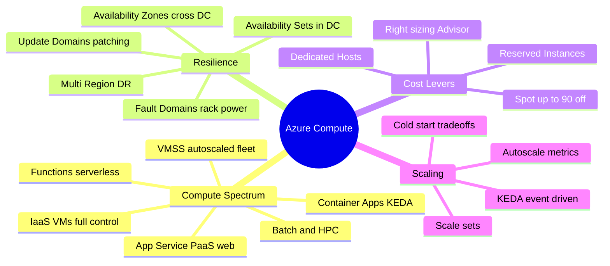
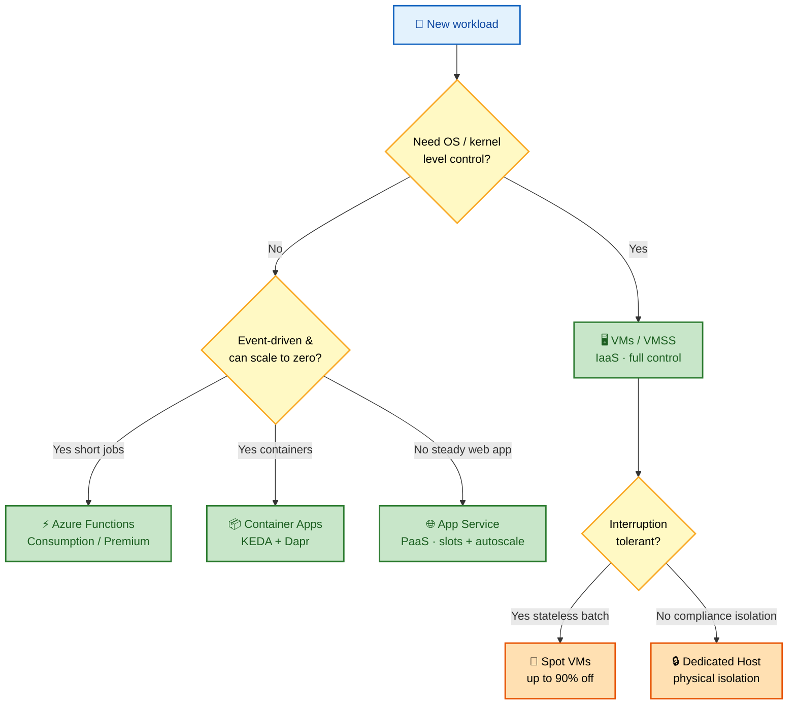
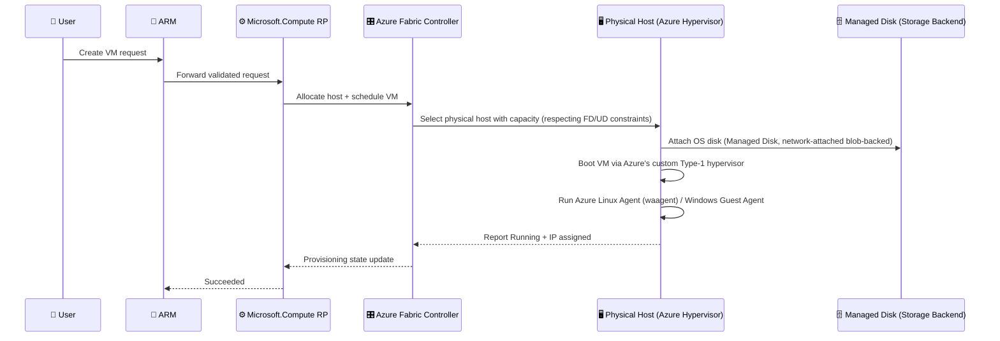
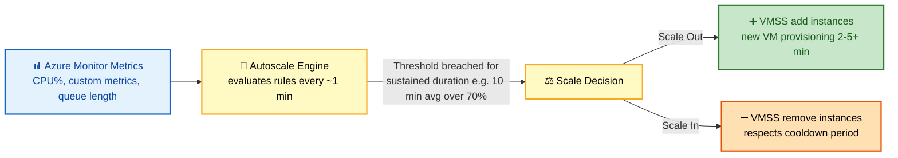

# SECTION 4: AZURE COMPUTE

## 4.1 Concept Overview

**In one line:** Every Azure compute option is a point on one spectrum — from *full control + full ops burden* (IaaS VMs) to *zero infra + constrained runtime* (Functions Consumption) — and the interview tests whether you can place a workload correctly and defend the tradeoff.

Compute is where Azure's shared responsibility model becomes concrete: **below the hypervisor is Microsoft's problem, above it is yours.**

A FAANG interviewer probing this section wants to know whether you understand:
- **Why VMSS autoscaling reacts on a delay** (metric aggregation + sustained-breach windows).
- **What actually happens physically when you provision a VM** (ARM → Compute RP → Fabric Controller → host).
- **When a PaaS compute option (App Service, Functions, Container Apps) is the right call vs. an anti-pattern.**

---

## 🗺️ Visual Overview

**Mind map — the whole section at a glance** (skim first, revisit last):

**Compute decision tree — which service should this workload run on?**

> 🧠 **Memory hooks (mnemonics):**
> - **Compute spectrum:** *"**V**ery **A**ngry **C**ats **F**ight"* → **V**Ms → **A**pp Service → **C**ontainer Apps → **F**unctions (most control → least infra).
> - **FD vs UD:** **F**ault = **F**ailure (power/network dies now); **U**pdate = **U**pgrade (planned patch reboot). Availability Sets spread across *both*.
> - **Spot rule:** "Spot = *stateless, save, survive eviction*." Never put stateful/latency-critical paths on Spot without redrive.
> - **Availability Set vs Zone:** Set protects against *rack* failure (in one datacenter); Zone protects against *datacenter* failure. Zones > Sets for serious SLAs.
> - **Scale-to-zero:** only **Functions (Consumption)** and **Container Apps** truly scale to zero — the price is **cold starts**. Steady traffic → App Service/Premium.

---

## 4.2 Architecture

### Hypervisor & VM Provisioning Flow

**In one line:** A VM request flows `ARM → Compute RP → Fabric Controller → physical host`, where the Fabric Controller picks a host respecting Fault/Update Domain constraints and attaches a network-backed Managed Disk.

**Key internal facts:**
- Azure's hypervisor is a custom, heavily modified Hyper-V derivative (the "Azure Hypervisor"), further hardened on newer hardware via the **Azure Boost** (offloading network/storage virtualization to dedicated hardware/FPGA, analogous conceptually to AWS Nitro) — reducing "noisy neighbor" and virtualization tax.
- **Fault Domains (FD)** = groups of hardware sharing a common power/network source; **Update Domains (UD)** = groups that Microsoft patches/reboots together, never all at once. Availability Sets spread VMs across both; Availability Zones are a coarser-grained version spanning entire physically-separate datacenters.
- Managed Disks are network-attached (backed by Azure Storage blob infrastructure under the hood, abstracted away from the user) — this is why VM-to-disk latency, while low, is not truly "local" the way an on-prem direct-attached disk is (relevant for latency-sensitive database workloads, motivating options like Ultra Disk or Premium SSD v2 with configurable IOPS/throughput independent of disk size).

### VMSS Autoscaling Internals

**Why autoscaling reacts "late":** metrics are aggregated over a time grain (commonly 1-5 minutes) and a scale rule requires the *average over a sustained duration* to breach a threshold before triggering — this is deliberate, preventing flapping from short transient spikes, but means a sudden traffic surge (e.g., a flash sale) can outpace reactive autoscaling, motivating **predictive autoscaling** (Azure Monitor's forecast-based scaling) or pre-provisioned scale-out for known traffic patterns.

> ⚠️ **Gotcha:** The delay is *deliberate* (anti-flapping), not a bug. If asked "why did we drop requests during the surge?", the answer is the metric-aggregation + sustained-breach window + VM boot time stack up to minutes — fix with scheduled/predictive scaling, not by chasing the metric interval alone.

## 4.3 Core Components

### Virtual Machines & VMSS
VMs are the IaaS baseline. **VMSS (Virtual Machine Scale Sets)** manage a fleet of identical (or, with Flexible orchestration mode, heterogeneous) VM instances behind a Load Balancer, with built-in autoscaling. **Flexible orchestration mode** (current default/recommended) allows mixing VM sizes/Spot+Regular within one scale set and provides per-VM control closer to standalone VMs, vs. legacy **Uniform mode**.

### Availability Sets vs. Availability Zones vs. Regions
| | Availability Set | Availability Zone | Multi-Region |
|---|---|---|---|
| Granularity | Rack-level (FD/UD) within one datacenter | Entire separate datacenter within a region | Separate geography |
| SLA (VM, all instances Premium/Ultra disk) | 99.95% | 99.99% | Customer-architected |
| Latency between instances | Very low | Low (single-digit ms) | Higher (10s-100s ms) |
| Protects against | Rack/host failure | Datacenter-level failure (power, fire, flood) | Regional disaster |

### Spot VMs & Dedicated Hosts
- **Spot VMs:** up to ~90% discount, using Azure's unused capacity — can be evicted with as little as 30 seconds' notice (via Scheduled Events) when Azure needs the capacity back or the Spot price exceeds your max price. Ideal for stateless batch/CI workers, never for stateful/latency-sensitive production paths without robust eviction handling.
- **Dedicated Hosts:** a physical server allocated solely to your subscription — used for strict compliance (data residency/isolation at the hardware level) or licensing requirements (e.g., BYOL scenarios needing physical core visibility).

### App Services, Functions, Container Apps, Service Fabric, Batch
- **App Service:** managed PaaS for web apps/APIs (built-in deployment slots, auto-scale, no OS management) — best when you have a standard web workload without needing custom OS/kernel-level control.
- **Azure Functions:** event-driven, serverless compute. **Consumption plan** (true scale-to-zero, per-execution billing, cold start latency) vs. **Premium plan** (pre-warmed instances, VNet integration, no cold start) vs. **Dedicated/App Service plan** (runs on your own always-on App Service Plan).
- **Container Apps:** built on **KEDA** (event-driven autoscaling, including scale-to-zero) + **Dapr** (optional sidecar for service-to-service invocation, pub/sub, state management) + **Envoy**-based ingress, running on a managed Kubernetes/Service Fabric substrate you never directly manage — positioned as the "serverless containers, less complexity than AKS" middle ground.
- **Service Fabric:** Microsoft's original microservices orchestration platform (predates broad Kubernetes adoption) — still used for legacy stateful microservices (Reliable Actors/Reliable Collections) but AKS is the default recommendation for new workloads today.
- **Azure Batch:** large-scale parallel/HPC job scheduling (render farms, Monte Carlo simulations) — auto-provisions and tears down a pool of compute nodes per job.

## 4.4 Real-World Use Cases

1. A media company uses **Spot VMSS** for its video-transcoding fleet, saving ~80% on compute by designing the job queue (Service Bus) to redrive interrupted jobs to a new Spot instance after eviction.
2. A fintech firm uses **Dedicated Hosts** in a specific region to satisfy a regulator's "physical hardware isolation" requirement.
3. A SaaS company migrates a monolith's background-job processing from an always-on VM to **Azure Functions Premium plan**, cutting idle-time cost while retaining VNet integration for private database access.
4. A retailer uses **Container Apps with KEDA scale rules on Service Bus queue length** to handle Black Friday order-processing bursts without managing a full AKS cluster for a workload with predictable event-driven scaling needs.

## 4.5 Important Azure Services
`Virtual Machines` · `Virtual Machine Scale Sets` · `Availability Sets/Zones` · `Azure Spot VMs` · `Azure Dedicated Host` · `App Service` · `Azure Functions` · `Azure Container Apps` · `Service Fabric` · `Azure Batch` · `Azure Compute Gallery (Shared Image Gallery)`

## 4.6 Common / Advanced / FAANG-Level Interview Questions

1. **Q: What's the practical difference between an Availability Set and Availability Zones?**
   **A:** Availability Set spreads VMs across Fault/Update Domains *within a single datacenter* (protects against rack/host/power failure and correlated patching). Availability Zones spread VMs across *physically separate datacenters* within a region (protects against a full datacenter-level disaster) — a strictly stronger guarantee, at the cost of slightly higher inter-instance latency; zones also carry a higher SLA (99.99% vs 99.95%).

2. **Q: Why would VMSS Flexible orchestration mode be preferred over Uniform mode today?**
   **A:** Flexible mode allows heterogeneous VM sizes and mixing Spot + Regular instances in the same scale set, supports Availability Zone spreading with per-VM control similar to standalone VMs, and is Microsoft's current recommended default — Uniform mode is largely legacy for cases needing strict identical-instance semantics.

3. **Q: A Spot VM workload is failing unpredictably. What's your first troubleshooting step?**
   **A:** Check **Scheduled Events** (VM metadata endpoint `169.254.169.254/metadata/scheduledevents`) for eviction notices, and check `az vm list --query "[?priority=='Spot']"` eviction history/policy — Spot evictions are the most common root cause of "unpredictable" Spot workload failures, and the eviction policy (Deallocate vs Delete) determines recovery behavior.

4. **Q: Design a cost-optimal compute strategy for a workload with a predictable daily traffic pattern (high 9am-6pm, near-zero overnight).**
   **A:** Combine a small baseline of Reserved Instance-covered VMSS capacity for the always-on floor with autoscale rules scaling out via Spot instances during the predictable daytime peak (accepting eviction risk since the workload is stateless/queue-driven), and consider Azure Functions Premium/Container Apps with KEDA for any portion of the workload that's genuinely event-driven rather than constantly running — combined with a scheduled autoscale profile (time-based, not just metric-based) since the pattern is *known* in advance rather than purely reactive.

5. **Q: Why does Azure Boost (or AWS Nitro-equivalent hardware offload) matter for VM performance consistency?**
   **A:** Offloading network/storage virtualization from the hypervisor's software path to dedicated hardware (FPGA/ASIC) reduces "noisy neighbor" CPU steal time and gives more consistent, higher-throughput I/O — directly relevant when justifying a newer VM generation/series for latency-sensitive workloads during a technical deep-dive.

## 4.7 Troubleshooting Scenarios

**Scenario — VMSS fails to scale out during a traffic spike**
- *Symptom:* CPU alert fires, but new instances take 5+ minutes to become "Ready" and start serving traffic, causing a service degradation window.
- *Investigation:* Check VMSS scale-out activity log timestamps vs. actual instance "Running" + health-probe-passing timestamps; check custom extension/init script duration on new instances.
- *Root Cause:* Autoscale correctly triggered, but VM provisioning + boot + custom extension (app deployment, config pull) took several minutes — the metric-based reactive model has an inherent latency floor.
- *Fix:* Use a pre-baked (Azure Compute Gallery) image with the application pre-installed rather than post-boot configuration scripts, and tune scale-out threshold to trigger earlier (lower CPU% threshold, shorter sustained-duration window) to compensate for provisioning lead time.
- *Prevention:* Load-test scale-out latency ahead of known traffic events (product launches) and pre-scale via a scheduled autoscale profile rather than relying purely on reactive metrics.

## 4.8 Production Best Practices & Security
- Use Azure Compute Gallery (Shared Image Gallery) for golden/hardened images instead of post-boot configuration for faster, more consistent scale-out.
- Disable public IP on VM NICs by default; use Azure Bastion for management access.
- For Spot workloads, always implement idempotent, resumable job processing (queue-based) to handle evictions gracefully.

## 4.9 Cost Optimization
- Reserved Instances / Savings Plans for steady-state baseline compute (up to ~72% discount for 3-year commit).
- Spot VMs for interruption-tolerant batch/CI workloads.
- Right-size using Azure Advisor's VM right-sizing recommendations — a very common, low-effort cost win.

## 4.10 Microsoft Documentation Links
- [Virtual Machines overview](https://learn.microsoft.com/en-us/azure/virtual-machines/overview)
- [Virtual Machine Scale Sets overview](https://learn.microsoft.com/en-us/azure/virtual-machine-scale-sets/overview)
- [Availability options for VMs](https://learn.microsoft.com/en-us/azure/virtual-machines/availability)
- [Azure Spot Virtual Machines](https://learn.microsoft.com/en-us/azure/virtual-machines/spot-vms)
- [Azure Functions hosting options](https://learn.microsoft.com/en-us/azure/azure-functions/functions-scale)
- [Azure Container Apps overview](https://learn.microsoft.com/en-us/azure/container-apps/overview)

## 4.11 Comparison with AWS/GCP
| Concept | Azure | AWS | GCP |
|---|---|---|---|
| IaaS VM | Virtual Machines | EC2 | Compute Engine |
| Autoscaled VM fleet | VMSS | Auto Scaling Group | Managed Instance Group |
| Interruptible cheap compute | Spot VMs | Spot Instances | Spot VMs |
| Serverless functions | Azure Functions | Lambda | Cloud Functions / Cloud Run |
| Serverless containers | Container Apps | Fargate / App Runner | Cloud Run |
| PaaS web hosting | App Service | Elastic Beanstalk | App Engine |

---

*Continue to [05-STORAGE.md](./05-STORAGE.md) for Section 5 (Azure Storage).*
