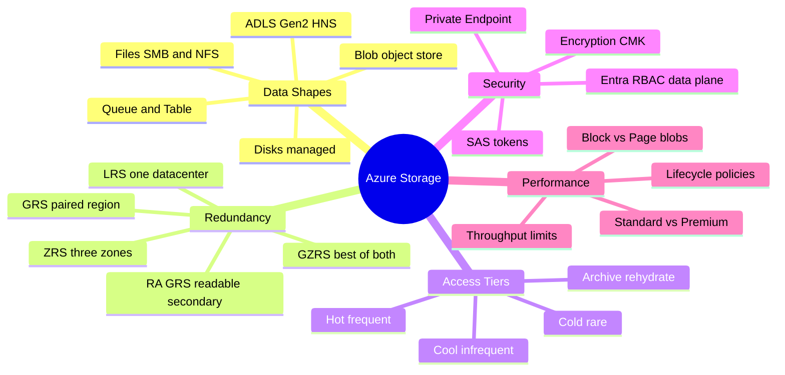
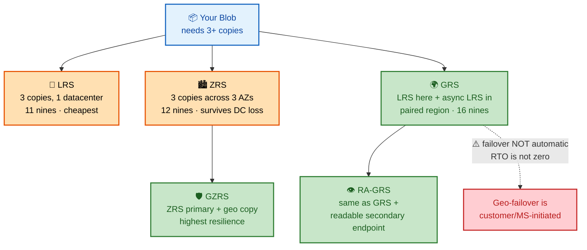
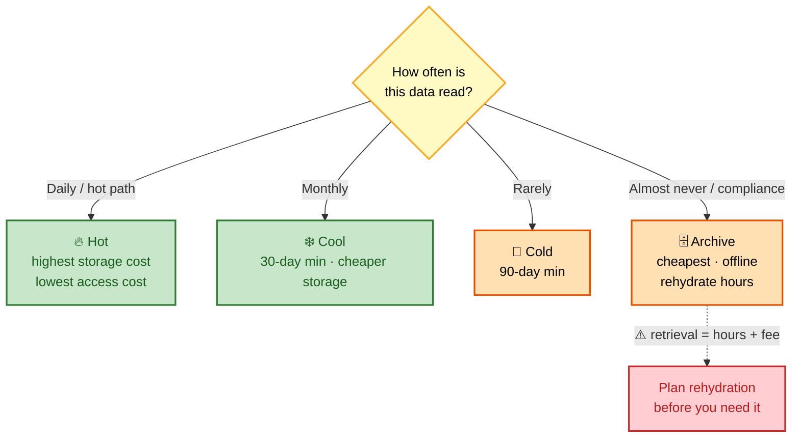
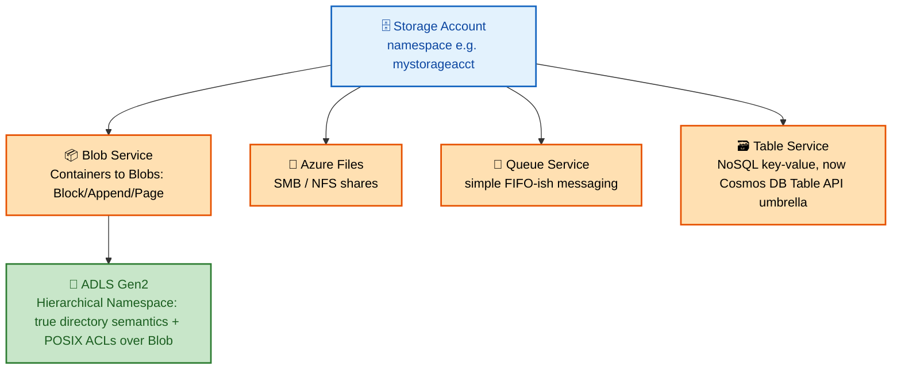

# SECTION 5: AZURE STORAGE

## 5.1 Concept Overview

**In one line:** Storage interviews probe two things — **durability math** (what a replication tier actually guarantees and how it fails) and **the right service for the right data shape** (blob vs. file vs. queue vs. table vs. Data Lake).

FAANG interviewers frequently ask you to **justify a replication tier choice against an RTO/RPO requirement** rather than just naming the tiers.

> 💡 **Interview tip:** Always separate *durability* (will my data still exist?) from *availability* (can I read it right now?). A GRS account can have 16-nines durability yet still be briefly unreadable during a regional failover — because GRS failover is **not automatic**.

## 🗺️ Visual Overview

**Mind map — the whole section at a glance** (skim first, revisit last):

**Storage redundancy — where do my copies physically live?** (the durability question interviewers love):

**Access tier decision — cost vs. retrieval latency:**

> 🧠 **Memory hooks (mnemonics):**
> - **Redundancy ladder:** *"**L**ocal **Z**one **G**eo"* → **LRS** (one building) → **ZRS** (one city, 3 zones) → **GRS** (two cities). More letters left-to-right = more distance covered.
> - **Nines climb:** LRS **11** → ZRS **12** → GRS/GZRS **16**. "Add a zone, add a nine; add a region, add four."
> - **Durability ≠ availability:** GRS gives you 16-nines *durability* but failover is **manual** — availability can still dip. Say this proactively in interviews.
> - **Tier ladder:** *Hot → Cool → Cold → Archive* = cheaper to store, pricier + slower to read. Archive is **offline** (rehydrate in hours).
> - **ADLS Gen2 = Blob + HNS** — not a separate product. Hierarchical Namespace adds real directories + POSIX ACLs + atomic rename for analytics.
> - **SAS vs RBAC:** prefer **Entra RBAC** on the data plane; use **SAS tokens** only for scoped, time-boxed, external sharing.

## 5.2 Architecture — Storage Account Object Model

**Key internal fact — ADLS Gen2:** it is NOT a separate storage system; it's Blob Storage with **Hierarchical Namespace (HNS)** enabled, which changes the underlying metadata layer from a flat blob-name-as-path illusion to actual directory objects supporting atomic rename/move and POSIX-style ACLs — critical for big-data/analytics engines (Spark/Databricks) that need efficient directory-level operations.

## 5.3 Core Components — Replication Models & Durability

| Tier | Copies | Scope | Durability | Use Case |
|---|---|---|---|---|
| **LRS** (Locally Redundant) | 3 copies | Single datacenter | 11 nines (99.999999999%) annual | Cheapest; no protection against datacenter loss |
| **ZRS** (Zone Redundant) | 3 copies | 3 Availability Zones in-region | 12 nines | Protects against datacenter failure, same region |
| **GRS** (Geo-Redundant) | 3 + 3 copies | Primary region (LRS) + async replicated to paired region (LRS) | 16 nines | DR against regional disaster; secondary NOT readable by default |
| **RA-GRS** (Read-Access GRS) | Same as GRS | Same as GRS | 16 nines | Adds a read-only endpoint on the secondary region for read availability during primary outage |
| **GZRS / RA-GZRS** | ZRS in primary + geo-replicated | Best of both | Highest | ZRS-level regional resilience + geo-DR |

**Durability vs. Availability — the distinction interviewers probe:** durability (11-16 nines) is about the probability data is *not lost*; availability (99.9-99.99% SLA depending on tier/access pattern) is about the probability the service *responds successfully to a request right now*. A GRS account can have "16 nines durability" while still experiencing an availability blip during regional failover, because **geo-failover to the secondary region is not automatic** for standard GRS (requires either a customer-initiated or Microsoft-initiated failover, introducing an RTO that is NOT zero) — a very common misconception to correct in an interview.

## 5.4 Real-World Use Cases
1. A media archive uses **LRS + Lifecycle Management** (auto-tier Hot→Cool→Archive after 30/90 days) to cut storage cost ~80% for rarely-accessed video assets.
2. A regulated bank uses **RA-GZRS** for transaction logs, giving both intra-region zone resilience and cross-region DR with a readable secondary for reporting workloads.
3. A data platform uses **ADLS Gen2 with HNS** as the backing store for a Databricks/Synapse lakehouse, relying on POSIX ACLs for fine-grained folder-level access control per business unit.
4. A lift-and-shift migration uses **Azure Files (SMB)** as a drop-in replacement for an on-prem file server, mounted via Azure File Sync for hybrid caching at branch offices.

## 5.5 Common / Advanced Interview Questions

1. **Q: Does GRS provide automatic failover?**
   **A:** No — standard GRS/RA-GRS failover to the secondary region is a manual (or Microsoft-initiated, in a true regional-loss disaster) operation, introducing a real RTO. If you need automatic failover, you must architect it at the application layer or use RA-GRS's read-only secondary endpoint proactively for read-path resilience, not blind assumption of instant write failover.

2. **Q: What's the actual technical difference between Blob Storage and ADLS Gen2?**
   **A:** ADLS Gen2 is Blob Storage with Hierarchical Namespace enabled — it adds true directory objects (atomic rename/delete of a "folder"), POSIX-compliant ACLs, and better performance characteristics for big-data analytics workloads that do heavy directory-listing/rename operations — it is not a separate storage engine.

3. **Q: When would you choose Table Storage over Cosmos DB's native API?**
   **A:** Table Storage (now largely superseded in messaging by "Cosmos DB for Table API") is appropriate for extremely simple, cost-sensitive key-value workloads without a need for guaranteed low-latency global distribution, multiple consistency levels, or secondary indexes — Cosmos DB is the answer whenever global distribution, tunable consistency, or richer querying is required.

4. **Q: How would you design lifecycle management for a workload where data is hot for 7 days, warm for 90 days, and then compliance-archived for 7 years?**
   **A:** A Lifecycle Management policy: Hot tier for 0-7 days, auto-transition to Cool at day 7, auto-transition to Archive at day 90, with a **immutability policy (WORM — Write Once Read Many)** applied for the compliance-archive period to satisfy regulatory retention requirements (preventing deletion/modification even by an Owner-role principal until the retention period expires).

## 5.6 Troubleshooting Scenarios

**Scenario — Unexpected storage costs after enabling lifecycle management**
- *Symptom:* Bill spikes after moving data to Archive tier.
- *Investigation:* Check for frequent **rehydration** operations (`az storage blob show` for `archiveStatus`) — Archive tier data must be rehydrated (hours-long operation) before it's readable, and rehydration + early-deletion penalties (minimum retention charges) are common surprise costs.
- *Root Cause:* Application/users were accessing "archived" data more often than the lifecycle design assumed, triggering costly rehydrations and early-deletion fees.
- *Fix:* Re-evaluate access patterns before setting the Archive transition threshold; consider Cool tier instead if access is infrequent-but-not-negligible.
- *Prevention:* Model actual access-pattern telemetry before committing to aggressive tiering policies.

## 5.7 Production Best Practices & Cost Optimization
- Enable Soft Delete + versioning on Blob containers holding critical data as protection against accidental/malicious deletion.
- Use Lifecycle Management policies driven by actual access telemetry, not guesses.
- For ADLS Gen2 analytics workloads, partition data thoughtfully (e.g., by date) to optimize query engine (Spark/Synapse) performance and cost.

## 5.8 Microsoft Documentation Links
- [Azure Storage redundancy](https://learn.microsoft.com/en-us/azure/storage/common/storage-redundancy)
- [Introduction to Azure Data Lake Storage Gen2](https://learn.microsoft.com/en-us/azure/storage/blobs/data-lake-storage-introduction)
- [Blob storage lifecycle management](https://learn.microsoft.com/en-us/azure/storage/blobs/lifecycle-management-overview)
- [Azure Files overview](https://learn.microsoft.com/en-us/azure/storage/files/storage-files-introduction)

## 5.9 Comparison with AWS/GCP
| Concept | Azure | AWS | GCP |
|---|---|---|---|
| Object storage | Blob Storage | S3 | Cloud Storage |
| Analytics-optimized object storage | ADLS Gen2 (HNS) | S3 + Lake Formation | Cloud Storage (flat, no native HNS equivalent) |
| Managed file shares | Azure Files | EFS / FSx | Filestore |
| Geo-redundant storage | GRS/RA-GRS/GZRS | S3 Cross-Region Replication | Multi-region buckets |

---

*Continue to [06-AKS-DEEP-DIVE.md](./06-AKS-DEEP-DIVE.md) for Section 6 (AKS — Extremely Detailed).*
