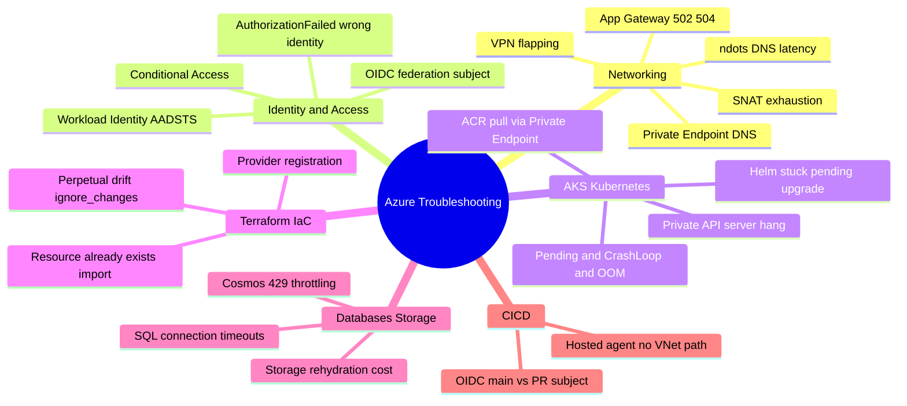
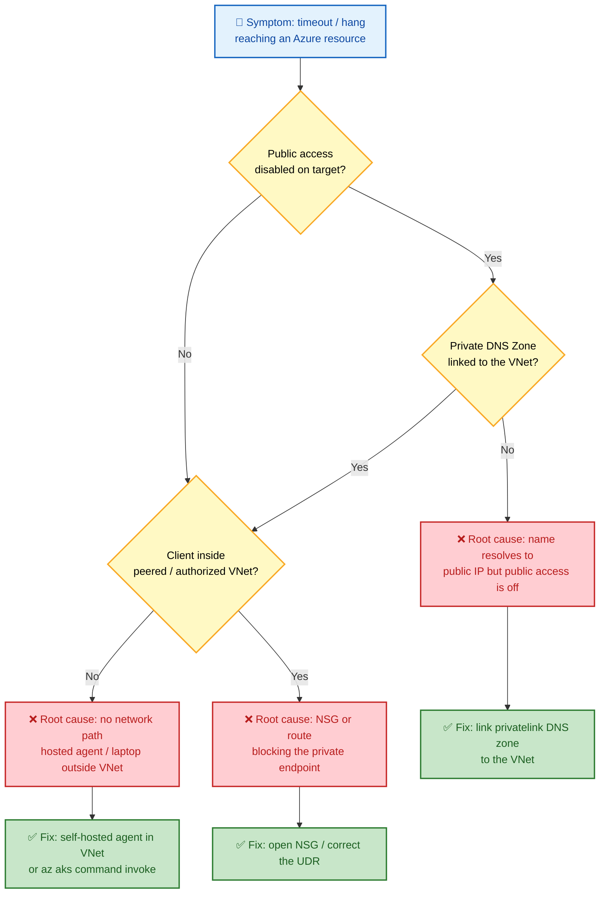
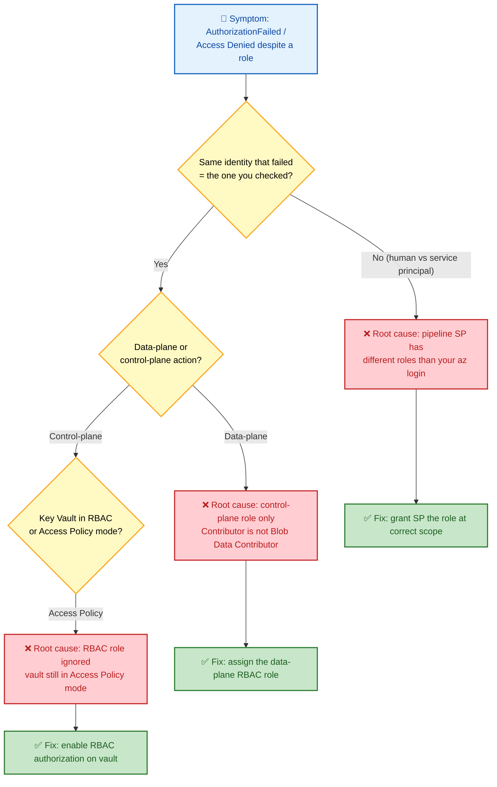

# SECTION 16: AZURE TROUBLESHOOTING MASTERCLASS

> This section curates real-world Azure troubleshooting scenarios across every domain covered so far. Scenarios follow: **Symptom → Investigation → Azure CLI Commands → Root Cause → Fix → Prevention.** Fully expanded scenarios are given for the highest-value/most-tested cases; a rapid-fire reference table follows for broader category coverage (150+ combined discrete issues across both formats).

## 🗺️ Visual Overview

**In one line:** troubleshooting Azure is pattern-matching a **symptom** to one of a handful of recurring **root causes** (network path, identity/scope, DNS, quota, config drift) and applying the known **fix** — the trees below turn that instinct into a checklist.

**Mind map — the six troubleshooting domains in this file:**

**Decision tree — timeout or hang reaching a private Azure resource** (red = root cause, green = fix):

**Decision tree — `AuthorizationFailed` / `Access Denied` despite having "a role"** (red = root cause, green = fix):

> 🧠 **Memory hooks (mnemonics):**
> - **Triage order:** *"Scope, Path, Name, Quota, Drift"* → check identity **Scope** → network **Path** → DNS **Name** resolution → **Quota** limits → config **Drift**.
> - **Private-anything hang** = **DNS + network path** almost every time (Private Endpoint resolves public IP, or no route into the VNet).
> - **AuthorizationFailed** = **"whose identity?"** — the pipeline SP ≠ your interactive `az login`. Always re-check per-identity.
> - **RBAC two layers:** control-plane (`Contributor`) ≠ data-plane (`Storage Blob Data Contributor`). Both must be granted.
> - **Control-plane "Succeeded" ≠ healthy** — ARM success only means the resource was *created*, not that data-plane traffic flows.

---

## 16.1 Networking

**In one line:** networking failures are almost always a **broken path** (SNAT, route, NSG) or a **broken name** (Private DNS) — isolate which before touching anything.

**1. Intermittent outbound failures under load (SNAT exhaustion)** — *(fully covered in Section 3.10, Scenario 1)*

**2. On-prem can't resolve Private Endpoint IP** — *(Section 3.10, Scenario 2)*

**3. Spoke-to-spoke traffic silently undeliverable** — *(Section 3.10, Scenario 3)*

**4. NSG rule added but traffic still blocked (NIC vs subnet level)** — *(Section 3.10, Scenario 4)*

**5. ExpressRoute "Provisioned" but no traffic flows** — *(Section 3.10, Scenario 5)*

**6. Application Gateway 502/504 despite healthy backend pool**
- **Symptom:** Intermittent 502s under load; backend health probes show "Healthy."
- **Investigation:** `az network application-gateway show-backend-health` for real-time probe state; check backend response time distribution vs. App Gateway's configured request timeout.
- **Root Cause:** Backend P99 latency exceeds App Gateway's idle/request timeout for a subset of slow requests, or backend connection draining during a deployment causing in-flight request drops.
- **Fix:** Increase backend request timeout setting to match realistic P99 latency; ensure rolling deployments respect connection draining before terminating old instances.
- **Prevention:** Load-test with realistic tail-latency distributions, not just average-case load.

**7. VPN Gateway connection flapping (Connected/Not Connected)**
- **Symptom:** `az network vpn-connection show` shows repeated status transitions.
- **Investigation:** Check on-prem device's IKE/IPsec logs for Phase 1/Phase 2 SA renegotiation failures; verify matching encryption/DH group parameters on both ends.
- **Root Cause:** Mismatched IPsec policy parameters (lifetime, DH group) between Azure VPN Gateway and on-prem device causing renegotiation failures.
- **Fix:** Configure a custom IPsec/IKE policy on the Azure VPN Gateway matching the on-prem device's exact parameters.
- **Prevention:** Document and version-control exact IPsec parameters as part of the connectivity runbook.

**8. DNS resolution slow for external hostnames from AKS pods**
- **Symptom:** Elevated latency on first call to any external API from a pod.
- **Investigation:** `kubectl exec <pod> -- cat /etc/resolv.conf` — check `ndots` value and search domains list.
- **Root Cause:** Default `ndots:5` causes the resolver to attempt several internal search-domain-suffixed lookups before trying the FQDN as-is, multiplying DNS query count for every external call.
- **Fix:** Set pod-level `dnsConfig` with `ndots: "1"` for services making heavy external calls, or fully-qualify hostnames with a trailing dot.
- **Prevention:** Bake appropriate `dnsConfig` into base Helm chart templates for externally-calling services.

## 16.2 Identity & Access

**9. `AADSTS700016` in AKS Workload Identity** — *(Section 2.10, Scenario 1)*

**10. `AADSTS50173` intermittent forced re-auth** — *(Section 2.10, Scenario 2)*

**11. GitHub Actions OIDC `AADSTS70021`** — *(Section 2.10, Scenario 3)*

**12. Conditional Access blocking users post-rollout** — *(Section 2.10, Scenario 4)*

**13. `DefaultAzureCredential` works locally, fails in AKS pod** — *(Section 2.10, Scenario 5)*

**14. Terraform apply fails with `AuthorizationFailed` despite Owner role**
- **Symptom:** `az` CLI works fine but Terraform's service principal gets `AuthorizationFailed`.
- **Investigation:** `az role assignment list --assignee <sp-object-id> --all` to confirm the SP's actual role at the target scope (not the human user's role).
- **Root Cause:** Terraform authenticates as a different identity (the pipeline's service principal) than the human running `az` interactively — role assignments must be checked per-identity, not assumed to match the human operator's access.
- **Fix:** Grant the pipeline's service principal the required role at the correct scope.
- **Prevention:** Always test pipeline permissions using the pipeline's actual identity (e.g., `az login --service-principal`) during setup, not just interactive testing.

## 16.3 AKS / Kubernetes

**15-19: Pending Pods, CrashLoopBackOff, OOMKilled, Image Pull Errors, Node NotReady** — *(fully covered in Section 6.4/6.6, questions 16-20)*

**20. Cluster Autoscaler won't scale down** — *(Section 6.6, question 22)*

**21. API server throttling during CI/CD windows** — *(Section 6.6, question 24)*

**22. NetworkPolicy breaks DNS resolution** — *(Section 6.6, question 25)*

**23. `kubectl` commands hang against a private AKS cluster**
- **Symptom:** Every `kubectl` command times out; no error, just hangs.
- **Investigation:** Verify network path from the client machine to the private API server FQDN (`az aks show --query privateFqdn`); check if running from a machine inside the peered/authorized VNet or via a jumpbox/VPN.
- **Root Cause:** Client machine has no network path to the private API server endpoint (not peered, no VPN, or DNS not resolving the private FQDN correctly).
- **Fix:** Run `kubectl` from a machine within the VNet (or peered network) with correct Private DNS Zone resolution, or use `az aks command invoke` (run-command feature) which proxies through ARM without requiring direct network access.
- **Prevention:** Document approved access paths (jumpbox/Bastion, VPN) for private cluster administration.

**24. Cannot pull image from a Private Endpoint-only ACR**
- **Symptom:** `ImagePullBackOff` with a timeout (not an auth error).
- **Investigation:** Check ACR's networking settings (public access disabled?) and whether the AKS node subnet has a Private Endpoint + Private DNS Zone correctly linked for the ACR's `privatelink.azurecr.io` zone.
- **Root Cause:** Node resolves ACR's public IP (no Private DNS override) but public access is disabled, so the connection is refused/times out.
- **Fix:** Configure a Private DNS Zone link for `privatelink.azurecr.io` on the AKS VNet.
- **Prevention:** Include ACR Private Endpoint + DNS zone linking as a mandatory step in the AKS Landing Zone module, not an optional add-on.

**25. Helm upgrade stuck in "pending-upgrade" state**
- **Symptom:** `helm upgrade` fails; subsequent attempts report a release already in a pending state.
- **Investigation:** `helm history <release>` to see the last failed revision's status.
- **Root Cause:** A previous upgrade was interrupted (pipeline timeout/cancellation) mid-way, leaving Helm's release secret in a stuck intermediate state.
- **Fix:** `helm rollback <release> <last-good-revision>` or, if unrecoverable, manually patch the release Secret's status, then retry.
- **Prevention:** Ensure CI/CD pipeline timeouts are longer than expected Helm operation duration, and use `--atomic --timeout` flags so failed upgrades auto-rollback cleanly.

## 16.4 Terraform / IaC

**26. `Error: A resource with the ID already exists`** — *(Section 8.6)*

**27. `MissingSubscriptionRegistration`** — *(Section 1.9, Scenario 1)*

**28. `ScopeLocked` on destroy** — *(Section 1.9, Scenario 2)*

**29. Portal succeeds, Terraform fails (API version mismatch)** — *(Section 1.9, Scenario 3)*

**30. Terraform plan shows unexpected drift on every run**
- **Symptom:** Every `plan` shows a diff on the same attribute even though nobody changed it.
- **Investigation:** Check if the attribute is managed by another Azure control plane process (e.g., AKS auto-updating a node pool's `orchestrator_version` during a scheduled auto-upgrade channel).
- **Root Cause:** An out-of-band Azure-native process (auto-upgrade, Cluster Autoscaler, Defender auto-provisioning) legitimately changes a value Terraform also tracks, causing perpetual drift.
- **Fix:** Add the attribute to `lifecycle { ignore_changes = [...] }`.
- **Prevention:** Identify all auto-managed attributes for a given resource type during initial module design, not reactively after drift complaints.

## 16.5 Databases & Storage

**31. Cosmos DB 429s during a traffic spike** — *(Section 13.6)*

**32. Storage lifecycle rehydration cost spike** — *(Section 5.6)*

**33. Azure SQL connection timeouts under load**
- **Symptom:** Intermittent `SqlException: Timeout expired` from the application tier.
- **Investigation:** Check DTU/vCore utilization and `sys.dm_exec_requests` for blocking sessions; check connection pool exhaustion on the application side.
- **Root Cause:** Either genuine compute/IO saturation (undersized tier) or application-side connection leaks (not returning connections to the pool) exhausting the max connection limit.
- **Fix:** Scale up tier if genuinely saturated; fix connection leak (ensure `using`/dispose patterns) if pool exhaustion is the cause.
- **Prevention:** Monitor `sys.dm_db_resource_stats` and connection pool metrics proactively, alerting before saturation causes user-facing timeouts.

## 16.6 CI/CD

**34. Azure DevOps pipeline can't reach a private AKS cluster**
- **Symptom:** Deployment step times out connecting to the cluster's private API server.
- **Investigation:** Confirm whether the pipeline uses a Microsoft-hosted agent (no VNet access) vs. a self-hosted agent inside the peered VNet.
- **Root Cause:** Microsoft-hosted agents have no network path into a private VNet by default.
- **Fix:** Use a self-hosted agent deployed inside (or VNet-peered to) the AKS cluster's network, or use `az aks command invoke` (ARM-proxied, no direct network path needed) as an alternative deployment mechanism.
- **Prevention:** Document this constraint explicitly in the platform's AKS onboarding guide — a very common first-time private-cluster CI/CD surprise.

**35. GitHub Actions OIDC federation works for `main` but not for PR builds**
- **Symptom:** PR-triggered workflow fails Azure login; main-branch workflow succeeds.
- **Investigation:** Compare the Federated Credential's configured subject pattern against the actual `sub` claim for a PR-triggered token (`repo:org/repo:pull_request` vs. `repo:org/repo:ref:refs/heads/main`).
- **Root Cause:** Federated Credential only configured for the `main` branch subject pattern; PR context produces a different subject claim not covered.
- **Fix:** Add an additional Federated Credential for the PR subject pattern, scoped to a read-only/lower-privilege identity (never grant PR builds the same production access as main).
- **Prevention:** Map out every required trigger context (branch, PR, tag, environment) during initial OIDC setup rather than discovering gaps reactively.

## 16.7 Rapid-Fire Reference Table (Broader Coverage)

| # | Symptom | Likely Root Cause | First Command to Run |
|---|---|---|---|
| 36 | VM fails to boot after resize | Incompatible VM size for the existing disk/region SKU availability | `az vm get-instance-view` |
| 37 | "Insufficient regional vCPU quota" on deploy | Subscription's regional quota exhausted | `az vm list-usage --location <region>` |
| 38 | Managed Disk stuck "Attaching" | Previous VM dealloc didn't fully release the disk lease | `az disk show --query diskState` |
| 39 | Front Door returns 502 for a healthy origin | Origin group health probe path misconfigured | `az afd origin show` |
| 40 | Key Vault "Access Denied" despite RBAC role assigned | Vault still in legacy Access Policy mode, not RBAC mode | `az keyvault show --query properties.enableRbacAuthorization` |
| 41 | Storage account "AuthorizationPermissionMismatch" | Data-plane RBAC role missing (Contributor ≠ Storage Blob Data Contributor) | `az role assignment list --scope <storage-id>` |
| 42 | AKS node pool upgrade stuck | PodDisruptionBudget blocking drain of a node | `kubectl get pdb -A` |
| 43 | ACR image push fails intermittently | Registry throttling under high concurrent push volume | `az acr check-health` |
| 44 | Log Analytics query timing out | Query scanning too large a time range/table without filtering early | Add time filter first in KQL `where` clause |
| 45 | Budget alert not firing | Action Group misconfigured or email/webhook target invalid | `az consumption budget show` |
| 46 | Azure Policy assignment not enforcing | Policy assigned at wrong scope, or resource created before assignment (needs remediation task) | `az policy state list` |
| 47 | Bicep deployment "InvalidTemplate" | API version mismatch for a preview feature | `az provider show` for supported apiVersions |
| 48 | Function App cold-start latency complaints | Consumption plan (no pre-warmed instances) under sporadic traffic | Switch to Premium plan or enable "Always On" (Dedicated plan) |
| 49 | Traffic Manager not failing over | DNS TTL too high, or endpoint monitoring config using wrong health-check path | `az network traffic-manager endpoint show` |
| 50 | NAT Gateway not reducing SNAT exhaustion | NAT Gateway not actually associated with the affected subnet | `az network vnet subnet show --query natGateway` |

## 16.8 General Troubleshooting Methodology (Apply Across All Domains)

**In one line:** scope it → check the Activity Log → separate control-plane from data-plane → use Azure's own diagnostics → close with an *owned* prevention item.

1. **Reproduce and scope:** is it constant or intermittent? One instance or fleet-wide? Correlate with a deployment/config-change timeline.
2. **Check the Activity Log first** for any control-plane change (`az monitor activity-log list`) before assuming an application bug.
3. **Separate control-plane symptoms from data-plane symptoms** — e.g., ARM reporting "Succeeded" doesn't guarantee data-plane health.
4. **Use the platform's own diagnostic tooling** (Network Watcher, `az aks command invoke`, Container Insights) before reaching for generic debugging.
5. **Document the RCA and add a specific, owned prevention action item** — a fix without a prevention step is a recurring incident waiting to happen.

> 💡 **Interview tip:** When asked "how would you debug X," narrate this exact ladder out loud — *scope → Activity Log → control vs data plane → native tooling → RCA + prevention*. Showing a **method** beats naming a lucky command.

---

*Continue to [13-FAANG-BEHAVIORAL.md](./13-FAANG-BEHAVIORAL.md) for Sections 17-18 (FAANG Interview Rounds, Behavioral & Leadership).*
