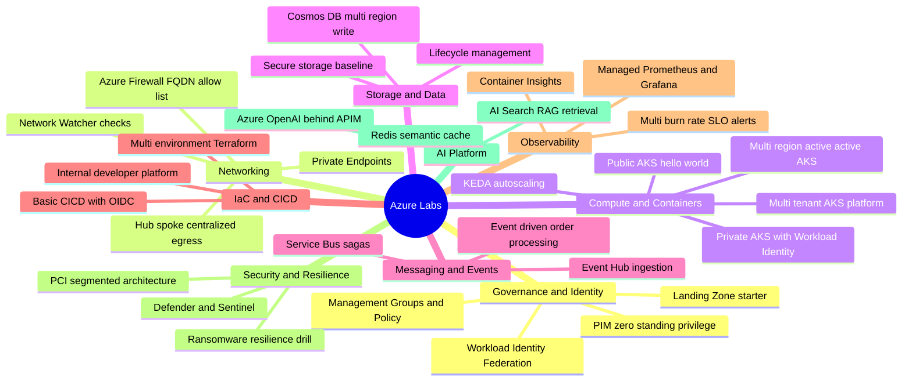
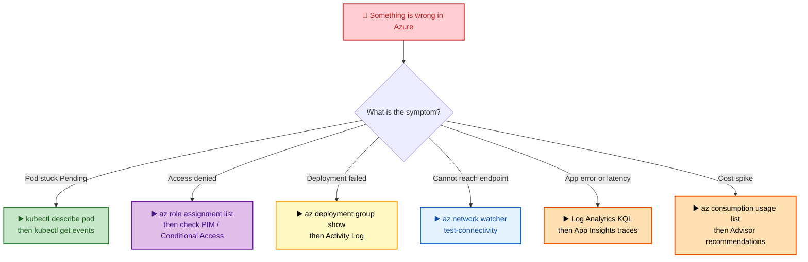

# SECTION 19: HANDS-ON LABS

> Individual per-topic labs already appear at the end of each section (1.16, 2.17, 3.17, 4-14 embedded labs). This section provides larger, portfolio-worthy **project-based** labs spanning multiple topics, organized by difficulty.

## 🗺️ Visual Overview

**Lab map — every project grouped by Azure service area** (skim this first, pick a project, then jump to its difficulty tier below):

**Troubleshooting triage — symptom to first Azure command** (start here when a lab breaks):

> 🧠 **Memory hooks (go-to Azure CLI commands):**
> - **Sign in & scope** — `az login` → `az account set --subscription `. Always confirm the active subscription before you provision.
> - **Group & inspect** — `az group create -n <RG> -l <REGION>` and `az resource list -g <RG> -o table` to see everything you created.
> - **AKS creds** — `az aks get-credentials -g <RG> -n <CLUSTER>` merges the kubeconfig; then everything is `kubectl`.
> - **Deploy IaC** — `az deployment group create -g <RG> --template-file main.bicep` (Bicep/ARM) or `terraform plan` → `terraform apply` (Terraform).
> - **Triage fast** — `kubectl get pods -A`, `kubectl describe pod 
`, and `az monitor activity-log list` are your first three moves when anything breaks.

> 💡 **Tip:** Reading these labs is not the same as doing them. The muscle memory that makes you calm in an interview only comes from actually running the commands in a throwaway subscription or resource group you can `az group delete` afterward.

---

## 19.1 Beginner Projects

### 1. Landing Zone Starter Kit *(Sections 1, 8)*
- **Objective:** Stand up a minimal, governed Azure Landing Zone foundation.
- **Setup:** Owner/Contributor at a management-group scope; Terraform installed and authenticated.
- **Tasks:**
  - Build a Management Groups hierarchy.
  - Assign a Policy initiative enforcing mandatory tags and approved regions.
  - Onboard a single subscription via a basic Terraform module.
- **Expected outcome:** A subscription that inherits governance policy from the management-group hierarchy, provisioned entirely as code.

### 2. Public AKS "Hello World" Platform *(Sections 6, 11)*
- **Objective:** Deploy your first AKS cluster and expose a workload with basic observability.
- **Setup:** A resource group and the Azure CLI (`az aks get-credentials` for kubeconfig).
- **Tasks:**
  - Deploy a public AKS cluster.
  - Expose a sample app via a `LoadBalancer` Service.
  - Add Container Insights for basic observability.
- **Expected outcome:** A reachable public endpoint serving the sample app, with pod/node metrics flowing into Container Insights.

### 3. Secure Storage Baseline *(Section 5)*
- **Objective:** Configure a Storage Account to a secure-by-default baseline.
- **Setup:** A VNet/subnet for the Private Endpoint and a resource group.
- **Tasks:**
  - Create a Storage Account with a Private Endpoint.
  - Disable public network access.
  - Add a lifecycle management policy and enable Soft Delete.
- **Expected outcome:** A Storage Account reachable only over the private network, with tiering/retention and recovery protections in place.

### 4. Basic CI/CD Pipeline *(Sections 2, 10)*
- **Objective:** Deploy infrastructure from CI with zero stored secrets.
- **Setup:** A GitHub repo and an Entra app/federated credential for OIDC.
- **Tasks:**
  - Build a GitHub Actions workflow using OIDC federation (no stored secrets).
  - Deploy a Bicep template to a resource group.
- **Expected outcome:** A pipeline that authenticates to Azure via short-lived OIDC tokens and applies the Bicep template on push.

## 19.2 Intermediate Projects

### 5. Private AKS with Workload Identity *(Sections 2, 6, 14)*
- **Objective:** Run a private cluster where pods reach Azure with zero stored credentials and scale on demand.
- **Setup:** A VNet for the private cluster and a Key Vault holding a test secret.
- **Tasks:**
  - Deploy a private cluster with Azure CNI Overlay.
  - Configure Workload Identity Federation so a pod reads a Key Vault secret with zero stored credentials.
  - Add KEDA scaling a Deployment on Service Bus queue depth.
- **Expected outcome:** A pod that authenticates to Key Vault via federated identity, and a Deployment that scales up/down as queue depth changes.

### 6. Hub-Spoke Network with Centralized Egress *(Section 3)*
- **Objective:** Route all outbound traffic through an inspected, allow-listed central egress point.
- **Setup:** Separate hub and spoke VNets with peering.
- **Tasks:**
  - Deploy a hub VNet with Azure Firewall (FQDN allow-listing).
  - Add a spoke VNet with forced-tunneling UDRs.
  - Add a Private Endpoint for a Storage Account.
  - Verify connectivity with Network Watcher.
- **Expected outcome:** Spoke egress forced through the firewall, only allow-listed FQDNs reachable, and private storage access confirmed by Network Watcher.

### 7. Multi-Environment Terraform Module *(Section 8)*
- **Objective:** Deploy Dev/Staging/Prod from one parameterized module with drift protection.
- **Setup:** Separate state backends per environment.
- **Tasks:**
  - Build a single parameterized module deploying Dev/Staging/Prod with separate state backends.
  - Apply `prevent_destroy` on stateful resources.
  - Add a drift-detection CI job running `terraform plan` on a schedule.
- **Expected outcome:** Three environments from one codebase, protected stateful resources, and a scheduled job that surfaces drift.

### 8. Observability Stack for a Microservices App *(Section 11)*
- **Objective:** Instrument an app end-to-end and alert on SLO burn.
- **Setup:** A sample microservices app deployable to AKS.
- **Tasks:**
  - Instrument an OpenTelemetry sample app on AKS.
  - Wire up Managed Prometheus + Managed Grafana dashboards.
  - Configure a multi-burn-rate SLO alert.
- **Expected outcome:** Traces/metrics visible in Grafana and an SLO alert that fires on fast/slow error-budget burn.

## 19.3 Advanced Projects

### 9. Multi-Tenant AKS Platform *(Section 6)*
- **Objective:** Safely host multiple teams on one cluster with hard isolation guardrails.
- **Setup:** A cluster with Azure RBAC for Kubernetes Authorization enabled.
- **Tasks:**
  - Enforce namespace-per-team isolation.
  - Apply default-deny NetworkPolicies with explicit DNS/API-server egress rules.
  - Add ResourceQuotas.
  - Add Gatekeeper constraints (no privileged pods, approved registries only).
- **Expected outcome:** Teams isolated by namespace and network policy, capped by quota, and blocked from privileged/unapproved workloads at admission.

### 10. Event-Driven Order Processing System *(Section 14, System Design Section 15.7)*
- **Objective:** Build a resilient saga-based order pipeline with high-volume telemetry.
- **Setup:** Service Bus namespace (with Sessions) and an Event Hub.
- **Tasks:**
  - Model a trip/order lifecycle saga on Service Bus Topics with Sessions (with compensating transactions).
  - Ingest high-volume telemetry via Event Hub.
  - Scale consumers with KEDA.
- **Expected outcome:** Ordered, session-based saga processing with compensation on failure, and consumers that scale to ingestion volume.

### 11. Zero-Standing-Privilege Access Model *(Sections 2, 12)*
- **Objective:** Eliminate standing admin access and detect anomalous elevation.
- **Setup:** Entra ID P2 for PIM and a Sentinel workspace.
- **Tasks:**
  - Convert all privileged roles to PIM-eligible (not standing) assignments.
  - Require phishing-resistant MFA for activation via Conditional Access.
  - Add a Sentinel analytics rule alerting on anomalous PIM activation patterns.
- **Expected outcome:** No permanent privileged access; activations gated by strong MFA and monitored for anomalies.

### 12. Ransomware-Resilience Drill *(Section 12)*
- **Objective:** Prove you can recover from a destructive event within a target RTO.
- **Setup:** Azure Backup vault and a customer-managed key (CMK).
- **Tasks:**
  - Configure immutable Azure Backup policies.
  - Document and test a CMK key-revocation runbook.
  - Run a full simulated recovery drill measuring actual RTO against a target.
- **Expected outcome:** Tamper-proof backups and a measured, documented recovery time you can defend in an interview.

## 19.4 Expert Projects

### 13. Full PCI-Style Segmented Architecture *(Sections 3, 12, System Design 15.6)*
- **Objective:** Design a provably-segmented, compliance-grade multi-region network.
- **Setup:** Multi-region hub-spoke topology with Firewall Premium.
- **Tasks:**
  - Enable Firewall Premium with TLS inspection.
  - Build a zero-internet-egress "cardholder data" spoke with Private Endpoints for every dependency.
  - Add a public spoke behind App Gateway + WAF.
  - Validate with a documented threat model proving no path bypasses the firewall.
- **Expected outcome:** A segmented architecture where the sensitive spoke has no internet path and the threat model demonstrates no firewall bypass.

### 14. Multi-Region Active-Active AKS Platform *(System Design 15.10)*
- **Objective:** Serve traffic from multiple regions with automated failover.
- **Setup:** Independent regional AKS clusters and a GitOps controller (Flux/Argo CD).
- **Tasks:**
  - Deploy identical manifests to all regions via GitOps.
  - Use Cosmos DB multi-region write for the data tier.
  - Configure Front Door global load balancing with automated failover drills measuring real RTO.
- **Expected outcome:** Active-active regions kept in sync by GitOps, with global routing that fails over automatically and a measured RTO.

### 15. Complete Internal Developer Platform *(System Design 15.8, Sections 8-10)*
- **Objective:** Give teams self-service infrastructure behind org-wide guardrails.
- **Setup:** A shared Terraform module + pipeline templates.
- **Tasks:**
  - Enable self-service AKS provisioning via a parameterized Terraform module + pipeline trigger.
  - Enforce per-team Key Vault/RBAC isolation.
  - Add KEDA-scaled ephemeral build agents.
  - Enforce org-wide policy-as-code guardrails (mandatory security scan stage, approved base images) via shared pipeline templates.
- **Expected outcome:** Teams self-provision compliant environments in minutes, with isolation and guardrails enforced centrally.

### 16. AI/LLM Platform with RAG *(System Design 15.11)*
- **Objective:** Ship a private, rate-limited retrieval-augmented LLM platform.
- **Setup:** Azure OpenAI Service and Azure AI Search resources.
- **Tasks:**
  - Front Azure OpenAI with API Management (rate limiting, content filtering).
  - Use Azure AI Search for vector-based retrieval augmentation.
  - Add semantic response caching in Redis.
  - Keep all traffic off the public internet with Private Endpoints.
- **Expected outcome:** A governed RAG endpoint with rate limits, content filtering, cache-accelerated responses, and no public network exposure.

---

# SECTION 20: DOCUMENTATION INDEX

> Consolidated, curated list of official Microsoft Learn resources referenced throughout this guide, organized by topic for quick reference during study.

## 20.1 Fundamentals & Governance
- [Azure Regions and Availability Zones](https://learn.microsoft.com/en-us/azure/reliability/availability-zones-overview)
- [Azure Resource Manager Overview](https://learn.microsoft.com/en-us/azure/azure-resource-manager/management/overview)
- [Azure Policy Overview](https://learn.microsoft.com/en-us/azure/governance/policy/overview)
- [Cloud Adoption Framework — Landing Zones](https://learn.microsoft.com/en-us/azure/cloud-adoption-framework/ready/landing-zone/)
- [Azure Well-Architected Framework](https://learn.microsoft.com/en-us/azure/well-architected/)
- [Azure Architecture Center](https://learn.microsoft.com/en-us/azure/architecture/)

## 20.2 Identity
- [Microsoft Entra ID Fundamentals](https://learn.microsoft.com/en-us/entra/fundamentals/whatis)
- [Workload Identity Federation](https://learn.microsoft.com/en-us/entra/workload-id/workload-identity-federation)
- [Privileged Identity Management](https://learn.microsoft.com/en-us/entra/id-governance/privileged-identity-management/pim-configure)
- [Conditional Access Overview](https://learn.microsoft.com/en-us/entra/identity/conditional-access/overview)

## 20.3 Networking
- [Virtual Network Overview](https://learn.microsoft.com/en-us/azure/virtual-network/virtual-networks-overview)
- [Azure Private Link](https://learn.microsoft.com/en-us/azure/private-link/private-link-overview)
- [Hub-Spoke Network Topology](https://learn.microsoft.com/en-us/azure/architecture/networking/architecture/hub-spoke)
- [Azure Firewall Overview](https://learn.microsoft.com/en-us/azure/firewall/overview)
- [ExpressRoute Overview](https://learn.microsoft.com/en-us/azure/expressroute/expressroute-introduction)

## 20.4 Compute & Storage
- [Virtual Machines Overview](https://learn.microsoft.com/en-us/azure/virtual-machines/overview)
- [Azure Storage Redundancy](https://learn.microsoft.com/en-us/azure/storage/common/storage-redundancy)
- [ADLS Gen2 Introduction](https://learn.microsoft.com/en-us/azure/storage/blobs/data-lake-storage-introduction)

## 20.5 AKS & Containers
- [AKS Architecture](https://learn.microsoft.com/en-us/azure/architecture/reference-architectures/containers/aks-start-here)
- [AKS Network Concepts](https://learn.microsoft.com/en-us/azure/aks/concepts-network)
- [AKS Workload Identity](https://learn.microsoft.com/en-us/azure/aks/workload-identity-overview)
- [Cluster Autoscaler on AKS](https://learn.microsoft.com/en-us/azure/aks/cluster-autoscaler)
- [KEDA on AKS](https://learn.microsoft.com/en-us/azure/aks/keda-about)
- [Troubleshoot AKS](https://learn.microsoft.com/en-us/troubleshoot/azure/azure-kubernetes/welcome-azure-kubernetes)

## 20.6 IaC & CI/CD
- [Terraform azurerm Provider](https://registry.terraform.io/providers/hashicorp/azurerm/latest/docs)
- [Azure Pipelines Documentation](https://learn.microsoft.com/en-us/azure/devops/pipelines/)
- [GitHub Actions OIDC with Azure](https://docs.github.com/en/actions/deployment/security-hardening-your-deployments/configuring-openid-connect-in-azure)

## 20.7 Observability & Security
- [Azure Monitor Overview](https://learn.microsoft.com/en-us/azure/azure-monitor/overview)
- [Azure Monitor Managed Prometheus](https://learn.microsoft.com/en-us/azure/azure-monitor/essentials/prometheus-metrics-overview)
- [Microsoft Defender for Cloud](https://learn.microsoft.com/en-us/azure/defender-for-cloud/defender-for-cloud-introduction)
- [Microsoft Sentinel Overview](https://learn.microsoft.com/en-us/azure/sentinel/overview)
- [Google SRE Book (SLOs)](https://sre.google/sre-book/service-level-objectives/)

## 20.8 Databases & Messaging
- [Cosmos DB Consistency Levels](https://learn.microsoft.com/en-us/azure/cosmos-db/consistency-levels)
- [Azure SQL Service Tiers](https://learn.microsoft.com/en-us/azure/azure-sql/database/service-tiers-general-purpose-business-critical)
- [Choosing an Azure Messaging Service](https://learn.microsoft.com/en-us/azure/event-grid/compare-messaging-services)

## 20.9 Reliability & Security Deep Reference
- [Azure Reliability Documentation](https://learn.microsoft.com/en-us/azure/reliability/)
- [Azure Security Documentation](https://learn.microsoft.com/en-us/security/)
- [Azure Well-Architected Framework — Reliability Pillar](https://learn.microsoft.com/en-us/azure/well-architected/reliability/)
- [Azure Well-Architected Framework — Security Pillar](https://learn.microsoft.com/en-us/azure/well-architected/security/)

---

*This concludes the 20-section Azure Interview Preparation Roadmap. Return to [README.md](./README.md) for the master index and study plan.*
