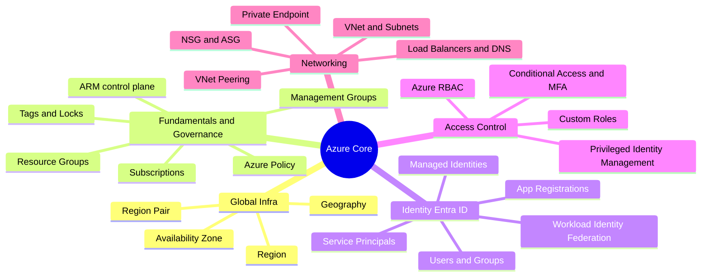
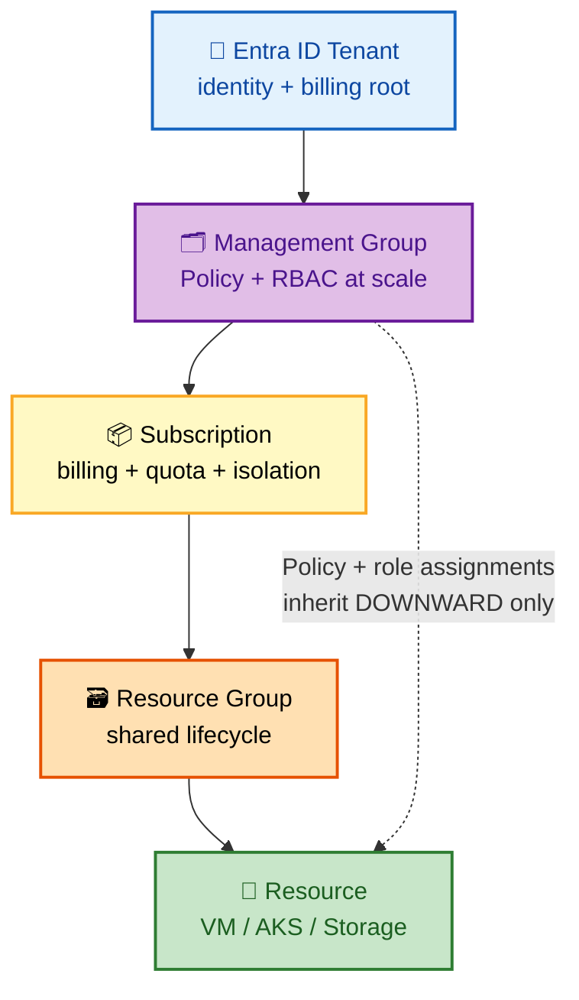
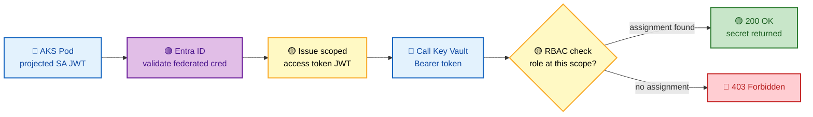
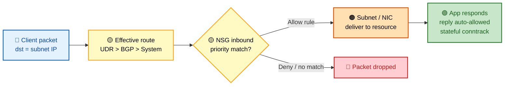

# Azure Interview Preparation Roadmap — FAANG/MANGA Edition

> **Target Audience:** Senior DevOps Engineers, Platform Engineers, Cloud Engineers, SREs, and Cloud Architects (5+ years) preparing for Google, Meta, Amazon, Netflix, Microsoft, Apple, Uber, Airbnb, LinkedIn, Databricks, Snowflake, and similar high-bar companies.
>
> **Scope:** This is a 3-6 month preparation guide. Every topic is built using an 18-point framework: Concept Overview → Architecture → Core Components → Internal Working → Real-World Use Cases → Important Azure Services → Common/Advanced/FAANG-Level Questions → Troubleshooting → Production Best Practices → Security → Cost Optimization → Sample Answers → Interviewer Follow-ups → Microsoft Docs → Hands-On Labs → AWS/GCP Comparison.

---

## How to Use This Guide

This guide is split across multiple files due to its scope (20 major sections, thousands of Q&A) — **all 20 sections are now complete.** Every section lives in its own dedicated file (linked below) grouped by topic for manageability. Study them in order, or jump directly to a weak area using the table of contents.

## Master Table of Contents

| # | Section | Status | File | Est. Study Time |
|---|---------|--------|------|------------------|
| 1 | Azure Fundamentals | ✅ Complete | [01-FUNDAMENTALS.md](./01-FUNDAMENTALS.md) | 2 weeks |
| 2 | Azure Identity & Access Management | ✅ Complete | [02-IDENTITY-ACCESS-MANAGEMENT.md](./02-IDENTITY-ACCESS-MANAGEMENT.md) | 2 weeks |
| 3 | Azure Networking | ✅ Complete | [03-NETWORKING.md](./03-NETWORKING.md) | 3 weeks |
| 4 | Azure Compute | ✅ Complete | [04-COMPUTE.md](./04-COMPUTE.md) | 2 weeks |
| 5 | Azure Storage | ✅ Complete | [05-STORAGE.md](./05-STORAGE.md) | 1 week |
| 6 | AKS (Extremely Detailed) | ✅ Complete | [06-AKS-DEEP-DIVE.md](./06-AKS-DEEP-DIVE.md) | 4 weeks |
| 7 | Containers & Docker | ✅ Complete | [07-CONTAINERS-TERRAFORM.md](./07-CONTAINERS-TERRAFORM.md) | 1 week |
| 8 | Terraform for Azure | ✅ Complete | [07-CONTAINERS-TERRAFORM.md](./07-CONTAINERS-TERRAFORM.md) | 2 weeks |
| 9 | Azure DevOps | ✅ Complete | [08-CICD-PLATFORMS.md](./08-CICD-PLATFORMS.md) | 1 week |
| 10 | GitHub Actions | ✅ Complete | [08-CICD-PLATFORMS.md](./08-CICD-PLATFORMS.md) | 1 week |
| 11 | Observability & SRE | ✅ Complete | [09-OBSERVABILITY-SECURITY.md](./09-OBSERVABILITY-SECURITY.md) | 2 weeks |
| 12 | Azure Security | ✅ Complete | [09-OBSERVABILITY-SECURITY.md](./09-OBSERVABILITY-SECURITY.md) | 2 weeks |
| 13 | Azure Databases | ✅ Complete | [10-DATABASES-EVENTDRIVEN.md](./10-DATABASES-EVENTDRIVEN.md) | 1 week |
| 14 | Event-Driven Architecture | ✅ Complete | [10-DATABASES-EVENTDRIVEN.md](./10-DATABASES-EVENTDRIVEN.md) | 1 week |
| 15 | System Design Using Azure | ✅ Complete | [11-SYSTEM-DESIGN.md](./11-SYSTEM-DESIGN.md) | 3 weeks |
| 16 | Azure Troubleshooting Masterclass | ✅ Complete | [12-TROUBLESHOOTING-MASTERCLASS.md](./12-TROUBLESHOOTING-MASTERCLASS.md) | 2 weeks |
| 17 | FAANG Interview Round Preparation | ✅ Complete | [13-FAANG-BEHAVIORAL.md](./13-FAANG-BEHAVIORAL.md) | 2 weeks |
| 18 | Behavioral & Leadership | ✅ Complete | [13-FAANG-BEHAVIORAL.md](./13-FAANG-BEHAVIORAL.md) | 1 week |
| 19 | Hands-On Labs | ✅ Complete | [14-HANDS-ON-LABS-DOCS.md](./14-HANDS-ON-LABS-DOCS.md) | Ongoing |
| 20 | Documentation Index | ✅ Complete | [14-HANDS-ON-LABS-DOCS.md](./14-HANDS-ON-LABS-DOCS.md) | Reference |

### Suggested Study Order (3-6 Month Plan)
- **Weeks 1-4:** Sections 1-3 (Fundamentals, Identity, Networking) — files [01](./01-FUNDAMENTALS.md), [02](./02-IDENTITY-ACCESS-MANAGEMENT.md), [03](./03-NETWORKING.md).
- **Weeks 5-10:** Sections 4-8 (Compute, Storage, AKS, Containers, Terraform).
- **Weeks 11-14:** Sections 9-14 (CI/CD platforms, Observability, Security, Databases, Event-Driven).
- **Weeks 15-18:** Section 15 (System Design) — practice each design out loud, timed.
- **Weeks 19-22:** Section 16 (Troubleshooting Masterclass) + mock interviews.
- **Weeks 23-24:** Sections 17-19 (FAANG rounds, Behavioral/Leadership, Hands-On Labs) + final review via Section 20.

---

## 🗺️ Visual Overview

**In one line:** Azure is one global control plane (ARM) fronting a governance hierarchy (Management Group → Subscription → Resource Group → Resource), gated by a token-based identity layer (Entra ID + RBAC), talking over a composable networking fabric (VNet / Subnet / NSG / Peering) — master those three and everything else is a variation.

**Mind map — Sections 1–3 at a glance** (skim first, revisit last):

**Diagram 1 — The Azure resource hierarchy (scope ladder that RBAC + Policy inherit down):**

**Diagram 2 — Managed Identity token flow + RBAC decision (the secret-less pattern):**

**Diagram 3 — VNet packet flow with NSG evaluation (stateful filter + routing):**

> 🧠 **Memory hooks (mnemonics):**
> - **Resource hierarchy ladder** (top → bottom): *"My SuperRich Relatives"* → **M**anagement group → **S**ubscription → **R**esource group → **R**esource. Anything you set higher up rolls **downhill**.
> - **ARM request order:** *"Authenticate, Authorize, Police, Provision"* → Entra ID authN → Azure RBAC authZ → Azure Policy → Resource Provider. Same order every time.
> - **RBAC inheritance:** *roles roll downhill, never uphill* — an assignment at MG/Sub/RG applies to everything beneath it, but a resource-scoped role never grants access to its parent.
> - **NSG = Stateful** — if the inbound packet is allowed, the reply is **automatically** allowed (and vice-versa). You never write the return rule.
> - **Peering is NOT transitive** — *spokes talk through the hub.* Spoke-to-spoke needs a UDR hairpin through the hub firewall.

---

# Sections 1–3 — Now in Dedicated Files

The three foundational sections have moved into their own files (matching Sections 4–20) so each is easier to study, link, and navigate. The mind map and memory hooks above summarize all three.

| # | Section | File |
|---|---------|------|
| 1 | Azure Fundamentals | [01-FUNDAMENTALS.md](./01-FUNDAMENTALS.md) |
| 2 | Azure Identity & Access Management | [02-IDENTITY-ACCESS-MANAGEMENT.md](./02-IDENTITY-ACCESS-MANAGEMENT.md) |
| 3 | Azure Networking | [03-NETWORKING.md](./03-NETWORKING.md) |

➡️ Start with **[01-FUNDAMENTALS.md](./01-FUNDAMENTALS.md)**.
