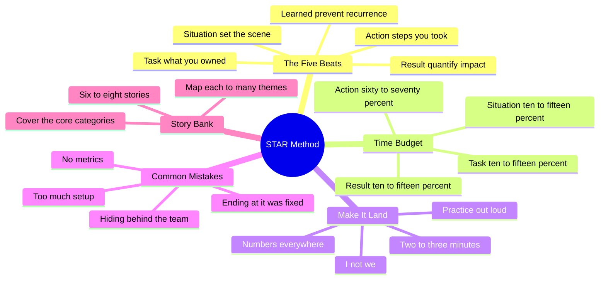
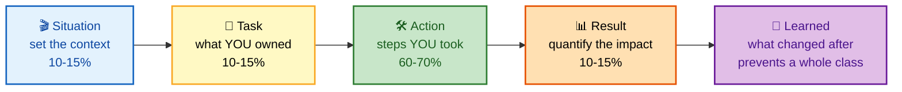
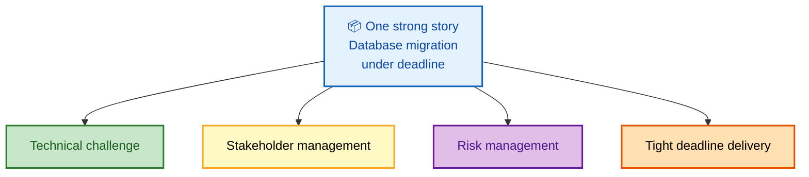

# SECTION 1: The STAR Method

> **Scope:** The universal structure behind every behavioral answer — the STAR+L framework, time-budgeting each beat, quantifying impact, the "I not we" rule, the most common failure modes, two fully worked examples, and how to build a reusable story bank.

STAR is not a gimmick; it is the format interviewers are *trained to score against*. Master it once and every other section in this track becomes a matter of filling in content.

---

## 🗺️ Visual Overview

**In one line:** STAR forces you to prove not just *that* you solved a problem, but the **judgment** you applied — which is precisely what a senior/staff interviewer is grading.

**Mind map — everything in this section at a glance:**

**The STAR+L skeleton — memorize this five-beat flow** (the single highest-value diagram here):

**How one story feeds many questions — the story-bank multiplier:**

> 🧠 **Memory hooks:**
> - **STAR + L** = **S**ituation → **T**ask → **A**ction → **R**esult → **L**earned. The "L" is the senior-differentiating beat most people forget.
> - **"I, not we"** — in the Action beat, own YOUR decisions; interviewers score the individual.
> - **60/40 rule** — ~60–70% of every answer is the Action; keep Situation + Task tight.
> - **"Quantify the Result or it didn't happen."** Attach a number or the story reads as junior.

---

## 1. The Five Beats

**In one line:** Each letter has a job; skip one and the answer collapses into either a vague story or a list of activities with no outcome.

| Beat | Time | Its job | Do | Don't |
|------|------|---------|----|----|
| **Situation** | 10–15% | Set a concrete scene | Name the real system, symptom, timeframe, stakes | Give five minutes of backstory |
| **Task** | 10–15% | Clarify what *you* owned | State your role + the constraint/SLA | Blur your role into the team's |
| **Action** | 60–70% | Show judgment & depth | Specific steps, tools, trade-offs — say **"I"** | "We looked into it and fixed it" |
| **Result** | 10–15% | Prove impact | Quantified outcome + business value | End at "and then it worked" |
| **Learned** | woven in | Prevent a class of problems | New guardrail, runbook, monitor | Omit it — this is the L5+ signal |

> 💡 **Tip:** Junior engineers *fix* incidents; senior/staff engineers demonstrably **prevent whole classes** of future incidents. The Learned beat is where you show that.

---

## 2. Budgeting Your Time — The 60/40 Rule

**In one line:** If an interviewer knows your job title before you reach the Action, your Situation is too long.

A 2–3 minute answer roughly breaks down as:

- **~20 seconds** Situation — just enough context to make the stakes real.
- **~15 seconds** Task — your ownership and the constraint.
- **~90 seconds** Action — the heart of the answer; this is where you win or lose the level.
- **~20 seconds** Result — numbers first, then the systemic change you drove.

⚠️ **Gotcha:** The single most common self-inflicted wound is front-loading. Candidates spend 90 seconds explaining the company's org chart and then rush the Action. Interviewers only score what YOU did — protect that airtime.

---

## 3. Quantifying Impact

**In one line:** A number converts a claim into evidence; without one, every candidate sounds identical.

Weak vs. strong Results:

| Weak (unscored) | Strong (scored) |
|---|---|
| "Deployments got faster." | "Deploy time dropped from **4 hours to 15 minutes**." |
| "We had fewer incidents." | "Config-related outages went from **~1/month to zero in 18 months**." |
| "It saved money." | "Reserved-capacity rework **saved ~$200K** vs. the rushed plan." |
| "The team was happier." | "Deploy frequency rose from **weekly to multiple times daily**." |

Good metric families to reach for: **MTTR, MTBF, deploy frequency, change-failure rate, cost (saved/avoided), latency/p99, error rate, adoption %, headcount hours saved.** If you truly have no hard metric, quantify the *scope* ("affecting ~3,000 transactions/hour" or "used daily by 20 engineers").

---

## 4. "I" Not "We"

**In one line:** "We" is invisible to the scorer — they cannot tell which part was yours.

Use **"we"** only to establish team context ("we were a four-person on-call rotation"). Switch to **"I"** the moment you describe a decision, an analysis, or an action. This is not arrogance; the interviewer's scoring rubric has boxes for *your* individual competencies, and a "we"-heavy answer leaves them blank.

⚠️ **Gotcha:** Over-correcting into "I single-handedly saved the company" reads as a poor collaborator. The calibrated version: **"I" for your contributions, "we" for genuine team context** — and credit teammates explicitly where due.

---

## 5. Common Mistakes

| Mistake | Why it hurts | Fix |
|---|---|---|
| Endless setup | Burns your Action airtime | 2–3 sentences of Situation, max |
| Hiding behind "we" | Leaves your rubric blank | "I" for every decision |
| No metrics | Story reads as junior | Attach a number to the Result |
| Ending at "it was fixed" | Misses the L5+ signal | Add the Learned/prevention beat |
| Rehearsed perfection | Sounds fake | Admit one genuine uncertainty or misstep |
| Wrong story for the prompt | Answers a different question | Listen for the *competency* being tested |

> ⚠️ **Gotcha:** Interviewers are skeptical of narratives where every decision was obviously and immediately correct. A moment of genuine uncertainty — honestly acknowledged — makes the whole story more credible, not less.

---

## 6. Worked Example A — Influencing Technology Adoption

**Prompt:** *"Tell me about a time you influenced a team to adopt a new technology or practice."*

**Situation:** Our deployment process was entirely manual — 4 hours per release with frequent human errors causing outages. The team was resistant after past failed automation attempts.

**Task:** As the senior DevOps engineer, I owned modernizing deployments and winning buy-in from both dev and ops.

**Action:** I started with data, not opinion — I tracked 3 months of deployments and showed **40% had rollback-worthy issues.** I built a proof of concept with GitHub Actions on our lowest-risk service, demonstrating zero-downtime deploys. I ran lunch-and-learns to address fears, paired directly with the most skeptical engineers, and wrote thorough docs. When the ops manager pushed back, I brought them in early, incorporated their security requirements, and gave them ownership of the approval gates.

**Result:** Within 6 months, all 12 services were automated. Deploy time fell from **4 hours to 15 minutes**, frequency rose from **weekly to multiple times daily**, and the once-resistant ops manager became our biggest advocate — presenting the approach at a company tech talk.

**Learned:** Adoption is a trust problem, not a tooling problem. Giving skeptics ownership of the part they fear turns them into champions — a play I now run by default.

---

## 7. Worked Example B — Delivering Under Ambiguity

**Prompt:** *"Describe a time you had to work with incomplete information."*

**Situation:** At 2 AM, our database hit severe performance degradation. The senior DBA was unreachable and monitoring showed conflicting signals.

**Task:** Restore service inside our 30-minute SLA without full database expertise.

**Action:** I gathered what I could — slow-query logs, connection counts, disk I/O. Rather than make dangerous changes blind, I took a **conservative, reversible** path: scaled the instance up for headroom, enabled connection pooling to shed load, and killed the top 5 long-running queries that were clearly non-critical. I timestamped **every** action and simultaneously escalated up the on-call chain to reach the DBA's backup, handing off a complete picture when they joined.

**Result:** Service was restored in **25 minutes**, inside SLA. Root cause (a runaway analytics query) was fixed later without time pressure. I got explicit positive feedback for a methodical approach under uncertainty.

**Learned:** Under ambiguity, favor **reversible mitigations and meticulous documentation** over clever fixes. I turned the response into a runbook non-DBAs could safely execute and pushed for cross-training so 2 AM never again depends on one person.

---

## 8. Building Your Story Bank

**In one line:** Don't prepare 30 answers; prepare **6–8 deep stories** and map each to several themes.

Prepare stories covering these categories — most loops draw entirely from them:

| Category | Covers questions about |
|---|---|
| Technical achievement | Complex project, ambitious goal, dive deep |
| Technical failure | Mistake, learning, blameless culture |
| Leadership without authority | Influence, driving change, earning trust |
| Conflict resolution | Disagreement with peer/manager, disagree-and-commit |
| Difficult stakeholder | Communication, managing expectations |
| Tight deadline | Prioritization, bias for action, delivering results |
| Mentoring / developing others | Growing people, raising the bar |
| Innovation / process improvement | Invent and simplify, frugality |

**Each story must have:** specific numbers, clear *your* contribution, business impact, a Learned beat, and a 2–3 minute delivery. Then **map** each story to 2–4 common themes so you can redeploy it on the fly.

> 💡 **Tip:** Write a one-line index card per story: *title → metrics → themes it answers.* Review the cards, not the paragraphs, the night before.

---

## Next

Continue to **[02-LEADERSHIP-OWNERSHIP.md](./02-LEADERSHIP-OWNERSHIP.md)** to map your stories onto ownership, bias-for-action, and the Amazon/Google/Meta frameworks.

---

**[← Back to Index](./README.md)** | **[Next: Leadership & Ownership →](./02-LEADERSHIP-OWNERSHIP.md)**
