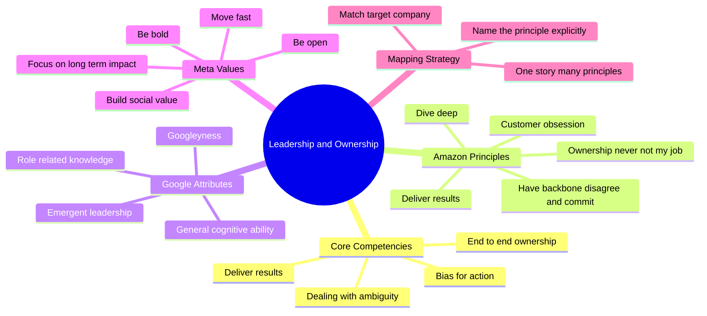
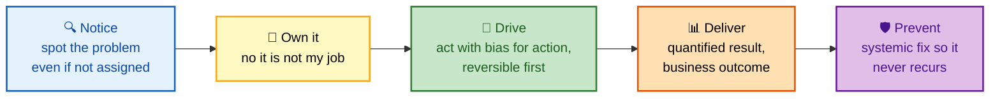
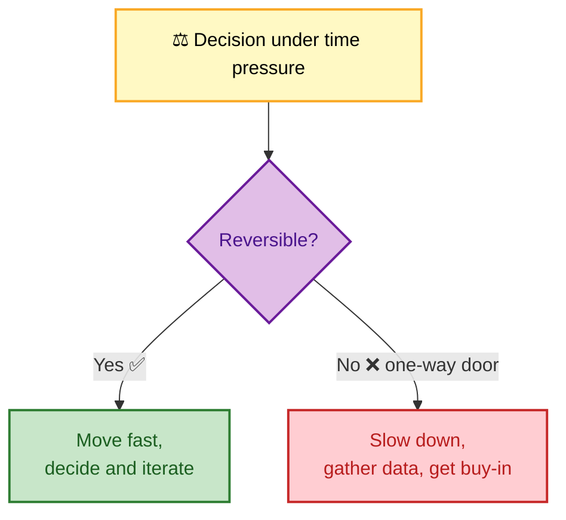

# SECTION 2: Leadership & Ownership

> **Scope:** The competencies every FAANG loop probes independent of title — end-to-end ownership, bias for action, delivering results, and dealing with ambiguity — plus how to map your stories onto the three big company frameworks: **Amazon's 14 Leadership Principles, Google's 4 hiring attributes, and Meta's 5 values.**

Ownership is the single most-tested behavioral trait across the industry. Almost every "tell me about a time" question is secretly asking: *did you treat this like it was yours, end to end?*

---

## 🗺️ Visual Overview

**In one line:** Ownership means you never say "that's not my job" — you see a problem through from detection to the systemic fix that stops it recurring.

**Mind map — the leadership competencies and frameworks:**

**The ownership arc — what "end to end" actually means:**

**Bias for action vs. recklessness — the calibration:**

> 🧠 **Memory hooks:**
> - **14 / 4 / 5** — Amazon has **14** Principles, Google has **4** attributes, Meta has **5** values.
> - **"Not my job" is the anti-signal** — the fastest way to fail an ownership question is to describe handing the problem off.
> - **One-way vs. two-way doors** — Bezos's frame: irreversible decisions deserve caution; reversible ones deserve speed.
> - **Name the principle** — in an Amazon loop, explicitly labeling which LP your story demonstrates helps the interviewer's write-up.

---

## 1. End-to-End Ownership

**In one line:** You owned the outcome, not just your assigned slice — including the parts that technically belonged to someone else.

The strongest ownership stories share a shape: you noticed something broken or missing that **wasn't formally yours**, you picked it up anyway, and you drove it to a durable fix. Bonus signal if you built the guardrail that prevents recurrence.

**What interviewers listen for:**

- You acted **without being told** to.
- You stayed on it through the unglamorous last 20% (docs, monitoring, follow-through).
- You closed the loop with a **systemic** change, not a one-off patch.

💡 **Tip:** The line *"I could have escalated and waited, but I owned it because customer impact was accumulating"* lands ownership + bias-for-action + customer-obsession in a single sentence.

---

## 2. Bias for Action

**In one line:** Speed matters — but calibrated to reversibility, not blind.

Amazon's framing is the clearest: most decisions are **two-way doors** (reversible) and should be made fast by whoever is closest to the problem. A minority are **one-way doors** (irreversible) and deserve deliberation and buy-in. A great bias-for-action story shows you knew *which* kind you faced.

| Situation | Right move | Anti-pattern |
|---|---|---|
| Reversible config tweak | Ship it, measure, iterate | Convene a committee |
| Data deletion / schema drop | Slow down, back up, review | "Move fast and break things" |
| Mitigating a live outage | Act now with reversible fix | Wait for the perfect root cause |
| Choosing a new core datastore | Prototype, gather data, align | Snap-decide alone |

⚠️ **Gotcha:** "Bias for action" is not "bias for recklessness." If your story involves an irreversible action taken hastily, it becomes a *failure* story instead — reframe or pick another.

---

## 3. Delivering Results

**In one line:** You focus on the key inputs, overcome obstacles, and land the outcome with quality — proven by numbers.

This is where the quantification discipline from [01-STAR-METHOD.md](./01-STAR-METHOD.md) pays off. A delivery story needs: a real obstacle, the prioritization call you made, and a **measured** outcome. Interviewers are testing whether you drive to completion or lose momentum when things get hard.

**Strong delivery narrative checklist:**

- Named the **key input metric** you optimized (not a vanity metric).
- Made an explicit **trade-off** (scope, quality, or time) under constraint.
- Hit a **quantified** outcome and tied it to business value.
- Didn't compromise quality to hit the date (or was transparent about what you consciously deferred).

---

## 4. Dealing With Ambiguity

**In one line:** When the problem is under-specified and no one hands you the answer, you create structure and make a reasoned call.

Ambiguity questions ("a time with incomplete information", "a vague/undefined project") probe whether you freeze or self-organize. The winning pattern:

1. **Gather** what data you *can* get quickly.
2. **Frame** the problem and state your assumptions explicitly.
3. **Choose a reversible path** first to buy information.
4. **Escalate/communicate** in parallel rather than going silent.
5. **Document** decisions so others can course-correct.

See the fully worked ambiguity example in [01-STAR-METHOD.md](./01-STAR-METHOD.md) §7 (the 2 AM database incident) — it demonstrates every step above.

💡 **Tip:** The phrase *"I made my assumptions explicit and chose the most reversible option first"* signals exactly the mature judgment these questions hunt for.

---

## 5. Amazon Leadership Principles (LPs)

**In one line:** Amazon interviews are *literally* structured around these 14 — each interviewer is assigned specific LPs and writes up your stories against them.

| # | Principle | The one-liner | Prep a story showing… |
|---|---|---|---|
| 1 | **Customer Obsession** | Start with the customer, work backwards | Prioritizing customer need over convenience |
| 2 | **Ownership** | Never say "that's not my job" | End-to-end ownership of an outcome |
| 3 | **Invent and Simplify** | Expect innovation; simplify relentlessly | A creative or simplifying solution |
| 4 | **Are Right, A Lot** | Strong judgment and instincts | A data-driven call that proved correct |
| 5 | **Learn and Be Curious** | Never done learning | Self-driven upskilling |
| 6 | **Hire and Develop the Best** | Raise the performance bar | Mentoring / a hiring decision |
| 7 | **Insist on the Highest Standards** | Relentlessly high standards | A quality bar you raised |
| 8 | **Think Big** | Thinking small is self-fulfilling | An ambitious project |
| 9 | **Bias for Action** | Speed matters | A fast, calibrated decision |
| 10 | **Frugality** | Accomplish more with less | A cost-optimization win |
| 11 | **Earn Trust** | Listen, speak candidly, be self-critical | Building a relationship / candid feedback |
| 12 | **Dive Deep** | Stay connected to the details | A root-cause deep dive |
| 13 | **Have Backbone; Disagree and Commit** | Challenge respectfully, then commit | Pushing back, then fully committing |
| 14 | **Deliver Results** | Focus on key inputs, deliver with quality | A measured outcome despite obstacles |

> 💡 **Tip:** A single strong story usually demonstrates **3–4 LPs at once**. In your prep grid, tag each of your 6–8 stories with the LPs it covers, then confirm all 14 are reachable.

⚠️ **Gotcha:** Don't force-fit. If asked for "Customer Obsession" and your best story is really about "Dive Deep," pick a genuinely customer-centric example — interviewers can tell when a story is being stretched to fit.

---

## 6. Google's 4 Hiring Attributes

**In one line:** Google scores fewer, broader dimensions — cognitive ability, leadership, role knowledge, and "Googleyness."

| Attribute | What it means | How to show it |
|---|---|---|
| **General Cognitive Ability** | How you structure thinking & learn | Walk through your reasoning, not just the answer |
| **Emergent Leadership** | Stepping up when needed, then stepping back | Led without a title; enabled others |
| **Role-Related Knowledge** | Technical depth & practical experience | Concrete tools, real trade-offs |
| **Googleyness** | Ambiguity tolerance, collaboration, humility | Comfort with undefined problems; intellectual humility |

**Common Google behavioral prompts:** "Tell me about a time you failed," "Describe your most complex project," "How do you handle disagreements?", "What did you learn recently?"

💡 **Tip:** "Emergent" leadership is key — Google explicitly values leaders who *relinquish* control when someone else is better positioned, not just those who seize it.

---

## 7. Meta's 5 Values

**In one line:** Meta probes for speed, boldness, and long-term/social impact balanced with openness.

| Value | What it means | Story angle |
|---|---|---|
| **Move Fast** | Speed over premature polish; remove blockers | Shipped an MVP, iterated in production |
| **Be Bold** | Calculated risks, ambitious goals | Took a smart risk others avoided |
| **Focus on Long-Term Impact** | Sustainable, strategic solutions | Invested in infra/foundations over a quick hack |
| **Build Social Value** | Team contribution, knowledge sharing | Made the whole team better |
| **Be Open** | Transparency, giving/receiving feedback | Candid feedback; shared information widely |

⚠️ **Gotcha:** "Move Fast" is now paired with stability at Meta — a story about moving fast that *caused* an outage needs a strong Learned beat about how you now balance speed with guardrails.

---

## 8. The Mapping Strategy

**In one line:** Build a grid once, redeploy forever.

Create a table: **rows = your 6–8 stories, columns = the target company's framework.** Fill each cell with a ✓ where the story demonstrates that principle/attribute/value. Gaps tell you which new story to prepare. This single artifact is the highest-leverage thing you can build before a behavioral loop.

| Your story | Ownership | Deliver Results | Disagree & Commit | Dive Deep |
|---|:---:|:---:|:---:|:---:|
| Config outage (see §4 of incidents) | ✓ | | | ✓ |
| Deploy automation (see §6 of STAR) | ✓ | ✓ | ✓ | |
| 2 AM DB ambiguity | ✓ | ✓ | | ✓ |

---

## Next

Continue to **[03-CONFLICT-COLLABORATION.md](./03-CONFLICT-COLLABORATION.md)** for disagreement, influence without authority, and difficult stakeholders.

---

**[← Prev: STAR Method](./01-STAR-METHOD.md)** | **[Back to Index](./README.md)** | **[Next: Conflict & Collaboration →](./03-CONFLICT-COLLABORATION.md)**
