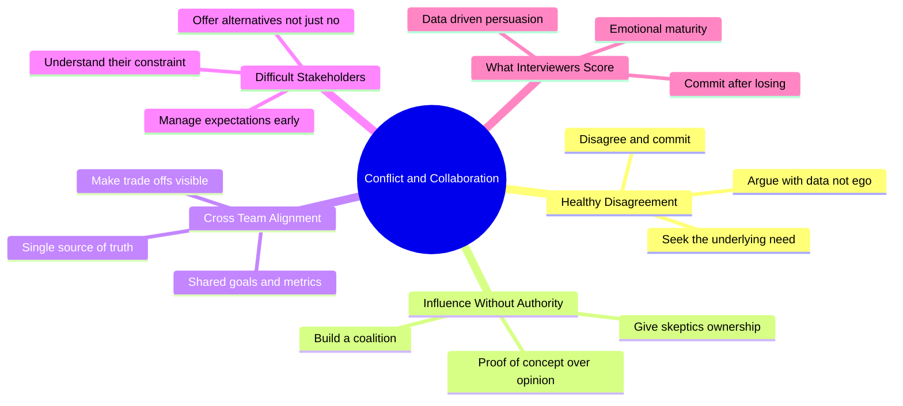
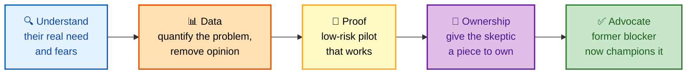
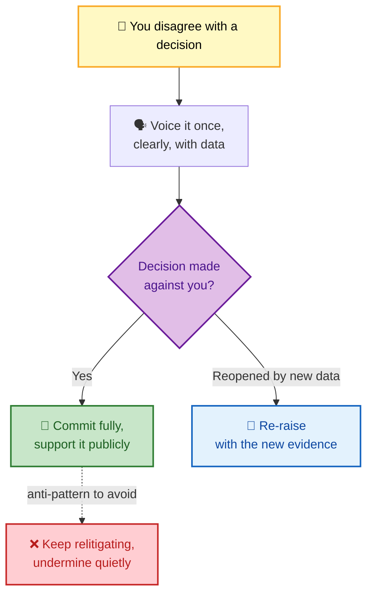

# SECTION 3: Conflict & Collaboration

> **Scope:** How to disagree productively, influence people who don't report to you, drive cross-team alignment, and handle difficult stakeholders — the interpersonal competencies that gate every senior/staff loop. Includes two fully worked STAR examples (influencing adoption, pushing back on a stakeholder).

At senior levels, almost nothing gets done through authority — it gets done through **influence.** Interviewers probe conflict stories to see whether you turn friction into alignment or into a standoff.

---

## 🗺️ Visual Overview

**In one line:** The strongest conflict answers end with a *stronger relationship and a better decision* — not with someone "winning."

**Mind map — the collaboration competencies:**

**The influence loop — turning a skeptic into an advocate:**

**Disagree-and-commit — the decision gate:**

> 🧠 **Memory hooks:**
> - **"Seek the need behind the position."** People rarely fight over the real issue — find the underlying constraint (a deadline, a fear, a metric) and solve *that*.
> - **Data dissolves ego** — arguing with numbers depersonalizes the conflict.
> - **Disagree AND commit** — the value is in the *AND*: you get to disagree once, then you commit fully.
> - **Give skeptics ownership** — the surest way to convert a blocker into a champion.

---

## 1. Healthy Disagreement

**In one line:** Voice your dissent clearly and with data, then — if overruled — commit fully and visibly.

Interviewers use disagreement questions to test **emotional maturity**. The trap is showing either that you cave instantly (no backbone) or that you can't let go (poor collaborator). The calibrated answer:

- You **raised** the concern directly and early, backed by data.
- You **listened** genuinely to the other side's constraints.
- When the decision went against you, you **committed fully** — no quiet sabotage, no "I told you so."
- If new evidence later emerged, you **re-opened** on the evidence, not the grudge.

💡 **Tip:** Explicitly saying *"I disagreed, I made my case with data, the call went the other way, and I committed to making it succeed"* is a textbook **Have Backbone; Disagree and Commit** signal.

---

## 2. Influence Without Authority

**In one line:** You changed behavior across a team you didn't manage by building trust, evidence, and shared ownership — not by escalating.

This is the defining senior/staff skill. The pattern that reliably lands:

| Step | What you do | Why it works |
|---|---|---|
| Understand | Learn their real need & fears first | You can't persuade what you don't understand |
| Quantify | Show the problem in hard data | Removes opinion from the debate |
| Prototype | Build a low-risk proof of concept | Evidence beats argument |
| Co-own | Give skeptics a piece to own | Ownership converts resistance to advocacy |
| Amplify | Let converts champion it publicly | Peer credibility spreads faster than yours |

⚠️ **Gotcha:** If your influence story's climax is *"so I escalated to my manager and they mandated it,"* you've demonstrated the **absence** of the skill being tested. Escalation is a last resort, not the play.

---

## 3. Cross-Team Alignment

**In one line:** You aligned teams with competing priorities by anchoring on a shared goal and making trade-offs explicit.

When two teams pull in opposite directions, the failure mode is a stalemate escalated upward. The senior move is to:

- Find or define a **shared metric/goal** both teams are measured on.
- Make the **trade-offs visible** — a simple effort-vs-impact view so priorities are objective, not political.
- Establish a **single source of truth** (one doc, one channel) so decisions don't fragment.
- Give each team **explicit ownership** of the piece they're best at.

💡 **Tip:** "I reframed it from *my team vs. your team* to *both of us vs. the shared reliability target*" is a strong, concrete line for these questions.

---

## 4. Difficult Stakeholders

**In one line:** You managed a demanding or skeptical stakeholder by understanding their constraint and offering alternatives — never just "no."

The key insight: a "difficult" stakeholder usually has a **legitimate underlying pressure** (a contract deadline, a budget, a board commitment). Your job is to surface that pressure and solve for it while managing technical risk.

- **Never answer with a bare "no."** Answer with "here's the risk, and here are two options that meet your goal."
- **Manage expectations early** — surprise is what damages trust, not bad news.
- **Bring risk quantified** — a risk matrix or probability estimate turns a subjective argument into a shared decision.

---

## 5. Worked Example A — Pushing Back on a Stakeholder

**Prompt:** *"Describe a situation where you had to push back on a stakeholder's technical decision."*

**Situation:** Our VP of Engineering wanted to migrate our entire infrastructure to a new cloud provider in 3 months to hit a vendor-contract deadline — which I believed was infeasible and risky.

**Task:** Provide an alternative that met the business objective while managing technical risk.

**Action:** I started by understanding the **real** need — the contract deadline, not the cloud provider per se. Then I built a data-backed analysis: a rushed migration had a **~70% probability of a major outage** (industry benchmarks), our SLAs were at risk during transition, and the team lacked platform expertise. Instead of just saying no, I proposed a phased path: negotiate a **6-month extension**, migrate non-critical services first, and run parallel systems during cutover. I presented it with risk matrices and cost comparisons, and offered to personally lead the migration team.

**Result:** The VP agreed to negotiate the extension, which we secured. The phased migration finished in **8 months with zero customer-impacting outages** and actually **saved ~$200K** versus the rushed plan through better capacity planning. The VP later cited it as an example of good technical leadership.

**Learned:** Push-back works when you anchor on the stakeholder's underlying goal and arrive with **alternatives and quantified risk**, not objections. "No" ends a conversation; "here's how we still hit your goal, safely" continues it.

---

## 6. Worked Example B — Influencing Adoption Across Teams

**Prompt:** *"Tell me about a time you drove a change across teams that didn't report to you."*

**Situation:** Deployments were manual — 4 hours each, error-prone — and both the dev and ops teams were wary after past failed automation efforts.

**Task:** Win buy-in and modernize deployments without any authority over ops.

**Action:** I led with **data over opinion**: 3 months of deployment tracking showed **40% had rollback-worthy issues.** I built a working GitHub Actions pilot on the lowest-risk service to prove zero-downtime deploys. I ran lunch-and-learns to surface and address fears, paired directly with the most skeptical engineers, and — critically — when the ops manager resisted, I brought them in early, adopted their security requirements, and **handed them ownership of the approval gates.**

**Result:** In 6 months all 12 services were automated; deploy time fell **4 hours → 15 minutes** and frequency rose **weekly → multiple times daily.** The once-resistant ops manager became the loudest advocate and presented the approach at a company tech talk.

**Learned:** Influence is a trust-and-ownership problem. Converting your biggest skeptic by giving them the part they fear to own is the most reliable adoption play I know.

---

## Next

Continue to **[04-INCIDENTS-FAILURE.md](./04-INCIDENTS-FAILURE.md)** for on-call war stories, outages, and blameless postmortems — where your strongest stories usually live.

---

**[← Prev: Leadership & Ownership](./02-LEADERSHIP-OWNERSHIP.md)** | **[Back to Index](./README.md)** | **[Next: Incidents & Failure →](./04-INCIDENTS-FAILURE.md)**
