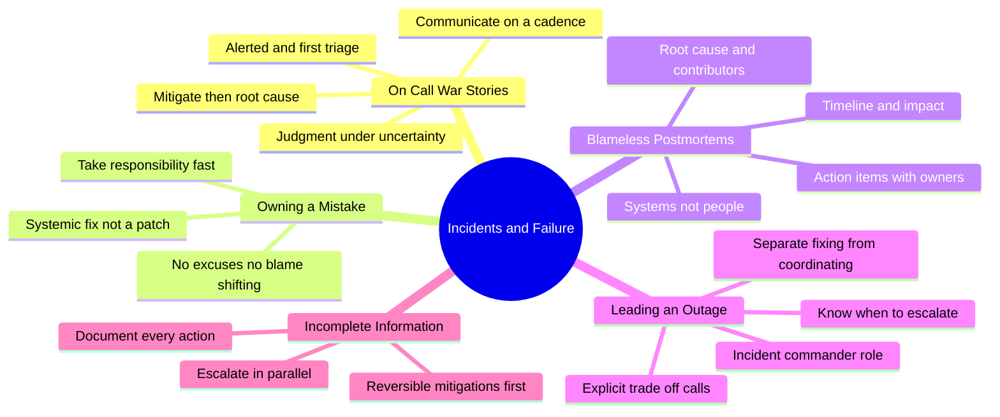
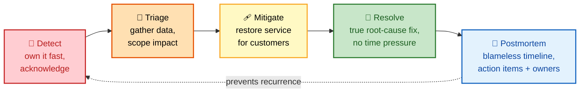
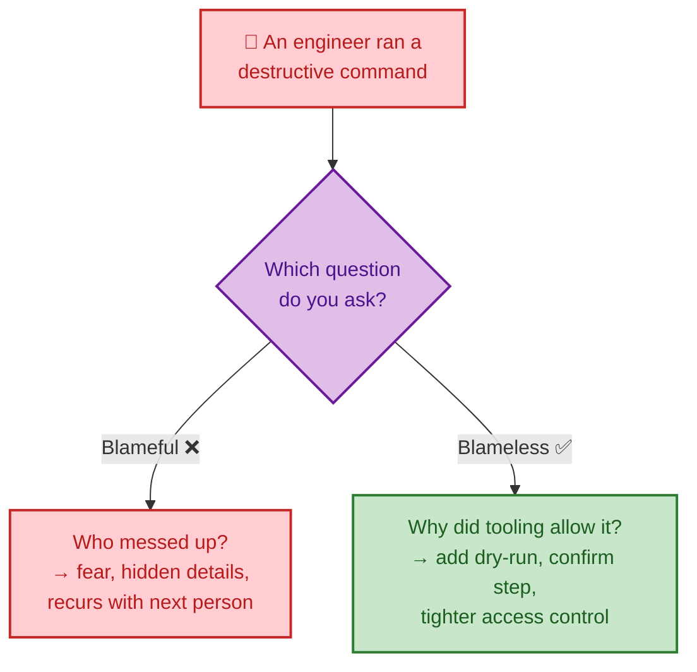

# SECTION 4: Incidents & Failure

> **Scope:** The highest-frequency FAANG behavioral territory — on-call war stories, production outages, "tell me about a mistake," blameless postmortem culture, leading a major incident, and operating with incomplete information. Includes two fully worked STAR examples (a config-change outage, a 2 AM ambiguous incident).

Failure and incident questions are where senior/staff candidates separate themselves. Interviewers are not looking for people who never break things — they're looking for people who **own the break, restore fast, and prevent the whole class.**

---

## 🗺️ Visual Overview

**In one line:** Junior engineers fix the incident; senior/staff engineers demonstrably prevent the next one — and the Learned beat is where you prove it.

**Mind map — the incident & failure competencies:**

**The incident-response loop — the arc every on-call story should trace:**

**Blameless framing — systems, not people:**

> 🧠 **Memory hooks:**
> - **DTMRP** for any incident story: **D**etect → **T**riage → **M**itigate → **R**esolve → **P**ostmortem.
> - **Mitigate before Resolve** — restore customers fast with a reversible fix; chase the true root cause afterward without time pressure.
> - **"Blameless = systems, not people."** Interrogate the guardrails that let a human error reach production, never the human.
> - **"Simple changes cause the worst outages."** The story where you skipped a gate "just this once" is a classic, powerful failure narrative.

---

## 1. On-Call War Stories

**In one line:** A strong on-call answer shows a **calm, structured triage** even while recalling a stressful moment — not heroics.

Interviewers ask "a time you were on call and something went wrong" to see how you behave under **genuine operational pressure**. A strong narrative always includes:

- **How you were alerted and your first diagnostic steps** — systematic (a method like USE/RED), not random guessing.
- **What you communicated, to whom, and when** — proactive updates on a predictable cadence during a long incident. Going silent while heads-down is a classic anti-signal; stakeholder anxiety and business impact both compound without communication.
- **A judgment call under incomplete information** — real incidents rarely present clean symptoms; acknowledge genuine uncertainty rather than pretending the root cause was obvious.
- **How it concluded** — the immediate **mitigation** (restart, failover) is usually different from and faster than the true **root-cause fix**.

💡 **Tip:** An answer that ends at "and then it was fixed" misses the most senior-differentiating part. Always continue to what *changed* afterward — a new monitor, a runbook, an automated remediation.

---

## 2. Owning a Mistake

**In one line:** You took clear, immediate responsibility, restored service, and then drove a **systemic** fix so the mistake couldn't recur — regardless of who's at the keyboard.

The "tell me about a mistake/failure" question is a trap only if you dodge it. Strong answers:

- **Own it plainly.** No "mistakes were made," no blaming a teammate or the tooling. "I skipped staging on a change I judged trivial."
- **Show the restore.** What you did in the first minutes to stop customer impact.
- **Deliver the prevention.** The guardrail you built so no one — including future-you — can repeat it.

⚠️ **Gotcha:** Picking a fake failure ("I work too hard") is an instant red flag. Choose a *real* mistake with real stakes; the vulnerability is what makes the growth credible.

---

## 3. Blameless Postmortem Culture

**In one line:** You investigate incidents by asking *"what in our systems allowed this?"* not *"who did it?"*

The core insight: individual human error is rarely a sufficient or actionable root cause. If someone ran a destructive command, the useful questions are systemic:

- Why did tooling allow it without a confirmation step or dry-run?
- Why did access controls permit it at all?
- Why did no automated safeguard catch it before impact?

A blameful culture does two damaging things: it **fixes no systemic gap** (so it recurs with a different person) and it **discourages honesty** (fear makes responders omit details, undermining the review's accuracy).

**A complete postmortem names:** timeline, impact, root cause, contributing factors, and **action items with owners and due dates** — tracked to *actual completion*, not filed and forgotten.

💡 **Tip:** "We fixed the system so the next person can't hit this" beats "we agreed not to blame anyone." Show you've *lived* the principle, not just learned the phrase.

---

## 4. Leading a Major Outage

**In one line:** Incident command is a **coordination and decision-prioritization** role — the strongest individual debugger is not automatically the strongest incident commander.

What a strong incident commander does:

| Behavior | Why it matters |
|---|---|
| **Separates roles** — who debugs vs. who coordinates & communicates | Diving into every rabbit hole yourself removes the one person holding situational awareness |
| **Runs one timeline & cadence** — single incident channel, regular updates | A single source of truth beats scattered side-conversations |
| **Makes explicit trade-off calls** — fast imperfect mitigation vs. correct root-cause fix | Under time pressure, restoring customers usually wins; be transparent about the choice |
| **Knows when to escalate** — bring in fresh expertise | Sunk-cost thinking keeps a struggling team past the point fresh eyes would help |

⚠️ **Gotcha:** A genuinely strong answer admits a moment of uncertainty or a call that could've gone better. Narratives where every decision was instantly correct read as rehearsed and sanitized.

---

## 5. Operating With Incomplete Information

**In one line:** Under ambiguity, favor **reversible mitigations and meticulous documentation** over clever, risky fixes.

The winning pattern (also covered in [02-LEADERSHIP-OWNERSHIP.md](./02-LEADERSHIP-OWNERSHIP.md) §4):

1. Gather what data you *can* get fast.
2. Take a **conservative, reversible** mitigation rather than a dangerous change made blind.
3. **Timestamp every action** so handoff is clean.
4. **Escalate in parallel** — reach the backup on-call while you work, don't serialize.
5. Hand off a complete picture when help arrives.

---

## 6. Worked Example A — A Config Change That Caused an Outage

**Prompt:** *"Tell me about a significant technical failure you were responsible for."*

**Situation:** I pushed a configuration change to production that took down our **entire payment-processing system for 45 minutes during peak hours**, affecting thousands of transactions.

**Task:** Restore service immediately, then ensure we learned from it to prevent recurrence.

**Action:** I **rolled back immediately** and confirmed restoration within **15 minutes**, and I took ownership publicly in the incident channel while leading the response. In the **blameless postmortem** I was transparent about the real cause: I had skipped the staging environment "just this once" because it was a "simple change." I identified the *systemic* gaps — our pipeline **allowed** bypassing staging, we lacked config validation, and monitoring didn't catch it early. Then I personally implemented: **mandatory staging gates** in CI/CD, **automated config validation**, and enhanced monitoring for config failures.

**Result:** **Zero config-related outages in the 18 months since.** I became an internal advocate for deployment safety, trained 3 junior engineers on incident response, and team deploy confidence rose measurably.

**Learned:** "Simple changes" cause the worst outages. I now apply the same rigor to every change regardless of perceived risk — and, more importantly, I make the *system* enforce that rigor so it doesn't depend on discipline alone.

---

## 7. Worked Example B — A 2 AM Incident With Conflicting Signals

**Prompt:** *"Describe a time you had to make a decision with incomplete information under pressure."*

**Situation:** At 2 AM our database hit severe performance degradation. The senior DBA was unreachable and monitoring showed conflicting signals.

**Task:** Restore service inside our **30-minute SLA** without deep database expertise on hand.

**Action:** I gathered slow-query logs, connection counts, and disk I/O. Rather than risk a destructive change blind, I chose **reversible mitigations**: scaled the instance up for headroom, enabled connection pooling to shed load, and killed the top 5 clearly non-critical long-running queries. I **timestamped every action** and, in parallel, escalated up the on-call chain to reach the DBA's backup — handing off a complete picture when they joined.

**Result:** Service restored in **25 minutes**, inside SLA. Root cause (a runaway analytics query) was fixed later without time pressure. I received explicit positive feedback for a methodical approach under uncertainty.

**Learned:** I turned the response into a **runbook non-DBAs could safely execute** and pushed for cross-training, so no future 2 AM incident hinges on a single unreachable expert.

---

## Next

Continue to **[05-GROWTH-MENTORING.md](./05-GROWTH-MENTORING.md)** for mentoring, feedback, raising the bar, and technical leadership.

---

**[← Prev: Conflict & Collaboration](./03-CONFLICT-COLLABORATION.md)** | **[Back to Index](./README.md)** | **[Next: Growth & Mentoring →](./05-GROWTH-MENTORING.md)**
