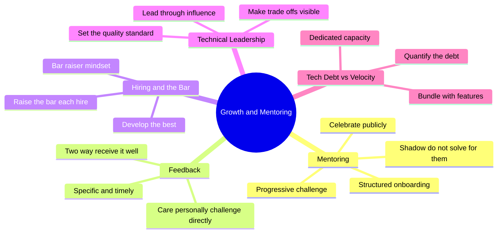
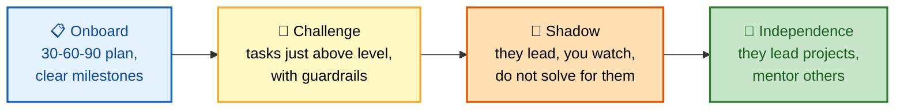
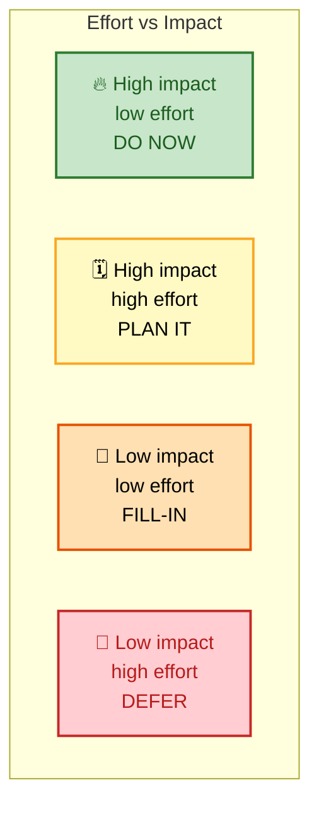

# SECTION 5: Growth & Mentoring

> **Scope:** The senior/staff differentiator — growing people, not just systems. Mentoring engineers, giving and receiving feedback, hiring and raising the bar, technical leadership, and balancing technical debt against feature velocity. Includes two worked examples (mentoring a junior SRE, a principled tech-debt approach).

Once you clear the senior bar, interviewers stop asking only *"can you do the work?"* and start asking *"do you make everyone around you better?"* This section is where you prove multiplier impact.

---

## 🗺️ Visual Overview

**In one line:** Great mentoring creates **independence, not dependence** — the engineer you grow should eventually not need you.

**Mind map — the growth & leadership competencies:**

**The mentoring ladder — growing independence over time:**

**Tech debt vs. velocity — the prioritization matrix:**

> 🧠 **Memory hooks:**
> - **"Independence, not dependence."** The goal of mentoring is an engineer who no longer needs you.
> - **30-60-90** — structured onboarding milestones: first PR, first deploy, first (shadowed) on-call.
> - **"Shadow, don't solve."** When a mentee handles an incident, you observe — you don't take the keyboard.
> - **Quantify the debt** — deploy frequency, incident rate by component, velocity — to make the abstract concrete.
> - **20% rule** — a common, defensible answer is dedicating ~20% of sprint capacity to debt paydown.

---

## 1. Mentoring Engineers

**In one line:** Effective mentoring is a system — structured onboarding, progressively harder challenges with guardrails, and public credit — designed to produce independence.

The concrete playbook that answers most mentoring questions:

| Practice | What it looks like |
|---|---|
| **Structured onboarding** | A 30-60-90 plan: first PR in week 1, first prod deploy in week 2, first shadowed on-call in month 2 |
| **Progressive challenges** | Assign tasks slightly above current level, with guardrails — stretch, not drown |
| **Shadow, don't solve** | When they hit an incident, you shadow; you don't solve it for them |
| **Growth-focused 1:1s** | Beyond status — what do they want to learn, where do they want to be in 2 years |
| **Document as they learn** | Have mentees update runbooks; teaching solidifies knowledge and improves docs |
| **Celebrate publicly** | Highlight their wins in team channels and to leadership |

💡 **Tip:** The most compelling mentoring stories end with the mentee **surpassing** the starting point — leading a project, getting promoted, becoming a mentor themselves. That's multiplier impact made concrete.

---

## 2. Giving & Receiving Feedback

**In one line:** Good feedback is **specific, timely, and kind** — and the senior signal is that you receive it as well as you give it.

- **Specific over vague** — "your PR descriptions skip the *why*, which slows review" beats "communicate better."
- **Timely over saved-up** — feedback loses value the longer you hold it; don't ambush at review time.
- **Care personally, challenge directly** — the Radical Candor axis: warmth *and* directness, not one or the other.
- **Receive it well** — asking for feedback and visibly acting on it is a strong maturity signal interviewers probe for.

⚠️ **Gotcha:** "I don't really get negative feedback" is a red flag — it reads as either low self-awareness or a lack of stretch. Have a real example of feedback that stung and what you changed.

---

## 3. Hiring & Raising the Bar

**In one line:** Every hire should raise the average — the "bar raiser" mindset of only adding people better than the median on some axis.

Interview signals for this competency:

- You've **interviewed and calibrated** — you can articulate what a strong vs. weak signal looks like.
- You've made a **hard hiring call** — including declining a likeable-but-not-ready candidate, or advocating for an unconventional strong one.
- You think about **team composition**, not just individual brilliance — complementary strengths, diversity of thought.

This maps directly to Amazon's **Hire and Develop the Best** and Google's evaluation of leadership and enabling others (see [02-LEADERSHIP-OWNERSHIP.md](./02-LEADERSHIP-OWNERSHIP.md)).

---

## 4. Technical Leadership

**In one line:** You set the quality bar and align people through influence and visible trade-offs — not through a title.

Technical leadership questions test whether you can drive standards and direction without formal authority:

- **Set standards by example** — you raise the quality bar and others follow because you modeled it.
- **Make trade-offs visible** — surface the cost of decisions so the team chooses with eyes open.
- **Lead through influence** — the cross-team and disagree-and-commit skills from [03-CONFLICT-COLLABORATION.md](./03-CONFLICT-COLLABORATION.md) apply directly.
- **Stay technical** — staff-level leaders keep enough depth to earn engineers' trust and dive deep when it counts.

---

## 5. Balancing Tech Debt vs. Feature Velocity

**In one line:** A principled, *quantified* approach — not "we'll get to it later" — is what distinguishes a senior answer here.

A strong, structured answer to *"how do you balance tech debt with feature development?"*:

- **Quantify the debt.** Track it with metrics — deploy frequency, incident rate by component, developer velocity. This makes the abstract concrete and arguable with product.
- **Allocate dedicated time.** Advocate ~**20% of sprint capacity** for debt, non-negotiable, so it doesn't compound.
- **Prioritize by impact.** Use an effort-vs-impact 2×2 (see diagram above). A slow build hitting 20 engineers daily outranks a rarely-used admin tool.
- **Make it visible.** Keep a tech-debt backlog visible to PMs so trade-offs are explicit when they push for features.
- **Bundle with features.** Pay down debt alongside related feature work — e.g., refactor auth *while* adding SSO.

💡 **Tip:** Concrete beats principle. "We had a 45-minute monolith deploy; instead of a big-bang rewrite I drove **incremental microservice extraction** starting with the highest-change components — deploy dropped to **5 minutes** over 6 months and feature throughput rose because deploys got less risky" is a full, quantified answer.

---

## 6. Worked Example A — Mentoring a Junior SRE

**Prompt:** *"Describe how you've mentored a junior engineer."*

**Situation:** I mentored a junior SRE who was intimidated by our complex Kubernetes setup and hesitant to touch production.

**Task:** Grow them into a confident, independent operator — without solving everything for them.

**Action:** I built a **progressive ramp**: started with simple pod debugging, then service meshes, then disaster-recovery scenarios. I used a 30-60-90 structure with clear milestones and **shadowed rather than solved** when they hit real incidents. In our 1:1s I focused on career growth, not just status, and had them **update runbooks** as they learned so teaching reinforced the learning. When they shipped something meaningful, I highlighted it publicly.

**Result:** After **8 months** they **led our cluster-upgrade project** end to end. They've since grown into a senior engineer elsewhere — a trajectory I'm genuinely proud of.

**Learned:** The hardest and most important mentoring discipline is **restraint** — shadowing a struggling mentee instead of grabbing the keyboard. Short-term it's slower; long-term it's the only thing that builds real independence.

---

## 7. Worked Example B — A Principled Tech-Debt Strategy

**Prompt:** *"How do you balance technical debt with feature development?"*

**Situation:** Our monolithic deployment took **45 minutes**, making releases risky and slowing feature delivery — while product pushed constantly for more features.

**Task:** Reduce the drag of tech debt without stalling the roadmap.

**Action:** I **quantified** the debt (deploy time, incident rate, velocity) to make it a concrete conversation with product, then advocated for **~20% dedicated capacity.** Rather than a big-bang rewrite, I proposed **incremental microservice extraction**, prioritized by an effort-vs-impact matrix — starting with the highest-change components — and kept a visible debt backlog so trade-offs were explicit.

**Result:** Over **6 months**, deploy time fell from **45 minutes to 5 minutes**, and feature throughput actually *increased* because deploys became low-risk.

**Learned:** Debt paydown sells when it's framed in the language product cares about — **velocity and risk, quantified** — not as "engineering wants to clean things up."

---

## Next

Continue to **[06-QUESTION-BANK.md](./06-QUESTION-BANK.md)** to drill breadth across every theme and pressure-test your story coverage.

---

**[← Prev: Incidents & Failure](./04-INCIDENTS-FAILURE.md)** | **[Back to Index](./README.md)** | **[Next: Question Bank →](./06-QUESTION-BANK.md)**
