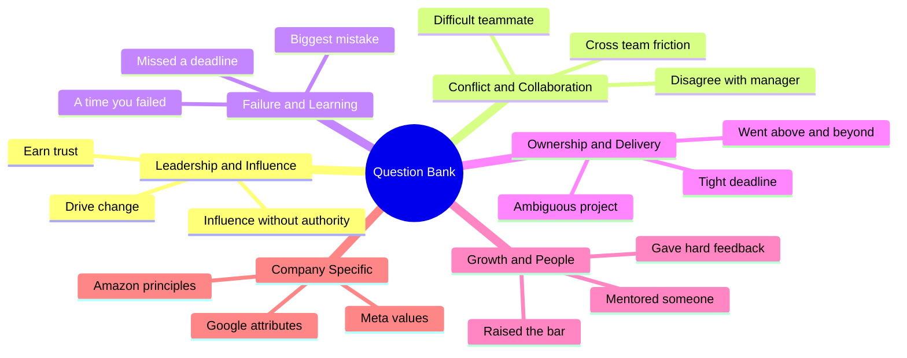
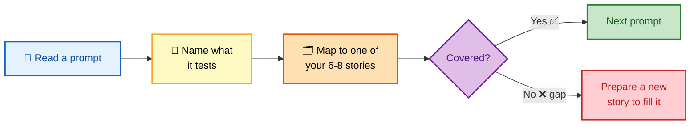

# SECTION 6: Behavioral Question Bank

> **Scope:** A curated, interview-focused bank of behavioral questions organized by theme. Each entry states **what the interviewer is really testing** and a **strong-answer outline** you can map your own stories onto. Use this to pressure-test that your 6–8 prepared stories cover every theme — and to spot gaps before the loop does.

This is a drill sheet, not a script. Don't memorize answers; memorize *which of your stories* answers each question, using the STAR+L structure from [01-STAR-METHOD.md](./01-STAR-METHOD.md).

---

## 🗺️ Visual Overview

**In one line:** Every behavioral question maps to one of a handful of competencies — learn the competency behind the prompt and you can answer questions you've never seen.

**Mind map — the question themes:**

**How to use this bank — the drill loop:**

> 🧠 **Memory hooks:**
> - **Prompt → competency → story.** Translate every question into the competency it tests, then deploy the matching story.
> - **One story, many prompts.** If a story only answers one question, it's under-leveraged — find its other angles.
> - **Gaps are the point.** The value of a question bank isn't the questions you can answer — it's finding the ones you can't.

---

## 1. Leadership & Influence

| Question | What they're testing | Strong-answer outline |
|---|---|---|
| Tell me about a time you influenced a team to adopt a new technology/practice. | Influence without authority, earning trust | Data → pilot → give skeptics ownership → measured adoption (see [03](./03-CONFLICT-COLLABORATION.md) §6) |
| Describe a time you led a project without formal authority. | Emergent leadership | Stepped up, aligned via shared goal, delivered, then stepped back |
| Tell me about a time you had to earn someone's trust. | Earn Trust (Amazon LP) | Listened first, followed through on a commitment, candid communication |
| Describe a time you drove a significant change across the org. | Think Big, scope of impact | Framed the ambition, built coalition, quantified org-level outcome |
| Tell me about a time you took an unpopular stance. | Backbone, conviction | Made the case with data, absorbed pushback, outcome validated it |

💡 **Tip:** For influence questions, the climax must be *persuasion*, not *escalation*. If your story ends with a manager mandating the change, it demonstrates the absence of the skill.

---

## 2. Conflict & Collaboration

| Question | What they're testing | Strong-answer outline |
|---|---|---|
| Describe a disagreement with your manager. | Backbone + Disagree-and-commit | Voiced dissent with data → overruled → committed fully → supported it |
| Tell me about a conflict with a coworker. | Emotional maturity, resolution | Sought their underlying need, found common ground, stronger relationship after |
| How did you handle a difficult stakeholder? | Expectation management | Understood their constraint, offered alternatives not just "no" (see [03](./03-CONFLICT-COLLABORATION.md) §5) |
| Tell me about two teams with competing priorities. | Cross-team alignment | Anchored on a shared metric, made trade-offs visible, single source of truth |
| Describe working with someone whose style clashed with yours. | Adaptability | Adjusted your approach, focused on the shared outcome |

⚠️ **Gotcha:** Never trash the other person. A conflict story where the other party is purely "unreasonable" signals *you* as the difficult one. Show genuine understanding of their side.

---

## 3. Failure & Learning

| Question | What they're testing | Strong-answer outline |
|---|---|---|
| Tell me about your biggest technical failure. | Ownership, growth | Own it plainly → restore fast → systemic prevention (see [04](./04-INCIDENTS-FAILURE.md) §6) |
| Describe a time you made a mistake nobody noticed. | Integrity | Surfaced it proactively, fixed it, added a guardrail |
| Tell me about a time you failed to meet a deadline. | Honesty, prioritization | What you deprioritized, how you communicated early, what you changed |
| Describe a decision you'd make differently now. | Reflection, learning | Specific decision, the insight gained, how it changed your approach |
| Tell me about feedback that was hard to hear. | Receiving feedback | The feedback, your initial reaction, the concrete change you made |

💡 **Tip:** Pick a *real* failure with real stakes. Fake-humble answers ("I care too much") are the fastest way to lose the room.

---

## 4. Ownership & Delivery

| Question | What they're testing | Strong-answer outline |
|---|---|---|
| Tell me about a time you went above and beyond. | Customer Obsession, Ownership | Picked up what wasn't yours, drove it end to end, customer impact |
| Describe delivering under a tight deadline. | Bias for Action, Deliver Results | Prioritized key inputs, made a trade-off, hit a quantified outcome |
| Tell me about the most ambiguous project you owned. | Dealing with ambiguity | Created structure, stated assumptions, chose reversible path first (see [02](./02-LEADERSHIP-OWNERSHIP.md) §4) |
| Describe a time you had to make a decision with incomplete info. | Judgment under uncertainty | Reversible mitigation, documented actions, escalated in parallel (see [04](./04-INCIDENTS-FAILURE.md) §7) |
| Tell me about a cost or efficiency improvement you drove. | Frugality | Quantified the waste, the change, the savings |

---

## 5. Growth & People

| Question | What they're testing | Strong-answer outline |
|---|---|---|
| Describe how you've mentored a junior engineer. | Develop the Best, multiplier impact | Structured ramp, shadow-don't-solve, mentee surpassed start (see [05](./05-GROWTH-MENTORING.md) §6) |
| Tell me about giving someone difficult feedback. | Candor + care | Specific, timely, kind; the behavior changed |
| Describe a hiring decision you influenced. | Raising the bar | A hard call, the signal you weighed, the outcome |
| How do you balance tech debt with features? | Technical leadership, judgment | Quantify debt → dedicated capacity → effort/impact priority (see [05](./05-GROWTH-MENTORING.md) §7) |
| Tell me about raising the quality bar on your team. | Highest Standards | The standard you set, how you got adoption, the result |

---

## 6. Incidents & On-Call

| Question | What they're testing | Strong-answer outline |
|---|---|---|
| Tell me about a time you were on call and something broke. | Composure, structured triage | DTMRP arc, communication cadence, mitigate-then-resolve (see [04](./04-INCIDENTS-FAILURE.md) §1) |
| Describe the worst outage you were part of. | Incident command, scope | Role separation, trade-off calls, prevention (see [04](./04-INCIDENTS-FAILURE.md) §4) |
| How do you run or contribute to a postmortem? | Blameless culture | Systems-not-people, action items with owners, tracked to done |
| Tell me about a recurring problem you eliminated for good. | Systemic thinking | Root-caused the class, built the guardrail, measured recurrence → zero |

---

## 7. Company-Specific Prompts

**In one line:** Same stories, re-labeled to the target framework — build the mapping grid in [02-LEADERSHIP-OWNERSHIP.md](./02-LEADERSHIP-OWNERSHIP.md) §8.

| Company | Representative prompts |
|---|---|
| **Amazon** | "A time you disagreed and committed", "went above and beyond for a customer", "the highest standard you set", "a decision you made with little data" (maps to the 14 LPs) |
| **Google** | "Tell me about a time you failed", "your most complex project", "how you handle disagreements", "something you learned recently" (probes the 4 attributes) |
| **Meta** | "A time you moved fast", "a bold bet you made", "a long-term investment over a quick fix", "transparent communication under pressure" (probes the 5 values) |

---

## 8. Self-Assessment Coverage Grid

**In one line:** If any row below has no story, that's your prep to-do list.

| Theme | Do you have a quantified story? |
|---|:---:|
| Technical achievement (complex project) | ☐ |
| Technical failure (owned + prevented) | ☐ |
| Leadership without authority | ☐ |
| Conflict with peer or manager | ☐ |
| Difficult stakeholder | ☐ |
| Tight-deadline delivery | ☐ |
| Mentoring / developing others | ☐ |
| Innovation / process improvement | ☐ |
| On-call incident / outage | ☐ |
| Ambiguity / incomplete information | ☐ |

> 💡 **Tip:** Aim for each ☐ to be satisfied by one of your 6–8 stories — and for most stories to satisfy *several* rows. Coverage with overlap is the sign of a well-built story bank.

---

**[← Prev: Growth & Mentoring](./05-GROWTH-MENTORING.md)** | **[Back to Index](./README.md)**
