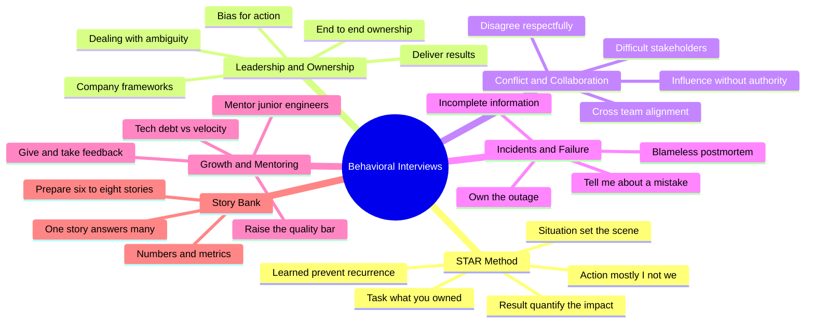

# Behavioral & Leadership Interview Preparation — FAANG Edition

> **Scope:** The behavioral/leadership loop for Senior DevOps, SRE, and Platform Engineer roles at FAANG/MANGA companies.
> **Coverage:** STAR method, leadership & ownership, conflict & collaboration, incidents & failure, growth & mentoring, and a curated 200+ question bank — every answer mapped to what interviewers actually score.

---

## Why This Track Matters

Technical depth gets you into the room; the behavioral loop decides your **level**. At L5+/senior/staff, interviewers are no longer asking *"can you fix it?"* — they assume you can. They are probing **judgment under pressure, ownership, influence without authority, and how you make the people and systems around you better.** Two candidates with identical technical skills routinely land two levels apart on the strength of their stories alone.

This track is organized into **6 section files**, each self-contained, skimmable, and interview-focused — no filler.

---

## 📚 Master Table of Contents

| # | Section | File | What it covers |
|---|---------|------|----------------|
| 1 | STAR Method | [01-STAR-METHOD.md](./01-STAR-METHOD.md) | STAR+L framework, the 60/40 rule, quantifying impact, "I not we", common mistakes, worked examples, story-bank strategy |
| 2 | Leadership & Ownership | [02-LEADERSHIP-OWNERSHIP.md](./02-LEADERSHIP-OWNERSHIP.md) | Ownership, bias for action, delivering results, dealing with ambiguity, Amazon LPs / Google attributes / Meta values mapping |
| 3 | Conflict & Collaboration | [03-CONFLICT-COLLABORATION.md](./03-CONFLICT-COLLABORATION.md) | Disagreement, influence without authority, cross-team alignment, difficult stakeholders, disagree-and-commit |
| 4 | Incidents & Failure | [04-INCIDENTS-FAILURE.md](./04-INCIDENTS-FAILURE.md) | On-call war stories, outages, "tell me about a mistake", blameless postmortems, working with incomplete info |
| 5 | Growth & Mentoring | [05-GROWTH-MENTORING.md](./05-GROWTH-MENTORING.md) | Mentoring, feedback, hiring & raising the bar, technical leadership, balancing tech debt vs velocity |
| 6 | Question Bank | [06-QUESTION-BANK.md](./06-QUESTION-BANK.md) | 200+ curated questions by theme — each with *what they test* + a strong-answer outline |

---

## 🗺️ Repo-Wide Mind Map

**Every theme and story category at a glance** (skim first, revisit last):

---

## 🧭 Recommended Study Order

| Order | Section | Why here |
|-------|---------|----------|
| 1 | [01-STAR-METHOD.md](./01-STAR-METHOD.md) | The container for **every** other answer — master the structure first |
| 2 | [04-INCIDENTS-FAILURE.md](./04-INCIDENTS-FAILURE.md) | Highest-frequency FAANG questions; your best stories live here |
| 3 | [03-CONFLICT-COLLABORATION.md](./03-CONFLICT-COLLABORATION.md) | Influence & disagreement come up in nearly every loop |
| 4 | [02-LEADERSHIP-OWNERSHIP.md](./02-LEADERSHIP-OWNERSHIP.md) | Map your stories onto the target company's leadership framework |
| 5 | [05-GROWTH-MENTORING.md](./05-GROWTH-MENTORING.md) | The senior/staff differentiator: scaling people, not just systems |
| 6 | [06-QUESTION-BANK.md](./06-QUESTION-BANK.md) | Drill breadth; pressure-test that your 6–8 stories cover every theme |

> 💡 **Tip:** Prepare **6–8 detailed stories**, not 30. Each strong story, mapped correctly, answers 3–4 different question themes. Depth beats breadth.

---

## ✅ The 5 Rules That Carry Every Answer

1. **STAR + L** — always add the **L**earned beat; it's what separates senior from mid-level.
2. **"I" not "we"** in the Action — interviewers score the individual, not the team.
3. **60/40** — ~60–70% of the answer is your **Action**; keep Situation + Task tight.
4. **Quantify or it didn't happen** — attach a number to every Result (MTTR ↓, cost ↓, incidents eliminated).
5. **2–3 minutes** — rehearse out loud; a rambling 8-minute story reads as junior regardless of content.

---

## 📖 External Resources

- [Amazon Leadership Principles](https://www.amazon.jobs/en/principles)
- [Google — How We Hire](https://careers.google.com/how-we-hire/)
- [The STAR Interview Method](https://www.themuse.com/advice/star-interview-method)

---

**[← Back to Main README](../README.md)** | **[Start: STAR Method →](./01-STAR-METHOD.md)**
