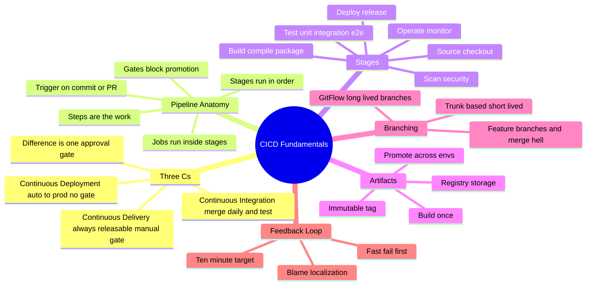
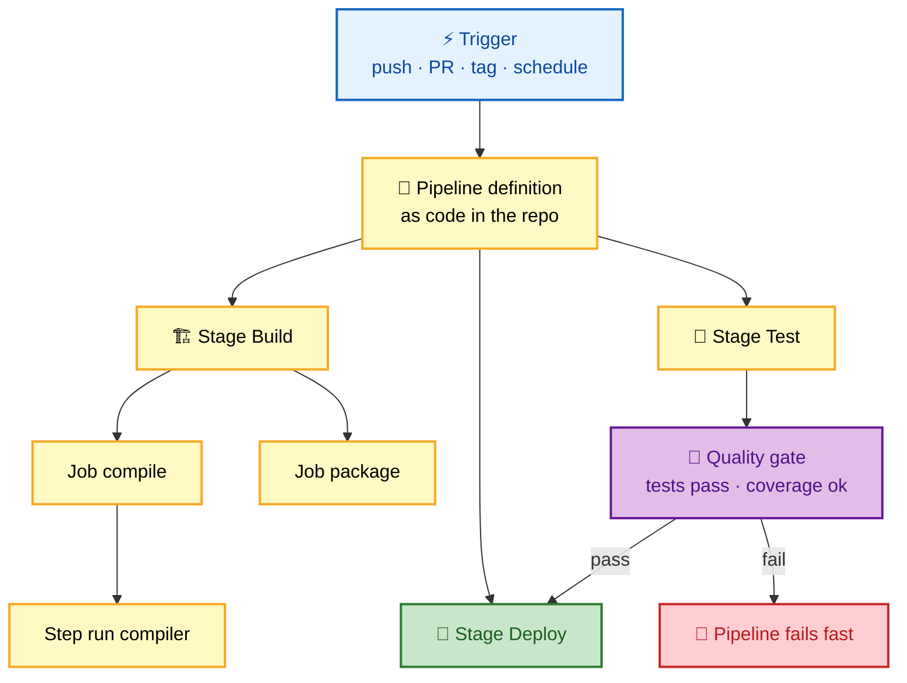
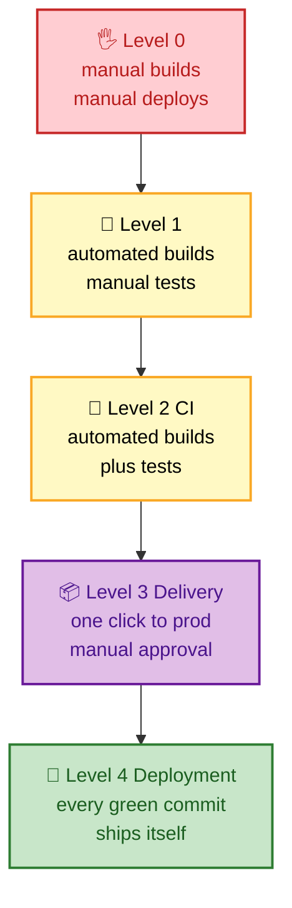

# SECTION 1: CI/CD FUNDAMENTALS

This section builds the ground truth every later section depends on: what the three "C"s actually
mean, the anatomy of a pipeline from commit to production, why an artifact is built once and
promoted, and how your branching model (trunk-based vs GitFlow) either enables or sabotages
continuous integration. Interviewers use this section to test whether you understand *continuous*
integration as a **team discipline**, not just "we have a build server."

## Subtopic Index
- [The Three Cs: CI vs Continuous Delivery vs Continuous Deployment](#the-three-cs-ci-vs-continuous-delivery-vs-continuous-deployment)
- [Anatomy of a Pipeline](#anatomy-of-a-pipeline)
- [Build, Test, and Deploy Stages](#build-test-and-deploy-stages)
- [Artifacts and Build-Once-Promote-Many](#artifacts-and-build-once-promote-many)
- [Branching Models: Trunk-Based vs GitFlow](#branching-models-trunk-based-vs-gitflow)
- [The Feedback Loop and Why Speed Matters](#the-feedback-loop-and-why-speed-matters)

---

## 🗺️ Visual Overview

**In one line:** CI/CD is a conveyor belt that turns a commit into running software with as few human hands and as much automated confidence as possible — and the whole discipline is about shortening the loop between "I wrote code" and "I know it works in production."

**Mind map — the whole section at a glance** (skim first, revisit last):

**The three Cs — where each one stops automating (blue = shared work, purple = the human gate, green = production):**

```mermaid
flowchart LR
    classDef start fill:#e3f2fd,stroke:#1565c0,color:#0d47a1,stroke-width:2px;
    classDef proc  fill:#fff9c4,stroke:#f9a825,color:#000,stroke-width:2px;
    classDef good  fill:#c8e6c9,stroke:#2e7d32,color:#1b5e20,stroke-width:2px;
    classDef bad   fill:#ffcdd2,stroke:#c62828,color:#b71c1c,stroke-width:2px;
    classDef ctrl  fill:#e1bee7,stroke:#6a1b9a,color:#4a148c,stroke-width:2px;
    classDef store fill:#ffe0b2,stroke:#e65100,color:#000,stroke-width:2px;
    subgraph CI["🔗 Continuous Integration stops here"]
      C["📥 Commit to trunk"] --> B["🔨 Build"] --> T["🧪 Automated tests"]
    end
    subgraph DEL["📦 Continuous Delivery adds"]
      R["📦 Release candidate ready"] --> G["🚦 Manual approval gate"]
    end
    subgraph DEP["🚀 Continuous Deployment adds"]
      D["✅ Auto deploy to prod"]
    end
    T --> R
    G --> D
    class C start
    class B,T proc
    class R store
    class G ctrl
    class D good
```

**Pipeline anatomy — trigger, stages, jobs, steps, gates (how the pieces nest):**

> 🧠 **Memory hooks (mnemonics):**
> - **Pipeline order — "Some Boys Test Deploy Openly":** **S**ource → **B**uild → **T**est → **D**eploy → **O**perate.
> - **The three Cs ladder:** *Integration* stops at **test**; *Delivery* stops at a **manual gate**; *Deployment* goes **all the way to prod**. "Delivery = deployable; Deployment = deployed."
> - **Build once:** *"Build once, promote many."* The same binary that passed staging is the one that hits prod — never rebuild per environment.
> - **Trunk rule:** *"Short branches, small commits, green trunk."* Long-lived branches are the enemy of *continuous* integration.

---

## The Three Cs: CI vs Continuous Delivery vs Continuous Deployment

> 🎯 **Interview weight: Very High** — the definitional question that opens almost every CI/CD interview. Get the one-liner exactly right.

**In one line:** Continuous **Integration** automates merge-and-test, Continuous **Delivery** keeps you *always releasable* behind a manual button, and Continuous **Deployment** removes that button so every green commit ships itself.

**Continuous Integration (CI)** is the practice of developers **merging to a shared trunk frequently** (at least daily), with every merge triggering an automated build and test run. The goal is to catch integration conflicts within minutes, not at the end of a sprint. CI is as much a *team habit* as a tool — a build server running on week-old feature branches is not CI.

**Continuous Delivery (CD)** extends CI so the codebase is **always in a deployable state**. Every change that passes the pipeline produces a release candidate that *could* go to production with a single click — but a human decides *when*. This suits regulated environments, coordinated marketing launches, or teams building confidence.

**Continuous Deployment** removes the human gate: **every commit that passes all automated checks deploys to production automatically**. This demands excellent test coverage, strong observability, and fast automated rollback — because there is no human safety net between merge and prod.

| Dimension | Continuous Integration | Continuous Delivery | Continuous Deployment |
|---|---|---|---|
| Automates through | Build + test | Build + test + release prep | Everything to prod |
| Prod trigger | N/A | **Manual** approval | **Automatic** |
| Prerequisite | Frequent merges, fast tests | CI + automated release | CD + great coverage + rollback |
| Risk per deploy | N/A | Low (batched, human-gated) | Lowest (tiny, frequent, monitored) |
| Rollback reliance | — | Moderate | **Critical** |

**Maturity ladder — climb one rung at a time:**

> 💡 **Interview tip:** The one-liner that lands: *"Continuous **Delivery** means every change is **deployable**; Continuous **Deployment** means every change is **deployed** automatically."* The only difference is a human approval gate.

> ⚠️ **Gotcha:** "CI" is *not* "we have a Jenkins server." True CI requires developers merging to trunk **frequently**. Long-lived feature branches that integrate once a week are the *opposite* of continuous integration — they defer the exact conflict CI exists to surface early.

> 🔍 **Deeper:** Continuous Deployment lowers *per-deploy* risk even though it deploys more often. A tiny, isolated change is trivial to diagnose and revert; a quarterly "big bang" of 300 commits is a debugging nightmare. This is the counterintuitive core of DORA's research — **deploy more often to be safer**, covered in [Section 6](./06-RELEASE-OBSERVABILITY.md).

---

## Anatomy of a Pipeline

> 🎯 **Interview weight: High** — you must be able to name the layers and explain what each does when asked to "walk me through your pipeline."

**In one line:** A pipeline is a **trigger** that fires an ordered set of **stages**, each containing **jobs** made of **steps**, with **gates** that block promotion until conditions are met.

The nesting hierarchy (terms vary by tool but the concept is universal):

- **Trigger / Event** — what starts a run: a push, a pull request, a tag, a schedule (cron), or a manual dispatch.
- **Pipeline** — the whole definition, ideally *as code* stored in the repo next to the app (see [Section 2](./02-PIPELINE-DESIGN.md)).
- **Stage** — a logical phase (Build, Test, Deploy). Stages usually run sequentially; a later stage starts only if the earlier one passed.
- **Job** — a unit of work within a stage that runs on a single executor/runner. Jobs in the same stage often run in **parallel**.
- **Step** — the atomic command (`npm ci`, `docker build`, `pytest`).
- **Gate** — a condition (all tests pass, coverage ≥ threshold, manual approval) that must be satisfied before the pipeline promotes the artifact to the next stage or environment.

| Concept | What it is | Runs how | Example |
|---|---|---|---|
| Trigger | The event that starts the run | Once | `push` to `main` |
| Stage | A phase of the pipeline | Sequential | `build` → `test` → `deploy` |
| Job | Work on one executor | Parallel within a stage | "unit tests", "lint" |
| Step | A single command | Sequential within a job | `run: pytest` |
| Gate | A promotion condition | Blocks | "require 2 approvals for prod" |

> 💡 **Interview tip:** When asked to design a pipeline, *speak the hierarchy*: "The push triggers the pipeline; the build stage has parallel compile and package jobs; the test stage gates on coverage; then a manual gate promotes to prod." That single sentence signals you understand the model.

---

## Build, Test, and Deploy Stages

> 🎯 **Interview weight: High** — the substance of every pipeline. Know what each stage is responsible for and the failure modes.

**In one line:** Build turns source into a runnable artifact, Test proves the artifact behaves, and Deploy places that *same* artifact into an environment.

**Source stage** — checks out the exact commit, resolves dependencies, and often computes a version/tag. Everything downstream is pinned to this immutable revision.

**Build stage** — compiles, bundles, and packages into a deployable **artifact** (a JAR, a container image, a static bundle). Key rule: this happens **once**. The build should be **reproducible** — the same source produces the same artifact — which is why dependency versions are pinned and build environments are isolated.

**Test stage** — runs the pyramid (unit → integration → E2E; see [Section 4](./04-TESTING-QUALITY.md)) against the built artifact. Fast, cheap tests run first so failures surface in minutes.

**Deploy stage** — promotes the artifact into an environment (dev → staging → prod) using a rollout strategy (blue-green, canary, rolling; see [Section 3](./03-DEPLOYMENT-STRATEGIES.md)). Deploy should never rebuild — it takes the already-tested artifact and places it.

**Operate stage** — not strictly part of "CI/CD" but the closing link: monitoring, alerting, and the DORA signals ([Section 6](./06-RELEASE-OBSERVABILITY.md)) that feed back into the next commit.

> ⚠️ **Gotcha:** A pipeline that runs `docker build` *in every environment's deploy step* is subtly broken — you've now shipped a **different** binary to prod than the one you tested in staging (different base-image digest, different transient dependency). Build the artifact once and promote that exact digest.

---

## Artifacts and Build-Once-Promote-Many

> 🎯 **Interview weight: High** — the "build once" principle is a senior-level litmus test.

**In one line:** An artifact is an **immutable, versioned output** of the build stage; you build it once and *promote* that identical thing across environments instead of rebuilding.

An **artifact** is the packaged output of a build — a container image, a language package (npm, Maven, PyPI), a compiled binary, or a static site bundle. It is stored in an **artifact registry** (a container registry, Artifactory, Nexus, a package registry) under an **immutable tag** — ideally the content digest (e.g., `sha256:…`) or an immutable version like `1.4.2`, never a mutable tag like `latest`.

**Build-once-promote-many** means the *same* artifact that passed the test stage is the one deployed to staging and then production. The environment differences (database URLs, feature flags, replica counts) are injected as **configuration at deploy/runtime**, not baked into the artifact.

| Anti-pattern | Why it breaks | Fix |
|---|---|---|
| Rebuild per environment | Prod binary ≠ tested binary | Build once, promote the digest |
| Deploy `:latest` | Non-reproducible; can't roll back to a known bit | Immutable tags / content digests |
| Bake config into the image | One image per env; can't promote | Inject config at runtime |
| Mutable tags overwritten | "Works in staging, broken in prod" with same tag | Never overwrite a published tag |

> 💡 **Interview tip:** Tie "build once" to **rollback**: because the artifact is immutable and versioned, rollback is just "re-point the environment at the previous known-good digest" — instant and deterministic. Rebuilding to roll back reintroduces the exact risk you're trying to escape.

> 🔍 **Deeper:** Immutable artifacts are also the foundation of **supply-chain security** — you can sign a digest and verify that signature before deploy (see [Section 5](./05-SECURITY-DEVSECOPS.md)). You cannot meaningfully sign a `latest` tag that changes under you.

---

## Branching Models: Trunk-Based vs GitFlow

> 🎯 **Interview weight: High** — the "why does your branching model matter for CI?" question separates people who *do* CI from people who *have a CI tool*.

**In one line:** Trunk-based development keeps branches **short-lived and merged daily** so integration is continuous; GitFlow uses **long-lived branches** (develop, release, feature) that batch integration and fight against the "continuous" in CI.

**Trunk-based development (TBD):** Everyone commits to a single `main`/trunk, or uses branches that live **hours to a day** and merge back fast. Incomplete work is hidden behind **feature flags** rather than kept on a branch. This maximizes integration frequency — conflicts surface immediately while they're tiny. TBD is the branching model the DORA research associates with elite performers.

**GitFlow:** A structured model with permanent `main` and `develop` branches plus `feature/*`, `release/*`, and `hotfix/*` branches. It provides clear release staging but encourages **long-lived branches**, which defer integration and produce painful "merge hell" when a feature branch has drifted from trunk for weeks.

| Aspect | Trunk-Based | GitFlow |
|---|---|---|
| Branch lifetime | Hours to a day | Days to weeks |
| Integration frequency | Continuous (many/day) | Batched (per feature/release) |
| Incomplete work | Feature flags | Lives on a branch |
| Merge conflict risk | Low (small, frequent) | High (large, infrequent) |
| Release model | Continuous delivery/deployment | Scheduled releases |
| Best for | High-velocity web/services | Versioned products, multiple supported releases |

> ⚠️ **Gotcha:** GitFlow and *continuous* deployment are in tension. If your "develop" branch integrates weekly, you are batching — the opposite of continuous. Many teams claim CI/CD but run GitFlow with week-long feature branches; interviewers probe exactly this contradiction.

> 💡 **Interview tip:** The nuance that impresses: *"Trunk-based doesn't mean no branches — it means branches that live less than a day and merge behind feature flags."* Then connect flags to [Section 3](./03-DEPLOYMENT-STRATEGIES.md): flags decouple *deploy* from *release*, which is what makes TBD safe.

---

## The Feedback Loop and Why Speed Matters

> 🎯 **Interview weight: Medium** — the "why do you care about pipeline speed?" question. Tie it to developer behavior, not just impatience.

**In one line:** The value of a pipeline is inversely proportional to how long it takes to tell a developer they broke something — a 10-minute loop keeps context fresh; a 60-minute loop breaks flow and encourages batching.

Fast feedback matters for behavioral reasons, not just convenience:

- **Context is fresh.** A developer who learns of a failure in 8 minutes still has the change in their head; one who learns 90 minutes later has moved on and must re-load context.
- **Blame localization.** Frequent small runs mean a failure points to *one* small change. Infrequent runs bundle many changes, and bisecting which one broke is expensive.
- **Batching avoidance.** Slow pipelines push developers to batch changes ("I'll wait and push everything at once"), which increases per-deploy risk — the exact thing CI/CD fights.

The classic target: **< 10 minutes** from commit to a pass/fail signal for the CI stage. Techniques to hit it — parallelization, caching, test splitting, fail-fast ordering — are covered in [Section 2](./02-PIPELINE-DESIGN.md).

> 🧠 **Remember:** A pipeline's *reliability* matters as much as its speed. A fast but flaky pipeline (see [Section 4](./04-TESTING-QUALITY.md)) trains developers to ignore red builds — "just re-run it" — which quietly destroys the trust the whole system depends on.

---

## Interview Questions & Answers

**Q1: What is the difference between Continuous Delivery and Continuous Deployment, and how do you decide which one a team should adopt?**

**Answer:** Both automate the pipeline all the way to a production-ready release; the only difference is the **production trigger**. Continuous Delivery stops at a **manual approval gate** — every change is *deployable* with one click, but a human decides when. Continuous Deployment removes that gate — every commit passing all checks **deploys itself**.

**Reasoning:** The deciding factor is *confidence and constraints*, not sophistication. You choose Delivery when you have regulatory sign-off requirements, coordinated launches, or test coverage you don't fully trust yet. You choose Deployment when you have high coverage, strong observability, and reliable automated rollback — then removing the human gate actually *reduces* risk by forcing small, frequent, well-monitored changes.

**Follow-up:** *"What must be true before you'd turn off the manual gate?"* — Reliable automated rollback, a canary/progressive rollout with automated metric analysis, high-confidence tests including contract tests, and alerting tight enough to catch a bad deploy within minutes.

---

**Q2: Explain "build once, promote many" and what breaks when a team violates it.**

**Answer:** Build the deployable artifact exactly once, store it immutably (by digest/version), and promote that *same* artifact through dev → staging → prod, injecting environment differences as runtime config.

**Reasoning:** If you rebuild per environment, the binary in prod is not the binary you tested — a different base-image digest or a newly-published transient dependency can slip in, so staging validation no longer guarantees prod behavior. It also breaks rollback: with an immutable artifact, rollback is re-pointing to a known-good digest; rebuilding to roll back reintroduces variability. Finally, you can't sign-and-verify a mutable `latest` tag, so supply-chain integrity collapses too.

**Follow-up:** *"How do you handle environment-specific config then?"* — Keep the artifact config-free; inject config via environment variables, mounted config/secrets, or a config service at deploy/runtime. Twelve-factor's "config in the environment" principle.

---

**Q3: A team says they "do CI/CD" but uses week-long feature branches. What's wrong, and what would you change?**

**Answer:** They have CI *tooling* but not CI *practice*. Week-long branches defer integration — the exact conflict CI exists to surface early — so they get "merge hell" and integration bugs discovered late, which is the opposite of *continuous* integration.

**Reasoning:** Continuous Integration is a team discipline of merging to trunk frequently (at least daily). The fix is a move toward **trunk-based development**: break work into small increments merged daily, and hide incomplete features behind **feature flags** instead of on branches. This keeps trunk always green and conflicts tiny.

**Follow-up:** *"How do you merge half-finished work without breaking prod?"* — Feature flags: the code ships dark (disabled), gets integrated and tested continuously, and is enabled independently of deploy. This decouples deploy from release.

---

**Q4: Why is a slow CI pipeline a correctness problem and not just an annoyance?**

**Answer:** Slow pipelines change developer behavior in harmful ways: developers lose context by the time they learn of a failure, failures bundle many changes so blame is hard to localize, and slowness pushes people to **batch** changes — which increases per-deploy blast radius, the very risk CI/CD is meant to reduce.

**Reasoning:** The pipeline's job is fast, trustworthy feedback. Below ~10 minutes, developers stay in flow and fix issues while context is fresh. Above that, the loop breaks down and the pipeline stops shaping behavior, eroding the discipline that makes continuous integration work.

**Follow-up:** *"How would you speed one up?"* — Parallelize independent jobs, cache dependencies and build layers, split/shard tests, order fast cheap checks first (fail-fast), and only run expensive E2E on a subset or post-merge. Details in [Section 2](./02-PIPELINE-DESIGN.md).

---

## ✅ Best Practices

- **Merge to trunk daily** and keep branches short-lived; hide incomplete work behind feature flags.
- **Build the artifact once**, tag it immutably (digest/version), and promote that exact thing — never rebuild per environment.
- **Inject config at runtime**, keeping artifacts environment-agnostic.
- **Order stages fail-fast**: cheap, fast checks first so failures surface in minutes.
- **Target < 10 minutes** for the core CI feedback signal.
- **Treat the pipeline definition as code** in the repo, versioned and reviewed like application code.
- **Make builds reproducible** by pinning dependency and base-image versions.

## 📚 Documentation & Further Reading

- [Martin Fowler — Continuous Integration](https://martinfowler.com/articles/continuousIntegration.html)
- [Continuous Delivery (Humble & Farley) — official site](https://continuousdelivery.com/)
- [Trunk-Based Development](https://trunkbaseddevelopment.com/)
- [The Twelve-Factor App — Config](https://12factor.net/config)
- [DORA — DevOps capabilities](https://dora.dev/capabilities/)

---

**[← Back to CI/CD Index](./README.md)** | **[Next: Section 2 — Pipeline Design →](./02-PIPELINE-DESIGN.md)**
