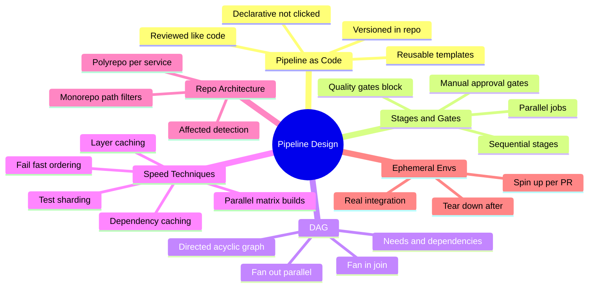
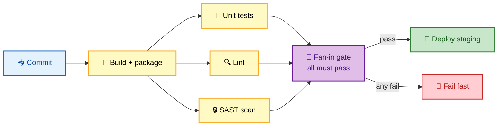
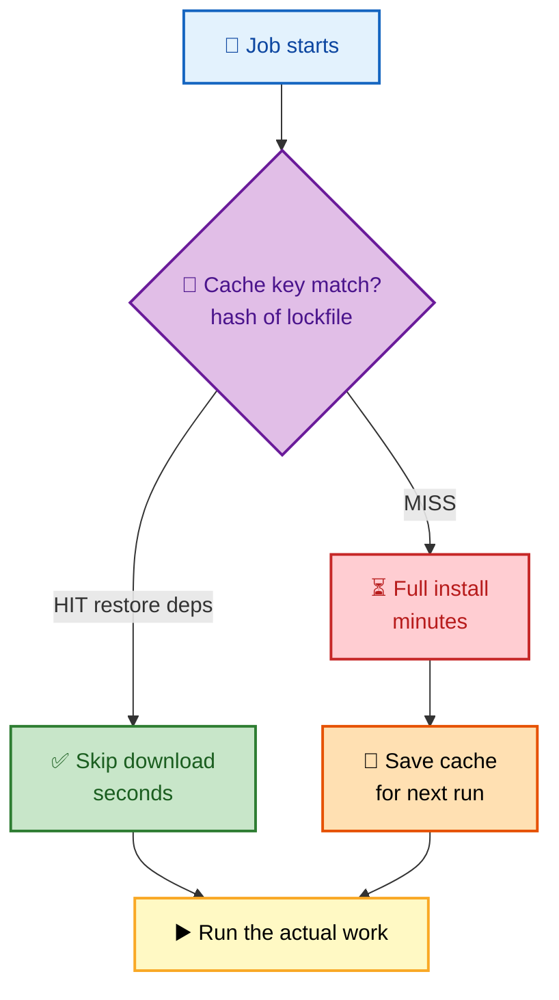

# SECTION 2: PIPELINE DESIGN

This section is about how the conveyor belt is actually *wired*: expressing pipelines as code,
sequencing stages and gates, and — the part interviewers push hardest on — making pipelines **fast
and correct at scale** through caching, parallelization, and dependency graphs. It also covers the
architectural fork that shapes every pipeline decision: monorepo vs polyrepo, and how ephemeral
environments give you production-like testing without permanent infrastructure.

## Subtopic Index
- [Pipeline as Code](#pipeline-as-code)
- [Stages, Jobs, and Gates](#stages-jobs-and-gates)
- [The Pipeline DAG: Fan-Out and Fan-In](#the-pipeline-dag-fan-out-and-fan-in)
- [Parallelization and Matrix Builds](#parallelization-and-matrix-builds)
- [Caching and Artifacts Between Jobs](#caching-and-artifacts-between-jobs)
- [Monorepo vs Polyrepo Pipelines](#monorepo-vs-polyrepo-pipelines)
- [Ephemeral Environments](#ephemeral-environments)

---

## 🗺️ Visual Overview

**In one line:** Good pipeline design is a dependency graph that runs everything independent in parallel, caches everything reused, gates everything risky, and tests only what changed.

**Mind map — the whole section at a glance** (skim first, revisit last):

**A pipeline DAG — fan-out to parallel work, fan-in to a gate (blue = trigger, yellow = parallel, purple = gate, green = deploy):**

**Cache hit vs miss — where the time goes (green = fast cached path, red = slow cold path):**

> 🧠 **Memory hooks (mnemonics):**
> - **Speed levers — "PCS-FF":** **P**arallelize, **C**ache, **S**hard tests, **F**ail-**F**ast ordering.
> - **DAG shape:** *"Fan-**out** to do work, fan-**in** to decide."* Out = parallelism; in = a gate.
> - **Cache key rule:** *"Key on the lockfile hash."* Change a dependency → key changes → cache correctly misses.
> - **Monorepo rule:** *"Only build what changed."* Path filters + affected-detection or the pipeline scales badly.

---

## Pipeline as Code

> 🎯 **Interview weight: Very High** — the baseline expectation at senior level. Clicking pipelines together in a UI is a red flag.

**In one line:** The pipeline definition lives **in the repository as a versioned, reviewed file** — so it evolves with the app, is auditable, and can be rolled back exactly like application code.

**Pipeline as code** means the entire CI/CD definition is a declarative file (YAML/HCL/Groovy) committed alongside the application. This delivers:

- **Version control** — every pipeline change is a diff with an author, reviewable in a PR and revertable.
- **Auditability** — you can answer "who changed the deploy step and when" from git history.
- **Consistency** — the same definition runs for every branch and every developer; no snowflake UI config.
- **Reusability** — templates/shared libraries/reusable workflows let many services inherit one hardened pipeline.

| Property | Pipeline-as-code | UI-clicked pipeline |
|---|---|---|
| History & audit | Full git history | Opaque, no diff |
| Review | PR review | None |
| Rollback | `git revert` | Manual reconstruction |
| Reuse across repos | Templates/libraries | Copy-paste |
| Drift risk | Low (declared) | High (manual edits) |

> ⚠️ **Gotcha:** "Pipeline as code" in the repo you're building creates a chicken-and-egg security problem — a PR can modify the pipeline that runs the PR. This is why **pull-request pipelines from forks run with reduced privileges** and secrets are gated behind branch/environment protection (see [Section 5](./05-SECURITY-DEVSECOPS.md)).

> 💡 **Interview tip:** Mention **reusable templates** as the scaling story: at 200 services you don't want 200 hand-written pipelines — you want one reviewed template that each service references, so a security fix to the pipeline rolls out everywhere at once.

---

## Stages, Jobs, and Gates

> 🎯 **Interview weight: High** — the vocabulary of pipeline structure and the mechanism that enforces quality.

**In one line:** Stages sequence *phases*, jobs parallelize *work within a phase*, and gates are the *conditions* that must be true before the artifact is promoted.

**Stages** run in order and represent phases (build → test → deploy). A stage typically starts only if the prior stage succeeded, which gives the fail-fast property.

**Jobs** within a stage usually run in **parallel** on independent executors — e.g., "unit tests", "lint", and "SAST" all run at once in the test stage.

**Gates** are promotion conditions. Two flavors:

- **Automated/quality gates** — objective thresholds: all tests pass, coverage ≥ 80%, zero critical CVEs, performance within budget. Covered in [Section 4](./04-TESTING-QUALITY.md).
- **Manual/approval gates** — a human (or set of approvers) authorizes promotion, typically before production in a Continuous *Delivery* model.

> 🔍 **Deeper:** Gates should be **objective and fast to evaluate** where possible. A manual gate that a tired on-call rubber-stamps at 2 a.m. adds process without safety. Prefer automated metric-based gates (canary analysis) for the highest-risk step and reserve human gates for genuine business/compliance decisions.

---

## The Pipeline DAG: Fan-Out and Fan-In

> 🎯 **Interview weight: High** — "how do you make a pipeline fast" almost always leads here.

**In one line:** A modern pipeline is a **directed acyclic graph** where each job declares its dependencies, so the engine runs everything independent concurrently (fan-out) and joins at synchronization points (fan-in).

Rather than a rigid linear list of stages, expressing the pipeline as a **DAG** (`needs`/`depends_on` edges) lets the engine maximize parallelism: a job runs as soon as *its* dependencies finish, not when an entire prior stage finishes.

- **Fan-out** — one job triggers many parallel successors (build → unit + lint + SAST + integration prep).
- **Fan-in** — many parallel jobs converge on one (all test jobs → a single deploy gate that requires them all green).

| Model | How it schedules | Speed | Example |
|---|---|---|---|
| Linear stages | Whole stage must finish before next | Slower (waits on slowest in each stage) | build → test → deploy |
| DAG (`needs`) | Job starts when *its* deps finish | Faster (fine-grained parallelism) | deploy waits only on the tests it needs |

> 💡 **Interview tip:** The insight to state: *"A DAG lets a fast job's dependents start immediately instead of waiting for the slowest job in the same stage."* That's the difference between stage-gated and dependency-gated scheduling.

> ⚠️ **Gotcha:** "Acyclic" matters — a dependency cycle (A needs B, B needs A) is undeployable and most engines reject it at parse time. When composing reusable jobs, watch for accidental cycles through shared templates.

---

## Parallelization and Matrix Builds

> 🎯 **Interview weight: High** — the most common concrete speed technique.

**In one line:** Run independent work at the same time — across services, across test shards, and across a **matrix** of dimensions (OS × language version × arch) — to collapse wall-clock time.

Two parallelism patterns dominate:

- **Job parallelism** — independent jobs (lint, unit, SAST) run concurrently on separate executors.
- **Matrix builds** — one job definition expands into N parallel runs across a combination of variables, e.g. test on `{ubuntu, windows} × {node18, node20, node22}` = 6 parallel jobs. Essential for libraries that must support many runtimes.

**Test sharding** is parallelism applied to a single large test suite: split 10,000 tests across 10 runners so each runs ~1,000, cutting a 30-minute suite to ~3 minutes.

> ⚠️ **Gotcha:** Parallelism has diminishing returns and real costs. More concurrent runners = more compute spend, and shared state (a single test database, a rate-limited external API) can turn parallel jobs into a **contention** or **flakiness** source. Isolate state per shard (ephemeral DB per job) before you scale parallelism up.

> 🔍 **Deeper:** The theoretical ceiling is **Amdahl's law** — if 20% of the pipeline is inherently serial (a required deploy gate, a single build), no amount of parallelism takes you below that 20%. Profile to find the serial bottleneck before adding runners.

---

## Caching and Artifacts Between Jobs

> 🎯 **Interview weight: High** — caching is the other half of "make it fast," and cache *correctness* is a favorite trap.

**In one line:** Cache expensive-to-recreate inputs (dependencies, build layers) keyed on a hash of what they depend on, and pass build *outputs* between jobs as artifacts — but never let a stale cache poison a build.

**Dependency caching** — restore `node_modules`, `~/.m2`, `pip` wheels, etc. from a prior run instead of re-downloading. The **cache key** must be a hash of the lockfile (`package-lock.json`, `pom.xml`): if dependencies change, the key changes and the cache correctly misses.

**Layer caching** — container builds reuse unchanged image layers, so only changed layers rebuild.

**Artifacts between jobs** — the build job produces the binary; downstream test and deploy jobs **consume** it rather than rebuilding. This enforces "build once" *within* a single pipeline run.

| Mechanism | Caches/passes | Key/scope | Failure mode |
|---|---|---|---|
| Dependency cache | Downloaded deps | Hash of lockfile | Stale if keyed loosely |
| Layer cache | Image layers | Layer content hash | Cache poisoning on shared runners |
| Build artifact | Job *output* | This pipeline run | Missing if not declared |

> ⚠️ **Gotcha — cache poisoning & staleness:** If your cache key is too coarse (e.g., keyed only on branch name), a stale cache can silently inject wrong dependencies — "works on my machine, broken in CI" in reverse. Always key on the **content** that the cache depends on (lockfile hash), and treat caches as a *speed optimization that must be safe to delete*. A build that *depends* on a warm cache to be correct is broken.

> 💡 **Interview tip:** Distinguish **cache** (reconstructable speed optimization, safe to lose) from **artifact** (the actual deliverable, must be preserved). Interviewers listen for whether you conflate the two.

---

## Monorepo vs Polyrepo Pipelines

> 🎯 **Interview weight: High** — an architectural decision with direct pipeline consequences.

**In one line:** A **monorepo** holds many projects in one repo (build only what changed via path filters and affected-detection); a **polyrepo** gives each service its own repo and pipeline (simple isolation, harder cross-cutting changes).

**Monorepo** — one repository, many services/libraries. Pipelines must be **selective**: a commit touching one service should not rebuild all 200. This requires **path filters** (trigger jobs only when relevant paths change) and **affected/impacted detection** (build the changed project *plus everything that depends on it*, using the dependency graph). Tools like Nx, Bazel, and Turborepo specialize in this.

**Polyrepo** — one repository per service, each with its own independent pipeline. Isolation is automatic (a commit only triggers that repo's pipeline), but **cross-cutting changes** (a shared library bump affecting 12 services) require coordinating 12 PRs across 12 repos.

| Dimension | Monorepo | Polyrepo |
|---|---|---|
| Cross-cutting change | One atomic PR | Many coordinated PRs |
| Pipeline complexity | High (needs affected-detection) | Low (isolated per repo) |
| Build scope control | Path filters required | Automatic isolation |
| Dependency versioning | One version, in-repo | Per-repo, published packages |
| Tooling | Nx, Bazel, Turborepo | Native per-repo CI |
| Scaling risk | Slow builds without selective CI | Coordination overhead |

> ⚠️ **Gotcha:** The monorepo failure mode is the **"rebuild the world"** pipeline — every commit runs every test, so CI time grows with the *repo*, not the *change*. Without affected-detection, a monorepo's pipeline becomes unusably slow as it grows; this is the #1 thing interviewers probe about monorepos.

> 💡 **Interview tip:** Neither is universally "better." The trade-off is **atomic cross-cutting changes (monorepo)** vs **automatic isolation and simpler CI (polyrepo)**. State the trade-off, then pick based on how coupled the services are.

---

## Ephemeral Environments

> 🎯 **Interview weight: Medium-High** — a modern practice that impresses when you can explain the mechanics.

**In one line:** Spin up a **fresh, production-like environment per pull request**, run real integration/E2E tests against it, then **tear it down** — giving high-fidelity testing without maintaining permanent shared environments.

An **ephemeral (or preview) environment** is created on demand for a PR: the pipeline provisions an isolated namespace/stack, deploys the changed services with test config, runs integration and E2E suites against real dependencies, and destroys everything when the PR merges or closes.

Benefits:

- **High fidelity** — tests run against a real deployment, catching config/wiring bugs unit tests miss.
- **Isolation** — each PR gets its own environment, so tests don't collide on a shared staging box.
- **Reviewer preview** — stakeholders can click a live URL to review the change.

Costs and cautions:

- **Compute cost** — many concurrent environments add spend; enforce TTL/auto-teardown.
- **Provisioning time** — must be fast (minutes) or it dominates pipeline time; lean on cached images and IaC.
- **Data** — needs seed/synthetic data, never a copy of production PII.

> 🔍 **Deeper:** Ephemeral environments are the practical answer to "how do you get realistic integration testing without a permanent staging bottleneck?" They pair naturally with **Kubernetes namespaces** or **IaC stacks** as the isolation primitive, and with **TestContainers** for spinning real dependencies (databases, brokers) inside the test job.

---

## Interview Questions & Answers

**Q1: How would you take a linear 40-minute pipeline down to under 10 minutes without dropping coverage?**

**Answer:** Profile first to find where time goes, then apply the speed levers in order of payoff: (1) **parallelize** independent jobs (lint, unit, SAST run concurrently instead of in series); (2) **cache** dependencies keyed on the lockfile hash and reuse container layers; (3) **shard** the large test suite across N runners; (4) reorder to **fail-fast** — cheap checks first so most failures surface in a minute; (5) move the slowest, least-frequently-failing suites (full E2E) to post-merge or a nightly run rather than blocking every PR.

**Reasoning:** Coverage is preserved because you're not deleting tests — you're running them concurrently, reusing work, and rescheduling the rare expensive ones. The dominant win is usually converting a linear stage list into a **DAG** so a fast job's dependents start immediately.

**Follow-up:** *"What's the floor?"* — Amdahl's law: the inherently serial part (single build, required deploy gate) sets the minimum. Find and attack the serial bottleneck; parallelism can't go below it.

---

**Q2: Your monorepo's CI now takes 45 minutes on every commit because it rebuilds everything. How do you fix it?**

**Answer:** Introduce **affected-detection**: use the dependency graph to build and test only the changed project plus its downstream dependents, and add **path filters** so jobs trigger only when relevant paths change. Tools like Nx/Bazel/Turborepo compute the affected set from the commit diff.

**Reasoning:** The problem is that CI time is scaling with the *repo* instead of the *change*. Selective builds make CI time proportional to blast radius — a one-line change to one service tests that service and its dependents, not all 200.

**Follow-up:** *"How do you know what's 'affected'?"* — From the build tool's dependency graph: hash inputs per project, and rebuild a project if its own files or any dependency's inputs changed. This is also how these tools cache: unchanged projects restore cached results.

---

**Q3: A developer complains "it passed locally but CI installed the wrong dependency version." How is that possible with caching, and how do you prevent it?**

**Answer:** The cache key was too coarse — likely keyed on branch name rather than the lockfile hash — so CI restored a **stale** dependency cache that didn't match the current lockfile. The fix is to key the cache on a **hash of the lockfile** so any dependency change invalidates the cache, and to treat caches as safe-to-delete speed optimizations, never as a source of truth.

**Reasoning:** A correct build must be reproducible from source alone; a cache should only ever *speed up* reconstructing the same result. If deleting the cache changes the build output, the cache is masking a correctness bug.

**Follow-up:** *"What about cache poisoning on shared runners?"* — Use isolated/ephemeral runners or scope caches per repo/key so one job can't write a cache another job trusts; verify integrity for anything security-sensitive.

---

**Q4: When would you choose a monorepo over polyrepo for a platform of 30 microservices?**

**Answer:** Choose **monorepo** when the services are tightly coupled and you frequently make cross-cutting changes (shared libraries, API contracts) that you want to land **atomically** in one PR with one review. Choose **polyrepo** when services are independently owned and released, and you value automatic pipeline isolation over atomic cross-cutting changes.

**Reasoning:** The core trade-off is atomic cross-cutting change (monorepo) vs automatic isolation and simpler CI (polyrepo). At 30 tightly-coupled services, the monorepo's atomic refactors usually outweigh the cost of building affected-detection; at 30 independently-owned services, polyrepo's isolation wins.

**Follow-up:** *"What's the monorepo's biggest operational risk?"* — The "rebuild the world" pipeline. You must invest in affected-detection and caching up front, or CI becomes the bottleneck as the repo grows.

---

## ✅ Best Practices

- **Express pipelines as code** in the repo; review and version them like application code.
- **Model the pipeline as a DAG** with explicit `needs` to maximize parallelism.
- **Parallelize** independent jobs and **shard** large test suites.
- **Cache on content hashes** (lockfiles), and treat caches as safe-to-delete optimizations.
- **Pass build outputs as artifacts** between jobs to enforce build-once within a run.
- **Use affected-detection and path filters** in monorepos so CI scales with the change, not the repo.
- **Order fail-fast**: cheapest, most-likely-to-fail checks first.
- **Use ephemeral environments** with enforced TTL for high-fidelity, isolated integration testing.

## 📚 Documentation & Further Reading

- [GitHub Actions — Using jobs and `needs`](https://docs.github.com/en/actions/using-jobs/using-jobs-in-a-workflow)
- [GitLab CI — DAG / `needs`](https://docs.gitlab.com/ee/ci/directed_acyclic_graph/)
- [Nx — Affected commands](https://nx.dev/ci/features/affected)
- [Bazel — Build & test](https://bazel.build/)
- [Monorepo vs Polyrepo (monorepo.tools)](https://monorepo.tools/)

---

**[← Previous: Section 1 — Fundamentals](./01-FUNDAMENTALS.md)** | **[Next: Section 3 — Deployment Strategies →](./03-DEPLOYMENT-STRATEGIES.md)**
