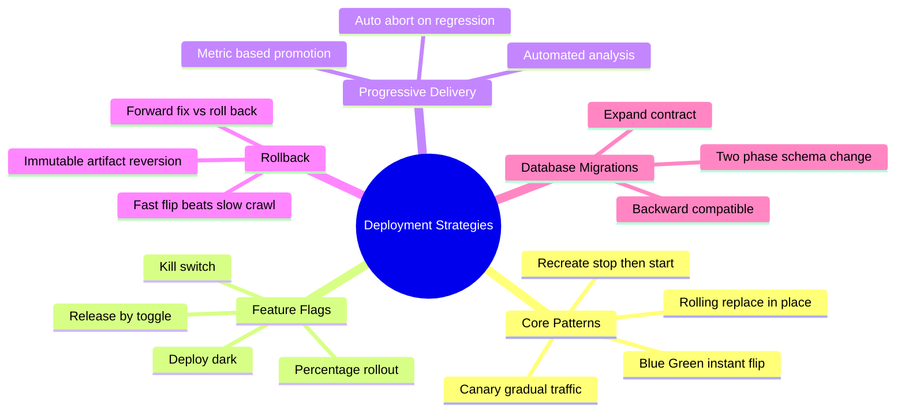
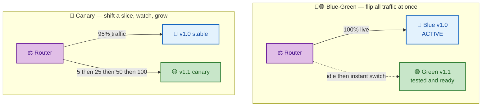
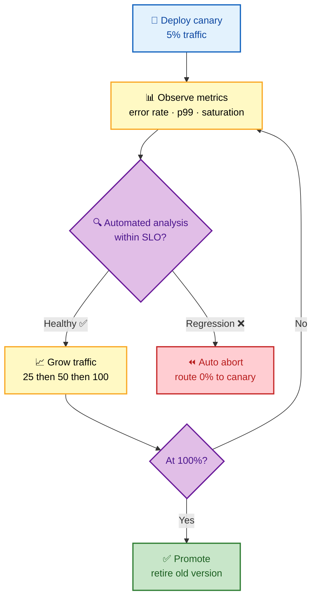
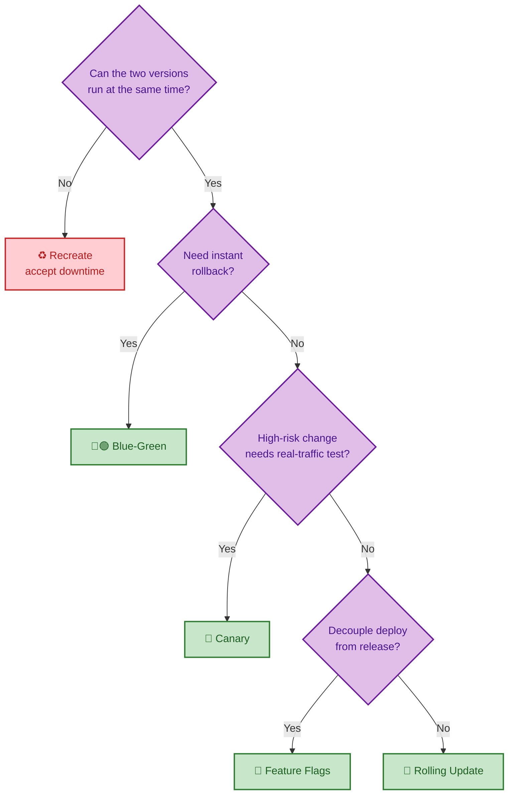

# SECTION 3: DEPLOYMENT STRATEGIES

This is the single most-asked CI/CD design topic. This section covers how you put new code in front
of users without breaking them: the four core rollout patterns (blue-green, canary, rolling,
recreate), how **feature flags** decouple deploy from release, how **progressive delivery** uses
automated metric analysis to promote or abort, and the two things that make *any* strategy dangerous
— **database migrations** and **unreliable rollback**. Know the trade-offs cold; you will be asked to
defend a choice.

## Subtopic Index
- [The Four Core Strategies](#the-four-core-strategies)
- [Blue-Green Deployment](#blue-green-deployment)
- [Canary Deployment](#canary-deployment)
- [Rolling Update](#rolling-update)
- [Recreate](#recreate)
- [Feature Flags: Decoupling Deploy from Release](#feature-flags-decoupling-deploy-from-release)
- [Progressive Delivery and Automated Analysis](#progressive-delivery-and-automated-analysis)
- [Rollback and Database Migrations](#rollback-and-database-migrations)

---

## 🗺️ Visual Overview

**In one line:** Every deployment strategy is a different answer to one question — *how do you limit the blast radius while you gain confidence the new version is healthy* — trading extra infrastructure, rollout speed, and complexity against how fast and safely you can undo a mistake.

**Mind map — the whole section at a glance** (skim first, revisit last):

**Blue-green vs canary — the two headline strategies side by side:**

**Canary with automated analysis — the promote-or-abort loop (the senior-level diagram):**

> 🧠 **Memory hooks (mnemonics):**
> - **Deploy strategies — "BCRF":** **B**lue-green (flip), **C**anary (creep), **R**olling (replace), **F**eature-flag (toggle).
> - **Rollback rule:** *"Fast flip beats slow crawl"* — blue-green and feature flags roll back instantly; rolling rolls back one batch at a time.
> - **Deploy vs release:** *"Deploy the code, release the feature."* Feature flags put those on separate switches.
> - **Migrations:** *"Expand, migrate, contract."* Add the new schema, move data, remove the old — never rename in one shot.

---

## The Four Core Strategies

> 🎯 **Interview weight: Very High** — you must be able to compare all four and pick one for a scenario.

**In one line:** Blue-green flips between two full environments, canary shifts traffic gradually to a small new slice, rolling replaces instances batch-by-batch in place, and recreate stops the old then starts the new (accepting downtime).

**Strategy chooser — trade-offs at a glance:**

| Strategy | Rollback speed | Extra infra | Blast radius | Downtime | Best for |
|---|---|---|---|---|---|
| 🔵🟢 Blue-Green | ⚡ Instant | 2× (two full envs) | All-or-nothing | Zero | Mission-critical, fast rollback |
| 🐤 Canary | 🟢 Fast | Small (a few new instances) | Tiny (a %) | Zero | High-risk changes, metric-gated |
| 🔁 Rolling | 🟡 Slower | None | Gradual | Zero | Standard stateless apps |
| ♻️ Recreate | 🟡 Full redeploy | None | All-or-nothing | **Yes** | Dev, or when versions can't coexist |
| 🚩 Feature flags | ⚡ Instant toggle | None | Per-user/% | Zero | Decoupling release from deploy |

**Decision tree — pick the right rollout:**

---

## Blue-Green Deployment

> 🎯 **Interview weight: Very High** — the classic "instant rollback" strategy.

**In one line:** Run **two identical production environments** — Blue (live) and Green (idle) — deploy and fully test the new version on Green, then flip the router so 100% of traffic moves to Green instantly; rollback is flipping back to Blue.

**How it works:** Blue serves all traffic on v1.0. You deploy v1.1 to the idle Green environment, run smoke and health checks against it while it takes *no* live traffic, then switch the load balancer/DNS to point at Green. If something breaks, you switch back to Blue — an **instant, deterministic rollback** because Blue is still running, untouched.

**Trade-offs:**

- ✅ **Instant rollback** — the old environment is still warm.
- ✅ **Full pre-production testing** on real infrastructure before the flip.
- ✅ **Zero downtime** — the switch is atomic.
- ❌ **2× infrastructure cost** — you run two full environments (at least during the deploy window).
- ❌ **Database migrations are hard** — both versions may hit the same database around the switch; requires backward-compatible schema.
- ❌ **All-or-nothing blast radius** — the flip exposes 100% of users at once; a bug missed in pre-prod testing hits everyone.

> ⚠️ **Gotcha:** Blue-green's "instant rollback" is a lie the moment you have a **stateful** component. In-flight sessions, database writes from Green, or queue messages produced by v1.1 may not be compatible with v1.0 after you flip back. Instant rollback only truly holds for **stateless** services with backward-compatible data.

> 💡 **Interview tip:** The blast-radius weakness is why many teams prefer canary — blue-green tests with *zero* real traffic before exposing *all* real traffic, so it's a binary bet. Canary tests with *some* real traffic before all of it.

---

## Canary Deployment

> 🎯 **Interview weight: Very High** — the modern default for high-risk changes; pairs with automated analysis.

**In one line:** Route a **small slice of real traffic** (e.g., 5%) to the new version, watch its metrics against the stable version, and **progressively increase** (25% → 50% → 100%) only while it stays healthy — aborting instantly if it regresses.

**How it works:** Named after the "canary in a coal mine." Deploy v1.1 alongside v1.0, send it a small traffic percentage, and compare its error rate, latency, and saturation against v1.0 serving the rest. If healthy, grow the share in steps; if it regresses, route traffic back to 0% — only the small slice was ever affected.

**Trade-offs:**

- ✅ **Limited blast radius** — only a fraction of users see a bad version.
- ✅ **Real-traffic validation** — catches issues synthetic tests miss.
- ✅ **Metric-gated promotion** — can be fully automated (progressive delivery, below).
- ❌ **More complex** — needs traffic-splitting infrastructure (service mesh, ingress weighting) and good metrics.
- ❌ **Slower full rollout** — deliberately gradual.
- ❌ **Both versions run simultaneously** — same schema-compatibility constraint as blue-green.

> 🔍 **Deeper:** Canary weighting can be by **percentage of traffic** or by **cohort** (internal users → beta users → everyone). Cohort-based canaries reduce risk to real customers by exposing employees first, and combine naturally with feature flags for per-user targeting.

> ⚠️ **Gotcha:** A canary is only as good as its **metrics and duration**. Too short a bake time and a slow memory leak or a low-frequency error path never shows up before you promote to 100%. Size the canary window to capture the slowest-manifesting failure mode you care about.

---

## Rolling Update

> 🎯 **Interview weight: High** — the Kubernetes default; know `maxUnavailable`/`maxSurge`.

**In one line:** Replace old instances with new ones **a batch at a time** in place — no extra environment — so the service stays up throughout, but rollback means rolling *back* batch-by-batch.

**How it works:** Replace instances incrementally: update one batch (e.g., 25%) to v1.1, wait for the new instances to pass health checks, then update the next batch, until all are v1.1. Two knobs control the pace:

- **`maxUnavailable`** — how many instances can be down at once (availability floor).
- **`maxSurge`** — how many *extra* instances can be spun up above desired count during the roll (speed vs. resource use).

**Trade-offs:**

- ✅ **No extra infrastructure** — reuses the existing capacity.
- ✅ **Zero downtime** with correct health checks and surge.
- ✅ **Native to Kubernetes** Deployments.
- ❌ **Slower rollback** — reverting means rolling the old version back in, batch by batch (not instant).
- ❌ **Both versions serve simultaneously** during the roll — needs backward compatibility.
- ❌ **No traffic control** — you can't hold new instances at "5% of traffic"; once healthy they take a full share.

> ⚠️ **Gotcha:** A rolling update with a **broken readiness probe** is dangerous: if the probe passes when the app isn't actually ready, the rollout marches forward replacing healthy pods with broken ones, and you end up fully rolled out to a broken version. Correct **readiness/liveness probes** are the safety mechanism that makes rolling updates safe.

---

## Recreate

> 🎯 **Interview weight: Low-Medium** — the simplest strategy; know *when* its downtime is acceptable.

**In one line:** Stop all instances of the old version, then start the new — simple and guaranteed single-version, but with **downtime** during the gap.

**How it works:** Terminate v1.0 entirely, then bring up v1.1. There is a window where nothing is serving.

**When it's the right choice:**

- **Dev/test environments** where downtime is free.
- Apps where **two versions genuinely cannot coexist** — e.g., an incompatible in-place schema change, or a singleton that can't run twice.
- Batch/back-office systems with a maintenance window.

> 💡 **Interview tip:** Don't dismiss recreate as "the bad one." It's the *correct* answer when versions can't run concurrently — trying to force blue-green or rolling onto incompatible versions creates worse failures than a short, planned maintenance window.

---

## Feature Flags: Decoupling Deploy from Release

> 🎯 **Interview weight: Very High** — the concept that ties trunk-based development, canary, and safe deploys together.

**In one line:** A **feature flag** is a runtime toggle that wraps new code, so you can **deploy** the code disabled ("dark") and **release** the feature later by flipping a switch — making deploy and release independent events.

Feature flags separate two things teams usually conflate:

- **Deploy** = the code is *present* in production (shipped, but possibly off).
- **Release** = the feature is *active* for users.

By wrapping new behavior in a flag, you can merge and deploy incomplete work safely (it's off), enable it for internal users, ramp it to 5% → 50% → 100%, and — critically — **disable it instantly** via the flag if something goes wrong, with no redeploy.

**Capabilities unlocked:**

| Capability | How flags provide it |
|---|---|
| Trunk-based development | Merge half-done work behind an off flag |
| Instant rollback | Toggle the flag off — no pipeline, no redeploy |
| Progressive rollout | Enable for a growing % of users |
| A/B testing | Serve variant A vs B by flag |
| Kill switch | One toggle disables a misbehaving feature |

**Costs:**

- ❌ **Code complexity** — branching logic for each flag.
- ❌ **Technical debt** — stale flags accumulate; must be cleaned up after full rollout.
- ❌ **Testing matrix** — each flag doubles the code paths to test; combinations explode.

> ⚠️ **Gotcha:** Flags are **technical debt with a half-life**. A flag left in the code six months after 100% rollout is dead conditional logic that confuses readers and can be flipped by accident. Treat flag *removal* as part of the feature's definition of done.

> 💡 **Interview tip:** The line that lands: *"A feature flag turns a code rollback into a config change."* Rolling back a deploy is slow and risky; flipping a flag off is instant and reversible — that's why flags are the safest "rollback" mechanism.

---

## Progressive Delivery and Automated Analysis

> 🎯 **Interview weight: High** — the "how do you do canary *without* a human watching dashboards" question.

**In one line:** Progressive delivery is canary/rollout **driven by automated metric analysis** — a controller compares the new version's SLIs against a baseline and *automatically* promotes on success or aborts on regression, removing the human from the loop.

Manual canary requires an engineer to stare at dashboards and decide "looks good, bump to 50%." **Progressive delivery** automates that judgment:

1. Deploy the canary at a small weight.
2. A controller (Argo Rollouts, Flagger, Spinnaker) queries metrics (error rate, p99 latency, CPU) for the canary and the stable baseline.
3. **Automated analysis** scores the canary against thresholds or a statistical comparison to the baseline.
4. If the score passes for the bake duration, **promote** to the next weight; if it fails, **abort** and route traffic back to stable.

This makes safe, metric-gated rollouts a default rather than a manual ritual — the foundation that lets teams do Continuous *Deployment* without a human gate.

> 🔍 **Deeper:** The subtle part is the **baseline comparison**. Comparing the canary to *absolute* thresholds is fragile (traffic patterns shift). Comparing it to the *stable version running right now* (A/B, same conditions) is far more robust — it asks "is the new version worse than the old version *under identical load*," which controls for time-of-day and traffic effects.

> 💡 **Interview tip:** Connect this back to [Section 6](./06-RELEASE-OBSERVABILITY.md): automated analysis is only possible if you have **good SLIs and low-cardinality, reliable metrics**. "You can't automate a rollout decision on metrics you don't trust."

---

## Rollback and Database Migrations

> 🎯 **Interview weight: Very High** — the failure-mode question that separates senior from mid-level answers.

**In one line:** Rollback is trivial for stateless code (re-point to the previous immutable artifact) but **dangerous with databases**, because schema changes aren't as easily reversible as code — the answer is **backward-compatible, expand-contract migrations** so old and new code can share one schema.

**Code rollback** is easy given "build once, promote many" ([Section 1](./01-FUNDAMENTALS.md)): the previous version's immutable artifact still exists, so rollback = deploy that digest, or flip a feature flag. Blue-green and flags make it instant.

**Database rollback is the hard part.** A schema change (drop a column, rename, change a type) is not cleanly reversible — you may have already written data in the new shape. The rule: **never couple a breaking schema change to a single deploy.** Instead use **expand-contract** (a.k.a. parallel-change):

| Phase | Action | Why safe |
|---|---|---|
| **Expand** | Add the new column/table; keep the old | Old *and* new code both work |
| **Migrate** | Backfill data; new code writes both old & new | No reader is broken mid-flight |
| **Switch** | New code reads the new shape | Old code still functional if you must roll back |
| **Contract** | After full rollout is proven, drop the old | Only once nothing reads it |

Because each phase is **backward compatible**, both versions of the app can run against the same database simultaneously — which is exactly what blue-green, canary, and rolling all require.

> ⚠️ **Gotcha:** The most common production outage during a "safe" deploy is a **destructive migration** (e.g., `DROP COLUMN` or `RENAME`) shipped in the same release as the code that stops using it. If you must roll the code back, the column is already gone. Always split into expand → deploy → contract across **separate** releases.

> 💡 **Interview tip:** State the principle crisply: *"Schema changes must be backward compatible for at least one release, because during any rollout — and any rollback — two code versions share one database."* This single sentence signals you've actually operated deployments.

> 🔍 **Deeper — forward fix vs rollback:** Sometimes rolling *back* is more dangerous than rolling *forward* (e.g., after an irreversible migration). Mature teams decide per-incident: roll back when the previous version is known-good and compatible; **fix forward** with a small patch when rollback would lose data or re-break a schema. Feature flags make "fix forward" fast because you can disable the broken path instantly while shipping the real fix.

---

## Interview Questions & Answers

**Q1: Compare blue-green and canary. When would you pick each?**

**Answer:** Blue-green runs two full environments and **flips 100% of traffic at once** after testing the idle environment with no live traffic — giving instant rollback but an all-or-nothing blast radius. Canary sends a **small slice of real traffic** to the new version and grows it only while metrics stay healthy — smaller blast radius and real-traffic validation, at the cost of traffic-splitting complexity and a slower rollout.

**Reasoning:** Pick **blue-green** when instant, deterministic rollback is the top priority and you're confident enough to expose everyone at once (mission-critical services with strong pre-prod testing). Pick **canary** when the change is risky and you want real users to validate it in small numbers first, ideally with automated metric analysis. The deciding axis is *all-or-nothing instant rollback* vs *gradual metric-gated exposure*.

**Follow-up:** *"Which is safer for a change you're unsure about?"* — Canary, because a bug hits 5% of users, not 100%. Blue-green's pre-prod testing can't catch issues that only appear under real production traffic.

---

**Q2: How do you safely run a schema migration during a zero-downtime deploy?**

**Answer:** Use **expand-contract** across multiple releases. First *expand*: add the new column/table without removing the old, so both code versions work. Deploy code that writes both shapes and backfill existing data. Then *switch* readers to the new shape. Only after the rollout is fully proven, in a **later** release, *contract* by dropping the old column.

**Reasoning:** During any rollout (canary, rolling, blue-green) two code versions share one database, and during a rollback you may revert code while the schema has moved on. Keeping every intermediate schema **backward compatible** means neither version ever breaks, and rollback is always safe. Shipping a destructive change with the code that depends on it makes rollback impossible.

**Follow-up:** *"What if you already dropped the column and need to roll back?"* — You can't cleanly roll back; you **fix forward** with a patch (and a feature flag to disable the broken path immediately). This is exactly why the destructive step is deferred to its own release.

---

**Q3: Why are feature flags considered a safer rollback mechanism than redeploying the previous version?**

**Answer:** A feature flag turns a code rollback into a **config change** — flipping the flag off disables the feature instantly, with no pipeline run, no image pull, and no risk of the redeploy itself failing. Redeploying the previous version is slower and reintroduces deploy risk.

**Reasoning:** Flags decouple deploy from release, so the problematic code is already isolated behind a runtime switch. Disabling it is atomic and near-instant, and because it's just config, it's also trivially re-enableable once fixed. The trade-off is flag lifecycle debt — stale flags must be cleaned up.

**Follow-up:** *"What's the downside?"* — Complexity and technical debt: each flag adds code paths and a testing matrix; flags left in after full rollout become dangerous dead switches. Removal must be part of "done."

---

**Q4: Your canary looked healthy at 5% and you promoted to 100%, but then latency spiked. What likely went wrong?**

**Answer:** Two common causes: (1) the **bake time was too short** — a slow-manifesting issue (memory leak, connection-pool exhaustion, cache cold-start) didn't appear in the small window; or (2) the failure is **load-dependent** — at 5% traffic the new version coped, but at 100% it hit a scaling limit the canary never exercised (a downstream rate limit, lock contention, or resource saturation).

**Reasoning:** A canary validates behavior *at the canary's traffic level and for the canary's duration*. Issues that only appear under full load or over longer time aren't caught. The fix is longer bake times and, where possible, load-testing the new version at target scale before full promotion — plus automated analysis that keeps comparing the new version to the baseline *as* you ramp, not only at 5%.

**Follow-up:** *"How do you protect against this?"* — Continue automated metric comparison at each ramp step (not just the first), set abort thresholds at every weight, and keep the previous version warm for instant rollback.

---

## ✅ Best Practices

- **Choose the strategy from the constraints**: instant rollback → blue-green/flags; risky change → canary; standard stateless → rolling; incompatible versions → recreate.
- **Keep services stateless** where possible so rollback is truly instant.
- **Make every schema change backward compatible** via expand-contract across separate releases.
- **Gate canaries on automated metric analysis** comparing to a live baseline, with abort thresholds at each ramp step.
- **Use feature flags** to decouple deploy from release and as an instant kill switch — and remove flags after full rollout.
- **Get readiness/liveness probes right** — they are what make rolling updates and canaries safe.
- **Decide rollback vs fix-forward per incident**; never ship a destructive migration with the code that depends on it.

## 📚 Documentation & Further Reading

- [Martin Fowler — BlueGreenDeployment](https://martinfowler.com/bliki/BlueGreenDeployment.html)
- [Martin Fowler — CanaryRelease](https://martinfowler.com/bliki/CanaryRelease.html)
- [Martin Fowler — FeatureFlag](https://martinfowler.com/articles/feature-toggles.html)
- [Argo Rollouts — Progressive delivery](https://argo-rollouts.readthedocs.io/)
- [Flagger — Progressive delivery operator](https://flagger.app/)
- [Expand-Contract / Parallel Change](https://martinfowler.com/bliki/ParallelChange.html)

---

**[← Previous: Section 2 — Pipeline Design](./02-PIPELINE-DESIGN.md)** | **[Next: Section 4 — Testing & Quality →](./04-TESTING-QUALITY.md)**
