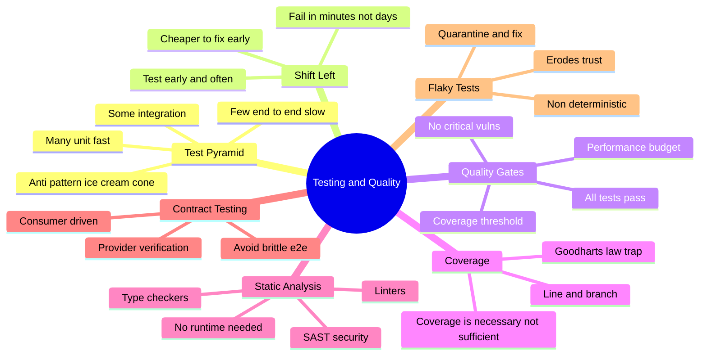
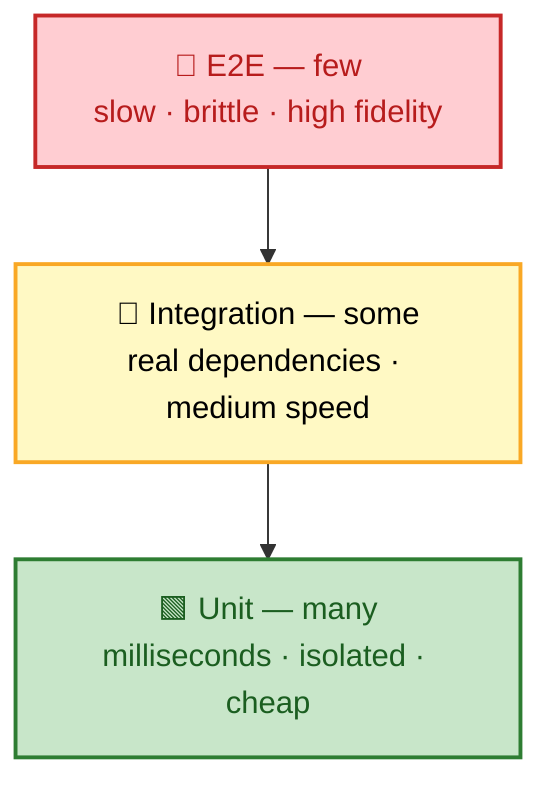
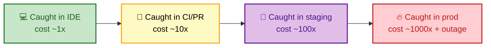

# SECTION 4: TESTING & QUALITY

The gates in your pipeline are only as good as the tests behind them. This section covers the **test
pyramid** (why you want many fast tests and few slow ones), **shift-left** testing, the **quality
gates** that block promotion, how to read **coverage** honestly, **static analysis**, **contract
testing** for microservices, and the single biggest threat to a pipeline's credibility — **flaky
tests**. Interviewers use this to check whether you understand tests as a *feedback-speed and
confidence* system, not a box to tick.

## Subtopic Index
- [The Test Pyramid](#the-test-pyramid)
- [Shift-Left Testing](#shift-left-testing)
- [Quality Gates](#quality-gates)
- [Code Coverage and Its Limits](#code-coverage-and-its-limits)
- [Static Analysis and Linting](#static-analysis-and-linting)
- [Contract Testing for Microservices](#contract-testing-for-microservices)
- [Flaky Tests](#flaky-tests)

---

## 🗺️ Visual Overview

**In one line:** Good pipeline testing is a pyramid — a wide base of fast, cheap, reliable unit tests that fail in seconds, narrowing to a few slow, expensive end-to-end tests — arranged so the cheapest checks fail first and the whole thing stays trustworthy enough that a red build actually means "stop."

**Mind map — the whole section at a glance** (skim first, revisit last):

**The test pyramid — cost and speed by layer (green = cheap and fast, red = expensive and slow):**

**Shift-left — cost of a bug grows the later you catch it:**

> 🧠 **Memory hooks (mnemonics):**
> - **Pyramid shape — "Many Unit, Some Integration, Few E2E."** Cheap/fast at the bottom, expensive/slow at the top.
> - **Ice-cream cone = the anti-pattern:** an inverted pyramid (mostly E2E, few unit) is slow, flaky, and expensive.
> - **Shift left = "fail early, fail cheap."** A bug caught in the IDE costs ~1×; in prod, ~1000× plus an outage.
> - **Coverage trap — Goodhart's law:** *"When coverage becomes a target, it stops being a good measure."* 100% coverage with no assertions tests nothing.
> - **Flaky rule:** *"A flaky test is worse than no test"* — it trains people to ignore red.

---

## The Test Pyramid

> 🎯 **Interview weight: Very High** — the foundational mental model for pipeline testing.

**In one line:** Structure tests as a pyramid — **many** fast, isolated **unit** tests at the base; **some** **integration** tests in the middle; **few** slow **end-to-end** tests at the top — so most failures are caught by the cheapest, fastest layer.

Each layer trades speed for fidelity:

- **Unit tests** — test one function/class in isolation, dependencies mocked. Run in **milliseconds**, thousands of them in seconds. Highest volume; catch most logic bugs. Fail precisely (one test → one cause).
- **Integration tests** — test components working together with **real** dependencies (a real database, a real message broker, often via TestContainers). Slower (seconds), catch wiring/config bugs units miss.
- **End-to-end (E2E) tests** — drive the whole system like a user (UI → API → DB). Highest fidelity, but **slow, brittle, and expensive** to maintain. Keep them few — cover only critical user journeys.

| Layer | Volume | Speed | Fidelity | Fails point to |
|---|---|---|---|---|
| Unit | Many (1000s) | ms | Low | One function |
| Integration | Some (100s) | seconds | Medium | Component wiring |
| E2E | Few (10s) | minutes | High | "Something in the whole flow" |

> ⚠️ **Gotcha — the "ice-cream cone":** The anti-pattern is an **inverted pyramid**: lots of slow E2E tests and few unit tests. It *feels* thorough but produces a slow, flaky suite where a failure could be anywhere, blame is hard to localize, and CI takes 40 minutes. Teams drift into it because E2E "tests real behavior," but the maintenance and flakiness cost is crushing at scale.

> 💡 **Interview tip:** The nuance that impresses: *"The pyramid isn't about ratios for their own sake — it's about **feedback speed and precise blame**. A unit failure tells you exactly what broke in milliseconds; an E2E failure tells you *something* broke, somewhere, in minutes."*

---

## Shift-Left Testing

> 🎯 **Interview weight: High** — the principle that drives *where* in the pipeline checks live.

**In one line:** "Shift left" means moving testing and quality checks **as early as possible** — into the IDE, the pre-commit hook, and the first CI stage — because the cost of a defect grows by roughly an order of magnitude at each later stage it's caught.

The economics: a bug caught while typing (IDE/linter) costs almost nothing; caught in CI it costs a pipeline run and a context switch; caught in staging it costs a triage cycle; caught in **production** it costs an incident, customer impact, and a rollback. Shift-left pushes detection toward the cheap end:

- **In the IDE** — type checkers, linters, format-on-save.
- **Pre-commit hooks** — fast lint/secret-scan before code even leaves the machine.
- **Early CI stage** — unit tests, static analysis, and **security scanning** (SAST/SCA) run *first*, so vulnerabilities block the build before an artifact is ever produced (this is also the DevSecOps principle in [Section 5](./05-SECURITY-DEVSECOPS.md)).

> 🔍 **Deeper:** Shift-left has a counterpart — **shift-right** (testing in production via canaries, synthetic monitoring, and observability). They're complementary: shift-left catches what you *can* predict cheaply; shift-right catches what only real production reveals. Mature teams do both.

> 💡 **Interview tip:** Tie shift-left to pipeline *ordering*: putting security and unit tests early isn't just "good hygiene," it's **fail-fast economics** — you fail the cheapest, fastest check before spending compute on building and pushing an image.

---

## Quality Gates

> 🎯 **Interview weight: High** — the concrete mechanism that connects tests to pipeline promotion.

**In one line:** A quality gate is an **objective, automated pass/fail condition** the pipeline evaluates before promoting an artifact — tests green, coverage above threshold, zero critical vulnerabilities, performance within budget.

Common gates:

| Gate | Typical condition | Blocks on failure |
|---|---|---|
| Test gate | 100% of tests pass | Any failing test |
| Coverage gate | Coverage ≥ threshold (e.g., 80%), or no *decrease* | Coverage drop |
| Security gate | Zero Critical/High CVEs; no secrets found | New vulnerability |
| Static analysis gate | No new blocker/critical issues | Code smell/bug above severity |
| Performance gate | p95 latency / bundle size within budget | Regression beyond budget |

The best gates are **objective and fast**. A subjective or slow gate (a manual review that always passes) adds process without safety.

> ⚠️ **Gotcha:** A coverage gate set to an absolute number invites gaming (tests with no assertions to hit the %). A more robust gate is **"coverage must not decrease"** on the changed code (diff coverage), which targets the new risk without rewarding meaningless tests on old code.

---

## Code Coverage and Its Limits

> 🎯 **Interview weight: High** — a favorite "do you actually understand metrics" question.

**In one line:** Coverage measures **which lines/branches your tests execute** — it's useful for finding *untested* code, but it is **necessary, not sufficient**: 100% coverage with weak assertions proves nothing about correctness.

**Types of coverage:**

- **Line coverage** — % of lines executed by tests. Coarsest.
- **Branch coverage** — % of decision branches (both sides of every `if`) exercised. Stronger than line.
- **Mutation testing** — the gold standard: deliberately introduce bugs ("mutants") and check whether tests *catch* them. Measures assertion quality, not just execution.

**Why coverage misleads:**

- A test that *executes* a line without *asserting* anything about the result counts as covered but catches nothing.
- **Goodhart's law:** "When a measure becomes a target, it ceases to be a good measure." Mandating 100% coverage produces assertion-free tests that inflate the number.
- Coverage says nothing about the tests you *should* have written for edge cases the code doesn't handle at all.

| Metric | Measures | Blind spot |
|---|---|---|
| Line coverage | Lines run | No assertion quality |
| Branch coverage | Decision paths run | Still no assertion quality |
| Mutation testing | Whether tests *catch* injected bugs | Slow to run |

> 💡 **Interview tip:** The mature take: *"Coverage tells me where I have **zero** tests — that's genuinely useful. It does **not** tell me my tests are good. I use coverage to find gaps and mutation testing (or code review) to judge quality."*

> ⚠️ **Gotcha:** Chasing the last 5% of coverage often means testing trivial getters and generated code — high effort, near-zero value. Target meaningful coverage of business logic and **diff coverage** on changes, not a vanity 100%.

---

## Static Analysis and Linting

> 🎯 **Interview weight: Medium-High** — the "tests without running the code" category.

**In one line:** Static analysis inspects source **without executing it** — linters enforce style and catch bug patterns, type checkers prove type correctness, and SAST finds security flaws — all extremely cheap and therefore run first (shift-left).

Categories:

- **Linters** (ESLint, RuboCop, golangci-lint) — style consistency plus common bug patterns (unused vars, unreachable code).
- **Type checkers** (TypeScript, mypy, the compiler itself) — prove type-level correctness before runtime.
- **SAST — Static Application Security Testing** (Semgrep, SonarQube, CodeQL) — finds security anti-patterns (SQL injection, hardcoded secrets, unsafe deserialization). Covered deeper in [Section 5](./05-SECURITY-DEVSECOPS.md).
- **Formatters** (Prettier, gofmt, Black) — eliminate style debate by auto-formatting.

Because they need no runtime, no environment, and no test data, static checks are **the cheapest gate** and belong at the very start of the pipeline.

> 🔍 **Deeper:** The distinction to draw in interviews is **SAST (static, source, no execution)** vs **DAST (dynamic, running app, black-box)** vs **SCA (dependencies/CVEs)**. They find different classes of problems and run at different pipeline stages; a good pipeline uses all three (see [Section 5](./05-SECURITY-DEVSECOPS.md)).

---

## Contract Testing for Microservices

> 🎯 **Interview weight: High** — the modern answer to "how do you test service integrations without brittle full-system E2E."

**In one line:** Contract testing verifies that a **consumer** and **provider** agree on an API's shape by testing each side against a shared **contract** — so you catch integration breakage without spinning up the entire system for every change.

The problem: in a microservices system, full E2E tests across all services are slow, flaky, and require every service running together. **Consumer-driven contract testing** (Pact is the canonical tool) solves this:

1. The **consumer** defines what it expects from the provider's API (a *contract*): "when I call `GET /users/1`, I expect a JSON body with `id` and `name`."
2. That contract is shared with the **provider**, which runs a **provider verification** test proving its real API satisfies every consumer's expectations.
3. Each side tests independently against the contract — no need to run both services together.

| Approach | Needs whole system running | Speed | Flakiness | Catches |
|---|---|---|---|---|
| Full E2E | Yes (all services) | Slow | High | Real end-to-end behavior |
| Contract test | No (each side alone) | Fast | Low | API compatibility breakage |

> 💡 **Interview tip:** The framing that lands: *"Contract testing moves integration confidence **down the pyramid** — instead of one giant E2E that needs everything running, each service independently proves it honors the contract. You catch 'the provider broke the consumer' before deploy, without the E2E tax."*

> ⚠️ **Gotcha:** Contract tests verify the API *shape and agreed behavior*, not deep business logic across services. They complement, not replace, a small number of true E2E tests for critical journeys.

---

## Flaky Tests

> 🎯 **Interview weight: High** — the operational reality that silently destroys pipeline trust.

**In one line:** A flaky test **passes or fails non-deterministically on the same code** — and it's uniquely corrosive because it trains developers to ignore red builds ("just re-run it"), which quietly kills the trust the entire CI/CD system depends on.

**Common causes:**

- **Timing/race conditions** — `sleep`-based waits, async operations that sometimes finish late.
- **Test ordering/shared state** — tests that pass alone but fail when another test left state behind (a shared database row, a global).
- **External dependencies** — a real network call to a flaky third-party or a rate-limited API.
- **Non-determinism** — reliance on current time, random values, map iteration order, or unmocked concurrency.

**Why they're dangerous:** a suite that's 2% flaky and runs 500 tests fails ~63% of the time *even when the code is correct* ($1 - 0.98^{500}$... but more practically, even a handful of flaky tests makes green rare). Developers respond by **re-running until green**, which means they'll *also* re-run past a real failure — the flaky test has disabled the safety system.

**How to handle them:**

1. **Detect** — track pass/fail history per test; flag tests that fail then pass on retry with no code change.
2. **Quarantine** — move a known-flaky test out of the blocking path so it stops failing builds, but *keep running it* so it's not forgotten.
3. **Fix** — address the root cause (deterministic waits, isolated state, mocked externals).
4. **Never** blanket-enable auto-retry as a "solution" — it hides flakiness and lets real intermittent bugs through.

> ⚠️ **Gotcha:** Auto-retrying failed tests to get green is treating the symptom. It masks *both* flaky tests *and* genuine intermittent production bugs (a real race condition the test correctly caught). Retry can be a temporary mitigation, but the fix is determinism.

> 💡 **Interview tip:** The line that signals maturity: *"A flaky test is worse than no test, because it doesn't just fail to help — it actively trains the team to ignore failures."* Then describe the detect → quarantine → fix loop.

---

## Interview Questions & Answers

**Q1: Explain the test pyramid and what goes wrong when a team inverts it.**

**Answer:** The pyramid prescribes **many** fast, isolated unit tests at the base, **some** integration tests in the middle, and **few** slow E2E tests at the top — so most bugs are caught by the fastest, cheapest layer with precise blame. Inverting it (the "ice-cream cone": mostly E2E, few unit) produces a slow, flaky suite where failures could be anywhere, CI takes many minutes, and maintenance cost explodes.

**Reasoning:** The pyramid optimizes **feedback speed and blame localization**, not test count for its own sake. A unit failure points to one function in milliseconds; an E2E failure says "something in the whole flow broke" after minutes. Teams drift to the cone because E2E "feels real," but the flakiness and slowness eventually make the suite untrustworthy.

**Follow-up:** *"So are E2E tests bad?"* — No; they're essential for a *few* critical user journeys. The point is to keep them few and push most coverage down to unit and integration where it's fast and reliable.

---

**Q2: A manager mandates 100% code coverage. What's your response?**

**Answer:** Coverage is **necessary but not sufficient**: it tells you where you have *zero* tests (useful) but says nothing about whether the tests *assert* anything meaningful. Mandating 100% predictably produces assertion-free tests that execute lines to hit the number without verifying behavior — Goodhart's law in action. I'd target meaningful coverage of business logic, use **diff coverage** (don't let changed code decrease coverage), and judge test *quality* separately via mutation testing or review.

**Reasoning:** A test can cover a line without asserting its result, counting as "covered" while catching nothing. The last 5% is usually trivial getters and generated code — high effort, near-zero value. The goal is confidence, and coverage is a proxy that breaks when it becomes the target.

**Follow-up:** *"How would you measure test *quality* then?"* — Mutation testing: inject bugs and check whether tests catch them. It measures assertion strength, which coverage cannot.

---

**Q3: Your team re-runs CI until it goes green. What's the problem and how do you fix it?**

**Answer:** They have a **flaky test** problem, and re-running to green has disabled the pipeline as a safety system — because the same habit that ignores a flaky failure will ignore a *real* intermittent failure. The fix is a loop: **detect** flaky tests (track tests that fail then pass on retry with no code change), **quarantine** them out of the blocking path so they stop failing builds while still running, and **fix the root cause** (deterministic waits, isolated per-test state, mocked externals).

**Reasoning:** Flakiness is corrosive because it erodes trust in red builds. Blanket auto-retry isn't a fix — it hides both flaky tests and genuine race conditions the test correctly caught. Determinism is the real solution.

**Follow-up:** *"What are the usual root causes?"* — Timing/races (sleep-based waits), shared state/test ordering, and unmocked external dependencies or non-determinism (time, randomness, iteration order).

---

**Q4: In a microservices system, how do you test service integrations without slow, brittle full-system E2E?**

**Answer:** **Consumer-driven contract testing** (e.g., Pact). The consumer declares what it expects from the provider's API as a shared contract; the provider runs a verification test proving its real API satisfies every consumer's contract. Each side tests independently — no need to run all services together — so you catch "the provider broke the consumer" before deploy.

**Reasoning:** This moves integration confidence *down the pyramid*: instead of one giant E2E requiring the whole system, each service independently proves it honors the contract, which is fast and reliable. It complements a *small* number of true E2E tests for critical journeys.

**Follow-up:** *"What does contract testing NOT cover?"* — Deep cross-service business logic and true end-to-end behavior; it verifies API shape and agreed behavior. Keep a few real E2E tests for the critical paths.

---

## ✅ Best Practices

- **Shape tests as a pyramid**: many unit, some integration, few E2E; avoid the ice-cream cone.
- **Shift left**: run static analysis, unit tests, and security scans first for fail-fast economics.
- **Make quality gates objective and fast**; prefer **diff coverage** ("don't decrease") over absolute % targets.
- **Use coverage to find gaps, not to prove quality**; judge quality with mutation testing or review.
- **Run static analysis and formatters first** — they're the cheapest gate.
- **Use contract testing** to get integration confidence without brittle full-system E2E.
- **Treat flaky tests as incidents**: detect, quarantine, and fix the root cause; never paper over with blanket retries.

## 📚 Documentation & Further Reading

- [Martin Fowler — TestPyramid](https://martinfowler.com/articles/practical-test-pyramid.html)
- [Google Testing Blog — Test sizes & flakiness](https://testing.googleblog.com/)
- [Pact — Consumer-driven contract testing](https://docs.pact.io/)
- [Semgrep — Static analysis](https://semgrep.dev/docs/)
- [Stryker / mutation testing](https://stryker-mutator.io/)

---

**[← Previous: Section 3 — Deployment Strategies](./03-DEPLOYMENT-STRATEGIES.md)** | **[Next: Section 5 — Security & DevSecOps →](./05-SECURITY-DEVSECOPS.md)**
