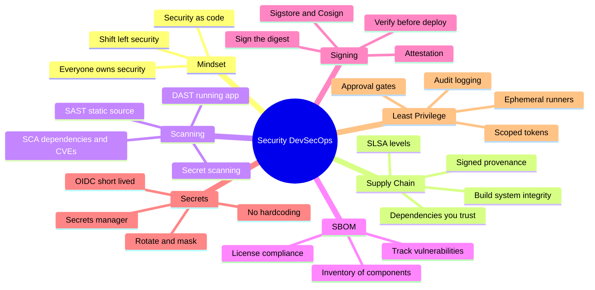
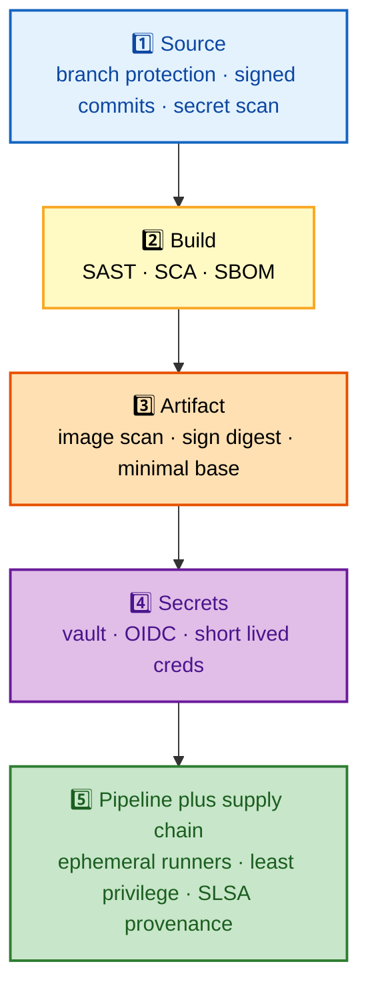
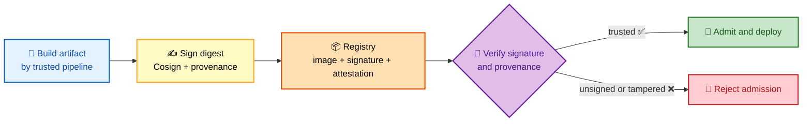

# SECTION 5: SECURITY & DEVSECOPS

This section holds the deepest senior-level CI/CD questions. It covers securing the pipeline itself
and the software it produces: the **supply-chain** threat model, the three scanning families
(**SAST / DAST / SCA**), the **SBOM**, **artifact signing** with Sigstore/Cosign, **secrets** and
short-lived **OIDC** credentials, the **SLSA** framework for build provenance, and the principle that
ties it all together — **shift left, sign everything, trust nothing**.

## Subtopic Index
- [The DevSecOps Mindset](#the-devsecops-mindset)
- [Supply-Chain Security and the Threat Model](#supply-chain-security-and-the-threat-model)
- [SAST, DAST, and SCA](#sast-dast-and-sca)
- [SBOM: Software Bill of Materials](#sbom-software-bill-of-materials)
- [Artifact Signing and Provenance (Sigstore/Cosign, SLSA)](#artifact-signing-and-provenance-sigstorecosign-slsa)
- [Secrets Management and OIDC](#secrets-management-and-oidc)
- [Least Privilege and Pipeline Hardening](#least-privilege-and-pipeline-hardening)

---

## 🗺️ Visual Overview

**In one line:** CI/CD security is about protecting two things — the **pipeline** (a privileged system that can deploy to prod and holds your secrets) and the **artifact** (the thing users run) — by scanning early, signing everything, verifying before deploy, and giving every step only the short-lived, minimal credentials it needs.

**Mind map — the whole section at a glance** (skim first, revisit last):

**Defense in depth — five layers plus the supply chain (each layer a different class of threat):**

**Supply-chain trust chain — sign at build, verify before deploy (purple = trust decision):**

> 🧠 **Memory hooks (mnemonics):**
> - **The one-liner — "Shift left, sign everything, trust nothing."** Scan early, sign artifacts, verify before deploy, use short-lived creds.
> - **Scan trio — "SAST · DAST · SCA":** **SAST** = **S**ource (static, no run); **DAST** = **D**ynamic (running app); **SCA** = **S**oftware **C**omposition (your dependencies' CVEs).
> - **Secrets rule — "OIDC over static":** short-lived federated tokens beat long-lived stored secrets.
> - **SBOM = ingredients label:** you can't fix a vulnerable component you don't know you ship.
> - **SLSA ladder:** the higher the level, the harder it is to tamper with your build.

---

## The DevSecOps Mindset

> 🎯 **Interview weight: High** — the philosophy question that frames every concrete control.

**In one line:** DevSecOps means security is **built into the pipeline as automated, shift-left controls owned by everyone** — not a manual gate a separate team bolts on at the end.

Traditional security was a late, manual gate: a security team reviewed a release right before it shipped, found problems, and sent it back — slow, adversarial, and a bottleneck. **DevSecOps** integrates security *into* the delivery pipeline as code:

- **Shift left** — scan in the IDE, pre-commit, and early CI, so vulnerabilities block the build *before* an artifact exists.
- **Security as code** — policies, scans, and gates are declarative pipeline steps, versioned and reviewed like any other code.
- **Shared ownership** — developers own the security of what they ship; security engineers provide the tooling and guardrails rather than being the sole gatekeepers.

> 💡 **Interview tip:** Frame it as **removing the bottleneck without removing the control**: instead of one manual review at the end, you have many automated checks throughout — faster *and* more thorough, because a machine scans every commit and never gets tired.

---

## Supply-Chain Security and the Threat Model

> 🎯 **Interview weight: Very High** — the defining CI/CD security topic since SolarWinds and Log4Shell.

**In one line:** Software supply-chain security protects everything that goes *into* your artifact and everything that *builds* it — your dependencies, your build system, and the integrity chain that proves the thing you deploy is the thing you built.

The threat surface goes far beyond "is my code secure." An attacker can compromise:

- **Dependencies** — a malicious or compromised open-source package (typosquatting, a hijacked maintainer account, a backdoored update). Most of your shipped code is *someone else's* code.
- **The build system** — if an attacker controls a CI runner or injects a malicious build step, they can tamper with the artifact *after* your code passed review (the SolarWinds pattern).
- **The distribution path** — swapping or tampering with the artifact between build and deploy (defeated by signing + verification).

**Defenses map to the chain:**

| Threat | Defense |
|---|---|
| Malicious/vulnerable dependency | SCA scanning, pinned versions, SBOM, dependency review |
| Compromised build | Ephemeral/isolated runners, SLSA provenance, least privilege |
| Tampered artifact | Sign the digest (Cosign), verify signature before deploy |
| Stolen pipeline credentials | Short-lived OIDC tokens, scoped permissions, secret scanning |

> 🔍 **Deeper:** The mental shift is that **your `git` history is no longer the boundary of what you ship**. You ship your dependencies *and* whatever your build system injected. Supply-chain security extends trust verification across that whole chain — which is exactly what SLSA and signing formalize.

> ⚠️ **Gotcha:** "We passed code review" does not mean the artifact is safe. Code review covers *your* source; it does not cover a compromised transitive dependency or a tampered build step. That gap is the entire reason supply-chain security exists.

---

## SAST, DAST, and SCA

> 🎯 **Interview weight: Very High** — you must distinguish all three crisply.

**In one line:** **SAST** analyzes your **source** without running it, **DAST** attacks the **running app** from the outside, and **SCA** inventories your **dependencies** and flags their known CVEs — three complementary lenses that find different classes of problems.

| Type | Full name | Tests | When (pipeline stage) | Finds | Misses |
|---|---|---|---|---|---|
| **SAST** | Static Application Security Testing | Source code, not running | Early (pre-build) | Injection, hardcoded secrets, unsafe patterns | Runtime/config issues; false positives common |
| **DAST** | Dynamic Application Security Testing | Running app, black-box | Late (deployed to test env) | Auth flaws, runtime misconfig, real exploitability | Anything not reachable via the running surface |
| **SCA** | Software Composition Analysis | Dependencies (direct + transitive) | Early (on manifest/lockfile) | Known CVEs in libraries, license issues | Zero-days; your own code's bugs |

- **SAST** runs first because it's cheap and needs no runtime — it reads the code like an expert reviewer looking for dangerous patterns. High recall, but noisy (false positives).
- **SCA** also runs early, on your dependency manifest, matching your libraries against vulnerability databases (e.g., the CVE/GHSA feeds). Since most of your shipped code is dependencies, this catches the largest share of real risk (Log4Shell was an SCA finding).
- **DAST** runs late, against a deployed instance, probing it like an attacker (fuzzing inputs, testing auth). It proves *exploitability* that static analysis can only guess at.

> 💡 **Interview tip:** The clean distinction: *"SAST reads the code, DAST attacks the app, SCA audits the dependencies."* A mature pipeline runs all three — they overlap little and each catches what the others can't.

> ⚠️ **Gotcha:** SAST's false-positive rate is its real-world weakness — flood developers with noise and they'll ignore the tool (and the one real finding buried in it). Tune rules, baseline existing issues, and gate only on *new*, high-confidence findings.

---

## SBOM: Software Bill of Materials

> 🎯 **Interview weight: High** — increasingly a compliance and incident-response requirement.

**In one line:** An **SBOM** is a machine-readable **inventory of every component** (and version) in your artifact — the "ingredients label" that lets you answer "am I affected?" the instant a new CVE drops.

An SBOM (standard formats: **SPDX**, **CycloneDX**) lists every direct and transitive dependency with versions and often licenses. Its value shows up in two moments:

- **Incident response** — when Log4Shell-class vulnerability is announced, you query your SBOMs to instantly find which of your 300 services ship the affected version, instead of frantically grepping build files.
- **License compliance** — track which licenses (GPL, AGPL, MIT) you ship to avoid legal exposure.

It's generated automatically in the build (tools like Syft, or native build support) and stored alongside the artifact — ideally **attested and signed** so the SBOM itself is trustworthy.

> 🔍 **Deeper:** An SBOM is only useful if it's **continuously reconciled against vulnerability feeds**. A static SBOM sitting in storage is inventory; an SBOM that a system re-scans as new CVEs are published is a *live early-warning system*. The goal is: new CVE announced → automated match against SBOMs → alert on affected services within minutes.

> 💡 **Interview tip:** The one-liner: *"You can't patch a vulnerable component you don't know you ship."* SBOM turns "are we affected by X?" from a multi-day manual audit into a query.

---

## Artifact Signing and Provenance (Sigstore/Cosign, SLSA)

> 🎯 **Interview weight: Very High** — the "trust nothing, verify everything" mechanism.

**In one line:** Signing binds a **cryptographic signature** to an artifact's digest so a verifier can prove it was built by your trusted pipeline and not tampered with; **provenance** (SLSA) additionally records *how* and *where* it was built — and admission control **verifies both before deploy**.

**Signing (Sigstore / Cosign):** After the build, you **sign the artifact's content digest**. At deploy time, an admission controller **verifies** the signature — an unsigned or tampered image is rejected. Sigstore's **keyless signing** is the modern approach: it uses short-lived certificates tied to an OIDC identity (e.g., "this was signed by the GitHub Actions workflow in repo X"), recorded in a public transparency log (Rekor), so there's no long-lived private key to steal.

**Provenance & SLSA:** **SLSA** (Supply-chain Levels for Software Artifacts) is a framework of increasing build-integrity guarantees:

| SLSA Level | Guarantee |
|---|---|
| Level 1 | Provenance exists (documented, automated build) |
| Level 2 | Signed provenance from a hosted build service (tamper-evident) |
| Level 3 | Hardened, isolated builds; provenance is non-forgeable |
| Level 4 (historical) | Hermetic, two-person-reviewed builds |

**Attestation** is signed metadata *about* an artifact — "this image was built from commit `abc` by workflow `Y`, passed scan `Z`." Verifying attestations at deploy lets you enforce policy ("only deploy images built by our pipeline from `main` that passed security scanning").

> ⚠️ **Gotcha:** Signing is worthless without **verification**. Many teams sign artifacts and then never check the signature at deploy — that's a lock with no one checking the key. The value is entirely in the **admission-time verification** step (e.g., a Kubernetes admission controller / policy engine that rejects unsigned or non-compliant images).

> 💡 **Interview tip:** Tie signing back to [Section 1](./01-FUNDAMENTALS.md)'s "build once": you can only meaningfully sign an **immutable digest**. A `latest` tag that changes under you can't be signed-and-verified — another reason mutable tags are an anti-pattern.

---

## Secrets Management and OIDC

> 🎯 **Interview weight: Very High** — the most practical and most-botched pipeline security area.

**In one line:** Never hardcode secrets or bake them into artifacts; store them in a **secrets manager**, inject at **runtime**, mask them in logs, rotate them — and wherever possible replace long-lived stored secrets with **short-lived OIDC-federated credentials** that expire in minutes.

**What not to do:**

- ❌ Hardcode secrets in source (ends up in git history forever).
- ❌ Bake secrets into the container image (extractable from any layer).
- ❌ Pass secrets as plain env vars that leak into build logs and child processes.
- ❌ Commit `.env` files.

**What to do:**

- ✅ Store secrets in a **secrets manager** (Vault, AWS Secrets Manager, cloud KMS-backed stores).
- ✅ **Inject at runtime**, not build time, so the artifact stays secret-free.
- ✅ **Mask** secrets in logs and never `echo` them for debugging.
- ✅ **Rotate** regularly and after any suspected exposure.
- ✅ **Scan** for secrets (GitLeaks, TruffleHog) in pre-commit and CI to catch accidental commits.

**OIDC — the big upgrade.** Instead of storing a long-lived cloud credential in the CI system, the pipeline **federates**: it presents a short-lived, signed **OIDC token** proving "I am workflow X in repo Y on branch `main`," and the cloud provider exchanges it for **temporary credentials** scoped to exactly what that job needs. Nothing long-lived is stored, so there's no static secret to steal, leak, or forget to rotate.

| Approach | Credential lifetime | Theft blast radius | Rotation |
|---|---|---|---|
| Stored static key | Long-lived | High (valid until noticed) | Manual, often forgotten |
| OIDC federation | Minutes | Low (expires fast, scoped) | Automatic (per-run) |

> 💡 **Interview tip:** The line that lands: *"OIDC replaces a stored secret with a **proof of identity** exchanged for a short-lived token — so there's nothing durable to steal."* This is the single most-asked modern pipeline-security topic.

> ⚠️ **Gotcha:** Environment variables feel convenient but leak — into build logs, into `ps` output, into child processes, into crash dumps. Prefer file-mounted secrets or direct secrets-manager fetch at runtime, and always mask.

---

## Least Privilege and Pipeline Hardening

> 🎯 **Interview weight: High** — the pipeline is a privileged, internet-connected system; harden it accordingly.

**In one line:** The CI/CD system can deploy to production and holds your secrets, so treat it as **production-critical**: give each job the minimum scoped permissions, run on **ephemeral isolated runners**, gate prod behind approvals, pin third-party actions, and audit every run.

Key hardening controls:

- **Scoped, minimal tokens** — a job that only reads a repo shouldn't hold write/deploy permissions. Default-deny and grant per-job.
- **Ephemeral runners** — each job runs on a fresh, isolated, disposable executor, so a compromise doesn't persist or leak into the next job (vs. shared, long-lived runners that accumulate state and secrets).
- **Pin third-party actions/plugins by digest** — referencing `some-action@main` runs whatever that mutable ref points to *today*; pin to a full commit SHA so an upstream compromise can't silently change your build. (The "build once / immutable reference" principle applied to your *tooling*.)
- **Approval gates for production** and **branch protection** (required reviews, no force-push) on the branches that trigger deploys.
- **Audit logging** of every pipeline execution — who ran what, when, against which environment.
- **Guard against script injection** — untrusted input (PR titles, branch names) interpolated into a shell step can execute attacker code on the runner; treat all external input as untrusted.

> ⚠️ **Gotcha — the PR-from-fork problem:** A pull request can modify the very pipeline that runs it. If fork PRs run with full secrets and permissions, an attacker's PR can exfiltrate them. This is why fork PRs run with **reduced privileges and no secrets** by default, and privileged workflows are gated behind branch/environment protections.

> 💡 **Interview tip:** Summarize the posture: *"The pipeline is production. It has prod credentials and can deploy, so it gets prod-grade controls — least privilege, isolation, audit, and treating all external input as hostile."*

---

## Interview Questions & Answers

**Q1: Walk me through how you'd secure a CI/CD pipeline end to end.**

**Answer:** Layer defenses along the pipeline (shift-left): **Source** — branch protection, signed commits, secret scanning in pre-commit and CI. **Build** — SAST on source and SCA on dependencies (with an SBOM generated), failing on new critical findings. **Artifact** — scan the container image, build from a minimal base, and **sign the digest** (Cosign) with provenance. **Secrets** — no hardcoding; inject at runtime from a secrets manager and, better, use **short-lived OIDC** instead of stored keys. **Pipeline/supply chain** — ephemeral isolated runners, least-privilege scoped tokens, pinned third-party actions, approval gates for prod, audit logging, and **admission-time verification** that rejects unsigned or non-compliant artifacts.

**Reasoning:** The guiding principle is *shift left, sign everything, trust nothing*: catch issues at the cheapest stage, make the artifact tamper-evident, verify before deploy, and minimize what any credential or step can do. Each layer addresses a distinct threat — vulnerable dependencies (SCA), tampered builds (provenance/signing), stolen creds (OIDC), and compromised runners (isolation + least privilege).

**Follow-up:** *"Which single change gives the most security ROI?"* — Usually replacing long-lived stored cloud secrets with OIDC federation: it removes the highest-value, easiest-to-steal target from the system entirely.

---

**Q2: Distinguish SAST, DAST, and SCA, and where each runs in the pipeline.**

**Answer:** **SAST** statically analyzes your **source** for dangerous patterns (injection, hardcoded secrets) without running it — runs early, pre-build, but is noisy. **SCA** inventories your **dependencies** and flags known CVEs — also early, on the lockfile, and catches the largest share of real risk since most shipped code is dependencies. **DAST** attacks the **running app** as a black box (auth flaws, runtime misconfig) — runs late against a deployed test instance and proves real exploitability.

**Reasoning:** They're complementary lenses with little overlap: source vs running app vs dependencies. A mature pipeline runs all three because each catches what the others structurally cannot — SAST can't see runtime issues, DAST can't see unreachable code, and neither tracks third-party CVEs like SCA.

**Follow-up:** *"Why is SCA often the highest-value one?"* — Because most of your attack surface is code you didn't write; Log4Shell and similar are SCA findings, not SAST.

---

**Q3: What problem does OIDC federation solve versus storing a cloud access key in the CI system?**

**Answer:** A stored access key is a **long-lived secret** sitting in your CI system — a high-value target that's valid until someone notices it leaked and manually rotates it. OIDC federation stores **nothing durable**: the job presents a short-lived, signed token proving its identity ("workflow X, repo Y, branch main"), and the cloud exchanges it for **temporary, scoped credentials** that expire in minutes.

**Reasoning:** This removes the stolen-secret blast radius — there's no persistent credential to exfiltrate, and even a leaked token expires almost immediately and is scoped to one job's needs. It also eliminates rotation toil, since credentials are minted per-run.

**Follow-up:** *"What could still go wrong with OIDC?"* — Over-broad trust policies (trusting any branch or any repo) or over-scoped roles. The federation's trust conditions and the granted role must be tightly scoped, or you've just made a fast-expiring but still over-privileged credential.

---

**Q4: Your team signs all container images but was still hit by a tampered image in production. How?**

**Answer:** They signed but never **verified**. Signing alone does nothing at runtime — the value is in an **admission-time verification** step (a Kubernetes admission controller / policy engine) that rejects any image lacking a valid signature and provenance from the trusted pipeline. Without that gate, a tampered or unsigned image deploys just fine; the signatures are decorative.

**Reasoning:** Trust in a supply chain is established at the **verification** point, not the signing point. The correct posture is "deny by default; admit only images whose signature and attestations verify against our policy" — and to sign **immutable digests**, since a mutable tag can't be meaningfully verified.

**Follow-up:** *"How do you enforce it?"* — A policy engine at admission (e.g., verifying Cosign signatures and SLSA provenance) that fails closed, plus keyless signing tied to the pipeline's OIDC identity so the signer itself is verifiable.

---

## ✅ Best Practices

- **Shift security left**: SAST + SCA early, fail on new critical findings before an artifact exists.
- **Run all three scan types** (SAST, DAST, SCA) — they catch different classes of issues.
- **Generate and continuously reconcile an SBOM** so "are we affected by this CVE?" is a query, not an audit.
- **Sign immutable digests** and — critically — **verify at admission**; fail closed on unsigned/non-compliant artifacts.
- **Adopt SLSA provenance** to make builds tamper-evident.
- **Replace stored secrets with short-lived OIDC**; inject remaining secrets at runtime, mask, rotate, and scan for leaks.
- **Harden the pipeline**: least-privilege scoped tokens, ephemeral isolated runners, pinned third-party actions by SHA, approval gates, and audit logging.
- **Treat all external input as hostile** to prevent script injection; run fork PRs without secrets.

## 📚 Documentation & Further Reading

- [SLSA — Supply-chain Levels for Software Artifacts](https://slsa.dev/)
- [Sigstore / Cosign](https://docs.sigstore.dev/)
- [OWASP DevSecOps Guideline](https://owasp.org/www-project-devsecops-guideline/)
- [CycloneDX SBOM standard](https://cyclonedx.org/) · [SPDX](https://spdx.dev/)
- [OpenSSF — Secure supply chain](https://openssf.org/)
- [GitHub — About OIDC hardening](https://docs.github.com/en/actions/deployment/security-hardening-your-deployments/about-security-hardening-with-openid-connect)

---

**[← Previous: Section 4 — Testing & Quality](./04-TESTING-QUALITY.md)** | **[Next: Section 6 — Release & Observability →](./06-RELEASE-OBSERVABILITY.md)**
