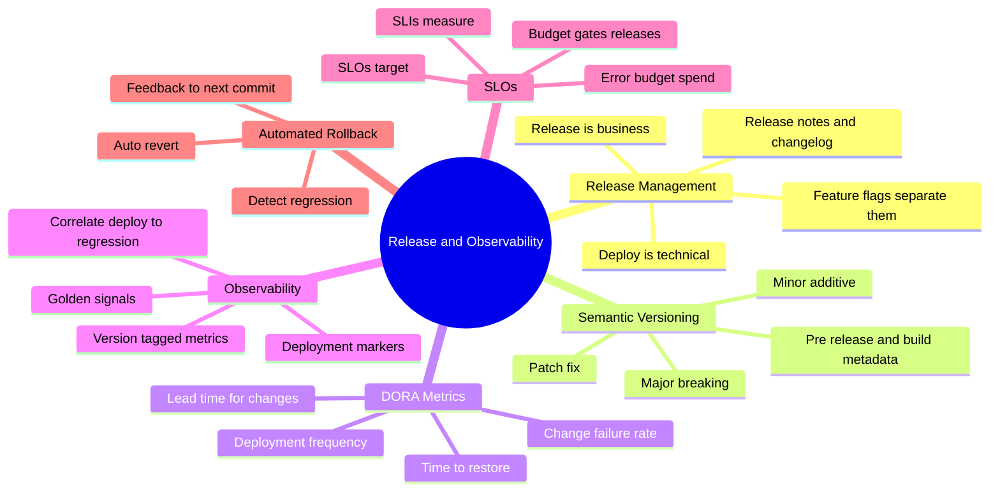
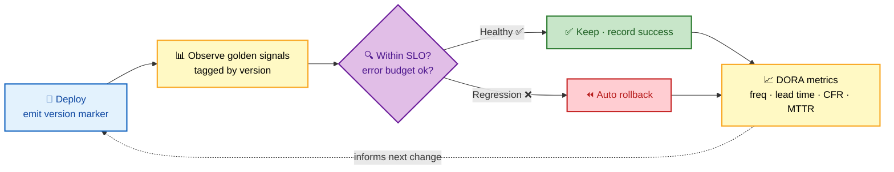
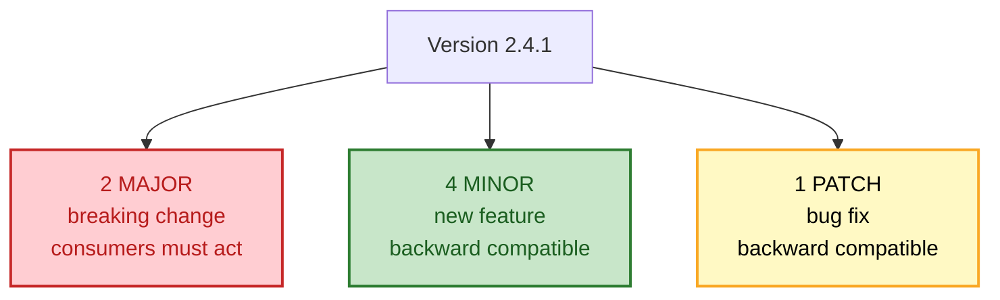

# SECTION 6: RELEASE & OBSERVABILITY

This closing section puts it all together: how you **manage and version** releases, how you **measure**
whether your delivery is actually good (**DORA** metrics), how you make deployments **observable** so
you can tell a bad one from a good one in minutes, and how you **close the loop** with automated
rollback driven by SLOs and error budgets. This is where CI/CD stops being "a pipeline" and becomes
**release engineering** — the system-design layer senior interviews probe hardest.

## Subtopic Index
- [Release Management: Deploy vs Release](#release-management-deploy-vs-release)
- [Semantic Versioning](#semantic-versioning)
- [DORA Metrics](#dora-metrics)
- [Deployment Observability](#deployment-observability)
- [SLOs, SLIs, and Error Budgets](#slos-slis-and-error-budgets)
- [Automated Rollback and the Feedback Loop](#automated-rollback-and-the-feedback-loop)

---

## 🗺️ Visual Overview

**In one line:** Release engineering is the discipline of turning "we deployed" into "we know it's healthy" — versioning artifacts clearly, measuring delivery with DORA, instrumenting every deploy so regressions are visible in minutes, and wiring that signal into automated rollback so the system heals itself.

**Mind map — the whole section at a glance** (skim first, revisit last):

**The DORA feedback loop — measure delivery, feed it back (blue = deploy, purple = decision, green = healthy):**

**Semantic versioning — what each number promises:**

> 🧠 **Memory hooks (mnemonics):**
> - **DORA four — "Frequency, Lead, Fail, Restore":** **D**eployment frequency, **L**ead time for changes, **C**hange **F**ailure rate, **T**ime to restore. First two = *speed*; last two = *stability*.
> - **SemVer — "Break · Feature · Fix" → Major · Minor · Patch.** Left number = permission to break.
> - **Deploy vs release:** *"Deploy the bits, release the feature."* Same split as feature flags in [Section 3](./03-DEPLOYMENT-STRATEGIES.md).
> - **Error budget:** *"Reliability you're *allowed* to spend."* 99.9% SLO = 0.1% budget to burn on risky releases.
> - **Observability rule:** *"Tag metrics by version or you can't blame the deploy."*

---

## Release Management: Deploy vs Release

> 🎯 **Interview weight: High** — the conceptual distinction that underpins modern release engineering.

**In one line:** **Deploy** is a *technical* event (the code is running in production), **release** is a *business* event (users can use the feature) — and separating them (via feature flags) is what makes frequent, low-risk delivery possible.

Conflating deploy and release forces every code push to be a user-facing change, which makes deploys scary and rare. Separating them:

- **Deploy** often, in small increments — the code ships dark (behind a flag), continuously integrated and validated in production infrastructure without affecting users.
- **Release** independently, when the business is ready — flip the flag to turn the feature on, ramp it, and turn it off instantly if needed.

**Release management** also covers the human-facing artifacts: **changelogs** and **release notes** (what changed, for whom), **versioning** (below), and coordination for changes that genuinely must be synchronized (a client and server that must ship together).

> 💡 **Interview tip:** This is the same deploy/release split as feature flags ([Section 3](./03-DEPLOYMENT-STRATEGIES.md)), viewed from the release-management angle. The payoff line: *"When deploy and release are separate, deploying becomes boring — and boring deploys are safe deploys."*

---

## Semantic Versioning

> 🎯 **Interview weight: Medium-High** — expected knowledge; the nuance is about compatibility promises.

**In one line:** SemVer encodes a **compatibility contract** in `MAJOR.MINOR.PATCH` — bump **MAJOR** for breaking changes, **MINOR** for backward-compatible features, **PATCH** for backward-compatible fixes — so consumers know at a glance whether an upgrade is safe.

| Part | Bump when | Consumer impact | Example |
|---|---|---|---|
| **MAJOR** | Breaking/incompatible change | Must read migration notes & adapt | `1.x.x` → `2.0.0` |
| **MINOR** | New backward-compatible feature | Safe to adopt | `1.4.x` → `1.5.0` |
| **PATCH** | Backward-compatible bug fix | Safe, should adopt | `1.4.1` → `1.4.2` |

Extras: **pre-release** tags (`2.0.0-rc.1`) mark unstable candidates; **build metadata** (`+build.42`) is informational. `0.y.z` signals "anything may change" (pre-1.0 instability).

**Versioning schemes in practice:**

- **SemVer** — for libraries/APIs where consumers depend on compatibility promises.
- **CalVer** (e.g., `2026.09`) — date-based, common for apps/tools where "breaking vs not" is less meaningful than "when."
- **Auto-versioning** — derive the version from commit messages (Conventional Commits) so `feat:` → minor, `fix:` → patch, `BREAKING CHANGE` → major, automatically.

> ⚠️ **Gotcha:** SemVer is a *social contract*, not an enforced guarantee. A library can *claim* a change is a minor bump while actually breaking consumers (a subtle behavior change). This is why consumers pin versions and why **contract testing** ([Section 4](./04-TESTING-QUALITY.md)) exists — to verify the promise rather than trust the number.

---

## DORA Metrics

> 🎯 **Interview weight: Very High** — the industry-standard way to measure delivery performance; near-guaranteed at senior level.

**In one line:** The four **DORA** metrics measure delivery as a balance of **speed** (deployment frequency, lead time) and **stability** (change failure rate, time to restore) — and the research shows elite teams are better at *both* at once, debunking the "fast vs safe" trade-off.

| Metric | Measures | Elite performers | Axis |
|---|---|---|---|
| **Deployment Frequency** | How often you deploy to prod | On-demand (multiple/day) | Speed (throughput) |
| **Lead Time for Changes** | Commit → running in prod | < 1 hour | Speed (latency) |
| **Change Failure Rate** | % of deploys causing a failure | 0–15% | Stability |
| **Time to Restore (MTTR)** | How fast you recover from failure | < 1 hour | Stability |

**The counterintuitive finding:** speed and stability are **not** a trade-off — they're *correlated*. Teams that deploy frequently in small batches also have lower change-failure rates and recover faster, because small changes are easier to test, easier to diagnose, and easier to roll back. This is the data behind Continuous Deployment's "deploy more often to be safer" claim ([Section 1](./01-FUNDAMENTALS.md)).

> 💡 **Interview tip:** Group them as **"two speed, two stability"** and land the thesis: *"DORA shows speed and stability rise together — because small, frequent deploys are inherently lower-risk and faster to recover than large, rare ones."*

> ⚠️ **Gotcha:** DORA metrics are **outcomes to improve, not targets to game**. Chasing "deployment frequency" by splitting one change into ten meaningless deploys, or gaming MTTR definitions, is Goodhart's law again. Use them to understand your system, not as a leaderboard.

> 🔍 **Deeper:** A fifth metric, **reliability** (operational performance against SLOs), was later added. It connects DORA to the SLO/error-budget model below — delivery performance is only "good" if the thing you deliver stays reliable.

---

## Deployment Observability

> 🎯 **Interview weight: High** — the "how do you know a deploy went bad" question.

**In one line:** Deployment observability means **tagging every metric, log, and trace with the version/deploy that produced it** and marking deploys on your dashboards — so when a graph turns bad you can *immediately* correlate it to the deploy that caused it, instead of guessing.

The three pillars of observability, applied to deploys:

- **Metrics** — the **golden signals** (latency, traffic, errors, saturation) tagged **by version**, so you can compare v1.1's error rate against v1.0's directly (the basis for canary analysis in [Section 3](./03-DEPLOYMENT-STRATEGIES.md)).
- **Logs** — structured, correlatable, and searchable by version and request ID.
- **Traces** — distributed traces to see *where* in a request path a regression appears.

The single highest-value practice is the **deployment marker**: annotate dashboards with a vertical line at each deploy. When error rate spikes, the marker instantly answers "did a deploy cause this?" — turning a multi-hour investigation into a glance.

| Without deploy observability | With it |
|---|---|
| "Errors are up, when did it start?" | "Errors spiked exactly at the 14:02 deploy of v1.7" |
| Can't compare versions | v1.7 error rate vs v1.6 side by side |
| Rollback is a guess | Rollback decision is data-driven and automatable |

> 💡 **Interview tip:** The practice that signals operational maturity: *"Every deploy emits a marker, and every metric is tagged by version. That's what makes 'is this deploy healthy?' an automatic, answerable question — and it's the prerequisite for automated canary analysis and rollback."*

> 🔍 **Deeper:** This is the bridge to [Section 3](./03-DEPLOYMENT-STRATEGIES.md)'s progressive delivery: automated canary analysis is *impossible* without version-tagged, reliable metrics. Observability isn't a separate concern from deployment — it's the sensor that makes safe automated deployment possible.

---

## SLOs, SLIs, and Error Budgets

> 🎯 **Interview weight: High** — the SRE framework that connects reliability to release decisions.

**In one line:** An **SLI** is a measured signal (e.g., % of requests under 300ms), an **SLO** is the target for it (99.9%), and the **error budget** is the allowed shortfall (0.1%) — a currency you *spend* on risky releases, which turns "should we ship?" into a data-driven decision.

- **SLI (Service Level Indicator)** — a quantitative measure of behavior: request success rate, p99 latency, availability.
- **SLO (Service Level Objective)** — the target for an SLI over a window: "99.9% of requests succeed over 30 days."
- **Error budget** — `100% − SLO`. A 99.9% SLO gives a 0.1% budget — roughly 43 minutes of downtime per month — that you're *allowed* to consume.

The powerful idea: the error budget is a **release-governance currency**. If you're well within budget, ship boldly — take risks, deploy the ambitious feature. If you've **burned the budget** (too many recent failures), the pipeline can **freeze risky releases** and redirect effort to reliability until the budget recovers. This aligns dev (wants to ship) and ops (wants stability) around one shared number instead of arguing.

> 💡 **Interview tip:** The framing that impresses: *"An error budget turns reliability from an argument into arithmetic. Under budget, we ship features fast; over budget, releases gate automatically on stability work. Same number governs both teams."*

> ⚠️ **Gotcha:** SLOs must be set from **user-facing experience**, not internal vanity metrics. "CPU < 80%" is not an SLO — users don't care about CPU. "99.9% of checkout requests succeed under 500ms" is, because it measures what the user actually experiences.

---

## Automated Rollback and the Feedback Loop

> 🎯 **Interview weight: High** — the closing mechanism that makes Continuous Deployment safe.

**In one line:** Automated rollback wires deployment observability directly to action — when a deploy breaches its SLO/error-budget thresholds, the system **reverts automatically** without waiting for a human — and the outcome of every deploy **feeds back** into the metrics that shape the next change.

The closed loop:

1. **Deploy** emits a version marker and the artifact rolls out (often via canary/progressive delivery).
2. **Observe** — version-tagged golden signals stream in.
3. **Decide** — automated analysis compares the new version to the baseline against SLO thresholds and the error budget.
4. **Act** — healthy → promote; regressing → **auto-rollback** (to the previous immutable artifact) or auto-disable via feature flag. Because artifacts are immutable ([Section 1](./01-FUNDAMENTALS.md)), rollback is a deterministic re-point, not a rebuild.
5. **Feed back** — the deploy's success/failure updates DORA metrics and the error budget, which inform whether the *next* change ships aggressively or cautiously.

This is what lets teams remove the human gate (Continuous Deployment) safely: the safety net is **automated detection + automated reversion**, faster and more reliable than a human watching dashboards at 3 a.m.

> ⚠️ **Gotcha:** Automated rollback needs the **stateful caveat** from [Section 3](./03-DEPLOYMENT-STRATEGIES.md): reverting code is safe only if the data/schema is backward compatible. If a migration already ran destructively, auto-rollback can make things *worse* — which is why expand-contract migrations and "fix-forward" decisions matter. Configure auto-rollback to revert code/flags, and treat schema changes as separately governed.

> 💡 **Interview tip:** Close the whole guide with the loop: *"CI/CD isn't a pipeline, it's a control system — deploy, observe, decide, act, and feed the result back. Immutable artifacts make rollback deterministic, observability makes the decision automatable, and error budgets make it governed."*

---

## Interview Questions & Answers

**Q1: What are the four DORA metrics, and what's the key insight from the research?**

**Answer:** **Deployment Frequency** and **Lead Time for Changes** measure *speed*; **Change Failure Rate** and **Time to Restore (MTTR)** measure *stability*. The key insight is that speed and stability are **not a trade-off** — they're positively correlated. Elite teams deploy more frequently *and* fail less *and* recover faster, because small, frequent changes are easier to test, diagnose, and roll back than large, rare ones.

**Reasoning:** This debunks the intuition that "moving fast means breaking things." Small batch size is the common cause of both speed and stability: a tiny change has a tiny blast radius and a trivial rollback. It's the data behind "deploy more often to be *safer*."

**Follow-up:** *"How could these be gamed?"* — Splitting one change into ten deploys to inflate frequency, or redefining MTTR. They're outcomes to understand the system, not targets to hit — Goodhart's law applies.

---

**Q2: Explain error budgets and how they govern releases.**

**Answer:** An error budget is `100% − SLO` — the allowed unreliability. A 99.9% availability SLO gives a 0.1% budget (~43 min/month). It acts as a shared currency: while you're under budget, ship features boldly; once you've burned the budget through recent failures, the pipeline **freezes risky releases** and redirects effort to reliability until the budget recovers.

**Reasoning:** This turns the classic dev-vs-ops conflict into arithmetic — one number governs both "ship fast" and "stay stable," removing the argument. It also makes risk explicit: a risky release is "spending budget," which is fine when you have it and gated when you don't.

**Follow-up:** *"What makes a good SLO?"* — It must reflect **user-facing experience** (checkout success rate, latency), not internal metrics like CPU that users don't perceive.

---

**Q3: A dashboard shows errors climbing but no one can tell if a deploy caused it. What practice is missing?**

**Answer:** **Deployment observability** — specifically, **deploy markers** on dashboards and **version-tagged metrics**. With a vertical marker at each deploy and metrics labeled by version, an error spike is instantly correlated to the exact deploy that caused it, and you can compare the new version's error rate to the previous one's directly.

**Reasoning:** Without version tagging and markers, "did the deploy break it?" is a guess that costs hours. With them, it's a glance — and it's the prerequisite for *automating* the decision (canary analysis, automated rollback), since a machine can only judge a deploy's health from reliable, version-attributed signals.

**Follow-up:** *"How does this enable automated rollback?"* — The version-tagged golden signals feed automated analysis that compares new vs baseline against SLO thresholds; breaching them triggers an automatic revert to the previous immutable artifact.

---

**Q4: How do you make fully automated (no-human-gate) production deployment safe?**

**Answer:** Replace the human gate with an **automated control loop**: deploy progressively (canary), observe version-tagged golden signals, run **automated analysis** against SLO/error-budget thresholds, and **auto-rollback** on regression to the previous immutable artifact (or disable via feature flag). Underpin it with high-confidence tests (including contract tests), tight alerting, and backward-compatible schema changes so rollback is always safe.

**Reasoning:** The human was a slow, unreliable safety net. Immutable artifacts make rollback deterministic, observability makes the health decision machine-readable, and error budgets govern how aggressively to ship. Together they're faster and more reliable than a person — which is why elite teams can deploy on every commit.

**Follow-up:** *"What's the one thing that can make auto-rollback dangerous?"* — A destructive database migration. Reverting code against a schema that already changed can worsen the incident, so schema changes use expand-contract and are governed separately; auto-rollback handles code and flags.

---

## ✅ Best Practices

- **Separate deploy from release** (feature flags) so deploys are frequent, small, and boring.
- **Version clearly** (SemVer for libraries/APIs) and consider auto-versioning from Conventional Commits.
- **Track the four DORA metrics** as outcomes to understand and improve — never as gameable targets.
- **Tag every metric/log/trace by version** and put **deploy markers** on dashboards.
- **Define SLOs from user-facing experience**, and use the **error budget** to govern release risk.
- **Automate rollback** on SLO/error-budget breach, reverting to the previous immutable artifact or flag state.
- **Keep schema changes backward compatible** so automated rollback is always safe (expand-contract).
- **Close the loop**: feed each deploy's outcome back into the metrics that shape the next change.

## 📚 Documentation & Further Reading

- [DORA — Research & the four keys](https://dora.dev/)
- [Google SRE Book — SLOs & Error Budgets](https://sre.google/sre-book/service-level-objectives/)
- [Semantic Versioning 2.0.0](https://semver.org/)
- [Conventional Commits](https://www.conventionalcommits.org/)
- [Google — The Four Golden Signals](https://sre.google/sre-book/monitoring-distributed-systems/#xref_monitoring_golden-signals)
- [Accelerate (Forsgren, Humble, Kim)](https://itrevolution.com/product/accelerate/)

---

**[← Previous: Section 5 — Security & DevSecOps](./05-SECURITY-DEVSECOPS.md)** | **[Back to CI/CD Index](./README.md)** | **[Next Topic: GitOps →](../gitops/README.md)**
