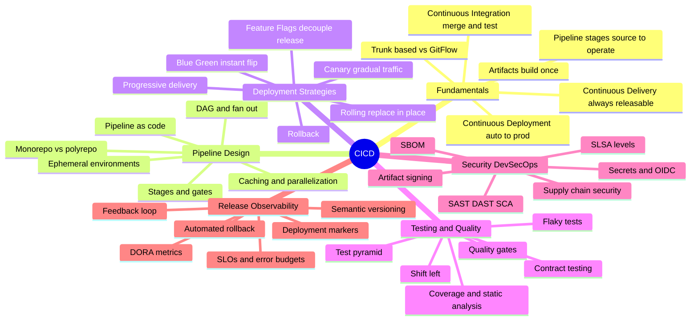
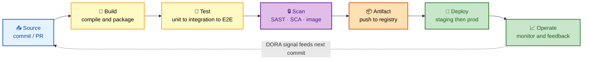

# CI/CD — Deep Dive Interview Preparation

> **Scope:** Tool-agnostic CI/CD concepts — pipelines, deployment strategies, testing, DevSecOps, and release engineering — for Senior DevOps, SRE, and Platform Engineer roles at FAANG-level bars.

This guide is **tool-agnostic**: it teaches the *concepts* (why a canary beats a big-bang deploy, how the test pyramid controls feedback cost, what makes a supply chain trustworthy) rather than the syntax of any one platform. For platform specifics, see the sibling guides on [Jenkins](../jenkins/README.md), [GitHub Actions](../github-actions/README.md), and [GitOps](../gitops/README.md).

It is split **section-wise** so each file is a focused, interview-ready study unit. Start at Section 1 and go in order; each section builds the mental model the next one assumes.

---

## 📚 Master Table of Contents

| # | Section | What it covers | Interview weight |
|---|---|---|---|
| 01 | [Fundamentals](./01-FUNDAMENTALS.md) | CI vs CD vs Continuous Deployment, the three Cs, pipeline anatomy, build/test/deploy stages, artifacts, trunk-based vs GitFlow | 🔥🔥🔥 Very High |
| 02 | [Pipeline Design](./02-PIPELINE-DESIGN.md) | Pipeline-as-code, stages and gates, caching, parallelization, DAGs, fan-in/fan-out, monorepo vs polyrepo, ephemeral environments | 🔥🔥🔥 Very High |
| 03 | [Deployment Strategies](./03-DEPLOYMENT-STRATEGIES.md) | Blue-green, canary, rolling, recreate, feature flags, progressive delivery, automated analysis, rollback, DB migrations | 🔥🔥🔥 Very High |
| 04 | [Testing & Quality](./04-TESTING-QUALITY.md) | Test pyramid, shift-left, quality gates, coverage, static analysis, flaky tests, contract testing | 🔥🔥 High |
| 05 | [Security & DevSecOps](./05-SECURITY-DEVSECOPS.md) | Supply-chain security, SAST/DAST/SCA, SBOM, artifact signing (Sigstore/Cosign), secrets, OIDC, SLSA, least privilege | 🔥🔥🔥 Very High |
| 06 | [Release & Observability](./06-RELEASE-OBSERVABILITY.md) | Release management, SemVer, DORA metrics, deployment observability, SLOs, automated rollback, incident feedback loop | 🔥🔥 High |

---

## 🧭 Suggested Study Order

1. **Fundamentals (01)** — you cannot reason about anything else until the three Cs and the source → build → test → deploy → operate flow are automatic.
2. **Pipeline Design (02)** — how the flow is actually wired: gates, caching, parallelism, and the DAG that makes it fast.
3. **Deployment Strategies (03)** — the single most-asked CI/CD design topic; know the trade-offs of blue-green vs canary vs rolling cold.
4. **Testing & Quality (04)** — what the gates in the pipeline actually enforce, and why the test pyramid controls feedback cost.
5. **Security & DevSecOps (05)** — the deepest senior-level questions; supply-chain integrity and short-lived credentials dominate.
6. **Release & Observability (06)** — putting it together: how you measure delivery (DORA) and close the loop with automated rollback.

---

## 🗺️ Repo-Wide Visual Overview

**Mind map — the entire CI/CD surface at a glance** (skim first, revisit last):

**The CI/CD pipeline — the flow every section returns to (source → build → test → deploy → operate):**

> 🧠 **One-line mental model:** *"A commit flows through **build → test → scan → artifact → deploy → operate**; CI automates up to test, Delivery adds a manual release gate, Deployment removes the gate, and every deploy is measured so the loop feeds back to the next commit."*

---

## How to Use This Guide

- Each section opens with a **Visual Overview** (mind map + colorful diagrams + mnemonics) — use it to prime and to review.
- Topics carry an **Interview weight** tag and an **In one line** summary so you can triage what to memorize.
- Every section ends with an **Interview Questions & Answers** block (crisp answer → reasoning → follow-up), plus best practices and official docs.

---

**[← Back to Main README](../README.md)** | **[Start: Section 1 — Fundamentals →](./01-FUNDAMENTALS.md)**
