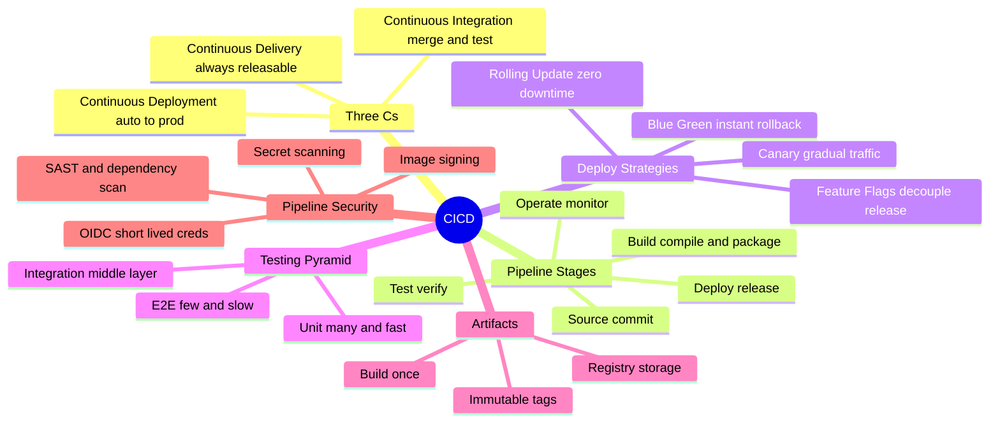
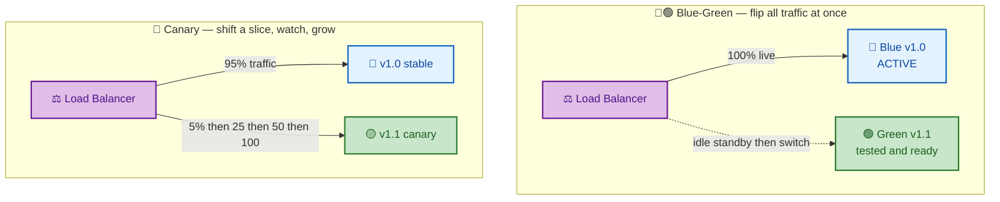
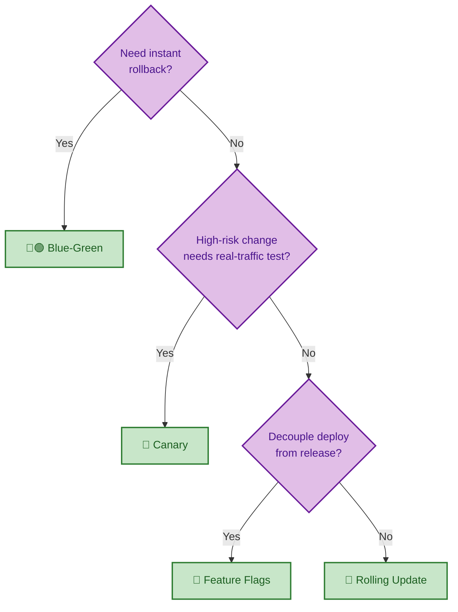
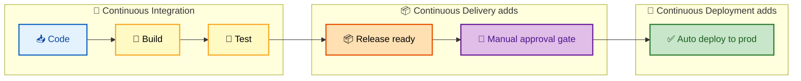
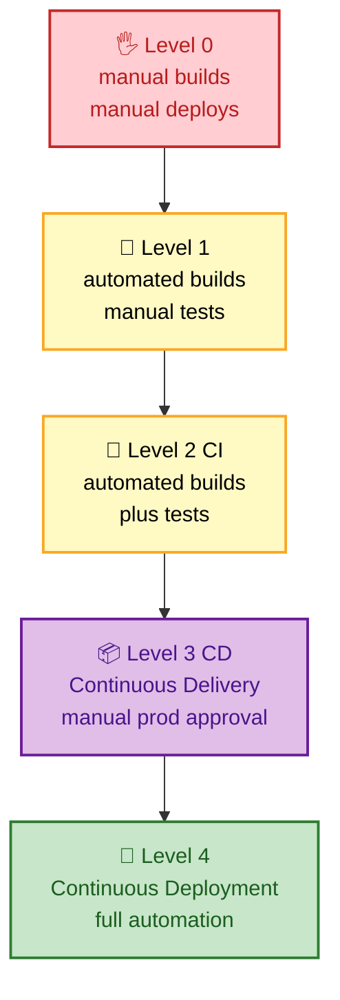
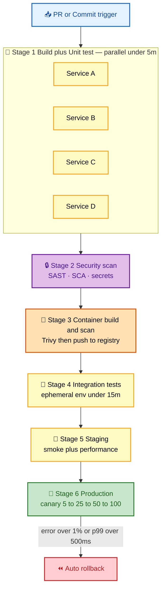
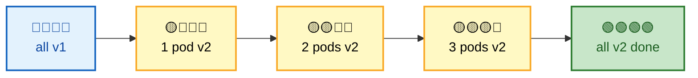
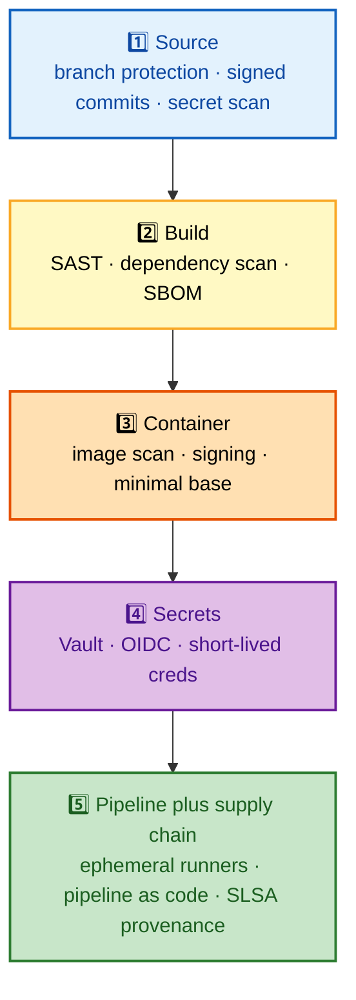

# CI/CD Interview Questions - Complete Guide

> **300+ CI/CD Interview Questions for Senior DevOps Engineer, SRE, and Platform Engineer roles at FAANG companies**

---

## 📋 Table of Contents

- [CI/CD Fundamentals](#cicd-fundamentals)
- [Pipeline Design](#pipeline-design)
- [Deployment Strategies](#deployment-strategies)
- [Testing in Pipelines](#testing-in-pipelines)
- [Security in CI/CD](#security-in-cicd)
- [GitOps](#gitops)
- [Troubleshooting](#troubleshooting)

---

## 🗺️ Visual Overview

**Mind map — the whole guide at a glance** (skim first, revisit last):



**The CI/CD pipeline — memorize this flow (source → build → test → deploy):**

```mermaid
flowchart LR
    classDef start fill:#e3f2fd,stroke:#1565c0,color:#0d47a1,stroke-width:2px;
    classDef proc fill:#fff9c4,stroke:#f9a825,color:#000,stroke-width:2px;
    classDef good fill:#c8e6c9,stroke:#2e7d32,color:#1b5e20,stroke-width:2px;
    classDef bad fill:#ffcdd2,stroke:#c62828,color:#b71c1c,stroke-width:2px;
    classDef ctrl fill:#e1bee7,stroke:#6a1b9a,color:#4a148c,stroke-width:2px;
    classDef store fill:#ffe0b2,stroke:#e65100,color:#000,stroke-width:2px;
    A["📥 Source<br/>commit / PR"] --> B["🔨 Build<br/>compile and package"]
    B --> C["🧪 Test<br/>unit to integration to E2E"]
    C --> D["🔒 Scan<br/>SAST · SCA · image"]
    D --> E["📦 Artifact<br/>push to registry"]
    E --> F["🚀 Deploy<br/>staging then prod"]
    F --> G["📈 Operate<br/>monitor and feedback"]
    class A start
    class B,C proc
    class D ctrl
    class E store
    class F,G good
```



**Blue-Green vs Canary — the two big-name strategies side by side:**



**Deployment strategy decision tree — pick the right rollout:**



> 🧠 **Memory hooks (mnemonics):**
> - **Pipeline order:** *"Some Boys Test Deploy Openly"* → **S**ource → **B**uild → **T**est → **D**eploy → **O**perate.
> - **The three Cs ladder:** *Integration* stops at **test**; *Delivery* stops at a **manual gate**; *Deployment* goes **all the way to prod** with no human. "Delivery = deployable; Deployment = deployed."
> - **Deploy strategies — "BCRF":** **B**lue-green (flip), **C**anary (creep), **R**olling (replace), **F**eature-flag (toggle).
> - **Testing pyramid:** *"Many Unit, Some Integration, Few E2E"* — cheap and fast at the bottom, expensive and slow at the top.
> - **Rollback rule:** *"Fast flip beats slow crawl"* — blue-green rolls back instantly; rolling update rolls back one pod at a time.

---

## CI/CD Fundamentals

### 🟢 Basic Questions

#### Q1: Explain the difference between CI, CD, and CD.

**Basic Answer:**
- **CI (Continuous Integration)**: Frequently merging code changes with automated testing
- **CD (Continuous Delivery)**: Automated pipeline to prepare releases, manual deployment trigger
- **CD (Continuous Deployment)**: Fully automated deployment to production without manual gates

**Advanced Answer:**

```
┌─────────────────────────────────────────────────────────────────┐
│                    CI/CD SPECTRUM                                │
├─────────────────────────────────────────────────────────────────┤
│                                                                  │
│  CODE → BUILD → TEST → RELEASE → DEPLOY → OPERATE               │
│                                                                  │
│  ┌─────────────────────────────────────────────────────────┐    │
│  │                                                          │    │
│  │  CONTINUOUS INTEGRATION (CI)                             │    │
│  │  ├────────────────────────────┤                          │    │
│  │  Code    Build    Test                                   │    │
│  │                                                          │    │
│  │  • Developers merge frequently (daily+)                  │    │
│  │  • Automated build on each commit                        │    │
│  │  • Automated unit/integration tests                      │    │
│  │  • Fast feedback loop (< 10 minutes ideal)               │    │
│  │                                                          │    │
│  └─────────────────────────────────────────────────────────┘    │
│                                                                  │
│  ┌─────────────────────────────────────────────────────────┐    │
│  │                                                          │    │
│  │  CONTINUOUS DELIVERY                                     │    │
│  │  ├─────────────────────────────────────────────┤         │    │
│  │  Code    Build    Test    Release    [Manual] Deploy     │    │
│  │                                                          │    │
│  │  • Automated pipeline to production-ready state          │    │
│  │  • One-click deployment possible                         │    │
│  │  • Manual approval before production                     │    │
│  │  • Always in deployable state                            │    │
│  │                                                          │    │
│  └─────────────────────────────────────────────────────────┘    │
│                                                                  │
│  ┌─────────────────────────────────────────────────────────┐    │
│  │                                                          │    │
│  │  CONTINUOUS DEPLOYMENT                                   │    │
│  │  ├──────────────────────────────────────────────────────┤│    │
│  │  Code    Build    Test    Release    Deploy              │    │
│  │                                                          │    │
│  │  • Every passing commit deploys to production            │    │
│  │  • No manual intervention                                │    │
│  │  • Requires excellent test coverage                      │    │
│  │  • Strong monitoring and rollback capability             │    │
│  │                                                          │    │
│  └─────────────────────────────────────────────────────────┘    │
│                                                                  │
│  MATURITY PROGRESSION:                                          │
│  ┌─────────────────────────────────────────────────────────┐    │
│  │                                                          │    │
│  │  Level 0: Manual builds, manual deploys                  │    │
│  │     ↓                                                    │    │
│  │  Level 1: Automated builds, manual tests                 │    │
│  │     ↓                                                    │    │
│  │  Level 2: CI - Automated builds + tests                  │    │
│  │     ↓                                                    │    │
│  │  Level 3: Continuous Delivery - Manual prod approval     │    │
│  │     ↓                                                    │    │
│  │  Level 4: Continuous Deployment - Full automation        │    │
│  │                                                          │    │
│  └─────────────────────────────────────────────────────────┘    │
│                                                                  │
└─────────────────────────────────────────────────────────────────┘
```

**Colorful view — where each "C" stops automating:**



**Maturity ladder — climb one rung at a time:**



> 💡 **Interview tip:** The one-liner that lands: *"Continuous **Delivery** means every change is **deployable**; Continuous **Deployment** means every change is **deployed** automatically."* The only difference is a human approval gate.

> ⚠️ **Gotcha:** "CI" is not "we run a build server." True CI requires developers merging to trunk **frequently** (at least daily) — long-lived feature branches that integrate once a week are the opposite of continuous integration.

---

## Pipeline Design

### 🟡 Intermediate Questions

#### Q2: Design a CI/CD pipeline for a microservices application.

**Basic Answer:**
Multi-stage pipeline with build, test, security scan, container build, deployment to staging, and production deployment with approval gates.

**Advanced Answer:**

```
┌─────────────────────────────────────────────────────────────────┐
│              MICROSERVICES CI/CD PIPELINE                        │
├─────────────────────────────────────────────────────────────────┤
│                                                                  │
│  PR/COMMIT TRIGGERS                                             │
│       │                                                          │
│       ▼                                                          │
│  ┌─────────────────────────────────────────────────────────┐    │
│  │ STAGE 1: BUILD & UNIT TEST (Parallel per service)       │    │
│  │ ┌─────────┐ ┌─────────┐ ┌─────────┐ ┌─────────┐        │    │
│  │ │Service A│ │Service B│ │Service C│ │Service D│        │    │
│  │ │- Build  │ │- Build  │ │- Build  │ │- Build  │        │    │
│  │ │- Unit   │ │- Unit   │ │- Unit   │ │- Unit   │        │    │
│  │ │  tests  │ │  tests  │ │  tests  │ │  tests  │        │    │
│  │ │- Lint   │ │- Lint   │ │- Lint   │ │- Lint   │        │    │
│  │ └─────────┘ └─────────┘ └─────────┘ └─────────┘        │    │
│  │ Target: < 5 minutes                                     │    │
│  └─────────────────────────────────────────────────────────┘    │
│       │                                                          │
│       ▼                                                          │
│  ┌─────────────────────────────────────────────────────────┐    │
│  │ STAGE 2: SECURITY SCANNING                              │    │
│  │ ┌──────────────┐ ┌──────────────┐ ┌──────────────┐     │    │
│  │ │ SAST (Semgrep│ │ Dependency   │ │ Secret       │     │    │
│  │ │ SonarQube)   │ │ Scan (Snyk)  │ │ Detection    │     │    │
│  │ └──────────────┘ └──────────────┘ └──────────────┘     │    │
│  └─────────────────────────────────────────────────────────┘    │
│       │                                                          │
│       ▼                                                          │
│  ┌─────────────────────────────────────────────────────────┐    │
│  │ STAGE 3: CONTAINER BUILD & SCAN                         │    │
│  │ ┌──────────────┐ ┌──────────────┐ ┌──────────────┐     │    │
│  │ │ Docker Build │ │ Image Scan   │ │ Push to      │     │    │
│  │ │ (multi-stage)│ │ (Trivy)      │ │ Registry     │     │    │
│  │ └──────────────┘ └──────────────┘ └──────────────┘     │    │
│  └─────────────────────────────────────────────────────────┘    │
│       │                                                          │
│       ▼                                                          │
│  ┌─────────────────────────────────────────────────────────┐    │
│  │ STAGE 4: INTEGRATION TESTING                            │    │
│  │ ┌──────────────────────────────────────────────────┐    │    │
│  │ │ Deploy to Ephemeral Environment                   │    │    │
│  │ │ • Spin up test namespace in Kubernetes            │    │    │
│  │ │ • Deploy all services with test config            │    │    │
│  │ │ • Run API integration tests                       │    │    │
│  │ │ • Run E2E tests                                   │    │    │
│  │ │ • Tear down environment                           │    │    │
│  │ └──────────────────────────────────────────────────┘    │    │
│  │ Target: < 15 minutes                                    │    │
│  └─────────────────────────────────────────────────────────┘    │
│       │                                                          │
│       ▼                                                          │
│  ┌─────────────────────────────────────────────────────────┐    │
│  │ STAGE 5: STAGING DEPLOYMENT                             │    │
│  │ ┌──────────────┐ ┌──────────────┐ ┌──────────────┐     │    │
│  │ │ Deploy to    │ │ Smoke Tests  │ │ Performance  │     │    │
│  │ │ Staging      │ │              │ │ Tests        │     │    │
│  │ └──────────────┘ └──────────────┘ └──────────────┘     │    │
│  └─────────────────────────────────────────────────────────┘    │
│       │                                                          │
│       ▼                                                          │
│  ┌─────────────────────────────────────────────────────────┐    │
│  │ STAGE 6: PRODUCTION DEPLOYMENT                          │    │
│  │                                                          │    │
│  │  [Manual Approval Gate for Continuous Delivery]         │    │
│  │                    OR                                    │    │
│  │  [Automatic for Continuous Deployment]                  │    │
│  │                                                          │    │
│  │ ┌──────────────────────────────────────────────────┐    │    │
│  │ │ Progressive Rollout:                              │    │    │
│  │ │                                                   │    │    │
│  │ │ 1. Canary (5% traffic)                            │    │    │
│  │ │    └─ Monitor metrics for 10 min                  │    │    │
│  │ │ 2. Scale to 25%                                   │    │    │
│  │ │    └─ Monitor for 10 min                          │    │    │
│  │ │ 3. Scale to 50%                                   │    │    │
│  │ │    └─ Monitor for 10 min                          │    │    │
│  │ │ 4. Full rollout (100%)                            │    │    │
│  │ │                                                   │    │    │
│  │ │ Automatic rollback if:                            │    │    │
│  │ │ • Error rate > 1%                                 │    │    │
│  │ │ • p99 latency > 500ms                             │    │    │
│  │ │ • Health check failures                           │    │    │
│  │ └──────────────────────────────────────────────────┘    │    │
│  └─────────────────────────────────────────────────────────┘    │
│                                                                  │
└─────────────────────────────────────────────────────────────────┘
```

**Colorful stage flow — six stages with an auto-rollback safety net:**



> 💡 **Interview tip:** Emphasize **fast feedback first** — cheap parallel unit tests up front (fail in minutes), expensive integration and E2E later. Put security scanning early ("shift left") so vulnerabilities block the build before an image is ever pushed.

GitHub Actions Example:
```yaml
name: CI/CD Pipeline
on:
  push:
    branches: [main]
  pull_request:
    branches: [main]

jobs:
  build-and-test:
    runs-on: ubuntu-latest
    strategy:
      matrix:
        service: [api, worker, frontend]
    steps:
      - uses: actions/checkout@v4
      
      - name: Build
        run: docker build -t ${{ matrix.service }} ./services/${{ matrix.service }}
      
      - name: Unit Tests
        run: docker run ${{ matrix.service }} npm test
      
      - name: Upload artifact
        uses: actions/upload-artifact@v4
        with:
          name: ${{ matrix.service }}
          path: ./services/${{ matrix.service }}/dist

  security-scan:
    needs: build-and-test
    runs-on: ubuntu-latest
    steps:
      - uses: actions/checkout@v4
      
      - name: Run Trivy vulnerability scanner
        uses: aquasecurity/trivy-action@master
        with:
          scan-type: 'fs'
          scan-ref: '.'
          severity: 'CRITICAL,HIGH'

  deploy-staging:
    needs: security-scan
    if: github.ref == 'refs/heads/main'
    runs-on: ubuntu-latest
    environment: staging
    steps:
      - name: Deploy to Staging
        run: |
          kubectl apply -f k8s/staging/

  deploy-production:
    needs: deploy-staging
    runs-on: ubuntu-latest
    environment: production
    steps:
      - name: Canary Deploy
        run: |
          kubectl apply -f k8s/production/
          kubectl set image deployment/api api=api:${{ github.sha }}
```

---

## Deployment Strategies

### 🔴 Advanced Questions

#### Q3: Compare deployment strategies and when to use each.

**Basic Answer:**
Blue-green for instant rollback, canary for gradual rollout and risk mitigation, rolling update for zero-downtime, recreate for simplicity.

**Advanced Answer:**

```
┌─────────────────────────────────────────────────────────────────┐
│                    DEPLOYMENT STRATEGIES                         │
├─────────────────────────────────────────────────────────────────┤
│                                                                  │
│  1. BLUE-GREEN DEPLOYMENT                                       │
│  ┌─────────────────────────────────────────────────────────┐    │
│  │                                                          │    │
│  │  Load Balancer                                           │    │
│  │       │                                                  │    │
│  │       ├──────────────┬──────────────┐                    │    │
│  │       ▼              │              ▼                    │    │
│  │  ┌─────────┐         │         ┌─────────┐              │    │
│  │  │  BLUE   │ Active  │         │  GREEN  │ Idle         │    │
│  │  │  v1.0   │ ◀───────┘         │  v1.1   │              │    │
│  │  └─────────┘                   └─────────┘              │    │
│  │                                                          │    │
│  │  Switch: DNS or LB config change                         │    │
│  │  Rollback: Switch back to Blue (instant)                 │    │
│  │                                                          │    │
│  │  ✓ Instant rollback                                      │    │
│  │  ✓ Full testing in production environment                │    │
│  │  ✓ Zero downtime                                         │    │
│  │  ✗ 2x infrastructure cost                                │    │
│  │  ✗ Database migrations are complex                       │    │
│  │                                                          │    │
│  │  Use when: Mission-critical apps, fast rollback needed   │    │
│  │                                                          │    │
│  └─────────────────────────────────────────────────────────┘    │
│                                                                  │
│  2. CANARY DEPLOYMENT                                           │
│  ┌─────────────────────────────────────────────────────────┐    │
│  │                                                          │    │
│  │  Traffic Split:                                          │    │
│  │  ┌────────────────────────────────────────────────────┐  │    │
│  │  │░░░░░░░░░░░░░░░░░░░░░░░░░░░░░░░░░░░░░░░░░░░░░░████│  │    │
│  │  │           v1.0 (95%)                    │ v1.1 │  │    │
│  │  └────────────────────────────────────────────────────┘  │    │
│  │                                                          │    │
│  │  Progressive:                                            │    │
│  │  5% ──▶ 25% ──▶ 50% ──▶ 100%                             │    │
│  │                                                          │    │
│  │  ✓ Limited blast radius                                  │    │
│  │  ✓ Real traffic validation                               │    │
│  │  ✓ Can monitor metrics before full rollout               │    │
│  │  ✗ More complex to implement                             │    │
│  │  ✗ Requires sophisticated routing                        │    │
│  │                                                          │    │
│  │  Use when: High-risk changes, A/B testing needed         │    │
│  │                                                          │    │
│  └─────────────────────────────────────────────────────────┘    │
│                                                                  │
│  3. ROLLING UPDATE                                              │
│  ┌─────────────────────────────────────────────────────────┐    │
│  │                                                          │    │
│  │  Step 1:    [v1][v1][v1][v1]                             │    │
│  │  Step 2:    [v2][v1][v1][v1]    ← 1 pod updated          │    │
│  │  Step 3:    [v2][v2][v1][v1]                             │    │
│  │  Step 4:    [v2][v2][v2][v1]                             │    │
│  │  Step 5:    [v2][v2][v2][v2]    ← Complete               │    │
│  │                                                          │    │
│  │  Kubernetes:                                             │    │
│  │  strategy:                                               │    │
│  │    type: RollingUpdate                                   │    │
│  │    rollingUpdate:                                        │    │
│  │      maxUnavailable: 25%                                 │    │
│  │      maxSurge: 25%                                       │    │
│  │                                                          │    │
│  │  ✓ No additional infrastructure                          │    │
│  │  ✓ Gradual rollout                                       │    │
│  │  ✓ Native Kubernetes support                             │    │
│  │  ✗ Slower rollback                                       │    │
│  │  ✗ Both versions run simultaneously                      │    │
│  │                                                          │    │
│  │  Use when: Standard deployments, stateless apps          │    │
│  │                                                          │    │
│  └─────────────────────────────────────────────────────────┘    │
│                                                                  │
│  4. FEATURE FLAGS                                               │
│  ┌─────────────────────────────────────────────────────────┐    │
│  │                                                          │    │
│  │  Decouple deployment from release:                       │    │
│  │                                                          │    │
│  │  if (featureFlags.isEnabled('new-checkout')) {           │    │
│  │    return newCheckoutFlow();                             │    │
│  │  } else {                                                │    │
│  │    return legacyCheckoutFlow();                          │    │
│  │  }                                                       │    │
│  │                                                          │    │
│  │  ✓ Deploy anytime, release when ready                    │    │
│  │  ✓ Instant rollback (toggle flag)                        │    │
│  │  ✓ A/B testing built-in                                  │    │
│  │  ✓ Percentage rollouts                                   │    │
│  │  ✗ Code complexity                                       │    │
│  │  ✗ Technical debt if flags not cleaned up                │    │
│  │                                                          │    │
│  │  Use when: High-risk features, gradual rollout needed    │    │
│  │                                                          │    │
│  └─────────────────────────────────────────────────────────┘    │
│                                                                  │
└─────────────────────────────────────────────────────────────────┘
```

**Rolling update — replace pods one batch at a time (blue = old, green = new):**



**Strategy chooser — trade-offs at a glance:**

| Strategy | Rollback speed | Extra infra | Blast radius | Best for |
|----------|----------------|-------------|--------------|----------|
| 🔵🟢 Blue-Green | ⚡ Instant | 2x | All-or-nothing | Mission-critical, fast rollback |
| 🐤 Canary | 🟢 Fast | Small | Tiny (a %) | High-risk changes, metric-gated |
| 🔁 Rolling | 🟡 Slower | None | Gradual | Standard stateless apps |
| 🚩 Feature flags | ⚡ Instant toggle | None | Per-user/% | Decoupling release from deploy |

> ⚠️ **Gotcha:** Blue-green and canary get complicated the moment a **database migration** is involved — old and new code run against the same schema simultaneously. Use **backward-compatible / expand-contract migrations** (add column → deploy → backfill → switch → drop) so both versions stay happy.

---

## Security in CI/CD

### 🔴 Advanced Questions

#### Q4: How do you secure a CI/CD pipeline?

**Basic Answer:**
Secure secrets management, scan for vulnerabilities, sign artifacts, limit access with RBAC, audit pipeline changes.

**Advanced Answer:**

```
┌─────────────────────────────────────────────────────────────────┐
│                    CI/CD SECURITY                                │
├─────────────────────────────────────────────────────────────────┤
│                                                                  │
│  SECURITY LAYERS:                                               │
│                                                                  │
│  1. SOURCE CODE SECURITY                                        │
│  ┌─────────────────────────────────────────────────────────┐    │
│  │  • Branch protection rules                               │    │
│  │    - Require PR reviews                                  │    │
│  │    - Require signed commits                              │    │
│  │    - Block force pushes                                  │    │
│  │  • Secret scanning (GitLeaks, TruffleHog)                │    │
│  │  • Pre-commit hooks for sensitive data                   │    │
│  └─────────────────────────────────────────────────────────┘    │
│                                                                  │
│  2. BUILD SECURITY                                              │
│  ┌─────────────────────────────────────────────────────────┐    │
│  │  • SAST (Static Application Security Testing)            │    │
│  │    - Semgrep, SonarQube, Checkmarx                       │    │
│  │  • Dependency scanning                                   │    │
│  │    - Snyk, Dependabot, OWASP Dependency-Check            │    │
│  │  • License compliance                                    │    │
│  │  • SBOM generation (Software Bill of Materials)          │    │
│  └─────────────────────────────────────────────────────────┘    │
│                                                                  │
│  3. CONTAINER SECURITY                                          │
│  ┌─────────────────────────────────────────────────────────┐    │
│  │  • Image scanning (Trivy, Clair, Anchore)                │    │
│  │  • Base image policy (approved images only)              │    │
│  │  • Image signing (Cosign, Notary)                        │    │
│  │  • Minimal base images (distroless, scratch)             │    │
│  └─────────────────────────────────────────────────────────┘    │
│                                                                  │
│  4. SECRETS MANAGEMENT                                          │
│  ┌─────────────────────────────────────────────────────────┐    │
│  │                                                          │    │
│  │  ❌ DON'T:                                               │    │
│  │  • Hardcode secrets in code                              │    │
│  │  • Store in environment variables (visible in logs)      │    │
│  │  • Commit .env files                                     │    │
│  │                                                          │    │
│  │  ✓ DO:                                                   │    │
│  │  • Use secrets manager (Vault, AWS Secrets Manager)      │    │
│  │  • Inject at runtime, not build time                     │    │
│  │  • Rotate secrets regularly                              │    │
│  │  • Use short-lived credentials (OIDC)                    │    │
│  │                                                          │    │
│  │  GitHub Actions OIDC Example:                            │    │
│  │  permissions:                                            │    │
│  │    id-token: write                                       │    │
│  │  steps:                                                  │    │
│  │    - uses: aws-actions/configure-aws-credentials@v4      │    │
│  │      with:                                               │    │
│  │        role-to-assume: arn:aws:iam::123:role/deploy      │    │
│  │                                                          │    │
│  └─────────────────────────────────────────────────────────┘    │
│                                                                  │
│  5. PIPELINE SECURITY                                           │
│  ┌─────────────────────────────────────────────────────────┐    │
│  │  • Immutable build environments                          │    │
│  │  • Isolated runners (ephemeral, not shared)              │    │
│  │  • Pipeline-as-code in version control                   │    │
│  │  • Approval gates for production                         │    │
│  │  • Audit logging of all pipeline executions              │    │
│  └─────────────────────────────────────────────────────────┘    │
│                                                                  │
│  SUPPLY CHAIN SECURITY:                                         │
│  ┌─────────────────────────────────────────────────────────┐    │
│  │                                                          │    │
│  │  SLSA Framework Levels:                                  │    │
│  │  Level 1: Documentation of build process                 │    │
│  │  Level 2: Tamper resistance, hosted build                │    │
│  │  Level 3: Source verified, ephemeral environment         │    │
│  │  Level 4: Two-person review, hermetic builds             │    │
│  │                                                          │    │
│  │  Implement:                                              │    │
│  │  • Sign artifacts (Sigstore/Cosign)                      │    │
│  │  • Attestation of build provenance                       │    │
│  │  • Verify signatures before deployment                   │    │
│  │                                                          │    │
│  └─────────────────────────────────────────────────────────┘    │
│                                                                  │
└─────────────────────────────────────────────────────────────────┘
```

**Colorful defense-in-depth — five layers plus the supply chain:**



> 💡 **Interview tip:** Frame CI/CD security as **"shift left, sign everything, trust nothing."** Scan early (source and build), sign artifacts and verify signatures before deploy (Cosign/Sigstore), and use **short-lived OIDC credentials** instead of long-lived static secrets in the pipeline.

> ⚠️ **Gotcha:** Passing secrets as plain **environment variables** can leak them into build logs and child processes. Inject secrets at **runtime** from a secrets manager, mask them in logs, and never `echo` them during debugging.

---

## 📚 Documentation Links

- [GitHub Actions Documentation](https://docs.github.com/en/actions)
- [GitLab CI/CD](https://docs.gitlab.com/ee/ci/)
- [SLSA Security Framework](https://slsa.dev/)
- [OWASP CI/CD Security](https://owasp.org/www-project-devsecops-guideline/)

---

**[← Back to Main README](../README.md)** | **[Next: GitOps →](../gitops/README.md)**
