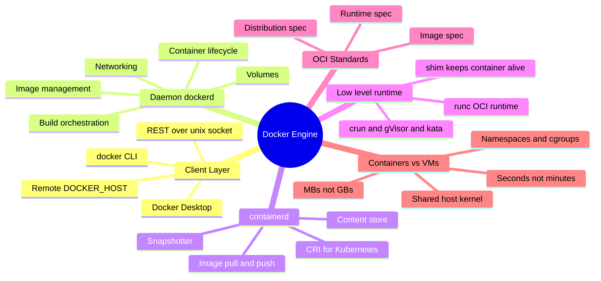
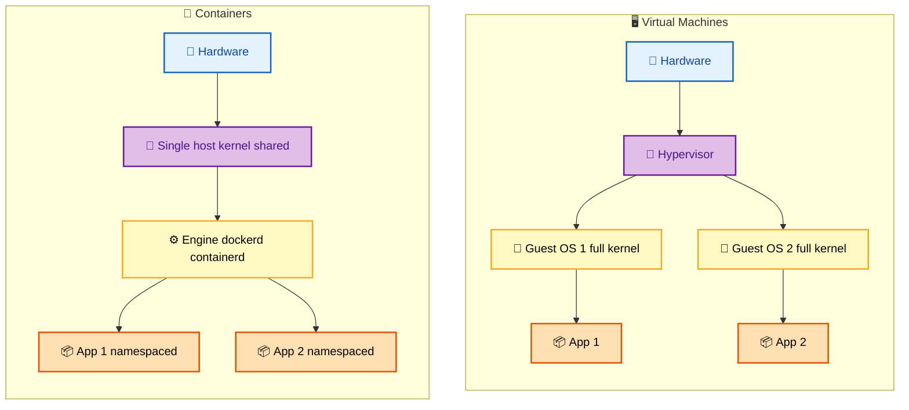

# SECTION 1: Docker Architecture

> **Scope:** The Docker engine and its runtime stack — `docker` CLI → `dockerd` → `containerd` → `shim` → `runc`, the OCI standards that glue them, client-server communication, the build path, and how containers differ from VMs.

---

## 🗺️ Visual Overview

**In one line:** Docker is not one program — it's a layered stack where the CLI is a thin REST client, `dockerd` orchestrates, `containerd` manages image and container lifecycle, and only `runc` actually makes the container using kernel primitives.

**Mind map — the architecture at a glance** (skim first, revisit last):



**The call chain — docker run from CLI to running process** (the #1 architecture question):

```mermaid
flowchart LR
    A["💻 docker CLI<br/>docker run nginx"] -->|"REST API<br/>/var/run/docker.sock"| B["🧠 dockerd<br/>daemon"]
    B -->|"gRPC"| C["⚙️ containerd<br/>image + lifecycle"]
    C -->|"forks"| S["🧩 containerd-shim<br/>reparents container"]
    S -->|"exec"| D["🔧 runc<br/>OCI runtime"]
    D -->|"clone + unshare + pivot_root"| E["📦 Container process<br/>namespaces + cgroups"]
    D -->|"exits after start"| X["🗑️ runc gone<br/>shim stays as parent"]
    E --> F["✅ PID 1 running<br/>isolated"]

    classDef start fill:#e3f2fd,stroke:#1565c0,color:#0d47a1,stroke-width:2px;
    classDef proc  fill:#fff9c4,stroke:#f9a825,color:#000,stroke-width:2px;
    classDef good  fill:#c8e6c9,stroke:#2e7d32,color:#1b5e20,stroke-width:2px;
    classDef bad   fill:#ffcdd2,stroke:#c62828,color:#b71c1c,stroke-width:2px;
    classDef ctrl  fill:#e1bee7,stroke:#6a1b9a,color:#4a148c,stroke-width:2px;
    classDef store fill:#ffe0b2,stroke:#e65100,color:#000,stroke-width:2px;

    class A start;
    class B,C ctrl;
    class S,D proc;
    class E store;
    class X bad;
    class F good;
```



**Containers vs VMs — where the isolation boundary sits** (blue = hardware, purple = shared kernel, orange = per-tenant):



> 🧠 **Memory hooks (mnemonics):**
> - **The runtime stack — "Dogs CanShim Run":** **d**ockerd → **c**ontainerd → **s**him → **r**unc. The CLI only talks to `dockerd`; only `runc` makes the container.
> - **Why the shim exists:** the shim is the container's *babysitter* — it keeps the container alive and its stdio/exit-code intact even if `dockerd` restarts. "runc is the doctor who delivers the baby and leaves; the shim is the parent who stays."
> - **OCI split — "RID":** **R**untime spec (how to run), **I**mage spec (how it's packed), **D**istribution spec (how it's shipped).
> - **Containers vs VMs:** "VM = own kernel, Container = shared kernel." Everything (size, speed, isolation strength) follows from that one fact.

---

## 1. The Docker Runtime Stack

> 🎯 **Interview weight: High** — the single most common Docker architecture question; know each layer and why it exists.

**In one line:** `docker run` travels through four cooperating programs, each at a different level of abstraction, and being able to name where `runc` sits proves you understand OCI rather than just the CLI.

| Layer | Component | Responsibility | Lifetime |
|---|---|---|---|
| Client | `docker` CLI | Parses commands, calls REST API | Per-command |
| Daemon | `dockerd` | Images, networks, volumes, builds, API | Long-running |
| High-level runtime | `containerd` | Pull/push, snapshots, container supervision | Long-running |
| Shim | `containerd-shim` | Keeps one container alive, owns its stdio/exit | Per-container |
| Low-level runtime | `runc` | `clone()`/`unshare()` namespaces + cgroups, then exits | Momentary |

**Why so many layers?** Separation of concerns and Kubernetes. Kubernetes talks to `containerd` directly via the **CRI** (Container Runtime Interface) and skips `dockerd` entirely — this is why Kubernetes deprecated the "dockershim" in v1.24. `runc` is swappable for alternative OCI runtimes (`crun`, `gVisor/runsc`, `kata-containers`) without changing anything above it.

> 💡 **Interview tip:** The clean one-liner interviewers want: *"The CLI is a REST client; `dockerd` orchestrates; `containerd` manages image and container lifecycle; `runc` does the low-level `clone()`/`unshare()` to build namespaces and cgroups, then exits and leaves the shim as the container's parent."*

---

## 2. Docker vs containerd vs CRI-O

> 🎯 **Interview weight: Medium** — expected once the conversation turns to Kubernetes runtimes.

**In one line:** They live at different layers — Docker is a full developer toolkit, while `containerd` and CRI-O are lean production runtimes that Kubernetes drives through the CRI.

| Feature | Docker | containerd | CRI-O |
|---|---|---|---|
| Kubernetes integration | Via deprecated shim | Native CRI | Native CRI (K8s-only) |
| Builds images | Yes (BuildKit) | No (use `buildctl`/`nerdctl`) | No |
| Swarm support | Yes | No | No |
| Footprint | Largest | Medium | Smallest |
| Best for | Local dev | Production K8s, general | Minimal K8s clusters |

> 🔍 **Deep dive:** "Kubernetes removed Docker" does **not** mean your Docker-built images stopped working. Images are **OCI-standard**; Kubernetes just stopped using `dockerd` as the node runtime and talks to `containerd` (which Docker itself bundles) directly. Your `docker build` output runs unchanged.

---

## 3. OCI — The Standards That Prevent Lock-In

> 🎯 **Interview weight: Medium** — cite OCI to show you understand the ecosystem, not just Docker.

**In one line:** The Open Container Initiative defines three specs so any compliant tool can build, ship, and run any compliant image — which is exactly why you can build with Docker and run on containerd, Podman, or Kubernetes.

- **Runtime spec** — how a "bundle" (rootfs + `config.json`) is turned into a running container. `runc` is the reference implementation.
- **Image spec** — the on-disk format of layers, the manifest, and the config JSON (entrypoint, env, layers digest list).
- **Distribution spec** — the registry HTTP API for `push`/`pull` (what Docker Hub, ECR, GCR, Harbor all speak).

> 💡 **Interview tip:** If asked "what is an image, really?" — *"A tar of filesystem layers plus a JSON config describing how to run it, addressed by content digest, all defined by the OCI image spec."*

---

## 4. Client-Server Communication

> 🎯 **Interview weight: Low-Medium** — matters for security and remote-Docker questions.

**In one line:** The CLI never runs containers itself; it sends HTTP requests to `dockerd` over a Unix socket (`/var/run/docker.sock`), which is exactly why access to that socket equals root on the host.

- Default transport: Unix domain socket `/var/run/docker.sock`.
- Remote: set `DOCKER_HOST=tcp://host:2376` with TLS (`2375` is unencrypted — never expose it).
- The daemon is a persistent background process; the CLI is stateless and short-lived.

> ⚠️ **Gotcha:** Mounting `/var/run/docker.sock` into a container hands that container **full control of the host Docker daemon** — it can start a privileged container and escape. Treat the socket as a root credential; never mount it into untrusted workloads.

---

## 5. The Build Path (dockerd vs BuildKit)

> 🎯 **Interview weight: Medium** — leads naturally into image-optimization questions.

**In one line:** Modern `docker build` uses **BuildKit**, which parses the whole Dockerfile into a dependency graph so it can run independent stages in parallel and skip unused ones — a big leap over the old sequential builder.

- **Legacy builder:** executes instructions top-to-bottom, one layer at a time, no parallelism.
- **BuildKit** (default since Docker 23): concurrent stage execution, better cache, cache mounts (`--mount=type=cache`), build secrets (`--mount=type=secret`), and multi-platform builds via `buildx`.

```bash
# Enable BuildKit explicitly (default in modern Docker)
DOCKER_BUILDKIT=1 docker build -t app .

# Multi-arch build pushed straight to a registry
docker buildx build --platform linux/amd64,linux/arm64 -t app:latest --push .
```

See [05-IMAGE-OPTIMIZATION.md](05-IMAGE-OPTIMIZATION.md) for layer caching and multi-stage detail.

---

## Interview Questions & Answers

### Q1: Walk me through exactly what happens when you run `docker run nginx`.

**Answer:** The CLI sends a `POST /containers/create` + `/start` REST call to `dockerd` over the Unix socket. `dockerd` asks `containerd` to ensure the image is present (pulling layers if needed), then to create the container. `containerd` forks a `containerd-shim` which invokes `runc`. `runc` reads the OCI `config.json`, calls `clone()`/`unshare()` to create namespaces, sets up cgroups, `pivot_root`s into the image rootfs, and `exec`s the entrypoint. `runc` then exits, leaving the shim as the container's parent.

**Internals:** The shim survives so the container keeps running and its exit code/stdio are captured even across a `dockerd` restart. `runc` is deliberately short-lived — it's a fork-exec helper, not a supervisor.

**Follow-up — "Why doesn't the container die when dockerd restarts?"** Because its real parent is the `containerd-shim`, not `dockerd`; `containerd` and the shim keep running independently, so daemonless restarts don't kill workloads (live-restore).

### Q2: How do containers differ from virtual machines, and when would you still choose a VM?

**Answer:** Containers share the host kernel and isolate with namespaces/cgroups, so they start in seconds, are MBs in size, and add near-zero overhead. VMs virtualize hardware and run a full guest kernel under a hypervisor — slower to boot, GBs in size, but with a much stronger isolation boundary.

**Internals:** A container escape is a kernel-boundary escape; a VM escape must defeat the hypervisor, a far smaller and more hardened surface. That's why multi-tenant untrusted workloads favor VMs or VM-isolated runtimes.

**Follow-up — "How do you get VM-grade isolation with container UX?"** Use `gVisor` (user-space kernel intercepting syscalls) or `kata-containers` (lightweight microVM per container) — both are OCI runtimes you drop in place of `runc`.

### Q3: Why did Kubernetes deprecate Docker, and did it break existing images?

**Answer:** Kubernetes needs a CRI-compliant runtime; `dockerd` isn't one, so the kubelet used a translation shim ("dockershim") that was extra maintenance burden. Kubernetes 1.24 removed it and now talks to `containerd`/CRI-O directly. Images were unaffected because they're OCI-standard.

**Internals:** Docker already ships `containerd` internally, so on most nodes the actual runtime didn't even change — only the layer the kubelet talked to.

**Follow-up — "What runtime does a typical managed cluster use now?"** `containerd` (EKS, GKE, AKS default) or CRI-O (OpenShift).

### Q4: What is `runc` and why is it swappable?

**Answer:** `runc` is the reference OCI runtime — a small binary that takes a filesystem bundle plus `config.json` and creates the container using kernel syscalls. Because the interface is standardized, `containerd` can call any OCI runtime, so you can swap in `crun` (faster, C-based), `runsc` (gVisor sandbox), or `kata` (microVM) without touching higher layers.

**Internals:** `runc` itself is stateless post-start; supervision lives in the shim. This clean split is what makes alternative runtimes a per-container or per-RuntimeClass choice.

**Follow-up — "How do you pick the runtime per workload in Kubernetes?"** With a `RuntimeClass` object referencing the handler (e.g., `gvisor`), set via `runtimeClassName` in the pod spec.

---

## Production Best Practices

- **Never expose `tcp://:2375`** (plaintext). Use the Unix socket locally or TLS-mutual-auth on `2376` for remote.
- **Protect `docker.sock`** like a root key — don't mount it into containers; if CI needs builds, prefer rootless BuildKit or `buildx` with a remote builder.
- **Enable live-restore** (`"live-restore": true` in `daemon.json`) so containers survive daemon upgrades/restarts.
- **Pin the runtime** in regulated/multi-tenant environments (gVisor/Kata via RuntimeClass) rather than relying on `runc` alone.
- **Prefer `containerd` + `nerdctl`/`buildkit`** on production nodes; keep full Docker for developer laptops.

---

## Documentation Links

- [Docker Engine architecture overview](https://docs.docker.com/get-started/overview/)
- [containerd documentation](https://containerd.io/docs/)
- [runc (OCI runtime)](https://github.com/opencontainers/runc)
- [OCI specifications](https://opencontainers.org/)
- [Kubernetes CRI & dockershim removal](https://kubernetes.io/blog/2022/02/17/dockershim-faq/)

---

**[← Back to Docker Index](README.md)** | **[Next: Container Internals →](02-CONTAINER-INTERNALS.md)**
