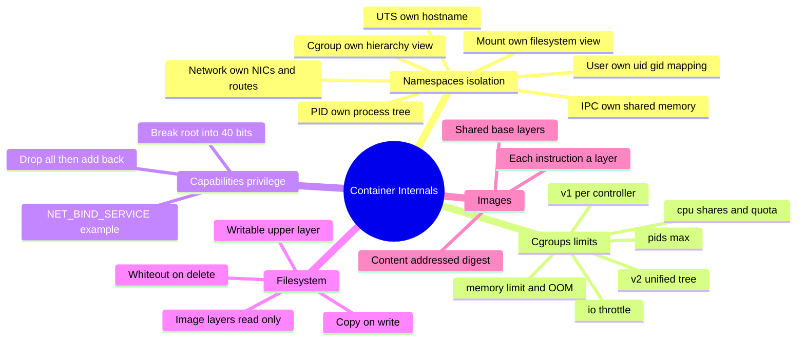
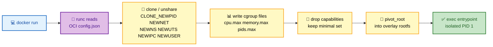
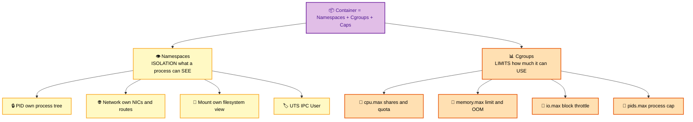
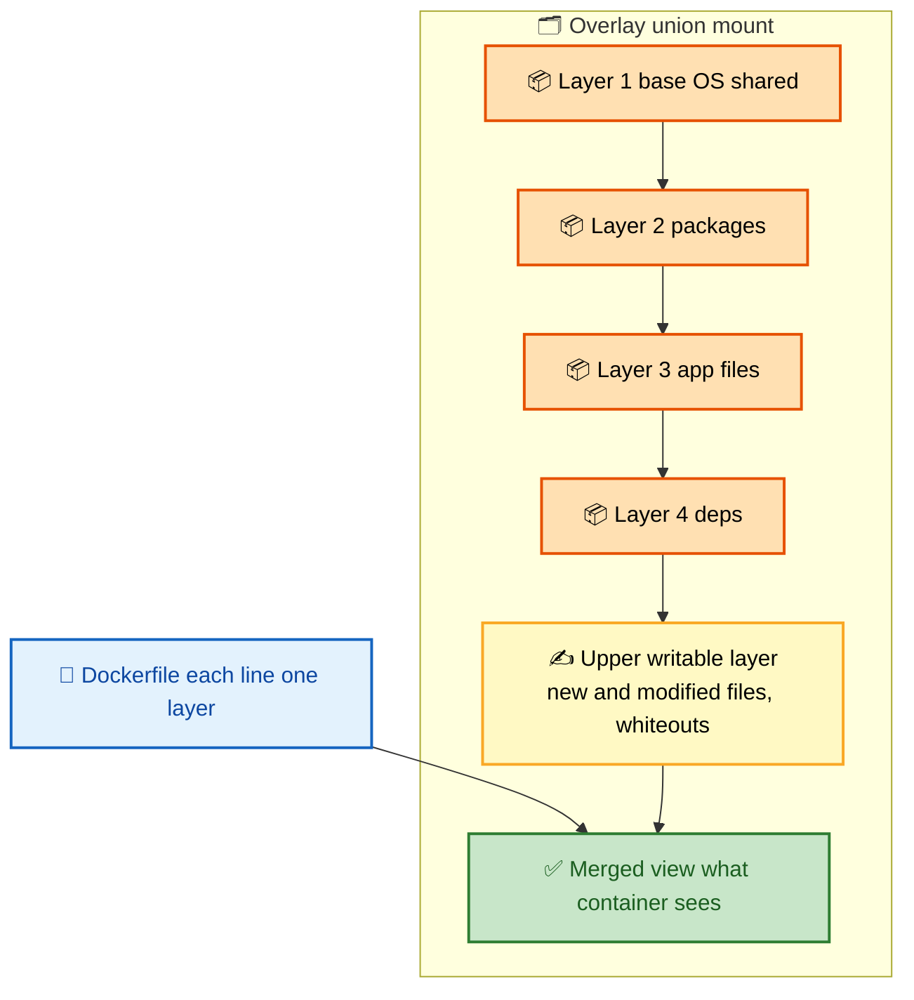

# SECTION 2: Container Internals

> **Scope:** The kernel primitives that *are* a container — namespaces (isolation), cgroups (limits), capabilities (privilege), the union/overlay filesystem, and how images become layered read-only stacks under one writable layer.

---

## 🗺️ Visual Overview

**In one line:** A container is not a thing the kernel knows about — it's an ordinary process wrapped in **namespaces** (what it can see), **cgroups** (how much it can use), **capabilities** (what it's allowed to do), and an **overlay filesystem** (what it reads and writes).

**Mind map — the building blocks** (skim first, revisit last):



**docker run → kernel primitives** (blue = trigger, purple = runtime, yellow = syscalls, green = result):



**Namespaces vs cgroups — the two pillars** (yellow = what you SEE, orange = what you USE):



**Image layers + overlay mount** (orange = read-only layers, yellow = writable, green = merged view):



> 🧠 **Memory hooks (mnemonics):**
> - **Namespaces vs cgroups:** **Namespaces = SEE** (isolation); **cgroups = USE** (limits). "See vs Use" — everything hangs off that split.
> - **Namespace set — "MUNI PC":** **M**ount, **U**TS, **N**etwork, **I**PC, **P**ID, **U**ser, **C**group.
> - **Copy-on-write:** read looks top-down through layers; the *first* write copies the file up to the writable layer ("copy up"); delete writes a **whiteout** that hides — but never removes — the lower file.
> - **Capabilities:** root's power is split into ~40 bits; best practice is `--cap-drop ALL` then add back only what you need (e.g., `NET_BIND_SERVICE` to bind port 80).

---

## 1. Namespaces — What a Container Can See

> 🎯 **Interview weight: High** — the foundation question; know all seven and what each isolates.

**In one line:** Namespaces virtualize a global kernel resource so a process sees its own private instance — the container thinks its PID 1 is *the* PID 1, its `eth0` is *the* network, its `/` is *the* filesystem.

| Namespace | `clone()` flag | Isolates | Interview-critical fact |
|---|---|---|---|
| **PID** | `CLONE_NEWPID` | Process ID tree | Container PID 1 is a random high PID on the host; PID 1 reaps zombies |
| **Network** | `CLONE_NEWNET` | NICs, IPs, routes, iptables | Connected to host via a **veth pair** |
| **Mount** | `CLONE_NEWNS` | Mount points / filesystem view | The very first namespace (2002); enables per-container rootfs |
| **UTS** | `CLONE_NEWUTS` | Hostname, domain name | Why `hostname` inside differs from host |
| **IPC** | `CLONE_NEWIPC` | SysV IPC, POSIX msg queues, shared memory | Isolates `/dev/shm` |
| **User** | `CLONE_NEWUSER` | UID/GID mappings | root (0) inside → unprivileged UID outside; basis of rootless |
| **Cgroup** | `CLONE_NEWCGROUP` | Cgroup root view | Hides the host cgroup paths from the container |

```bash
# Build a container by hand — the primitives runc uses
unshare --mount --uts --ipc --net --pid --fork /bin/bash
hostname isolated            # UTS namespace: only changes here
mount -t proc proc /proc     # PID namespace: now `ps` shows only our tree

# See a running container's namespaces
ls -l /proc/<pid>/ns/        # each link = one namespace inode
lsns                         # list namespaces system-wide
```

> 🔍 **Deep dive — PID 1 matters:** In its PID namespace the container entrypoint *is* PID 1, which inherits special duties: it must reap zombie children and it does **not** get default signal handlers. A naive PID 1 that ignores `SIGTERM` makes `docker stop` hang until the 10s timeout then `SIGKILL`. Use an init (`--init`, `tini`) or handle signals explicitly.

> 💡 **Interview tip:** "Namespaces isolate **what a container sees**." If you can name the seven and give one consequence each (PID→own init, NET→veth, USER→rootless), you're ahead of most candidates.

---

## 2. Cgroups — What a Container Can Use

> 🎯 **Interview weight: High** — pairs with namespaces; know v1 vs v2 and the OOM story.

**In one line:** Control groups meter and cap a process tree's CPU, memory, I/O, and PID count — the "resource governor" half of a container.

| Resource | v1 knob | v2 knob | Effect |
|---|---|---|---|
| CPU | `cpu.cfs_quota_us`/`cpu.shares` | `cpu.max`, `cpu.weight` | Hard cap and relative weight |
| Memory | `memory.limit_in_bytes` | `memory.max`, `memory.high` | Hard cap; exceed → OOM kill |
| Block I/O | `blkio.weight`/`throttle` | `io.max`, `io.weight` | Throttle read/write bandwidth |
| PIDs | `pids.max` | `pids.max` | Cap process count (fork-bomb guard) |

**cgroups v1 vs v2:**

- **v1:** a *separate hierarchy per controller* (`/sys/fs/cgroup/cpu/...`, `/sys/fs/cgroup/memory/...`). Flexible but messy; controllers can disagree on process placement.
- **v2:** a single **unified hierarchy** (`/sys/fs/cgroup/<path>`) with per-node `*.max` files. Default on modern distros; required for cgroup-namespaced rootless and for proper memory+CPU pressure accounting (PSI).

```bash
# Set a hard memory cap by hand (cgroup v1)
mkdir /sys/fs/cgroup/memory/demo
echo 100000000 > /sys/fs/cgroup/memory/demo/memory.limit_in_bytes
echo $$ > /sys/fs/cgroup/memory/demo/cgroup.procs

# Docker equivalent
docker run --memory=256m --memory-swap=256m --cpus=0.5 --pids-limit=100 nginx
```

> ⚠️ **Gotcha:** A memory limit counts **page cache** too, and hitting `memory.max` triggers the **cgroup OOM killer**, which kills a process *inside the container* — you see exit code **137** (128 + SIGKILL 9). Setting `--memory` without `--memory-swap` equal to it silently allows swap to 2×; set them equal to truly cap RAM.

> 💡 **Interview tip:** Exit **137 = OOM-killed**, **143 = SIGTERM (graceful stop)**, **139 = SIGSEGV**. Reciting the 128+signal math instantly signals depth.

---

## 3. Capabilities — Splitting Root

> 🎯 **Interview weight: Medium-High** — the practical privilege-reduction lever.

**In one line:** Linux breaks the all-powerful root into ~40 independent **capabilities**, so a container can bind a low port *without* being able to load kernel modules — least privilege instead of all-or-nothing.

- Docker grants a **restricted default set** (drops `SYS_ADMIN`, `NET_ADMIN`, etc. already).
- Best practice: `--cap-drop ALL` then `--cap-add` only what's required.

| Capability | Grants | Common need |
|---|---|---|
| `NET_BIND_SERVICE` | Bind ports < 1024 | Web servers as non-root |
| `CHOWN` | Change file ownership | Package installers |
| `SYS_ADMIN` | Huge grab-bag (mount, etc.) | **Avoid** — near-root |
| `NET_ADMIN` | Configure networking | VPN/network tools |

```bash
docker run --cap-drop ALL --cap-add NET_BIND_SERVICE nginx
```

> 🔍 **Deep dive:** `--privileged` is **not** "add all capabilities" — it also disables seccomp/AppArmor, exposes all host devices, and gives access to `/sys` and `/proc` writes. It's effectively root on the host. Reach for specific `--cap-add`/`--device` flags instead.

---

## 4. Union / Overlay Filesystem

> 🎯 **Interview weight: High** — the "how does an image become a container filesystem" question.

**In one line:** OverlayFS stacks several **read-only image layers** under one **writable container layer** and presents a single merged directory, using **copy-on-write** so many containers share the same base bytes.

**How reads, writes, and deletes work:**
- **Read:** search top-down; the first layer that has the file wins.
- **Write/modify:** the file is **copied up** to the writable upper layer, then edited there (the "copy-up" cost).
- **Delete:** a **whiteout** file is written in the upper layer to mask the lower file — the original bytes still exist in the layer below.

```bash
docker image history --no-trunc nginx      # see the layer-per-instruction chain
docker image inspect --format '{{json .RootFS.Layers}}' nginx | jq
ls /var/lib/docker/overlay2/                # lower/upper/merged/work dirs
cat /proc/mounts | grep overlay            # the actual overlay mount
```

> ⚠️ **Gotcha:** Deleting a file from a lower layer does **not** shrink the image — the whiteout only hides it, so the bytes still ship. To truly remove data (secrets, caches), delete it in the **same `RUN`** that created it, or use a multi-stage build. See [05-IMAGE-OPTIMIZATION.md](05-IMAGE-OPTIMIZATION.md).

> 🔍 **Deep dive:** `merged/` is what the container sees; `diff/` is the upper writable dir; `work/` is OverlayFS scratch space for atomic operations. Heavy write-in-place workloads (databases) suffer copy-up overhead on first touch — put their data on a **volume** to bypass the union layer entirely.

---

## 5. Images, Layers & Content Addressing

> 🎯 **Interview weight: Medium** — ties internals to the build/optimization story.

**In one line:** An image is an ordered list of content-addressed layers plus a config JSON; identical layers are stored once and shared across images, which is what makes pulls fast and disk usage sane.

- Each Dockerfile instruction that changes the filesystem produces one layer, addressed by the **SHA-256 digest** of its content.
- Two images built `FROM ubuntu:22.04` share the base layer on disk — it's downloaded and stored once.
- The **image manifest** lists layer digests + the config digest; the **image ID** is the digest of the config.

> 💡 **Interview tip:** "Why is my second `docker pull` instant?" — because the layers are content-addressed and already in the local content store; only missing digests are fetched.

---

## Interview Questions & Answers

### Q1: What actually makes a process a "container"? There's no `container` object in the kernel.

**Answer:** Correct — a container is just a process (tree) that `runc` started with a set of namespaces, cgroups, capabilities, and a pivoted root filesystem. The kernel has no "container" concept; Docker/containerd track metadata in userspace. You can reproduce a minimal container by hand with `unshare`, `mount`, and writing cgroup files.

**Internals:** `runc` calls `clone()` with the `CLONE_NEW*` flags, writes cgroup files, drops capabilities, then `pivot_root` + `exec`.

**Follow-up — "So how does `docker ps` know what's running?"** `containerd` keeps the state; kill `containerd`'s records and the kernel still runs the processes — Docker just loses track of them.

### Q2: Explain the difference between namespaces and cgroups with a concrete failure each.

**Answer:** Namespaces isolate visibility; cgroups limit consumption. Namespace failure: without a PID namespace a container could see and kill host processes. Cgroup failure: without a memory cgroup a leaking container could consume all host RAM and OOM the node.

**Internals:** Namespaces are per-resource (`CLONE_NEW*`); cgroups are a hierarchical tree of limit files under `/sys/fs/cgroup`.

**Follow-up — "Which one gives you exit code 137?"** The **memory cgroup** — its OOM killer sends SIGKILL (128+9).

### Q3: A container ignores `docker stop` and takes 10 seconds to die. Why?

**Answer:** The entrypoint is **PID 1** in its PID namespace, and PID 1 doesn't get default signal handlers. If the app doesn't explicitly handle `SIGTERM`, Docker's `SIGTERM` is ignored, so after the 10s grace period Docker sends `SIGKILL`.

**Internals:** The kernel only delivers signals to PID 1 if it has installed a handler; otherwise only SIGKILL/SIGSTOP act. Shell-form `CMD` also spawns the app as a child of `/bin/sh`, so the app never even receives the signal.

**Follow-up — "Two fixes?"** Run with `--init` (or bundle `tini`) so a proper init forwards signals, and use **exec-form** `CMD ["app"]` so the app is PID 1.

### Q4: How does copy-on-write affect a write-heavy container?

**Answer:** The first modification of any file from a lower layer triggers a **copy-up** of the entire file to the writable layer, adding latency proportional to file size. For databases or log-churning apps this is measurable overhead and bloats the container layer.

**Internals:** OverlayFS copies at file granularity, not block granularity, so rewriting one byte of a 1 GB file copies the whole file up.

**Follow-up — "Fix?"** Mount a **volume** for the write-hot path so writes bypass the union filesystem and hit the host/managed filesystem directly.

### Q5: What's the risk of `--privileged` and what should you use instead?

**Answer:** `--privileged` gives the container all capabilities, disables seccomp/AppArmor, and exposes all host devices — effectively host root. A compromise or misbehaving process can modify the host kernel, mount host disks, or escape.

**Internals:** It's not just `cap-add ALL`; it also relaxes the device cgroup and LSM profiles.

**Follow-up — "You need to mount a FUSE filesystem, what do you do?"** Add only `--cap-add SYS_ADMIN --device /dev/fuse` (and a matching seccomp allowance), never full `--privileged`.

---

## Troubleshooting Scenarios

- **Exit code 137, no obvious crash:** OOM-killed by the memory cgroup. Check `docker inspect --format '{{.State.OOMKilled}}'` and raise `--memory` or fix the leak.
- **`ps` inside shows host processes:** PID namespace not applied — likely `--pid=host` was set.
- **Disk fills under `/var/lib/docker/overlay2`:** orphaned upper layers / dangling images. `docker system df` then `docker system prune`.
- **Slow first write to a big file:** copy-up overhead — move the path to a volume.
- **`hostname` changes leak to host:** container started with `--uts=host`.

---

## Production Best Practices

- Always set **memory and CPU limits** (`--memory`, `--cpus`) — an unbounded container can take down the node.
- Set **`--pids-limit`** to contain fork bombs.
- **Drop all capabilities** then add back the minimum; never `--privileged` unless unavoidable.
- Use **cgroups v2** hosts for accurate pressure metrics (PSI) and rootless support.
- Put **write-hot data on volumes**, not the container's writable layer.
- Run a proper **init** (`--init`) for correct signal handling and zombie reaping.

---

## Documentation Links

- [Linux namespaces (man7)](https://man7.org/linux/man-pages/man7/namespaces.7.html)
- [cgroups v2 (man7)](https://man7.org/linux/man-pages/man7/cgroups.7.html)
- [Linux capabilities (man7)](https://man7.org/linux/man-pages/man7/capabilities.7.html)
- [OverlayFS (kernel docs)](https://www.kernel.org/doc/html/latest/filesystems/overlayfs.html)
- [Docker storage drivers](https://docs.docker.com/storage/storagedriver/)

---

**[← Previous: Architecture](01-ARCHITECTURE.md)** | **[Next: Networking →](03-NETWORKING.md)**
