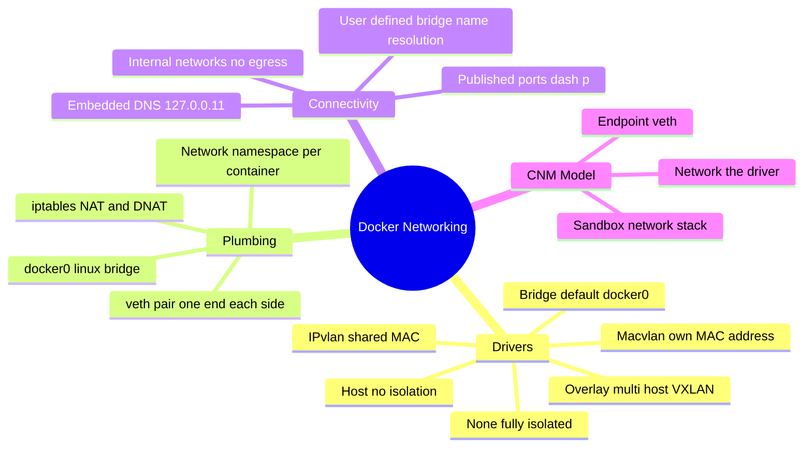
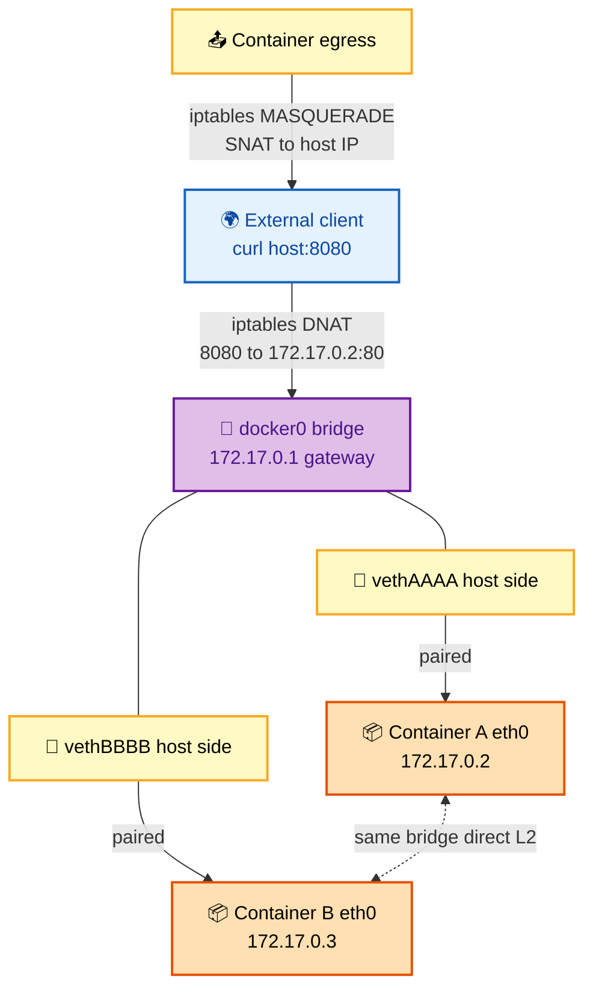
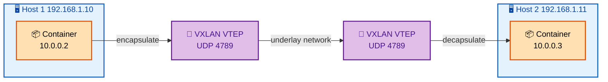

# SECTION 3: Docker Networking

> **Scope:** The network drivers (bridge, host, none, overlay, macvlan), the Container Network Model (CNM), veth pairs, NAT/iptables, port publishing, and embedded DNS — how a packet actually gets in and out of a container.

---

## 🗺️ Visual Overview

**In one line:** Every container network mode is a different answer to one question — "how does this process's private network namespace connect to the rest of the world" — and the default `bridge` answer is "a veth pair into `docker0` plus iptables NAT."

**Mind map — the networking landscape** (skim first, revisit last):



**Bridge mode packet path — inbound and container to container** (blue = external, purple = bridge, yellow = veth, orange = containers):



**Overlay network — containers across two hosts via VXLAN** (blue = hosts, purple = VXLAN tunnel, orange = containers):



> 🧠 **Memory hooks (mnemonics):**
> - **Driver picker — "Big Houses Need Over Many IPs":** **B**ridge (default, one host), **H**ost (no isolation, fast), **N**one (air-gapped), **O**verlay (multi-host swarm), **M**acvlan (own MAC, looks physical), **IP**vlan (shared MAC, L3).
> - **veth = virtual patch cable:** one end is the container's `eth0`, the other plugs into `docker0`. Cut it and the container goes dark.
> - **Two NAT rules:** **MASQUERADE** = outbound SNAT (container → world uses host IP); **DNAT** = inbound from `-p` (world → container's private IP).
> - **DNS lives at `127.0.0.11`:** a stub resolver Docker injects — only on **user-defined** networks does it resolve container *names*.

---

## 1. Network Drivers Compared

> 🎯 **Interview weight: High** — "what network modes does Docker have and when do you use each" is a staple.

**In one line:** Pick the driver by isolation vs performance vs topology — `bridge` for normal single-host apps, `host` for max throughput, `overlay` for multi-host, `macvlan` when the container must look like a physical device.

| Driver | Isolation | How it connects | Best for | Cost |
|---|---|---|---|---|
| **bridge** (default) | Own netns | veth → `docker0` + NAT | Single-host apps | NAT overhead, port mapping |
| **host** | None (shares host netns) | Uses host stack directly | Latency-sensitive, high PPS | No isolation, port conflicts |
| **none** | Total | No interfaces (loopback only) | Batch jobs, custom net | Must wire networking yourself |
| **overlay** | Own netns | VXLAN tunnel across hosts | Swarm / multi-host services | Encapsulation overhead |
| **macvlan** | Own MAC/IP on LAN | Sub-interface of host NIC | Legacy apps needing L2 | Needs promiscuous mode |
| **ipvlan** | Own IP, shared MAC | L2/L3 modes | Dense hosts, no MAC sprawl | More setup |

> 💡 **Interview tip:** The killer distinction: **default bridge = no name resolution between containers**; a **user-defined bridge** adds an embedded DNS so containers reach each other by name. Always create a user-defined network for multi-container apps.

---

## 2. Bridge Mode Internals — veth, docker0, NAT

> 🎯 **Interview weight: High** — the default everyone uses; know the packet path.

**In one line:** Each bridge container gets a **veth pair** — `eth0` inside, `vethXXXX` on the host plugged into the `docker0` Linux bridge — and iptables NAT bridges it to the outside world.

- **`docker0`** is a virtual Linux bridge (default `172.17.0.1/16`) acting as the containers' default gateway.
- **Outbound:** an iptables `MASQUERADE` (SNAT) rewrites the container's private source IP to the host IP.
- **Inbound:** requires publishing a port with `-p 8080:80`, which installs a `DNAT` rule mapping host `8080` → container `172.17.0.2:80` (plus a userland `docker-proxy` as fallback).

```bash
docker network create --driver bridge \
  --subnet 10.10.0.0/24 --gateway 10.10.0.1 appnet

docker run -d --name web --network appnet -p 8080:80 nginx
docker network inspect appnet          # see subnet, gateway, connected containers
iptables -t nat -L DOCKER -n           # the DNAT rules for published ports
ip link show type veth                 # host-side veth endpoints
```

> ⚠️ **Gotcha:** Publishing `-p 8080:80` binds **all host interfaces (0.0.0.0)** by default — it can bypass a host firewall like UFW because Docker writes its own iptables rules in the `DOCKER` chain. Bind explicitly to `127.0.0.1:8080:80` for local-only, or set `iptables=false` and manage rules yourself.

---

## 3. Port Publishing vs Exposing

> 🎯 **Interview weight: Medium** — a classic "do you actually know the difference" probe.

**In one line:** `EXPOSE` is documentation metadata only; `-p/--publish` is what actually opens a host port via a DNAT rule.

- **`EXPOSE 80`** (Dockerfile): declares intent, does nothing to networking. Used by `-P` and tooling.
- **`-p 8080:80`**: real port mapping (host:container) with a DNAT rule.
- **`-P`**: publish all `EXPOSE`d ports to random high host ports.

> 🔍 **Deep dive:** On a **user-defined** bridge you usually don't need to publish ports for container-to-container traffic — they reach each other by name on the shared network. Publishing is only for **external** access.

---

## 4. Embedded DNS & Service Discovery

> 🎯 **Interview weight: Medium-High** — central to multi-container and Compose questions.

**In one line:** Docker runs a stub DNS resolver at `127.0.0.11` inside each container on a user-defined network, resolving container/service names to current IPs so you never hardcode addresses.

- Only works on **user-defined** networks (and Compose default networks), not the legacy default bridge.
- Round-robins DNS for multiple containers sharing a network alias — poor man's load balancing.
- `--network-alias` gives a container extra resolvable names.

```bash
docker network create appnet
docker run -d --name db --network appnet postgres
docker run -it --network appnet alpine ping db     # resolves via 127.0.0.11
```

> 💡 **Interview tip:** "How does one container find another?" — *"Embedded DNS at 127.0.0.11 on a user-defined network resolves by container name; IPs can change on restart, names don't."*

---

## 5. Overlay Networks & VXLAN

> 🎯 **Interview weight: Medium** — appears with Swarm and multi-host questions.

**In one line:** An overlay network stitches containers on different hosts into one virtual L2 by encapsulating their traffic in **VXLAN** (UDP 4789), so `10.0.0.2` on host A can talk to `10.0.0.3` on host B as if on the same switch.

- Needs a key-value store / Swarm control plane to sync the network state.
- Optional IPsec encryption (`--opt encrypted`) for the data plane.
- Kubernetes uses the same idea via CNI plugins (Flannel VXLAN, Calico, Cilium eBPF).

> 🔍 **Deep dive:** VXLAN adds ~50 bytes of header, so the effective MTU drops (typically 1450). A mismatched MTU causes mysterious hangs on large payloads while pings succeed — a classic overlay/CNI debugging trap.

---

## Interview Questions & Answers

### Q1: Trace a packet from `curl host:8080` to a bridge container and back.

**Answer:** The request hits the host on `8080`. An iptables **DNAT** rule in the `DOCKER` chain rewrites the destination to the container's private IP:port (e.g., `172.17.0.2:80`), routing it across `docker0` and the veth pair into the container's `eth0`. The reply goes back out the veth to `docker0`; iptables reverses the NAT so the client sees the response from the host IP.

**Internals:** Outbound-initiated traffic uses `MASQUERADE` (SNAT); inbound uses DNAT installed by `-p`. `docker-proxy` handles edge cases (e.g., hairpin, hosts without proper iptables).

**Follow-up — "Why can `-p` bypass UFW?"** Docker inserts rules directly into the `DOCKER`/`nat` chains, which are evaluated before UFW's filter rules — so published ports can be reachable even when UFW "denies" them.

### Q2: Default bridge vs user-defined bridge — what's the practical difference?

**Answer:** User-defined bridges add **embedded DNS name resolution**, better isolation (only containers on that network talk), and live attach/detach. The default `docker0` bridge has no DNS — you'd need legacy `--link` — so multi-container apps should always use a user-defined network.

**Internals:** The DNS stub at `127.0.0.11` is only populated for user-defined networks.

**Follow-up — "How does Compose handle this?"** Compose auto-creates a user-defined network per project and registers each service by name, which is why services reach each other by service name out of the box.

### Q3: When would you use `host` networking and what do you give up?

**Answer:** Use `--network host` for latency/throughput-sensitive workloads (high packet rate, or needing the host's exact network identity) since it removes the veth + NAT hop. You give up network isolation and port remapping — the container binds directly to host ports, so `80` is `80` and conflicts are real.

**Internals:** The container shares the host's network namespace outright; there's no separate `eth0`.

**Follow-up — "Does host networking work on Docker Desktop for Mac/Windows?"** Historically no (containers run in a VM); recent Docker Desktop added limited host-network support, but on Linux it's native.

### Q4: Two containers on the same user-defined network can't reach each other. How do you debug?

**Answer:** Confirm both are actually on the network (`docker network inspect`), then from inside one: `ping <name>` (DNS + L3), `nslookup <name>` (is `127.0.0.11` resolving?), and check the target app is bound to `0.0.0.0` not `127.0.0.1`. A service listening only on loopback is unreachable from peers even with perfect networking.

**Internals:** Same-bridge containers have direct L2 connectivity; failures are usually DNS, wrong network, or a loopback-only bind.

**Follow-up — "It pings but the app refuses the connection?"** The app binds to `127.0.0.1`; rebind to `0.0.0.0`.

---

## Troubleshooting Scenarios

- **Can't reach published port from another machine:** app bound to `127.0.0.1` inside, or `-p 127.0.0.1:...` used; check the bind address and the DNAT rule (`iptables -t nat -L DOCKER`).
- **Name resolution fails between containers:** they're on the **default** bridge (no DNS) — move to a user-defined network.
- **Large transfers hang on overlay, pings fine:** MTU mismatch from VXLAN encapsulation — lower container MTU to ~1450.
- **Port already in use with host networking:** two containers can't share a host port — remap or use bridge.
- **Container has no internet:** missing default route / `docker0` down / IP forwarding disabled (`sysctl net.ipv4.ip_forward`).

---

## Production Best Practices

- **Always use user-defined networks** for multi-container apps (DNS + isolation).
- **Bind published ports to specific interfaces** (`127.0.0.1:` for local) to avoid exposing services to the whole LAN.
- **Segment with internal networks** (`--internal`) so backend/DB containers have no egress.
- **Encrypt overlay data planes** (`--opt encrypted`) for cross-host secrets in transit.
- **Mind the MTU** on overlay/CNI networks to avoid fragmentation hangs.
- **Don't rely on Docker's iptables auto-rules** to be firewall policy — reconcile them with your host firewall explicitly.

---

## Documentation Links

- [Docker networking overview](https://docs.docker.com/network/)
- [Bridge network driver](https://docs.docker.com/network/drivers/bridge/)
- [Overlay network driver](https://docs.docker.com/network/drivers/overlay/)
- [Macvlan network driver](https://docs.docker.com/network/drivers/macvlan/)
- [Container Network Model (libnetwork)](https://github.com/moby/libnetwork/blob/master/docs/design.md)

---

**[← Previous: Container Internals](02-CONTAINER-INTERNALS.md)** | **[Next: Security →](04-SECURITY.md)**
