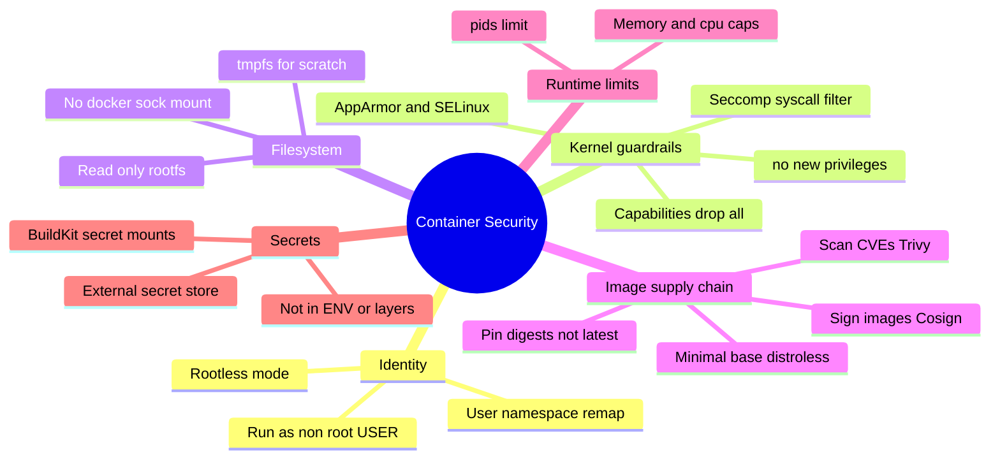
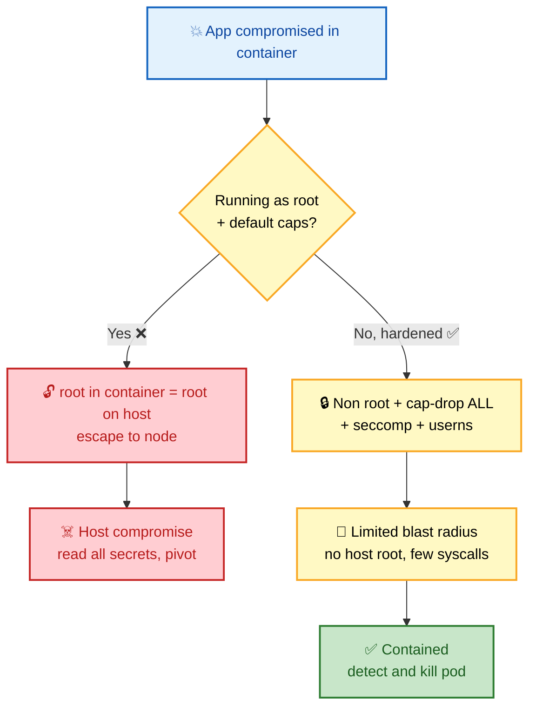
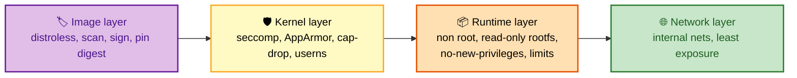

# SECTION 4: Docker Security

> **Scope:** Defense in depth for containers — the root-equals-root problem, user namespaces & rootless mode, capabilities, seccomp, AppArmor/SELinux, `no-new-privileges`, read-only rootfs, image scanning & signing, distroless, and secret handling.

---

## 🗺️ Visual Overview

**In one line:** Container security is **layered** — no single flag saves you; you reduce the blast radius at the image, kernel-syscall, capability, filesystem, and network levels so that any one failure isn't a host takeover.

**Mind map — the security surface** (skim first, revisit last):



**The container escape blast radius — default vs hardened** (red = danger path, green = contained):



**Layered defenses — where each control sits** (purple = supply chain, yellow = kernel, orange = runtime):



> 🧠 **Memory hooks (mnemonics):**
> - **The hardening checklist — "RUN CLeaR":** **R**ootless/non-root, **U**ser-namespace remap, **N**o-new-privileges, **C**apabilities dropped, **L**imited syscalls (seccomp), **R**ead-only rootfs.
> - **Root trap:** by default **root in container = root on host** (same UID 0). Break that with userns or `--user`.
> - **Seccomp vs capabilities vs AppArmor:** seccomp filters **syscalls**, capabilities gate **privileged operations**, AppArmor/SELinux restrict **file/resource paths**. Three different knobs.
> - **Supply chain — "SPS":** **S**can (Trivy), **P**in (digest, not `latest`), **S**ign (Cosign).

---

## 1. The Root-Equals-Root Problem

> 🎯 **Interview weight: High** — the foundational container-security insight.

**In one line:** Unless you intervene, UID 0 inside the container is UID 0 on the host, so a container escape is an instant host root compromise.

- Containers share the host kernel; there's no hypervisor boundary.
- A kernel vulnerability or a misconfig (`--privileged`, mounted `docker.sock`, host mounts) turns container-root into host-root.
- **Mitigations:** run as non-root (`USER`/`--user`), **user-namespace remap**, and drop capabilities.

> ⚠️ **Gotcha:** Simply adding `USER 1000` in the Dockerfile helps, but if the container is started `--privileged` or with `docker.sock` mounted, the app can still reach host root. Non-root is necessary, not sufficient — combine with the full checklist.

---

## 2. User Namespaces & Rootless Mode

> 🎯 **Interview weight: High** — the strongest structural mitigation.

**In one line:** User namespaces **remap** container UIDs to unprivileged host UIDs, so "root" in the container (0) is a harmless high UID (e.g., 100000) on the host — an escape lands as nobody.

- **`userns-remap`** (daemon flag): remaps all containers' UID ranges via `/etc/subuid`.
- **Rootless Docker:** the entire daemon runs as an unprivileged user — even `dockerd` has no host root. Uses `slirp4netns`/`fuse-overlayfs` for networking/storage without root.

| Approach | What's remapped | Strength | Trade-off |
|---|---|---|---|
| `USER` in Dockerfile | App process only | Basic | Daemon still root; escape via daemon possible |
| `userns-remap` | Container UIDs → host subuid range | Strong | Some volume/permission friction |
| Rootless Docker | The whole daemon runs unprivileged | Strongest | Perf overhead, some features limited |

> 💡 **Interview tip:** "How do you stop a container escape from becoming host root?" — *"User namespaces: remap container UID 0 to an unprivileged host UID so escaping lands you as nobody, not root. Rootless mode extends that to the daemon itself."*

---

## 3. Capabilities — Least Privilege

> 🎯 **Interview weight: Medium-High** — the practical privilege-reduction lever.

**In one line:** Drop every capability, then add back only the few a service truly needs — a web server needs `NET_BIND_SERVICE`, not the power to load kernel modules.

```bash
docker run --cap-drop ALL --cap-add NET_BIND_SERVICE nginx
```

- Docker's **default** set already drops the scariest caps (`SYS_ADMIN`, `NET_ADMIN`, `SYS_MODULE`).
- `--privileged` undoes all of this **plus** disables seccomp/AppArmor and exposes devices — avoid it. See [02-CONTAINER-INTERNALS.md](02-CONTAINER-INTERNALS.md) for the capability list.

---

## 4. Seccomp, AppArmor & SELinux

> 🎯 **Interview weight: Medium** — expected when the conversation gets into kernel hardening.

**In one line:** These are three complementary kernel filters — **seccomp** blocks dangerous *syscalls*, **AppArmor/SELinux** restrict *file and resource access* — and Docker ships sane defaults for all of them.

| Control | Filters | Docker default | Bypassed by |
|---|---|---|---|
| **seccomp** | System calls (allow/deny list) | `default.json` blocks ~44 dangerous syscalls | `--privileged`, `--security-opt seccomp=unconfined` |
| **AppArmor** | File paths, capabilities (Ubuntu/Debian) | `docker-default` profile | `--privileged` |
| **SELinux** | Mandatory access control labels (RHEL) | Container type enforcement | `--privileged`, `--security-opt label=disable` |

```bash
docker run --security-opt seccomp=/path/custom.json app
docker run --security-opt apparmor=docker-default app
docker run --security-opt no-new-privileges app     # block setuid privilege escalation
```

> 🔍 **Deep dive:** `no-new-privileges` sets the kernel `PR_SET_NO_NEW_PRIVS` bit, which means a setuid binary inside the container can **never** gain more privileges than the calling process — it neuters a whole class of privilege-escalation exploits for essentially zero cost.

---

## 5. Read-Only Root Filesystem

> 🎯 **Interview weight: Medium** — a cheap, high-value hardening win.

**In one line:** Run the container's root filesystem read-only and mount a small writable `tmpfs` only where the app truly needs scratch space, so an attacker can't drop a binary or modify code.

```bash
docker run --read-only --tmpfs /tmp:rw,noexec,nosuid,size=64m app
```

- `noexec` on the tmpfs stops execution of anything written there.
- Forces you to identify exactly what the app writes — good hygiene.

---

## 6. Image Supply Chain — Scan, Pin, Sign

> 🎯 **Interview weight: High** — supply-chain security is a hot interview topic.

**In one line:** Trust nothing you didn't verify — scan images for CVEs, pin to immutable digests instead of mutable tags, and require cryptographic signatures before deploy.

- **Scan:** `Trivy`, `Grype`, `Clair`, `Snyk` — catch known CVEs in OS packages and app deps. Gate CI on severity.
- **Pin:** reference `image@sha256:...` (immutable) rather than `image:latest` (can silently change).
- **Sign & verify:** `Cosign`/Notary — admission controllers reject unsigned images.
- **Minimize:** distroless/scratch bases shrink the attack surface (no shell, no package manager to exploit).

```bash
trivy image --severity HIGH,CRITICAL myapp:1.4.2
cosign sign --key cosign.key myregistry/app@sha256:abc...
cosign verify --key cosign.pub myregistry/app@sha256:abc...
```

> ⚠️ **Gotcha:** `:latest` is a **mutable pointer** — the digest it resolves to can change between your test and your deploy, breaking reproducibility and letting a poisoned rebuild slip in. Pin digests in production manifests.

---

## 7. Distroless & Minimal Bases

> 🎯 **Interview weight: Medium** — ties security to image optimization.

**In one line:** Distroless images contain only your app and its runtime deps — no shell, no package manager, no busybox — so most "exec into the container and pivot" attacks have nothing to work with.

| Base | Size | Shell? | Attack surface |
|---|---|---|---|
| `ubuntu:22.04` | ~77 MB | Yes | Large (full userland) |
| `alpine:3.19` | ~7 MB | Yes (`ash`) | Small (musl, busybox) |
| `gcr.io/distroless/*` | ~2–20 MB | **No** | Minimal (no shell/pkg mgr) |
| `scratch` | 0 MB | No | None (static binary only) |

> 🔍 **Deep dive:** No shell also means no `docker exec ... /bin/sh` for debugging — you debug via ephemeral debug containers (`kubectl debug`, `docker run` a sidecar sharing the PID/mount namespace) instead of baking a shell into production.

---

## 8. Secret Handling

> 🎯 **Interview weight: Medium-High** — a common real-world mistake interviewers probe.

**In one line:** Never bake secrets into `ENV` or image layers (they persist in history and `docker inspect`); inject them at runtime from a secret store or via BuildKit secret mounts that never land in a layer.

- **Wrong:** `ENV DB_PASSWORD=...` or `COPY .env` → readable via `docker history`/`docker inspect` forever.
- **Build-time:** `RUN --mount=type=secret,id=npmrc ...` — the secret is available during that `RUN` only and is **not** stored in the layer.
- **Runtime:** Docker/Swarm secrets, Kubernetes Secrets (+ KMS encryption), or an external vault (HashiCorp Vault, cloud secret managers) mounted as files or fetched via sidecar.

```dockerfile
# BuildKit: secret used at build time, never written to a layer
RUN --mount=type=secret,id=token \
    TOKEN=$(cat /run/secrets/token) && ./fetch-private-deps.sh
```

> ⚠️ **Gotcha:** A secret passed via `--build-arg` **is** visible in `docker history` and image metadata. Build args are for non-sensitive config only; use `--mount=type=secret` for anything secret.

---

## Interview Questions & Answers

### Q1: "Root inside a container is root on the host." True? How do you break that link?

**Answer:** True by default — they share UID 0 and the same kernel, so a container escape (kernel bug, misconfig) yields host root. You break the link with **user namespaces**: remap container UID 0 to an unprivileged host UID via `userns-remap`, or run **rootless Docker** so even the daemon isn't host-root. Layer on `--user`, `--cap-drop ALL`, seccomp, and a read-only rootfs.

**Internals:** userns creates a UID/GID translation table (`/etc/subuid`), so kernel credential checks see the mapped, unprivileged ID outside the namespace.

**Follow-up — "Why isn't `USER 1000` alone enough?"** Because `--privileged` or a mounted `docker.sock` lets the process reach the host daemon regardless of its in-container UID.

### Q2: Difference between seccomp, capabilities, and AppArmor — and what does `--privileged` do to them?

**Answer:** Capabilities gate *privileged operations* (e.g., binding low ports, mounting); seccomp filters *syscalls* (blocks dangerous ones like `keyctl`, `ptrace` by default); AppArmor/SELinux restrict *file/resource access* by path/label. They're orthogonal layers. `--privileged` **disables seccomp and AppArmor, grants all capabilities, and exposes host devices** — it removes all three protections at once.

**Internals:** Docker's default seccomp profile allow-lists ~300 syscalls and blocks ~44; `--privileged` switches the profile to `unconfined`.

**Follow-up — "You need one extra syscall blocked by default seccomp, what do you do?"** Ship a custom seccomp profile that adds just that syscall — never drop to `--privileged`/`unconfined`.

### Q3: How do you secure the image supply chain end to end?

**Answer:** Use a minimal base (distroless/alpine), **scan** in CI (Trivy/Grype) and gate on HIGH/CRITICAL, **pin** to immutable digests, **sign** images with Cosign, and enforce **signature verification** at admission (Kyverno/OPA/connaisseur). Rebuild regularly to pick up base-image CVE fixes.

**Internals:** Signing stores a signature in the registry (OCI referrers); the admission controller verifies it against a trusted public key before the image can run.

**Follow-up — "A CVE is found in a base layer you use everywhere. Fastest fix?"** Rebuild from the patched base and roll — because layers are shared, one base bump fixes every downstream image.

### Q4: Where should secrets live, and why is `ENV` wrong?

**Answer:** Secrets belong in a runtime secret store (Vault, cloud secret manager, K8s Secrets with KMS) injected as files/env at start, or via BuildKit `--mount=type=secret` at build time. `ENV`/`--build-arg`/`COPY .env` are wrong because they persist in image layers and metadata, readable forever via `docker history`/`docker inspect`.

**Internals:** Each Dockerfile instruction is a committed layer; `ENV` values are stored in the image config JSON.

**Follow-up — "You must use a secret during `npm install` for a private registry. How, without leaking it?"** `RUN --mount=type=secret,id=npmrc npm ci` — the secret is bind-mounted for that layer only and never committed.

### Q5: What's the single cheapest hardening change with the biggest payoff?

**Answer:** Running **non-root + `--cap-drop ALL`** (add back only what's needed) — it neutralizes the most common escalation paths at essentially zero cost and no app change for most services. Close behind: `--read-only` rootfs and `no-new-privileges`.

**Internals:** Dropping capabilities removes the privileged-operation bits; `no-new-privileges` blocks setuid escalation via `PR_SET_NO_NEW_PRIVS`.

**Follow-up — "Your app binds port 80 but you dropped all caps — now it fails?"** Add back just `NET_BIND_SERVICE`, or bind a high port and map it.

---

## Troubleshooting Scenarios

- **Container works with `--privileged`, fails without:** it needs a specific capability or device — identify and add just that (`--cap-add`, `--device`), don't keep `--privileged`.
- **App fails on read-only rootfs:** it writes somewhere unexpected — find the path (`strace`/logs) and mount a targeted `tmpfs`.
- **Trivy flags criticals in a base you don't control:** rebuild from a patched tag/digest; if none exists, switch base or add distro backports.
- **Signed-image admission blocks a deploy:** image wasn't signed or the key rotated — sign with the current key and re-verify.
- **Secret visible in `docker history`:** it came from `ENV`/`--build-arg`; move to `--mount=type=secret` or runtime injection and rebuild.

---

## Production Best Practices

- **Run non-root** (`USER`), **drop all caps**, add back the minimum.
- **Enable user-namespace remap** or **rootless** on shared hosts.
- Keep **seccomp + AppArmor/SELinux** on (never `--privileged`/`unconfined` in prod).
- **Read-only rootfs** + targeted `noexec` tmpfs.
- **Never mount `docker.sock`** into workloads.
- **Scan, pin (digests), and sign** every image; enforce verification at admission.
- **Inject secrets at runtime**; never in `ENV`/build args/layers.
- Set **resource limits** so a compromised container can't starve the node.

---

## Documentation Links

- [Docker security overview](https://docs.docker.com/engine/security/)
- [Rootless mode](https://docs.docker.com/engine/security/rootless/)
- [Seccomp profiles](https://docs.docker.com/engine/security/seccomp/)
- [AppArmor](https://docs.docker.com/engine/security/apparmor/)
- [Trivy scanner](https://aquasecurity.github.io/trivy/) · [Sigstore Cosign](https://docs.sigstore.dev/cosign/overview/) · [Distroless images](https://github.com/GoogleContainerTools/distroless)

---

**[← Previous: Networking](03-NETWORKING.md)** | **[Next: Image Optimization →](05-IMAGE-OPTIMIZATION.md)**
