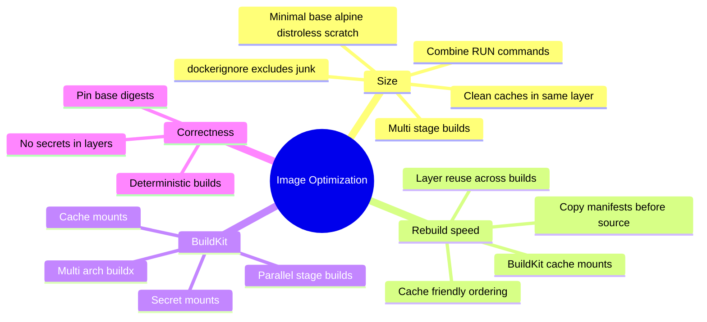
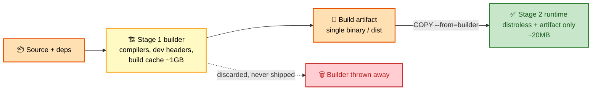
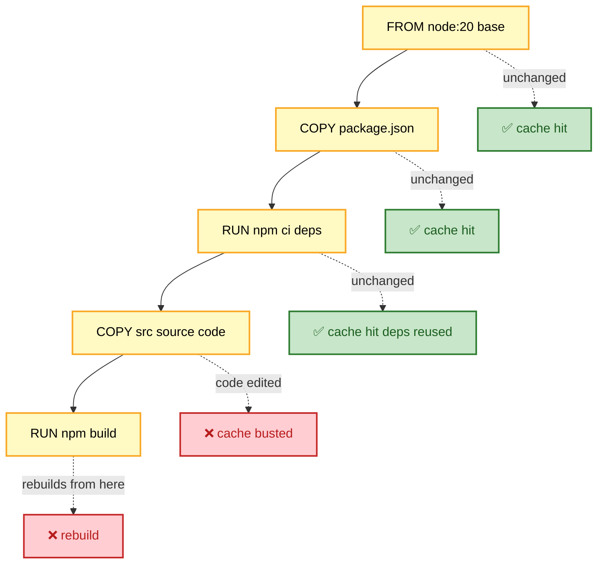

# SECTION 5: Image Optimization

> **Scope:** Building small, fast, cache-friendly images — multi-stage builds, layer caching & instruction ordering, base-image selection, BuildKit features, `.dockerignore`, and distroless/scratch runtimes.

---

## 🗺️ Visual Overview

**In one line:** Image optimization is two goals at once — **smaller** (fewer bytes to ship, smaller attack surface) and **faster to rebuild** (order layers so a code change doesn't reinstall the world) — and multi-stage builds plus cache-friendly ordering win most of it.

**Mind map — the optimization levers** (skim first, revisit last):



**Multi-stage build — fat builder, lean runtime** (yellow = build stage, orange = artifacts, green = final tiny image):



**Layer cache — why ordering matters** (green = cache hit reused, red = cache busted and rebuilt):



> 🧠 **Memory hooks (mnemonics):**
> - **Cache rule — "stable stuff up top":** order instructions **least-changing → most-changing**. `FROM` → system deps → dependency manifests → `install` → source → build. One edit busts every layer **below** it.
> - **Multi-stage mantra:** "Build fat, ship thin" — compilers and caches live in the builder stage and never reach the final image.
> - **COPY vs ADD:** default to **COPY** (predictable). **ADD** does auto-extract tarballs and URL fetch — "ADD = COPY + Auto-magic; use only when you want the magic."
> - **Size ladder:** ubuntu(~77MB) → debian-slim(~74) → alpine(~7) → distroless(~2–20) → scratch(0).

---

## 1. Multi-Stage Builds

> 🎯 **Interview weight: High** — the single biggest size win and a guaranteed question.

**In one line:** Use one stage with the full toolchain to build the artifact, then `COPY --from` only the artifact into a tiny runtime stage — the compilers, dev headers, and build caches never ship.

```dockerfile
# Stage 1: build (fat)
FROM golang:1.22 AS builder
WORKDIR /app
COPY go.mod go.sum ./
RUN go mod download           # cached unless go.mod/go.sum change
COPY . .
RUN CGO_ENABLED=0 go build -ldflags="-s -w" -o /app/server

# Stage 2: runtime (thin)
FROM gcr.io/distroless/static-debian12:nonroot
COPY --from=builder /app/server /server
USER 65532:65532
ENTRYPOINT ["/server"]
```

- Result: a ~10–20 MB image from a ~1 GB build environment.
- `-ldflags="-s -w"` strips debug symbols; `CGO_ENABLED=0` yields a static binary that runs on `scratch`/distroless.
- You can have **many** stages and copy across them; unused stages are skipped by BuildKit.

> 💡 **Interview tip:** "How would you shrink a 1.2 GB Node/Go image?" — *"Multi-stage: build in the full image, copy the dist/binary into `distroless`/`alpine`; add `.dockerignore`; combine RUNs and clean caches in the same layer."*

---

## 2. Layer Caching & Instruction Ordering

> 🎯 **Interview weight: High** — the rebuild-speed question.

**In one line:** Docker caches each layer keyed by the instruction and its inputs; changing any layer invalidates **every layer below it**, so put slow, rarely-changing steps first and fast-churning source last.

- **Copy dependency manifests before source:** `COPY package.json` → `RUN npm ci` → `COPY src`. A code edit then reuses the cached `npm ci` layer.
- **`COPY . .` too early** busts the cache on every code change and reinstalls all deps — a classic mistake.
- Cache is keyed by file **content/checksum** for `COPY`/`ADD`, and by the literal command string for `RUN`.

```dockerfile
# ✅ cache-friendly
FROM node:20-alpine
WORKDIR /app
COPY package*.json ./
RUN npm ci --omit=dev          # reused until deps change
COPY . .                       # only this busts on code edits
RUN npm run build
```

> ⚠️ **Gotcha:** `RUN apt-get update` in its own layer can serve a **stale package index** from cache on later builds, causing "package not found" or old versions. Always chain `apt-get update && apt-get install ...` in a single `RUN`.

---

## 3. Minimizing Layers & Cleaning in Place

> 🎯 **Interview weight: Medium-High** — the "why is my image still huge" question.

**In one line:** Each `RUN`/`COPY`/`ADD` is a layer that only *adds* bytes — cleaning up in a *later* layer doesn't shrink the image, so install and clean in the **same** `RUN`.

```dockerfile
# ❌ Bad — cleanup in a later layer; the cache bytes still ship
RUN apt-get update
RUN apt-get install -y python3
RUN rm -rf /var/lib/apt/lists/*

# ✅ Good — one layer, nothing left behind
RUN apt-get update && \
    apt-get install -y --no-install-recommends python3 && \
    rm -rf /var/lib/apt/lists/*
```

- `--no-install-recommends` avoids pulling optional extras.
- Because of copy-on-write + whiteouts, a deleted file in a later layer still occupies space in the earlier one (see [02-CONTAINER-INTERNALS.md](02-CONTAINER-INTERNALS.md)).

---

## 4. Base Image Selection

> 🎯 **Interview weight: Medium** — size and security both hinge on this.

**In one line:** Pick the smallest base your app actually needs — full distro for heavy tooling, `alpine` for small dynamic apps, `distroless`/`scratch` for static binaries.

| Base | Size | libc | When to use |
|---|---|---|---|
| `ubuntu:22.04` | ~77 MB | glibc | Needs full userland/tooling |
| `debian:12-slim` | ~74 MB | glibc | Debian minus extras |
| `alpine:3.19` | ~7 MB | **musl** | Small dynamic apps |
| `gcr.io/distroless/*` | ~2–20 MB | glibc, no shell | Compiled apps, hardened |
| `scratch` | 0 MB | none | Fully static binaries |

> ⚠️ **Gotcha:** Alpine uses **musl**, not glibc. glibc-compiled binaries or native modules can crash or behave subtly differently (DNS resolution, `getaddrinfo`, locale). For glibc apps that must be tiny, prefer **distroless** over alpine.

---

## 5. BuildKit Features

> 🎯 **Interview weight: Medium** — shows you're current.

**In one line:** BuildKit (default in modern Docker) parallelizes stages and adds cache mounts, secret mounts, and multi-arch builds — big wins over the legacy sequential builder.

- **Cache mounts** keep package caches across builds without baking them into the image:
  ```dockerfile
  RUN --mount=type=cache,target=/root/.cache/pip pip install -r requirements.txt
  ```
- **Secret mounts** use build-time secrets without leaking them into layers (see [04-SECURITY.md](04-SECURITY.md)).
- **Multi-arch:** `docker buildx build --platform linux/amd64,linux/arm64 --push`.
- **Parallelism:** independent stages build concurrently; unused stages are skipped.

---

## 6. .dockerignore

> 🎯 **Interview weight: Low-Medium** — small effort, real effect on cache and size.

**In one line:** `.dockerignore` keeps `node_modules`, `.git`, local env files, and build output out of the build context — smaller/faster uploads, better cache stability, and no accidental secret leaks.

```
.git
node_modules
**/*.log
.env
dist
Dockerfile
.dockerignore
```

> 🔍 **Deep dive:** The entire build context is tar'd and sent to the daemon before building. A `.git` or `node_modules` in context bloats that transfer and can bust the cache on `COPY . .` even when nothing relevant changed. Trim aggressively.

---

## Interview Questions & Answers

### Q1: Your image is 1.3 GB. Walk me through getting it to ~50 MB.

**Answer:** First, **multi-stage build** — compile in the full image, copy just the artifact into a minimal runtime (`distroless`/`alpine`/`scratch`). Second, add a **`.dockerignore`** to drop `.git`, `node_modules`, and build junk. Third, **combine RUNs** and clean package caches in the same layer. Fourth, pick a **smaller base** and `--no-install-recommends`. Measure with `docker history` to find the fat layers.

**Internals:** Most of the 1.3 GB is usually the toolchain and caches, which multi-stage eliminates because they live only in the discarded builder stage.

**Follow-up — "It's a Go app — what's the theoretical floor?"** A statically linked Go binary on `scratch` — the image is just the binary (single-digit MB).

### Q2: Why does one code change reinstall all my dependencies, and how do you fix it?

**Answer:** Because `COPY . .` (or copying source) sits **before** the dependency install, any source change invalidates that layer and everything below it, including `npm ci`. Fix: copy the dependency manifest first, install, *then* copy source — so the install layer stays cached across code edits.

**Internals:** Cache keys for `COPY` are content checksums; changing any file in the copied set busts the layer and all subsequent ones.

**Follow-up — "Where else does cache silently break?"** `RUN apt-get update` alone (stale index) and a bloated build context from a missing `.dockerignore`.

### Q3: Why doesn't deleting a file make the image smaller?

**Answer:** Layers are additive and use copy-on-write; deleting a file in a later layer writes a **whiteout** that hides it but the bytes remain in the earlier layer, so the image still ships them. You must avoid ever writing the data in a committed layer — delete it in the **same `RUN`**, or use multi-stage so it never reaches the final image.

**Internals:** OverlayFS whiteouts mask lower-layer files; they don't reclaim their space.

**Follow-up — "You accidentally `COPY`'d a secret then `rm`'d it in the next layer — is it safe?"** No — it's still in the earlier layer and recoverable. Rebuild without ever committing it; rotate the secret.

### Q4: Alpine vs distroless — how do you choose?

**Answer:** Alpine is tiny and has a shell/package manager (handy for debugging) but uses **musl**, which can break glibc-compiled binaries and native modules. Distroless is glibc-based, even smaller for compiled apps, and has **no shell** (smaller attack surface) but is harder to debug. Choose alpine for small dynamic apps where musl is fine; distroless for hardened, compiled services.

**Internals:** musl vs glibc differences surface in DNS resolution, threads, and locale handling.

**Follow-up — "How do you debug a distroless container with no shell?"** Attach an ephemeral debug container sharing its namespaces (`kubectl debug` / a sidecar with `--pid`/`--network` shared).

---

## Troubleshooting Scenarios

- **Image huge despite `rm`:** cleanup in a separate layer — combine into the creating `RUN` or use multi-stage.
- **Every build reinstalls deps:** source copied before dependency install — reorder.
- **"Package not found" intermittently:** stale `apt-get update` cache — chain update+install in one `RUN`.
- **Native module crashes only in the image:** musl (alpine) vs glibc mismatch — switch to a slim/distroless glibc base.
- **Slow builds, huge context upload:** missing/weak `.dockerignore` — exclude `.git`, `node_modules`, artifacts.
- **Secret leaked in `docker history`:** came from a committed layer/build-arg — use BuildKit secret mounts and rotate.

---

## Production Best Practices

- **Multi-stage build** for every compiled/bundled app; ship only artifacts.
- **Order layers least-changing → most-changing**; copy manifests before source.
- **One `RUN`** for install + cleanup; `--no-install-recommends`.
- **Smallest viable base** (distroless/scratch for static binaries); mind musl vs glibc.
- **`.dockerignore`** to trim context and protect secrets.
- **BuildKit cache mounts** for package caches; **secret mounts** for build-time secrets.
- **Pin base image digests** for reproducible builds; rebuild regularly for CVE patches.
- **Audit with `docker history --no-trunc`** and a linter like `hadolint`.

---

## Documentation Links

- [Dockerfile best practices](https://docs.docker.com/develop/develop-images/dockerfile_best-practices/)
- [Multi-stage builds](https://docs.docker.com/build/building/multi-stage/)
- [BuildKit](https://docs.docker.com/build/buildkit/)
- [buildx multi-platform builds](https://docs.docker.com/build/building/multi-platform/)
- [hadolint Dockerfile linter](https://github.com/hadolint/hadolint) · [dive image explorer](https://github.com/wagoodman/dive)

---

**[← Previous: Security](04-SECURITY.md)** | **[Next: Troubleshooting →](06-TROUBLESHOOTING.md)**
