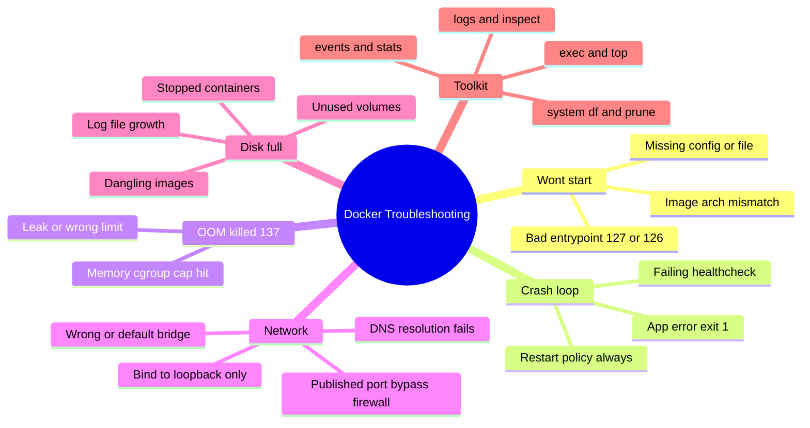
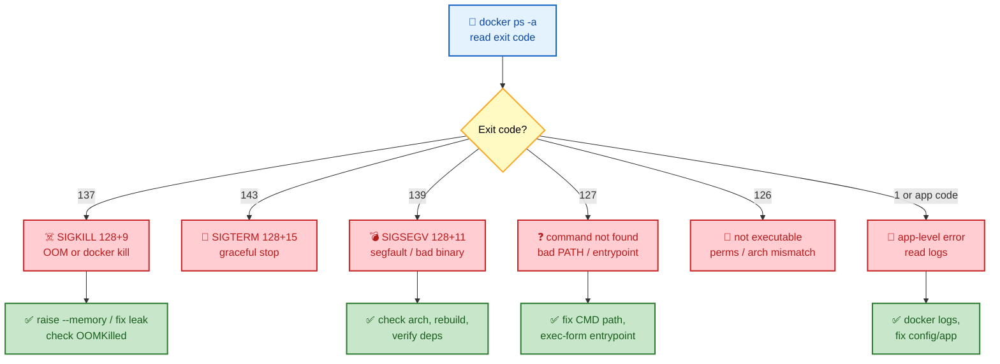
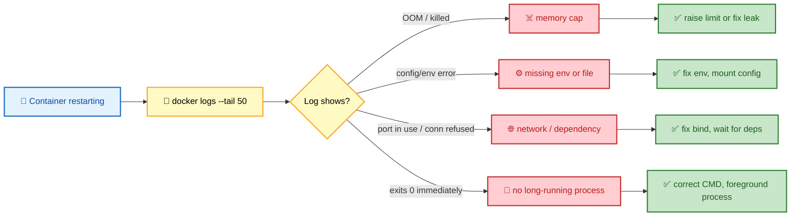

# SECTION 6: Docker Troubleshooting

> **Scope:** Diagnosing real container failures — exit codes (137/143/139/127/126/1), crash loops, OOM kills, image/pull errors, networking failures, disk exhaustion, and the debugging toolkit (`logs`, `inspect`, `events`, `exec`, `stats`, `system df`).

---

## 🗺️ Visual Overview

**In one line:** Almost every Docker incident resolves to one of five buckets — **won't start**, **crash loop**, **OOM**, **network**, **disk** — and the exit code plus `docker logs`/`inspect` usually points straight at the bucket.

**Mind map — the failure taxonomy** (skim first, revisit last):



**Exit code decision tree — read the code first** (blue = observe, red = root cause, green = fix):



**Crash-loop triage flow** (yellow = checks, red = causes, green = resolution):



> 🧠 **Memory hooks (mnemonics):**
> - **Exit code math — "128 + signal":** 137 = 128+**9** (SIGKILL/OOM), 143 = 128+**15** (SIGTERM), 139 = 128+**11** (SIGSEGV). 127 = command **not found**, 126 = **not executable**.
> - **First three commands, always:** `logs` → `inspect` → `events`. Logs tell you *what* broke; inspect tells you *how it was configured*; events tell you *when/why the daemon acted*.
> - **OOM tell:** `docker inspect --format '{{.State.OOMKilled}}'` → `true` confirms the memory cgroup killed it.
> - **Disk reclaim ladder:** `system df` (see) → `container prune` → `image prune -a` → `volume prune` → `builder prune`.

---

## 1. Reading Exit Codes

> 🎯 **Interview weight: High** — the fastest path to a root cause; interviewers love the 128+signal math.

**In one line:** The container exit code is your first and cheapest diagnostic — it encodes whether the app failed, was killed, segfaulted, or was never runnable.

| Exit code | Meaning | Typical cause |
|---|---|---|
| **0** | Clean exit | Process finished (may be "too soon" for a service) |
| **1** | Generic app error | Unhandled exception, bad config |
| **125** | Docker daemon error | Invalid `docker run` flags |
| **126** | Command not executable | Permission/arch mismatch on entrypoint |
| **127** | Command not found | Wrong `CMD`/`PATH`, missing binary |
| **137** | SIGKILL (128+9) | **OOM-killed** or `docker kill` |
| **139** | SIGSEGV (128+11) | Segfault, corrupt/incompatible binary |
| **143** | SIGTERM (128+15) | Graceful stop (`docker stop`) |

```bash
docker ps -a --format 'table {{.Names}}\t{{.Status}}\t{{.State}}'
docker inspect --format '{{.State.ExitCode}} OOMKilled={{.State.OOMKilled}}' <ctr>
```

> 💡 **Interview tip:** "Container exited 137 — what happened?" — *"SIGKILL = 128+9. Either OOM-killed by the memory cgroup (check `.State.OOMKilled`) or an explicit `docker kill`. If OOM, raise `--memory` or fix the leak."*

---

## 2. Container Won't Start

> 🎯 **Interview weight: Medium-High** — a common practical scenario.

**In one line:** Start-up failures are almost always a bad entrypoint (127/126), a missing file/config, or an architecture mismatch — and `docker logs` + `inspect` reveal which.

- **127 (not found):** `CMD` path wrong, binary not in the image, or shell-form `CMD` referencing a missing shell (`scratch` has no `/bin/sh`).
- **126 (not executable):** missing `+x`, or **wrong architecture** (arm64 image on amd64 host) → often `exec format error`.
- **Exits 0 immediately:** the process isn't long-running (e.g., `CMD` runs a command that finishes) — a service must run in the **foreground**.

```bash
docker logs <ctr>
docker inspect <ctr> --format '{{json .Config.Entrypoint}} {{json .Config.Cmd}}'
docker run --rm -it --entrypoint sh myimage    # poke around (if a shell exists)
```

> ⚠️ **Gotcha:** `exec /app: exec format error` means the binary/image is built for a **different CPU architecture**. Rebuild multi-arch with `buildx --platform`, or pull the right arch.

---

## 3. Crash Loops & Restart Policies

> 🎯 **Interview weight: Medium** — ties into healthchecks and orchestration.

**In one line:** A crash loop is the app exiting non-zero while a restart policy (`always`/`on-failure`) keeps relaunching it — read the logs for the real error; the restart policy is just the symptom amplifier.

- `--restart=on-failure[:N]` retries with backoff; `always` restarts even after clean exit.
- A failing **healthcheck** can also drive orchestrators to kill/restart even when the process is up.
- Distinguish "app throws error" (fix the app/config) from "starts too fast before its DB is ready" (add retry/wait logic).

```bash
docker inspect --format '{{.RestartCount}} {{.State.Health.Status}}' <ctr>
docker events --filter container=<ctr>      # see the restart cadence
```

---

## 4. Out-of-Memory (OOM) Kills

> 🎯 **Interview weight: High** — the flagship resource-limit failure.

**In one line:** When a container's memory cgroup hits its cap, the kernel OOM killer SIGKILLs a process inside it — you see exit **137** and `OOMKilled=true`.

- Memory limit counts **page cache**, not just heap — I/O-heavy apps can be killed without an obvious leak.
- `--memory` without matching `--memory-swap` silently allows swap (2×) — set them equal to truly cap RAM.
- Fix: right-size `--memory`, fix the leak, or reduce the working set; check the app's own heap limits (JVM `-Xmx`, Node `--max-old-space-size`) so they respect the cgroup.

```bash
docker stats --no-stream                      # live mem usage vs limit
docker inspect --format '{{.State.OOMKilled}}' <ctr>
cat /sys/fs/cgroup/memory/docker/<id>/memory.stat   # (v1) detailed breakdown
dmesg | grep -i oom                          # kernel OOM killer messages
```

> ⚠️ **Gotcha:** A JVM/Node app that ignores the cgroup limit sizes its heap off **host** RAM and gets OOM-killed. Modern JVMs honor cgroups with `-XX:+UseContainerSupport` (default on 11+); otherwise set `-Xmx` explicitly below `--memory`.

---

## 5. Networking Failures

> 🎯 **Interview weight: Medium-High** — overlaps with [03-NETWORKING.md](03-NETWORKING.md).

**In one line:** Container network issues are usually the **wrong network** (default bridge = no DNS), a **loopback-only bind**, a **DNS** miss, or a **published-port/firewall** surprise.

```bash
docker network inspect <net>
docker exec <ctr> ping <other-ctr>            # L3 + DNS
docker exec <ctr> nslookup <service>          # is 127.0.0.11 resolving?
docker exec <ctr> ss -tlnp                    # is the app on 0.0.0.0 or 127.0.0.1?
iptables -t nat -L DOCKER -n                  # published-port DNAT rules
```

- **Pings but connection refused:** app bound to `127.0.0.1` — rebind to `0.0.0.0`.
- **Name won't resolve:** containers on the **default** bridge — move to a user-defined network.
- **External can't reach published port:** wrong bind interface, or host firewall vs Docker's own iptables chain.

---

## 6. Disk Exhaustion

> 🎯 **Interview weight: Medium** — a frequent production pager.

**In one line:** `/var/lib/docker` fills with dangling images, stopped containers, unused volumes, build cache, and unbounded container logs — `docker system df` shows the split and `prune` reclaims it.

```bash
docker system df -v                           # what's using space, by type
docker container prune                        # remove stopped containers
docker image prune -a                         # remove unused images
docker volume prune                           # remove unused volumes
docker builder prune                          # remove build cache
docker system prune -a --volumes              # nuke everything unused (careful)
```

> ⚠️ **Gotcha:** Container **logs** (json-file driver) grow unbounded by default and can fill the disk silently. Set `log-opts` (`max-size`, `max-file`) in `daemon.json` or per container, or use a log driver that ships elsewhere.

---

## 7. The Debugging Toolkit

> 🎯 **Interview weight: Medium** — know which tool answers which question.

**In one line:** Each command answers a distinct question — `logs` (what it printed), `inspect` (how it's configured), `events` (what the daemon did), `stats`/`top` (what it's using), `exec` (get inside).

```bash
docker logs -f --tail 100 <ctr>              # app output (stdout/stderr)
docker inspect <ctr>                         # full config + state JSON
docker events --since 10m                    # daemon-level lifecycle events
docker stats                                 # live CPU/mem/net/io per container
docker top <ctr>                             # processes inside the container
docker exec -it <ctr> sh                     # interactive shell (if present)
docker cp <ctr>:/path ./local                # pull files out for inspection
```

> 🔍 **Deep dive:** For a **distroless** container with no shell, you can't `exec sh`. Attach an ephemeral debug container that shares the target's namespaces — `kubectl debug -it <pod> --image=busybox --target=<ctr>` in K8s, or `docker run --pid=container:<ctr> --network=container:<ctr> ...` locally.

---

## Interview Questions & Answers

### Q1: A container keeps restarting. Give me your systematic debugging order.

**Answer:** `docker ps -a` to read the **exit code**, then `docker logs --tail 50` for the actual error, then `docker inspect` for restart count, health status, and config (env, mounts, entrypoint), and `docker events` to see the restart cadence. The exit code narrows it immediately: 137 → OOM, 127/126 → entrypoint, 1/app-code → read logs.

**Internals:** Restart policies (`always`/`on-failure`) relaunch a non-zero-exiting process, so the loop is a symptom; the log line is the cause.

**Follow-up — "Logs are empty and it exits 0 instantly?"** The `CMD` isn't a long-running foreground process (e.g., it backgrounds or completes) — fix the command to run in the foreground.

### Q2: Exit code 137 with no memory leak in your app. What else causes it?

**Answer:** 137 is SIGKILL. Besides a real leak: the memory limit counts **page cache**, so an I/O-heavy container can hit the cap; a runtime (JVM/Node) sizing its heap off host RAM instead of the cgroup; swap disabled so bursts can't spill; or an explicit `docker kill`. Confirm with `.State.OOMKilled` and `dmesg | grep oom`.

**Internals:** The cgroup memory controller counts anon + file-backed pages against the limit and invokes the OOM killer on the cgroup.

**Follow-up — "JVM app OOM-killed at half its `-Xmx`?"** Off-heap (metaspace, thread stacks, direct buffers, native) plus heap exceeds the cgroup — cap total, not just heap, and enable container awareness.

### Q3: `exec format error` on start — what's wrong?

**Answer:** The image binary is compiled for a different CPU architecture than the host (e.g., arm64 image on amd64). Rebuild multi-arch with `docker buildx build --platform linux/amd64,linux/arm64 --push`, or pull the correct-arch tag.

**Internals:** The kernel can't load an ELF/Mach-O built for another ISA; Docker surfaces it as exit 126 / `exec format error`.

**Follow-up — "It works on your M1 Mac but fails in CI?"** You built arm64 locally; CI is amd64 — always build multi-arch or match the target platform.

### Q4: `/var/lib/docker` is full at 3 AM. First moves?

**Answer:** `docker system df -v` to see whether images, containers, volumes, build cache, or logs dominate. Then targeted pruning: `container prune`, `image prune -a`, `builder prune`; check container **log** growth (json-file without rotation) and cap it via `daemon.json` `log-opts`. `docker system prune -a --volumes` as the last, careful resort.

**Internals:** Overlay upper layers, dangling images, and unrotated logs are the usual culprits.

**Follow-up — "How do you prevent recurrence?"** Set global log rotation (`max-size`/`max-file`), a scheduled prune, and alerts on disk usage; move data to volumes and monitor them.

### Q5: Two containers can't talk on the same host. How do you isolate the layer that's broken?

**Answer:** Confirm they share a **user-defined** network (`docker network inspect`), then from inside one: `ping <name>` (network + DNS), `nslookup <name>` (is `127.0.0.11` answering?), and `ss -tlnp` on the target (is it bound to `0.0.0.0`, not `127.0.0.1`?). Ping-OK-but-refused = loopback bind; name-won't-resolve = default bridge.

**Internals:** Same-bridge containers have direct L2; failures are DNS, wrong network, or a loopback-only listener.

**Follow-up — "Resolves and pings but external clients still can't reach it?"** Missing/incorrect `-p` publish or host-firewall vs Docker iptables ordering — check the `DOCKER` nat chain.

---

## Production Best Practices

- **Cap container logs** (`max-size`, `max-file`) to prevent silent disk fill.
- **Always set memory/CPU limits** and make runtimes cgroup-aware (JVM/Node heap flags).
- **Add meaningful healthchecks** so orchestrators restart genuinely broken containers, not slow-starting ones.
- **Schedule pruning** and alert on `/var/lib/docker` usage.
- **Build multi-arch** to avoid `exec format error` across CI/prod/laptops.
- **Ship logs/metrics off-box** (logging driver, `stats` scrape) so post-mortems survive container death.
- **Keep a debug workflow** for distroless (ephemeral debug containers) instead of baking shells into prod images.

---

## Documentation Links

- [docker logs](https://docs.docker.com/engine/reference/commandline/logs/) · [docker inspect](https://docs.docker.com/engine/reference/commandline/inspect/)
- [docker events](https://docs.docker.com/engine/reference/commandline/events/) · [docker stats](https://docs.docker.com/engine/reference/commandline/stats/)
- [Prune unused objects](https://docs.docker.com/config/pruning/)
- [Configure logging drivers](https://docs.docker.com/config/containers/logging/configure/)
- [Runtime resource constraints](https://docs.docker.com/config/containers/resource_constraints/)

---

**[← Previous: Image Optimization](05-IMAGE-OPTIMIZATION.md)** | **[Back to Docker Index →](README.md)**
