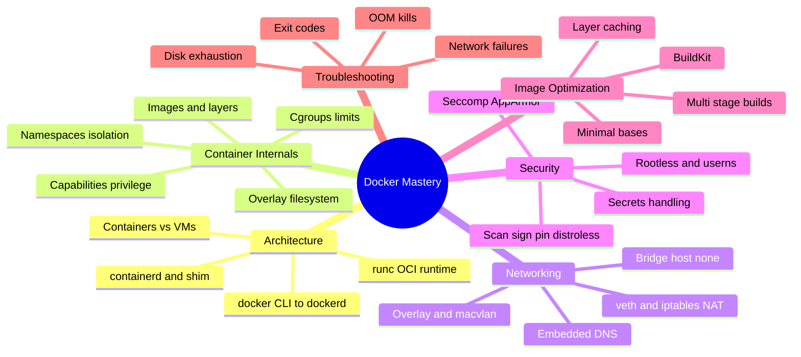

# Docker — Interview Preparation Guide

> **Target audience:** Senior DevOps Engineers, SREs, and Platform Engineers preparing for FAANG-level interviews.
>
> **Scope:** Docker and container internals taught from first principles — the runtime stack, kernel primitives (namespaces, cgroups, capabilities), overlay filesystems, networking, security hardening, image optimization, and production troubleshooting. Every section is **interview-focused**: deep internals, trade-offs, failure modes, and probing Q&A — no filler.

---

## 🗺️ Visual Overview

**In one line:** A container is an ordinary Linux process wrapped in namespaces, cgroups, capabilities, and an overlay filesystem — master those primitives and every Docker question (networking, security, images, debugging) becomes a consequence of them.

---

## 📚 Master Table of Contents

| # | Section | File | Est. study time |
|---|---------|------|-----------------|
| 1 | **Architecture** — engine, `dockerd`, `containerd`, `runc`, OCI, build path, containers vs VMs | [01-ARCHITECTURE.md](01-ARCHITECTURE.md) | 1.5 h |
| 2 | **Container Internals** — namespaces, cgroups, capabilities, overlay FS, images & layers | [02-CONTAINER-INTERNALS.md](02-CONTAINER-INTERNALS.md) | 3 h |
| 3 | **Networking** — bridge/host/overlay/macvlan, CNM, veth, NAT/iptables, DNS, ports | [03-NETWORKING.md](03-NETWORKING.md) | 2 h |
| 4 | **Security** — rootless, user namespaces, seccomp, AppArmor, scanning, signing, distroless, secrets | [04-SECURITY.md](04-SECURITY.md) | 2.5 h |
| 5 | **Image Optimization** — multi-stage, layer caching, base images, BuildKit, `.dockerignore` | [05-IMAGE-OPTIMIZATION.md](05-IMAGE-OPTIMIZATION.md) | 1.5 h |
| 6 | **Troubleshooting** — exit codes, crash loops, OOM, networking & disk failures, debug toolkit | [06-TROUBLESHOOTING.md](06-TROUBLESHOOTING.md) | 2 h |

---

## 🧭 Suggested Study Order

1. **Start with [Architecture](01-ARCHITECTURE.md)** — you can't reason about anything else until you know where `runc` sits and how `docker run` flows through the stack.
2. **Go deep on [Container Internals](02-CONTAINER-INTERNALS.md)** — this is the highest-leverage section; namespaces, cgroups, and overlay FS underpin every other topic. Spend the most time here.
3. **Then [Networking](03-NETWORKING.md)** — builds directly on the network namespace and veth concepts from Section 2.
4. **Then [Security](04-SECURITY.md)** — reuses namespaces, cgroups, and capabilities as hardening levers.
5. **Then [Image Optimization](05-IMAGE-OPTIMIZATION.md)** — applies the layer/overlay model to build faster, smaller images.
6. **Finish with [Troubleshooting](06-TROUBLESHOOTING.md)** — ties everything together through real failure modes and exit codes; best reviewed last and revisited before interviews.

> 💡 **How to use each section:** Every file opens with a **Visual Overview** (mind map + colorful diagrams + memory hooks) — skim it first and revisit it last. Topics carry an **Interview weight** marker and an **In one line** summary. Each closes with **Interview Questions & Answers** (crisp answer → internals → follow-up), **Troubleshooting Scenarios**, and **Production Best Practices**.

---

## 🎯 What Makes This Interview-Focused

- **Internals over trivia** — you'll be able to trace a `clone()` syscall, explain copy-on-write, and read an OOM exit code, not just recite definitions.
- **Trade-offs & failure modes** — every topic covers when *not* to use something and how it breaks in production.
- **Colorful Mermaid diagrams** for the hardest flows (runtime stack, packet path, overlay mount, escape blast radius).
- **Memory hooks** (mnemonics) so the details actually stick under interview pressure.

---

**[← Back to Main README](../README.md)** | **[Start: Architecture →](01-ARCHITECTURE.md)**
