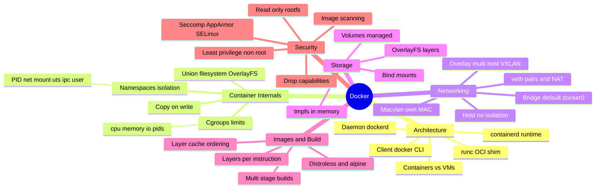
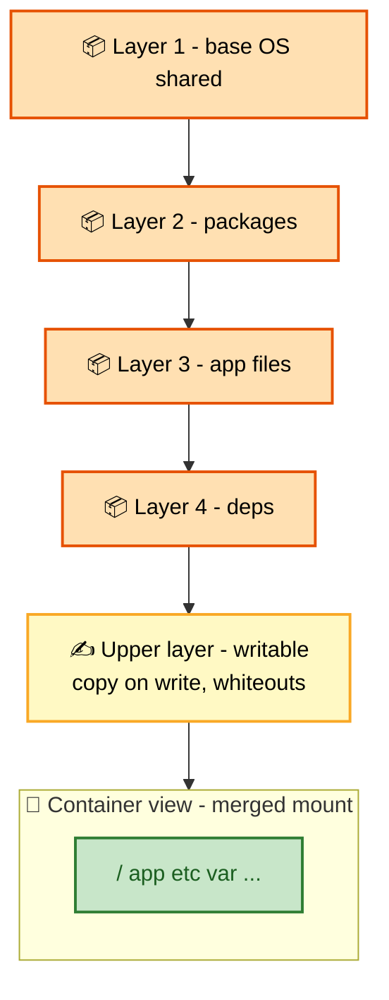
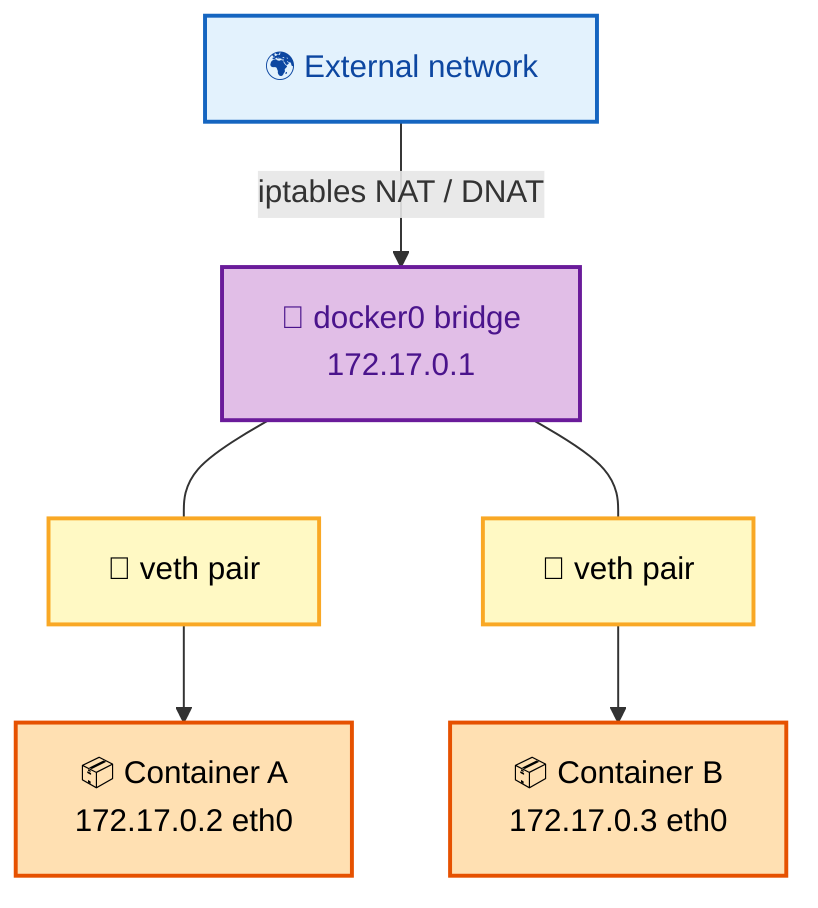
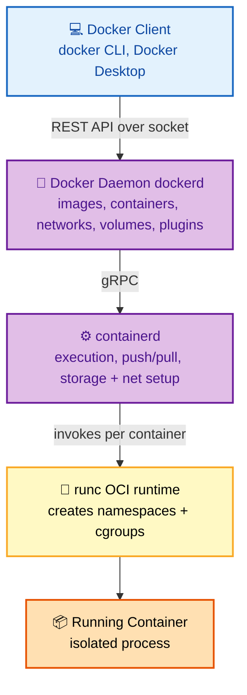
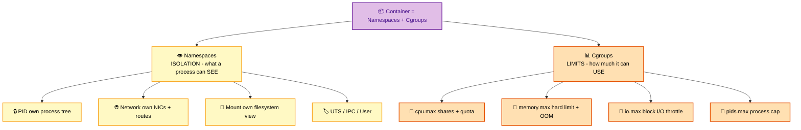
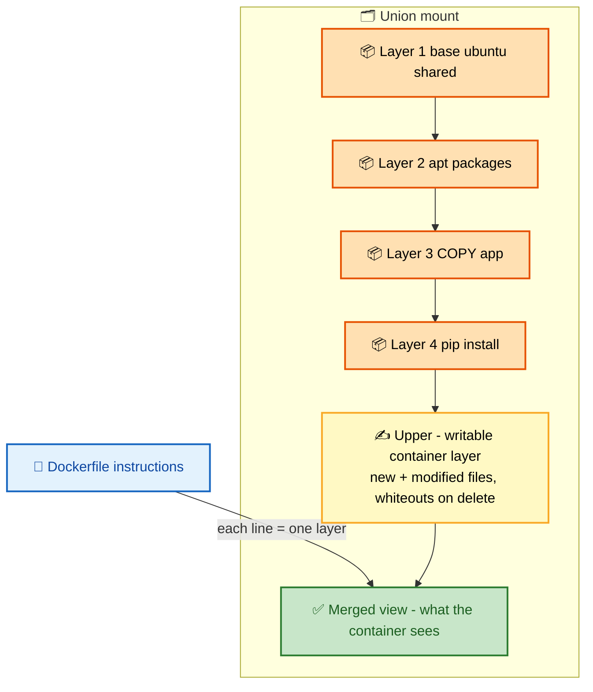
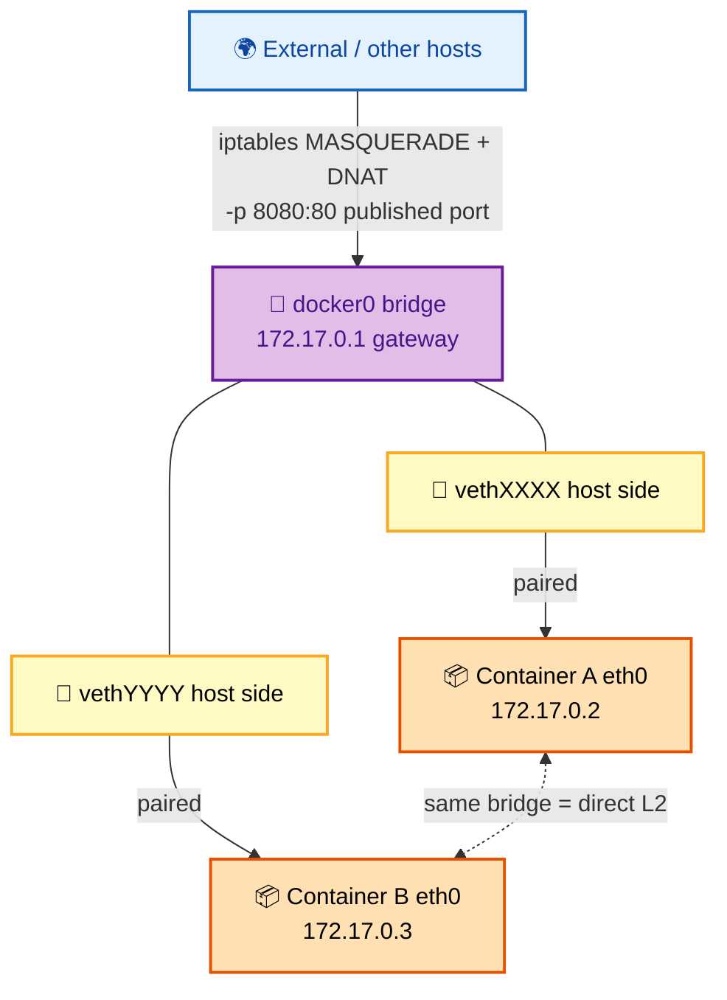

# Docker Interview Questions - Complete Guide

> **200+ Docker Interview Questions for Senior DevOps Engineer, SRE, and Platform Engineer roles at FAANG companies**

---

## 📋 Table of Contents

- [Docker Architecture](#docker-architecture)
- [Container Internals](#container-internals)
- [Networking](#networking)
- [Storage & Volumes](#storage--volumes)
- [Security](#security)
- [Image Optimization](#image-optimization)
- [Docker Compose](#docker-compose)
- [Troubleshooting](#troubleshooting)
- [Production Best Practices](#production-best-practices)

---

## 🗺️ Visual Overview

**Mind map — the whole Docker landscape at a glance** (skim first, revisit last):



**Docker call chain — client to daemon to containerd to runc** (the #1 architecture question):

```mermaid
flowchart LR
    A["💻 docker CLI<br/>Docker Desktop"] -->|"REST API"| B["🧠 dockerd<br/>daemon"]
    B -->|"gRPC"| C["⚙️ containerd<br/>image + lifecycle"]
    C -->|"shim"| D["🔧 runc<br/>OCI runtime"]
    D -->|"clone + unshare"| E["📦 Container<br/>namespaces + cgroups"]
    E --> F["✅ Process<br/>running isolated"]

    classDef start fill:#e3f2fd,stroke:#1565c0,color:#0d47a1,stroke-width:2px;
    classDef proc fill:#fff9c4,stroke:#f9a825,color:#000,stroke-width:2px;
    classDef good fill:#c8e6c9,stroke:#2e7d32,color:#1b5e20,stroke-width:2px;
    classDef bad fill:#ffcdd2,stroke:#c62828,color:#b71c1c,stroke-width:2px;
    classDef ctrl fill:#e1bee7,stroke:#6a1b9a,color:#4a148c,stroke-width:2px;
    classDef store fill:#ffe0b2,stroke:#e65100,color:#000,stroke-width:2px;

    class A start;
    class B,C ctrl;
    class D,E proc;
    class F good;
```



**Image layers + union filesystem — read-only stack under one writable layer:**



**Container networking — bridge, veth pairs, and NAT to the outside:**



> 🧠 **Memory hooks (mnemonics):**
> - **The runtime stack:** *"Dogs Can Run"* → **d**ockerd → **c**ontainerd → **r**unc. The CLI just talks to `dockerd`; only `runc` actually makes the container.
> - **Namespaces vs cgroups:** **Namespaces = what a process can SEE** (isolation); **cgroups = how much it can USE** (limits). "See vs Use."
> - **Namespace set — "MPU-NIU":** **M**ount, **P**ID, **U**TS, **N**etwork, **I**PC, **U**ser (+ newer cgroup ns).
> - **Layer caching:** put the *rarely-changing* stuff first — `FROM` → deps → `COPY package.json` → install → `COPY src`. One line changed low in the Dockerfile busts every layer below it.
> - **COPY vs ADD:** default to **COPY** (plain copy, predictable). **ADD** does *extra magic* — auto-extracts tarballs and fetches URLs. "ADD = COPY + Auto-magic; use it only when you want the magic."
> - **Containers vs VMs:** VMs virtualize *hardware* (own guest kernel); containers virtualize the *OS* (shared host kernel). "VM = own kernel, Container = shared kernel."

---

## Docker Architecture

### 🟢 Basic Questions

#### Q1: Explain Docker architecture and how containers differ from VMs.

**Basic Answer:**
Docker uses client-server architecture with Docker daemon, CLI client, and registries. Containers share the host OS kernel unlike VMs which have their own OS, making containers lighter and faster to start.

**Advanced Answer:**

```
┌─────────────────────────────────────────────────────────────────┐
│                    DOCKER ARCHITECTURE                           │
├─────────────────────────────────────────────────────────────────┤
│                                                                  │
│  ┌─────────────────────────────────────────────────────────┐    │
│  │                    Docker Client                         │    │
│  │              (docker CLI, Docker Desktop)                │    │
│  └─────────────────────────────────────────────────────────┘    │
│                            │ REST API                            │
│                            ▼                                     │
│  ┌─────────────────────────────────────────────────────────┐    │
│  │                    Docker Daemon (dockerd)               │    │
│  │  ┌─────────────────────────────────────────────────┐    │    │
│  │  │  • Image management                              │    │    │
│  │  │  • Container lifecycle                           │    │    │
│  │  │  • Network management                            │    │    │
│  │  │  • Volume management                             │    │    │
│  │  │  • Plugin system                                 │    │    │
│  │  └─────────────────────────────────────────────────┘    │    │
│  └─────────────────────────────────────────────────────────┘    │
│                            │                                     │
│                            ▼                                     │
│  ┌─────────────────────────────────────────────────────────┐    │
│  │               containerd (Container Runtime)             │    │
│  │  ┌─────────────────────────────────────────────────┐    │    │
│  │  │  • Container execution                           │    │    │
│  │  │  • Image push/pull                               │    │    │
│  │  │  • Storage and network setup                     │    │    │
│  │  │  • Calls runc for actual container creation      │    │    │
│  │  └─────────────────────────────────────────────────┘    │    │
│  └─────────────────────────────────────────────────────────┘    │
│                            │                                     │
│                            ▼                                     │
│  ┌─────────────────────────────────────────────────────────┐    │
│  │                       runc (OCI Runtime)                 │    │
│  │  ┌─────────────────────────────────────────────────┐    │    │
│  │  │  • Low-level container runtime                   │    │    │
│  │  │  • Creates namespaces and cgroups                │    │    │
│  │  │  • OCI (Open Container Initiative) compliant     │    │    │
│  │  └─────────────────────────────────────────────────┘    │    │
│  └─────────────────────────────────────────────────────────┘    │
│                                                                  │
│  CONTAINERS vs VMs:                                              │
│  ┌─────────────────────┐    ┌─────────────────────────┐         │
│  │     CONTAINER       │    │    VIRTUAL MACHINE      │         │
│  │  ┌──────────────┐   │    │  ┌──────────────────┐   │         │
│  │  │     App      │   │    │  │       App        │   │         │
│  │  ├──────────────┤   │    │  ├──────────────────┤   │         │
│  │  │   Bins/Libs  │   │    │  │    Bins/Libs     │   │         │
│  │  └──────────────┘   │    │  ├──────────────────┤   │         │
│  │                     │    │  │    Guest OS      │   │         │
│  │  Container Engine   │    │  └──────────────────┘   │         │
│  │  ┌──────────────┐   │    │       Hypervisor       │         │
│  │  │  Host OS     │   │    │  ┌──────────────────┐   │         │
│  │  └──────────────┘   │    │  │     Host OS      │   │         │
│  │     Hardware        │    │  └──────────────────┘   │         │
│  └─────────────────────┘    │       Hardware         │         │
│                             └─────────────────────────┘         │
│                                                                  │
│  Comparison:                                                     │
│  • Startup: Seconds vs Minutes                                  │
│  • Size: MBs vs GBs                                             │
│  • Overhead: Near-native vs 10-20%                              │
│  • Isolation: Process-level vs Hardware-level                   │
│                                                                  │
└─────────────────────────────────────────────────────────────────┘
```

**🎨 Same architecture as a colorful flowchart** (blue = client, purple = daemon/control, yellow = runtime, orange = container):



> 💡 **Interview tip:** The clean one-liner interviewers want: *"The CLI is just a REST client; `dockerd` orchestrates, `containerd` manages image + container lifecycle, and `runc` does the low-level `clone()`/`unshare()` to build namespaces and cgroups."* Knowing where `runc` sits shows you understand OCI.

**Expert Answer:**

Docker vs containerd vs CRI-O:

| Feature | Docker | containerd | CRI-O |
|---------|--------|------------|-------|
| Kubernetes Integration | Via shim | Native CRI | Native CRI |
| Build Images | Yes | No (use buildctl) | No |
| Swarm Support | Yes | No | No |
| Footprint | Larger | Medium | Smallest |
| Use Case | Development | Production K8s | Minimal K8s |

---

## Container Internals

### 🟢 Basic Questions

#### Q2: Explain Linux namespaces and cgroups - the foundations of containers.

**Basic Answer:**
Namespaces provide isolation (PID, network, mount, etc.), while cgroups limit resource usage (CPU, memory). Together they create containers.

**Advanced Answer:**

```
┌─────────────────────────────────────────────────────────────────┐
│                    CONTAINER BUILDING BLOCKS                     │
├─────────────────────────────────────────────────────────────────┤
│                                                                  │
│  NAMESPACES (Isolation)                                         │
│  ┌─────────────────────────────────────────────────────────┐    │
│  │                                                          │    │
│  │  PID Namespace                                           │    │
│  │  ├── Container sees only its own processes               │    │
│  │  └── PID 1 in container = different PID on host          │    │
│  │                                                          │    │
│  │  Network Namespace                                       │    │
│  │  ├── Own network interfaces, IPs, routes                 │    │
│  │  └── Connected to host via veth pair                     │    │
│  │                                                          │    │
│  │  Mount Namespace                                         │    │
│  │  ├── Own filesystem view                                 │    │
│  │  └── Union filesystem (OverlayFS)                        │    │
│  │                                                          │    │
│  │  UTS Namespace                                           │    │
│  │  └── Own hostname                                        │    │
│  │                                                          │    │
│  │  IPC Namespace                                           │    │
│  │  └── Own message queues, semaphores                      │    │
│  │                                                          │    │
│  │  User Namespace                                          │    │
│  │  └── Own user/group IDs (root in container ≠ root on host)│    │
│  │                                                          │    │
│  │  Cgroup Namespace (newer)                                │    │
│  │  └── Own cgroup hierarchy view                           │    │
│  │                                                          │    │
│  └─────────────────────────────────────────────────────────┘    │
│                                                                  │
│  CGROUPS (Resource Limits)                                      │
│  ┌─────────────────────────────────────────────────────────┐    │
│  │                                                          │    │
│  │  CPU                                                     │    │
│  │  ├── cpu.shares: Relative weight                         │    │
│  │  ├── cpu.cfs_quota_us: Hard limit                        │    │
│  │  └── cpuset.cpus: Pin to specific CPUs                   │    │
│  │                                                          │    │
│  │  Memory                                                  │    │
│  │  ├── memory.limit_in_bytes: Hard limit                   │    │
│  │  ├── memory.soft_limit_in_bytes: Soft limit              │    │
│  │  └── memory.oom_control: OOM behavior                    │    │
│  │                                                          │    │
│  │  Block I/O                                               │    │
│  │  ├── blkio.weight: I/O priority                          │    │
│  │  └── blkio.throttle: Read/write limits                   │    │
│  │                                                          │    │
│  │  PIDs                                                    │    │
│  │  └── pids.max: Maximum number of processes               │    │
│  │                                                          │    │
│  └─────────────────────────────────────────────────────────┘    │
│                                                                  │
│  Cgroups v1 vs v2:                                              │
│  ┌─────────────────────────────────────────────────────────┐    │
│  │  v1: Separate hierarchy per controller                   │    │
│  │      /sys/fs/cgroup/cpu/docker/container-id/             │    │
│  │      /sys/fs/cgroup/memory/docker/container-id/          │    │
│  │                                                          │    │
│  │  v2: Unified hierarchy (modern systems)                  │    │
│  │      /sys/fs/cgroup/docker/container-id/                 │    │
│  │      - cpu.max                                           │    │
│  │      - memory.max                                        │    │
│  │      - io.max                                            │    │
│  └─────────────────────────────────────────────────────────┘    │
│                                                                  │
└─────────────────────────────────────────────────────────────────┘
```

**🎨 The two pillars, side by side** (yellow = isolation/what you SEE, orange = limits/what you USE):



> 💡 **Interview tip:** If you remember only one sentence: *"Namespaces isolate **what a container sees**; cgroups limit **what a container uses**."* Everything else (PID vs memory, etc.) hangs off that split.

**Expert Answer:**

Creating a container manually (understanding primitives):
```bash
# Create namespaces manually
unshare --mount --uts --ipc --net --pid --fork /bin/bash

# In the new namespace:
hostname container
mount -t proc proc /proc

# Cgroup limits
mkdir /sys/fs/cgroup/memory/my-container
echo 100000000 > /sys/fs/cgroup/memory/my-container/memory.limit_in_bytes
echo $$ > /sys/fs/cgroup/memory/my-container/cgroup.procs
```

---

#### Q3: Explain the Docker image layer system and OverlayFS.

**Basic Answer:**
Docker images are built in layers, where each Dockerfile instruction creates a layer. OverlayFS combines these read-only layers with a writable container layer using copy-on-write.

**Advanced Answer:**

```
┌─────────────────────────────────────────────────────────────────┐
│                    DOCKER IMAGE LAYERS                           │
├─────────────────────────────────────────────────────────────────┤
│                                                                  │
│  Dockerfile:                    Resulting Layers:               │
│  ┌─────────────────────┐       ┌─────────────────────────────┐  │
│  │ FROM ubuntu:22.04   │ ────▶ │ Layer 1: Base OS (77MB)     │  │
│  │                     │       │ (shared if same base)       │  │
│  │ RUN apt-get update  │ ────▶ │ Layer 2: Package cache      │  │
│  │ RUN apt-get install │       │                             │  │
│  │                     │       │                             │  │
│  │ COPY app/ /app      │ ────▶ │ Layer 3: Application files  │  │
│  │                     │       │                             │  │
│  │ RUN pip install     │ ────▶ │ Layer 4: Dependencies       │  │
│  └─────────────────────┘       └─────────────────────────────┘  │
│                                                                  │
│  OVERLAYFS ARCHITECTURE:                                        │
│  ┌─────────────────────────────────────────────────────────┐    │
│  │                                                          │    │
│  │  Container View (merged)                                 │    │
│  │  ┌─────────────────────────────────────────────────┐     │    │
│  │  │  /                                               │     │    │
│  │  │  ├── app/                                        │     │    │
│  │  │  ├── etc/                                        │     │    │
│  │  │  ├── var/                                        │     │    │
│  │  │  └── ...                                         │     │    │
│  │  └─────────────────────────────────────────────────┘     │    │
│  │                     ▲                                    │    │
│  │                     │ Union Mount                        │    │
│  │  ┌──────────────────┴──────────────────────────────┐     │    │
│  │  │                                                  │     │    │
│  │  │  Upper Layer (writable, container-specific)      │     │    │
│  │  │  /var/lib/docker/overlay2/{id}/diff/             │     │    │
│  │  │  └── New/modified files go here                  │     │    │
│  │  │                                                  │     │    │
│  │  │  Lower Layers (read-only, shared between         │     │    │
│  │  │  containers using same image)                    │     │    │
│  │  │  /var/lib/docker/overlay2/{id}/diff/             │     │    │
│  │  │  └── Layer 1 (base)                              │     │    │
│  │  │  └── Layer 2                                     │     │    │
│  │  │  └── Layer 3                                     │     │    │
│  │  │  └── Layer 4                                     │     │    │
│  │  │                                                  │     │    │
│  │  └──────────────────────────────────────────────────┘     │    │
│  │                                                          │    │
│  │  Copy-on-Write:                                          │    │
│  │  1. Read: Check upper, then lower layers                 │    │
│  │  2. Write: Copy file to upper layer, modify there        │    │
│  │  3. Delete: Create "whiteout" file in upper layer        │    │
│  │                                                          │    │
│  └─────────────────────────────────────────────────────────┘    │
│                                                                  │
└─────────────────────────────────────────────────────────────────┘
```

**🎨 OverlayFS as a colorful stack** (orange = read-only image layers, yellow = writable layer, green = merged view):



> ⚠️ **Gotcha:** Deleting a file from a lower layer does **not** shrink the image — Overlay writes a *whiteout* marker in the upper layer that hides it, so the bytes still ship. To actually remove data (e.g. secrets or caches), delete it in the **same `RUN`** that created it, or use a multi-stage build.

**Expert Answer:**

Inspect layers:
```bash
# View image layers
docker image inspect nginx --format '{{.RootFS.Layers}}'

# View layer contents
docker image history nginx --no-trunc

# Examine overlay mount
cat /proc/mounts | grep overlay

# Layer directories
ls /var/lib/docker/overlay2/

# Analyze image size by layer
docker image inspect --format '{{json .RootFS.Layers}}' nginx | jq
```

---

## Networking

### 🟢 Basic Questions

#### Q4: Explain Docker networking modes.

**Basic Answer:**
Docker provides bridge (default, isolated network), host (shares host network), none (no networking), overlay (multi-host), and macvlan (assigns MAC addresses) network modes.

**Advanced Answer:**

```
┌─────────────────────────────────────────────────────────────────┐
│                    DOCKER NETWORK MODES                          │
├─────────────────────────────────────────────────────────────────┤
│                                                                  │
│  BRIDGE (Default)                                               │
│  ┌─────────────────────────────────────────────────────────┐    │
│  │  Host                                                    │    │
│  │  ┌────────────────────────────────────────────────────┐  │    │
│  │  │  docker0 bridge (172.17.0.1)                       │  │    │
│  │  │       │                     │                      │  │    │
│  │  │       │                     │                      │  │    │
│  │  │  ┌────┴────┐          ┌────┴────┐                 │  │    │
│  │  │  │  veth   │          │  veth   │                 │  │    │
│  │  │  └────┬────┘          └────┬────┘                 │  │    │
│  │  │       │                     │                      │  │    │
│  │  │  ┌────┴────┐          ┌────┴────┐                 │  │    │
│  │  │  │Container│          │Container│                 │  │    │
│  │  │  │172.17.0.2│         │172.17.0.3│                │  │    │
│  │  │  └─────────┘          └─────────┘                 │  │    │
│  │  └────────────────────────────────────────────────────┘  │    │
│  │  NAT via iptables for external access                    │    │
│  └─────────────────────────────────────────────────────────┘    │
│                                                                  │
│  HOST                                                           │
│  ┌─────────────────────────────────────────────────────────┐    │
│  │  Container uses host's network namespace directly        │    │
│  │  • No network isolation                                  │    │
│  │  • Best performance (no NAT overhead)                    │    │
│  │  • Container ports bind directly to host                 │    │
│  │  • Use case: Network-intensive applications              │    │
│  └─────────────────────────────────────────────────────────┘    │
│                                                                  │
│  OVERLAY (Multi-host)                                           │
│  ┌─────────────────────────────────────────────────────────┐    │
│  │    Host 1                        Host 2                  │    │
│  │  ┌──────────┐                  ┌──────────┐              │    │
│  │  │Container │◄── VXLAN ───────▶│Container │              │    │
│  │  │10.0.0.2  │    tunnel         │10.0.0.3  │              │    │
│  │  └──────────┘    (UDP 4789)     └──────────┘              │    │
│  │                                                          │    │
│  │  • Used in Docker Swarm                                  │    │
│  │  • Encrypted option available                            │    │
│  └─────────────────────────────────────────────────────────┘    │
│                                                                  │
│  MACVLAN                                                        │
│  ┌─────────────────────────────────────────────────────────┐    │
│  │  Container gets its own MAC address                      │    │
│  │  Appears as physical device on network                   │    │
│  │  • Direct layer 2 connectivity                           │    │
│  │  • Useful for legacy applications                        │    │
│  │  • Requires promiscuous mode on host NIC                 │    │
│  └─────────────────────────────────────────────────────────┘    │
│                                                                  │
└─────────────────────────────────────────────────────────────────┘
```

**🎨 Bridge mode as a colorful flowchart** (blue = external, purple = bridge, yellow = veth, orange = containers):



> 💡 **Interview tip:** A container's `eth0` is one end of a **veth pair**; the other end plugs into `docker0`. Outbound traffic is NAT'd (MASQUERADE); inbound needs a published port (`-p`) which adds a DNAT rule. On the **default** bridge, containers reach each other by IP only — on a **user-defined** bridge you also get built-in DNS resolution by container name.

**Expert Answer:**

Custom bridge network setup:
```bash
# Create network
docker network create --driver bridge \
  --subnet 10.0.0.0/24 \
  --gateway 10.0.0.1 \
  --ip-range 10.0.0.128/25 \
  --opt "com.docker.network.bridge.name"="my-bridge" \
  my-network

# Connect container to multiple networks
docker network connect my-network container1

# Inspect network
docker network inspect my-network
```

---

## Security

### 🟡 Intermediate Questions

#### Q5: How would you secure Docker containers in production?

**Basic Answer:**
Use minimal base images, don't run as root, scan for vulnerabilities, limit capabilities, use read-only filesystems, and implement resource limits.

**Advanced Answer:**

```
┌─────────────────────────────────────────────────────────────────┐
│                    CONTAINER SECURITY LAYERS                     │
├─────────────────────────────────────────────────────────────────┤
│                                                                  │
│  1. IMAGE SECURITY                                              │
│  ┌─────────────────────────────────────────────────────────┐    │
│  │  • Use minimal base images (distroless, alpine)         │    │
│  │  • Scan for CVEs (Trivy, Clair, Snyk)                   │    │
│  │  • Sign images (Docker Content Trust, Cosign)           │    │
│  │  • Use specific version tags, not 'latest'              │    │
│  │  • Multi-stage builds to reduce attack surface          │    │
│  └─────────────────────────────────────────────────────────┘    │
│                                                                  │
│  2. RUNTIME SECURITY                                            │
│  ┌─────────────────────────────────────────────────────────┐    │
│  │                                                          │    │
│  │  # Don't run as root                                     │    │
│  │  USER nonroot:nonroot                                    │    │
│  │                                                          │    │
│  │  # Drop capabilities                                     │    │
│  │  docker run --cap-drop ALL --cap-add NET_BIND_SERVICE    │    │
│  │                                                          │    │
│  │  # Read-only filesystem                                  │    │
│  │  docker run --read-only --tmpfs /tmp:rw,noexec,nosuid    │    │
│  │                                                          │    │
│  │  # No new privileges                                     │    │
│  │  docker run --security-opt no-new-privileges             │    │
│  │                                                          │    │
│  │  # Seccomp profile                                       │    │
│  │  docker run --security-opt seccomp=/path/to/profile.json │    │
│  │                                                          │    │
│  │  # AppArmor/SELinux                                      │    │
│  │  docker run --security-opt apparmor=docker-default       │    │
│  │                                                          │    │
│  └─────────────────────────────────────────────────────────┘    │
│                                                                  │
│  3. RESOURCE LIMITS                                             │
│  ┌─────────────────────────────────────────────────────────┐    │
│  │                                                          │    │
│  │  docker run \                                            │    │
│  │    --memory="256m" \                                     │    │
│  │    --memory-swap="512m" \                                │    │
│  │    --cpus="0.5" \                                        │    │
│  │    --pids-limit=100 \                                    │    │
│  │    myimage                                               │    │
│  │                                                          │    │
│  └─────────────────────────────────────────────────────────┘    │
│                                                                  │
│  4. NETWORK SECURITY                                            │
│  ┌─────────────────────────────────────────────────────────┐    │
│  │  • Isolate containers in networks                        │    │
│  │  • Don't expose unnecessary ports                        │    │
│  │  • Use internal networks for inter-container traffic     │    │
│  │  • Encrypt overlay network traffic                       │    │
│  └─────────────────────────────────────────────────────────┘    │
│                                                                  │
└─────────────────────────────────────────────────────────────────┘
```

> ⚠️ **Gotcha:** By default, **root inside a container is root on the host** (same UID 0) — a container escape means host compromise. Mitigate with the **user namespace** remap (`userns-remap`), `--user`/`USER`, `--cap-drop ALL`, `--security-opt no-new-privileges`, and a read-only rootfs. Defense in depth, not any single flag.

Secure Dockerfile:
```dockerfile
# Multi-stage build
FROM golang:1.21-alpine AS builder
WORKDIR /app
COPY go.* ./
RUN go mod download
COPY . .
RUN CGO_ENABLED=0 go build -ldflags="-s -w" -o /app/server

# Distroless for minimal attack surface
FROM gcr.io/distroless/static-debian12:nonroot

# Copy only the binary
COPY --from=builder /app/server /server

# Non-root user (65532 is nonroot in distroless)
USER 65532:65532

# Run
ENTRYPOINT ["/server"]
```

---

## Image Optimization

### 🟡 Intermediate Questions

#### Q6: How do you optimize Docker images for production?

**Basic Answer:**
Use multi-stage builds, minimize layers, use .dockerignore, choose smaller base images, and order Dockerfile instructions from least to most frequently changed.

**Advanced Answer:**

```
┌─────────────────────────────────────────────────────────────────┐
│                    IMAGE OPTIMIZATION                            │
├─────────────────────────────────────────────────────────────────┤
│                                                                  │
│  MULTI-STAGE BUILD:                                             │
│  ┌─────────────────────────────────────────────────────────┐    │
│  │                                                          │    │
│  │  # Stage 1: Build                                        │    │
│  │  FROM node:20 AS builder                                 │    │
│  │  WORKDIR /app                                            │    │
│  │  COPY package*.json ./                                   │    │
│  │  RUN npm ci --only=production                            │    │
│  │  COPY . .                                                │    │
│  │  RUN npm run build                                       │    │
│  │                                                          │    │
│  │  # Stage 2: Runtime                                      │    │
│  │  FROM node:20-alpine                                     │    │
│  │  WORKDIR /app                                            │    │
│  │  COPY --from=builder /app/dist ./dist                    │    │
│  │  COPY --from=builder /app/node_modules ./node_modules    │    │
│  │  USER node                                               │    │
│  │  CMD ["node", "dist/index.js"]                           │    │
│  │                                                          │    │
│  │  Result: ~100MB instead of ~1GB                          │    │
│  │                                                          │    │
│  └─────────────────────────────────────────────────────────┘    │
│                                                                  │
│  LAYER OPTIMIZATION:                                            │
│  ┌─────────────────────────────────────────────────────────┐    │
│  │                                                          │    │
│  │  ❌ Bad (3 layers):                                       │    │
│  │  RUN apt-get update                                      │    │
│  │  RUN apt-get install -y python3                          │    │
│  │  RUN rm -rf /var/lib/apt/lists/*                         │    │
│  │                                                          │    │
│  │  ✅ Good (1 layer):                                       │    │
│  │  RUN apt-get update && \                                 │    │
│  │      apt-get install -y --no-install-recommends python3 && \│    │
│  │      rm -rf /var/lib/apt/lists/*                         │    │
│  │                                                          │    │
│  └─────────────────────────────────────────────────────────┘    │
│                                                                  │
│  BASE IMAGE COMPARISON:                                         │
│  ┌─────────────────────────────────────────────────────────┐    │
│  │  Image              Size      Use Case                   │    │
│  │  ─────────────────────────────────────────────────────   │    │
│  │  ubuntu:22.04       77MB      Full tooling needed        │    │
│  │  debian:slim        74MB      Debian without extras      │    │
│  │  alpine:3.18        7MB       Minimal (musl libc)        │    │
│  │  distroless         ~2MB      Static binaries only       │    │
│  │  scratch            0MB       Only for static binaries   │    │
│  └─────────────────────────────────────────────────────────┘    │
│                                                                  │
│  CACHE OPTIMIZATION:                                            │
│  ┌─────────────────────────────────────────────────────────┐    │
│  │                                                          │    │
│  │  Order from least to most frequently changed:            │    │
│  │                                                          │    │
│  │  1. FROM base-image          # Rarely changes            │    │
│  │  2. RUN install system deps  # Rarely changes            │    │
│  │  3. COPY package*.json       # Dependencies change       │    │
│  │  4. RUN npm install          # After deps change         │    │
│  │  5. COPY src/ .              # Code changes frequently   │    │
│  │  6. RUN npm build            # After code changes        │    │
│  │                                                          │    │
│  └─────────────────────────────────────────────────────────┘    │
│                                                                  │
└─────────────────────────────────────────────────────────────────┘
```
> 💡 **Interview tip:** The single biggest win is usually the **multi-stage build** — compilers, dev headers, and build caches stay in the builder stage and never ship. Pair it with **cache-friendly ordering** (copy dependency manifests *before* source) so a one-line code change doesn't reinstall every dependency.
---

## Troubleshooting

### Common Issues

```
┌─────────────────────────────────────────────────────────────────┐
│                    DOCKER TROUBLESHOOTING                        │
├─────────────────────────────────────────────────────────────────┤
│                                                                  │
│  Container won't start:                                         │
│  ┌─────────────────────────────────────────────────────────┐    │
│  │  docker logs <container>                                 │    │
│  │  docker inspect <container>                              │    │
│  │  docker events --filter container=<container>            │    │
│  └─────────────────────────────────────────────────────────┘    │
│                                                                  │
│  Out of disk space:                                             │
│  ┌─────────────────────────────────────────────────────────┐    │
│  │  docker system df                     # Check usage       │    │
│  │  docker system prune -a              # Clean everything   │    │
│  │  docker volume prune                 # Clean volumes      │    │
│  │  docker image prune -a               # Clean images       │    │
│  └─────────────────────────────────────────────────────────┘    │
│                                                                  │
│  Network issues:                                                │
│  ┌─────────────────────────────────────────────────────────┐    │
│  │  docker network inspect <network>                        │    │
│  │  docker exec <container> ping <other-container>          │    │
│  │  docker exec <container> nslookup <service-name>         │    │
│  │  iptables -L -n -v                   # Check NAT rules   │    │
│  └─────────────────────────────────────────────────────────┘    │
│                                                                  │
│  Performance issues:                                            │
│  ┌─────────────────────────────────────────────────────────┐    │
│  │  docker stats                        # Real-time stats    │    │
│  │  docker top <container>              # Process list       │    │
│  │  cat /sys/fs/cgroup/memory/docker/<id>/memory.stat       │    │
│  └─────────────────────────────────────────────────────────┘    │
│                                                                  │
│  Debug a container:                                             │
│  ┌─────────────────────────────────────────────────────────┐    │
│  │  # Override entrypoint                                   │    │
│  │  docker run -it --entrypoint /bin/sh myimage             │    │
│  │                                                          │    │
│  │  # Run commands in running container                     │    │
│  │  docker exec -it <container> /bin/sh                     │    │
│  │                                                          │    │
│  │  # Copy files out for inspection                         │    │
│  │  docker cp <container>:/path/to/file ./local/path        │    │
│  └─────────────────────────────────────────────────────────┘    │
│                                                                  │
└─────────────────────────────────────────────────────────────────┘
```

---

## 📚 Documentation Links

- [Docker Documentation](https://docs.docker.com/)
- [Dockerfile Reference](https://docs.docker.com/engine/reference/builder/)
- [Docker Compose Specification](https://docs.docker.com/compose/compose-file/)
- [Best Practices for Writing Dockerfiles](https://docs.docker.com/develop/develop-images/dockerfile_best-practices/)
- [Docker Security](https://docs.docker.com/engine/security/)

---

**[← Back to Main README](../README.md)** | **[Next: Linux →](../linux/README.md)**
