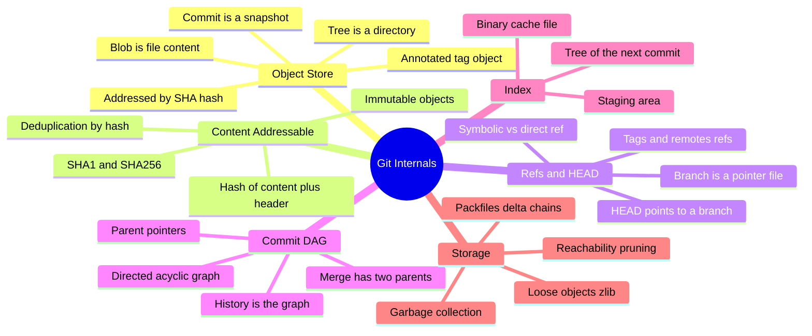
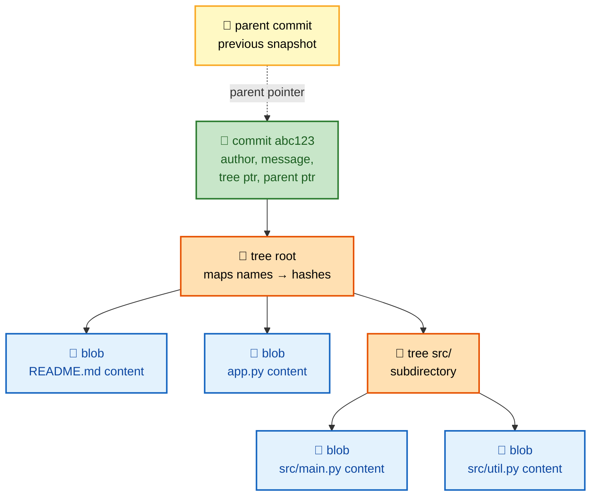
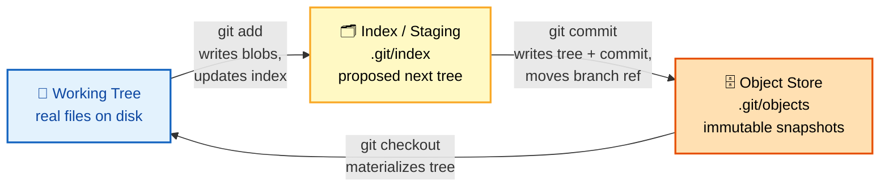
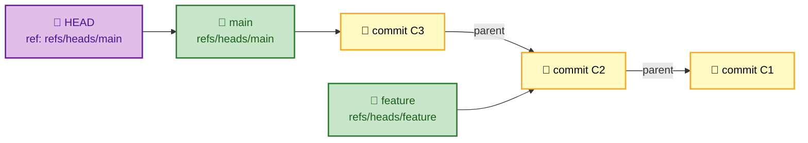
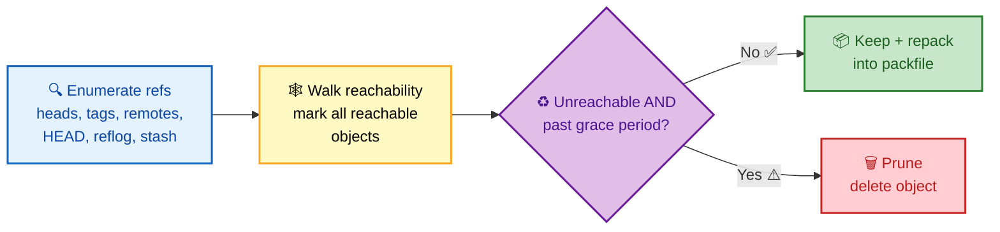

# SECTION 1: GIT INTERNALS

> **Scope:** What Git *actually is* under the hood — the `.git` directory, the object model (blob/tree/commit/tag), content-addressable storage, refs & HEAD, the commit DAG, the staging index, packfiles/delta compression, and garbage collection.

---

## 🗺️ Visual Overview

**In one line:** Git is a **content-addressable key-value store** with a version-control UI bolted on top — master the four object types and the refs that point at them, and every other Git behavior (branching, merging, rebase, recovery) becomes an obvious consequence.

**Mind map — the internals at a glance** (skim first, revisit last):



**The object model — how a commit expands into a full snapshot** (green = commit, orange = trees, blue = blobs):



**The three areas of a commit — working tree → index → object store** (the `add`/`commit` data flow):



> 🧠 **Memory hooks (mnemonics):**
> - **Four object types:** *"Big Trees Cast Tall-shadows"* → **B**lob, **T**ree, **C**ommit, **T**ag. Blob = bytes, Tree = directory, Commit = snapshot + history, Tag = named pointer.
> - **Content addressing:** the name *is* the hash of the content — "**change the content, change the name.**" Identical content anywhere = one stored object.
> - **Three areas:** **W**orking tree → **I**ndex → **R**epository. "**W**e **I**ntend to **R**ecord." `add` moves W→I, `commit` moves I→R.
> - **A branch is just a 41-byte file** containing a commit hash. "Branches are cheap because they're a *pointer*, not a copy."

---

## 1. The `.git` Directory

> 🎯 **Interview weight: High** — "what's inside `.git`?" separates people who understand Git from people who memorized commands.

**In one line:** The `.git` directory *is* the repository — everything about history, config, and refs lives there; your working files are just a materialized checkout of one commit.

When you run `git init`, Git creates a `.git` directory. Delete it and you have plain files; keep it and you have a full repo with complete history. Everything Git knows is on disk here, in a small, inspectable layout.

```
.git/
├── HEAD            # points at the current branch (ref: refs/heads/main)
├── config          # repo-local configuration
├── index           # the staging area (binary)
├── objects/        # the object database (blobs, trees, commits, tags)
│   ├── ab/cdef...   # loose object: first 2 hex = dir, rest = filename
│   └── pack/        # packfiles (compressed delta storage)
├── refs/
│   ├── heads/       # local branches → each file holds a commit SHA
│   ├── tags/        # tags
│   └── remotes/     # remote-tracking branches
├── logs/           # reflog: history of where refs pointed
└── hooks/          # client-side hook scripts
```

| Path | What it holds | Why it matters |
|---|---|---|
| `HEAD` | Symbolic ref to current branch | Determines what "you are on" and the next commit's parent |
| `objects/` | All content, addressed by SHA | The immutable, append-only heart of Git |
| `refs/heads/` | One file per branch = a commit SHA | Branches are just pointers into the DAG |
| `index` | Binary snapshot of the next commit | The staging area |
| `logs/` | Reflog entries per ref | Your safety net for recovery |

> 🔍 **Under the hood:** `git` commands are thin wrappers over this filesystem. `git branch feature` literally writes a file `refs/heads/feature` containing the current commit hash — that's why creating a branch is instant regardless of repo size.

### Key commands
```bash
git init                      # create the .git directory
cat .git/HEAD                 # shows: ref: refs/heads/main
cat .git/refs/heads/main      # shows the 40-char commit SHA main points to
git rev-parse HEAD            # resolve HEAD to a full commit SHA
git count-objects -vH         # how many loose/packed objects + disk usage
```

---

## 2. The Object Model — Blob, Tree, Commit, Tag

> 🎯 **Interview weight: High** — the single most important internals topic. Expect "walk me through what a commit points to."

**In one line:** Git stores everything as one of four immutable object types, each addressed by the SHA-1 of `<type> <size>\0<content>`, and they reference each other to form a complete versioned filesystem.

**The four object types:**

| Object | Represents | Contains | Points to |
|---|---|---|---|
| **Blob** | File *content* (no name, no mode) | Raw bytes of a file | Nothing |
| **Tree** | A directory | List of `(mode, type, hash, name)` entries | Blobs and sub-trees |
| **Commit** | A snapshot + metadata | Root tree hash, parent(s), author, committer, message | One tree + 0..N parents |
| **Tag** (annotated) | A named, signed pointer | Target hash, tagger, message, optional GPG sig | Usually a commit |

**Critical insight — a commit stores a *snapshot*, not a diff.** Each commit points to a complete tree representing the *entire* project at that moment. Diffs are *computed on demand* by comparing two trees; they are never stored.

> 💡 **Interview trap:** "Does Git store diffs between commits?" → **No.** Git stores full snapshots (trees). It *shows* diffs by comparing snapshots. (Delta compression in packfiles is a separate storage-layer optimization — see §7.)

> 🔍 **Under the hood:** A blob has **no filename**. The *name* lives in the tree entry that references the blob. This is why renaming a file with unchanged content adds no new blob — the same blob hash is simply referenced under a new name in the new tree. Git *detects* renames heuristically at display time; it doesn't record them.

### Key commands
```bash
echo "hello" | git hash-object --stdin   # compute the blob SHA for content
git cat-file -t <sha>                     # show an object's TYPE (blob/tree/commit/tag)
git cat-file -p <sha>                     # pretty-print an object's CONTENT
git cat-file -p HEAD                       # see a commit: tree, parent, author, message
git cat-file -p HEAD^{tree}                # see the root tree (names → hashes)
git ls-tree HEAD                           # list the root tree entries
```

Example of inspecting a commit object:
```bash
$ git cat-file -p HEAD
tree 9f4d...                # root directory snapshot
parent 7a2b...             # previous commit (history link)
author  Jane <j@x.io> 1730000000 +0000
committer Jane <j@x.io> 1730000000 +0000

Add login handler          # the commit message
```

---

## 3. Content-Addressable Storage & Hashing

> 🎯 **Interview weight: High** — "why is Git's integrity so strong?" and "SHA-1 vs SHA-256" both land here.

**In one line:** Every object's *address is the cryptographic hash of its content plus a small header*, which makes objects immutable, self-verifying, and automatically deduplicated.

**How the hash is computed:** Git prepends a header `"<type> <size>\0"` to the content, then hashes the whole thing:

```
blob 6\0hello\n   →  SHA-1  →  ce013625030ba8dba906f756967f9e9ca394464a
```

**Consequences of content addressing:**

- **Immutability:** change one byte and you get a *different* object with a *different* hash — the old object is untouched. You never "edit" an object; you create a new one.
- **Integrity / tamper-evidence:** because a commit names its tree by hash, and the tree names its blobs by hash, and each commit names its parent by hash, altering *anything* in history changes *every* downstream hash. History is a hash chain (a Merkle DAG).
- **Deduplication:** identical content = identical hash = stored once, even across branches, directories, or copies.

**SHA-1 vs SHA-256:**

| | SHA-1 (default legacy) | SHA-256 (opt-in) |
|---|---|---|
| Hash length | 160-bit (40 hex) | 256-bit (64 hex) |
| Status | Cryptographically weakened (collision demonstrated) | Modern, collision-resistant |
| Git use | Historical default | `git init --object-format=sha256` |
| Interop | Universal | Limited tooling/hosting support (transitioning) |

> ⚠️ **Nuance:** Git's SHA-1 collision risk is mitigated in practice — Git ships **collision-detection** (hardened SHA-1) that refuses known collision patterns. SHA-256 repos exist but interoperability across hosts/tools is still maturing, so SHA-1 remains the common default.

> 💡 **Interview line:** "Git is a Merkle DAG — the commit hash transitively fixes the entire tree and all ancestors, so the hash you `git fetch` is a verifiable fingerprint of the full history."

### Key commands
```bash
git hash-object file.txt          # show the SHA-1 Git would assign to this file's content
git cat-file --batch-check        # verify object type/size/hash for piped SHAs
git fsck --full                   # verify integrity of the whole object database
```

---

## 4. Refs & HEAD

> 🎯 **Interview weight: High** — "what is a branch, really?" and "what is HEAD?" are near-universal.

**In one line:** A **ref** is a human-readable name that stores a commit SHA (a pointer into the DAG); **HEAD** is a special ref that names *where you currently are* and what the next commit's parent will be.

**Ref categories:**

| Ref type | Path | Points to |
|---|---|---|
| Local branch | `refs/heads/<name>` | A commit (moves as you commit) |
| Tag | `refs/tags/<name>` | Usually a fixed commit (doesn't move) |
| Remote-tracking | `refs/remotes/<remote>/<name>` | Last-known remote branch tip |

**HEAD is usually *symbolic*** — it contains `ref: refs/heads/main` rather than a raw SHA. This indirection is the whole trick:

- **Attached HEAD:** `HEAD → refs/heads/main → <commit>`. When you commit, Git writes the new commit and updates `main` to point at it; HEAD follows automatically.
- **Detached HEAD:** `HEAD → <commit>` directly (no branch). Commits you make aren't referenced by any branch, so they become unreachable when you move away (recoverable via reflog — see Section 6).



> 🔍 **Under the hood:** "Committing" is three cheap filesystem operations — write a tree object, write a commit object, and update one ref file to the new commit SHA. The branch *moving forward* is literally overwriting `refs/heads/main` with a new 40-char string.

### Key commands
```bash
git symbolic-ref HEAD           # show which branch HEAD points to
git rev-parse --abbrev-ref HEAD # current branch name (or HEAD if detached)
git update-ref refs/heads/x <sha>   # low-level: point a ref at a commit
git show-ref                    # list all refs and their SHAs
git for-each-ref                # scriptable ref listing
```

---

## 5. The Commit DAG (History as a Graph)

> 🎯 **Interview weight: High** — understanding history as a DAG unlocks merge, rebase, and `merge-base`.

**In one line:** Git history is a **Directed Acyclic Graph** of commits linked by parent pointers — a merge is simply a commit with two (or more) parents, and "history" is just the set of commits reachable from a ref.

**Why a DAG and not a list:**

- Each commit records its **parent(s)** by hash. A normal commit has one parent; the very first (root) commit has zero; a **merge commit** has two or more.
- "Reachable" = you can follow parent pointers from a ref back to a commit. `git log main` walks the DAG backward from `main`.
- The graph is **acyclic** because a parent is always an older, already-existing (immutable) commit — you can never point forward.

**Key DAG operations you'll be asked about:**

| Concept | Definition |
|---|---|
| **Reachability** | Commit X is reachable from ref R if a parent-chain leads R → … → X |
| **Merge base** | The best common ancestor of two commits (the fork point) |
| **Ancestor / descendant** | Positions along parent chains |
| **Topological order** | Ordering commits so parents come before children (`git log --topo-order`) |

> 💡 **Interview line:** "Branches, tags, and HEAD are *entry points* into one shared DAG of immutable commits. Deleting a branch doesn't delete commits — it just removes an entry point, potentially making commits unreachable (and eligible for GC)."

### Key commands
```bash
git log --oneline --graph --all    # visualize the DAG across all refs
git merge-base main feature        # find the common ancestor (fork point)
git rev-list --count main          # count commits reachable from main
git log --topo-order               # parent-before-child ordering
git cat-file -p HEAD | grep parent # see raw parent pointers of a commit
```

---

## 6. The Index / Staging Area

> 🎯 **Interview weight: High** — "what is the staging area and why does it exist?" is a favorite.

**In one line:** The **index** (`.git/index`) is a binary file that holds the *proposed next commit* — a flat list of paths with their blob hashes, mode, and stat cache — sitting between your working tree and the object store.

**Why a staging area exists:** it decouples "what I've changed" from "what I'll record." You can craft a clean, logical commit from a messy working tree (`git add -p` to stage selected hunks), and Git can compute status fast by comparing three states.

**The three states of a file:**

| State | Where it differs | Command to move it |
|---|---|---|
| **Modified** | Working tree ≠ index | `git add` (→ staged) |
| **Staged** | Index ≠ HEAD | `git commit` (→ committed) |
| **Committed** | In the object store, reachable | — |

> 🔍 **Under the hood:** `git add file` does two things — it writes a **blob** into `.git/objects` *immediately*, and records `file → that blob hash` in the index. So by staging, your content is already saved in the object database before you ever commit. At `git commit`, Git turns the index into **tree** object(s), writes a **commit** object pointing at the root tree + current HEAD as parent, and advances the branch ref.

> ⚠️ **Gotcha:** The index caches file stat data (mtime, size, inode) to avoid re-hashing unchanged files. A corrupted or stale index causes phantom "changes"; `git status` re-checks and `git read-tree`/`git reset` can rebuild it.

### Key commands
```bash
git status                     # compare working tree ↔ index ↔ HEAD
git ls-files --stage           # dump the index: mode, blob hash, stage, path
git add -p                     # interactively stage selected hunks
git write-tree                 # low-level: turn the index into a tree object
git diff                       # working tree vs index (unstaged changes)
git diff --cached              # index vs HEAD (staged changes)
```

---

## 7. Packfiles & Delta Compression

> 🎯 **Interview weight: Medium** — "if commits are full snapshots, why isn't the repo huge?" lands here.

**In one line:** Loose objects are individually zlib-compressed; periodically Git packs many objects into a **packfile** that stores similar objects as **deltas** against one another, giving huge space savings without changing the logical snapshot model.

**Loose vs packed storage:**

| | Loose objects | Packfile |
|---|---|---|
| Layout | One zlib file per object in `objects/ab/cdef…` | Many objects in `objects/pack/*.pack` + `.idx` |
| Compression | zlib per object | zlib **+ delta chains** between similar objects |
| Created by | Normal `add`/`commit` | `git gc`, `git repack`, or `git push`/`fetch` |
| Lookup | Direct path | Via the `.idx` index file |

**Delta compression:** within a packfile, Git picks a "base" object and stores others as *diffs* (deltas) against it — e.g., version 51 of a file stored as "version 50 plus these bytes." A chain of deltas resolves back to a full base object.

> 🔍 **Under the hood — the model vs the storage:** Logically, every commit still references a *complete* tree of full-content blobs. Delta compression is purely a **storage encoding** — Git reconstructs the full object transparently on read. Snapshots (logical) and deltas (physical) coexist; don't conflate them.

> 💡 **Interview line:** "Git resolves the apparent paradox — 'full snapshots yet tiny repos' — by separating the *logical model* (immutable full snapshots) from the *physical storage* (delta-compressed packs)."

### Key commands
```bash
git gc                         # pack loose objects, prune, optimize
git repack -ad                 # aggressively repack into a single packfile
git count-objects -vH          # loose vs packed counts + sizes
git verify-pack -v .git/objects/pack/pack-*.idx   # inspect delta chains & depths
```

---

## 8. Garbage Collection & Reachability

> 🎯 **Interview weight: Medium** — ties to recovery: "when do unreferenced commits actually get deleted?"

**In one line:** Objects that are **unreachable** from any ref (branch, tag, HEAD, reflog, stash) are eligible for garbage collection, which prunes them and repacks the rest — but the reflog keeps "orphaned" commits alive for a grace period, which is why recovery is usually possible.

**What keeps an object alive:**

- Any ref pointing at it (branches, tags, remotes)
- Being an ancestor of a reachable commit (trees/blobs reachable through commits)
- A **reflog** entry (default: ~90 days for reachable, ~30 for unreachable)
- The stash (`refs/stash`) and worktree HEADs

**When GC runs:** automatically when loose objects exceed a threshold (`gc.auto`), or manually via `git gc`. It moves loose objects into packs, drops unreachable objects past their expiry, and expires old reflog entries.



> ⚠️ **Recovery window:** A commit you "lost" (e.g., after a hard reset or deleted branch) is *unreachable* but not yet *deleted* — the reflog still references it. This is exactly why `git reflog` + `git branch recover <sha>` saves you until GC expiry. An aggressive `git gc --prune=now` closes that window.

### Key commands
```bash
git gc                              # normal GC (respects grace periods)
git fsck --unreachable              # list unreachable but still-present objects
git reflog expire --expire=now --all  # force-expire reflog (DANGER: removes safety net)
git gc --prune=now                  # prune immediately (DANGER: unrecoverable)
```

---

## Interview Questions & Answers

**Q1. Does Git store diffs or snapshots? Then why are repos small?**
**Answer:** Git stores **full snapshots** — each commit points to a complete tree of full-content blobs; diffs are computed on the fly by comparing trees. **Internals:** repos stay small because the *storage layer* (packfiles) delta-compresses similar objects, and identical content is deduplicated by hash — but the *logical model* remains immutable full snapshots. **Follow-up ("so is delta a diff between commits?"):** No — deltas are chosen by similarity heuristics within a pack, not by commit order; they're a physical encoding, invisible to the model.

**Q2. What is a branch, precisely?**
**Answer:** A branch is a **movable pointer** — a ~41-byte file under `refs/heads/` containing a commit SHA. **Internals:** creating a branch writes one small file, so it's O(1) regardless of repo size; committing advances that file to the new commit. **Follow-up ("what makes it move automatically?"):** HEAD is a *symbolic ref* to the branch, so a commit updates the branch and HEAD follows.

**Q3. What exactly happens when you run `git commit`?**
**Answer:** Git converts the **index** into tree object(s), writes a **commit object** referencing the root tree and the current HEAD as parent(s), then updates the current branch ref to the new commit. **Internals:** all content was already written as blobs at `git add` time; commit adds trees + one commit object and moves a pointer. **Follow-up ("what if the index is empty of changes?"):** commit refuses unless `--allow-empty`, because the resulting tree equals HEAD's tree.

**Q4. How does Git guarantee history integrity?**
**Answer:** It's a **Merkle DAG** — a commit names its tree by hash, the tree names blobs/subtrees by hash, and the commit names its parent by hash. **Internals:** altering any byte changes that object's hash and cascades to every descendant hash, so tampering is detectable and the top commit hash fingerprints the entire history. **Follow-up ("SHA-1 is broken, is Git unsafe?"):** Git uses hardened SHA-1 with collision detection, and SHA-256 repos exist; practical risk is very low.

**Q5. Difference between attached and detached HEAD?**
**Answer:** Attached HEAD points to a *branch* (commits advance the branch); detached HEAD points directly to a *commit* (new commits belong to no branch). **Internals:** `.git/HEAD` holds `ref: refs/heads/x` when attached, or a raw SHA when detached. **Follow-up ("why is detached HEAD dangerous?"):** commits made there become unreachable once you switch away, unless you create a branch — recover via reflog.

**Q6. Why does the staging area exist?**
**Answer:** To decouple *what changed* from *what you record*, enabling clean, logical, partial commits from a messy working tree. **Internals:** the index is a binary file mapping paths to blob hashes + stat cache; `git add -p` stages individual hunks. **Follow-up ("does `git add` save my content?"):** Yes — it writes the blob to the object store immediately, so staged content survives even before commit.

**Q7. When are unreferenced commits actually deleted?**
**Answer:** When they're **unreachable** from all refs *and* past the reflog grace period, during garbage collection. **Internals:** GC walks reachability from refs/reflog/stash, keeps/repacks reachable objects, and prunes expired unreachable ones. **Follow-up ("how do I recover one before GC?"):** `git reflog` to find the SHA, then `git branch save <sha>`; avoid `git gc --prune=now` which closes the window.

---

## Troubleshooting Scenarios

- **`git status` shows files as modified that you didn't touch:** likely a stale index stat-cache or line-ending/`autocrlf` normalization; run `git status` again, check `.gitattributes`, or `git add --renormalize .`.
- **Repo is huge / clones are slow:** large blobs in history; inspect with `git verify-pack` / `git rev-list --objects --all | sort -k2`, then consider history rewrite (Section 4) or LFS (Section 6).
- **`fatal: bad object` / corruption:** run `git fsck --full`; recover missing objects from another clone or the reflog (Section 6).
- **"Lost" commit after reset/rebase:** it's unreachable, not gone — `git reflog` then re-point a branch at the SHA (Section 6).
- **Too many loose objects, slow ops:** run `git gc` to pack and prune.

---

## Documentation Links

- [Pro Git — Git Internals (Plumbing & Porcelain)](https://git-scm.com/book/en/v2/Git-Internals-Plumbing-and-Porcelain)
- [Pro Git — Git Objects](https://git-scm.com/book/en/v2/Git-Internals-Git-Objects)
- [Pro Git — Git References](https://git-scm.com/book/en/v2/Git-Internals-Git-References)
- [Pro Git — Packfiles](https://git-scm.com/book/en/v2/Git-Internals-Packfiles)
- [git hash-object / cat-file docs](https://git-scm.com/docs/git-cat-file)
- [Git SHA-256 transition plan](https://git-scm.com/docs/hash-function-transition)

---

**[← Back: Git Index](README.md)** | **[Next: Branching & Merging →](02-BRANCHING-MERGING.md)**
